# 第30章—组件实战：Message全局提示组件

我们经常会用 Message 组件来展示一些成功、失败的提示：

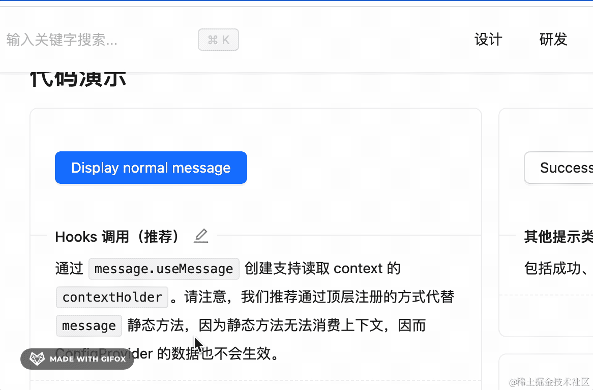

和一般组件写在 JSX 里不同：

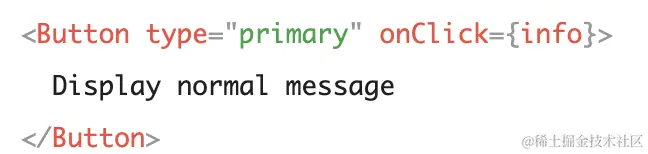

它是通过 api 的方式用的：

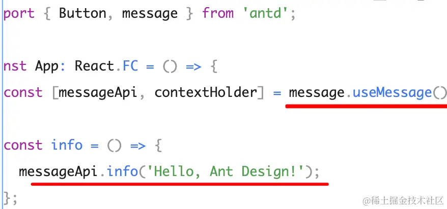

那它是怎么实现的呢？

我们来分析下思路：

其实单纯就这个列表来说，很简单：

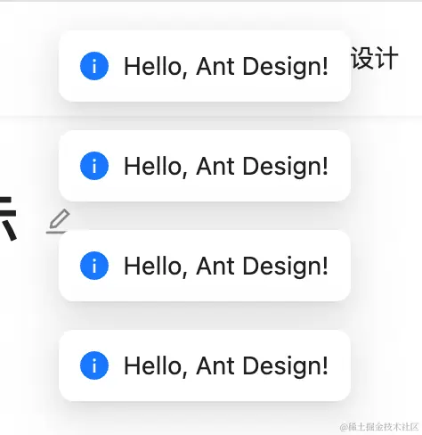

我们学习过渡动画的时候，写过这种列表：

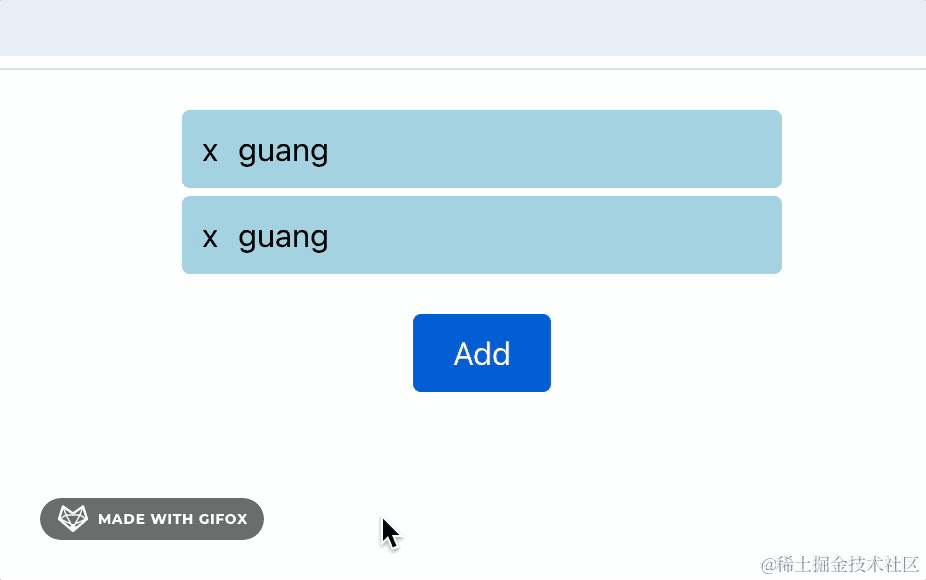

用 react-transition-group 或者 react-spring 都可以做。

但是怎么通过 api 的方式渲染这个列表组件呢？

先看看其他组件库是怎么做的，比如 arco design：

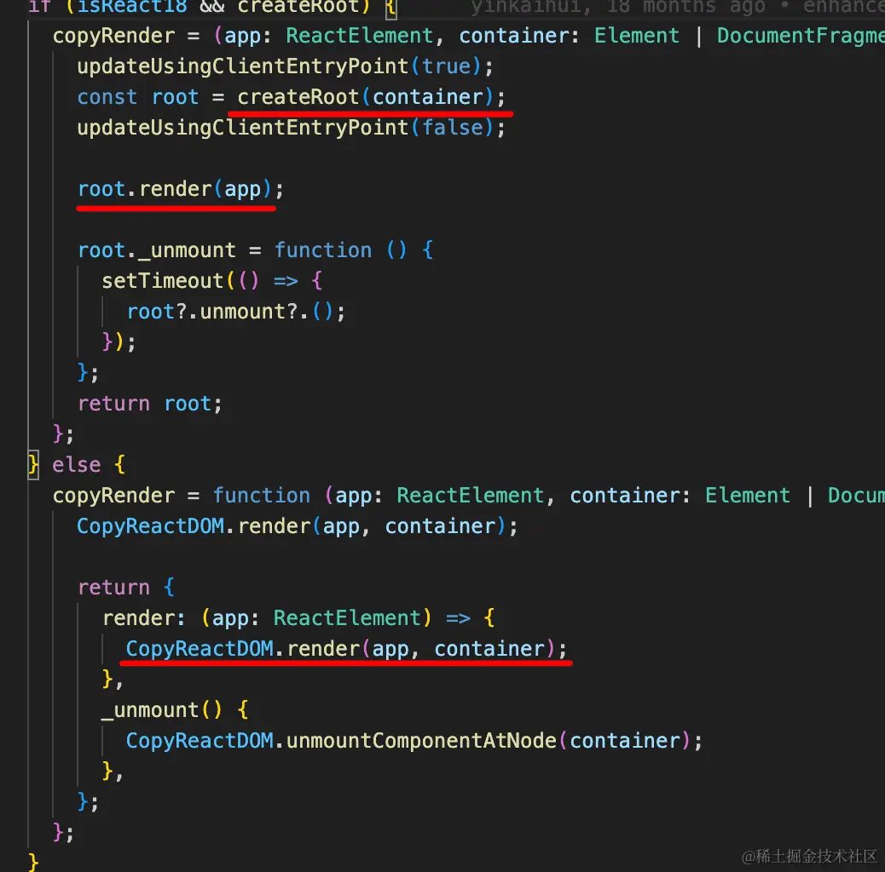

它是在组件渲染的过程中再重新渲染一个 root。

也就是你调用 message.info 的时候，它会创建一个新的 dom，然后通过 ReactDOM.render（或者 createRoot）在这个 dom 下新渲染一个组件树。

但是，这种方式会报 warning。

acro design 是这么解决的：

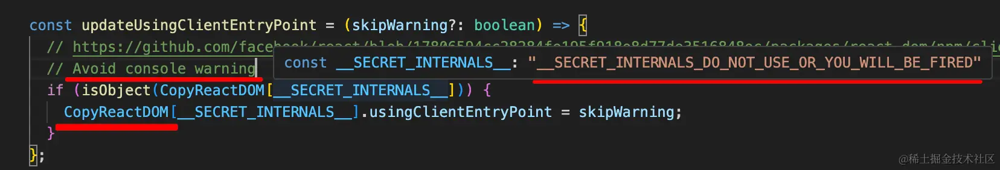

通过修改了内部的一个 waring 的开关来去掉了这个警告。

人家不让你这么用，你非得这么用，很显然，这样的实现方式不大好。

那怎么实现呢？

其实 message.info 只是需要调用列表元素的 add、remove 等方法。

那我们通过 forwardRef 的方式把 ref 转发出去，然后保存在 context 里。

这样 useMessage 里用 useContext 拿到这个 ref，是不是就可以调用 add、remove 等方法来添加删除 Message 了呢？


回过头来看下这个 Message 组件：


我们只需要维护一个数组 state，把它的 add、remove 方法通过 ref 暴露出去，保存在 context 里，使用的时候通过 useMesage 里的 useContext 拿到 add、remove 方法调用就好了。

渲染这个数组的时候要用 createPortal 在 body 下渲染，并且还要加上过渡动画。

思路理清了，我们来写下代码。

```
npx create-react-app --template=typescript message-component
```

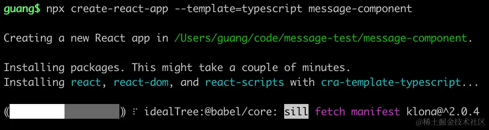

用 cra 创建个 react 项目。

改下 index.tsx

```javascript
import ReactDOM from 'react-dom/client';
import App from './App';

const root = ReactDOM.createRoot(
  document.getElementById('root') as HTMLElement
);
root.render(<App />);
```
创建 Mesage/index.tsx

```javascript
import { CSSProperties, FC, ReactNode } from "react";

export type Position = 'top' | 'bottom';

export interface MessageProps {
    style?: CSSProperties;
    className?: string | string[];
    content: ReactNode;
    duration?: number;
    id?: number;
    position?: Position;
}

export const MessageProvider: FC<{}> = (props) => {
    return <div></div>
}
```
这里的 MessageProps 就是每个 message 可以设置的参数，比如 content、duration。

而 MessageProviderProps 是整体的默认设置。

我们先实现管理 Message 列表的 hook：

Message/useStore.tsx

```javascript
import { useState } from 'react';
import { MessageProps, Position } from '.';

type MessageList = {
    top: MessageProps[],
    bottom: MessageProps[]
}

const initialState = {
  top: [],
  bottom: []
};

function useStore(defaultPosition: Position) {
  const [messageList, setMessageList] = useState<MessageList>({ ...initialState });

  return {
    messageList,
    add: (messageProps: MessageProps) => {
  
    },

    update: (id: number, messageProps: MessageProps) => {

    },

    remove: (id: number) => {

    },
    
    clearAll: () => {

    },
  };
}

export default useStore;
```
就是通过 useState 创建一个列表，然后返回这个 state 和 add、remove、update、clearAll 方法。

列表有 top 和 bottom 两个，是因为可以在上面也可以出现在下面：

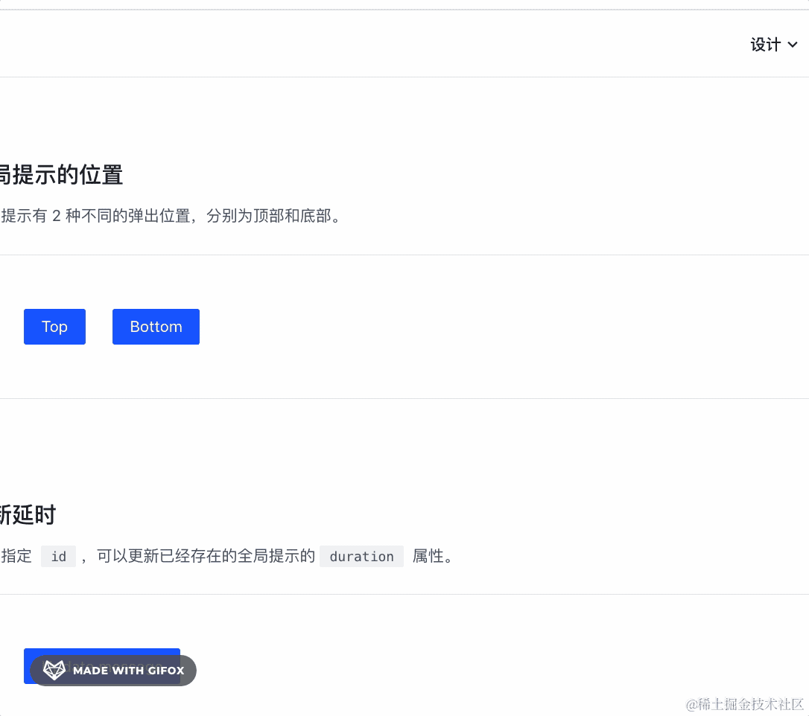

然后具体实现下 add、remove、update 方法。

先放全部代码再慢慢解释：

```javascript
import { useState } from 'react';
import { MessageProps, Position } from '.';

type MessageList = {
    top: MessageProps[],
    bottom: MessageProps[]
}

const initialState = {
  top: [],
  bottom: []
};

function useStore(defaultPosition: Position) {
  const [messageList, setMessageList] = useState<MessageList>({ ...initialState });

  return {
    messageList,
    add: (messageProps: MessageProps) => {
      const id = getId(messageProps);
      setMessageList((preState) => {
        if (messageProps?.id) {
          const position = getMessagePosition(preState, messageProps.id);
          if (position) return preState;
        }

        const position = messageProps.position || defaultPosition;
        const isTop = position.includes('top');
        const messages = isTop
          ? [{ ...messageProps, id }, ...(preState[position] ?? [])]
          : [...(preState[position] ?? []), { ...messageProps, id }];

        return {
          ...preState,
          [position]: messages,
        };
      });
      return id;
    },

    update: (id: number, messageProps: MessageProps) => {
      if (!id) return;

      setMessageList((preState) => {
        const nextState = { ...preState };
        const { position, index } = findMessage(nextState, id);

        if (position && index !== -1) {
          nextState[position][index] = {
            ...nextState[position][index],
            ...messageProps,
          };
        }

        return nextState;
      });
    },

    remove: (id: number) => {
        setMessageList((prevState) => {
            const position = getMessagePosition(prevState, id);

            if (!position) return prevState;
            return {
                ...prevState,
                [position]: prevState[position].filter((notice) => notice.id !== id),
            };
        });
    },

    clearAll: () => {
      setMessageList({ ...initialState });
    },
  };
}

let count = 1;
export function getId(messageProps: MessageProps) {
  if (messageProps.id) {
    return messageProps.id;
  }
  count += 1;
  return count;
}

export function getMessagePosition(messageList: MessageList, id: number) {
    for (const [position, list] of Object.entries(messageList)) {
        if (list.find((item) => item.id === id)) {
            return position as Position;
        }
    }
}

export function findMessage(messageList: MessageList, id: number) {
    const position = getMessagePosition(messageList, id);
  
    const index = position ? messageList[position].findIndex((message) => message.id === id) : -1;
  
    return {
      position,
      index,
    };
}

export default useStore;
```
首先是 add：

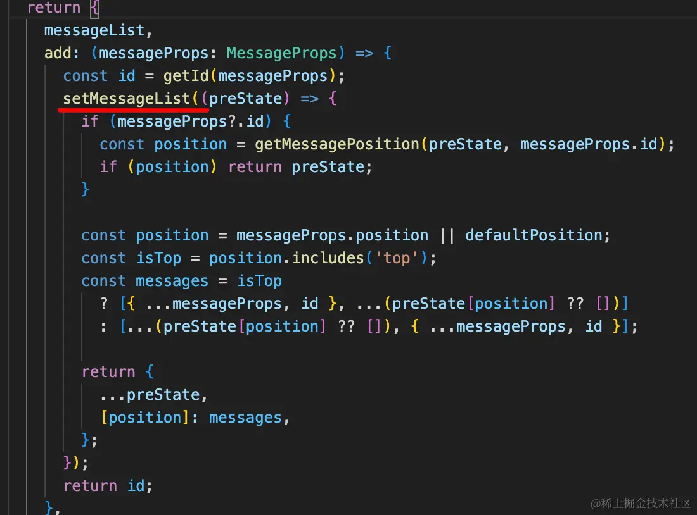

add 核心就是 setMessageList 添加一个元素。

用 getId 方法生成一个新的 id：

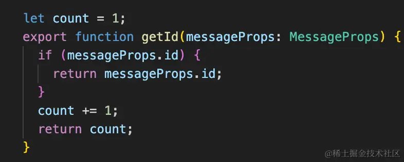

如果传入了 id 就直接用传入的，否则返回递增的 id。

然后先根据 id 查找有没有已有的 message，如果有就不添加，直接返回之前的：

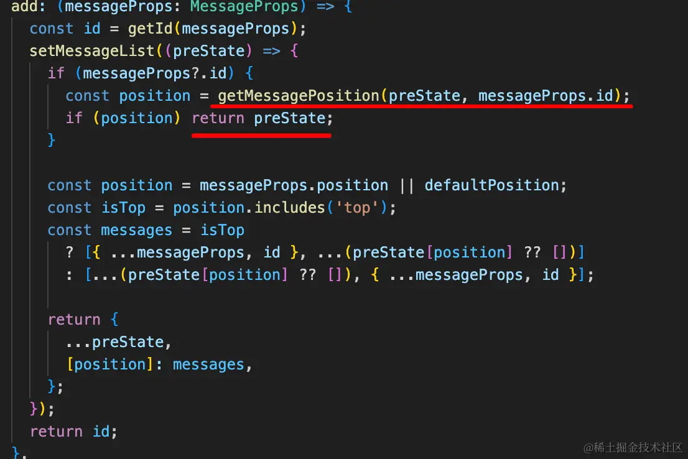

否则，top 的在前面插入一个元素，bottom 的在后面插入一个元素：

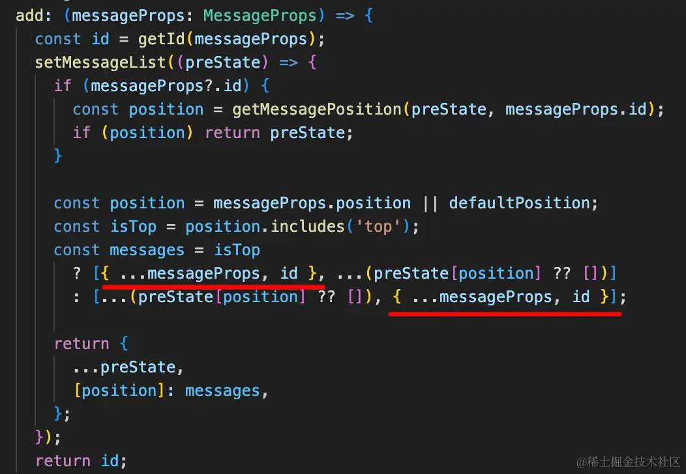

这个 getMessagePosition 方法就是遍历 top 和 bottom 数组，查找下有没有对应的 Message：

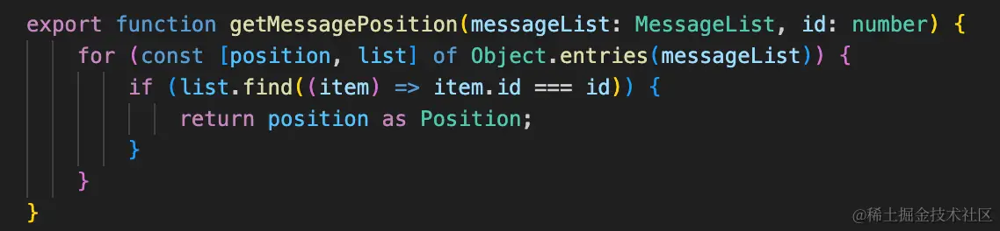

update 就是找到对应的 message 修改信息：

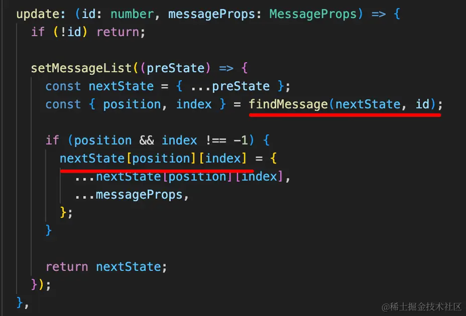

查找的方式就是先找到它在哪个数组里，然后返回对应数组中的下标：

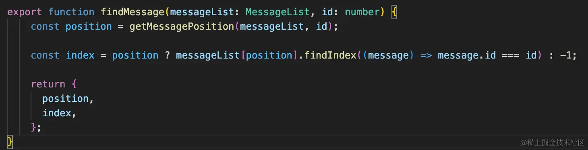

remove 是找到对应的数组，从中删除这个元素，clear 是重置数组：

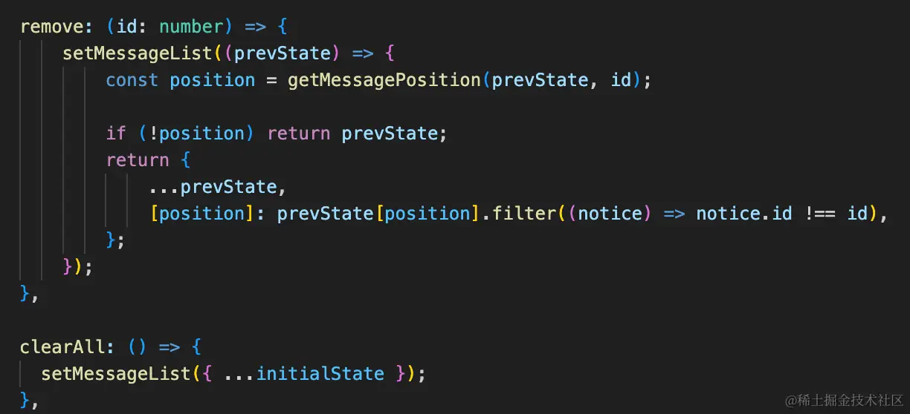

实现了列表的增删改查之后，加上过渡动画就能实现这种效果：


我们在 MessageProvider 里用 useStore 创建 message 列表，然后把它渲染出来：

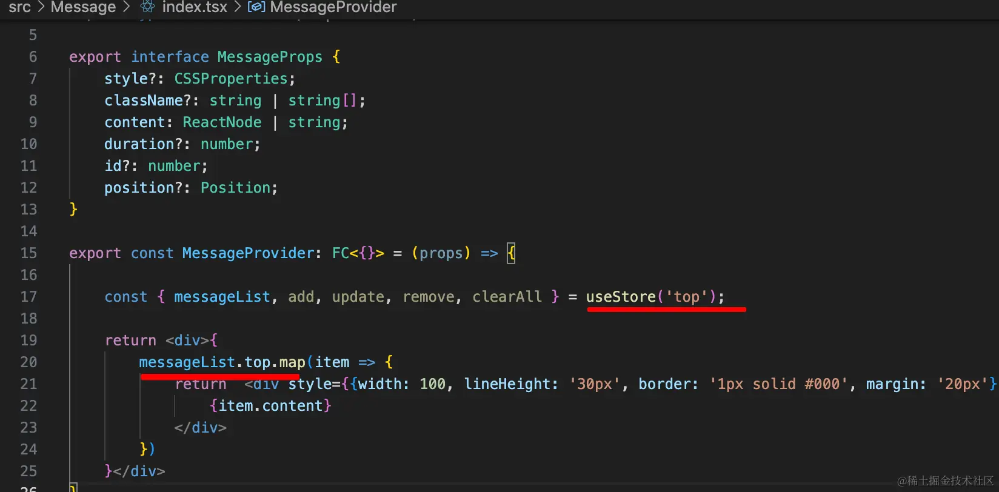

```javascript
import { CSSProperties, FC, ReactNode } from "react";
import useStore from "./useStore";

export type Position = 'top' | 'bottom';

export interface MessageProps {
    style?: CSSProperties;
    className?: string | string[];
    content: ReactNode | string;
    duration?: number;
    id?: number;
    position?: Position;
}

export const MessageProvider: FC<{}> = (props) => {

    const { messageList, add, update, remove, clearAll } = useStore('top');

    return <div>{
        messageList.top.map(item => {
            return  <div style={{width: 100, lineHeight: '30px', border: '1px solid #000', margin: '20px'}}>
                {item.content}
            </div>
        })
    }</div>
}
```
在 App.tsx 里调用下：

```javascript
import { MessageProvider } from "./Message";

function App() {
  return (
    <div>
      <MessageProvider></MessageProvider>      
    </div>
  );
}

export default App;
```
把开发服务跑起来：

```
npm run start
```

因为我们还没调用 add、remove 等方法添加 message，所以啥也没有：

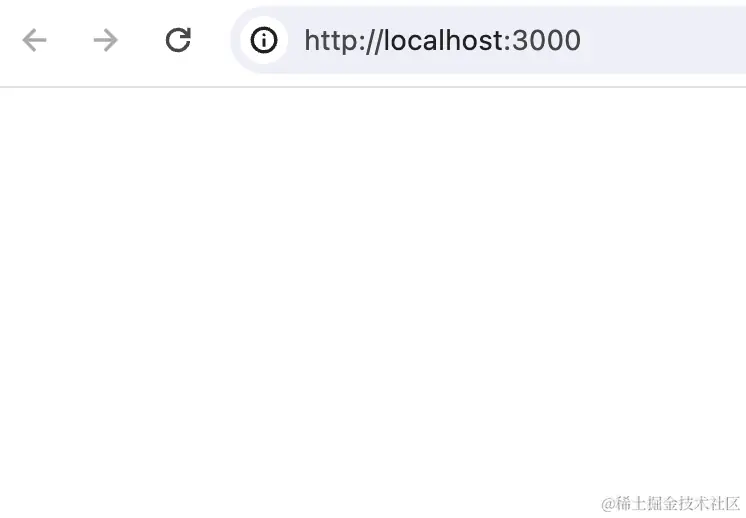

我们调用下：

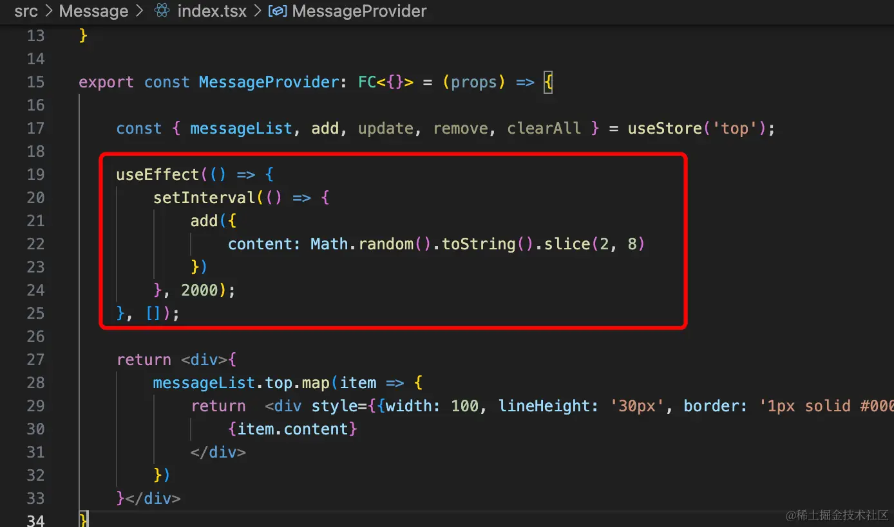

```javascript
useEffect(() => {
    setInterval(() => {
        add({
            content: Math.random().toString().slice(2, 8)
        })
    }, 2000);
}, []);
```


调用 add 添加 message 之后，页面就会渲染这个 message。

然后加上过渡动画，用 react-transition-group。

安装下：

```
npm install --save react-transition-group

npm install --save-dev @types/react-transition-group
```
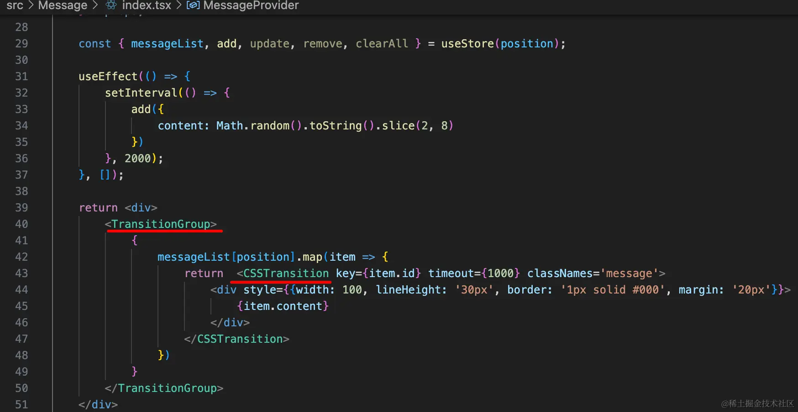

```javascript
return <div>
    <TransitionGroup>
        {
            messageList[position].map(item => {
                return  <CSSTransition key={item.id} timeout={1000} classNames='message'>
                    <div style={{width: 100, lineHeight: '30px', border: '1px solid #000', margin: '20px'}}>
                        {item.content}
                    </div>
                </CSSTransition>
            })
        }
    </TransitionGroup>
</div>
```
在 css 里写一下对应的 enter、enter-active 的具体样式：

Message/index.scss
```scss
.message-enter {
  opacity: 0;
  transform: scale(1.1);
}

.message-enter-active {
  opacity: 1;
  transform: scale(1);
  transition: opacity,transform 1s ease;
}

.message-exit {
  opacity: 1;
}

.message-exit-active {
  opacity: 0;
  transition: opacity 1s ease;
}
```
安装 sass 包:
```
npm install --save sass
```
在 Message/index.tsx 引入下：

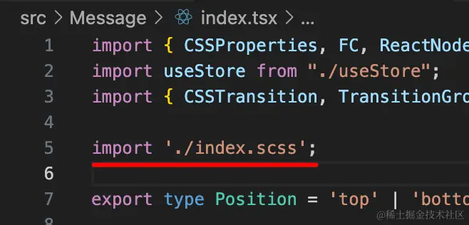

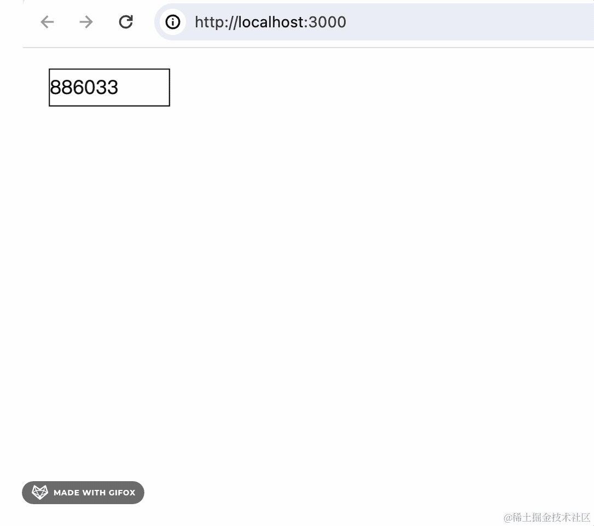

当然，现在的 message 比较丑，我们写一下样式：

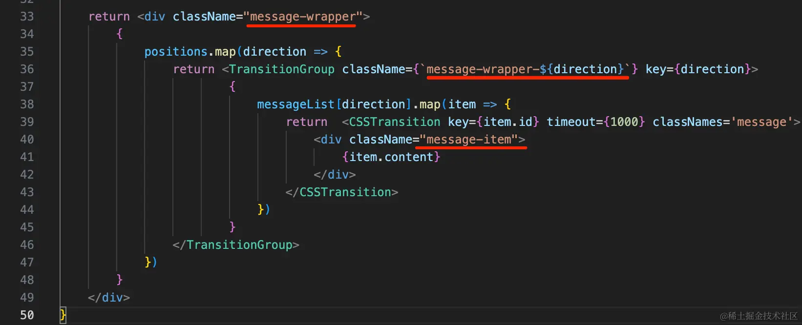

首先分为 .message-wrapper、.message-wrapper-top、.message-item 这三层。

```javascript
import { CSSProperties, FC, ReactNode, useEffect } from "react";
import useStore, { MessageList } from "./useStore";
import { CSSTransition, TransitionGroup } from "react-transition-group";

import './index.scss';

export type Position = 'top' | 'bottom';

export interface MessageProps {
    style?: CSSProperties;
    className?: string | string[];
    content: ReactNode | string;
    duration?: number;
    onClose?: (...args: any) => void;
    id?: number;
    position?: Position;
}

export const MessageProvider: FC<{}> = (props) => {

    const { messageList, add, update, remove, clearAll } = useStore('top');

    useEffect(() => {
        setInterval(() => {
            add({
                content: Math.random().toString().slice(2, 8)
            })
        }, 2000);
    }, []);

    const positions = Object.keys(messageList) as Position[];

    return <div className="message-wrapper">
        {
            positions.map(direction => {
                return <TransitionGroup className={`message-wrapper-${direction}`} key={direction}>
                        {
                            messageList[direction].map(item => {
                                return  <CSSTransition key={item.id} timeout={1000} classNames='message'>
                                    <div className="message-item">
                                        {item.content}
                                    </div>
                                </CSSTransition>
                            })
                        }
                </TransitionGroup>
            })
        }
    </div>
}
```
然后写下样式：

```scss
.message-wrapper {
  position: fixed;
  width: 100%;
  height: 100%;

  pointer-events: none;

  display: flex;
  flex-direction: column;
  justify-content: flex-start;
  align-items: center;

  &-top {
    position: absolute;
    top: 20px;
  }

  &-bottom {
    position: absolute;
    bottom: 20px;
  }
}

.message-item {
  margin-bottom: 12px;

  padding: 10px 16px;
  line-height: 14px;
  font-size: 14px;

  border: 1px solid #ccc;
  box-shadow: 0 0 3px #ccc;
  
  pointer-events: all;
}
```
最外层要设置 fixed，然后宽高 100%，然后加上 pointer-events:none 不响应鼠标事件。

wrapper 不响应鼠标事件，但是 message 还是要响应的，所以加上 pointer-event:all

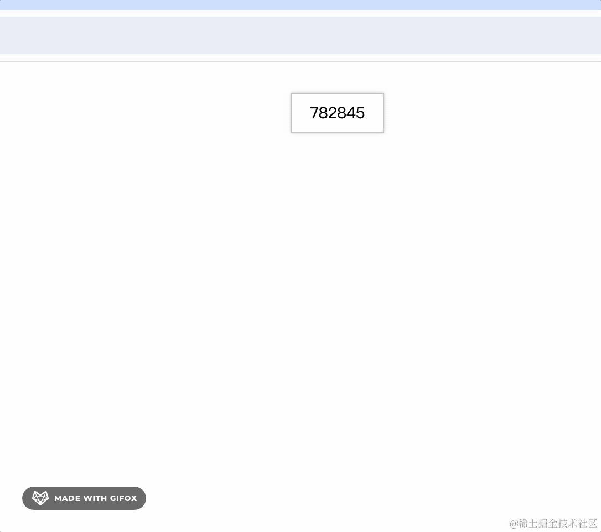

好看多了。

只是现在的 message 都是在 root 下渲染的：

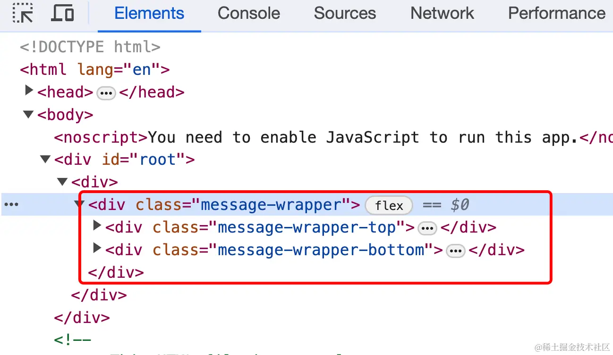

我们通过 createPortal 把它渲染到 body 下。

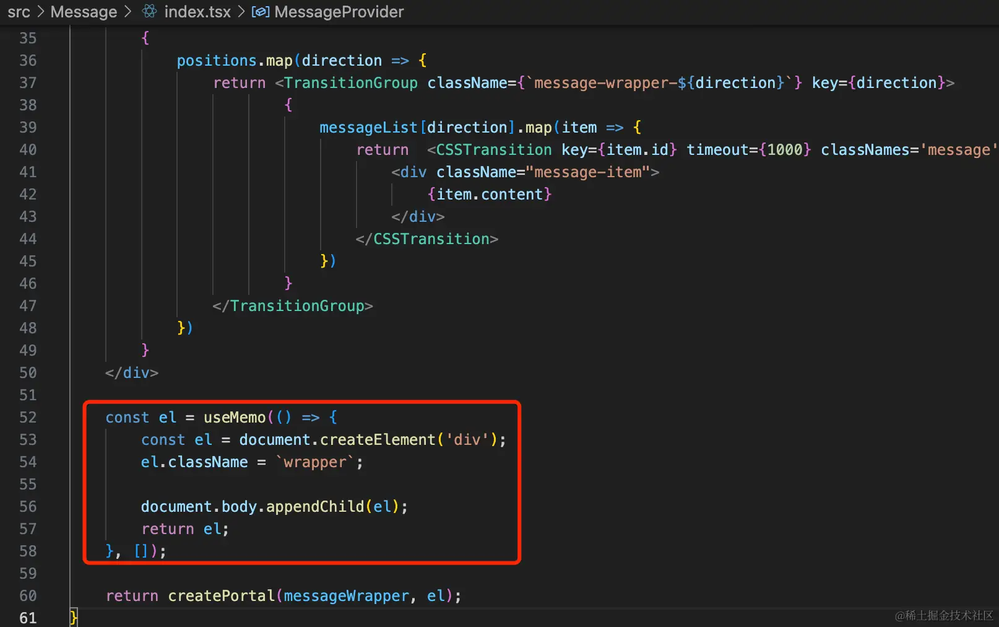

在 useMemo 里创建 div，因为依赖数组为空，所以只会创建一次。

然后用 createPortal 把 messageWrapper 渲染到它下面。

```javascript
import { CSSProperties, FC, ReactNode, useEffect, useMemo, useRef } from "react";
import useStore, { MessageList } from "./useStore";
import { CSSTransition, TransitionGroup } from "react-transition-group";

import './index.scss';
import { createPortal } from "react-dom";

export type Position = 'top' | 'bottom';

export interface MessageProps {
    style?: CSSProperties;
    className?: string | string[];
    content: ReactNode | string;
    duration?: number;
    onClose?: (...args: any) => void;
    id?: number;
    position?: Position;
}

export const MessageProvider: FC<{}> = (props) => {

    const { messageList, add, update, remove, clearAll } = useStore('top');

    useEffect(() => {
        setInterval(() => {
            add({
                content: Math.random().toString().slice(2, 8)
            })
        }, 2000);
    }, []);

    const positions = Object.keys(messageList) as Position[];

    const messageWrapper = <div className="message-wrapper">
        {
            positions.map(direction => {
                return <TransitionGroup className={`message-wrapper-${direction}`} key={direction}>
                        {
                            messageList[direction].map(item => {
                                return  <CSSTransition key={item.id} timeout={1000} classNames='message'>
                                    <div className="message-item">
                                        {item.content}
                                    </div>
                                </CSSTransition>
                            })
                        }
                </TransitionGroup>
            })
        }
    </div>

    const el = useMemo(() => {
        const el = document.createElement('div');
        el.className = `wrapper`;

        document.body.appendChild(el);
        return el;
    }, []);

    return createPortal(messageWrapper, el);
}
```

可以看到，现在就是直接渲染在 body 下的 .wrapper 里了：

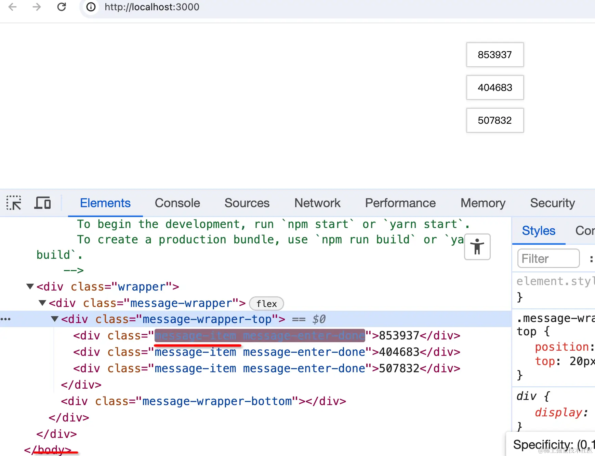

此外，我们还要处理下 hover 的事件，当 hover 的时候，这个提示会一直存在不会消失，直到鼠标移开才消失。

否则，到了 duration 的时间就会消失。

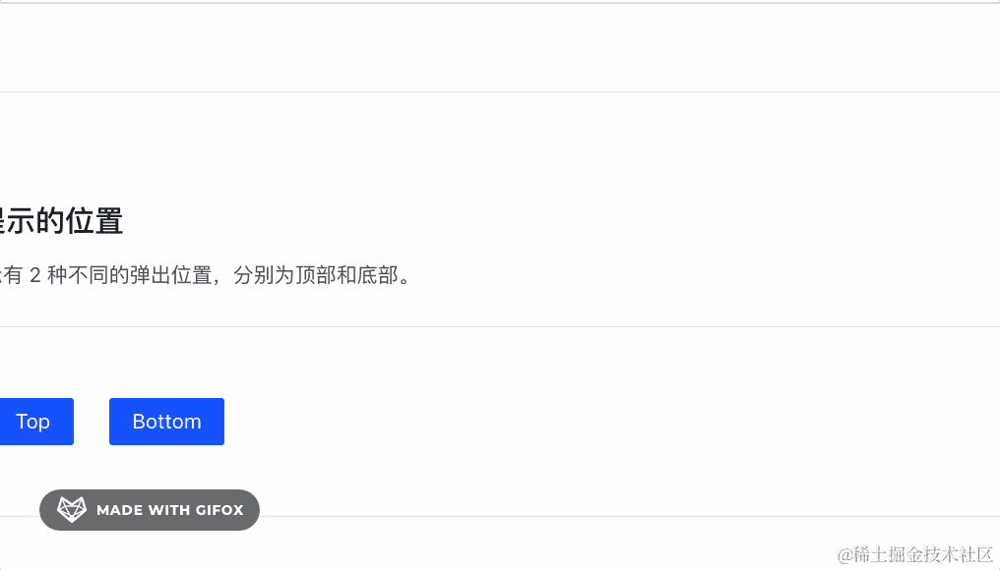

我们把逻辑放到一个自定义 hook 中写：

Message/useTimer.tsx

```javascript
import { useEffect, useRef } from 'react';

export interface UseTimerProps {
    id: number;
    duration?: number;
    remove: (id: number) => void;
}

export function useTimer(props: UseTimerProps) {
  const { remove, id, duration = 2000 } = props;

  const timer = useRef<number | null>(null);

  const startTimer = () => {
    timer.current = window.setTimeout(() => {
      remove(id);
      removeTimer();
    }, duration);
  };

  const removeTimer = () => {
    if (timer.current) {
      clearTimeout(timer.current);
      timer.current = null;
    }
  };

  useEffect(() => {
    startTimer();
    return () => removeTimer();
  }, []);

  const onMouseEnter = () => {
    removeTimer();
  };

  const onMouseLeave = () => {
    startTimer();
  };

  return {
    onMouseEnter,
    onMouseLeave,
  };
}
```

传入 message 的 id、duration，还有 remove 方法。

用 useEffect 执行 startTimer，到 duration 的时候删掉 message、停止定时器。

然后如果 mouseEnter 的时候删掉定时器，mouseLeave 重新开启。

调用下：

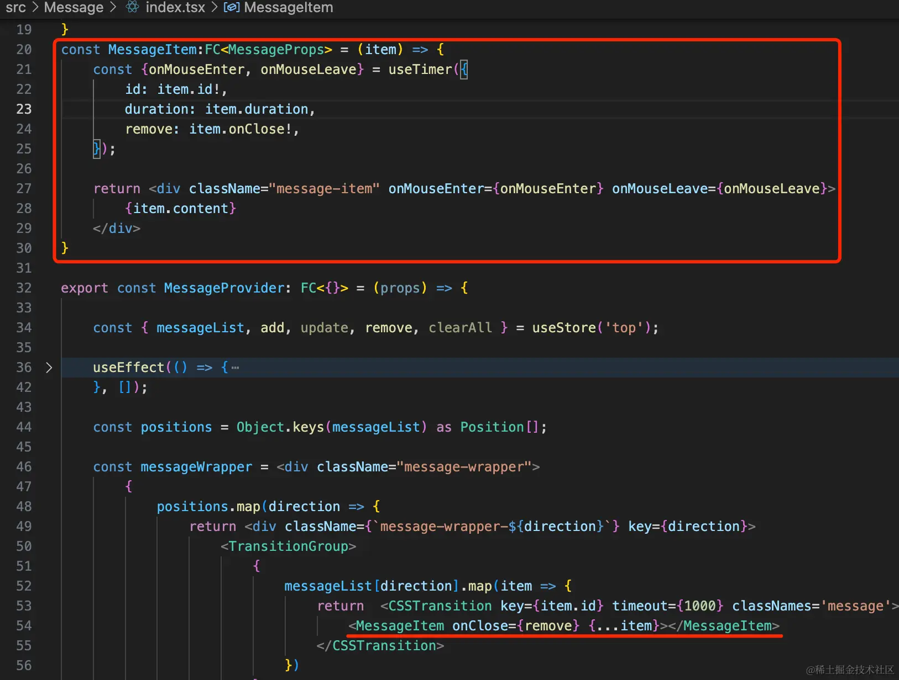

```javascript
import { CSSProperties, FC, ReactNode, useEffect, useMemo, useRef } from "react";
import useStore, { MessageList } from "./useStore";
import { CSSTransition, TransitionGroup } from "react-transition-group";

import './index.scss';
import { createPortal } from "react-dom";
import { useTimer } from "./useTimer";

export type Position = 'top' | 'bottom';

export interface MessageProps {
    style?: CSSProperties;
    className?: string | string[];
    content: ReactNode | string;
    duration?: number;
    onClose?: (...args: any) => void;
    id?: number;
    position?: Position;
}
const MessageItem:FC<MessageProps> = (item) => {
    const {onMouseEnter, onMouseLeave} = useTimer({
        id: item.id!,
        duration: item.duration,
        remove: item.onClose!,
    });

    return <div className="message-item" onMouseEnter={onMouseEnter} onMouseLeave={onMouseLeave}>
        {item.content}
    </div>
}

export const MessageProvider: FC<{}> = (props) => {

    const { messageList, add, update, remove, clearAll } = useStore('top');

    useEffect(() => {
        setInterval(() => {
            add({
                content: Math.random().toString().slice(2, 8)
            })
        }, 2000);
    }, []);

    const positions = Object.keys(messageList) as Position[];

    const messageWrapper = <div className="message-wrapper">
        {
            positions.map(direction => {
                return <div className={`message-wrapper-${direction}`} key={direction}>
                    <TransitionGroup>
                        {
                            messageList[direction].map(item => {
                                return  <CSSTransition key={item.id} timeout={1000} classNames='message'>
                                    <MessageItem onClose={remove} {...item}></MessageItem>
                                </CSSTransition>
                            })
                        }
                    </TransitionGroup>
                </div>
            })
        }
    </div>

    const el = useMemo(() => {
        const el = document.createElement('div');
        el.className = `wrapper`;

        document.body.appendChild(el);
        return el;
    }, []);

    return createPortal(messageWrapper, el);
}
```
可以看到过 2s message 就会消息，如果鼠标 hover 上去会直到移开鼠标再过 2s 消失。

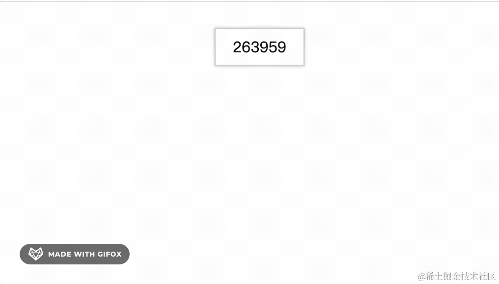

样式写完了，我们再来处理下调用方式的问题。

用的时候我们是通过 message.info 的方式用，前面分析过，需要通过 forwardRef 把 api 转发出去。


使用 forwardRef + useImperative 转发 ref。

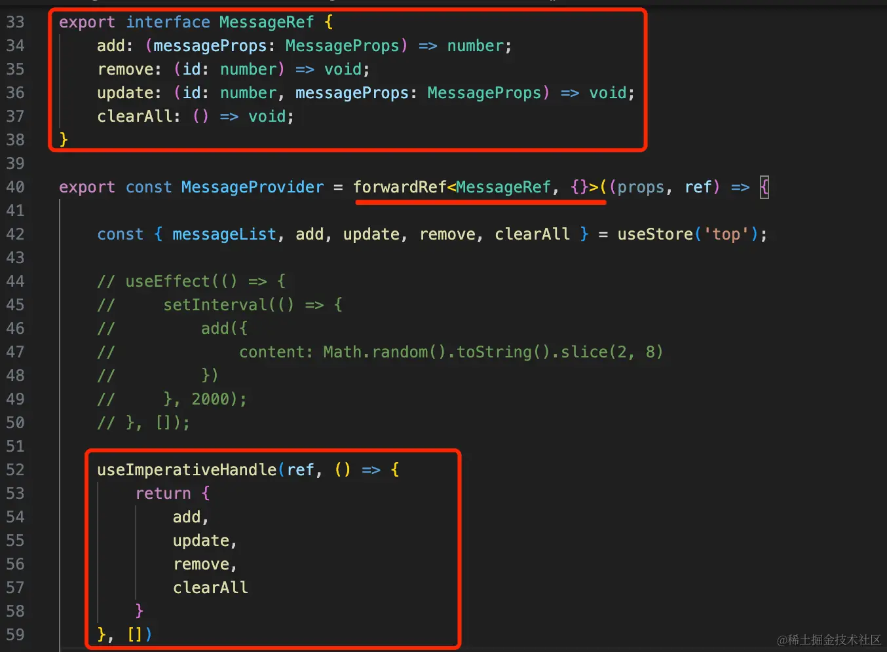

```javascript
import { CSSProperties, FC, ReactNode, forwardRef, useEffect, useImperativeHandle, useMemo, useRef } from "react";
import useStore, { MessageList } from "./useStore";
import { CSSTransition, TransitionGroup } from "react-transition-group";

import './index.scss';
import { createPortal } from "react-dom";
import { useTimer } from "./useTimer";

export type Position = 'top' | 'bottom';

export interface MessageProps {
    style?: CSSProperties;
    className?: string | string[];
    content: ReactNode | string;
    duration?: number;
    onClose?: (...args: any) => void;
    id?: number;
    position?: Position;
}

const MessageItem:FC<MessageProps> = (item) => {
    const {onMouseEnter, onMouseLeave} = useTimer({
        id: item.id!,
        duration: item.duration,
        remove: item.onClose!,
    });

    return <div className="message-item" onMouseEnter={onMouseEnter} onMouseLeave={onMouseLeave}>
        {item.content}
    </div>
}

export interface MessageRef {
    add: (messageProps: MessageProps) => number;
    remove: (id: number) => void;
    update: (id: number, messageProps: MessageProps) => void;
    clearAll: () => void;
}

export const MessageProvider = forwardRef<MessageRef, {}>((props, ref) => {

    const { messageList, add, update, remove, clearAll } = useStore('top');

    // useEffect(() => {
    //     setInterval(() => {
    //         add({
    //             content: Math.random().toString().slice(2, 8)
    //         })
    //     }, 2000);
    // }, []);

    useImperativeHandle(ref, () => {
        return {
            add,
            update,
            remove,
            clearAll
        }
    }, []);

    const positions = Object.keys(messageList) as Position[];

    const messageWrapper = <div className="message-wrapper">
        {
            positions.map(direction => {
                return <div className={`message-wrapper-${direction}`} key={direction}>
                    <TransitionGroup>
                        {
                            messageList[direction].map(item => {
                                return  <CSSTransition key={item.id} timeout={1000} classNames='message'>
                                    <MessageItem onClose={remove} {...item}></MessageItem>
                                </CSSTransition>
                            })
                        }
                    </TransitionGroup>
                </div>
            })
        }
    </div>

    const el = useMemo(() => {
        const el = document.createElement('div');
        el.className = `wrapper`;

        document.body.appendChild(el);
        return el;
    }, []);

    return createPortal(messageWrapper, el);
})
```
在 App.tsx 里引入下：

```javascript
import { useRef } from "react";
import { MessageProvider, MessageRef } from "./Message";

function App() {
  const messageRef = useRef<MessageRef>(null);

  return (
    <div>
      <MessageProvider ref={messageRef}></MessageProvider>     
      <button onClick={() =>{
        messageRef.current?.add({
          content:'请求成功'
        })
      }}>成功</button>
    </div>
  );
}

export default App;

```
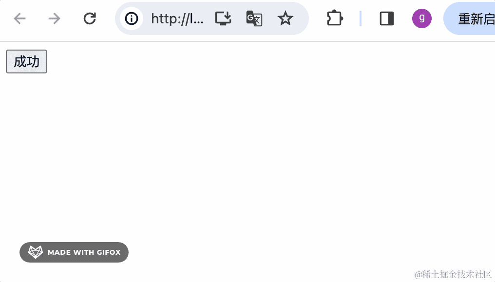

是不是感觉很像了？

还差一点，我们要把它放到 Context 里。

创建 Message/ConfigProvider.tsx

```javascript
import { PropsWithChildren, RefObject, createContext, useRef } from "react";
import { MessageProvider, MessageRef } from ".";

interface ConfigProviderProps {
    messageRef?: RefObject<MessageRef>
}

export const ConfigContext = createContext<ConfigProviderProps>({});

export function ConfigProvider(props: PropsWithChildren) {

    const { children } = props;
    
    const messageRef = useRef<MessageRef>(null);

    return (
      <ConfigContext.Provider value={{ messageRef }}>
          <MessageProvider ref={messageRef}></MessageProvider>
          {children}    
      </ConfigContext.Provider>
    );
}
```
这里用 createContext 创建 context，然后在其中放了 messageRef，这个 messageRef 的值是在 MessageProvider 设置的。

再添加一个 useMessage 的 hook：

Message/useMessage.tsx
```javascript
import { useContext } from 'react';
import { ConfigContext } from './ConfigProvider';
import { MessageRef } from '.';

export function useMessage(): MessageRef {
  const { messageRef } = useContext(ConfigContext);

  if(!messageRef) {
    throw new Error('请在最外层添加 ConfigProvider 组件');
  }

  return messageRef.current!;
}
```
从 context 中拿到 messageRef，返回其中的 api。

这样在 App.tsx 里就可以这么用：

```javascript
import { ConfigProvider } from "./Message/ConfigProvider";
import { useMessage } from "./Message/useMessage";

function Aaa() {
  const message = useMessage();

  return <button onClick={() =>{
    message.add({
      content:'请求成功'
    })
  }}>成功</button>
}

function App() {

  return (
    <ConfigProvider>
      <div>
        <Aaa></Aaa>
      </div>
    </ConfigProvider>
  );
}

export default App;

```
在最外层包裹 ConfigProvider 来设置 context，然后在 Aaa 组件里用 useMessage 拿到 message api，调用 add 方法。

但是跑起来你会发现报错了：

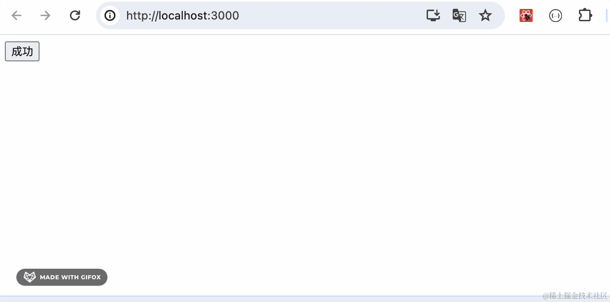

说 messageRef.current 是 null。

为什么呢，我们不是转发 ref 了么？

这个是时机的问题，我们在 useImperativeHandle 的回调函数，还有 useMessage 方法里加个 debugger： 

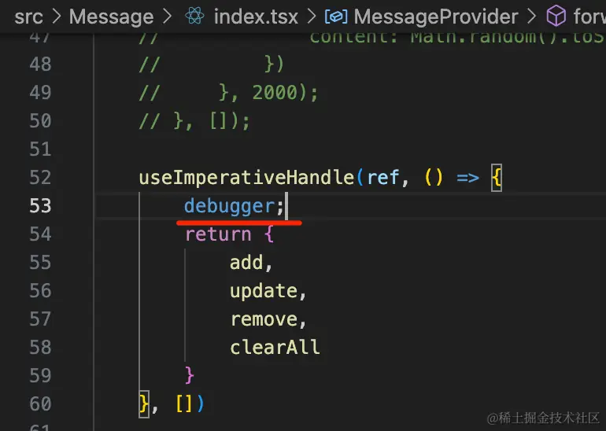

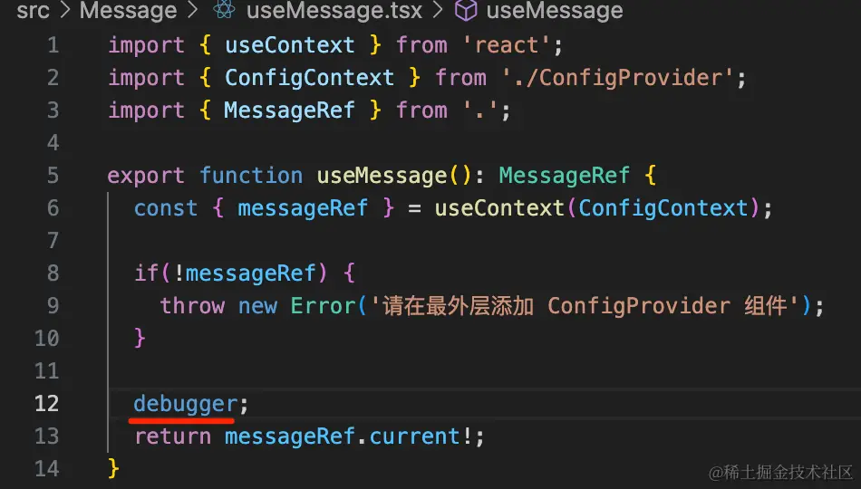

你会发现先执行的 useMessage 取了 messageRef.current 的值，然后我们才设置了 messageRef.current。


这与我们预期是不符的。

这是用 useImperative 的一个问题，它并不是立刻修改 ref，而是会在之后的某个时间来修改。

所以这里我们要改成直接修改 ref.current 的方式。

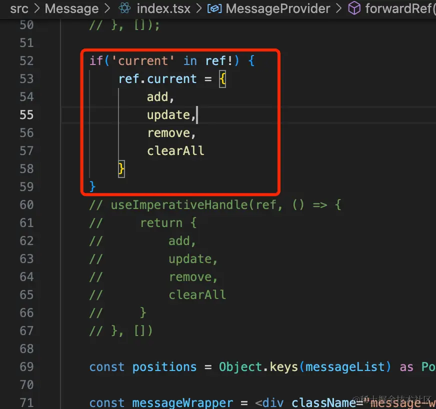

```javascript
if('current' in ref!) {
    ref.current = {
        add,
        update,
        remove,
        clearAll
    }
}
```

这样我们的 message 组件就完成了！

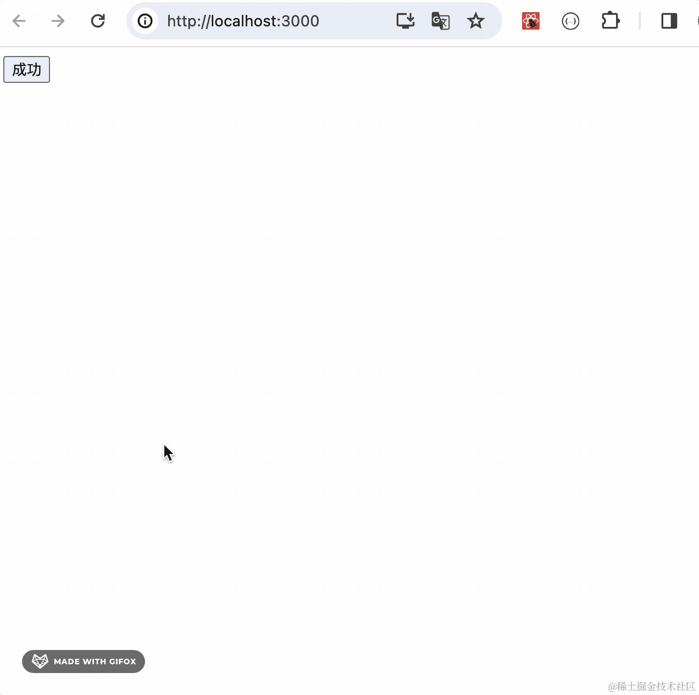

案例代码上传了[小册仓库](https://github.com/QuarkGluonPlasma/react-course-code/tree/main/message-component)。
## 总结

这节我们实现了 Message 组件。

它的核心就是一个列表元素的增删改，然后用 react-transition-group 加上过渡动画。

这个列表可以通过 createPortal 渲染到 body 下。

但是难点在于如何在 api 的方式来动态添加这个组件。

acro desigin 等都是用重新渲染一个 root 的方式来做的，但是这种会报警告，不建议用。

我们是通过 forwardRef + context 转发来实现的：

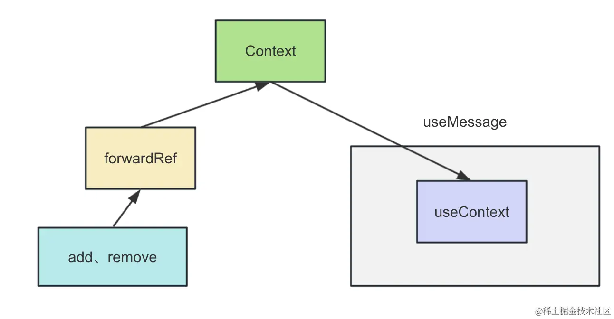

唯一要注意的问题就是需要直接修改 ref.current，而不是用 useImperativeHandle 来修改。

**useImperative 的好处是可以在依赖数组改变的时候重新执行回调函数来修改 ref，但坏处是它不是同步修改 ref 的，有的时候不太合适。**

这样，Message 组件就完成了。

这个组件还是比较复杂的，涉及到 ref 转发，context ，过渡动画，portal 等，还封装了两个自定义 hook，大家可以自己写一遍。
