# 第35章—组件实战：ColorPicker颜色选择器（二）

这节我们开始写 ColorPicker 组件。

看下 antd 的 [ColorPicker 组件](https://ant-design.antgroup.com/components/color-picker-cn#%E4%BB%A3%E7%A0%81%E6%BC%94%E7%A4%BA)：

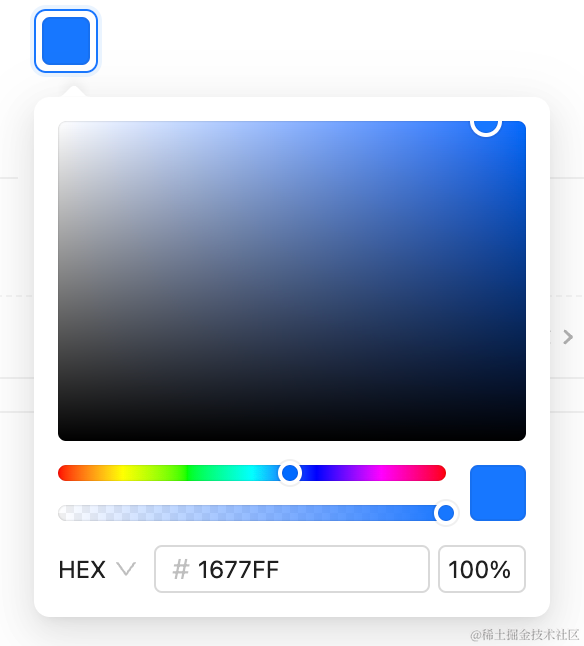

可以分成这两部分：

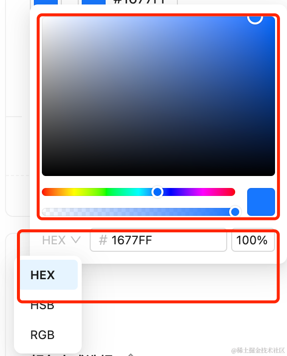

上面是一个 ColorPickerPanel，可以通过滑块选择颜色，调整色相、饱和度。

下面是 ColorInput，可以通过输入框修改颜色，可以切换 RGB、HEX 等色彩模式。

我们先写 ColorPickerPanel 的部分：

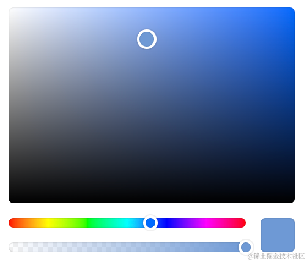

这部分分为上面的调色板 Palette，下面的 Slider 滑动条。

这样一拆解，是不是思路就清晰了呢？

新建个项目：

```
npx create-react-app --template=typescript color-picker-component
```
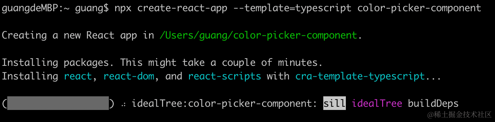

新建 ColorPicker 目录，然后创建 ColorPickerPanel 组件：

```javascript
import { CSSProperties } from "react";
import cs from 'classnames';
import './index.scss';

export interface ColorPickerProps {
    className?: string;
    style?: CSSProperties
}

function ColorPickerPanel(props: ColorPickerProps) {

    const {
        className,
        style
    } = props;

    const classNames = cs("color-picker", className);

    return <div className={classNames} style={style}>
    </div>
}

export default ColorPickerPanel;

```
安装用到的 classnames 包：

```
npm install --save classnames
```

style 和 className 这俩 props 就不用解释了。

然后添加 value 和 onChange 的参数：

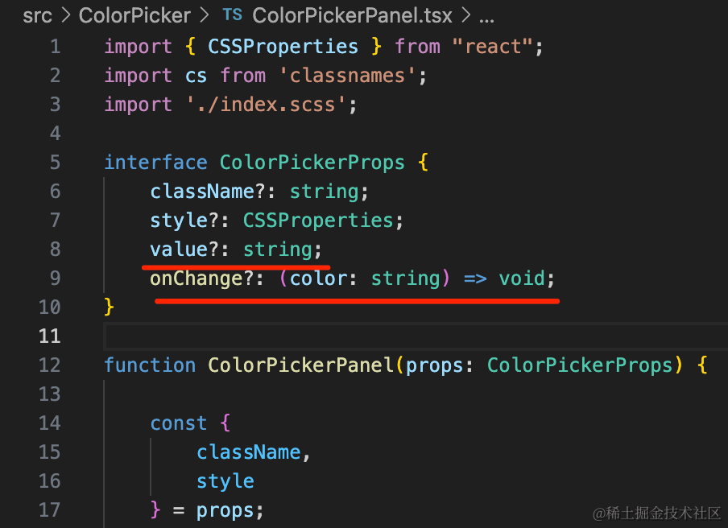

```javascript
interface ColorPickerProps {
    className?: string;
    style?: CSSProperties;
    value?: string;
    onChange?: (color: string) => void;
}
```
这里颜色用 string 类型不大好，最好是有专门的 Color 类，可以用来切换 RGB、HSL、HEX 等颜色格式。

直接用 @ctrl/tinycolor 这个包就行。

```
npm install --save @ctrl/tinycolor
```
先试一下这个包：

创建 index.js

```javascript
const { TinyColor } = require("@ctrl/tinycolor");

let color = new TinyColor('red');

console.log(color.toHex());
console.log(color.toHsl());
console.log(color.toRgb());
console.log();

color = new TinyColor('#00ff00');

console.log(color.toHex());
console.log(color.toHsl());
console.log(color.toRgb());
console.log();

color = new TinyColor({ r: 0, g: 0, b: 255});

console.log(color.toHex());
console.log(color.toHsl());
console.log(color.toRgb());
console.log();
```
跑一下：

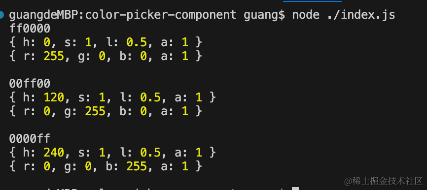

可以看到，TinyColor 能识别出颜色的格式，并且在 hex、hsl、rgb 之间进行转换。

然后添加 ColorPicker/color.ts

```javascript
import { TinyColor } from '@ctrl/tinycolor';

export class Color extends TinyColor {

}
```
那 value 直接写 Color 类型么？

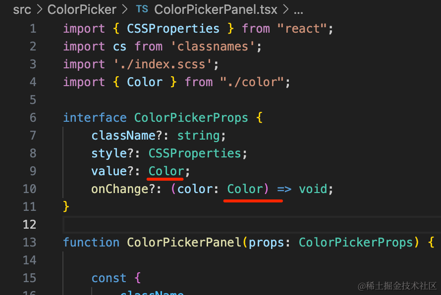

也不好，这样用起来得 new 一个 Color 对象才行，不方便。

所以我们类型要这样写：

创建 ColorPicker/interface.ts

```javascript
import type { Color } from './color';

export interface HSL {
  h: number | string;
  s: number | string;
  l: number | string;
}

export interface RGB {
  r: number | string;
  g: number | string;
  b: number | string;
}

export interface HSLA extends HSL {
  a: number;
}

export interface RGBA extends RGB {
  a: number;
}

export type ColorType =
  | string
  | number
  | RGB
  | RGBA
  | HSL
  | HSLA
  | Color;
```

支持 string 还有 number 还有 rgb、hsl、rgba、hsla 这几种格式，或者直接传一个 Color 对象。

在组件里判断下 value 类型，如果不是 Color，那就创建一个 Color 对象，传入 Palette：

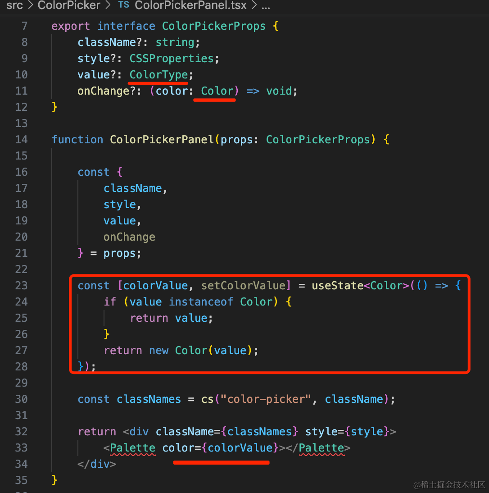
```javascript
import { CSSProperties, useState } from "react";
import cs from 'classnames';
import { ColorType } from "./interface";
import { Color } from "./color";
import Palette from "./Palette";
import './index.scss';

export interface ColorPickerProps {
    className?: string;
    style?: CSSProperties;
    value?: ColorType;
    onChange?: (color: Color) => void;
}

function ColorPickerPanel(props: ColorPickerProps) {

    const {
        className,
        style,
        value,
        onChange
    } = props;

    const [colorValue, setColorValue] = useState<Color>(() => {
        if (value instanceof Color) {
            return value;
        }
        return new Color(value);
    });

    const classNames = cs("color-picker", className);

    return <div className={classNames} style={style}>
        <Palette color={colorValue}></Palette>
    </div>
}

export default ColorPickerPanel;
```
接下来写 Palette 组件：

src/Palette.tsx

```javascript
import type { FC } from 'react';
import { Color } from './color';

const Palette: FC<{
  color: Color
}> = ({ color }) => {
    return (
        <div className="color-picker-panel-palette" >
            <div 
                className="color-picker-panel-palette-main"
                style={{
                    backgroundColor: `hsl(${color.toHsl().h},100%, 50%)`,
                    backgroundImage:
                        'linear-gradient(0deg, #000, transparent),linear-gradient(90deg, #fff, hsla(0, 0%, 100%, 0))',
                }}
            />
        </div>
    );
};

export default Palette;
```
拿到 color 的 hsl 值中的色相，然后加一个横向和纵向的渐变就好了。

我们写下样式 ColorPicker/index.scss：

```scss
.color-picker {
    width: 300px;

    &-panel {
        &-palette {
            position: relative;
            min-height: 160px;
    
            &-main {
                position: absolute;
                top: 0;
                bottom: 0;
                left: 0;
                right: 0;
            }
        }
    }
}
```
安装用到的包：
```
npm install --save-dev sass
```
跑一下：

```
npm run start
```

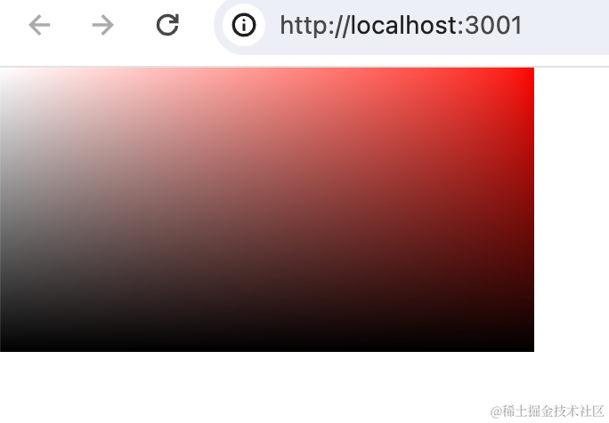

调色板出来了。

还要实现上面的滑块，这个封装个组件，因为 Slider 也会用到：


创建 ColorPicker/Handler.tsx：

```javascript
import classNames from 'classnames';
import type { FC } from 'react';

type HandlerSize = 'default' | 'small';

interface HandlerProps {
    size?: HandlerSize;
    color?: string;
};

const Handler: FC<HandlerProps> = ({ size = 'default', color }) => {
  return (
    <div
      className={classNames(`color-picker-panel-palette-handler`, {
        [`color-picker-panel-palette-handler-sm`]: size === 'small',
      })}
      style={{
        backgroundColor: color,
      }}
    />
  );
};

export default Handler;
```
有 size 和 color 两个参数。

size 是 default 和 small 两个取值，因为这俩滑块是不一样大的：

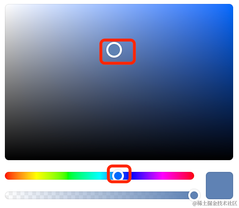

加一下两种滑块的样式：

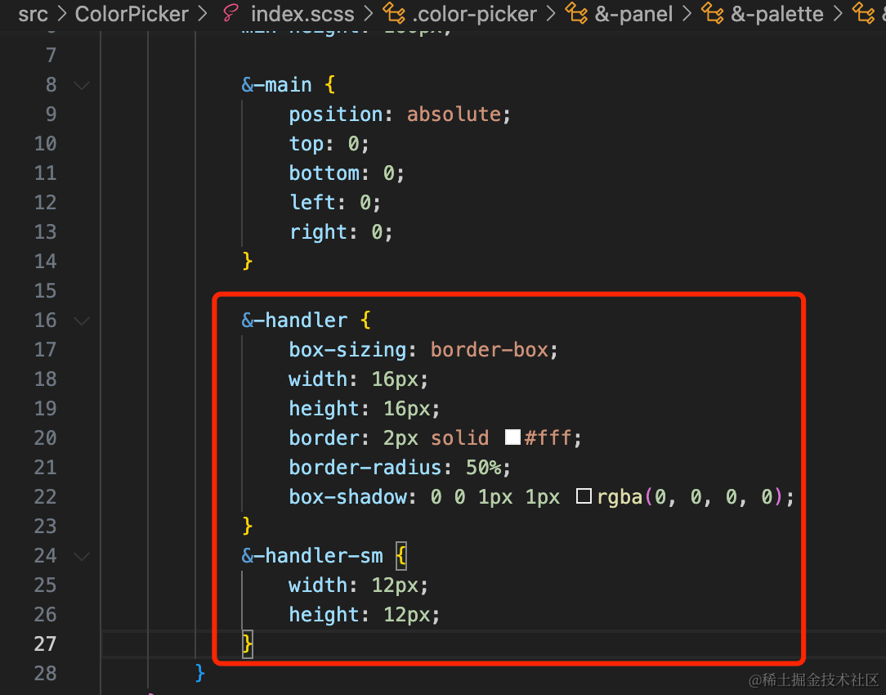

```scss
&-handler {
    box-sizing: border-box;
    width: 16px;
    height: 16px;
    border: 2px solid #fff;
    border-radius: 50%;
    box-shadow: 0 0 1px 1px rgba(0, 0, 0, 0);
}
&-handler-sm {
    width: 12px;
    height: 12px;
}
```
在 Palette 引入下：

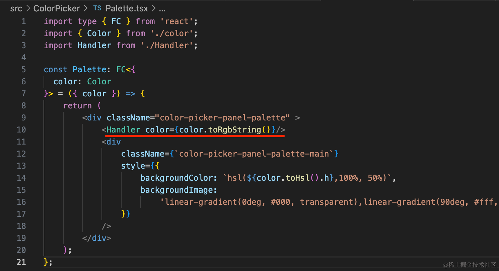

```javascript
<Handler color={color.toRgbString()}/>
```
刷新下页面，确实是有的：

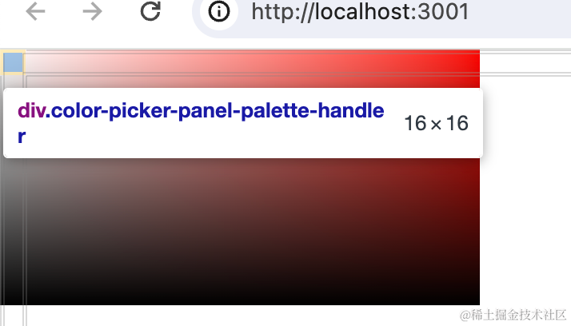

只是现在看不到。

加一下 zindex 就好了：

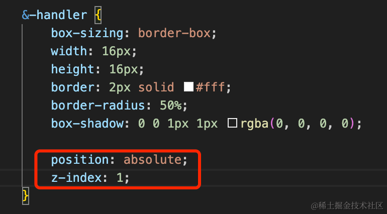

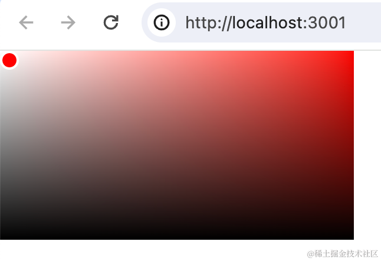

但是不建议写在这里。

为什么呢？

因为这里写了 position: absolute 那是不是 Handler 组件也得加上 x、y 的参数。

这样它就不纯粹了，复用性会变差。

所以可以把定位的样式抽离成一个单独的 Transform 组件：

创建 Transform： 
```javascript
import React, { forwardRef } from 'react';

export interface TransformOffset {
    x: number;
    y: number;
};

interface TransformProps {
    offset?: TransformOffset;
    children?: React.ReactNode;
}

const Transform = forwardRef<HTMLDivElement, TransformProps>((props, ref) => {
  const { children, offset } = props;
  return (
    <div
      ref={ref}
      style={{
        position: 'absolute',
        left: offset?.x ?? 0,
        top: offset?.y ?? 0,
        zIndex: 1,
      }}
    >
      {children}
    </div>
  );
});

export default Transform;
```

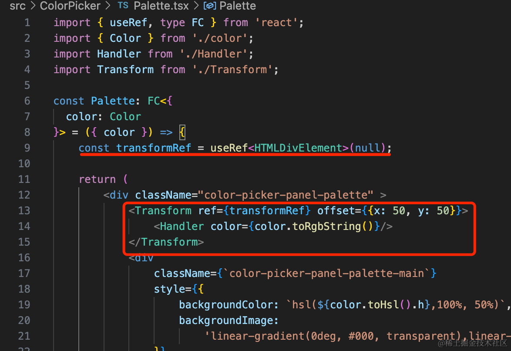

```javascript
import { useRef, type FC } from 'react';
import { Color } from './color';
import Handler from './Handler';
import Transform from './Transform';

const Palette: FC<{
  color: Color
}> = ({ color }) => {
    const transformRef = useRef<HTMLDivElement>(null);

    return (
        <div className="color-picker-panel-palette" >
            <Transform ref={transformRef} offset={{x: 50, y: 50}}>
                <Handler color={color.toRgbString()}/>
            </Transform>
            <div 
                className={`color-picker-panel-palette-main`}
                style={{
                    backgroundColor: `hsl(${color.toHsl().h},100%, 50%)`,
                    backgroundImage:
                        'linear-gradient(0deg, #000, transparent),linear-gradient(90deg, #fff, hsla(0, 0%, 100%, 0))',
                }}
            />
        </div>
    );
};

export default Palette;
```
看下效果：

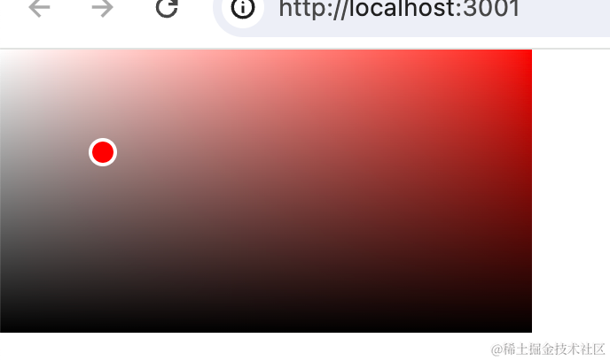

如果不单独分 Transform 这个组件呢？

那就是把这段样式写在 Hanlder 组件里，然后加上俩参数：

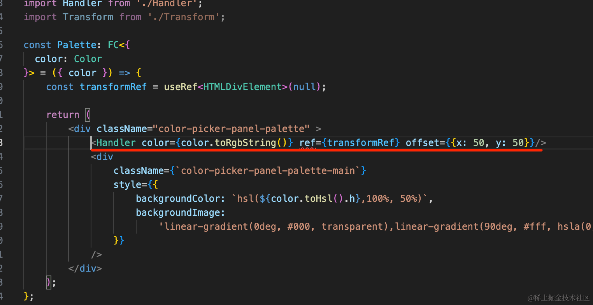

功能是一样的，但是不如拆分出来复用性好。

然后我们加上拖拽功能。

拖拽就是给元素绑定 mousedown、mousemove、mouseup 事件，在 mousemove 的时候改变 x、y。

这部分逻辑比较复杂，我们封装一个自定义 hook 来做。

创建 ColorPicker/useColorDrag.ts

```javascript
import { useEffect, useRef, useState } from 'react';
import { TransformOffset } from './Transform';

type EventType =
  | MouseEvent
  | React.MouseEvent<Element, MouseEvent>

type EventHandle = (e: EventType) => void;

interface useColorDragProps {
    offset?: TransformOffset;
    containerRef: React.RefObject<HTMLDivElement>;
    targetRef: React.RefObject<HTMLDivElement>;
    direction?: 'x' | 'y';
    onDragChange?: (offset: TransformOffset) => void;
}

function useColorDrag(
  props: useColorDragProps,
): [TransformOffset, EventHandle] {
    const {
        offset,
        targetRef,
        containerRef,
        direction,
        onDragChange,
    } = props;

    const [offsetValue, setOffsetValue] = useState(offset || { x: 0, y: 0 });
    const dragRef = useRef({
        flag: false
    });

    useEffect(() => {
        document.removeEventListener('mousemove', onDragMove);
        document.removeEventListener('mouseup', onDragStop);
    }, []);

    const updateOffset: EventHandle = e => {
        
    };


    const onDragStop: EventHandle = e => {
        document.removeEventListener('mousemove', onDragMove);
        document.removeEventListener('mouseup', onDragStop);

        dragRef.current.flag = false;
    };

    const onDragMove: EventHandle = e => {
        e.preventDefault();
        updateOffset(e);
    };

    const onDragStart: EventHandle = e => {
        document.addEventListener('mousemove', onDragMove);
        document.addEventListener('mouseup', onDragStop);

        dragRef.current.flag = true;
    };

    return [offsetValue, onDragStart];
}

export default useColorDrag;
```
代码比较多，从上到下来看：

MouseEvent 是 ts 内置的原生鼠标事件类型，而 React.MouseEvent 是 react 提供鼠标事件类型。

是因为 react 里的事件是被 react 处理过的，和原生事件不一样。

直接给 document 绑定事件，这时候 event 是 MouseEvent 类型：

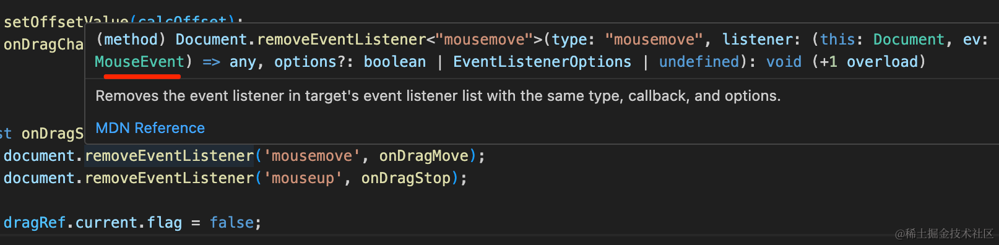

而在 jsx 里绑定事件，这时候 event 是 React.MouseEvent 类型：

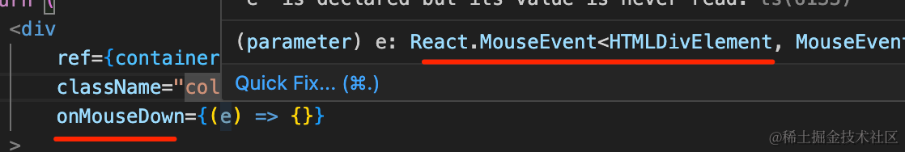

我们都要支持：

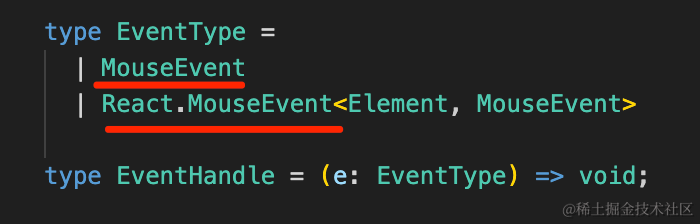

这两个一个是保存 offset 的，一个是保存是否在拖动中的标记的：

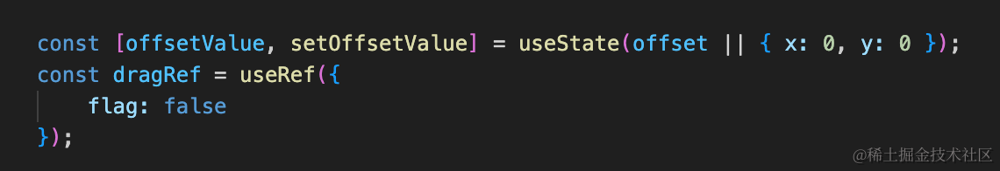

然后先把之前的事件监听器去掉：

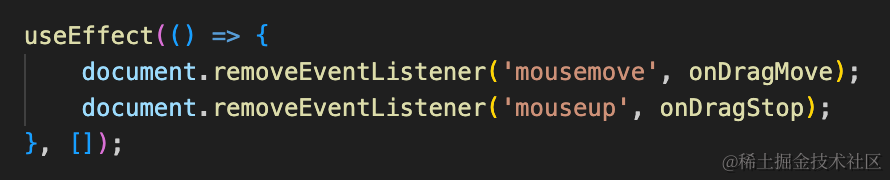

在 mousedown 的时候绑定 mousemove 和 mouseup 事件：

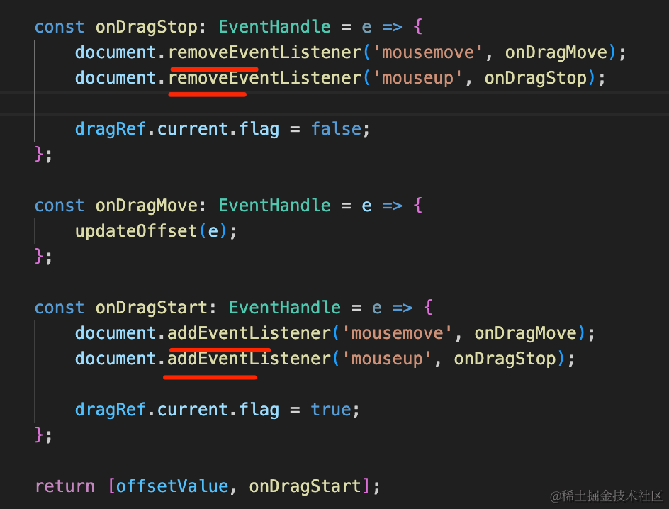

mousemove 的时候根据 event 修改 offset。

mouseup 的时候去掉事件监听器。

这个过程中还要修改记录拖动状态的 flag 的值。

然后实现拖动过程中的 offset 的计算：

```javascript
const updateOffset: EventHandle = e => {
    const scrollXOffset = document.documentElement.scrollLeft || document.body.scrollLeft;
    const scrollYOffset = document.documentElement.scrollTop || document.body.scrollTop;

    const pageX = e.pageX - scrollXOffset;
    const pageY = e.pageY - scrollYOffset;

    const { 
        x: rectX,
        y: rectY,
        width,
        height
    } = containerRef.current!.getBoundingClientRect();

    const { 
        width: targetWidth,
        height: targetHeight
    } = targetRef.current!.getBoundingClientRect();

    const centerOffsetX = targetWidth / 2;
    const centerOffsetY = targetHeight / 2;

    const offsetX = Math.max(0, Math.min(pageX - rectX, width)) - centerOffsetX;
    const offsetY = Math.max(0, Math.min(pageY - rectY, height)) - centerOffsetY;

    const calcOffset = {
        x: offsetX,
        y: direction === 'x' ? offsetValue.y : offsetY,
    };

    setOffsetValue(calcOffset);
    onDragChange?.(calcOffset);
};
```
首先 e.pageX 和 e.pageY 是距离页面顶部和左边的距离。

减去 scrollLeft 和 scrollTop 之后就是离可视区域顶部和左边的距离了。

然后减去 handler 圆点的半径。

这样算出来的就是按住 handler 圆点的中心拖动的效果。

但是拖动不能超出 container 的区域，所以用 Math.max 来限制在 0 到 width、height 之间拖动。

这里如果传入的 direction 参数是 x，那么就只能横向拖动，是为了下面的 Slider 准备的：

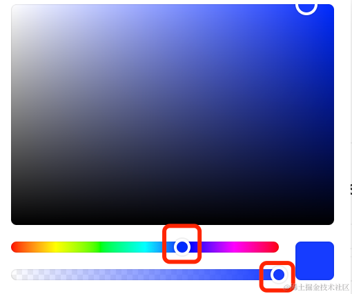

我们来试下效果：

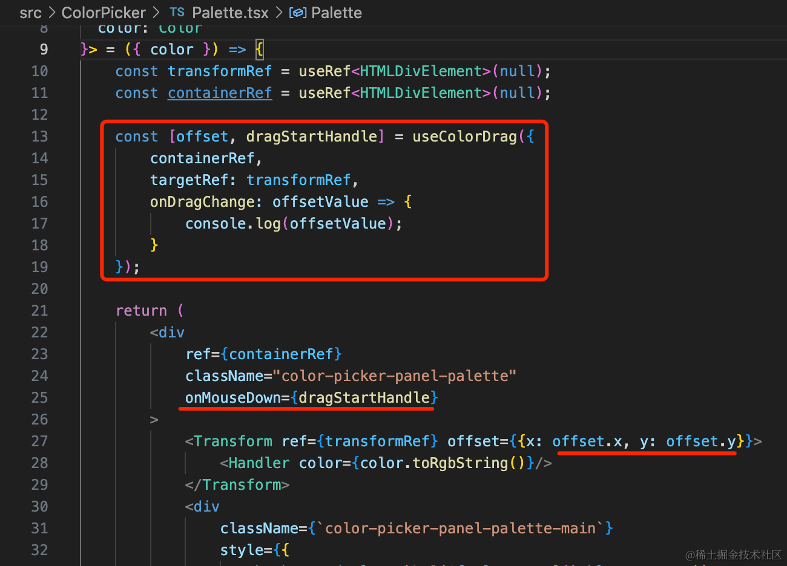

```javascript
import { useRef, type FC } from 'react';
import { Color } from './color';
import Handler from './Handler';
import Transform from './Transform';
import useColorDrag from './useColorDrag';

const Palette: FC<{
  color: Color
}> = ({ color }) => {
    const transformRef = useRef<HTMLDivElement>(null);
    const containerRef = useRef<HTMLDivElement>(null);

    const [offset, dragStartHandle] = useColorDrag({
        containerRef,
        targetRef: transformRef,
        onDragChange: offsetValue => {
            console.log(offsetValue);
        }
    });

    return (
        <div 
            ref={containerRef}
            className="color-picker-panel-palette"
            onMouseDown={dragStartHandle}
        >
            <Transform ref={transformRef} offset={{x: offset.x, y: offset.y}}>
                <Handler color={color.toRgbString()}/>
            </Transform>
            <div 
                className={`color-picker-panel-palette-main`}
                style={{
                    backgroundColor: `hsl(${color.toHsl().h},100%, 50%)`,
                    backgroundImage:
                        'linear-gradient(0deg, #000, transparent),linear-gradient(90deg, #fff, hsla(0, 0%, 100%, 0))',
                }}
            />
        </div>
    );
};

export default Palette;
```

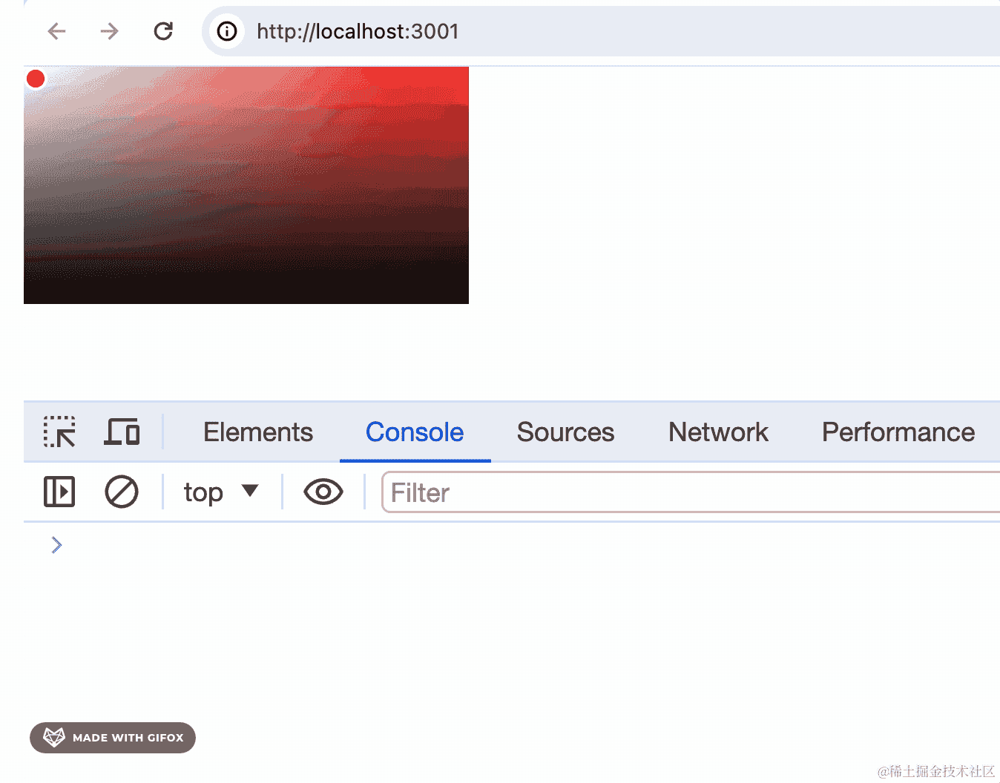

可以看到，滑块可以拖动了，并且只能在容器范围内拖动。

只是颜色没有变化，这个需要根据 x、y 的值来算出当前的颜色。

我们封装个工具方法：

新建 ColorPicker/utils.ts

```javascript
import { TransformOffset } from "./Transform";
import { Color } from "./color";

export const calculateColor = (props: {
    offset: TransformOffset;
    containerRef: React.RefObject<HTMLDivElement>;
    targetRef: React.RefObject<HTMLDivElement>;
    color: Color;
}): Color => {
    const { offset, targetRef, containerRef, color } = props;

    const { width, height } = containerRef.current!.getBoundingClientRect();
    const { 
        width: targetWidth,
        height: targetHeight
    } = targetRef.current!.getBoundingClientRect();

    const centerOffsetX = targetWidth / 2;
    const centerOffsetY = targetHeight / 2;

    const saturation = (offset.x + centerOffsetX) / width;
    const lightness = 1 - (offset.y + centerOffsetY) / height;
    const hsv = color.toHsv();

    return new Color({
        h: hsv.h,
        s: saturation <= 0 ? 0 : saturation,
        v: lightness >= 1 ? 1 : lightness,
        a: hsv.a,
    });
}
```
这块逻辑就是用 x/width 用 y/height 求出一个比例来。

当然，x、y 还要加上圆点的半径，这样才是中心点位置。

根据比例设置 hsv 的值，这样就算出了拖动位置的颜色。

然后在 onDragChange 里根据 offset 计算当前的颜色，并且通过 onChange 回调返回新颜色。

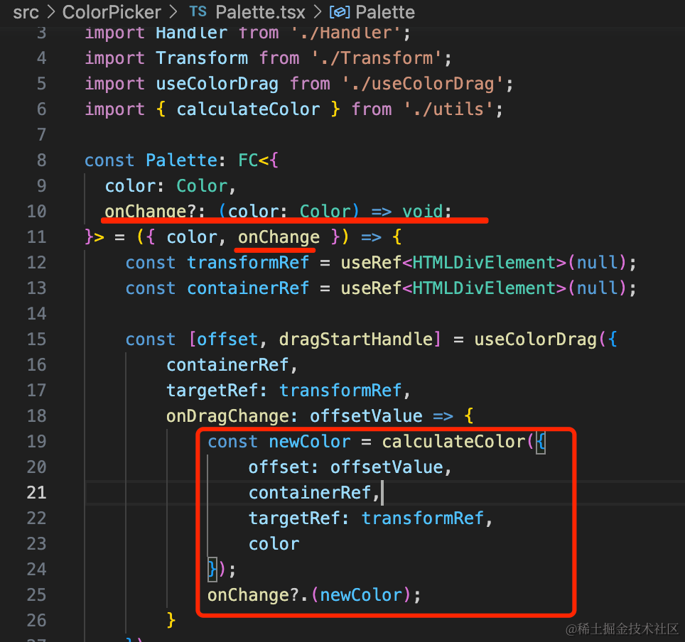

在 ColorPickerPanel 组件里处理下 onChange：

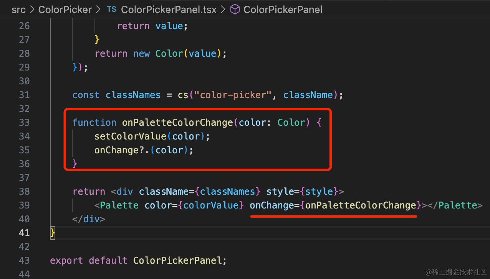

```javascript
function onPaletteColorChange(color: Color) {
    setColorValue(color);
    onChange?.(color);
}
```
修改当前颜色，并且调用它的 onChange 回调函数。

测试下：

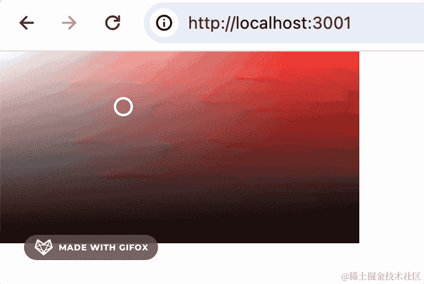

没啥问题。

只是现在初始的颜色不对：

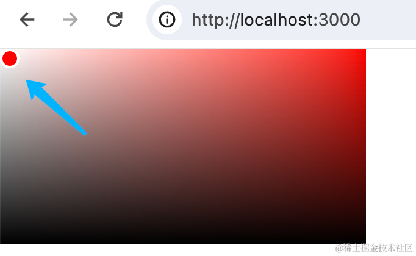

最开始也要计算一次滑块位置：

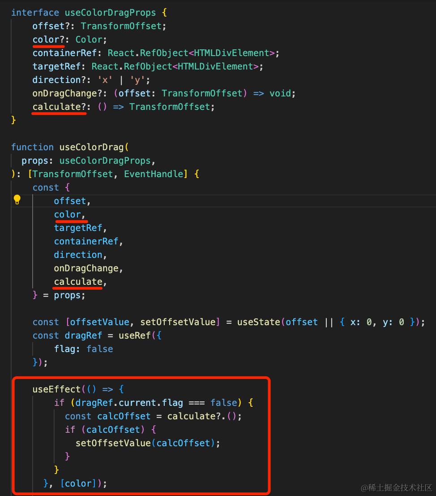

我们给 useColorDrag 添加 color 和 calculate 两个参数。

最开始和 color 改变的时候，调用 calculate 计算位置，重新设置  offsetValue。

```javascript
import { useEffect, useRef, useState } from 'react';
import { TransformOffset } from './Transform';
import { Color } from './color';

type EventType =
  | MouseEvent
  | React.MouseEvent<Element, MouseEvent>

type EventHandle = (e: EventType) => void;

interface useColorDragProps {
    offset?: TransformOffset;
    color: Color;
    containerRef: React.RefObject<HTMLDivElement>;
    targetRef: React.RefObject<HTMLDivElement>;
    direction?: 'x' | 'y';
    onDragChange?: (offset: TransformOffset) => void;
    calculate?: () => TransformOffset;
}

function useColorDrag(
  props: useColorDragProps,
): [TransformOffset, EventHandle] {
    const {
        offset,
        color,
        targetRef,
        containerRef,
        direction,
        onDragChange,
        calculate,
    } = props;

    const [offsetValue, setOffsetValue] = useState(offset || { x: 0, y: 0 });
    const dragRef = useRef({
        flag: false
    });

    useEffect(() => {
        if (dragRef.current.flag === false) {
          const calcOffset = calculate?.();
          if (calcOffset) {
            setOffsetValue(calcOffset);
          }
        }
      }, [color]);

    useEffect(() => {
        document.removeEventListener('mousemove', onDragMove);
        document.removeEventListener('mouseup', onDragStop);
    }, []);

    const updateOffset: EventHandle = e => {
        const scrollXOffset = document.documentElement.scrollLeft || document.body.scrollLeft;
        const scrollYOffset = document.documentElement.scrollTop || document.body.scrollTop;

        const pageX = e.pageX - scrollXOffset;
        const pageY = e.pageY - scrollYOffset;

        const { 
            x: rectX,
            y: rectY,
            width,
            height
        } = containerRef.current!.getBoundingClientRect();

        const { 
            width: targetWidth,
            height: targetHeight
        } = targetRef.current!.getBoundingClientRect();

        const centerOffsetX = targetWidth / 2;
        const centerOffsetY = targetHeight / 2;

        const offsetX = Math.max(0, Math.min(pageX - rectX, width)) - centerOffsetX;
        const offsetY = Math.max(0, Math.min(pageY - rectY, height)) - centerOffsetY;

        const calcOffset = {
            x: offsetX,
            y: direction === 'x' ? offsetValue.y : offsetY,
        };

        setOffsetValue(calcOffset);
        onDragChange?.(calcOffset);
    };


    const onDragStop: EventHandle = e => {
        document.removeEventListener('mousemove', onDragMove);
        document.removeEventListener('mouseup', onDragStop);

        dragRef.current.flag = false;
    };

    const onDragMove: EventHandle = e => {
        e.preventDefault();
        updateOffset(e);
    };

    const onDragStart: EventHandle = e => {
        document.addEventListener('mousemove', onDragMove);
        document.addEventListener('mouseup', onDragStop);

        dragRef.current.flag = true;
    };

    return [offsetValue, onDragStart];
}

export default useColorDrag;

```

然后在调用的时候传入这两个参数：

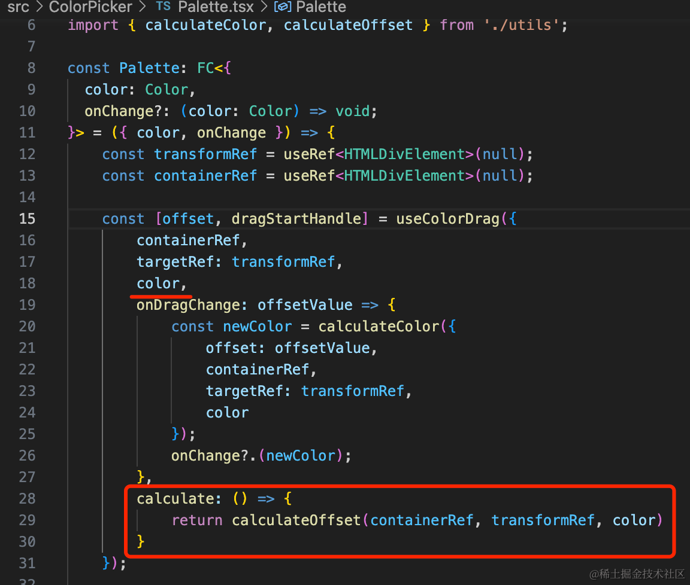

```javascript
const [offset, dragStartHandle] = useColorDrag({
    containerRef,
    targetRef: transformRef,
    color,
    onDragChange: offsetValue => {
        const newColor = calculateColor({
            offset: offsetValue,
            containerRef,
            targetRef: transformRef,
            color
        });
        onChange?.(newColor);
    },
    calculate: () => {
        return calculateOffset(containerRef, transformRef, color)
    }
});
```

这里的 calculateOffset 在 utils.ts 里定义：

```javascript
export const calculateOffset = (
    containerRef: React.RefObject<HTMLDivElement>,
    targetRef: React.RefObject<HTMLDivElement>,
    color: Color
): TransformOffset => {
    const { width, height } = containerRef.current!.getBoundingClientRect();
    const { 
        width: targetWidth,
        height: targetHeight 
    } = targetRef.current!.getBoundingClientRect();

    const centerOffsetX = targetWidth / 2;
    const centerOffsetY = targetHeight / 2;
    const hsv = color.toHsv();

    return {
        x: hsv.s * width - centerOffsetX,
        y: (1 - hsv.v) * height - centerOffsetY,
    };
};
```
就是根据 hsv 里的 s 和 v 的百分比乘以 width、height，计算出 x、y，然后减去滑块的宽高的一半。

可以看到，现在初始位置就对了：

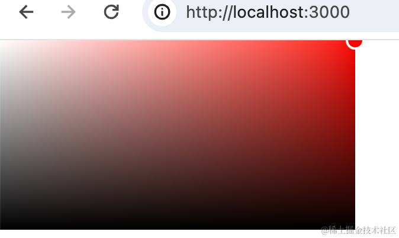

我在 App.tsx 里设置个不同的颜色：

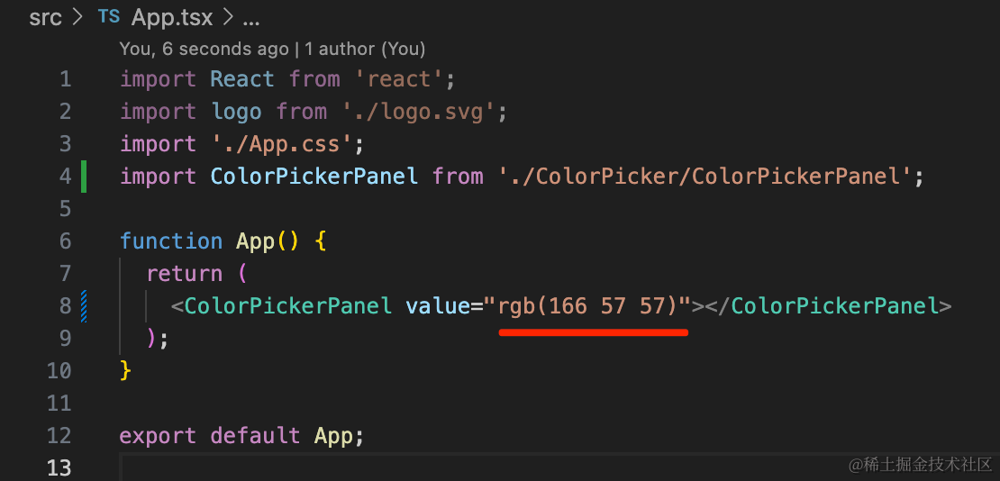

```html
<ColorPickerPanel value="rgb(166 57 57)"></ColorPickerPanel>
```

初始位置也是对的：
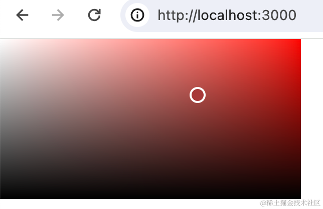

我们在下面加一个颜色块：

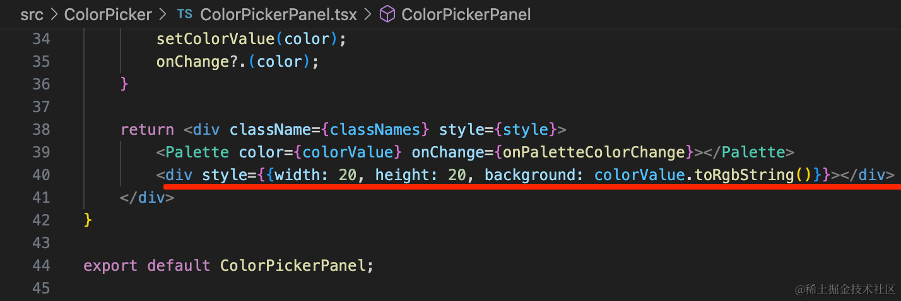

```html
<div style={{width: 20, height: 20, background: colorValue.toRgbString()}}></div>
```
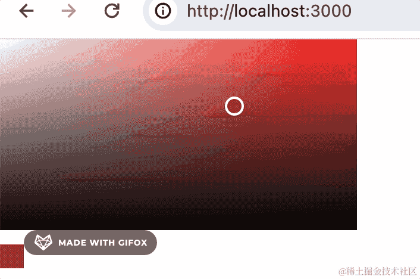

可以看到，随着滑块的移动，返回的颜色是对的。

但有时候会变为选择，而不是拖拽，我们优化下体验：

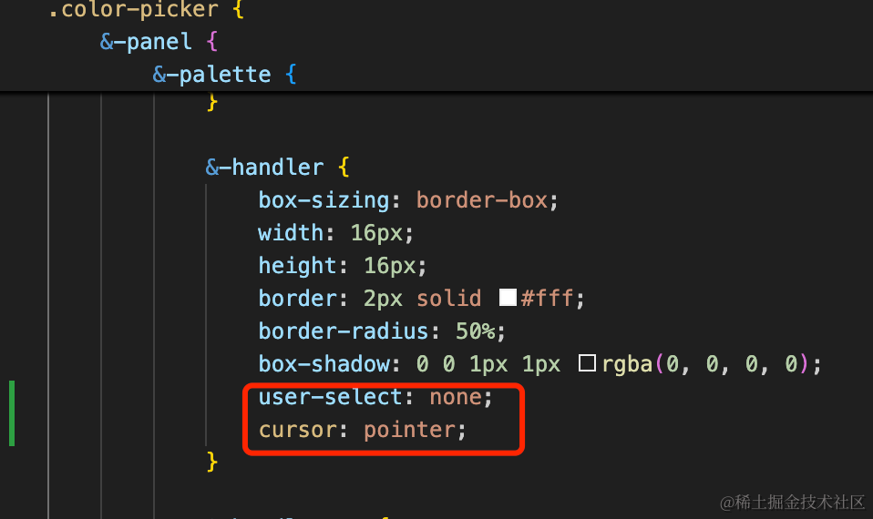

```css
user-select: none;
cursor: pointer;
```

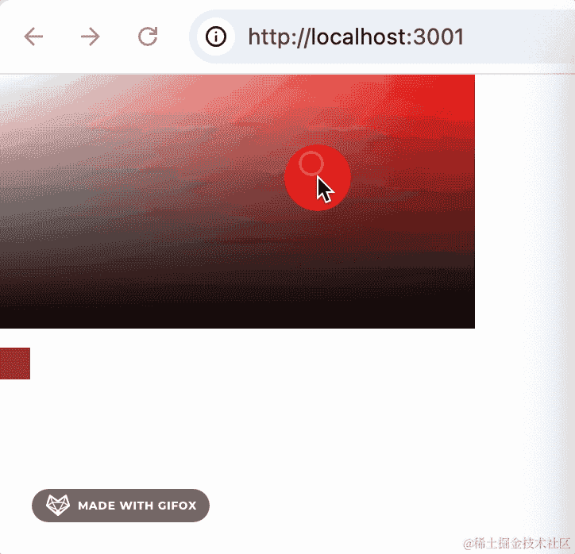

好多了。

还有一点，我们前面的 value 参数其实是 defaultValue：

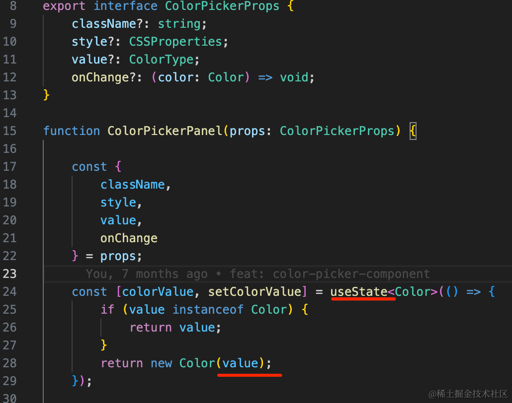

也就是用来作为内部 state 的初始值。

这里我们同时支持受控和非受控，用 ahooks 的 useControllableValue 做。

安装 ahooks：

```
npm install --save ahooks
```

把 useState 换成 ahooks 的 useControllableValue：


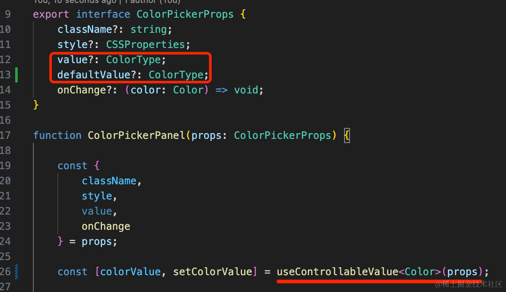

```javascript
export interface ColorPickerProps {
    className?: string;
    style?: CSSProperties;
    value?: ColorType;
    defaultValue?: ColorType;
    onChange?: (color: Color) => void;
}
```

```javascript
const [colorValue, setColorValue] = useControllableValue<Color>(props);
```
这样就同时支持了 value 和 defaultValue，也就是受控和非受控模式。

然后我们加上调节色相和亮度的滑块：

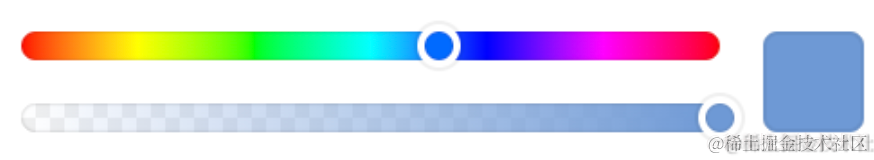

因为我们计算颜色用的是 hsv，这里两个滑块分别改变的就是 h（色相）、v（明度）。

我们简化下，直接用 input range 来做吧：

```javascript
import React, { ChangeEventHandler, useState } from 'react';
import logo from './logo.svg';
import './App.css';
import ColorPickerPanel from './ColorPicker/ColorPickerPanel';
import { Color } from './ColorPicker/color';

function App() {
  const [color, setColor] = useState<Color>(new Color('rgb(166,57,255)'));

  const handleHueChange: ChangeEventHandler<HTMLInputElement> = (e) => {
    const hsv = color.toHsv();
    let val = +e.target.value;

    setColor(new Color({
        h: val,
        s: hsv.s,
        v: hsv.v,
    }))
  }

  const handleVChange: ChangeEventHandler<HTMLInputElement> = (e) => {
    const hsv = color.toHsv();
    let val = +e.target.value;

    setColor(new Color({
        h: hsv.h,
        s: hsv.s,
        v: val,
    }))
  }

  return (
    <div style={{width: '300px'}}>
      <ColorPickerPanel value={color} onChange={newColor => setColor(newColor)}></ColorPickerPanel>
      <div>
        色相：<input type='range' min={0} max={360} step={0.1} value={color.toHsv().h} onChange={handleHueChange}/>
      </div>
      <div>
        明度：<input type='range' min={0} max={1} step={0.01} value={color.toHsv().v} onChange={handleVChange}/>
      </div>
    </div>
  );
}

export default App;

```
h 的取值范围是 0 到 360

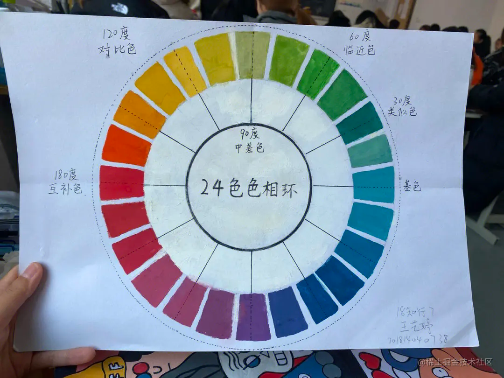

而 v 的取值范围是 0 到 100%

试一下：

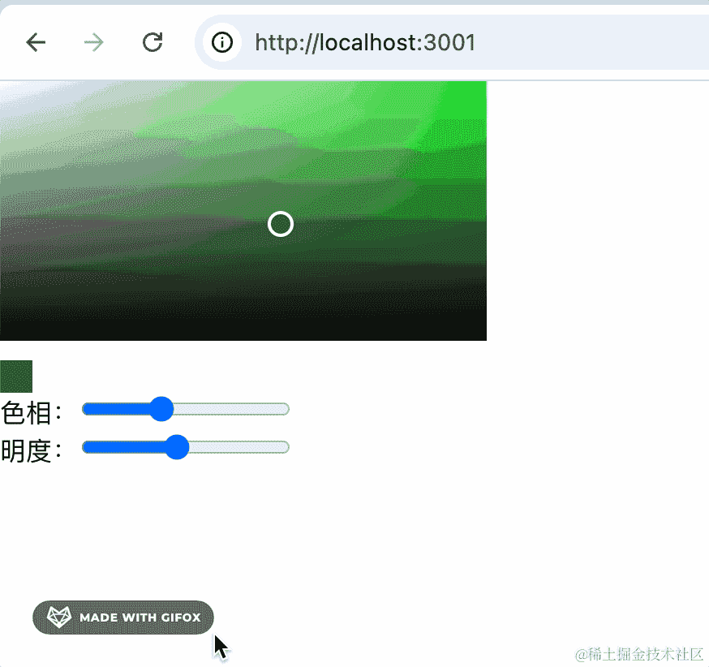

这样，ColorPicker 就完成了。

案例代码上传了[小册仓库](https://github.com/QuarkGluonPlasma/react-course-code/tree/main/color-picker-component)。

## 总结

这节我们实现了 ColorPicker 的调色板。

它的布局不复杂，就是一个渐变的背景，加上一个绝对定位的滑块。

就是根据位置计算颜色、根据颜色计算位置，这两个方向的计算比较复杂。

根据位置计算颜色，以 x 方向为例：

需要用 mousemove 时的 e.pageX（距离文档左边的距离） 减去 scrollLeft 计算出滑块距离视口的距离，然后减去容器距离视口的距离，再减去滑块半径就是滑块距离容器的距离 x。

然后用这个 x 除以 width 计算出 hsv 中的 s 的值。

这样就根据拖拽位置计算出了颜色。

根据颜色计算位置比较简单，直接拿到 hsv 的 s 和 v 的值，根据百分比乘以 width、height 就行。

此外，颜色我们用的 @ctrl/tinycolor 这个包的颜色类，antd 也是用的这个。但是参数不用直接传 Color 类的实例，可以传 rgb、string 等我们内部转成 Color 类。

我们还用 ahooks 的 useControllableValue 同时支持了 value 和 defaultValue 也就是受控和非受控模式。

最后，支持了色相和明度的调整。

至此，ColorPicker 组件就完成了。