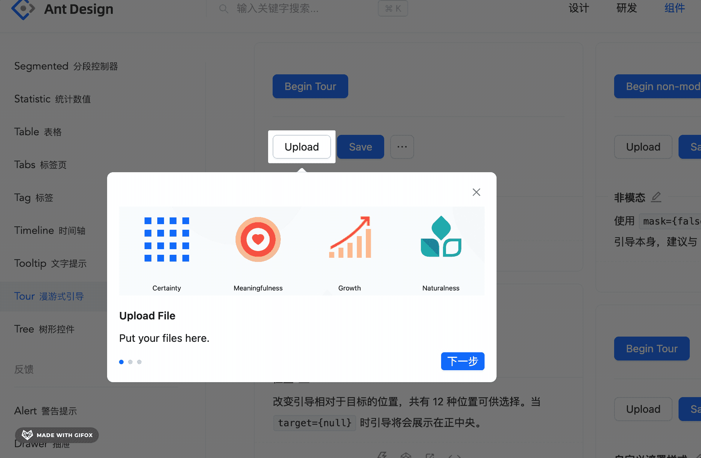

# 第36章—组件实战：onBoarding漫游式引导组件

当应用加了新功能的时候，都会通过这种方式来告诉用户怎么用：


这种组件叫做 OnBoarding 或者 Tour。

在 antd5 也加入了这种组件:



那它是怎么实现的呢？

调试下可以发现，遮罩层由 4 个 rect 元素组成。

当点击上一步、下一步的时候，遮罩层的宽高会变化：


加上 transition，就产生了上面的动画效果。

其实还可以进一步简化一下：


用一个 div，设置 width、height 还有上下左右不同的 border-width。

点击上一步、下一步的时候，修改 width、height、border-width，也能达到一样的效果。

比起 antd 用 4 个 rect 来实现，更简洁一些。

原理就是这样，还是挺简单的。

下面我们来写一下：

```bash
npx create-vite
```


创建个 vite + react 的项目。

进入项目，把 index.css 的样式去掉：


然后新建 OnBoarding/Mask.tsx 

```javascript
import React, { CSSProperties, useEffect, useState } from 'react';
import { getMaskStyle } from './getMaskStyle'

interface MaskProps {
  element: HTMLElement;

  container?: HTMLElement;

  renderMaskContent?: (wrapper: React.ReactNode) => React.ReactNode;
}

export const Mask: React.FC<MaskProps> = (props) => {
  const {
    element,
    renderMaskContent,
    container
  } = props;

  const [style, setStyle] = useState<CSSProperties>({});

  useEffect(() => {
    if (!element) {
      return;
    }

    element.scrollIntoView({
        block: 'center',
        inline: 'center'
    });
  
    const style = getMaskStyle(element, container || document.documentElement);
  
    setStyle(style);
    
  }, [element, container]);

  const getContent = () => {
    if (!renderMaskContent) {
      return null;
    }
    return renderMaskContent(
      <div className={'mask-content'} style={{ width: '100%', height: '100%' }} />
    );
  };

  return (
    <div
      style={style}
      className='mask'>
      {getContent()}
    </div>
  );
};
```
这里传入的 element、container 分别是目标元素、遮罩层所在的容器。

而 getMaskContent 是用来定制这部分内容的：


可以是 Popover 也可以是别的。

前面分析过，主要是确定目标元素的 width、height、border-width。

首先，把目标元素滚动到可视区域：


这个用 scrollIntoView 方法实现：


在 [MDN](https://developer.mozilla.org/zh-CN/docs/Web/API/Element/scrollIntoView) 上可以看到它的介绍：


设置  block、inline 为 center 是把元素中心滚动到可视区域中心的意思：


滚动完成后，就可以拿到元素的位置，计算 width、height、border-width 的样式了：


新建 OnBoarding/getMaskStyle.ts

```javascript
export const getMaskStyle = (element: HTMLElement, container: HTMLElement) => {
    if (!element) {
      return {};
    }

    const { height, width, left, top } = element.getBoundingClientRect();

    const elementTopWithScroll = container.scrollTop + top;
    const elementLeftWithScroll = container.scrollLeft + left;

    return {
      width: container.scrollWidth,
      height: container.scrollHeight,
      borderTopWidth: Math.max(elementTopWithScroll, 0),
      borderLeftWidth: Math.max(elementLeftWithScroll, 0),
      borderBottomWidth: Math.max(container.scrollHeight - height - elementTopWithScroll, 0),
      borderRightWidth: Math.max(container.scrollWidth - width - elementLeftWithScroll, 0)
    };
};
```
width、height 就是容器的包含滚动区域的宽高。

然后 border-width  分为上下左右 4 个方向：


top 和 left 的分别用 scrollTop、scrollLeft 和元素在可视区域里的 left、top 相加计算出来。

bottom 和 right 的就用容器的包含滚动区域的高度宽度 scrollHeight、scrollWidth 减去 height、width 再减去 scrollTop、scrollLeft 计算出来。

然后我们在内部又加了一个宽高为 100% 的 div，把它暴露出去，外部就可以用它来加 Popover 或者其他内容：


然后在 OnBoarding/index.scss 里写下样式：

```css
.mask {
    position: absolute;
    left: 0;
    top: 0;

    z-index: 999;

    border-style: solid;
    box-sizing: border-box;
    border-color: rgba(0, 0, 0, 0.6);

    transition: all 0.2s ease-in-out;
}
```
mask 要绝对定位，然后设置下 border 的颜色。

我们先测试下现在的 Mark 组件：

把开发服务跑起来：

```bash
npm install
npm run dev
```


我们就在 logo 上试一下吧：


```javascript
<Mask
    element={document.getElementById('xxx')!}
    renderMaskContent={(wrapper) => {
      return wrapper
    }}
></Mask>
```
container 就是默认的根元素。

内容我们先不加 Popover。

看一下效果:


没啥问题。

然后加上 Popover 试试。

安装 antd：

```
npm install --save antd
```
然后引入下：


```javascript
<Mask
    element={document.getElementById('xxx')!}
    renderMaskContent={(wrapper) => {
      return <Popover
        content={
          <div style={{width: 300}}>
            <p>hello</p>
            <Button type='primary'>下一步</Button>
          </div>
        }
        open={true}
      >{wrapper}</Popover>
    }}
></Mask>
```


没啥问题。

接下来在外面包装一层，改下 Popover 的样式就行了。

我们希望 OnBoarding 组件可以这么用：


传入 steps，包含每一步在哪个元素（selector），显示什么内容（renderConent），在什么方位（placement）。

所以类型这样写：


并且还有 beforeForward、beforeBack 也就是点上一步、下一步的回调。

step 是可以直接指定显示第几步。

onStepsEnd 是在全部完成后的回调。

内部有一个 state 来记录 currentStep，点击上一步、下一步会切换：


在切换前也会调用 beforeBack、beforeForward 的回调。

然后准备下 Popover 的内容：


渲染下：


这里用 createPortal 把 mask 渲染到容器元素下，比如 document.body。

注意，我们要给元素加上引导，那得元素渲染完才行。


所以这里加个 setState，在 useEffect 里执行。

效果就是在 dom 渲染完之后，触发重新渲染，从而渲染这个 OnBoarding 组件：


第一次渲染的时候，元素是 null，触发重新渲染之后，就会渲染下面的 Mask 了：


Onboarding/index.tsx 的全部代码如下：

```javascript
import React, { FC, useEffect, useState } from 'react';
import { createPortal } from 'react-dom';
import { Button, Popover } from 'antd';
import { Mask } from './Mask'
import { TooltipPlacement } from 'antd/es/tooltip';
import './index.scss';

export interface OnBoardingStepConfig {
    selector: () => HTMLElement | null;
  
    placement?: TooltipPlacement;
  
    renderContent?: (currentStep: number) => React.ReactNode;
  
    beforeForward?: (currentStep: number) => void;
  
    beforeBack?: (currentStep: number) => void;
}

  
export interface OnBoardingProps {
  step?: number;

  steps: OnBoardingStepConfig[];

  getContainer?: () => HTMLElement;

  onStepsEnd?: () => void;
}

export const OnBoarding:FC<OnBoardingProps> = (props) => {
  const {
    step = 0,
    steps,
    onStepsEnd,
    getContainer
  } = props;

  const [currentStep, setCurrentStep] = useState<number>(0);

  const currentSelectedElement = steps[currentStep]?.selector();

  const currentContainerElement = getContainer?.() || document.documentElement;

  const getCurrentStep = () => {
    return steps[currentStep];
  };

  const back = async () => {
    if (currentStep === 0) {
      return;
    }

    const { beforeBack } = getCurrentStep();
    await beforeBack?.(currentStep);
    setCurrentStep(currentStep - 1);
  };

  const forward = async () => {
    if (currentStep === steps.length - 1) {
      await onStepsEnd?.();
      return;
    }

    const { beforeForward } = getCurrentStep();
    await beforeForward?.(currentStep);
    setCurrentStep(currentStep + 1);
  };

  useEffect(() => {
    setCurrentStep(step!);
  }, [step]);

  const renderPopover = (wrapper: React.ReactNode) => {
    const config = getCurrentStep();
    if (!config) {
      return wrapper;
    }

    const { renderContent } = config;
    const content = renderContent ? renderContent(currentStep) : null;

    const operation = (
      <div className={'onboarding-operation'}>
        {
          currentStep !== 0 && 
            <Button
                className={'back'}
                onClick={() => back()}>
                {'上一步'}
            </Button>
        }
        <Button
          className={'forward'}
          type={'primary'}
          onClick={() => forward()}>
          {currentStep === steps.length - 1 ? '我知道了' : '下一步'}
        </Button>
      </div>
    );

    return (
      <Popover
        content={<div>
            {content}
            {operation}
        </div>}
        open={true}
        placement={getCurrentStep()?.placement}>
        {wrapper}
      </Popover>
    );
  };

  const [, setRenderTick] = useState<number>(0);

  useEffect(() => {
    setRenderTick(1)    
  }, []);
  
  if(!currentSelectedElement) {
    return null;
  }

  const mask = <Mask
    container={currentContainerElement}
    element={currentSelectedElement}
    renderMaskContent={(wrapper) => renderPopover(wrapper)}
  />;

  return createPortal(mask, currentContainerElement);
}
```
其实这个组件主要就是切换上一步下一步用的。

然后加下上一步下一步按钮的样式：

```css
.onboarding-operation {
    width: 100%;
    display: flex;
    justify-content: flex-end;
    margin-top: 12px;

    .back {
        margin-right: 12px;
        min-width: 80px;
    }

    .forward {
        min-width: 80px;
    }
}
```
在 App.tsx 里测试下：

```javascript
import { OnBoarding } from './OnBoarding'
import { Button, Flex } from 'antd';

function App() {

  return <div className='App'>
    <Flex gap="small" wrap="wrap" id="btn-group1">
      <Button type="primary">Primary Button</Button>
      <Button>Default Button</Button>
      <Button type="dashed">Dashed Button</Button>
      <Button type="text">Text Button</Button>
      <Button type="link">Link Button</Button>
    </Flex>

  <div style={{height: '1000px'}}></div>

  <Flex wrap="wrap" gap="small">
    <Button type="primary" danger>
      Primary
    </Button>
    <Button danger>Default</Button>
    <Button type="dashed" danger  id="btn-group2">
      Dashed
    </Button>
    <Button type="text" danger>
      Text
    </Button>
    <Button type="link" danger>
      Link
    </Button>
  </Flex>

  <div style={{height: '500px'}}></div>

  <Flex wrap="wrap" gap="small">
    <Button type="primary" ghost>
      Primary
    </Button>
    <Button ghost>Default</Button>
    <Button type="dashed" ghost>
      Dashed
    </Button>
    <Button type="primary" danger ghost id="btn-group3">
      Danger
    </Button>
  </Flex>

  <OnBoarding
      steps={
        [
          {
            selector: () => {
              return document.getElementById('btn-group1');
            },
            renderContent: () => {
              return "神说要有光";
            },
            placement: 'bottom'
          },
          {
            selector: () => {
              return document.getElementById('btn-group2');
            },
            renderContent: () => {
              return "于是就有了光";
            },
            placement: 'bottom'
          },
          {
            selector: () => {
              return document.getElementById('btn-group3');
            },
            renderContent: () => {
              return "你相信光么";
            },
            placement: 'bottom'
          }
        ]
      } />
  </div>
}

export default App
```
我用 id 选中了三个元素：


指定三步的元素和渲染的内容：


跑一下：


没啥问题，选中的元素、mask 的样式都是对的。

只是现在结束后，mask 不会消失：


这个加个状态标识就好了：


此外，还有两个小问题：

一个是在窗口改变大小的时候，没有重新计算 mask 样式：


这个在 Mask 组件里用 ResizeObserver 监听下 container 大小改变就好了：


```javascript
useEffect(() => {
    const observer = new ResizeObserver(() => {
      const style = getMaskStyle(element, container || document.documentElement);

      setStyle(style);
    });
    observer.observe(container || document.documentElement);
}, []);
```
变了重新计算和设置 mask 的 style。

再就是现在 popover 位置会闪一下：


那是因为 mask 的样式变化有个动画的过程，要等动画结束计算的 style 才准确。

所以给 Mask 组件加一个动画开始和结束的回调：


```javascript
import React, { CSSProperties, useEffect, useState } from 'react';
import { getMaskStyle } from './getMaskStyle'

import './index.scss';

interface MaskProps {
  element: HTMLElement;

  container?: HTMLElement;

  renderMaskContent?: (wrapper: React.ReactNode) => React.ReactNode;

  onAnimationStart?: () => void;

  onAnimationEnd?: () => void;
}

export const Mask: React.FC<MaskProps> = (props) => {
  const {
    element,
    renderMaskContent,
    container,
    onAnimationStart,
    onAnimationEnd
  } = props;

  useEffect(() => {
    onAnimationStart?.();
    const timer = setTimeout(() => {
      onAnimationEnd?.();
    }, 200);

    return () => {
      window.clearTimeout(timer);
    };
  }, [element]);

  const [style, setStyle] = useState<CSSProperties>({});

  useEffect(() => {
    const observer = new ResizeObserver(() => {
      const style = getMaskStyle(element, container || document.documentElement);
  
      setStyle(style);
    });
    observer.observe(container || document.documentElement);
  }, []);

  useEffect(() => {
    if (!element) {
      return;
    }

    element.scrollIntoView({
        block: 'center',
        inline: 'center'
    });
  
    const style = getMaskStyle(element, container || document.documentElement);
  
    setStyle(style);
    
  }, [element, container]);

  const getContent = () => {
    if (!renderMaskContent) {
      return null;
    }
    return renderMaskContent(
      <div className={'mask-content'} style={{ width: '100%', height: '100%' }} />
    );
  };

  return (
    <div
      style={style}
      className='mask'>
      {getContent()}
    </div>
  );
};
```

然后在 OnBoarding 组件加一个 state：


动画开始和结束修改这个 state：


动画结束才会渲染 Popover：


这样 Popover 位置就不会闪了：


```javascript
import React, { FC, useEffect, useState } from 'react';
import { createPortal } from 'react-dom';
import { Button, Popover } from 'antd';
import { Mask } from './Mask'
import { TooltipPlacement } from 'antd/es/tooltip';

export interface OnBoardingStepConfig {
    selector: () => HTMLElement | null;
  
    placement?: TooltipPlacement;
  
    renderContent?: (currentStep: number) => React.ReactNode;
  
    beforeForward?: (currentStep: number) => void;
  
    beforeBack?: (currentStep: number) => void;
}

  
export interface OnBoardingProps {
  step?: number;

  steps: OnBoardingStepConfig[];

  getContainer?: () => HTMLElement;

  onStepsEnd?: () => void;
}

export const OnBoarding:FC<OnBoardingProps> = (props) => {
  const {
    step = 0,
    steps,
    onStepsEnd,
    getContainer
  } = props;

  const [currentStep, setCurrentStep] = useState<number>(0);

  const currentSelectedElement = steps[currentStep]?.selector();

  const currentContainerElement = getContainer?.() || document.documentElement;

  const [done, setDone] = useState(false);

  const [isMaskMoving, setIsMaskMoving] = useState<boolean>(false);

  const getCurrentStep = () => {
    return steps[currentStep];
  };

  const back = async () => {
    if (currentStep === 0) {
      return;
    }

    const { beforeBack } = getCurrentStep();
    await beforeBack?.(currentStep);
    setCurrentStep(currentStep - 1);
  };

  const forward = async () => {
    if (currentStep === steps.length - 1) {
      await onStepsEnd?.();
      setDone(true);
      return;
    }

    const { beforeForward } = getCurrentStep();
    await beforeForward?.(currentStep);
    setCurrentStep(currentStep + 1);
  };

  useEffect(() => {
    setCurrentStep(step!);
  }, [step]);

  const renderPopover = (wrapper: React.ReactNode) => {
    const config = getCurrentStep();

    if (!config) {
      return wrapper;
    }

    const { renderContent } = config;
    const content = renderContent ? renderContent(currentStep) : null;

    const operation = (
      <div className={'onboarding-operation'}>
        {
          currentStep !== 0 && 
            <Button
                className={'back'}
                onClick={() => back()}>
                {'上一步'}
            </Button>
        }
        <Button
          className={'forward'}
          type={'primary'}
          onClick={() => forward()}>
          {currentStep === steps.length - 1 ? '我知道了' : '下一步'}
        </Button>
      </div>
    );

    return (
      isMaskMoving ? wrapper : <Popover
        content={<div>
            {content}
            {operation}
        </div>}
        open={true}
        placement={getCurrentStep()?.placement}>
        {wrapper}
      </Popover>
    );
  };

  const [, setRenderTick] = useState<number>(0);

  useEffect(() => {
    setRenderTick(1)    
  }, []);
  
  if(!currentSelectedElement || done) {
    return null;
  }

  const mask = <Mask
    onAnimationStart={() => {
        setIsMaskMoving(true);
    }}
    onAnimationEnd={() => {
        setIsMaskMoving(false);
    }}
    container={currentContainerElement}
    element={currentSelectedElement}
    renderMaskContent={(wrapper) => renderPopover(wrapper)}
  />;

  return createPortal(mask, currentContainerElement);
}
```
组件外部通过 step 的 props 来切换上一步下一步。

那如果想直接调用 forward、back 的方法来切换上一步下一步呢？

这种可以通过 forwardRef + useImperativeHandle 来暴露 api 出去。

案例代码上传了[小册仓库](https://github.com/QuarkGluonPlasma/react-course-code/tree/main/onboarding-component)

## 总结

今天我们实现了 OnBoarding 组件，就是 antd5 里加的 Tour 组件。

antd 里是用 4 个 rect 元素实现的，我们是用一个 div 设置 width、height、四个方向不同的 border-width 实现的。

通过设置 transition，然后改变 width、height、border-width 就可以实现 mask 移动的动画。

然后我们在外层封装了一层，加上了上一步下一步的切换。

并且用 ResizeObserver 在窗口改变的时候重新计算 mask 样式。

此外，还要注意，mask 需要在 dom 树渲染完之后才能拿到 dom 来计算样式，所以需要 useEffect + setState 来触发一次额外渲染。

这样，OnBoarding 组件就完成了。
