# 第37章—组件实战：Upload拖拽上传

上传文件是常见的需求，我们经常用 antd 的 Upload 组件来实现。


它有一个上传按钮，下面是上传的文件列表的状态：


并且，还支持拖拽上传：


这节我们就来实现下这个 Upload 组件。

```
npx create-vite
```

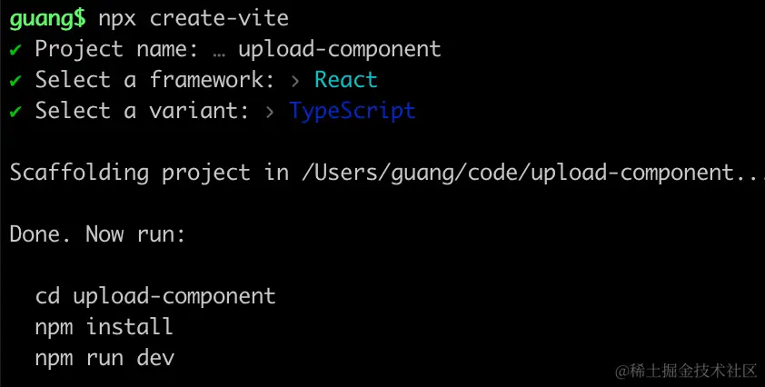

用 create-vite 创建个 react 项目。

去掉 index.css 和 StrictMode


然后把开发服务跑起来：

```
npm install
npm run dev
```


访问下试试：


然后我们先用下 antd 的 Upload 组件：

```
npm i --save antd
```
改下 App.tsx

```javascript
import React from 'react';
import { UploadOutlined } from '@ant-design/icons';
import type { UploadProps } from 'antd';
import { Button, message, Upload } from 'antd';

const props: UploadProps = {
  name: 'file',
  action: 'https://run.mocky.io/v3/435e224c-44fb-4773-9faf-380c5e6a2188',
  headers: {},
  onChange(info) {
    if (info.file.status !== 'uploading') {
      console.log(info.file, info.fileList);
    }
    if (info.file.status === 'done') {
      message.success(`${info.file.name} file uploaded successfully`);
    } else if (info.file.status === 'error') {
      message.error(`${info.file.name} file upload failed.`);
    }
  },
};

const App: React.FC = () => (
  <Upload {...props}>
    <Button icon={<UploadOutlined />}>Click to Upload</Button>
  </Upload>
);

export default App;
```


现在接口是 mock 的，这样不过瘾，我们用 express 起个服务来接收下文件。

根目录下新建 server.js

```javascript
import express from 'express';
import multer from 'multer';
import cors from 'cors';

const app = express()
app.use(cors());

const upload = multer({ 
    dest: 'uploads/'
})

app.post('/upload', upload.single('file'), function (req, res, next) {
  console.log('req.file', req.file);
  console.log('req.body', req.body);

  res.end(JSON.stringify({
    message: 'success'
  }));
})

app.listen(3333);
```

用 express 跑服务，然后用 cors 处理跨域请求，用 multer 来接收文件。

指定 dest 为 uploads 目录。

安装依赖，然后用 node 跑一下：

```
npm i --save express cors multer

node ./server.js
```
这里 node 能直接跑 es module 的代码是因为 package.json 里指定了 type 为 module：


也就是说默认所有 js 都是 es module 的。

然后改下上传路径：

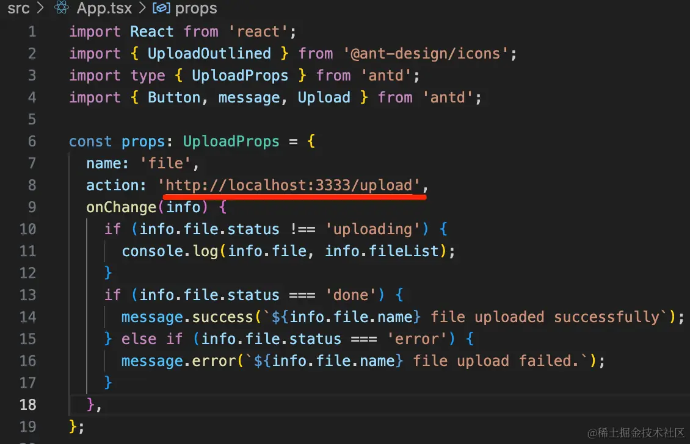

试一下：


上传成功，服务端也接收到了文件：

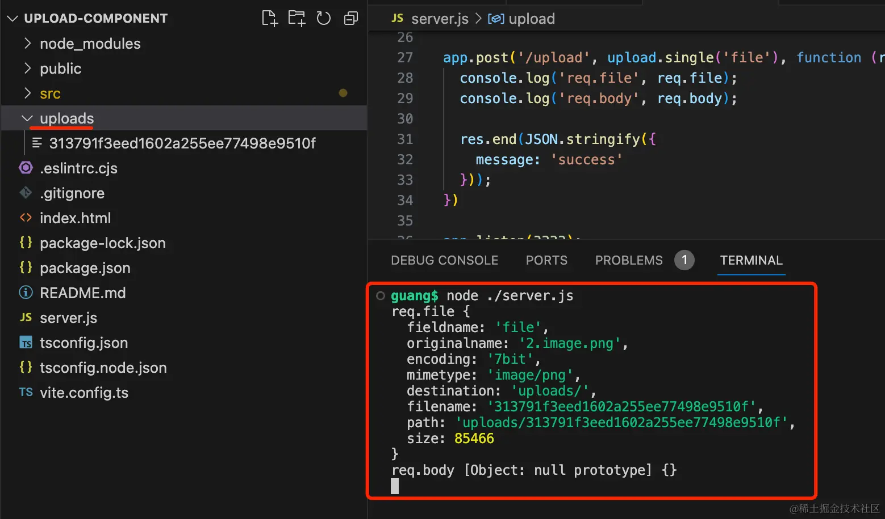

只不过现在的文件名没有带后缀名，我们可以自定义一下：

```javascript
import express from 'express';
import multer from 'multer';
import cors from 'cors';
import path from 'path';
import fs from 'fs';

const app = express()
app.use(cors());

const storage = multer.diskStorage({
    destination: function (req, file, cb) {
        try {
            fs.mkdirSync(path.join(process.cwd(), 'uploads'));
        }catch(e) {}
        cb(null, path.join(process.cwd(), 'uploads'))
    },
    filename: function (req, file, cb) {
        const uniqueSuffix = Date.now() + '-' + Math.round(Math.random() * 1E9) + '-' + file.originalname
        cb(null, uniqueSuffix)
    }
});
const upload = multer({ 
    dest: 'uploads/',
    storage
})

app.post('/upload', upload.single('file'), function (req, res, next) {
  console.log('req.file', req.file);
  console.log('req.body', req.body);

  res.end(JSON.stringify({
    message: 'success'
  }));
})

app.listen(3333);
```
自定义 storage，指定文件存储的目录以及文件名。


重新跑下服务，然后再次上传：


现在，文件保存的路径就改了

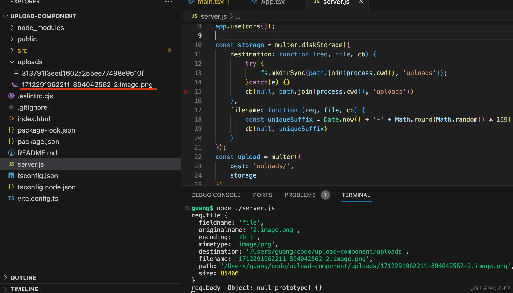

上传的图片也能正常打开：


接口搞定之后，我们自己来实现下这个 Upload 组件。

新建 Upload/index.tsx

```javascript
import { FC, useRef, ChangeEvent, PropsWithChildren } from 'react'
import axios from 'axios'

import './index.scss';

export interface UploadProps extends PropsWithChildren{
  action: string;
  headers?: Record<string, any>;
  name?: string;
  data?: Record<string, any>;
  withCredentials?: boolean;
  accept?: string;
  multiple?: boolean;
}

export const Upload: FC<UploadProps> = (props) => {
  const {
    action,
    name,
    headers,
    data,
    withCredentials,
    accept,
    multiple,
    children,
  } = props

  const fileInput = useRef<HTMLInputElement>(null);

  const handleClick = () => {
    if (fileInput.current) {
        fileInput.current.click()
    }
  }

  const handleFileChange = (e: ChangeEvent<HTMLInputElement>) => {
    const files = e.target.files
    if(!files) {
        return
    }
    uploadFiles(files)
    if (fileInput.current) {
        fileInput.current.value = ''
    }
  }

  const uploadFiles = (files: FileList) => {
    let postFiles = Array.from(files)
    postFiles.forEach(file => {
        post(file)
    })
  }

  const post = (file: File) => {
    const formData = new FormData()

    formData.append(name || 'file', file);
    if (data) {
        Object.keys(data).forEach(key => {
            formData.append(key, data[key])
        })
    } 

    axios.post(action, formData, {
        headers: {
            ...headers,
            'Content-Type': 'multipart/form-data'
        },
        withCredentials
    })
  }

  return (
    <div className="upload-component">
        <div 
            className="upload-input"
            onClick={handleClick}
        >
            {children}
            <input
                className="upload-file-input"
                type="file"
                ref={fileInput}
                onChange={handleFileChange}
                accept={accept}
                multiple={multiple}
            />
        </div>
    </div>
  )
}

export default Upload;
```
还有 Upload/index.scss
```css
.upload-input {
    display: inline-block;
}
.upload-file-input {
    display: none;
}
```
这些参数都很容易理解：


action 是上传的 url

headers 是携带的请求头

data 是携带的数据

name 是文件的表单字段名

accept 是 input 接受的文件格式

multiple 是 input 可以多选

然后渲染 children 外加一个隐藏的 file input

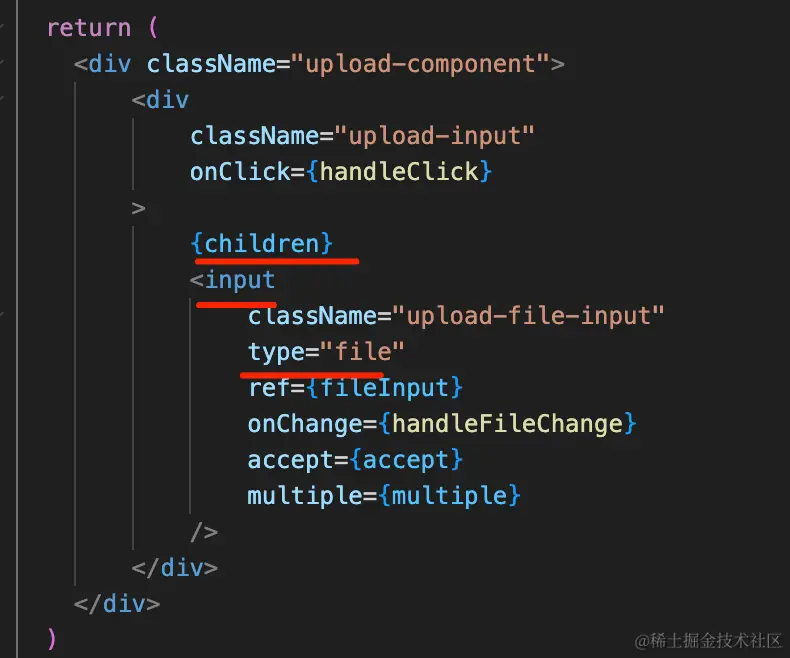

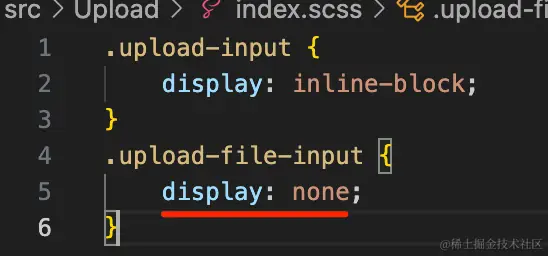

onChange 的时候，拿到所有 files 依次上传，之后把 file input 置空：

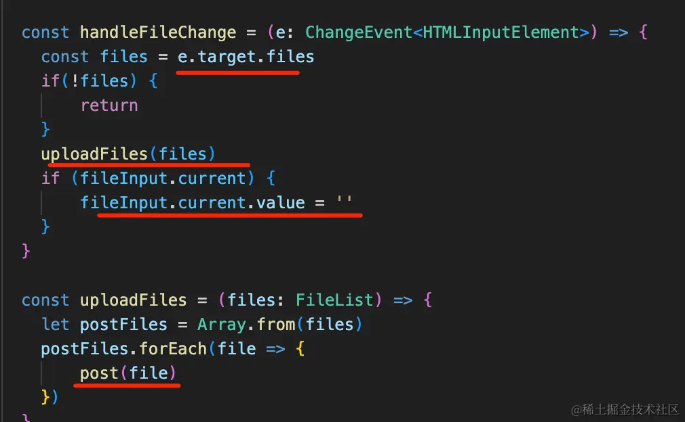

用 axios 来发送 post 请求，携带 FormData 数据，包含 file 和其它 data 字段：


再就是点击其它区域也触发 file input 的点击：


安装用到的 axios 包：

```
npm install --save axios
```

改下 App.tsx

```javascript
import React from 'react';
import { UploadOutlined } from '@ant-design/icons';
import { Button } from 'antd';
import Upload, { UploadProps } from './Upload'

const props: UploadProps = {
  name: 'file',
  action: 'http://localhost:3333/upload'
};

const App: React.FC = () => (
  <Upload {...props}>
    <Button icon={<UploadOutlined />}>Click to Upload</Button>
  </Upload>
);

export default App;
```

这里内层的 Button、Icon 还是用 antd 的，只是把 Upload 组件换成我们自己实现的。

然后测试下：


虽然界面还没加啥反馈，但请求已经发送成功了：


服务端也接受到了这个文件：

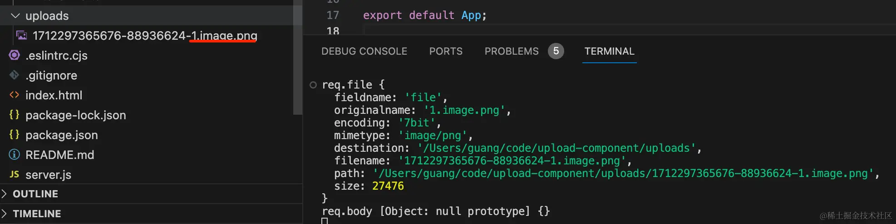

上传功能没问题，然后我们添加几个上传过程中的回调函数：

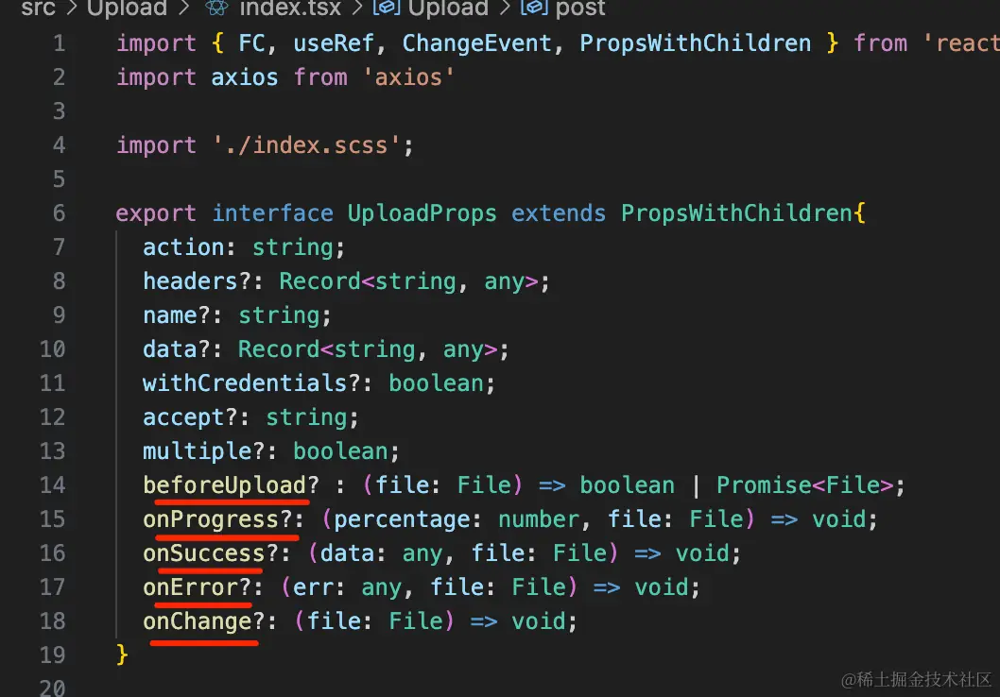

beforeUpload 是上传之前的回调，如果返回 false 就不上传，也可以返回 promise，比如在服务端校验的时候，等 resolve 之后才会上传

antd 的 [Upload 组件](https://ant-design.antgroup.com/components/upload-cn#components-upload-demo-avatar)就是这样的：


onProgress 是进度更新时的回调，可以拿到进度。

onSuccess 和 onError 是上传成功、失败时的回调。

onChange 是上传状态改变时的回调。

这几个回调分别在上传前、进度更新、成功、失败时调用：


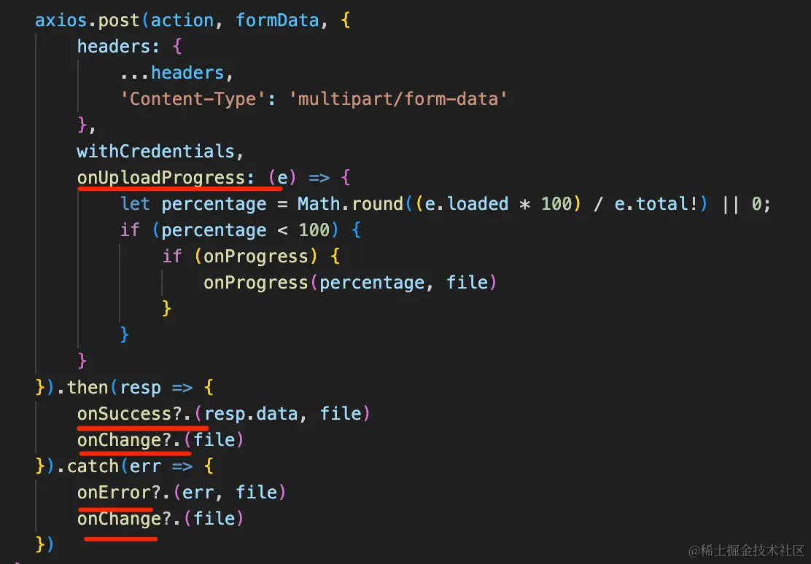

```javascript
import { FC, useRef, ChangeEvent, PropsWithChildren } from 'react'
import axios from 'axios'

import './index.scss';

export interface UploadProps extends PropsWithChildren{
  action: string;
  headers?: Record<string, any>;
  name?: string;
  data?: Record<string, any>;
  withCredentials?: boolean;
  accept?: string;
  multiple?: boolean;
  beforeUpload? : (file: File) => boolean | Promise<File>;
  onProgress?: (percentage: number, file: File) => void;
  onSuccess?: (data: any, file: File) => void;
  onError?: (err: any, file: File) => void;
  onChange?: (file: File) => void;
}

export const Upload: FC<UploadProps> = (props) => {
  const {
    action,
    name,
    headers,
    data,
    withCredentials,
    accept,
    multiple,
    children,
    beforeUpload,
    onProgress,
    onSuccess,
    onError,
    onChange,
  } = props

  const fileInput = useRef<HTMLInputElement>(null);

  const handleClick = () => {
    if (fileInput.current) {
        fileInput.current.click()
    }
  }

  const handleFileChange = (e: ChangeEvent<HTMLInputElement>) => {
    const files = e.target.files
    if(!files) {
        return
    }
    uploadFiles(files)
    if (fileInput.current) {
        fileInput.current.value = ''
    }
  }

  const uploadFiles = (files: FileList) => {
    let postFiles = Array.from(files)
    postFiles.forEach(file => {
        if (!beforeUpload) {
            post(file)
        } else {
            const result = beforeUpload(file)
            if (result && result instanceof Promise) {
                result.then(processedFile => {
                    post(processedFile)
                })
            } else if (result !== false) {
                post(file)
            }
        }
    })
  }

  const post = (file: File) => {
    const formData = new FormData()

    formData.append(name || 'file', file);
    if (data) {
        Object.keys(data).forEach(key => {
            formData.append(key, data[key])
        })
    } 

    axios.post(action, formData, {
        headers: {
            ...headers,
            'Content-Type': 'multipart/form-data'
        },
        withCredentials,
        onUploadProgress: (e) => {
            let percentage = Math.round((e.loaded * 100) / e.total!) || 0;
            if (percentage < 100) {
                if (onProgress) {
                    onProgress(percentage, file)
                }
            }
        }
    }).then(resp => {
        onSuccess?.(resp.data, file)
        onChange?.(file)
    }).catch(err => {
        onError?.(err, file)
        onChange?.(file)
    })
  }

  return (
    <div className="upload-component">
        <div 
            className="upload-input"
            onClick={handleClick}
        >
            {children}
            <input
                className="upload-file-input"
                type="file"
                ref={fileInput}
                onChange={handleFileChange}
                accept={accept}
                multiple={multiple}
            />
        </div>
    </div>
  )
}

export default Upload;
```
在 App.tsx 里传入对应参数：

```javascript
import React from 'react';
import { UploadOutlined } from '@ant-design/icons';
import { Button } from 'antd';
import Upload, { UploadProps } from './Upload'

const props: UploadProps = {
  name: 'file',
  action: 'http://localhost:3333/upload',
  beforeUpload(file) {
    if(file.name.includes('1.image')) {
      return false;
    }
    return true;
  },
  onSuccess(ret) {
    console.log('onSuccess', ret);
  },
  onError(err) {
    console.log('onError', err);
  },
  onProgress(percentage, file) {
    console.log('onProgress', percentage);
  },
  onChange(file) {
    console.log('onChange', file);
  }
};

const App: React.FC = () => (
  <Upload {...props}>
    <Button icon={<UploadOutlined />}>Click to Upload</Button>
  </Upload>
);

export default App;
```
包含 1.image 的文件返回 false，其余的返回 true

跑一下：


网速快的时候没有上传进度，改下网络设置：

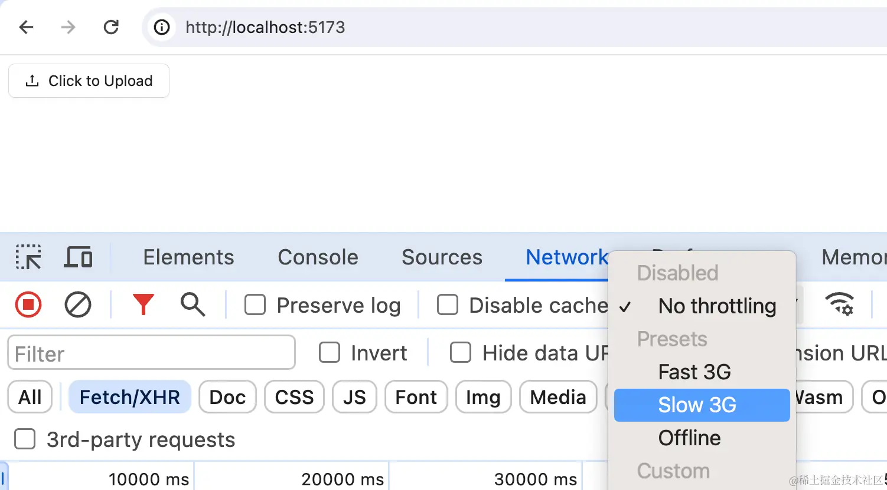


几个回调函数都没问题。

接下来我们添加下面的文件列表：


新建 Upload/UploadList.tsx

```javascript
import { FC } from 'react'
import { Progress } from 'antd';
import { CheckOutlined, CloseOutlined, DeleteOutlined, FileOutlined, LoadingOutlined } from '@ant-design/icons';

export interface UploadFile {
  uid: string;
  size: number;
  name: string;
  status?: 'ready' | 'uploading' | 'success' | 'error';
  percent?: number;
  raw?: File;
  response?: any;
  error?: any;
}

interface UploadListProps {
  fileList: UploadFile[];
  onRemove: (file: UploadFile) => void;
}

export const UploadList: FC<UploadListProps> = (props) => {
  const {
    fileList,
    onRemove,
  } = props;

  return (
    <ul className="upload-list">
      {
        fileList.map(item => {
            return (
                <li className={`upload-list-item upload-list-item-${item.status}`} key={item.uid}>
                    <span className='file-name'>
                        {
                            (item.status === 'uploading' || item.status === 'ready') && 
                                <LoadingOutlined />
                        }
                        {
                            item.status === 'success' && 
                                <CheckOutlined />
                        }
                        {
                            item.status === 'error' && 
                                <CloseOutlined />
                        }
                        {item.name}
                    </span>
                    <span className="file-actions">
                        <DeleteOutlined onClick={() => { onRemove(item)}}/>
                    </span>
                        {
                            item.status === 'uploading' && 
                                <Progress percent={item.percent || 0}/>
                        }
                </li>
            )
        })
      }
    </ul>
  )
}

export default UploadList;
```
这个组件传入 UploadFile 的数组和 onRemove 回调作为参数：

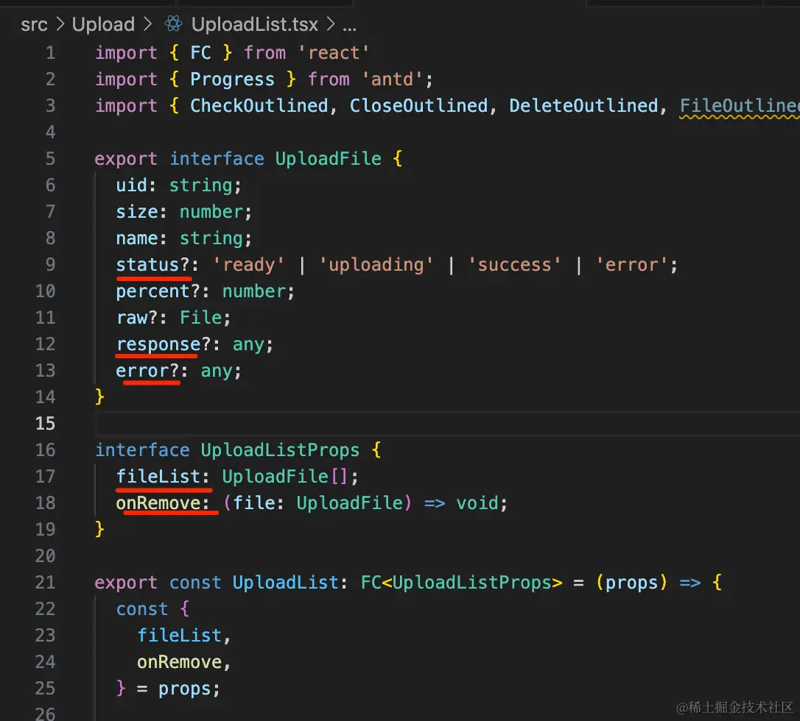

UploadFile 里除了文件信息外，还有 status、response、error

上传状态 status 有 ready、uploading、success、error 四种。

然后把 UploadFile 数组渲染出来：

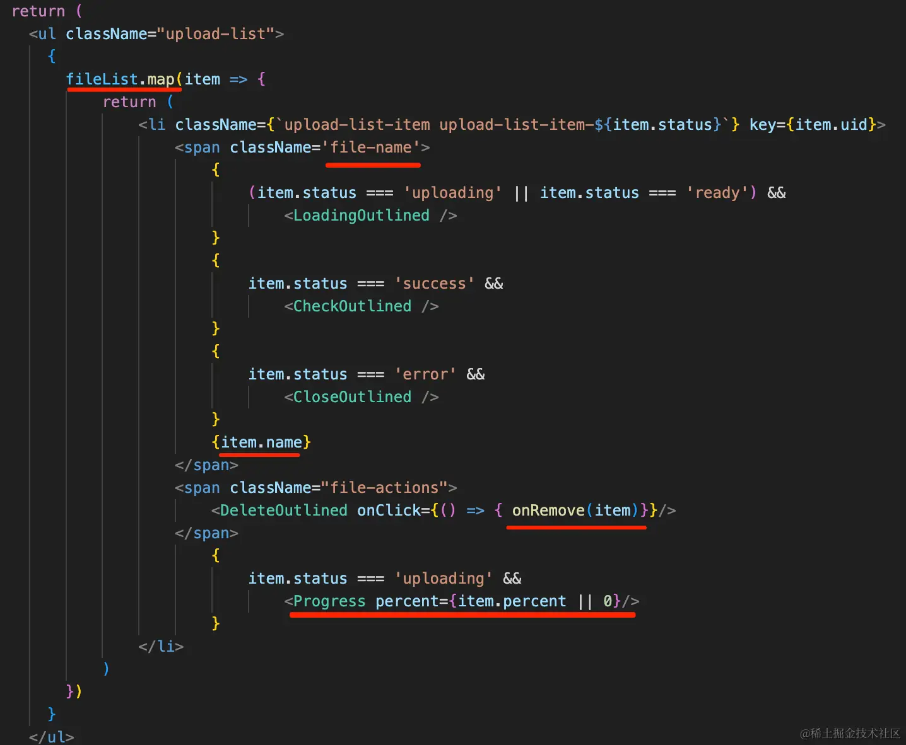

显示文件名、进度、删除按钮等。

点击删除的时候调用 onRemove 回调。

然后在 index.scss 里添加对应的样式：

```css
.upload-input {
    display: inline-block;
}
.upload-file-input {
    display: none;
}

.upload-list {
    margin: 0;
    padding: 0;
    list-style-type: none;
}
.upload-list-item {
    margin-top: 5px;

    font-size: 14px;
    line-height: 2em;
    font-weight: bold;

    box-sizing: border-box;
    min-width: 200px;

    position: relative;

    &-success {
        color: blue;
    }
    
    &-error {
        color: red;
    }

    .file-name {
        .anticon {
            margin-right: 10px;
        }
    }

    .file-actions {
        display: none;

        position: absolute;
        right: 7px;
        top: 0;

        cursor: pointer;
    }

    &:hover {
        .file-actions {
            display: block;
        }
    }
}
```
在 Upload/index.tsx 里引入试试：

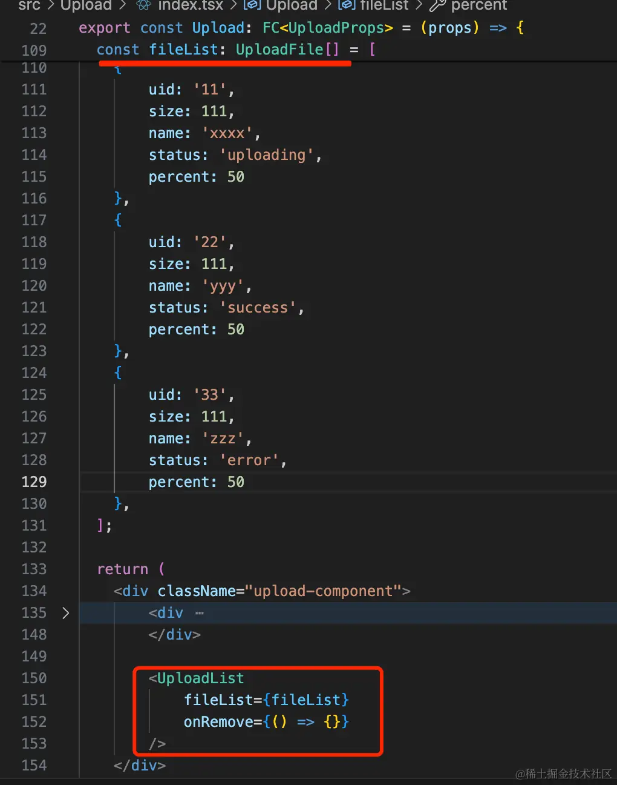

用 mock 的数据渲染 UploadList

```javascript
const fileList: UploadFile[] = [
    {
        uid: '11',
        size: 111,
        name: 'xxxx',
        status: 'uploading',
        percent: 50
    },
    {
        uid: '22',
        size: 111,
        name: 'yyy',
        status: 'success',
        percent: 50
    },
    {
        uid: '33',
        size: 111,
        name: 'zzz',
        status: 'error',
        percent: 50
    },
];

return (
    <div className="upload-component">
        <div 
            className="upload-input"
            onClick={handleClick}
        >
            {children}
            <input
                className="upload-file-input"
                type="file"
                ref={fileInput}
                onChange={handleFileChange}
                accept={accept}
                multiple={multiple}
            />
        </div>

        <UploadList
            fileList={fileList}
            onRemove={() => {}}
        />
    </div>
)
```

浏览器看一下:


没啥问题。

然后把数据变成动态的：

声明一个 fileList 的 state，并封装一个更新它的方法：

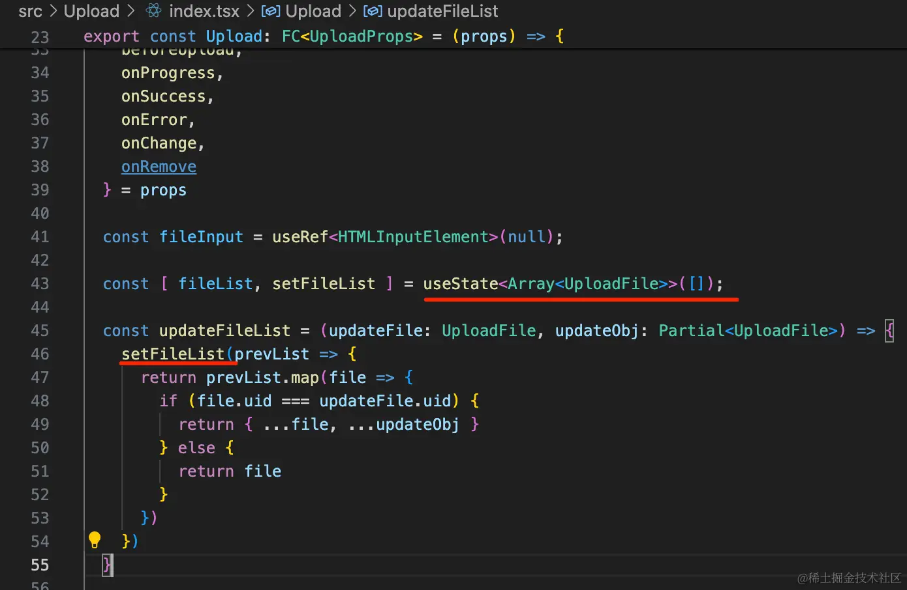

在状态改变的时候调用更新方法来更新 fileList：

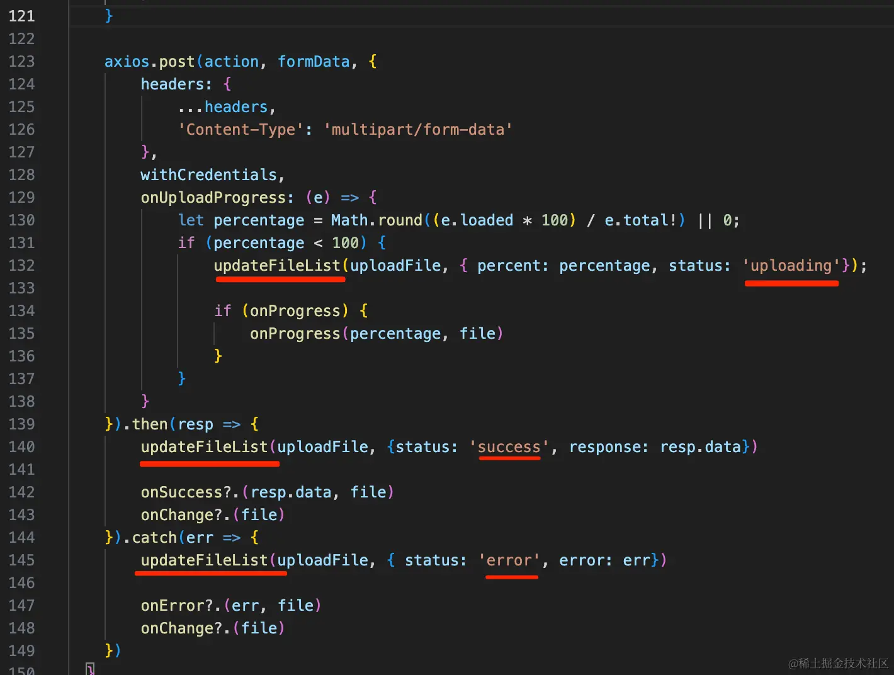

并且添加一个 onRemove 的回调：

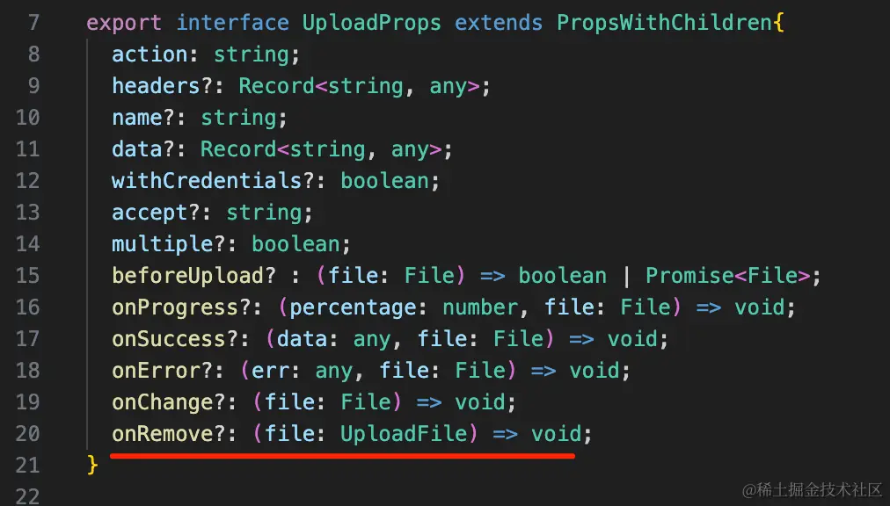

在点击删除按钮的时候调用：


```javascript
import { FC, useRef, ChangeEvent, PropsWithChildren, useState } from 'react'
import axios from 'axios'

import './index.scss';
import UploadList, { UploadFile } from './UploadList';

export interface UploadProps extends PropsWithChildren{
  action: string;
  headers?: Record<string, any>;
  name?: string;
  data?: Record<string, any>;
  withCredentials?: boolean;
  accept?: string;
  multiple?: boolean;
  beforeUpload? : (file: File) => boolean | Promise<File>;
  onProgress?: (percentage: number, file: File) => void;
  onSuccess?: (data: any, file: File) => void;
  onError?: (err: any, file: File) => void;
  onChange?: (file: File) => void;
  onRemove?: (file: UploadFile) => void;
}

export const Upload: FC<UploadProps> = (props) => {
  const {
    action,
    name,
    headers,
    data,
    withCredentials,
    accept,
    multiple,
    children,
    beforeUpload,
    onProgress,
    onSuccess,
    onError,
    onChange,
    onRemove
  } = props

  const fileInput = useRef<HTMLInputElement>(null);

  const [ fileList, setFileList ] = useState<Array<UploadFile>>([]);

  const updateFileList = (updateFile: UploadFile, updateObj: Partial<UploadFile>) => {
    setFileList(prevList => {
      return prevList.map(file => {
        if (file.uid === updateFile.uid) {
          return { ...file, ...updateObj }
        } else {
          return file
        }
      })
    })
  }

  const handleRemove = (file: UploadFile) => {
    setFileList((prevList) => {
      return prevList.filter(item => item.uid !== file.uid)
    })
    if (onRemove) {
      onRemove(file)
    }
  }

  const handleClick = () => {
    if (fileInput.current) {
        fileInput.current.click()
    }
  }

  const handleFileChange = (e: ChangeEvent<HTMLInputElement>) => {
    const files = e.target.files
    if(!files) {
        return
    }
    uploadFiles(files)
    if (fileInput.current) {
        fileInput.current.value = ''
    }
  }

  const uploadFiles = (files: FileList) => {
    let postFiles = Array.from(files)
    postFiles.forEach(file => {
        if (!beforeUpload) {
            post(file)
        } else {
            const result = beforeUpload(file)
            if (result && result instanceof Promise) {
                result.then(processedFile => {
                    post(processedFile)
                })
            } else if (result !== false) {
                post(file)
            }
        }
    })
  }

  const post = (file: File) => {
    let uploadFile: UploadFile = {
        uid: Date.now() + 'upload-file',
        status: 'ready',
        name: file.name,
        size: file.size,
        percent: 0,
        raw: file
    }
    setFileList(prevList => {
        return [uploadFile, ...prevList]
    })

    const formData = new FormData()

    formData.append(name || 'file', file);
    if (data) {
        Object.keys(data).forEach(key => {
            formData.append(key, data[key])
        })
    } 

    axios.post(action, formData, {
        headers: {
            ...headers,
            'Content-Type': 'multipart/form-data'
        },
        withCredentials,
        onUploadProgress: (e) => {
            let percentage = Math.round((e.loaded * 100) / e.total!) || 0;
            if (percentage < 100) {
                updateFileList(uploadFile, { percent: percentage, status: 'uploading'});

                if (onProgress) {
                    onProgress(percentage, file)
                }
            }
        }
    }).then(resp => {
        updateFileList(uploadFile, {status: 'success', response: resp.data})

        onSuccess?.(resp.data, file)
        onChange?.(file)
    }).catch(err => {
        updateFileList(uploadFile, { status: 'error', error: err})

        onError?.(err, file)
        onChange?.(file)
    })
  }

  return (
    <div className="upload-component">
        <div 
            className="upload-input"
            onClick={handleClick}
        >
            {children}
            <input
                className="upload-file-input"
                type="file"
                ref={fileInput}
                onChange={handleFileChange}
                accept={accept}
                multiple={multiple}
            />
        </div>

        <UploadList
            fileList={fileList}
            onRemove={handleRemove}
        />
    </div>
  )
}

export default Upload;
```
大功告成，我们测试下：


文件上传状态没问题，服务端也收到了上传的文件。

至此，我们的 Upload 组件就完成了。

然后我们再加上拖拽上传的功能：

创建 Upload/Dragger.tsx

```javascript
import { FC, useState, DragEvent, PropsWithChildren } from 'react'
import classNames from 'classnames'

interface DraggerProps extends PropsWithChildren{
  onFile: (files: FileList) => void;
}

export const Dragger: FC<DraggerProps> = (props) => {

  const { onFile, children } = props

  const [ dragOver, setDragOver ] = useState(false)

  const cs = classNames('upload-dragger', {
    'is-dragover': dragOver
  })

  const handleDrop = (e: DragEvent<HTMLElement>) => {
    e.preventDefault()
    setDragOver(false)
    onFile(e.dataTransfer.files)
  }
  
  const handleDrag = (e: DragEvent<HTMLElement>, over: boolean) => {
    e.preventDefault()
    setDragOver(over)
  }

  return (
    <div 
      className={cs}
      onDragOver={e => { handleDrag(e, true)}}
      onDragLeave={e => { handleDrag(e, false)}}
      onDrop={handleDrop}
    >
      {children}
    </div>
  )
}

export default Dragger;
```


因为拖拽文件到这里的时候，会有对应的样式，所以我们要在 dragover 和 dragleave 的时候分别设置不同的 dragOver 状态值，然后更改 className

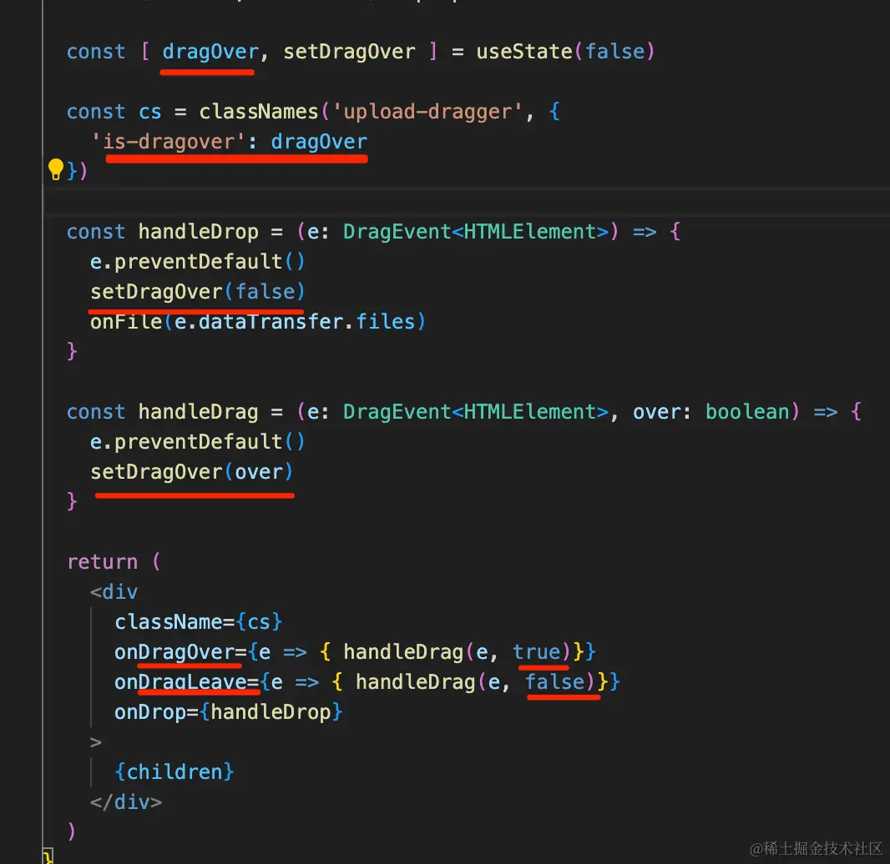

然后在 drop 的时候，把文件传给 onFile 回调函数：

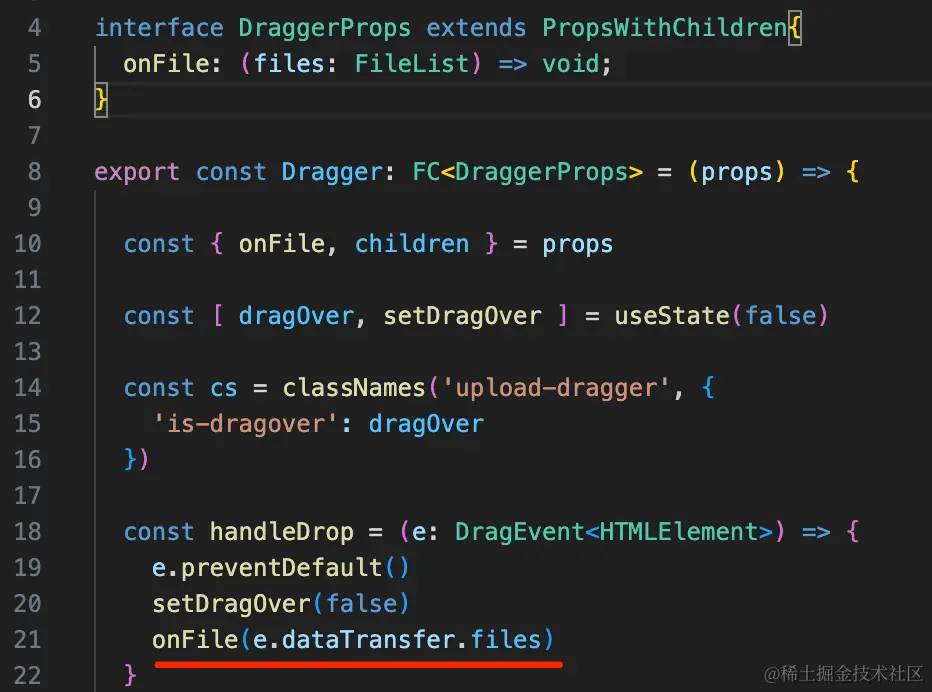

在 index.scss 里加上它的样式：

```css
.upload-dragger {
    background: #eee;
    border: 1px dashed #aaa;
    border-radius: 4px;
    cursor: pointer;
    padding: 20px;
    width: 200px;
    height: 100px;
    text-align: center;

    &.is-dragover {
      border: 2px dashed blue;
      background: rgba(blue, .3);
    }
}
```

然后在 Upload/index.tsx 引入 Dragger 组件：

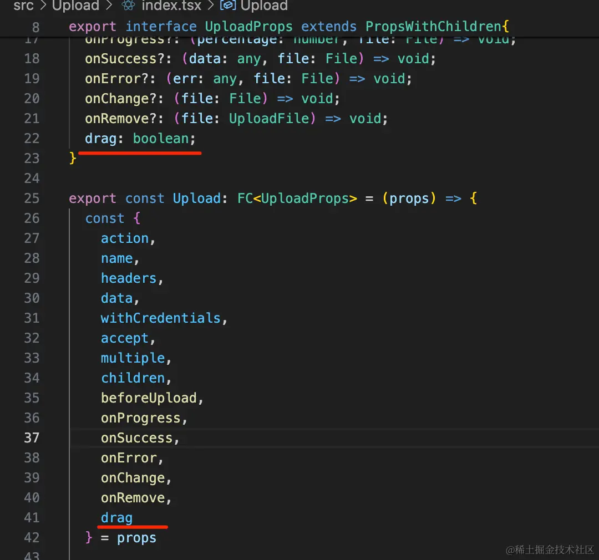

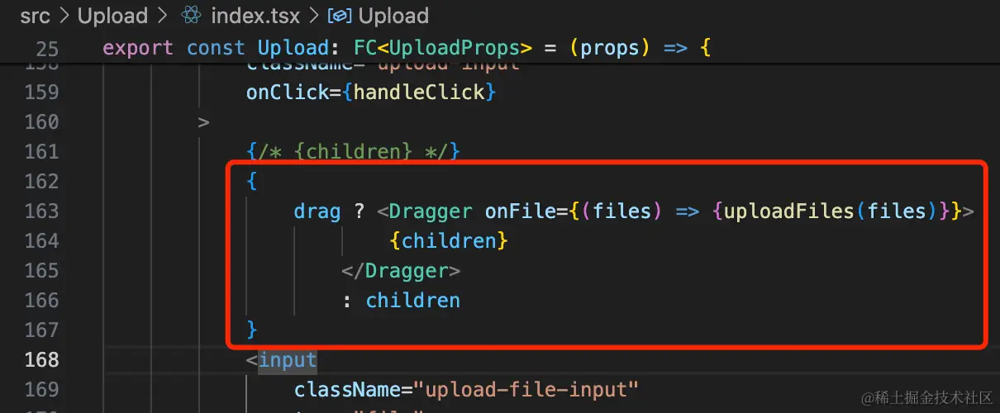

```javascript
{
    drag ? <Dragger onFile={(files) => {uploadFiles(files)}}>
            {children}
        </Dragger>
        : children
}
```
当传入 drag 参数的时候，渲染 dragger 组件，onFile 回调里调用 uploadFiles 方法来上传。

在 index.tsx 里试试：


浏览器访问下：


没啥问题。

可以改下 Upload 组件的 children：

```javascript
const App: React.FC = () => (
  <Upload {...props} drag>
    <p>
      <InboxOutlined style={{fontSize: '50px'}}/>
    </p>
    <p>点击或者拖拽文件到此处</p>
  </Upload>
);
```


这样，拖拽上传就完成了。

案例代码上传了[小册仓库](https://github.com/QuarkGluonPlasma/react-course-code/tree/main/upload-component)

## 总结

今天我们实现了 Upload 组件。

首先用 express + multer 跑的服务端，创建 /upload 接口来接收文件。

然后在 Upload 组件里调用 axios，上传包含 file 的 FormData。

之后加上了 beforeUpload、onProgress、onSuccess、onChange 等回调函数。

最后又加上了 UploadList 来可视化展示上传文件的状态。

然后实现了 Dragger 组件，可以拖拽文件来上传。

这样，我们就实现了 Upload 组件。
