# 第41章—组件库实战：构建umd产物，通过unpkg访问

上节做了 esm 和 commonjs、scss 代码的编译，并发布到 npm，在项目里使用没啥问题。

绝大多数情况下，这样就足够了。

umd 的打包做不做都行。

想一下，你是否用过 antd 的 umd 格式的代码？

是不是没用过？

但如果你做一个开源组件库，那还是要支持的。

这节我们就来做下 umd 的打包：

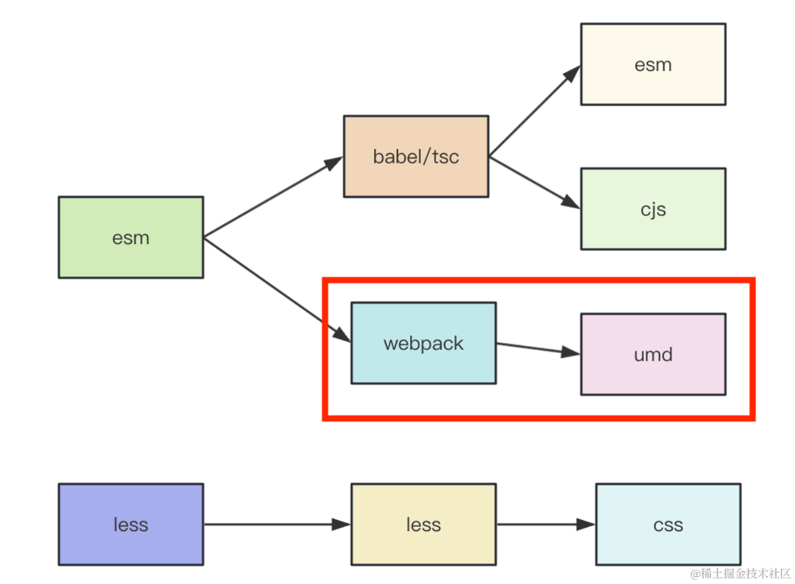

前面分析过，大多数组件库都用 webpack 来打包的。

我们先用下 antd 的 umd 的代码。

```
mkdir antd-umd-test
cd antd-umd-test
npm init -y
```

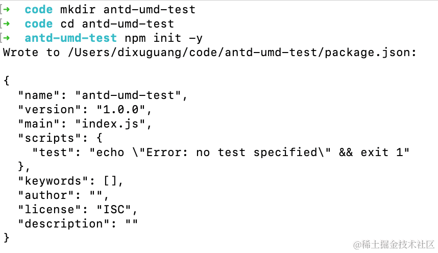

新建 index.html

```html
<!DOCTYPE html>
<html lang="en">
<head>
    <meta charset="UTF-8">
    <meta name="viewport" content="width=device-width, initial-scale=1.0">
    <title>Document</title>
    <script src="https://unpkg.com/react@18.3.1/umd/react.production.min.js"></script>
    <script src="https://unpkg.com/react-dom@18.3.1/umd/react-dom.production.min.js"></script>
    <script src="https://unpkg.com/dayjs@1.11.11/dayjs.min.js"></script>
    <script src="https://unpkg.com/antd@5.19.0/dist/antd.min.js"></script>
</head>
<body>
    
</body>
</html>
```
antd 依赖的 react、react-dom、dayjs 包也得用 umd 引入。

跑个静态服务：

```
npx http-server .
```
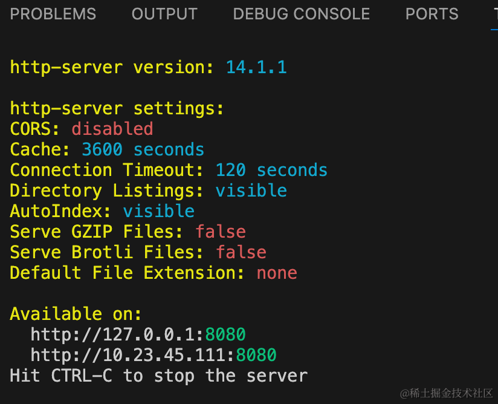

浏览器访问下：

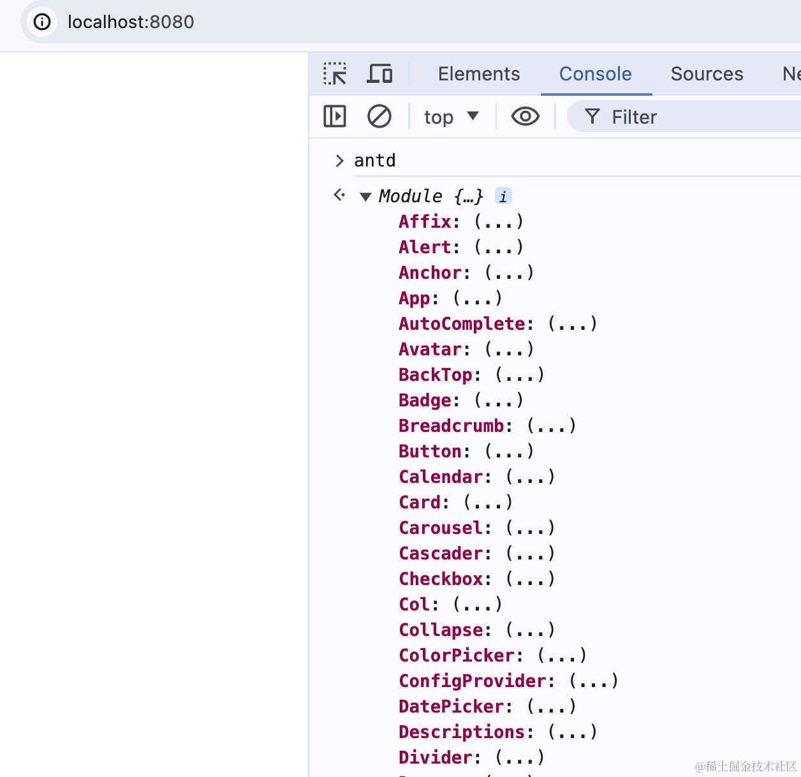

通过全局变量 antd 来访问各种组件。

我们渲染个 Table 组件试一下：
```html
<!DOCTYPE html>
<html lang="en">
<head>
    <meta charset="UTF-8">
    <meta name="viewport" content="width=device-width, initial-scale=1.0">
    <title>Document</title>
    <script src="https://unpkg.com/react@18.3.1/umd/react.production.min.js"></script>
    <script src="https://unpkg.com/react-dom@18.3.1/umd/react-dom.production.min.js"></script>
    <script src="https://unpkg.com/dayjs@1.11.11/dayjs.min.js"></script>
    <script src="https://unpkg.com/antd@5.19.0/dist/antd.min.js"></script>
</head>
<body>
    <div id="root"></div>
    <script>
        const dataSource = [
            {
                key: '1',
                name: '胡彦斌',
                age: 32,
                address: '西湖区湖底公园1号',
            },
            {
                key: '2',
                name: '胡彦祖',
                age: 42,
                address: '西湖区湖底公园1号',
            },
            ];

            const columns = [
            {
                title: '姓名',
                dataIndex: 'name',
                key: 'name',
            },
            {
                title: '年龄',
                dataIndex: 'age',
                key: 'age',
            },
            {
                title: '住址',
                dataIndex: 'address',
                key: 'address',
            },
            ];

            const container = document.getElementById('root');
            const root = ReactDOM.createRoot(container);

            root.render(React.createElement(antd.Table, { dataSource: dataSource, columns: columns }));
    </script>
</body>
</html>
```

这里不能直接写 jsx，需要用 babel 或者 tsc 之类的[编译一下](https://www.typescriptlang.org/play/?#code/DwFQhgRgNgpgBAEzAFzAZQPYFcBOBjGAXgG8lVNcCBfOPDKLAWwDsBnEuhl1mgegD4gA)：

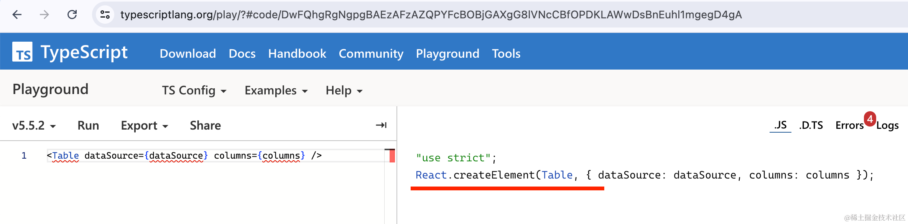

浏览器看一下：

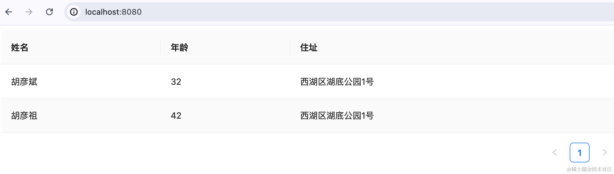

渲染成功！

这就是 umd 的方式如何使用组件库。

我们的组件库也支持下 umd：


加一下 webpack.config.js

```javascript
const path = require('path');

/**
 * @type {import('webpack').Configuration}
 */
module.exports = {
    mode: 'development',
    devtool: 'source-map',
    entry: {
        index: ['./src/index.ts']
    },
    output: {
        filename: 'guang-components.js',
        path: path.join(__dirname, 'dist/umd'),
        library: 'Guang',
        libraryTarget: 'umd'
    },
    module: {
        rules: [
            {
                test: /\.tsx?$/,
                loader: 'ts-loader',
                options: {
                    configFile: 'tsconfig.build.json'
                }
            }
        ]
    },
    resolve: {
        extensions: ['.ts', '.tsx', '.js', '.jsx', '.json']
    },
    externals: {
        react: 'React',
        'react-dom': 'ReactDOM',
        dayjs: 'dayjs'
    }
};
```
就是从 index.ts 入口开始打包，产物格式为 umd，文件名 guang-components.js，全局变量为 Guang。

用 ts-loader 来编译 ts 代码，指定配置文件为 tsconfig.build.json。

注意打包的时候不要把 react 和 react-dom、dayjs 包打进去，而是加在 external 配置里，也就是从全局变量来访问这些依赖。

安装依赖：

```
npm install --save-dev webpack-cli webpack ts-loader
```

这里的 jsdoc 注释是为了引入 ts 类型的，可以让 webpack.config.js 有类型提示：


对 jsdoc 感兴趣的话可以看我这篇文章：[JSDoc 真能取代 TypeScript？](https://juejin.cn/post/7292437487011856394)

打包一下：

```
npx webpack
```
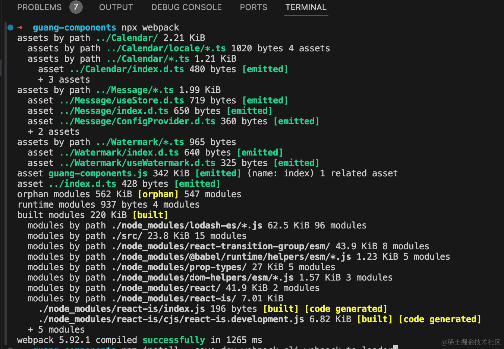

然后看下产物：


看起来没啥问题。

这三个模块也都是通过直接读取全局变量的方式引入，没有打包进去：

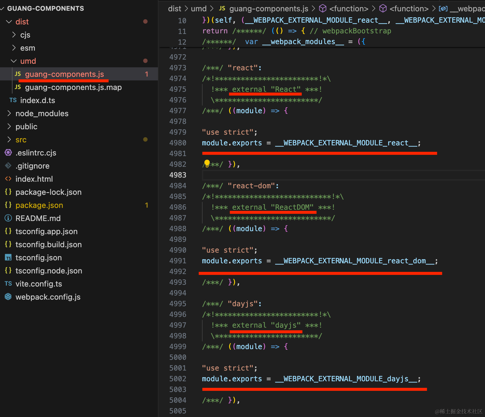

在 package.json 改下版本号，添加 unpkg 的入口，然后发布到 npm：
```
npm publish
```
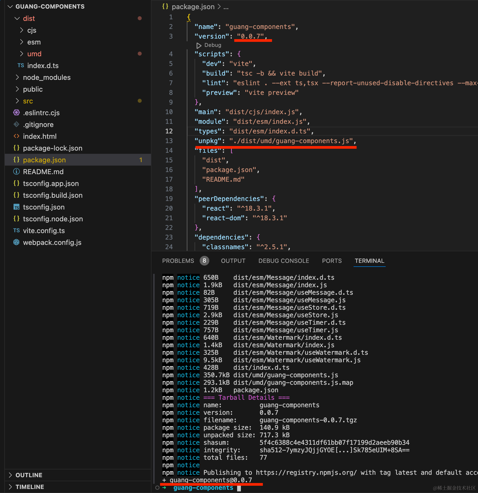

在 unpkg 访问下：

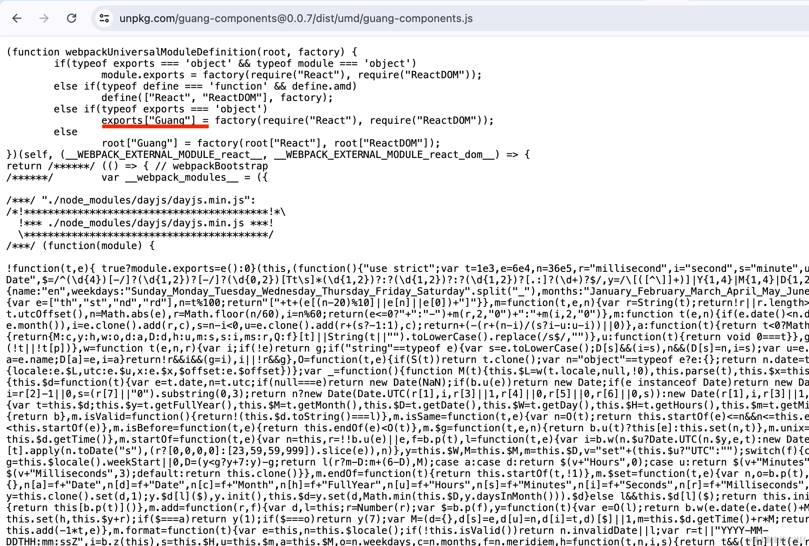

访问 https://unpkg.com/guang-components 会自动重定向到最新版本的 umd 代码。

回到刚才的 antd-umd-test 项目，添加一个 index2.html，引入 guang-components

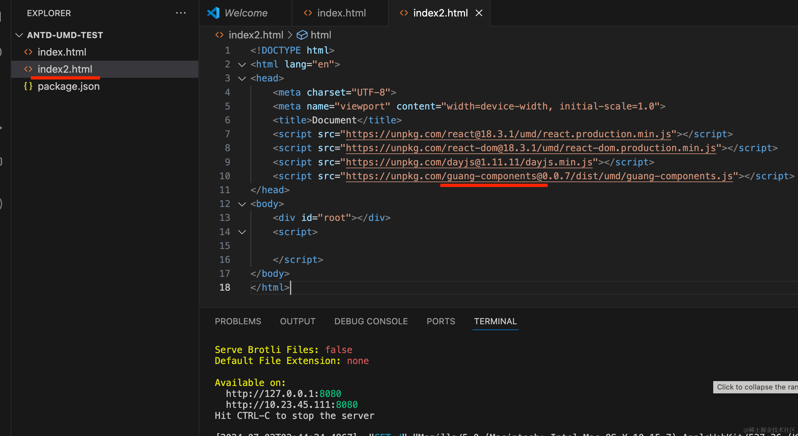

```html
<!DOCTYPE html>
<html lang="en">
<head>
    <meta charset="UTF-8">
    <meta name="viewport" content="width=device-width, initial-scale=1.0">
    <title>Document</title>
    <script src="https://unpkg.com/react@18.3.1/umd/react.production.min.js"></script>
    <script src="https://unpkg.com/react-dom@18.3.1/umd/react-dom.production.min.js"></script>
    <script src="https://unpkg.com/dayjs@1.11.11/dayjs.min.js"></script>
    <script src="https://unpkg.com/guang-components@0.0.7/dist/umd/guang-components.js"></script>
</head>
<body>
    <div id="root"></div>
    <script>

    </script>
</body>
</html>
```
浏览器访问下：

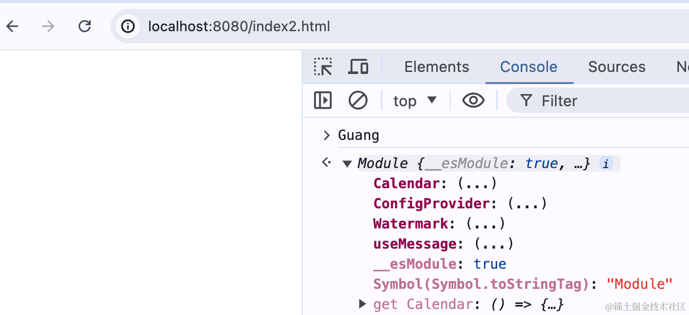

可以通过全局变量 Guang 来拿到组件。

css 也是通过 [unpkg 来拿到](https://unpkg.com/guang-components@0.0.8/dist/esm/Calendar/index.css)：


然后我们渲染下：

```html
<!DOCTYPE html>
<html lang="en">
<head>
    <meta charset="UTF-8">
    <meta name="viewport" content="width=device-width, initial-scale=1.0">
    <title>Document</title>
    <script src="https://unpkg.com/react@18.3.1/umd/react.production.min.js"></script>
    <script src="https://unpkg.com/react-dom@18.3.1/umd/react-dom.production.min.js"></script>
    <script src="https://unpkg.com/dayjs@1.11.11/dayjs.min.js"></script>
    <script src="https://unpkg.com/guang-components@0.0.7/dist/umd/guang-components.js"></script>
    
    https://unpkg.com/guang-components@0.0.8/dist/esm/Calendar/index.css
</head>
<body>
    <div id="root"></div>
    <script>
        const container = document.getElementById('root');
        const root = ReactDOM.createRoot(container);

        root.render(React.createElement(Guang.Calendar, { value: dayjs('2024-07-01') }));
    </script>
</body>
</html>
```
jsx 在 [ts playground](https://www.typescriptlang.org/play/?#code/DwYQhgNgpgdgJmATgAgG6QK5QLwG8ECeAVgM4AUA5AEwAMVALALQ0DszAjBQJQC+AfMAD04aPCR8AUEA) 编译：

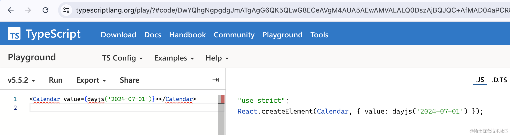

浏览器访问下：


可以看到，umd 的组件库代码生效了。

但是控制台有个报错：

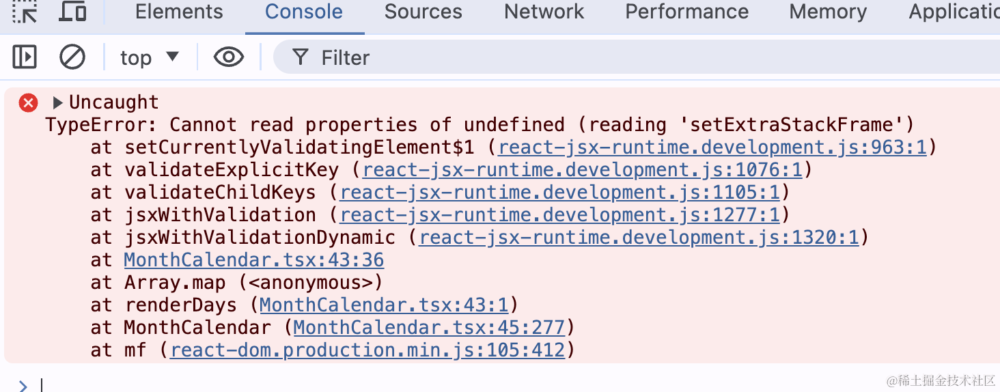

点进去可以看到是 \_jsx 这个函数的问题：

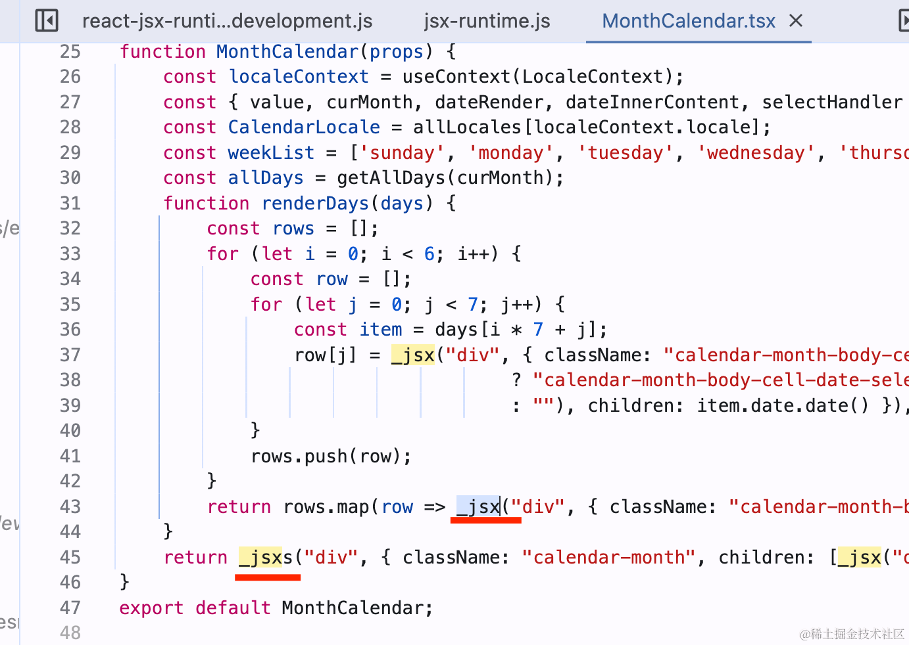

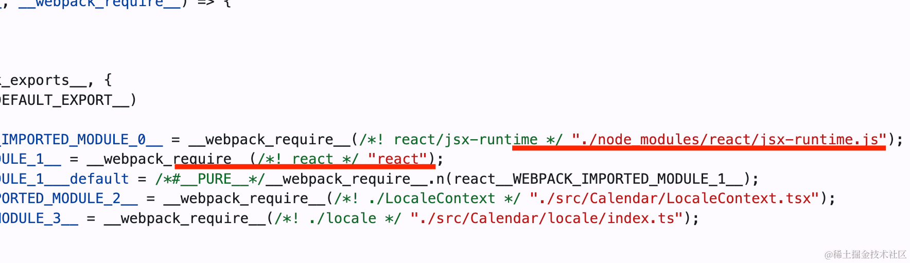

react 我们通过 externals 的方式，从全局变量引入。

但是这个 react/jsx-runtime 不会。

这个 react/jsx-runtime 是干啥的呢？

同一份 [jsx 代码](https://www.typescriptlang.org/play/?jsx=4#code/DwFQhgRgNgpgBAEzAFzAZQPYFcBOBjGAXgG8lVNcCBfOPDKLAWwDsBnEuhl1mgegD4gA)：

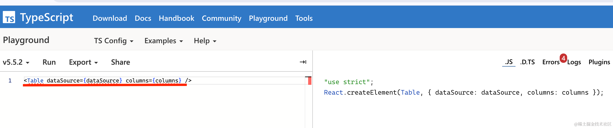

你在 [typescript playground](https://www.typescriptlang.org/play/?jsx=4#code/DwFQhgRgNgpgBAEzAFzAZQPYFcBOBjGAXgG8lVNcCBfOPDKLAWwDsBnEuhl1mgegD4gA) 里把 jsx 编译选项切换为 react：

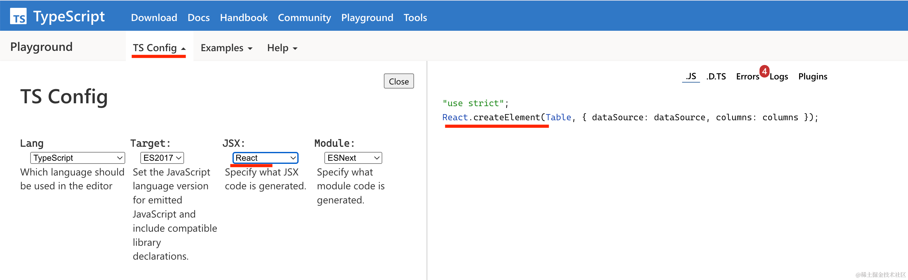

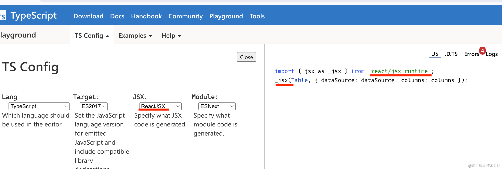

可以看到是不同的编译结果。

React 17 之前都是编译为 React.createElement，这需要运行的时候有 React 这个变量，所以之前每个组件都要加上 import React from 'react' 才行。

React 17 之后就加了下面的方式，直接编译为用 react/jsx-runtime 的 api 的方式。不再需要都加上 import React from 'react' 了。

我们组件库也是用的这种：

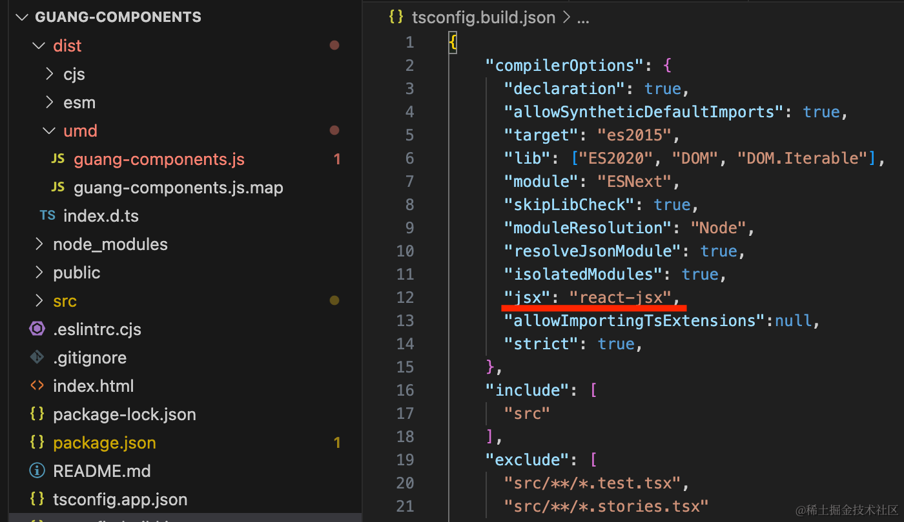

但现在打包 umd 代码的时候，这样有问题。

所以我们把 jsx 编译配置改一下就好了。

修改 jsx 为 react 之后，会有一些报错：

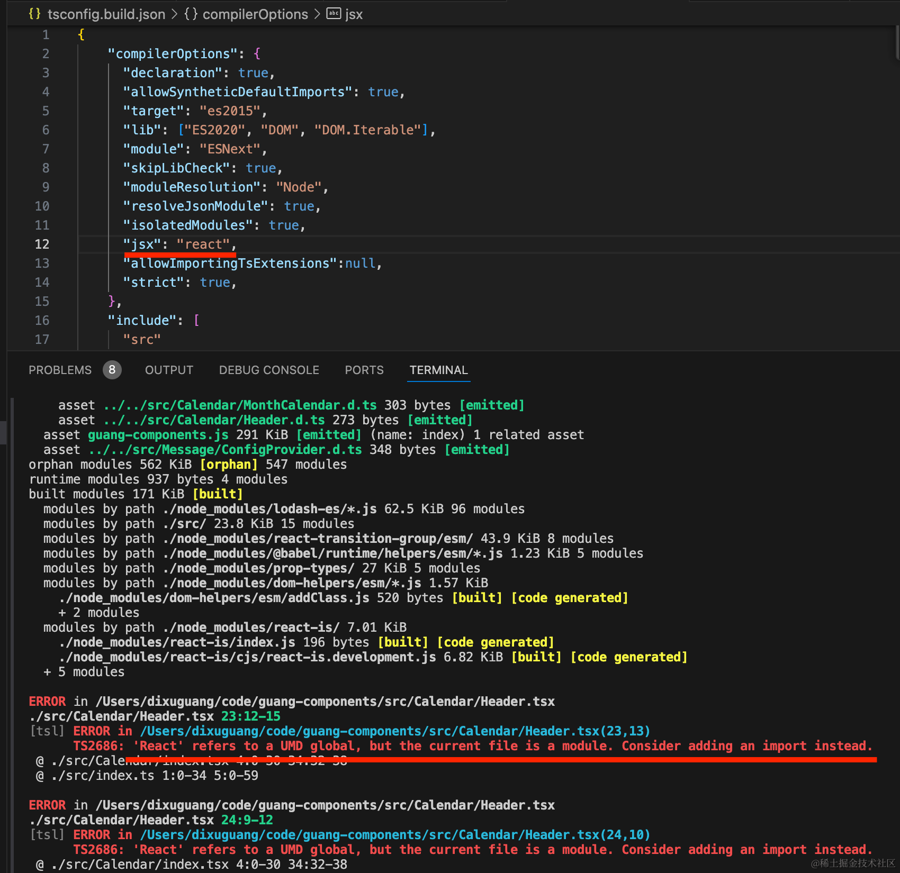

在每个报错的组件加一下 React 全局变量：

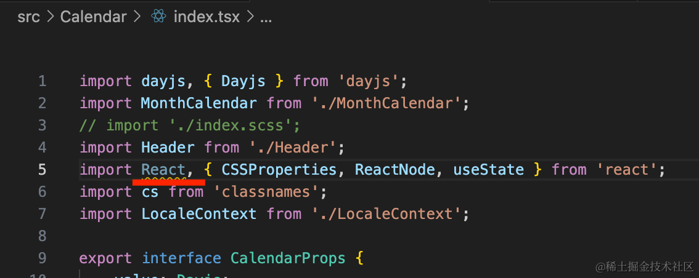

再次打包就好了：

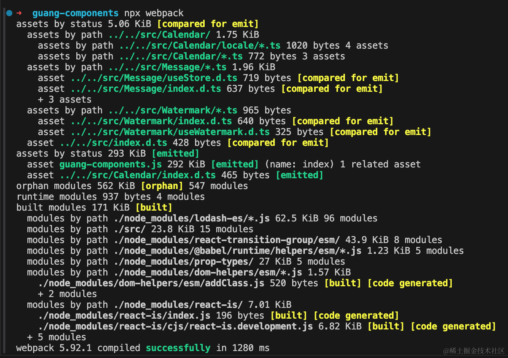

改下版本号，重新发布一下：

```
npm publish
```


改下 index2.html 里用的组件库的版本号：

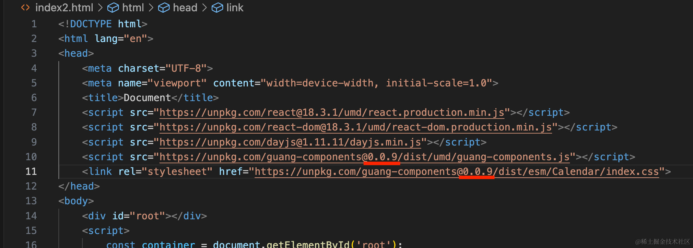

现在就没报错了：

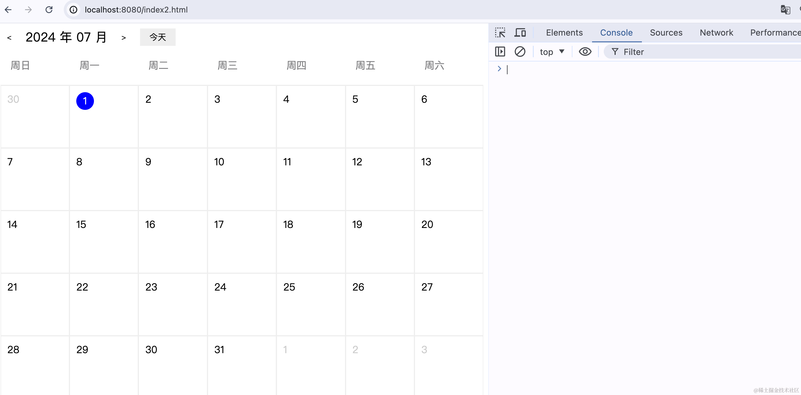

这样，我们的组件库就支持了 umd。

案例代码上传了[小册仓库](https://github.com/QuarkGluonPlasma/react-course-code/tree/main/guang-components)。
## 总结

前面分析过，组件库基本都会提供 esm、commonjs、umd 三种格式的代码。

这节我们实现了 umd 的支持，通过 webpack 做了打包。

打包逻辑很简单：用 ts-loader 来编译 typescript 代码，然后 react、react-dom 等模块用 externals 的方式引入就好了。

再就是 react 通过 externals 的方式，会导致 react/jsx-runtime 引入有问题，所以我们修改了 tsconfig.json 的 jsx 的编译为 react，也就是编译成 React.createElement 的代码。

虽然 umd 的方式用的场景不多，但我们组件库还是要支持的。
