# 第43章—基于ReactRouter实现keepalive

当路由切换的时候，react router 会销毁之前路由的组件，然后渲染新的路由对应的组件。

在一些场景下，这样是有问题的。

比如移动端很多长列表，用户划了很久之后，点击某个列表项跳到详情页，之后又跳回来，但是这时候列表页的组件销毁重新创建，又回到了最上面。

比如移动端填写了某个表单，有的表单需要跳到别的页面获取数据，然后跳回来，跳回来发现组件销毁重新创建，之前填的都没了。

类似这种场景，就需要路由切换的时候不销毁组件，也就是 keepalive。

我们先复现下这个场景：

```
npx create-vite
```
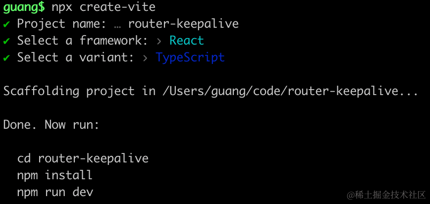

进入项目，安装依赖，把开发服务跑起来：

```
npm install
npm run dev
```
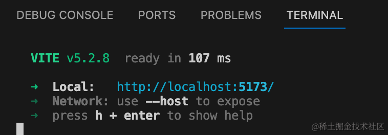

安装 react-router：

```
npm i --save react-router-dom
```
在 App.tsx 写下路由：

```javascript
import { useState } from 'react';
import {  Link, useLocation, RouterProvider, createBrowserRouter, Outlet } from 'react-router-dom';

const Layout = () => {
    const { pathname } = useLocation();

    return (
        <div>
            <div>当前路由: {pathname}</div>
            <Outlet/>
        </div>
    )
}

const Aaa = () => {
    const [count, setCount] = useState(0);

    return <div>
      <p>{count}</p>
      <p>
        <button onClick={() => setCount(count => count + 1)}>加一</button>
      </p>
      <Link to='/bbb'>去 Bbb 页面</Link><br/>
      <Link to='/ccc'>去 Ccc 页面</Link>
    </div>
};

const Bbb = () => {
    const [count, setCount] = useState(0);

    return <div>
      <p>{count}</p>
      <p><button onClick={() => setCount(count => count + 1)}>加一</button></p>
      <Link to='/'>去首页</Link>
    </div>
};

const Ccc = () => {
    return <div>
      <p>ccc</p>
      <Link to='/'>去首面</Link>
    </div>
};

const routes = [
  {
    path: "/",
    element: <Layout></Layout>,
    children: [
      {
        path: "/",
        element: <Aaa></Aaa>,
      },
      {
        path: "/bbb",
        element: <Bbb></Bbb>
      },
      {
        path: "/ccc",
        element: <Ccc></Ccc>
      }
    ]
  }
];

export const router = createBrowserRouter(routes);

const App = () => {
    return <RouterProvider router={router}/>
}

export default App;
```
这里有 /、/bbb、/ccc 这三个路由。

一级路由渲染 Layout 组件，里面通过 Outlet 指定渲染二级路由的地方。

二级路由 / 渲染 Aaa 组件，/bbb 渲染 Bbb 组件，/ccc 渲染 Ccc 组件。

这里的 Outlet 组件，也可以换成 useOutlet，效果一样：

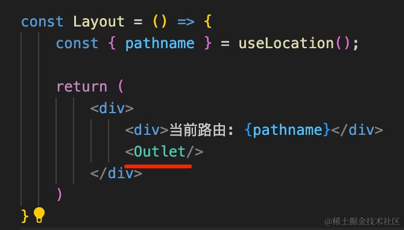

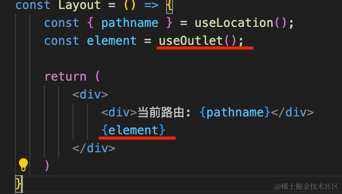

注释掉 index.css 还有 StrictMode：

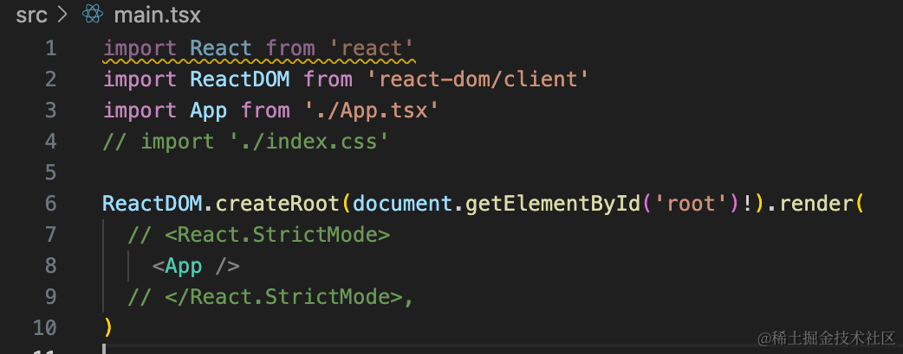

在浏览器看一下：

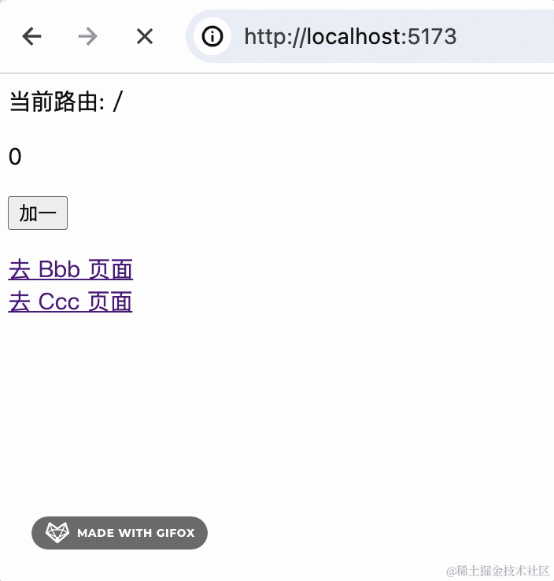

默认路由切换，对应的组件就会销毁：

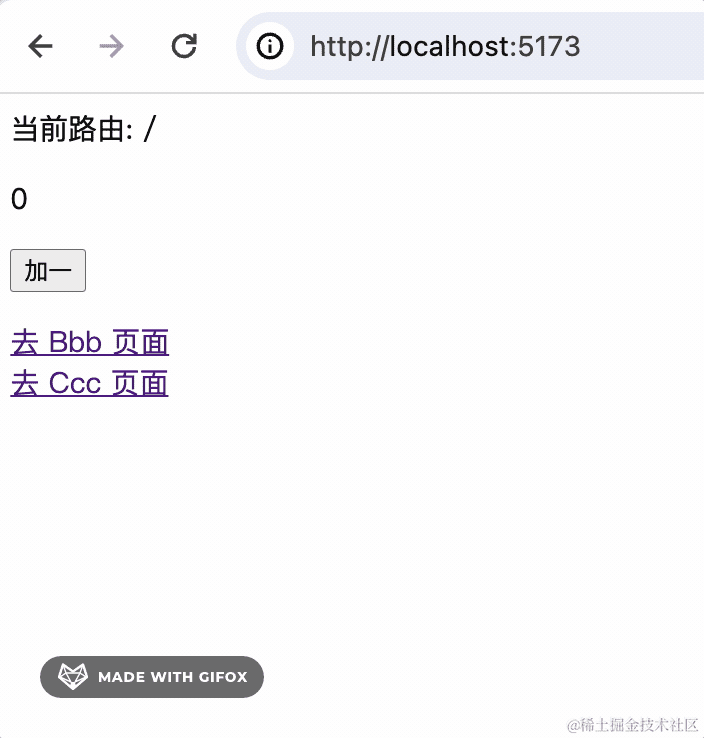

我们有时候不希望切换路由时销毁页面组件，也就是希望能实现 keepalive。

怎么做呢？

其实很容易想到，我们把所有需要 keepalive 的组件保存到一个全局对象。

然后渲染的时候把它们都渲染出来，路由切换只是改变显示隐藏。

按照这个思路来写一下：

新建 keepalive.tsx

```javascript
import React, { createContext, useContext } from 'react';
import { useOutlet, useLocation, matchPath } from 'react-router-dom'
import type { FC, PropsWithChildren, ReactNode } from 'react';

interface KeepAliveLayoutProps extends PropsWithChildren{
    keepPaths: Array<string | RegExp>;
    keepElements?: Record<string, ReactNode>;
    dropByPath?: (path: string) => void;
}

type KeepAliveContextType = Omit<Required<KeepAliveLayoutProps>, 'children'>;

const keepElements: KeepAliveContextType['keepElements'] = {};

export const KeepAliveContext = createContext<KeepAliveContextType>({
    keepPaths: [],
    keepElements,
    dropByPath(path: string) {
        keepElements[path] = null;
    }
});

const isKeepPath = (keepPaths: Array<string | RegExp>, path: string) => {
    let isKeep = false;
    for(let i = 0; i< keepPaths.length; i++) {
        let item = keepPaths[i];
        if (item === path) {
            isKeep = true;
        }
        if (item instanceof RegExp && item.test(path)) {
            isKeep = true;
        }
        if (typeof item === 'string' && item.toLowerCase() === path) {
            isKeep = true;
        }
    }
    return isKeep;
}

export function useKeepOutlet() {
    const location = useLocation();
    const element = useOutlet();

    const { keepElements, keepPaths } = useContext(KeepAliveContext);
    const isKeep = isKeepPath(keepPaths, location.pathname);

    if (isKeep) {
        keepElements![location.pathname] = element;
    }

    return <>
        {
            Object.entries(keepElements).map(([pathname, element]) => (
                <div 
                    key={pathname}
                    style={{ height: '100%', width: '100%', position: 'relative', overflow: 'hidden auto' }}
                    className="keep-alive-page"
                    hidden={!matchPath(location.pathname, pathname)}
                >
                    {element}
                </div>
            ))
        }
        {!isKeep && element}
    </>
}

const KeepAliveLayout: FC<KeepAliveLayoutProps> = (props) => {
    const { keepPaths, ...other } = props;

    const { keepElements, dropByPath } = useContext(KeepAliveContext);

    return (
        <KeepAliveContext.Provider value={{ keepPaths, keepElements, dropByPath }} {...other} />
    )
}

export default KeepAliveLayout;
```
代码比较多，从上到下来看。

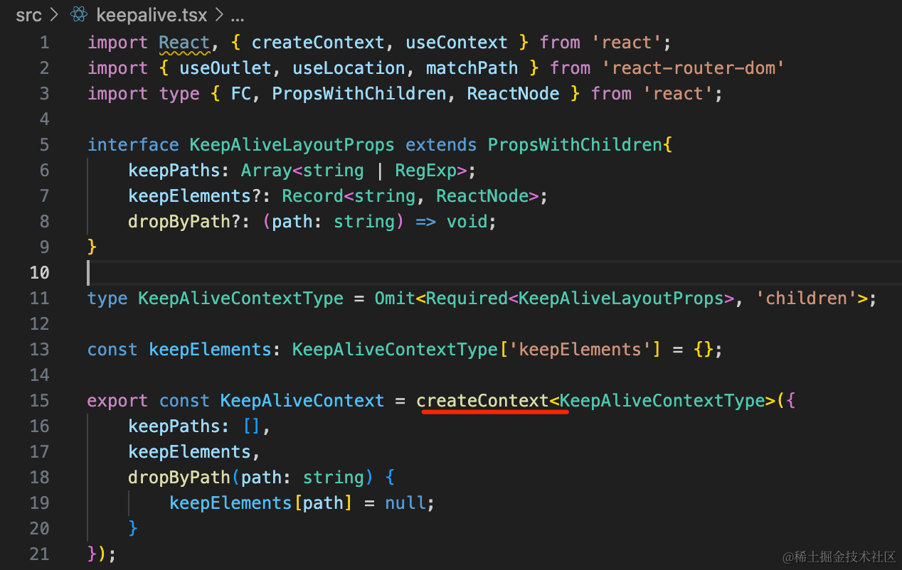

首先，我们创建一个 context。

keepPaths 是要 keepalive 的页面路径，可以是 string 也可以是正则。

keepElements 是页面路径和组件的键值对，用来保存 keepalive 的组件。

dropByPath 是根据页面路径删除 keepElement 中的对应组件。

这里用到几个 TS 的内置类型：

Record 是创建一个 key value 的对象类型：

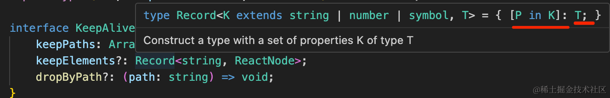

Requried 是去掉可选 -?

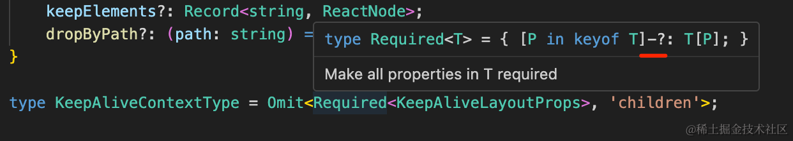

Omit 是删掉其中的部分属性：

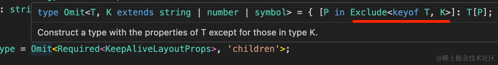

KeepAliveLayoutProps 类型处理后就是这样的：

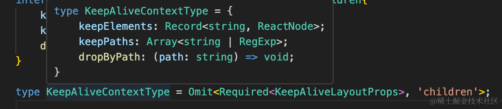

ts 类型编程部分的知识可以看我的 [TS 类型体操小册](https://juejin.cn/book/7047524421182947366)

继续往下看：

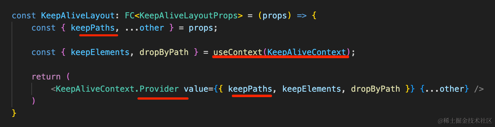

暴露出一个组件，里面用 context.Provider 修改 context 中的值，主要是设置 keepPaths，其余的都用 useContext 从 context 中取。

然后暴露一个 useKeepOutlet 的 hook：


用 useLocation 拿到当前路由，用 useOutlet 拿到对应的组件。

判断下当前路由是否在需要 keepalive 的路由内，是的话就保存到 keepElements。

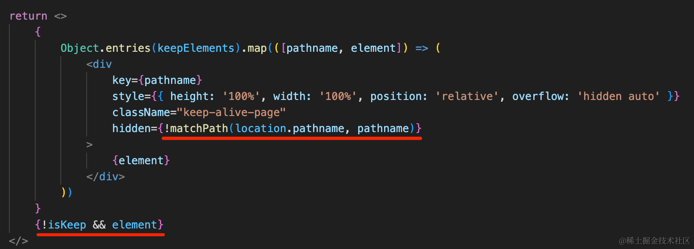

然后渲染所有的 keepElements，如果不匹配就隐藏。

并且如果当前路由不在 keepPaths 内，就直接渲染对应的组件。

isKeepPath 就比较简单了，根据是 string 还是 RegExp 分别做处理，判断路由是否在 keepPaths 内：

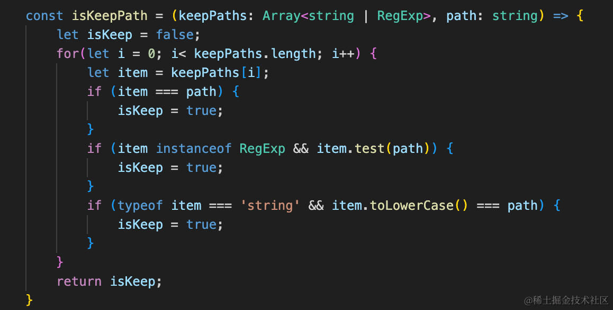

其实原理比较容易看懂：**在 context 中保存所有需要 keepalive 的组件，全部渲染出来，通过路由是否匹配来切换对应组件的显示隐藏。**

在 App.tsx 里引入测试下：

在外面包一层 KeepAliveLayout 组件：

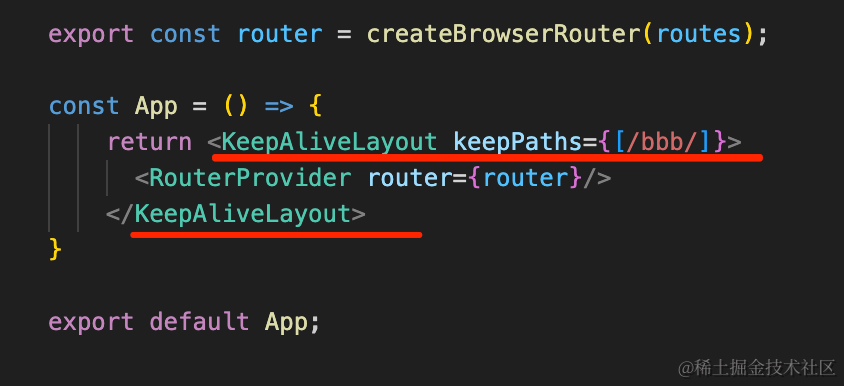

然后把 useOutlet 换成 useKeepOutlet：


测试下：

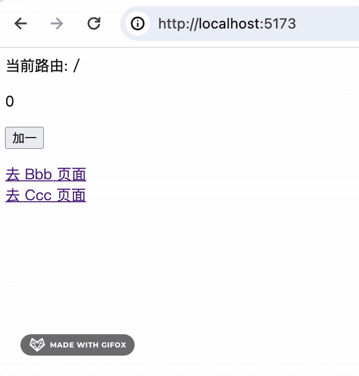

可以看到，/bbb 路由的组件实现了 keepalive，而 / 路由的 组件没有。

我们配置下：

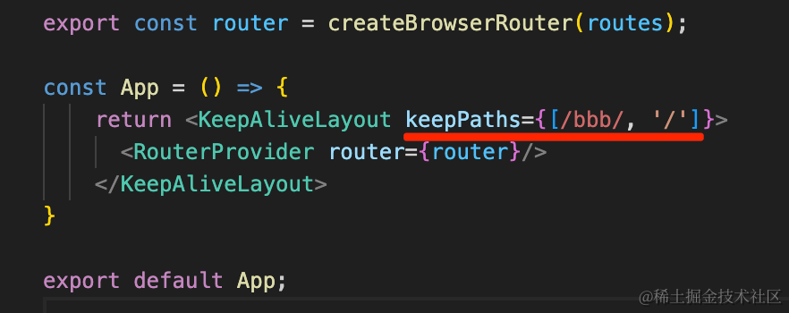

现在两个路由的组件就都 keepalive 了：

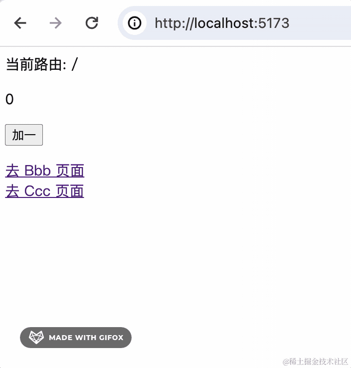

案例代码上传了[小册仓库](https://github.com/QuarkGluonPlasma/react-course-code/tree/main/router-keepalive)
## 总结

路由切换会销毁对应的组件，但很多场景我们希望路由切换组件不销毁，也就是 keepalive。

react router 并没有实现这个功能，需要我们自己做。

我们在 context 中保存所有需要 keepalive 的组件，然后渲染的时候全部渲染出来，通过路由是否匹配来切换显示隐藏。

这样实现了 keepalive。

这个功能是依赖 React Router 的 useLocation、useOutlet、matchPath 等 api 实现的，和路由功能密不可分。
