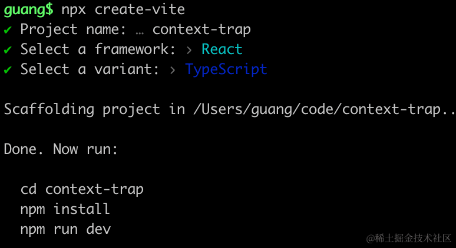
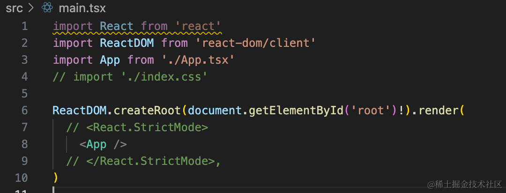
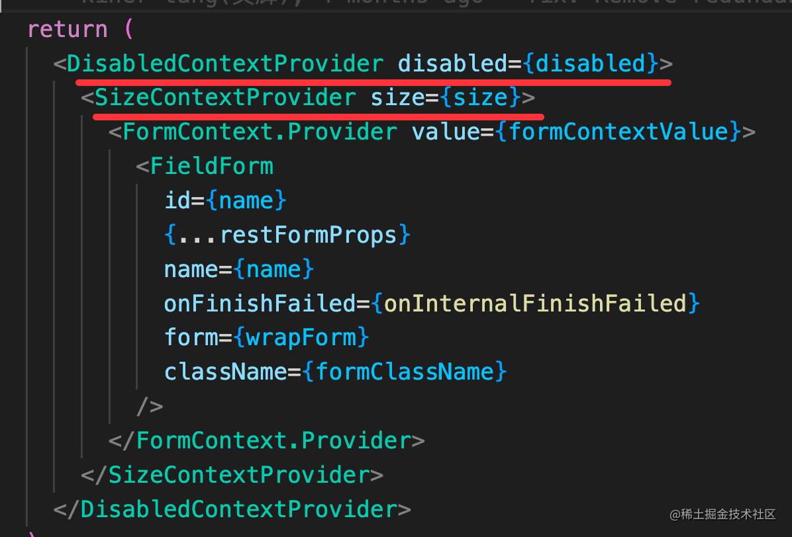
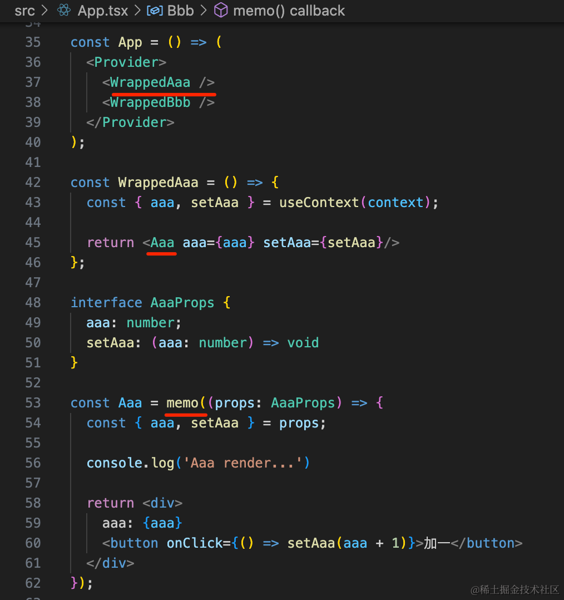
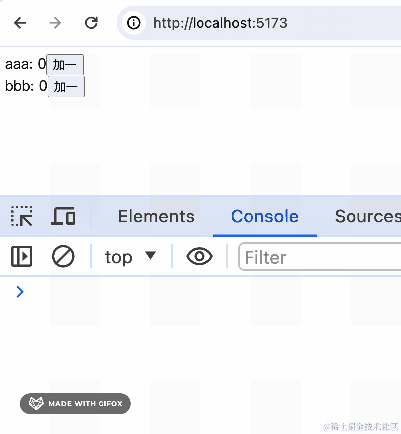

# 第46章—ReactContext的性能缺点和解决方案

上节我们学了 Context 的用法、实现原理，还有它在 antd 里的应用。

在跨层传递数据方面，确实很好用，在组件库里有很多应用。

但是它也有一些缺点。

我们创建个项目来试下：

```
npx create-vite
```



改下 App.tsx

```javascript
import { FC, PropsWithChildren, createContext, useContext, useState } from "react";

interface ContextType {
  aaa: number;
  bbb: number;
  setAaa: (aaa: number) => void;
  setBbb: (bbb: number) => void;
}

const context = createContext<ContextType>({
  aaa: 0,
  bbb: 0,
  setAaa: () => {},
  setBbb: () => {}
});

const Provider: FC<PropsWithChildren> = ({ children }) => {
  const [aaa, setAaa] = useState(0);
  const [bbb, setBbb] = useState(0);

  return (
    <context.Provider
      value={{
        aaa,
        bbb,
        setAaa,
        setBbb
      }}
    >
      {children}
    </context.Provider>
  );
};

const App = () => (
  <Provider>
    <Aaa />
    <Bbb />
  </Provider>
);

const Aaa = () => {
  const { aaa, setAaa } = useContext(context);
  
  console.log('Aaa render...')

  return <div>
    aaa: {aaa}
    <button onClick={() => setAaa(aaa + 1)}>加一</button>
  </div>;
};

const Bbb = () => {
  const { bbb, setBbb } = useContext(context);
  
  console.log("Bbb render...");
  
  return <div>
    bbb: {bbb}
    <button onClick={() => setBbb(bbb + 1)}>加一</button>
  </div>;
};

export default App;

```
用 createContext 创建了 context，其中保存了 2 个useState 的 state 和 setState 方法。

用 Provider 向其中设置值，在 Aaa、Bbb 组件里用 useContext 取出来渲染。

去掉 main.tsx 里的 index.css 和 StrictMode：



把服务跑起来：

```
npm install
npm run dev
```


浏览器访问下：


可以看到，修改 aaa 的时候，会同时触发 bbb 组件的渲染，修改 bbb 的时候，也会触发 aaa 组件的渲染。

因为不管修改 aaa 还是 bbb，都是修改 context 的值，会导致所有用到这个 context 的组件重新渲染。

这就是 Context 的问题。

解决方案也很容易想到：拆分成两个 context 不就不会互相影响了？

```javascript
import { FC, PropsWithChildren, createContext, useContext, useState } from "react";

interface AaaContextType {
  aaa: number;
  setAaa: (aaa: number) => void;
}

const aaaContext = createContext<AaaContextType>({
  aaa: 0,
  setAaa: () => {}
});

interface BbbContextType {
  bbb: number;
  setBbb: (bbb: number) => void;
}

const bbbContext = createContext<BbbContextType>({
  bbb: 0,
  setBbb: () => {}
});

const AaaProvider: FC<PropsWithChildren> = ({ children }) => {
  const [aaa, setAaa] = useState(0);

  return (
    <aaaContext.Provider
      value={{
        aaa,
        setAaa
      }}
    >
      {children}
    </aaaContext.Provider>
  );
};

const BbbProvider: FC<PropsWithChildren> = ({ children }) => {
  const [bbb, setBbb] = useState(0);

  return (
    <bbbContext.Provider
      value={{
        bbb,
        setBbb
      }}
    >
      {children}
    </bbbContext.Provider>
  );
};

const App = () => (
  <AaaProvider>
    <BbbProvider>
      <Aaa />
      <Bbb />
    </BbbProvider>
  </AaaProvider>
);

const Aaa = () => {
  const { aaa, setAaa } = useContext(aaaContext);
  
  console.log('Aaa render...')

  return <div>
    aaa: {aaa}
    <button onClick={() => setAaa(aaa + 1)}>加一</button>
  </div>;
};

const Bbb = () => {
  const { bbb, setBbb } = useContext(bbbContext);
  
  console.log("Bbb render...");
  
  return <div>
    bbb: {bbb}
    <button onClick={() => setBbb(bbb + 1)}>加一</button>
  </div>;
};

export default App;
```


这样就好了。

在 antd 里，也是不同的数据放到不同的 context 里：



但这样也会导致 Provider 嵌套过深：

```javascript
<context1.Provider value={}>
  <context2.Provider value={}>
    <context3.Provider value={}>
      <context4.Provider value={}>
        <context5.Provider value={}>
          {children}
        </context5.Provider>
      </context4.Provider>
    </context3.Provider>
  </context2.Provider>
</context1.Provider>
```
所以 context 来存放一些配置数据还好，比如 theme、size 等，用来存很多业务数据就不大合适了。

这时候可以用 redux、zustand、jotai 等状态管理库。

它们都不是基于 context 实现的，那自然也没有 context 这种问题。

比如用 zustand：

```
npm install --save zustand
```
```javascript
import { create } from 'zustand'

type State = {
  aaa: number
  bbb: number
}

type Action = {
  setAaa: (aaa: State['aaa']) => void
  setBbb: (bbb: State['bbb']) => void
}

const useStore = create<State & Action>((set) => ({
  aaa: 0,
  bbb: 0,
  setAaa: (aaa) => set(() => ({ aaa })),
  setBbb: (bbb) => set(() => ({ bbb })),
}))


const App = () => (
  <div>
    <Aaa />
    <Bbb />
  </div>
);

const Aaa = () => {
  const aaa = useStore((state) => state.aaa);
  const setAaa = useStore(state => state.setAaa);
  
  console.log('Aaa render...')

  return <div>
    aaa: {aaa}
    <button onClick={() => setAaa(aaa + 1)}>加一</button>
  </div>;
};

const Bbb = () => {
  const bbb = useStore((state) => state.bbb);
  const setBbb = useStore(state => state.setBbb);
  
  console.log("Bbb render...");
  
  return <div>
    bbb: {bbb}
    <button onClick={() => setBbb(bbb + 1)}>加一</button>
  </div>;
};

export default App;

```

zustand 虽然也是集中存放的数据，但是内部做了处理，更新某个 state 不会导致依赖其它 state 的组件重新渲染：


此外，不用状态管理库，不拆分 context，也可以解决，比如用 memo：



memo 会对新旧 props 做对比，只有 props 变化了才会渲染。

这样就能避免没必要的渲染。

```javascript
import { FC, PropsWithChildren, createContext, memo, useCallback, useContext, useState } from "react";

interface CounterContext {
  aaa: number;
  bbb: number;
  setAaa: (aaa: number) => void;
  setBbb: (bbb: number) => void;
}

const context = createContext<CounterContext>({
  aaa: 0,
  bbb: 0,
  setAaa: () => {},
  setBbb: () => {}
});

const Provider: FC<PropsWithChildren> = ({ children }) => {
  const [aaa, setAaa] = useState(0);
  const [bbb, setBbb] = useState(0);

  return (
    <context.Provider
      value={{
        aaa,
        bbb,
        setAaa,
        setBbb
      }}
    >
      {children}
    </context.Provider>
  );
};

const App = () => (
  <Provider>
    <WrappedAaa />
    <WrappedBbb />
  </Provider>
);

const WrappedAaa = () => {
  const { aaa, setAaa } = useContext(context);

  return <Aaa aaa={aaa} setAaa={setAaa}/>
};

interface AaaProps {
  aaa: number;
  setAaa: (aaa: number) => void
}

const Aaa = memo((props: AaaProps) => {
  const { aaa, setAaa } = props;

  console.log('Aaa render...')

  return <div>
    aaa: {aaa}
    <button onClick={() => setAaa(aaa + 1)}>加一</button>
  </div>
});

const WrappedBbb = () => {
  const { bbb, setBbb } = useContext(context);
    
  return <Bbb bbb={bbb} setBbb={setBbb}/>
};

interface BbbProps {
  bbb: number;
  setBbb: (bbb: number) => void
}

const Bbb = memo((props: BbbProps) => {
  const { bbb, setBbb } = props;

  console.log("Bbb render...");

  return <div>
    bbb: {bbb}
    <button onClick={() => setBbb(bbb + 1)}>加一</button>
  </div>
})

export default App;
```



这样也能解决 context 会导致额外渲染的问题。

案例代码上传了[小册仓库](https://github.com/QuarkGluonPlasma/react-course-code/tree/main/context-trap)

## 总结

context 在跨层传递数据方面很好用，在组件库里用的很多，但是它也有一些性能方面的缺点。

context 中如果是一个对象，不管任意属性变了，都会导致依赖其它属性的组件跟着重新渲染。

解决这个问题有几种方案：

- 拆分 context，每种数据放在一个 context 里
- 用 zustand 等状态管理库，因为它们不是用 context 实现的，自然没有这种问题
- 用 memo 包裹子组件，它会对比新旧 props，没变就不会重新渲染

context 虽然好用，但是用的时候也要注意下这个性能方面的缺点。
