# 第47章—手写一个Zustand

提到状态管理，大家可能首先想到的是 redux。

redux 是老牌状态管理库，能完成各种基本功能，并且有着庞大的中间件生态来扩展额外功能。

但 redux 经常被人诟病它的使用繁琐。

近两年，React 社区出现了很多新的状态管理库，比如 zustand、jotai、recoil 等，都完全能替代 redux，而且更简单。

zustand 算是其中最流行的一个。

看 star 数，redux 有 60k，而 zustand 也有 38k 了：

redux：

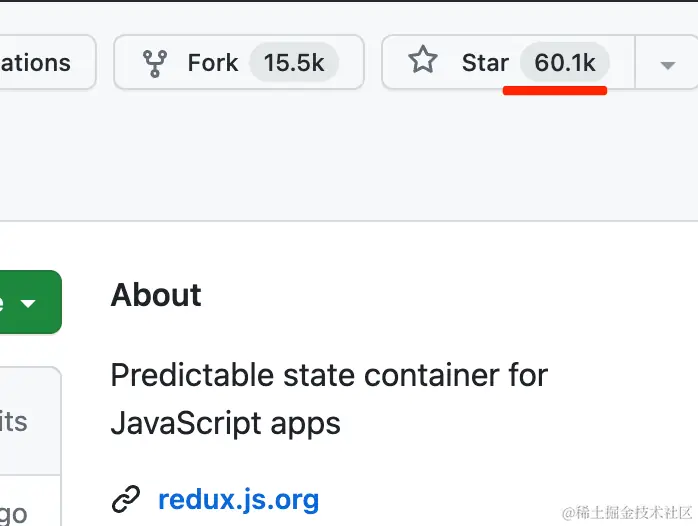

zustand：

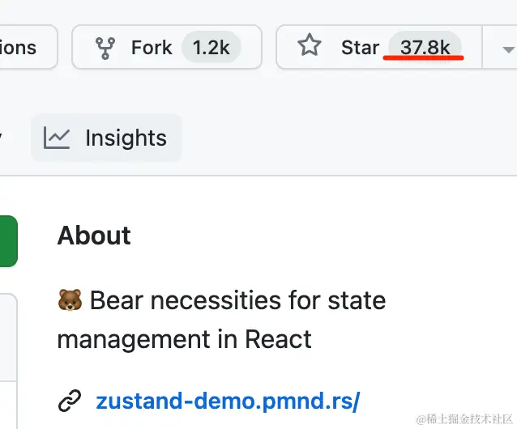

看 npm 包的周下载量，redux 有 880w，而 zustand 也有 260w 了：

redux：

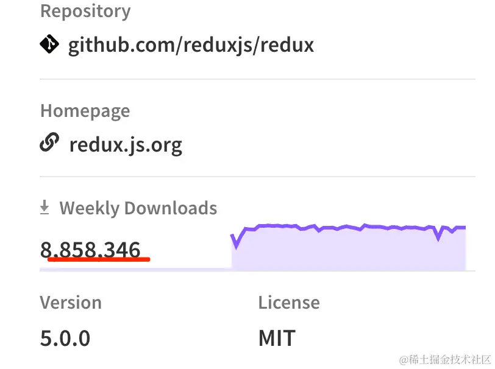

zustand：


从各方面来说，zustand 都在快速赶超 redux。

那 zustand 为什么会火起来呢？

我觉得主要是因为简单，zustand 用起来真的是没有什么学习成本，没有 redux 的 action、reducer 等概念。

而且功能很强大，zustand 也有中间件，可以给它额外扩展功能。

既然功能上能替代 redux，那为什么不选择一个更简单的呢？

下面我们就来试试看：

```
npx create-react-app zustand-test
```
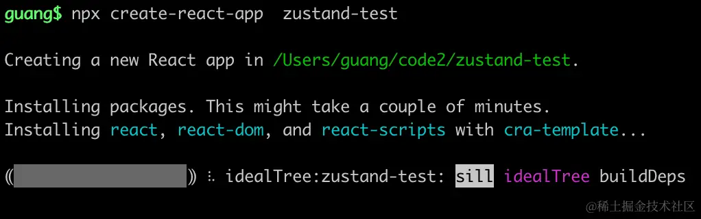

用 cra 创建个 react 项目。

进入项目把它跑起来：

```
npm run start
```
浏览器访问下：

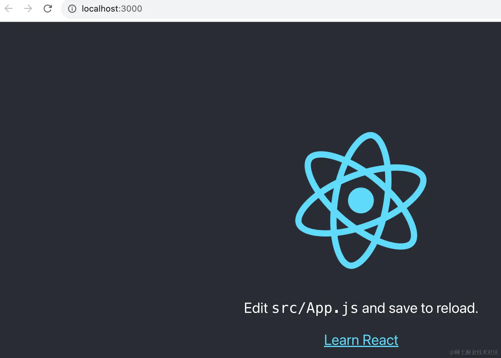

然后安装 zustand:

```
npm install --save zustand
```

改下 App.js

```javascript
import { create } from 'zustand'

const useXxxStore = create((set) => ({
  aaa: '',
  bbb: '',
  updateAaa: (value) => set(() => ({ aaa: value })),
  updateBbb: (value) => set(() => ({ bbb: value })),
}))

export default function App() {
  const updateAaa = useXxxStore((state) => state.updateAaa)
  const aaa = useXxxStore((state) => state.aaa)

  return (
    <div>
        <input
          onChange={(e) => updateAaa(e.currentTarget.value)}
          value={aaa}
        />
        <Bbb></Bbb>
    </div>
  )
}

function Bbb() {
  return <div>
    <Ccc></Ccc>
  </div>
}

function Ccc() {
  const aaa = useXxxStore((state) => state.aaa)
  return <p>hello, {aaa}</p>
}
```
用 create 函数创建一个 store，定义 state 和修改 state 的方法。

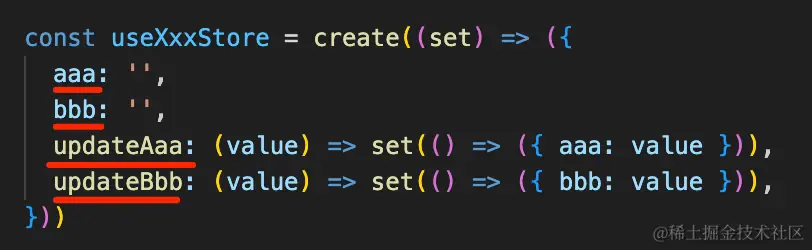

然后在组件里调用 create 返回的函数，取出属性或者方法在组件里用：

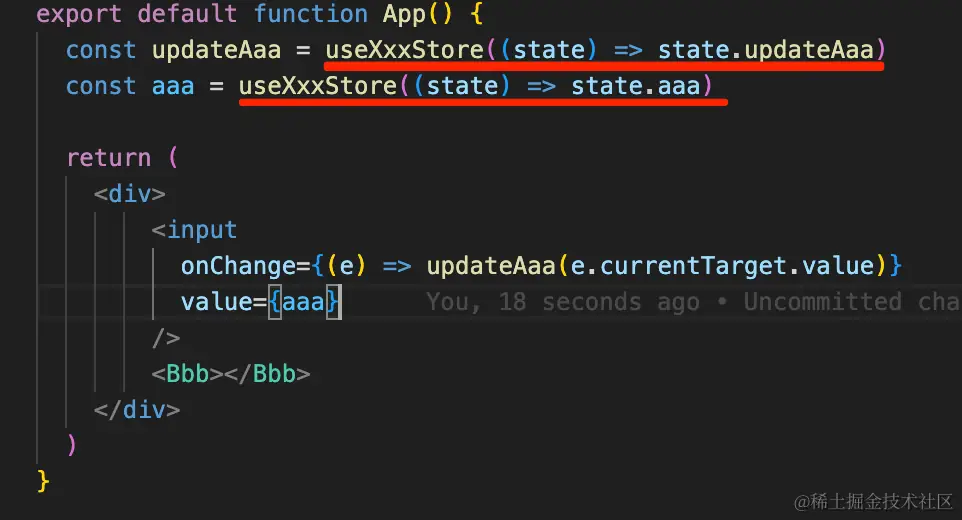

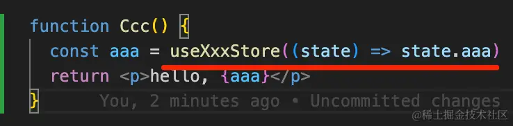

此外，你还可以调用 subscribe 来添加一个监听器：

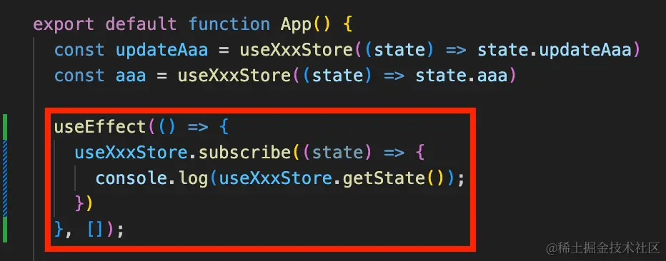

```javascript
useEffect(() => {
    useXxxStore.subscribe((state) => {
        console.log(useXxxStore.getState());
    })
}, []);
```
回调函数可以拿到当前 state，或者调用 store.getState 也可以拿到 state。

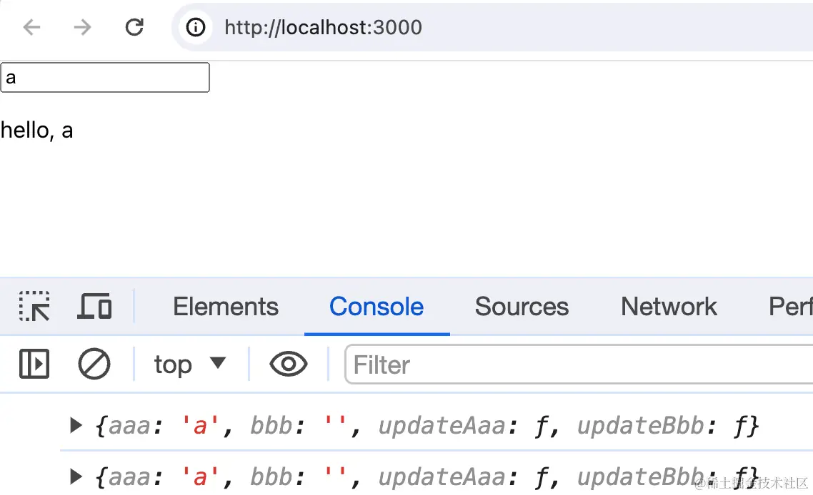

这就是 zustand 的全部用法了，就这么简单。

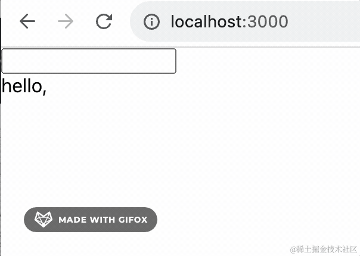

有的同学说，不是还有中间件么？

其实中间件并不是 zustand 自己实现的功能。

你看这个 create 方法的参数，它是一个接受 set、get、store 的三个参数的函数：

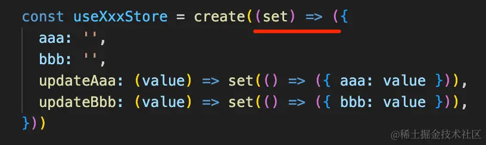

那我们可不可以包一层，自己拿到 get、set、store，对这些做一些修改，之后返回一个接受三个参数的函数呢？

比如这样：

```javascript
function logMiddleware(func) {
  return function(set, get, store) {

    function newSet(...args) {
      console.log('调用了 set，新的 state：', get());
      return set(...args)
    }
  
    return func(newSet, get, store)
  }
}
```
我接受之前的函数，然后对把 set、get、store 修改之后再调用它：

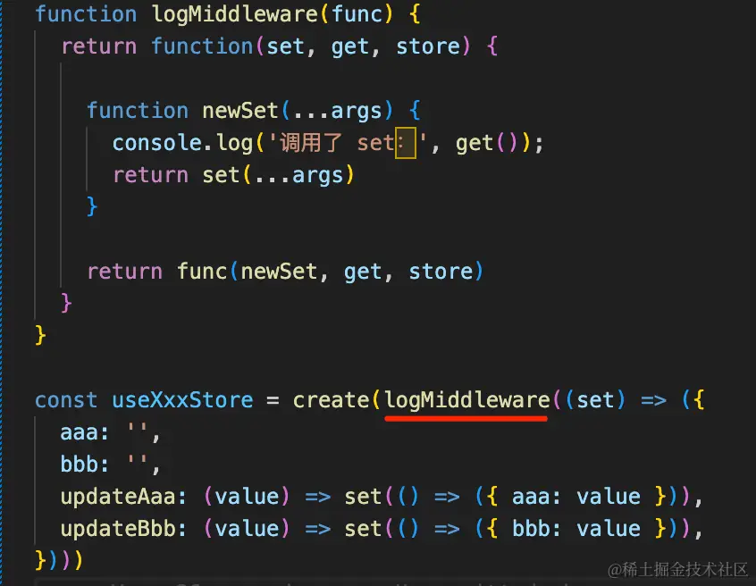

这样不就给 zustand 的 set 方法加上了额外的功能么？


这个就是中间件，和 redux 的中间件是一样的设计。

它并不需要 zustand 本身做啥支持，只要把 create 的参数设计成一个函数，这个函数接收 set、get 等函作为参数，那就自然支持了中间件。

zustand 内置了一些中间件，比如 immer、persist。

persist 就是同步 store 数据到 localStorage 的。

我们试一下：

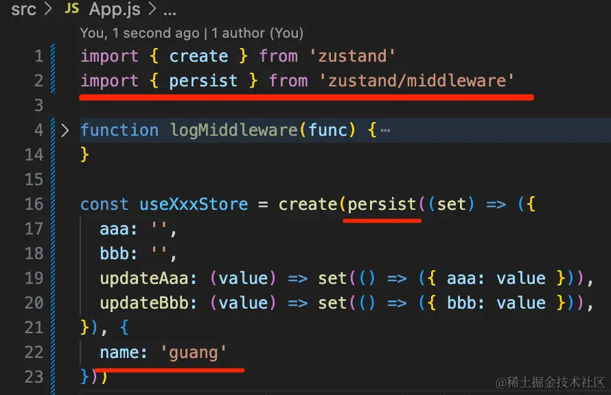

效果如下：

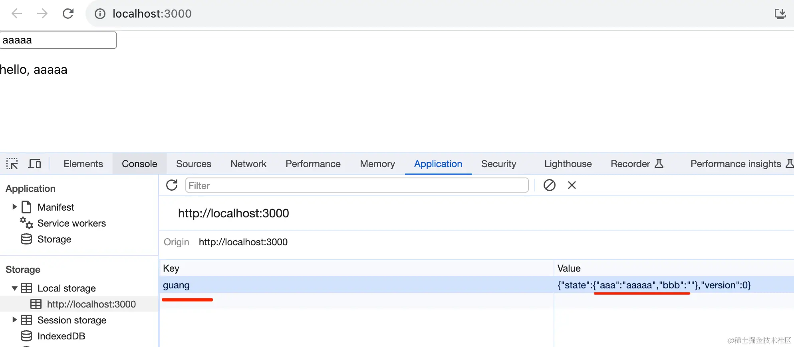

而且，中间件是可以层层嵌套的：

我们把自己写的 log 和内置的 persist 结合起来：

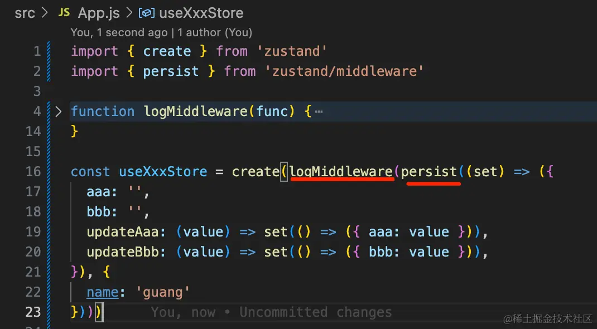

效果如下：

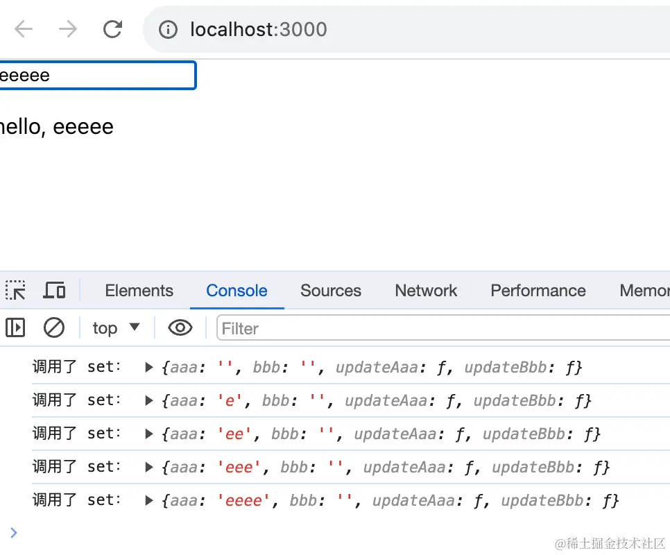


因为中间件不就是修改 set、get 这些参数么，这些 set、get 是可以层层包装的，所以自然中间件也就可以层层嵌套。

redux 和 zustand 的中间件一脉相承，都是很巧妙的设计。

学完了 zustand 的功能后，你觉得写这样一个 zustand 需要多少代码呢？

其实不到 100 行就能搞定。

不信我们试试看：

```javascript
const createStore = (createState) => {
    let state;
    const listeners = new Set();
  
    const setState = (partial, replace) => {
      const nextState = typeof partial === 'function' ? partial(state) : partial

      if (!Object.is(nextState, state)) {
        const previousState = state;

        if(!replace) {
            state = (typeof nextState !== 'object' || nextState === null)
                ? nextState
                : Object.assign({}, state, nextState);
        } else {
            state = nextState;
        }
        listeners.forEach((listener) => listener(state, previousState));
      }
    }
  
    const getState = () => state;
  
    const subscribe= (listener) => {
      listeners.add(listener)
      return () => listeners.delete(listener)
    }
  
    const destroy= () => {
      listeners.clear()
    }
  
    const api = { setState, getState, subscribe, destroy }

    state = createState(setState, getState, api)

    return api
}
```

state 是全局状态，listeners 是监听器。

然后 setState 修改状态、getState 读取状态、subscribe 添加监听器、destroy 清除所有监听器。

这些都很容易理解。

至于 replace，这是 zustand 在 set 状态的时候默认是合并，你也可以传一个 true 改成替换：

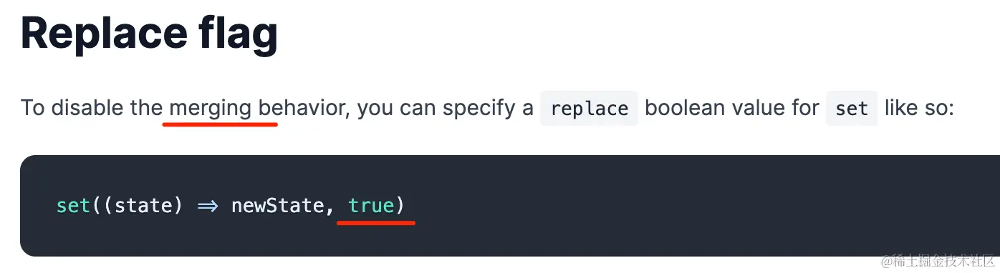

那如果状态变了，如何触发渲染呢？

useState 就可以。

这样写：

```javascript
function useStore(api, selector) {
    const [,forceRender ] = useState(0);
    useEffect(() => {
        api.subscribe((state, prevState) => {
            const newObj = selector(state);
            const oldobj = selector(prevState);

            if(newObj !== oldobj) {
                forceRender(Math.random());
            }       
        })
    }, []);
    return selector(api.getState());
}
```

selector 说的是传入的这个函数：

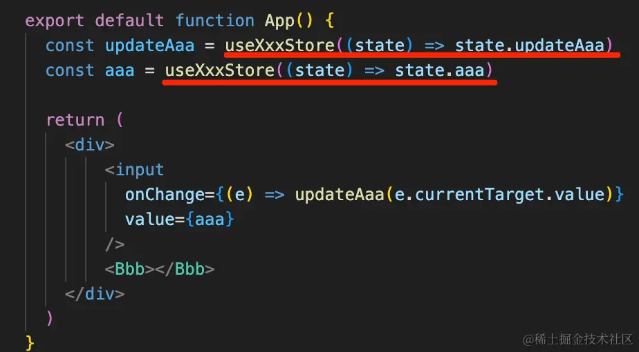

我们用 useState 设置随机数来触发渲染。

监听 state 的变化，变了之后，根据新旧 state 调用 selector 函数的结果，来判断是否需要重新渲染。

然后定义 create 方法：

```javascript
export const create = (createState) => {
    const api = createStore(createState)

    const useBoundStore = (selector) => useStore(api, selector)

    Object.assign(useBoundStore, api);

    return useBoundStore
}
```
它就是先调用 createStore 创建 store。

然后返回 useStore 的函数，用于组件内调用。

测试下：

把 create 函数换成我们自己的，其余代码不变：

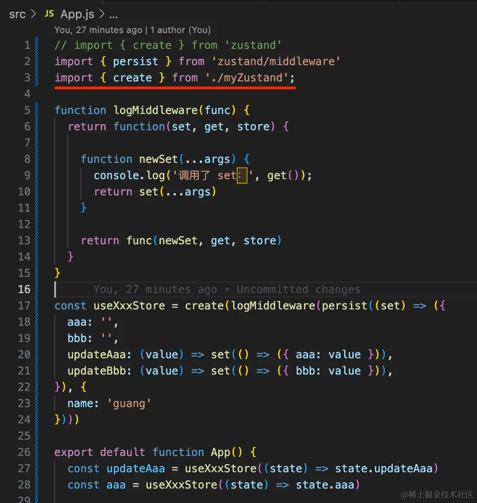

可以看到，功能依然正常：

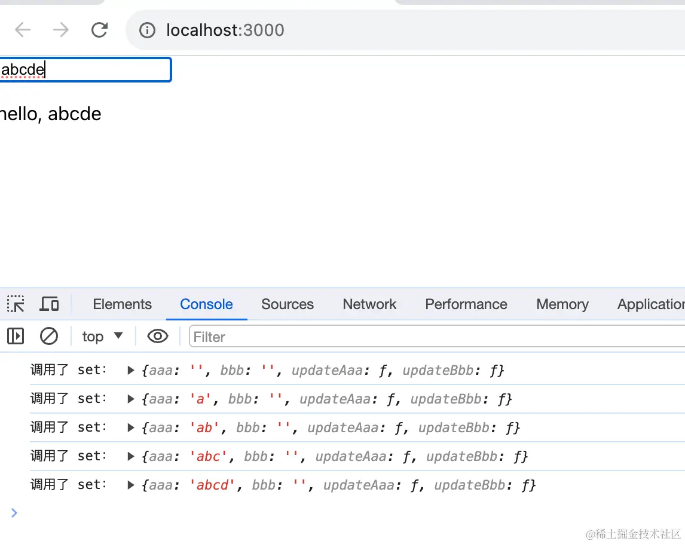

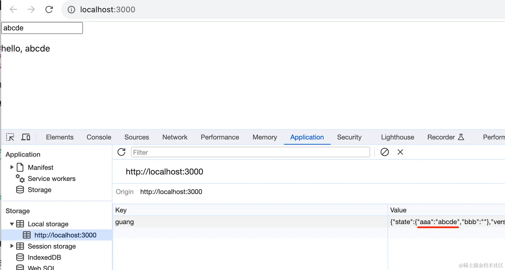

我们的 my-zustand 已经能够完美替代 zustand 了。

全部代码如下：

```javascript
import { useEffect, useState } from "react";

const createStore = (createState) => {
    let state;
    const listeners = new Set();
  
    const setState = (partial, replace) => {
      const nextState = typeof partial === 'function' ? partial(state) : partial

      if (!Object.is(nextState, state)) {
        const previousState = state;

        if(!replace) {
            state = (typeof nextState !== 'object' || nextState === null)
                ? nextState
                : Object.assign({}, state, nextState);
        } else {
            state = nextState;
        }
        listeners.forEach((listener) => listener(state, previousState));
      }
    }
  
    const getState = () => state;
  
    const subscribe= (listener) => {
      listeners.add(listener)
      return () => listeners.delete(listener)
    }
  
    const destroy= () => {
      listeners.clear()
    }
  
    const api = { setState, getState, subscribe, destroy }

    state = createState(setState, getState, api)

    return api
}

function useStore(api, selector) {
    const [,forceRender ] = useState(0);
    useEffect(() => {
        api.subscribe((state, prevState) => {
            const newObj = selector(state);
            const oldobj = selector(prevState);

            if(newObj !== oldobj) {
                forceRender(Math.random());
            }       
        })
    }, []);
    return selector(api.getState());
}

export const create = (createState) => {
    const api = createStore(createState)

    const useBoundStore = (selector) => useStore(api, selector)

    Object.assign(useBoundStore, api);

    return useBoundStore
}
```

60 多行代码。

其实，代码还可以进一步简化。

react [有一个 hook](https://react.dev/reference/react/useSyncExternalStore) 就是用来定义外部 store 的，store 变化以后会触发 rerender：

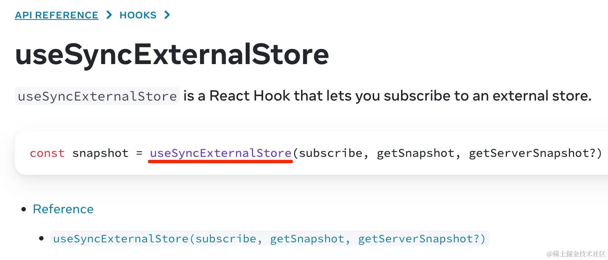

有了这个 useSyncExternalStore 的 hook，我们就不用自己监听 store 变化触发 rerender 了：

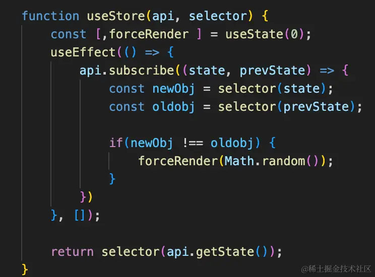

可以简化成这样：

```javascript
function useStore(api, selector) {
    function getState() {
        return selector(api.getState());
    }
    
    return useSyncExternalStore(api.subscribe, getState)
}
```

这样，my-zustand 就完美了。

```javascript
import { useSyncExternalStore } from "react";

const createStore = (createState) => {
    let state;
    const listeners = new Set();
  
    const setState = (partial, replace) => {
      const nextState = typeof partial === 'function' ? partial(state) : partial

      if (!Object.is(nextState, state)) {
        const previousState = state;

        if(!replace) {
            state = (typeof nextState !== 'object' || nextState === null)
                ? nextState
                : Object.assign({}, state, nextState);
        } else {
            state = nextState;
        }
        listeners.forEach((listener) => listener(state, previousState));
      }
    }
  
    const getState = () => state;
  
    const subscribe= (listener) => {
      listeners.add(listener)
      return () => listeners.delete(listener)
    }
  
    const destroy= () => {
      listeners.clear()
    }
  
    const api = { setState, getState, subscribe, destroy }

    state = createState(setState, getState, api)

    return api
}

function useStore(api, selector) {
    function getState() {
        return selector(api.getState());
    }
    
    return useSyncExternalStore(api.subscribe, getState)
}

export const create = (createState) => {
    const api = createStore(createState)

    const useBoundStore = (selector) => useStore(api, selector)

    Object.assign(useBoundStore, api);

    return useBoundStore
}
```

有的同学可能会质疑，zustand 的源码就这么点么？

我们调试下就知道了：

点击 vscode 的 create a launch.json file，创建一个调试配置：

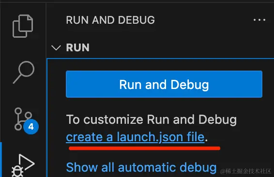

改下调试的端口，点击调试启动：

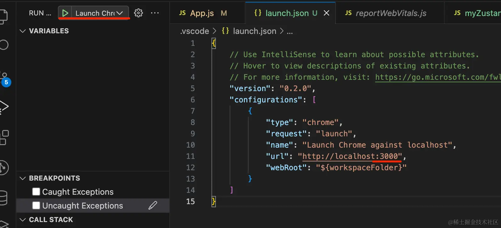

把 zustand 换成之前的，然后打个断点：

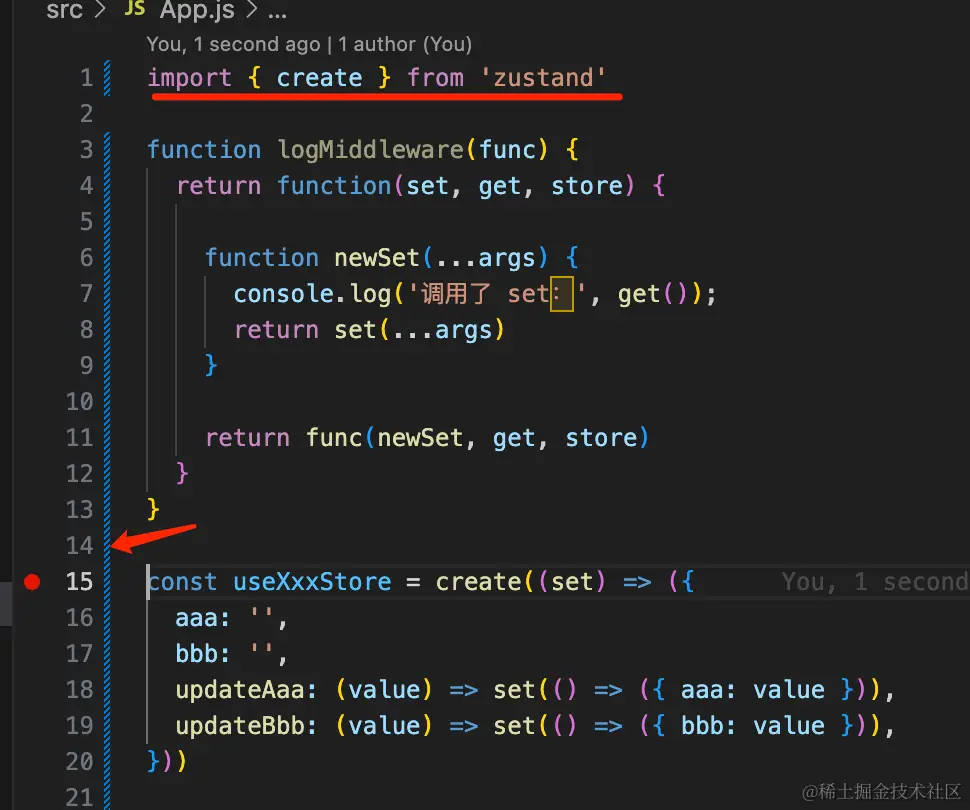

通过调试，可以看到 create 的实现如下：

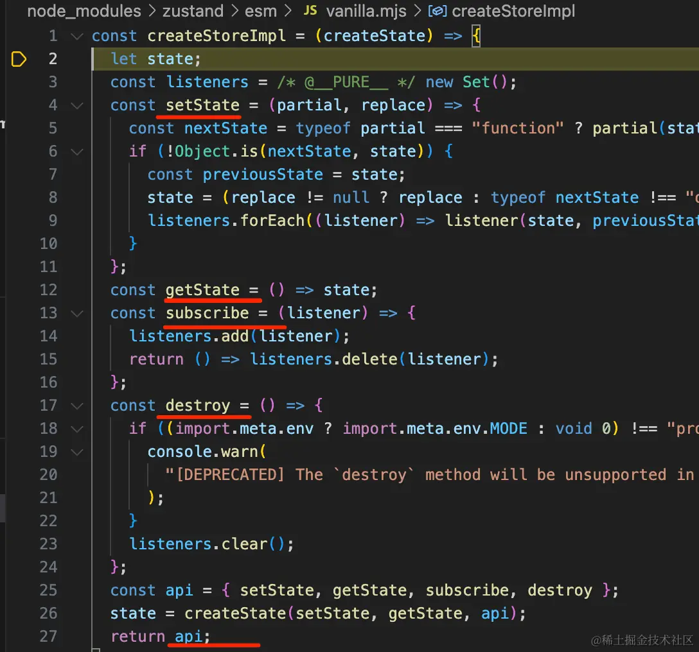

而 useStore 的实现如下：

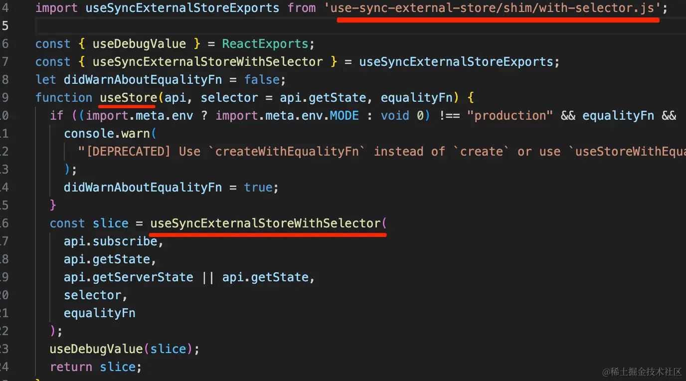

唯一的区别就是它用的是一个 shim 包里的，因为它要保证这个 hook 的兼容性。

所以说，我们通过 60 行代码实现的，就是一比一复刻的 zustand。

至此，zustand 还有一个非常大的优点就呼之欲出了：体积小。

一共也没多少代码，压缩后能多大呢？只有 1kb。

最后，zustand 有一个坑点要注意下：

当你用了 ts 并且用了中间件，那要这样写，第一次调用不传参数，第二次传：

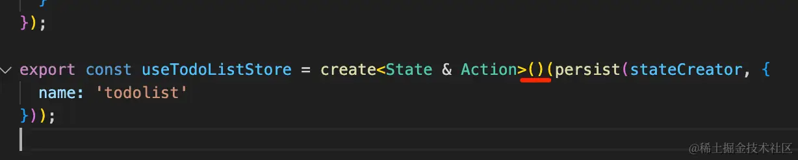

源码里确实做了处理：

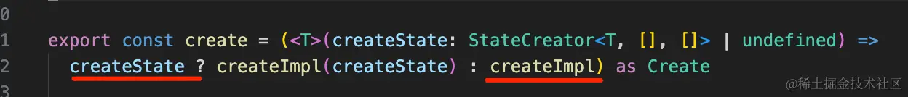

至于为什么要这样，[官方解释](https://github.com/pmndrs/zustand/blob/main/docs/guides/typescript.md)说是为了好做中间件的 ts 类型处理：

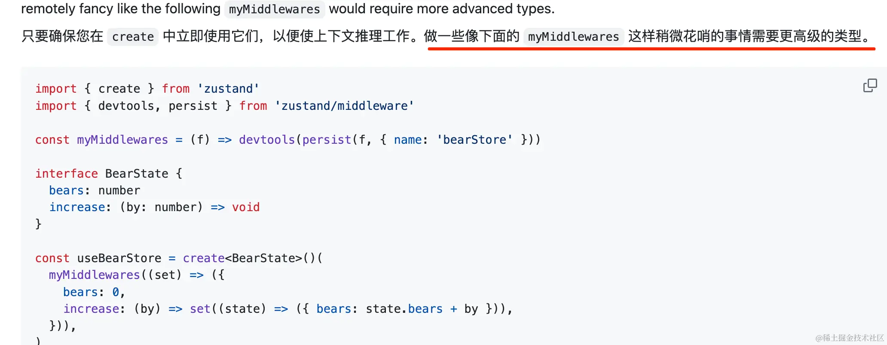

反正功能是一样的，大家记住 ts + middleware 的场景换个写法就好了。

案例代码上传了[小册仓库](https://github.com/QuarkGluonPlasma/react-course-code/tree/main/hook-test)

## 总结

近几年出了很多可以替代 redux 的优秀状态管理库，zustand 是其中最优秀的一个。

它的特点有很多：体积小、简单、支持中间件扩展。

它的核心就是一个 create 函数，传入 state 来创建 store。

create 返回的函数可以传入 selector，取出部分 state 在组件里用。

它的中间件和 redux 一样，就是一个高阶函数，可以对 get、set 做一些扩展。

zustand 内置了 immer、persist 等中间件，我们也自己写了一个 log 的中间件。

zustand 本身的实现也很简单，就是 getState、setState、subscribe 这些功能，然后再加上 useSyncExternalStore 来触发组件 rerender。

一共也就 60 行代码。

这样一个简单强大、非常流行的状态管理库，你确定不自己手写一个试试么？
