# 第48章—原子化状态管理库Jotai

Jotai 是一个 react 的状态管理库，主打原子化。

提到原子化，你可能会想到原子化 CSS 框架 tailwind。

比如这样的 css：


```html
<div class="aaa"></div>
```
```css
.aaa {
    font-size: 16px;
    border: 1px solid #000;
    padding: 4px;
}
```
用 tailwind 这样写：

```html
<div class="text-base p-1 border border-black border-solid"></div>
```

```css
.text-base {
    font-size: 16px;
}
.p-1 {
    padding: 4px;
}
.border {
    border-width: 1px;
}
.border-black {
    border-color: black;
}
.border-solid {
    border-style: solid;
}
```
定义一系列原子 class，用到的时候组合这些 class。

jotai 也是这个思想：

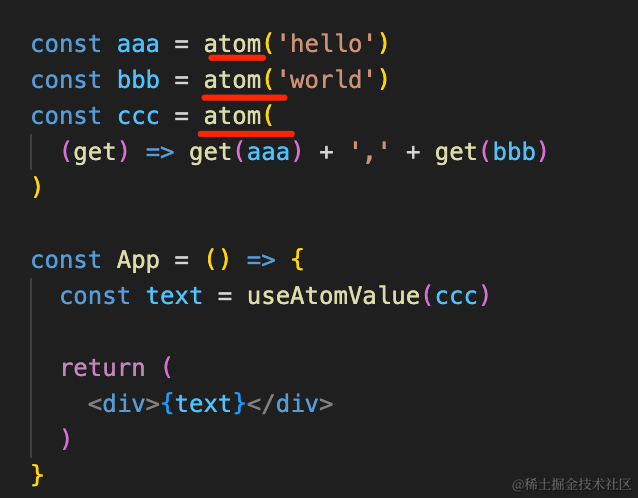


通过 atom 定义一个原子状态，可以把它组合起来成为新的状态。

那状态为什么要原子化呢？

来看个例子：

```javascript
import { FC, PropsWithChildren, createContext, useContext, useState } from "react";

interface ContextType {
  aaa: number;
  bbb: number;
  setAaa: (aaa: number) => void;
  setBbb: (bbb: number) => void;
}

const context = createContext<ContextType>({
  aaa: 0,
  bbb: 0,
  setAaa: () => {},
  setBbb: () => {}
});

const Provider: FC<PropsWithChildren> = ({ children }) => {
  const [aaa, setAaa] = useState(0);
  const [bbb, setBbb] = useState(0);

  return (
    <context.Provider
      value={{
        aaa,
        bbb,
        setAaa,
        setBbb
      }}
    >
      {children}
    </context.Provider>
  );
};

const App = () => (
  <Provider>
    <Aaa />
    <Bbb />
  </Provider>
);

const Aaa = () => {
  const { aaa, setAaa } = useContext(context);
  
  console.log('Aaa render...')

  return <div>
    aaa: {aaa}
    <button onClick={() => setAaa(aaa + 1)}>加一</button>
  </div>;
};

const Bbb = () => {
  const { bbb, setBbb } = useContext(context);
  
  console.log("Bbb render...");
  
  return <div>
    bbb: {bbb}
    <button onClick={() => setBbb(bbb + 1)}>加一</button>
  </div>;
};

export default App;

```
用 createContext 创建了 context，其中保存了 2 个useState 的 state 和 setState 方法。

用 Provider 向其中设置值，在 Aaa、Bbb 组件里用 useContext 取出来渲染。

浏览器访问下：

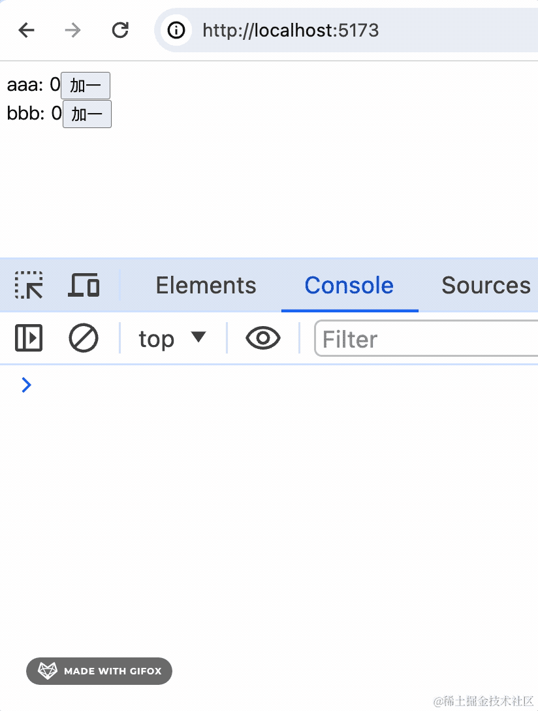

可以看到，修改 aaa 的时候，会同时触发 bbb 组件的渲染，修改 bbb 的时候，也会触发 aaa 组件的渲染。

因为不管修改 aaa 还是 bbb，都是修改 context 的值，会导致所有用到这个 context 的组件重新渲染。

这就是 Context 的问题。

解决方案也很容易想到：拆分成两个 context 不就不会互相影响了？

```javascript
import { FC, PropsWithChildren, createContext, useContext, useState } from "react";

interface AaaContextType {
  aaa: number;
  setAaa: (aaa: number) => void;
}

const aaaContext = createContext<AaaContextType>({
  aaa: 0,
  setAaa: () => {}
});

interface BbbContextType {
  bbb: number;
  setBbb: (bbb: number) => void;
}

const bbbContext = createContext<BbbContextType>({
  bbb: 0,
  setBbb: () => {}
});

const AaaProvider: FC<PropsWithChildren> = ({ children }) => {
  const [aaa, setAaa] = useState(0);

  return (
    <aaaContext.Provider
      value={{
        aaa,
        setAaa
      }}
    >
      {children}
    </aaaContext.Provider>
  );
};

const BbbProvider: FC<PropsWithChildren> = ({ children }) => {
  const [bbb, setBbb] = useState(0);

  return (
    <bbbContext.Provider
      value={{
        bbb,
        setBbb
      }}
    >
      {children}
    </bbbContext.Provider>
  );
};

const App = () => (
  <AaaProvider>
    <BbbProvider>
      <Aaa />
      <Bbb />
    </BbbProvider>
  </AaaProvider>
);

const Aaa = () => {
  const { aaa, setAaa } = useContext(aaaContext);
  
  console.log('Aaa render...')

  return <div>
    aaa: {aaa}
    <button onClick={() => setAaa(aaa + 1)}>加一</button>
  </div>;
};

const Bbb = () => {
  const { bbb, setBbb } = useContext(bbbContext);
  
  console.log("Bbb render...");
  
  return <div>
    bbb: {bbb}
    <button onClick={() => setBbb(bbb + 1)}>加一</button>
  </div>;
};

export default App;
```


这样就好了。

这种把状态放到不同的 context 中管理，也是一种原子化的思想。

虽然说这个与 jotai 没啥关系，因为状态管理库不依赖于 context 实现，自然也没那些问题。

但是 jotai 在介绍原子化思想时提到了这个：

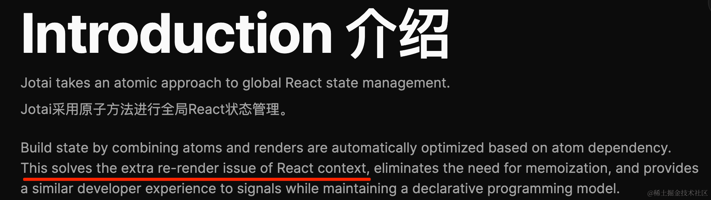

可能你用过 redux、zustand 这些状态管理库，jotai 和它们是完全两种思路。

用 zustand 是这样写：

```javascript
import { create } from 'zustand'

const useStore = create((set) => ({
  aaa: 0,
  bbb: 0,
  setAaa: (value) => set({ aaa: value}),
  setBbb: (value) => set({ bbb: value})
}))

function Aaa() {
    const aaa = useStore(state => state.aaa);
    const setAaa = useStore((state) => state.setAaa);
    
    console.log('Aaa render...')
    return <div>
        aaa: {aaa}
        <button onClick={() => setAaa(aaa + 1)}>加一</button>
    </div>
}

function Bbb() {
    const bbb = useStore(state => state.bbb);
    const setBbb = useStore((state) => state.setBbb);

    console.log('Bbb render...')

    return <div>
        bbb: {bbb}
        <button onClick={() => setBbb(bbb + 1)}>加一</button>
    </div>
}

export default function App() {
    return <div>
        <Aaa></Aaa>
        <Bbb></Bbb>
    </div>
}
```
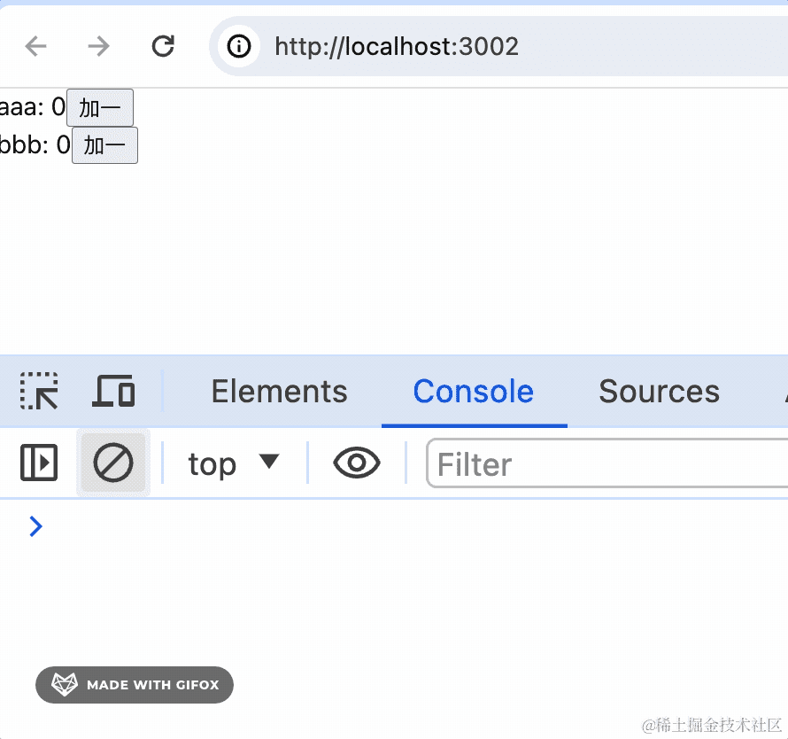

store 里定义全部的 state，然后在组件里选出一部分来用。

这个叫做 selector：

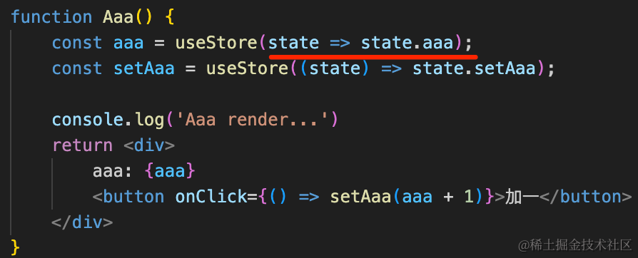

状态变了之后，zustand 会对比 selector 出的状态的新旧值，变了才会触发组件重新渲染。

此外，这个 selector 还可以起到派生状态的作用，对原始状态做一些修改：


而在 jotai 里，每个状态都是独立的原子：

```javascript
import { atom, useAtom } from 'jotai'; 

const aaaAtom = atom (0);

const bbbAtom = atom(0);

function Aaa() {
    const [aaa, setAaa]= useAtom(aaaAtom);
    
    console.log('Aaa render...')
    return <div>
        aaa: {aaa}
        <button onClick={() => setAaa(aaa + 1)}>加一</button>
    </div>
}

function Bbb() {
    const [bbb, setBbb]= useAtom(bbbAtom);

    console.log('Bbb render...')

    return <div>
        bbb: {bbb}
        <button onClick={() => setBbb(bbb + 1)}>加一</button>
    </div>
}

export default function App() {
    return <div>
        <Aaa></Aaa>
        <Bbb></Bbb>
    </div>
}
```
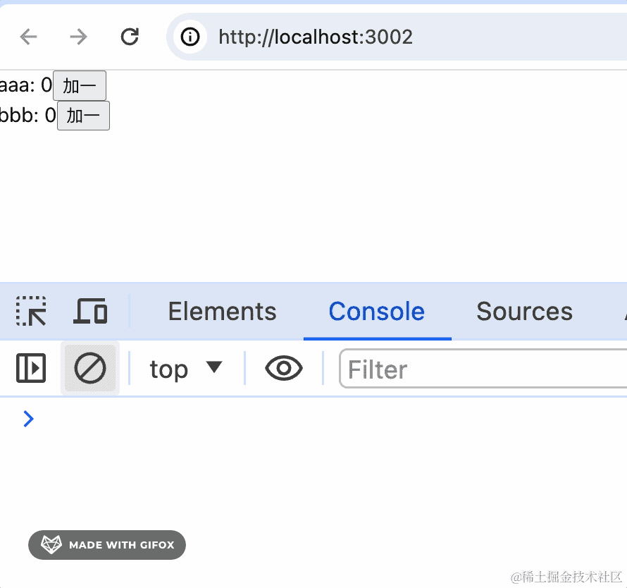

状态可以组合，产生派生状态：

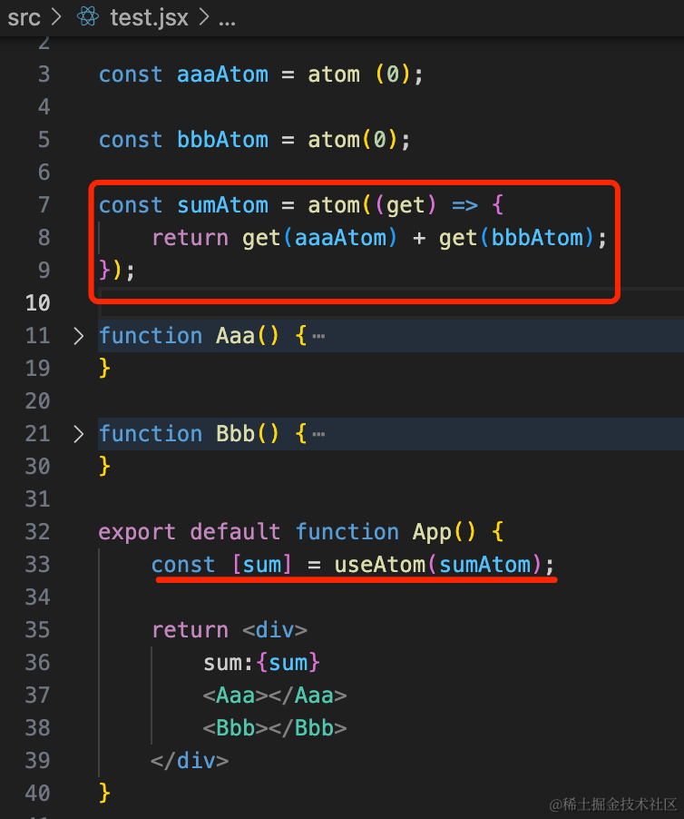

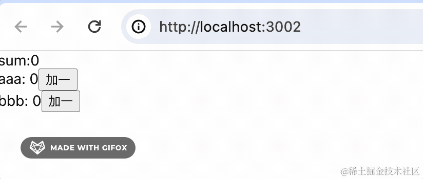

而在 zustand 里是通过 selector 来做：

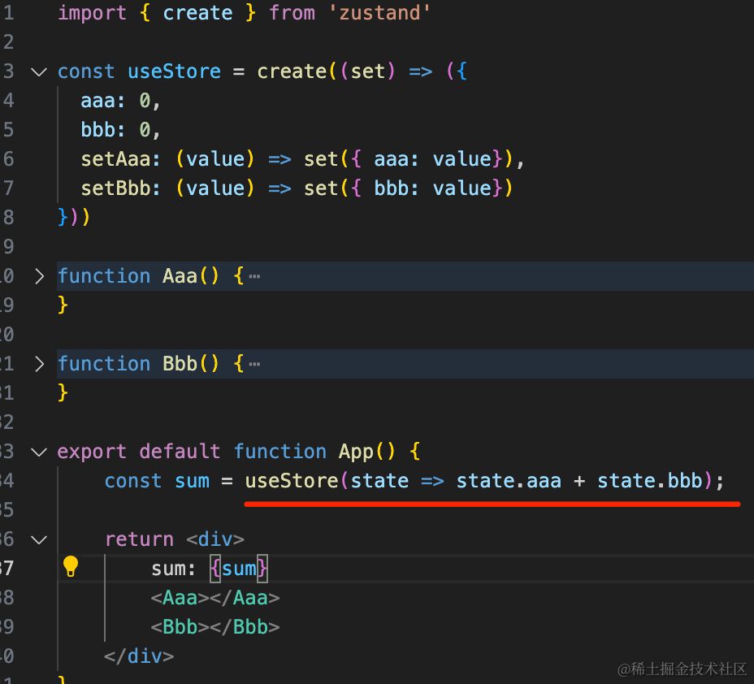

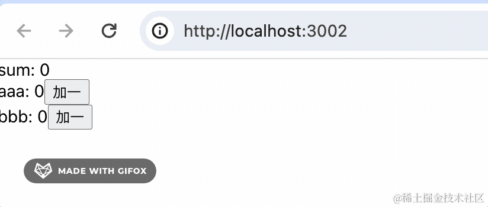

不知道大家有没有感受到这两种方式的区别：

**zustand 是所有 state 放在全局 store 里，然后用到的时候 selector 取需要的部分。**

**jotai 是每个 state 单独声明原子状态，用到的时候单独用或者组合用。**

**一个自上而下，一个自下而上，算是两种思路。**

此外，异步逻辑，比如请求服务端接口来拿到数据，这种也是一个放在全局 store，一个单独放在原子状态里：

在 zustand 里是这样：

```javascript
import { create } from 'zustand'

async function getListById(id) {
    const data = {
        1: ['a1', 'a2', 'a3'],
        2: ['b1', 'b2', 'b3', 'b4']
    }
    return new Promise((resolve) => {
        setTimeout(() => {
            resolve(data[id]);
        }, 2000);
    });
}

const useStore = create((set) => ({
  list: [],
  fetchData: async (param) => {
    const data = await getListById(param);
    set({ list: data });
  },
}))

export default function App() {
    const list = useStore(state => state.list);
    const fetchListData = useStore((state) => state.fetchData);

    return <div>
        <button onClick={() => fetchListData(1)}>列表111</button>
        <ul>
            {
                list.map(item => {
                    return <li key={item}>{item}</li>
                })
            }
        </ul>
    </div>
}
```
在 store 里添加一个 fetchData 的 async 方法，组件里取出来用就行。

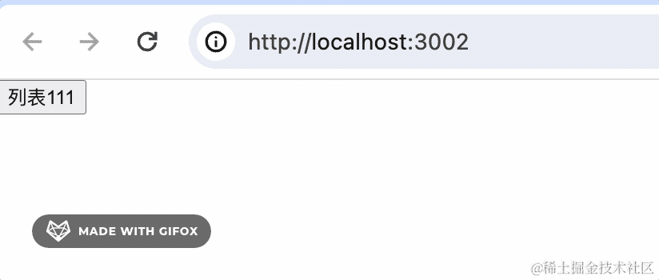

可以看到，2s 后拿到了数据设置到 list，并且触发了组件渲染。

而在 jotai 里，也是单独放在 atom 里的：

```javascript
import { atom, useAtom } from 'jotai'; 

async function getListById(id) {
    const data = {
        1: ['a1', 'a2', 'a3'],
        2: ['b1', 'b2', 'b3', 'b4']
    }
    return new Promise((resolve) => {
        setTimeout(() => {
            resolve(data[id]);
        }, 2000);
    });
}

const listAtom = atom([]);

const fetchDataAtom = atom(null, async (get, set, param) => {
    const data = await getListById(param);
    set(listAtom, data);
});

export default function App() {
    const [,fetchListData] = useAtom(fetchDataAtom);
    const [list] = useAtom(listAtom);

    return <div>
        <button onClick={() => fetchListData(2)}>列表222</button>
        <ul>
            {
                list.map(item => {
                    return <li key={item}>{item}</li>
                })
            }
        </ul>
    </div>
}
```

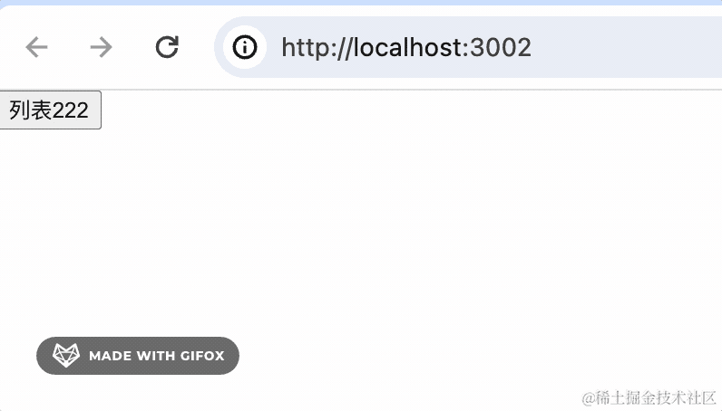

atom 除了可以直接传值外，也可以分别传入 get、set 函数。

之前的派生状态就是只传入了 get 函数：

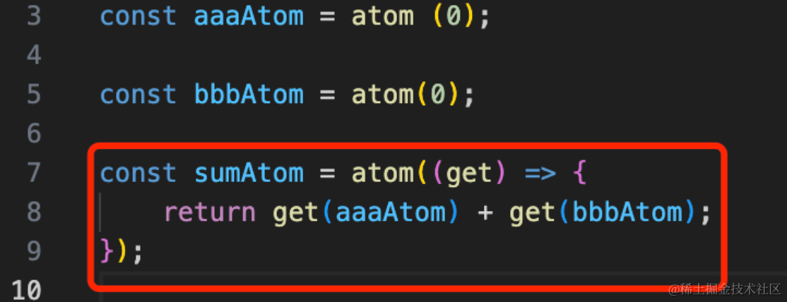

这样，状态是只读的。

这里我们只传入了 set 函数：

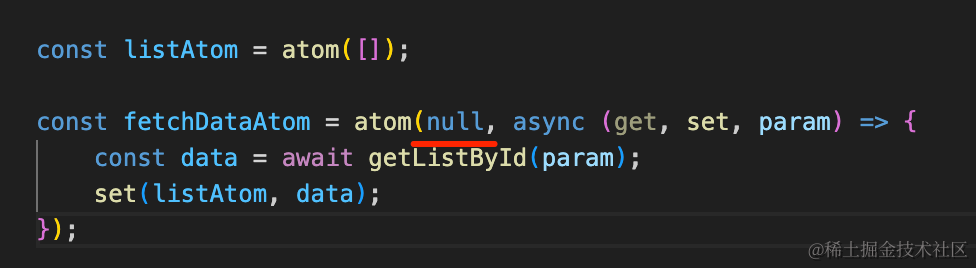

所以状态是只能写。

用的时候要取第二个参数：

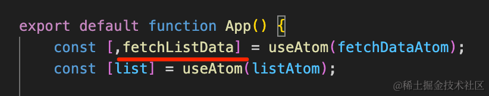

当然，这么写有点费劲，所以 atom 对于只读只写的状态多了两个 hook：

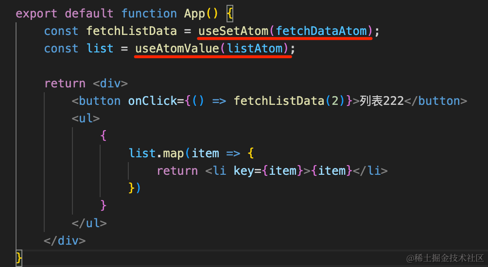

useAtomValue 是读取值，useSetAtom 是拿到写入函数。

而常用的 useAtom 就是拿到这两者返回值的数组。

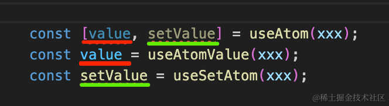

效果一样：


当然，这里没必要用两个 atom，合并成一个就行：

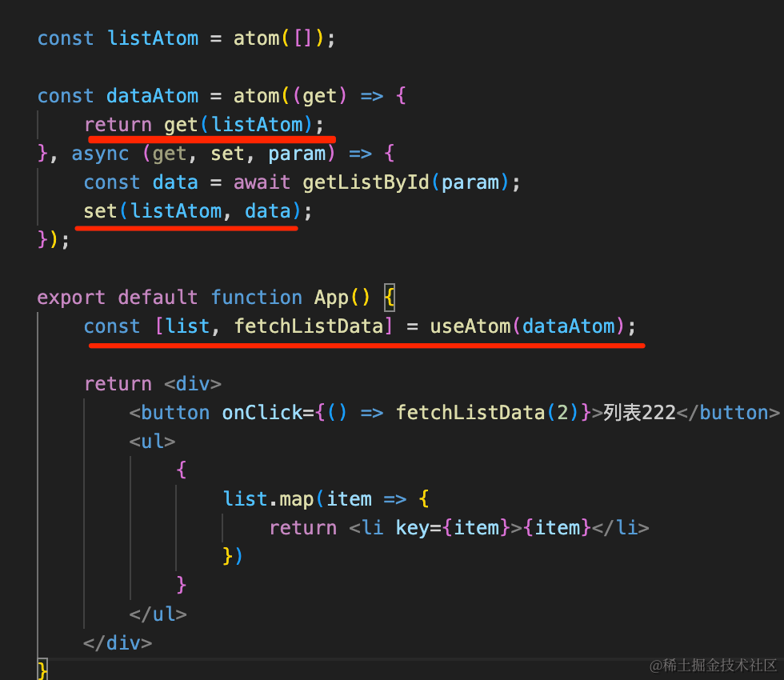

```javascript
import { atom, useAtom, useAtomValue, useSetAtom } from 'jotai'; 

async function getListById(id) {
    const data = {
        1: ['a1', 'a2', 'a3'],
        2: ['b1', 'b2', 'b3', 'b4']
    }
    return new Promise((resolve) => {
        setTimeout(() => {
            resolve(data[id]);
        }, 2000);
    });
}

const listAtom = atom([]);

const dataAtom = atom((get) => {
    return get(listAtom);
}, async (get, set, param) => {
    const data = await getListById(param);
    set(listAtom, data);
});

export default function App() {
    const [list, fetchListData] = useAtom(dataAtom);
    
    return <div>
        <button onClick={() => fetchListData(2)}>列表222</button>
        <ul>
            {
                list.map(item => {
                    return <li key={item}>{item}</li>
                })
            }
        </ul>
    </div>
}
```
此外，用 useSetAtom 有时候可以起到性能优化的作用。

比如这段代码：

```javascript
import { atom, useAtom, useAtomValue, useSetAtom } from 'jotai'; 

const aaaAtom = atom(0);

function Aaa() {
    const [aaa] = useAtom(aaaAtom);

    console.log('Aaa render...');

    return <div>
        {aaa}
    </div>
}

function Bbb() {
    const [, setAaa] = useAtom(aaaAtom);

    console.log('Bbb render...');

    return <div>
        <button onClick={() => setAaa(Math.random())}>按钮</button>
    </div>
}

export default function App() {
    return <div>
        <Aaa></Aaa>
        <Bbb></Bbb>
    </div>
}
```

在 Aaa 组件里读取状态，在 Bbb 组件里修改状态。

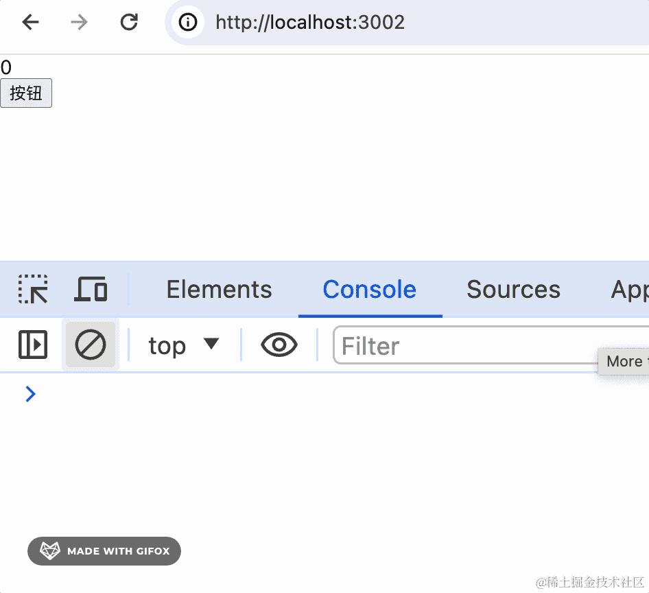

可以看到，点击按钮 Aaa、Bbb 组件都重新渲染了。

而其实 Bbb 组件不需要重新渲染。

这时候可以改一下：

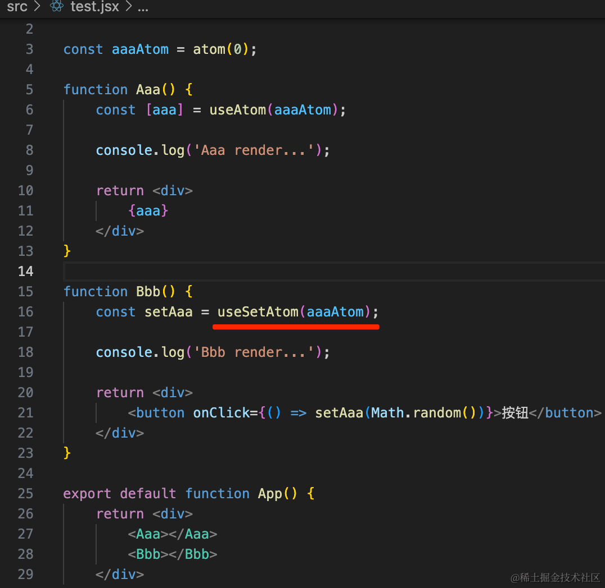

换成 useSetAtom，也就是不需要读取状态值。

这样状态变了就不如触发这个组件的重新渲染了：

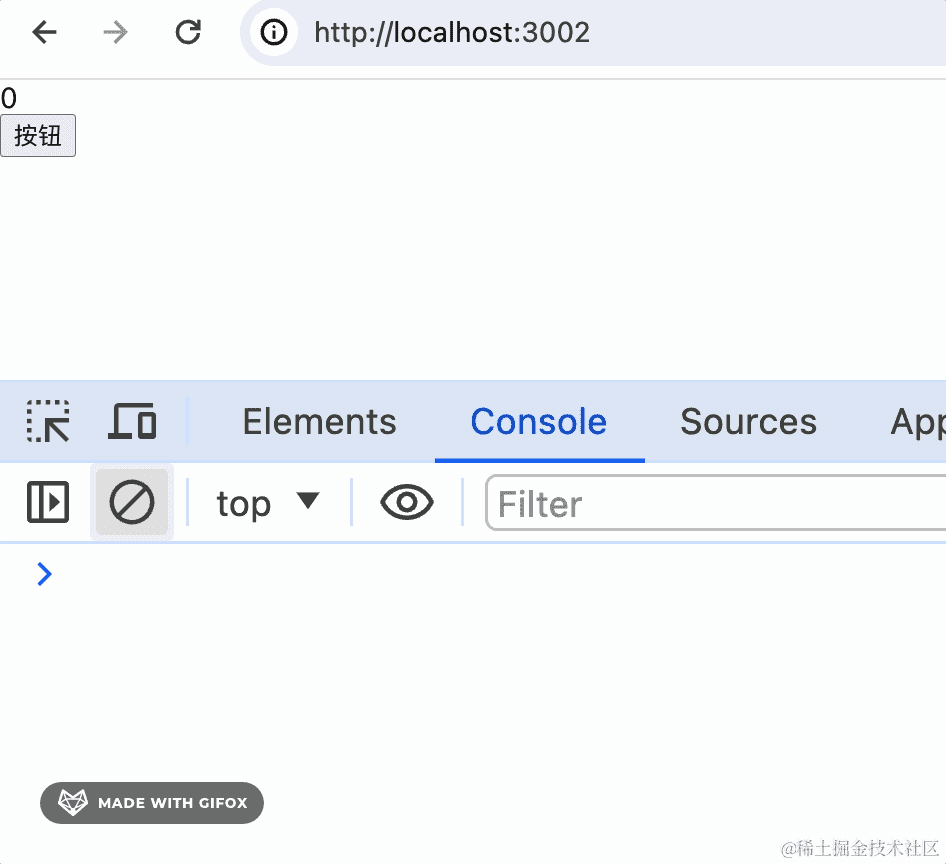

上面 Aaa 组件里也可以简化成 useAtomValue：

```javascript
import { atom, useAtom, useAtomValue, useSetAtom } from 'jotai'; 

const aaaAtom = atom(0);

function Aaa() {
    const aaa = useAtomValue(aaaAtom);

    console.log('Aaa render...');

    return <div>
        {aaa}
    </div>
}

function Bbb() {
    const setAaa = useSetAtom(aaaAtom);

    console.log('Bbb render...');

    return <div>
        <button onClick={() => setAaa(Math.random())}>按钮</button>
    </div>
}

export default function App() {
    return <div>
        <Aaa></Aaa>
        <Bbb></Bbb>
    </div>
}
```

至此，jotai 的核心功能就讲完了：

**通过 atom 创建原子状态，定义的时候还可以单独指定 get、set 函数（或者叫 read、write 函数），用来实现状态派生、异步状态修改。**

**组件里可以用 useAtom 来拿到 get、set 函数，也可以通过 useAtomValue、useSetAtom 分别拿。**

**不需要读取状态的，用 useSetAtom 还可以避免不必要的渲染。**

那 zustand 支持的中间件机制在 jotai 里怎么实现呢？

zustand 支持通过中间件来修改 get、set 函数：

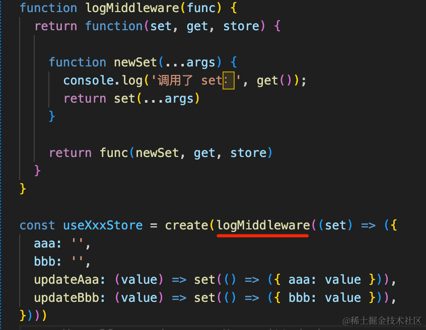

比如在 set 的时候打印日志。

或者用 persist 中间件把状态存储到 localStorage 中：

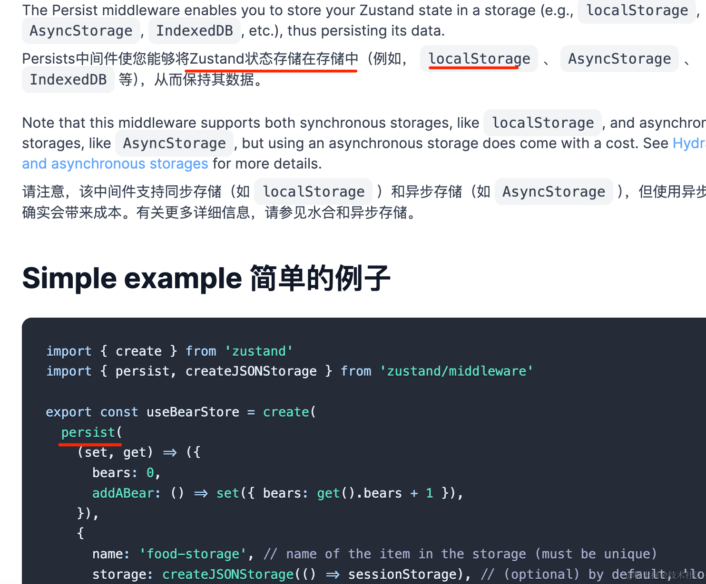

zustand 中间件的原理很简单，就是修改了 get、set 函数，做一些额外的事情。

试一下：

```javascript
import { create } from 'zustand'
import { persist } from 'zustand/middleware'

const useStore = create(persist((set) => ({
    count: 0,
    setCount: (value) => set({ count: value})
}), {
    name: 'count-key'
}))

export default function App() {
    const count = useStore(state => state.count);
    const setCount = useStore((state) => state.setCount);
    
    return <div>
        count: {count}
        <button onClick={() => setCount(count + 1)}>加一</button>
    </div>
}
```


jotai 里是用 utils 包的 atomWithStorage：

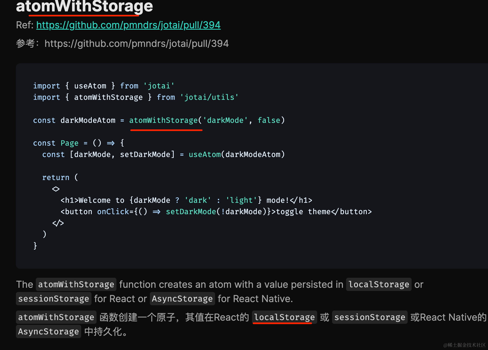

试一下：

```javascript
import { useAtom } from 'jotai'
import { atomWithStorage } from 'jotai/utils'

const countAtom = atomWithStorage('count-key2', 0)

export default function App() {
    const [count, setCount] = useAtom(countAtom);
    
    return <div>
        count: {count}
        <button onClick={() => setCount(count + 1)}>加一</button>
    </div>
}

```
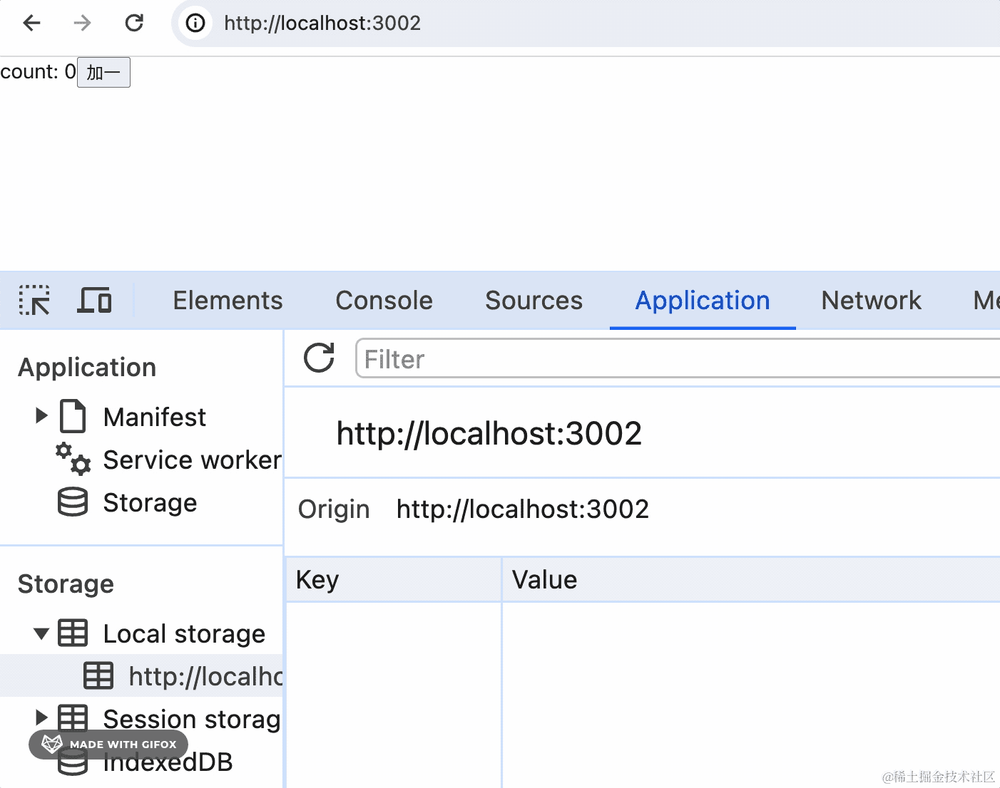

它是怎么实现的呢？和 zustand 的中间件有啥区别么？

看下源码：

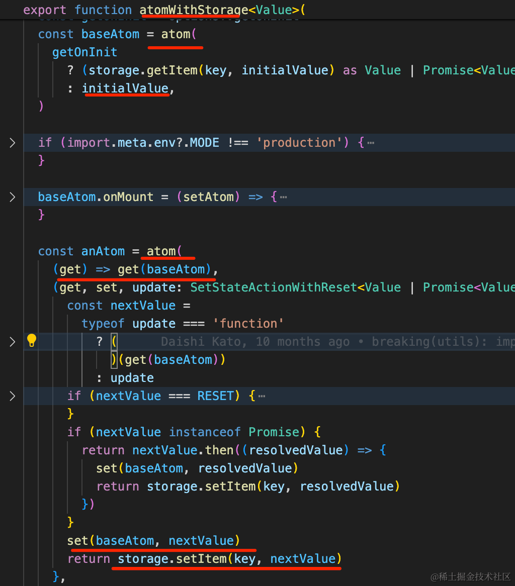

声明一个 atom 来存储状态值，然后又声明了一个 atom 来 get、set 它。

其实和 zustand 中间件修改 get、set 方法的原理是一样的，只不过 atom 本来就支持自定义 get、set 方法。

## 总结

今天我们学了状态管理库 jotai，以及它的原子化的思路。

声明原子状态，然后组合成新的状态，和 tailwind 的思路类似。

提到原子化状态管理，都会提到 context 的性能问题，也就是 context 里通过对象存储了多个值的时候，修改一个值，会导致依赖其他值的组件也跟着重新渲染。

所以要拆分 context，这也是原子化状态管理的思想。

zustand 是所有 state 放在全局 store 里，然后用到的时候 selector 取需要的部分。

jotai 是每个 state 单独声明原子状态，用到的时候单独用或者组合用。

一个自上而下，一个自下而上，这是两种思路。

jotai 通过 atom 创建原子状态，定义的时候还可以单独指定 get、set 函数（或者叫 read、write 函数），用来实现状态派生、异步状态修改。

组件里可以用 useAtom 来拿到 get、set 函数，也可以通过 useAtomValue、useSetAtom 分别拿。

不需要读取状态的，用 useSetAtom 还可以避免不必要的渲染。

zustand 的中间件是通过包一层然后修改 get、set 实现的，而 jotai 天然支持 get、set 的修改。

不管是状态、派生状态、异步修改状态、中间件等方面，zustand 和 jotai 都是一样的。

区别只是一个是全局 store 里存储所有 state，一个是声明原子 state，然后组合。

这只是两种思路，没有好坏之分，看你业务需求，适合哪个就用那个，或者你习惯哪种思路就用哪个。
