# 第49章—用react-intl实现国际化

国际化是前端应用的常见需求，比如一个应用要同时支持中文和英文用户访问。

如果你在外企工作，那基本要天天做这件事情，比如我待过韩企和日企，我们的应用要支持韩文和英文，或者日文和英文。

那如何实现这种国际化的需求呢？

用 react-intl 这个包。

这个包周下载量很高：

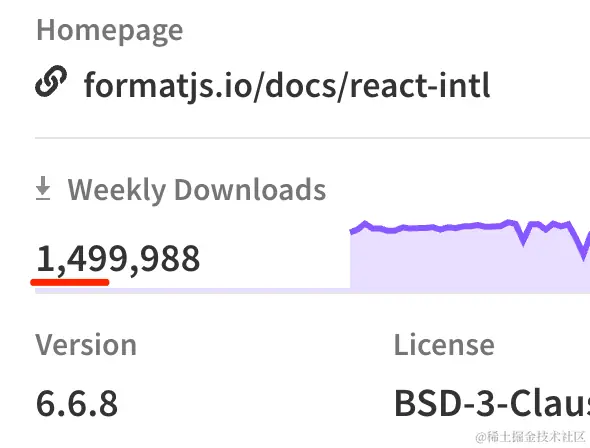

我们来用一下。

创建个项目：

```
npx create-vite
```

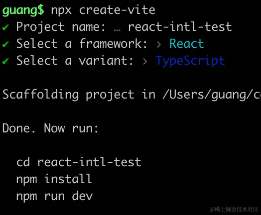

我们先安装 antd 来写个简单的页面：

```
npm install

npm install --save antd
```

去掉 main.tsx 里的 StrictMode 和 index.css

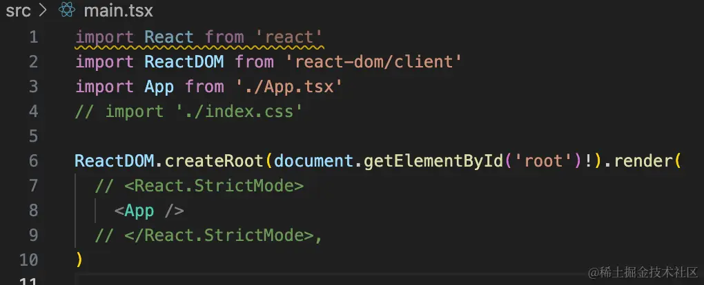

然后写下 App.tsx

```javascript
import React from 'react';
import type { FormProps } from 'antd';
import { Button, Checkbox, Form, Input } from 'antd';

type FieldType = {
  username?: string;
  password?: string;
  remember?: string;
};

const onFinish: FormProps<FieldType>['onFinish'] = (values) => {
  console.log('Success:', values);
};

const onFinishFailed: FormProps<FieldType>['onFinishFailed'] = (errorInfo) => {
  console.log('Failed:', errorInfo);
};

const App: React.FC = () => (
  <Form
    name="basic"
    labelCol={{ span: 8 }}
    wrapperCol={{ span: 16 }}
    style={{ maxWidth: 600 }}
    initialValues={{ remember: true }}
    onFinish={onFinish}
    onFinishFailed={onFinishFailed}
    autoComplete="off"
  >
    <Form.Item<FieldType>
      label="Username"
      name="username"
      rules={[{ required: true, message: 'Please input your username!' }]}
    >
      <Input />
    </Form.Item>

    <Form.Item<FieldType>
      label="Password"
      name="password"
      rules={[{ required: true, message: 'Please input your password!' }]}
    >
      <Input.Password />
    </Form.Item>

    <Form.Item<FieldType>
      name="remember"
      valuePropName="checked"
      wrapperCol={{ offset: 8, span: 16 }}
    >
      <Checkbox>Remember me</Checkbox>
    </Form.Item>

    <Form.Item wrapperCol={{ offset: 8, span: 16 }}>
      <Button type="primary" htmlType="submit">
        Submit
      </Button>
    </Form.Item>
  </Form>
);

export default App;
```
这里是直接从 antd 官网复制的代码。

把服务跑起来：

```
npm run dev
```

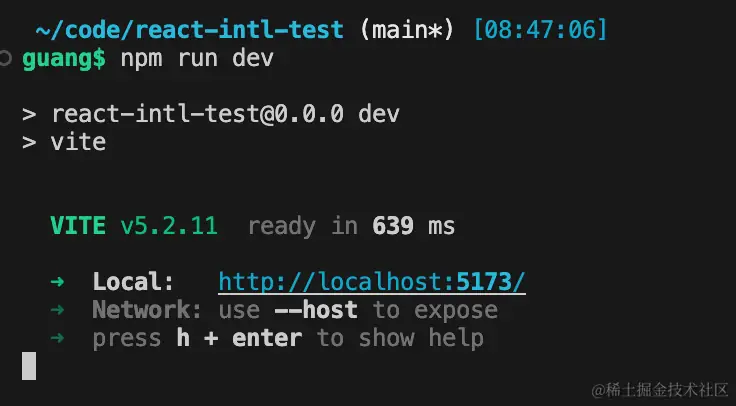

浏览器访问下：

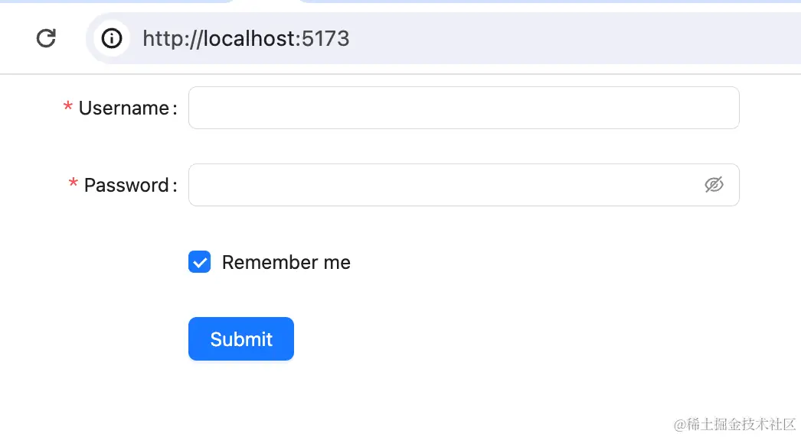

那如果这个页面要同时支持中文、英文呢？

只要把需要国际化的文案转成一个 key，然后根据当前 locale 是中文还是英文来读取不同的资源包就好了： 

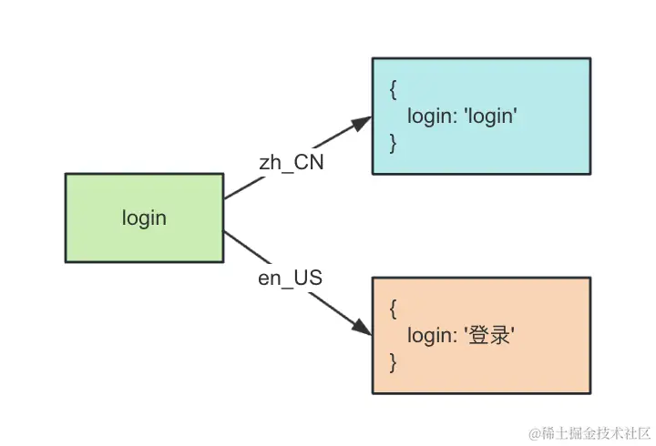

locale 是“语言代码-国家代码”，可以从 navigator.language 拿到：

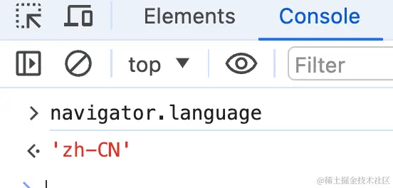

资源包就是一个 json 文件里面有各种 key 对应的不同语言的文案，比如 zh-CN.json、en-US.json 等。

我们用 react-intl 实现下：

在 main.tsx 引入下 IntlProvider，它是用来设置 locale 和 messsages 资源包的：

```javascript
import ReactDOM from 'react-dom/client'
import App from './App.tsx'
import { IntlProvider } from 'react-intl'
import enUS from './en-US.json';
import zhCN from './zh-CN.json';

const messages: Record<string, any> = {
  'en-US': enUS,
  'zh-CN': zhCN
}
const locale = navigator.language;

ReactDOM.createRoot(document.getElementById('root')!).render(
  <IntlProvider messages={messages[locale]} locale={locale} defaultLocale="zh_CN">
    <App />
  </IntlProvider>
)
```

然后写一下 zh-CN.json 和 en-US.json

```json
{
    "username": "Username",
    "password": "Password",
    "rememberMe": "Remember Me",
    "submit": "Submit",
    "inputYourUsername": "Please input your username!",
    "inputYourPassword": "Please input your password!"
}
```
```json
{
    "username": "用户名",
    "password": "密码",
    "rememberMe": "记住我",
    "submit": "提交",
    "inputYourUsername": "请输入你的用户名！",
    "inputYourPassword": "请输入你的密码！"
}
```
把 App.tsx 里的文案换成从资源包取值的方式：

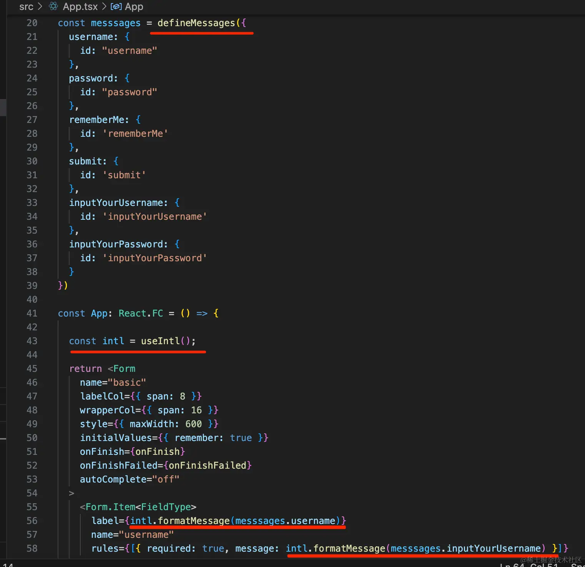

defineMessages 和 useIntl 都是 react-intl 的 api。

defineMessages 是定义 message，这里的 id 就是资源包里的 key，要对应才行。

此外还可以定义 defaultMessage，也就是资源包没有对应的 key 的时候的默认值：

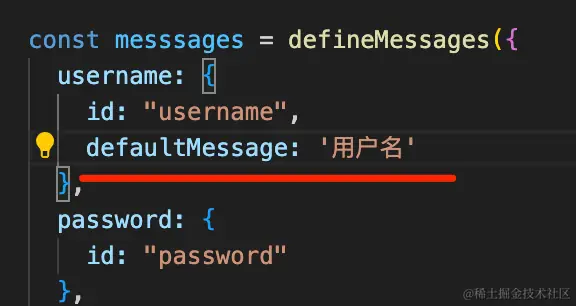

useIntl 有很多 api，比如 formatMessage 的 api 就是根据 id 取不同 message 的。

```javascript
import React from 'react';
import type { FormProps } from 'antd';
import { Button, Checkbox, Form, Input } from 'antd';
import { useIntl, defineMessages } from 'react-intl';

type FieldType = {
  username?: string;
  password?: string;
  remember?: string;
};

const onFinish: FormProps<FieldType>['onFinish'] = (values) => {
  console.log('Success:', values);
};

const onFinishFailed: FormProps<FieldType>['onFinishFailed'] = (errorInfo) => {
  console.log('Failed:', errorInfo);
};

const messsages = defineMessages({
  username: {
    id: "username",
    defaultMessage: '用户名'
  },
  password: {
    id: "password"
  },
  rememberMe: {
    id: 'rememberMe'
  },
  submit: {
    id: 'submit'
  },
  inputYourUsername: {
    id: 'inputYourUsername'
  },
  inputYourPassword: {
    id: 'inputYourPassword'
  }
})

const App: React.FC = () => {

  const intl = useIntl();

  return <Form
    name="basic"
    labelCol={{ span: 8 }}
    wrapperCol={{ span: 16 }}
    style={{ maxWidth: 600 }}
    initialValues={{ remember: true }}
    onFinish={onFinish}
    onFinishFailed={onFinishFailed}
    autoComplete="off"
  >
    <Form.Item<FieldType>
      label={intl.formatMessage(messsages.username)}
      name="username"
      rules={[{ required: true, message: intl.formatMessage(messsages.inputYourUsername) }]}
    >
      <Input />
    </Form.Item>

    <Form.Item<FieldType>
      label={intl.formatMessage(messsages.password)}
      name="password"
      rules={[{ required: true, message: intl.formatMessage(messsages.inputYourUsername) }]}
    >
      <Input.Password />
    </Form.Item>

    <Form.Item<FieldType>
      name="remember"
      valuePropName="checked"
      wrapperCol={{ offset: 8, span: 16 }}
    >
      <Checkbox>{intl.formatMessage(messsages.rememberMe)}</Checkbox>
    </Form.Item>

    <Form.Item wrapperCol={{ offset: 8, span: 16 }}>
      <Button type="primary" htmlType="submit">
      {intl.formatMessage(messsages.submit)}
      </Button>
    </Form.Item>
  </Form>
}

export default App;
```
试一下：

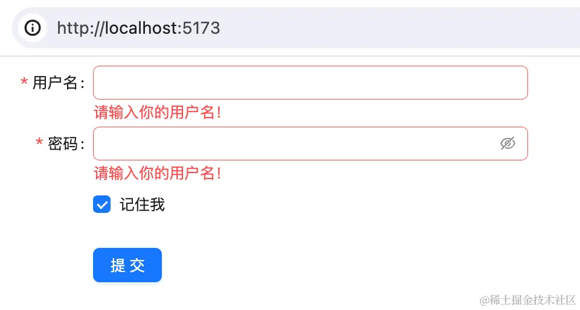

可以看到，现在文案就都变成中文了。

然后改下 locale：

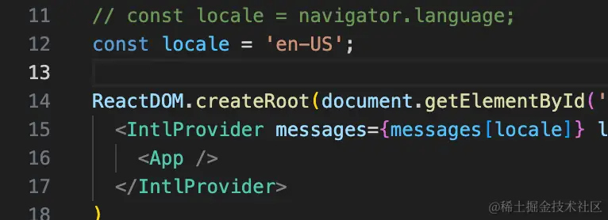

现在界面又都是英文了：

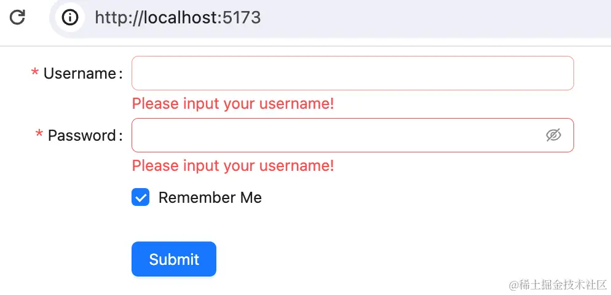

其他语言也是同理。

但国际化可不只是替换下文案这么简单，日期、数字等的格式也都不一样。

react-intl 包也支持：

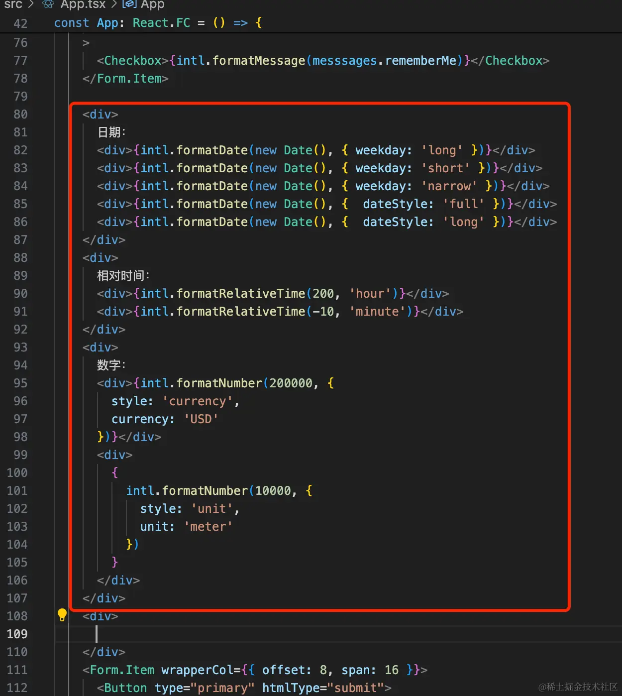

```javascript
<div>
  日期：
  <div>{intl.formatDate(new Date(), { weekday: 'long' })}</div> 
  <div>{intl.formatDate(new Date(), { weekday: 'short' })}</div> 
  <div>{intl.formatDate(new Date(), { weekday: 'narrow' })}</div>
  <div>{intl.formatDate(new Date(), {  dateStyle: 'full' })}</div>
  <div>{intl.formatDate(new Date(), {  dateStyle: 'long' })}</div>
</div>
<div>
  相对时间：
  <div>{intl.formatRelativeTime(200, 'hour')}</div> 
  <div>{intl.formatRelativeTime(-10, 'minute')}</div> 
</div>
<div>
  数字：
  <div>{intl.formatNumber(200000, {
    style: 'currency',
    currency: 'USD'
  })}</div> 
  <div>
    {
      intl.formatNumber(10000, {
        style: 'unit',
        unit: 'meter'
      })
    }
  </div>
</div>
```

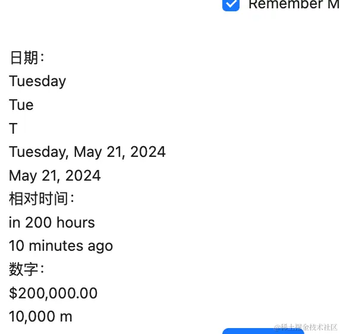

然后换成 zh-CN 再看下：

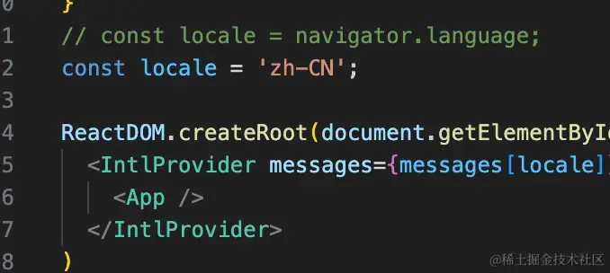

可以看到，确实不同语言的表示方式不一样：

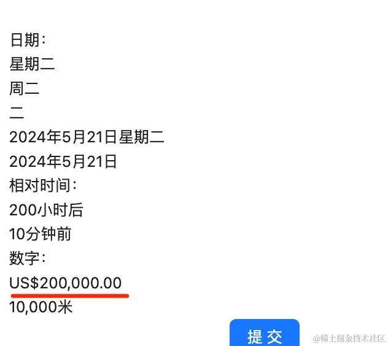

但这里金额没有切换过来，需要改一下：

```javascript
<div>{intl.formatNumber(200000, {
    style: 'currency',
    currency:  intl.locale.includes('en') ? 'USD' : 'CNY'
})}</div> 
```
根据 locale 来分别设置为美元符号 USD 或者人民币符号 CNY。

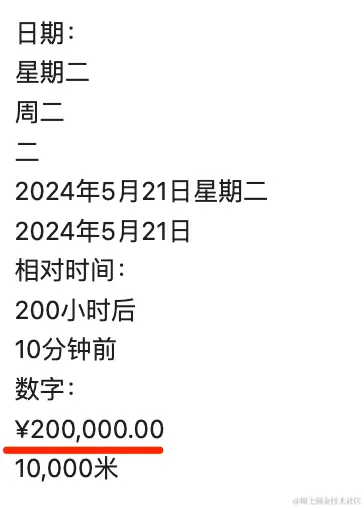

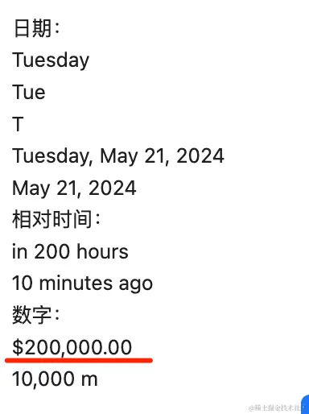

现在就都对了。

当然，可以国际化的东西还有很多，用到的时候[查文档](https://formatjs.io/docs/react-intl/api)就行：

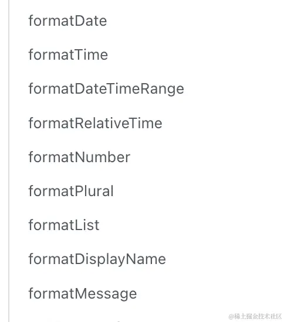

我们主要用的 useIntl 的 api，然后调用 formatXxx 方法。

其实这些 api 都有组件版本：

```javascript
<div>
  <div><FormattedDate value={new Date} dateStyle='full'></FormattedDate></div>
  <div><FormattedMessage id={messsages.rememberMe.id}></FormattedMessage></div>
  <div><FormattedNumber style='unit' unit='meter' value={2000}></FormattedNumber></div>
</div>
```


哪种方便用哪种。

回过头来再看下 message 的国际化。

message 支持占位符，比如这样：

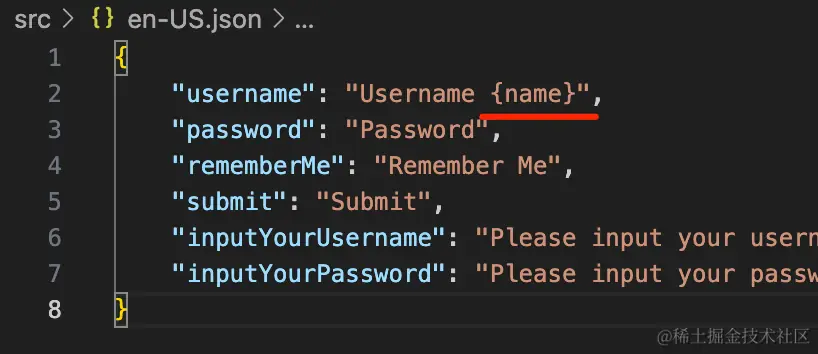

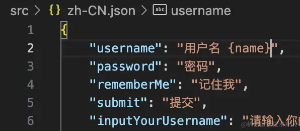

用的时候传入具体的值：

```javascript
<div>
  <div>{intl.formatMessage(messsages.username, { name: '光'})}</div>
  <div><FormattedMessage id={messsages.username.id} values={{name: '东'}}></FormattedMessage></div>
</div>
```


此外，国际化的消息还可以用一些 html 标签，也就是支持富文本。

这样：
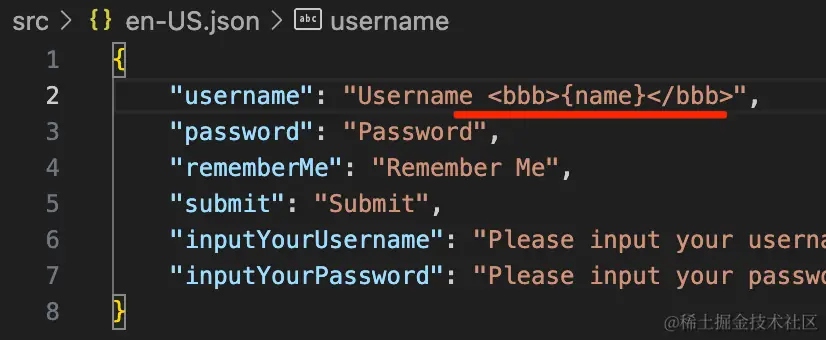

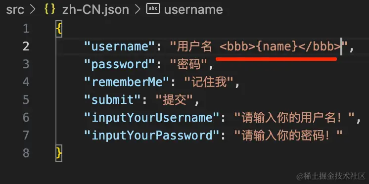

在 IntlProvider 的 defaultRichTextElements 这里定义所有的富文本标签：

```javascript
<IntlProvider 
    messages={messages[locale]}
    locale={locale}
    defaultLocale="zh_CN"
    defaultRichTextElements={
      {
        bbb: (str) => <b>{str}</b>,
        strong: (str) => <strong>{str}</strong>
      }
    }
>
    <App />
</IntlProvider>
```
这样，运行时就会把他们替换成具体的标签：

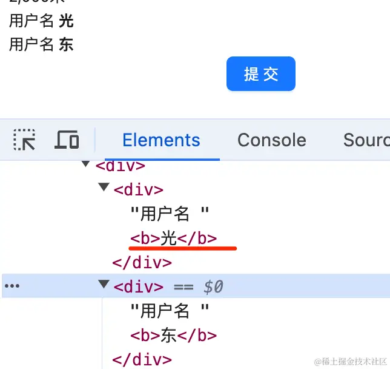

掌握这些功能，国际化需求就足够用了。

此外，还要注意下兼容性问题：

react-intl 的很多 api 都是对浏览器原生的 Intl api 的封装：

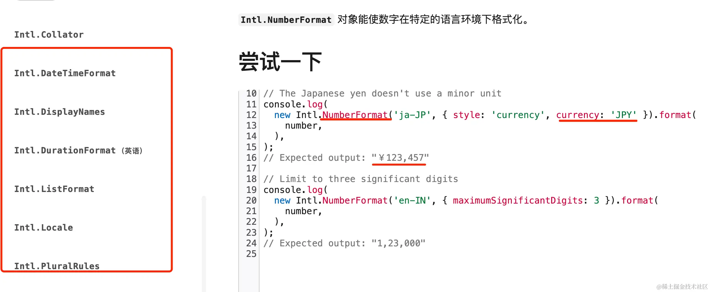

而 Intl 的 api 在一些老的浏览器不支持，这时候引入下 polyfill 包就好了：

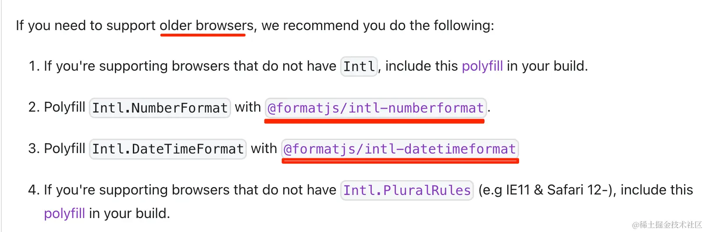

那如果我想在组件外用呢？

也可以，用 createIntl 的 api：

src/getMessage.ts

```javascript
import { createIntl, defineMessages } from "react-intl"
import enUS from './en-US.json';
import zhCN from './zh-CN.json';

const messages: Record<string, any> = {
  'en-US': enUS,
  'zh-CN': zhCN
}

const locale = 'zh-CN'
const intl = createIntl({
    locale: locale,
    messages: messages[locale]
});

const defines = defineMessages({
    inputYourUsername: {
        id: 'inputYourUsername',
        defaultMessage: ''
    }
});

export default function() {
    return intl.formatMessage(defines.inputYourUsername);
}
```

在 App.tsx 里引入下：

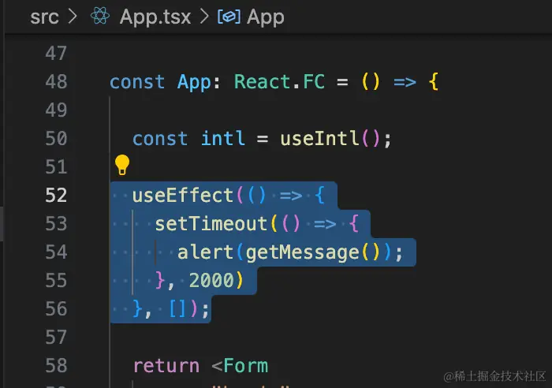

```javascript
useEffect(() => {
    setTimeout(() => {
      alert(getMessage());
    }, 2000)
}, []);
```

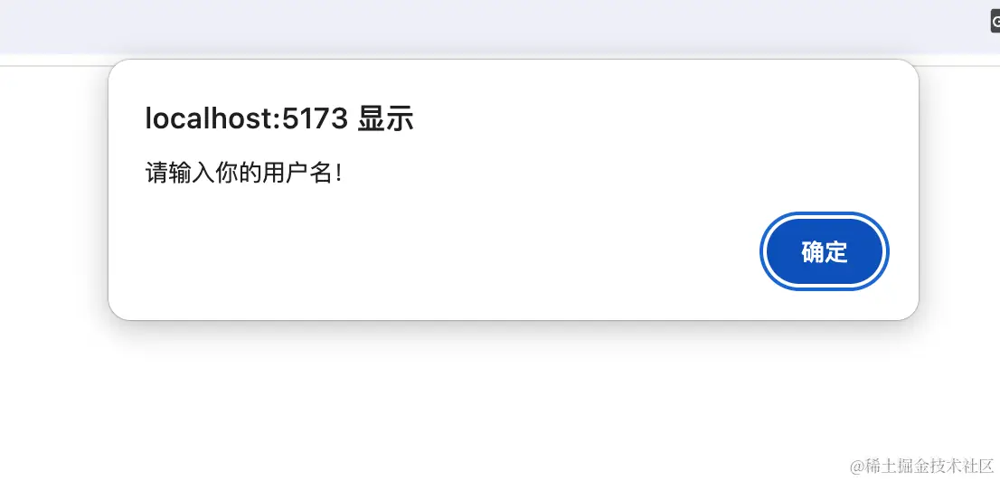

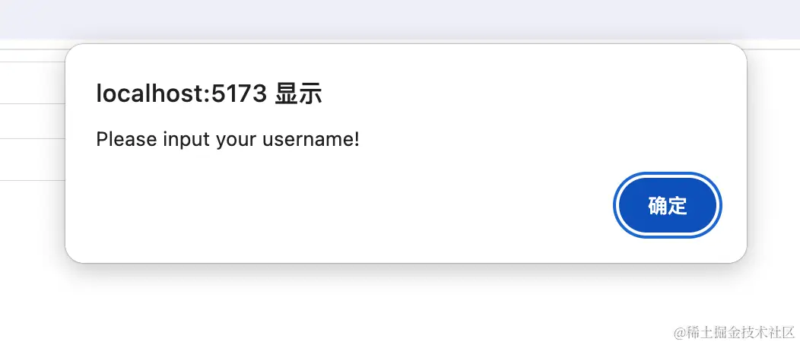

可以看到，在非组件里也可以做文案的国际化。

还有一个问题，不知道大家有没有觉得把所有需要国际化的地方找出来，然后在资源包里定义一遍很麻烦？

确实，react-intl 提供了一个工具来自动生成资源包。

我们用一下：

```
npm i -save-dev @formatjs/cli
```

用这个工具需要所有 message 都有默认值，前面我们省略了，这里改一下：

```javascript
const messsages = defineMessages({
  username: {
    id: "username",
    defaultMessage: '用户名'
  },
  password: {
    id: "password",
    defaultMessage: '密码'
  },
  rememberMe: {
    id: 'rememberMe',
    defaultMessage: '记住我'
  },
  submit: {
    id: 'submit',
    defaultMessage: '提交'
  },
  inputYourUsername: {
    id: 'inputYourUsername',
    defaultMessage: '请输入用户名！'
  },
  inputYourPassword: {
    id: 'inputYourPassword',
    defaultMessage: '请输入密码！'
  }
})
```
然后执行 extract 命令从 ts、vue 等文件里提所有 defineMessage 定义的消息：

```
npx formatjs extract "src/**/*.tsx" --out-file temp.json
```
然后可以看到我们 defineMessage 定义的所有 message 都提取了出来，key 是 id：

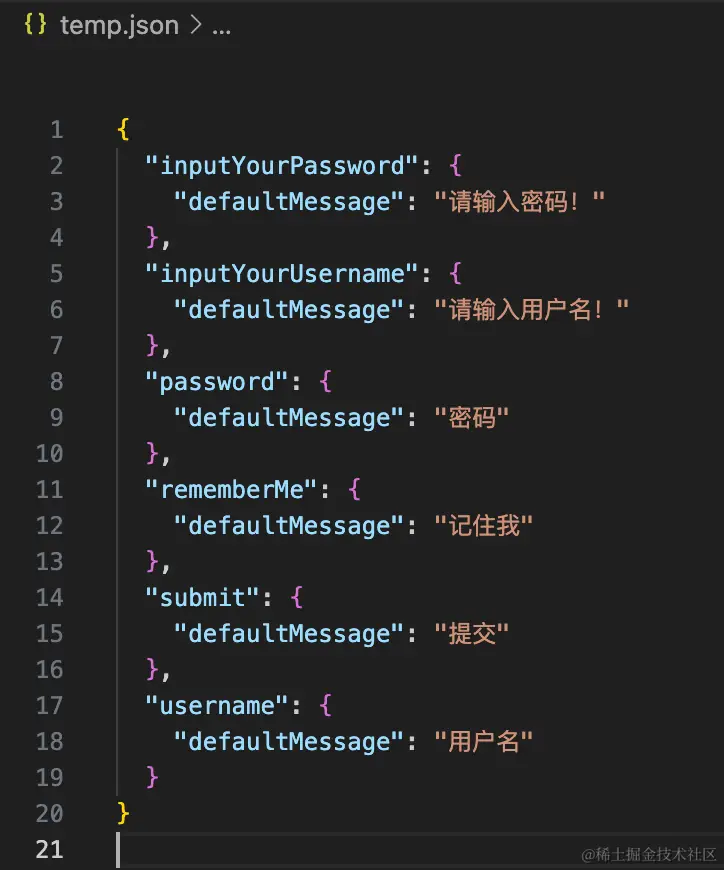

接下来再执行 compile 命令生成资源包 json：

```
npx formatjs compile 'temp.json' --out-file src/ja-JP.json
```
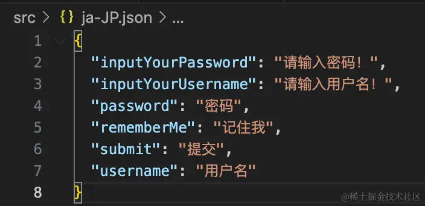

可以看到它用所有的 message 的 id 和默认值生成了新的资源包。

这样，只要把这个资源包交给产品经理或者设计师去翻译就好了。

最后把刚才的临时文件删除：

```
rm ./temp.json
```
这个 cli 工具对于项目中 defineMessage 定义了很多国际化消息，想要全部提取出来生成一个资源包的场景还是很有用的。

案例代码上传了[小册仓库](https://github.com/QuarkGluonPlasma/react-course-code/tree/main/react-intl-test)

## 总结

很多应用都要求支持多语言，也就是国际化，如果你在外企，那几乎天天都在做这个。

我们用 react-intl 包实现了国际化。

它支持在 IntlProvider 里传入 locale 和 messages，然后在组件里用 useIntl 的 formatMessage 的 api 或者用 FormatMessage 组件来取资源包中的消息。

定义消息用 defineMessages，指定不同的 id。

在 en-US.json、zh-CN.json 资源包里定义 message id 的不同值。

这样，就实现了文案的国际化。

此外，message 支持占位符和富文本，资源包用 {name}、\<xxx>\</xxx>的方式来写，然后用的时候传入对应的文本、替换富文本标签就好了。

如果是在非组件里用，要用 createIntl 的 api。

当然，日期、数字等在不同语言环境会有不同的格式，react-intl 对原生 Intl 的 api 做了封装，可以用 formatNumber、formatDate 等 api 来做相应的国际化。

如果应用中有很多 defineMessage 的国际化消息，想要批量提取出来生成资源包，可以用 @formatjs/cli 的 extract、compile 命令来做。

掌握了这些功能，就足够实现前端应用中各种国际化的需求了。
