# 第55章—ReactPlayground项目实战：多文件切换

上节完成了整体布局和代码编辑器部分的开发：


这节继续来做多文件的切换：

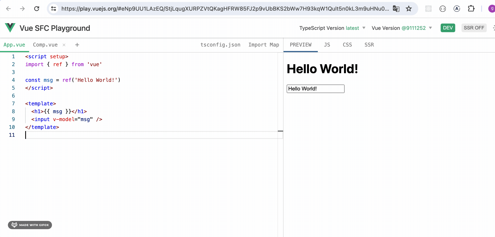

点击上面的 tab 可以切换当前选中的文件，然后下面就会展示对应文件的内容。

上面的 FileNameList 组件、下面的 Editor 组件，还有右边的 Preview 组件都需要拿到所有文件的信息：

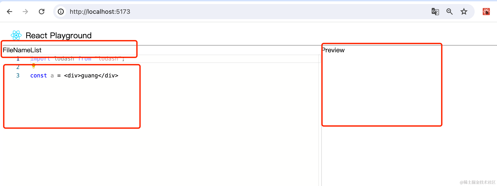

如何跨多个组件共享同一份数据呢？

很明显要用 Context。

我们先来创建这个 Context：

创建 PlaygroundContext.tsx

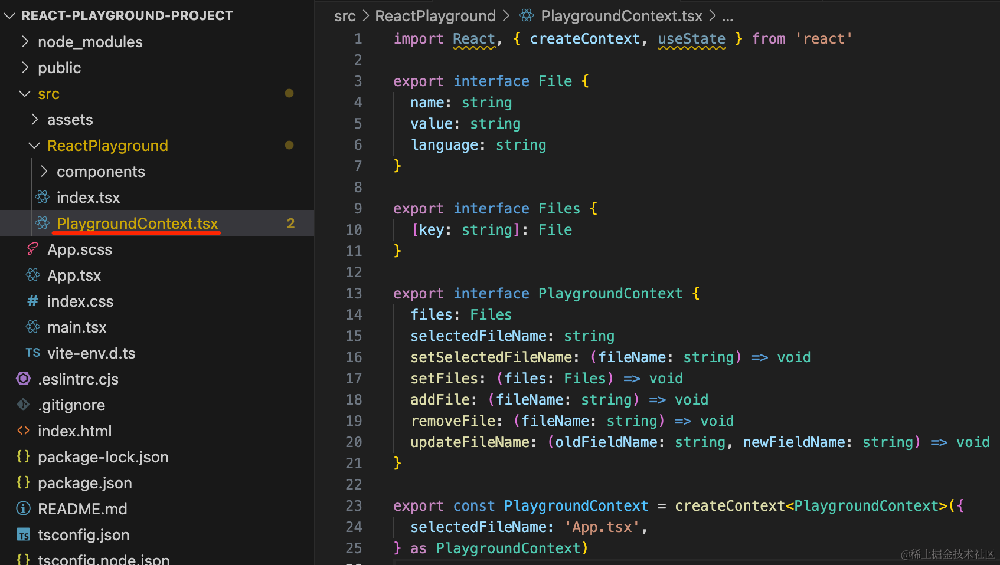

```javascript
import React, { createContext, useState } from 'react'

export interface File {
  name: string
  value: string
  language: string
}

export interface Files {
  [key: string]: File
}

export interface PlaygroundContext {
  files: Files
  selectedFileName: string
  setSelectedFileName: (fileName: string) => void
  setFiles: (files: Files) => void
  addFile: (fileName: string) => void
  removeFile: (fileName: string) => void
  updateFileName: (oldFieldName: string, newFieldName: string) => void
}

export const PlaygroundContext = createContext<PlaygroundContext>({
  selectedFileName: 'App.tsx',
} as PlaygroundContext)
```

context 里保存了 files 的信息，还有当前选中的文件 selectedFileName

file 的信息是这样保存的：

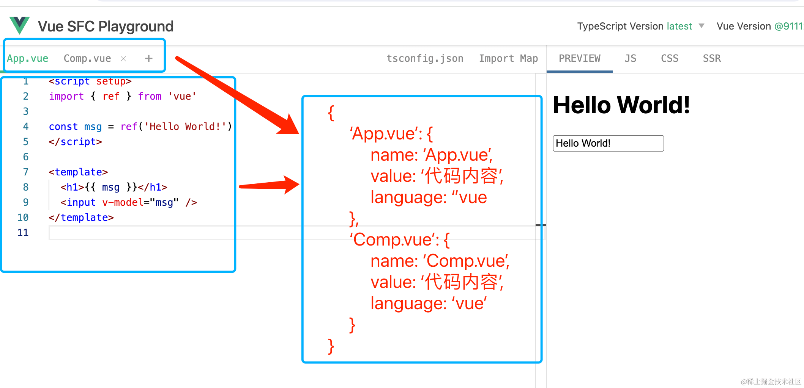

files 里是键值对方式保存的文件信息，键是文件名，值是文件的信息，包括 name、value、language。

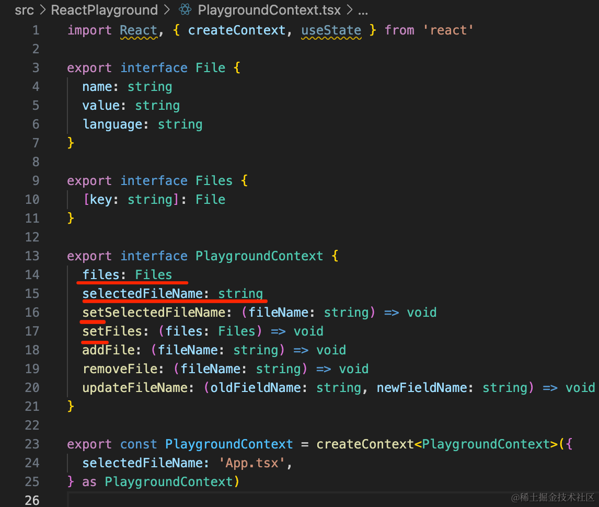

context 里除了 files 和 selectedFileName 外，还有修改它们的方法 setXxx。

以及 addFile、removeFile、updateFileName 的方法。

增删改文件的时候用：


然后提供一个 PlaygroundProvider 组件：

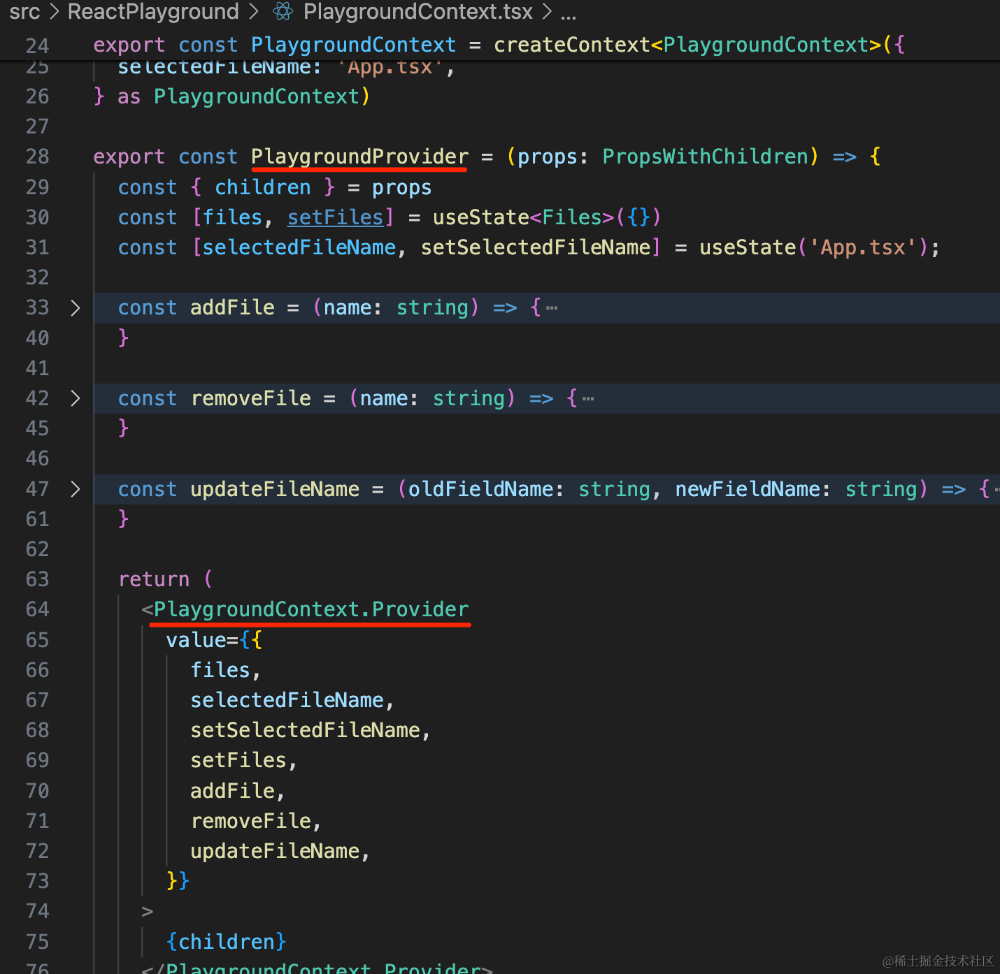

它就是对 Context.Provider 的封装，注入了这些增删改文件的方法的实现：

```javascript
export const PlaygroundProvider = (props: PropsWithChildren) => {
  const { children } = props
  const [files, setFiles] = useState<Files>({})
  const [selectedFileName, setSelectedFileName] = useState('App.tsx');

  const addFile = (name: string) => {
    files[name] = {
      name,
      language: fileName2Language(name),
      value: '',
    }
    setFiles({ ...files })
  }

  const removeFile = (name: string) => {
    delete files[name]
    setFiles({ ...files })
  }

  const updateFileName = (oldFieldName: string, newFieldName: string) => {
    if (!files[oldFieldName] || newFieldName === undefined || newFieldName === null) return
    const { [oldFieldName]: value, ...rest } = files
    const newFile = {
      [newFieldName]: {
        ...value,
        language: fileName2Language(newFieldName),
        name: newFieldName,
      },
    }
    setFiles({
      ...rest,
      ...newFile,
    })
  }

  return (
    <PlaygroundContext.Provider
      value={{
        files,
        selectedFileName,
        setSelectedFileName,
        setFiles,
        addFile,
        removeFile,
        updateFileName,
      }}
    >
      {children}
    </PlaygroundContext.Provider>
  )
}
```
这里的 addFile、removeFile、updateFileName 的实现都比较容易看懂，就是修改 files 的内容。

用到的 fileName2Language 在 utils.ts 里：

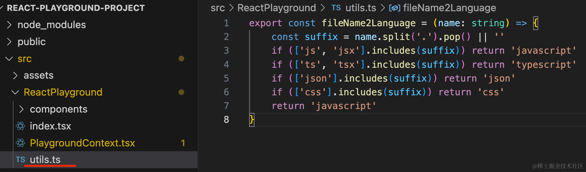

```javascript
export const fileName2Language = (name: string) => {
    const suffix = name.split('.').pop() || ''
    if (['js', 'jsx'].includes(suffix)) return 'javascript'
    if (['ts', 'tsx'].includes(suffix)) return 'typescript'
    if (['json'].includes(suffix)) return 'json'
    if (['css'].includes(suffix)) return 'css'
    return 'javascript'
}
```
就是根据不同的后缀名返回 language。

在 monaco editor 这里会用到，用于不同语法的高亮：

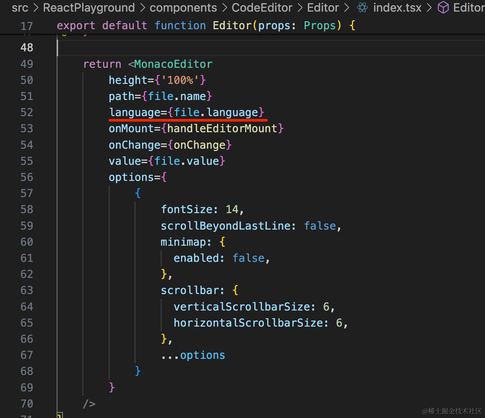

然后我们在 App.tsx 里包一层 Provider：

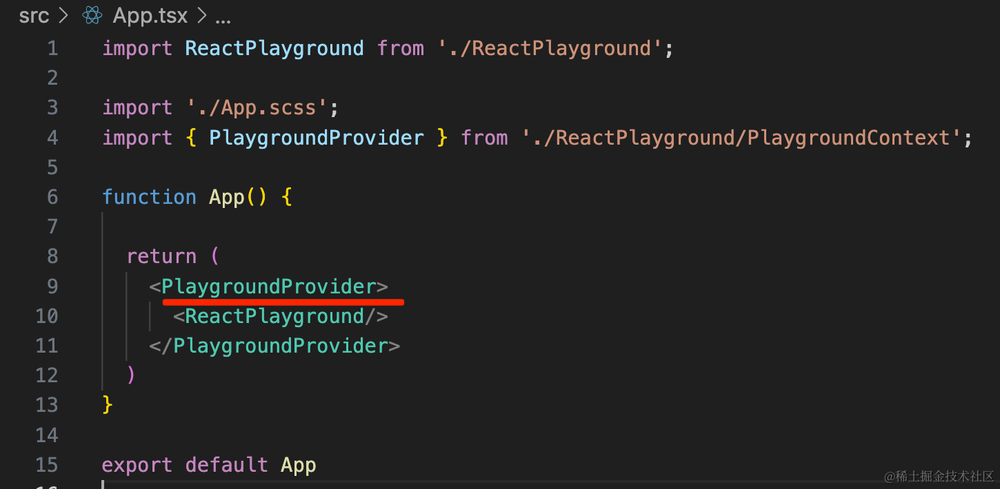

这样就可以在任意组件用 useContext 读取 context 的值了。

我们在 FileNameList 里读取下：

```javascript
import { useContext } from "react"
import { PlaygroundContext } from "../../../PlaygroundContext"

export default function FileNameList() {
    const { 
        files, 
        removeFile, 
        addFile, 
        updateFileName, 
        selectedFileName 
    } = useContext(PlaygroundContext)

    return <div>FileNameList</div>
}
```
然后渲染下 tab：

```javascript
import { useContext, useEffect, useState } from "react"
import { PlaygroundContext } from "../../../PlaygroundContext"

export default function FileNameList() {
    const { 
        files, 
        removeFile, 
        addFile, 
        updateFileName, 
        selectedFileName 
    } = useContext(PlaygroundContext)

    const [tabs, setTabs] = useState([''])

    useEffect(() => {
        setTabs(Object.keys(files))
    }, [files])

    return <div>
        {
            tabs.map((item, index) => (
                <div>{item}</div>
            ))
        }
    </div>
}
```
用 useContext 读取 context 中的 files，用来渲染 tab。

当然，现在 context 里的 files 没有内容，我们初始化下数据。

在 src/ReactPlayground 目录下创建个 files.ts

```javascript
import { Files } from './PlaygroundContext'
import importMap from './template/import-map.json?raw'
import AppCss from './template/App.css?raw'
import App from './template/App.tsx?raw'
import main from './template/main.tsx?raw'
import { fileName2Language } from './utils'

// app 文件名
export const APP_COMPONENT_FILE_NAME = 'App.tsx'
// esm 模块映射文件名
export const IMPORT_MAP_FILE_NAME = 'import-map.json'
// app 入口文件名
export const ENTRY_FILE_NAME = 'main.tsx'

export const initFiles: Files = {
  [ENTRY_FILE_NAME]: {
    name: ENTRY_FILE_NAME,
    language: fileName2Language(ENTRY_FILE_NAME),
    value: main,
  },
  [APP_COMPONENT_FILE_NAME]: {
    name: APP_COMPONENT_FILE_NAME,
    language: fileName2Language(APP_COMPONENT_FILE_NAME),
    value: App,
  },
  'App.css': {
    name: 'App.css',
    language: 'css',
    value: AppCss,
  },
  [IMPORT_MAP_FILE_NAME]: {
    name: IMPORT_MAP_FILE_NAME,
    language: fileName2Language(IMPORT_MAP_FILE_NAME),
    value: importMap,
  },
}
```

导出的 initFiles 包含 App.tsx、main.tsx、App.css、import-map.json 这几个文件。

import 模块的时候加一个 ?raw，就是直接文本的方式引入模块内容。

在 template 目录下添加这四个文件：

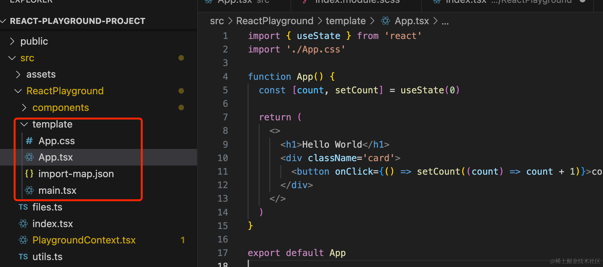

App.tsx

```javascript
import { useState } from 'react'
import './App.css'

function App() {
  const [count, setCount] = useState(0)

  return (
    <>
      <h1>Hello World</h1>
      <div className='card'>
        <button onClick={() => setCount((count) => count + 1)}>count is {count}</button>
      </div>
    </>
  )
}

export default App
```
App.css

```css
:root {
  font-family: Inter, system-ui, Avenir, Helvetica, Arial, sans-serif;
  -webkit-font-smoothing: antialiased;
  -moz-osx-font-smoothing: grayscale;
  font-weight: 400;
  line-height: 1.5;
  color: rgb(255 255 255 / 87%);
  text-rendering: optimizelegibility;
  text-size-adjust: 100%;
  background-color: #242424;
  color-scheme: light dark;
  font-synthesis: none;
}

#root {
  max-width: 1280px;
  padding: 2rem;
  margin: 0 auto;
  text-align: center;
}

body {
  display: flex;
  min-width: 320px;
  min-height: 100vh;
  margin: 0;
  place-items: center;
}

h1 {
  font-size: 3.2em;
  line-height: 1.1;
}

button {
  padding: 0.6em 1.2em;
  font-family: inherit;
  font-size: 1em;
  font-weight: 500;
  cursor: pointer;
  background-color: #1a1a1a;
  border: 1px solid transparent;
  border-radius: 8px;
  transition: border-color 0.25s;
}

button:hover {
  border-color: #646cff;
}

button:focus,
button:focus-visible {
  outline: 4px auto -webkit-focus-ring-color;
}

@media (prefers-color-scheme: light) {
  :root {
    color: #213547;
    background-color: #fff;
  }

  button {
    background-color: #f9f9f9;
  }
}
```
main.tsx

```javascript
import React from 'react'
import ReactDOM from 'react-dom/client'

import App from './App'

ReactDOM.createRoot(document.getElementById('root')!).render(
  <React.StrictMode>
    <App />
  </React.StrictMode>
)
```
import-map.json
```json
{
  "imports": {
    "react": "https://esm.sh/react@18.2.0",
    "react-dom/client": "https://esm.sh/react-dom@18.2.0"
  }
}
```
然后在 Provider 里初始化 files：

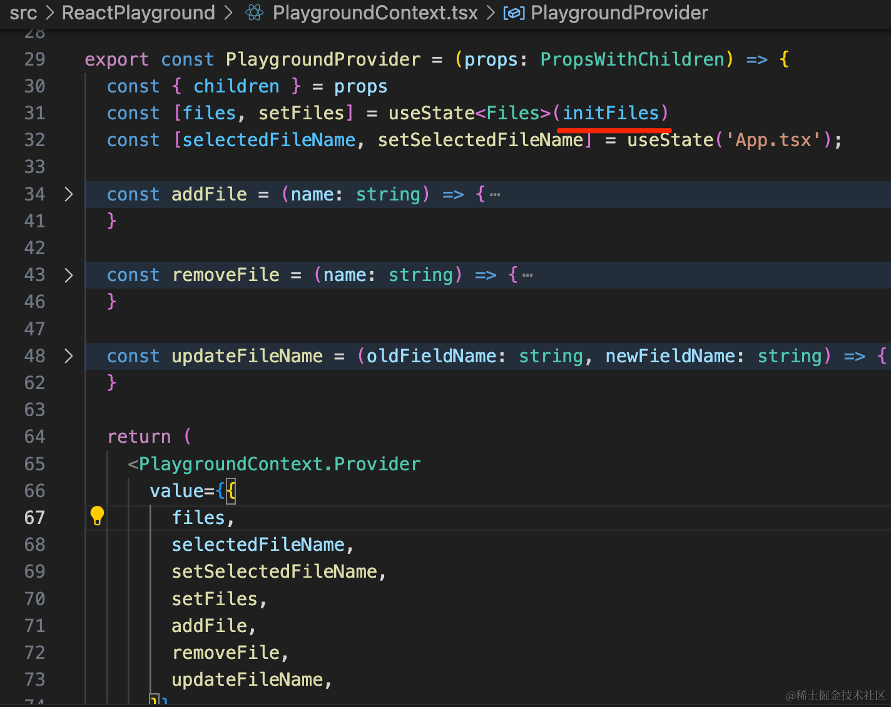

看下效果：

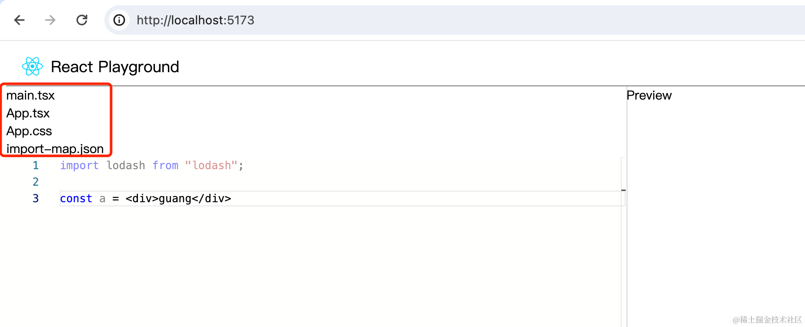

上面的 tab 展示出来了，下面的 editor 还没有展示对应的文件内容。

改一下：

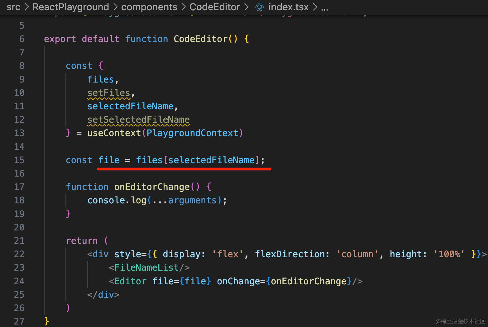

```javascript
const { 
    files, 
    setFiles, 
    selectedFileName, 
    setSelectedFileName
} = useContext(PlaygroundContext)

const file = files[selectedFileName];
```
换成从 context 读取的当前选中的 file 就好了。

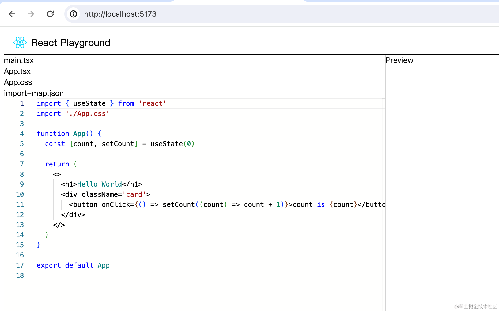

然后点击文件名的时候做下 selectedFileName 的切换：

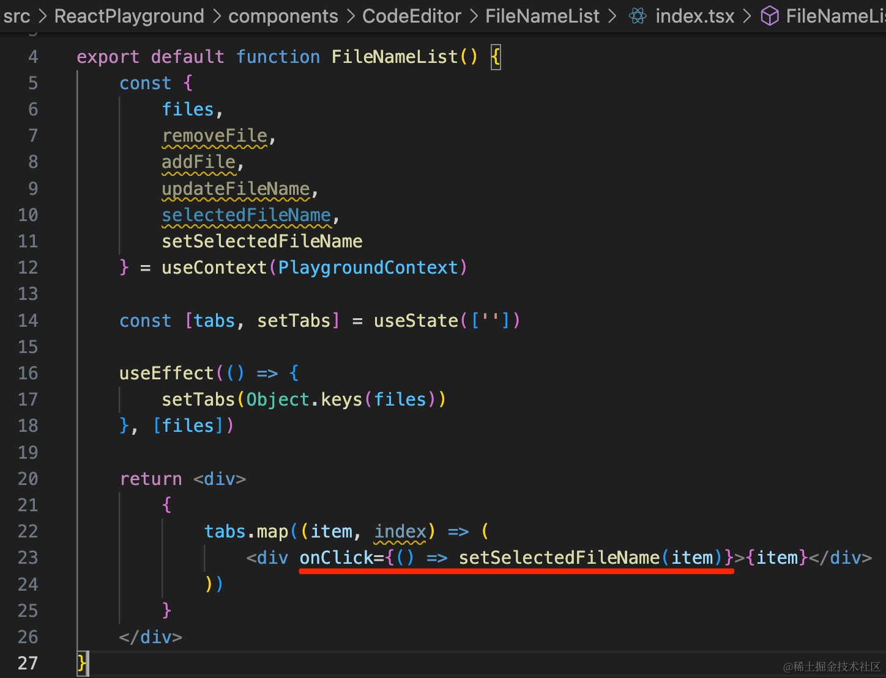


现在，点击 tab 就会切换编辑的文件，并且语法高亮也是对的。

接下来只要完善下样式就好了。


这部分还是挺复杂的，单独抽个 FileNameItem 组件。

```javascript
import classnames from 'classnames'
import React, { useState, useRef, useEffect } from 'react'

import styles from './index.module.scss'

export interface FileNameItemProps {
    value: string
    actived: boolean
    onClick: () => void
}

export const FileNameItem: React.FC<FileNameItemProps> = (props) => {
  const {
    value,
    actived = false,
    onClick,
  } = props

  const [name, setName] = useState(value)
 
  return (
    <div
      className={classnames(styles['tab-item'], actived ? styles.actived : null)}
      onClick={onClick}
    >
        <span>{name}</span>
    </div>
  )
}
```
传入 value、actived、onClick 参数。

如果是 actived 也就是选中的，就加上 actived 的 className。

安装用到的包：

```
npm install --save classnames
```

这里用了 css modules 来做 css 模块化。

写下 index.module.scss
```css
.tabs {
    display: flex;
    align-items: center;

    height: 38px;
    overflow-x: auto;
    overflow-y: hidden;
    border-bottom: 1px solid #ddd;
    box-sizing: border-box;

    color: #444;
    background-color: #fff;

    .tab-item {
        display: inline-flex;
        padding: 8px 10px 6px;
        font-size: 13px;
        line-height: 20px;
        cursor: pointer;
        align-items: center;
        border-bottom: 3px solid transparent;

        &.actived {
            color: skyblue;
            border-bottom: 3px solid skyblue;
        }

        &:first-child {
            cursor: text;
        }
    }
}
```
分别写下整体 .tabs 的样式，.tab-item 的样式。

这部分就是用 flex 布局，然后设置 tab-item 的 padding 即可。

但是 tab-item 可能很多，所以 overflw-x 设置为 auto，也就是会有滚动条。

在 CodeEditor 里引入下 FileNameItem 组件，并加上 tabs 的 className：

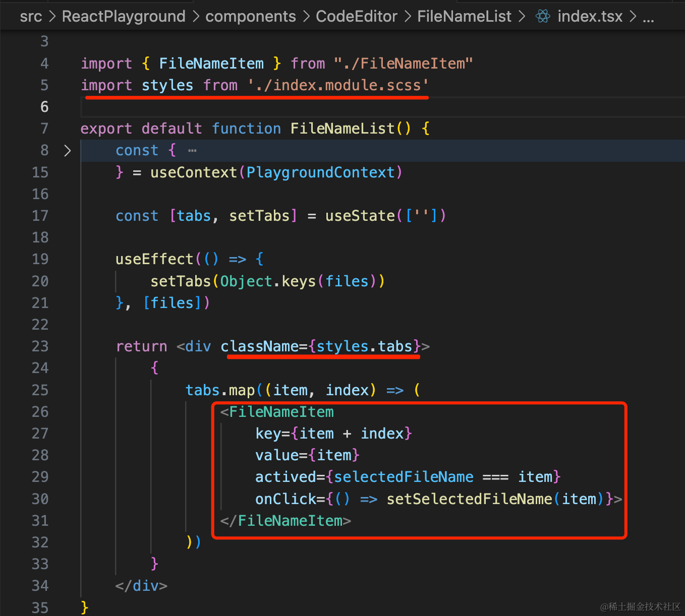

```javascript
import { useContext, useEffect, useState } from "react"
import { PlaygroundContext } from "../../../PlaygroundContext"

import { FileNameItem } from "./FileNameItem"
import styles from './index.module.scss'

export default function FileNameList() {
    const { 
        files, 
        removeFile, 
        addFile, 
        updateFileName, 
        selectedFileName,
        setSelectedFileName
    } = useContext(PlaygroundContext)

    const [tabs, setTabs] = useState([''])

    useEffect(() => {
        setTabs(Object.keys(files))
    }, [files])

    return <div className={styles.tabs}>
        {
            tabs.map((item, index) => (
                <FileNameItem 
                    key={item + index}  
                    value={item} 
                    actived={selectedFileName === item} 
                    onClick={() => setSelectedFileName(item)}>
                </FileNameItem>
            ))
        }
    </div>
}
```
selectedFileName 对应的 item 的 actived 为 true。

看下效果：


好看多了。

在 initFiles 里多加点文件，我们测试下滚动条：

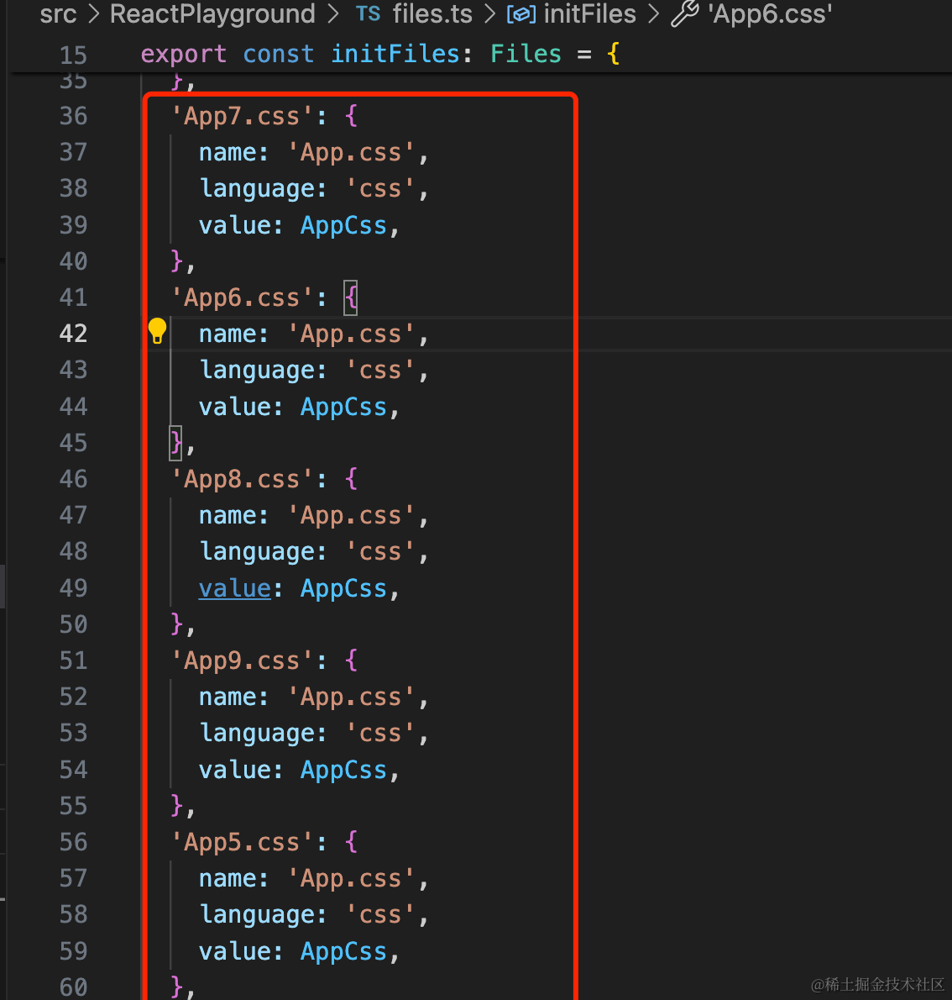

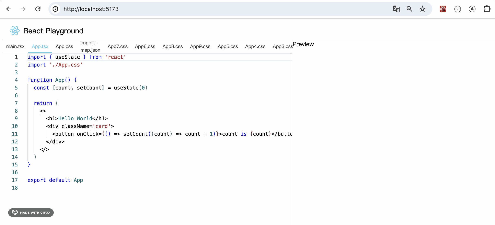

确实有滚动条，就是有点丑。

改下滚动条样式：

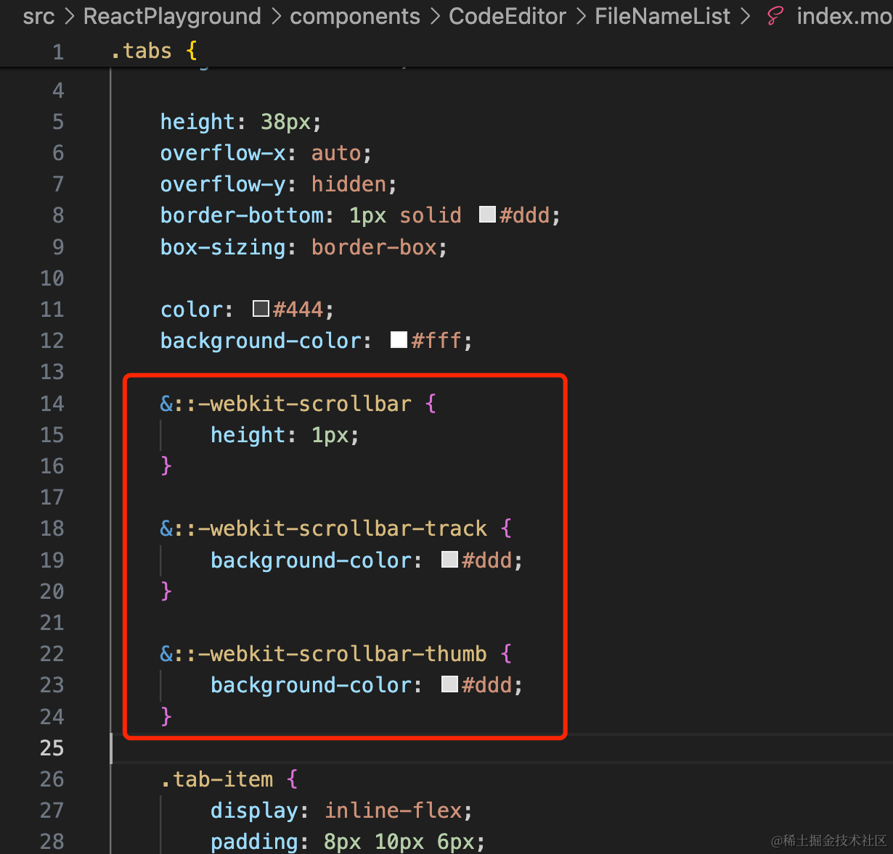

```css
&::-webkit-scrollbar {
    height: 1px;
}

&::-webkit-scrollbar-track {
    background-color: #ddd;
}

&::-webkit-scrollbar-thumb {
    background-color: #ddd;
}
```

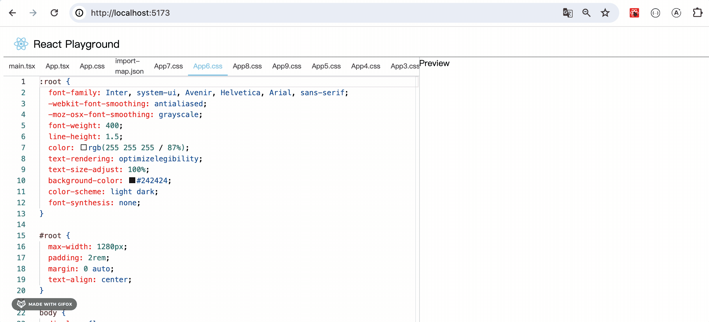

现在滚动条就不明显了。

我们现在并没有在编辑的时候修改 context 的 files 内容，所以切换 tab 又会变回去：


只要在编辑器内容改变的时候修改下 files 就好了：

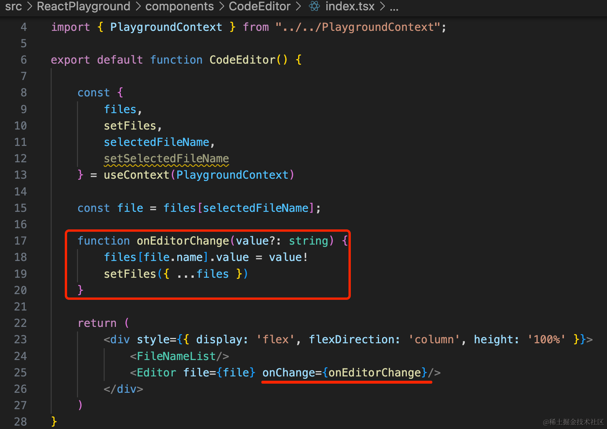

```javascript
function onEditorChange(value?: string) {
    files[file.name].value = value!
    setFiles({ ...files })
}
```


没啥问题。

不过编辑是个频繁触发的事件，我们最好加一下防抖：

```
npm install --save lodash-es
npm install --save-dev @types/lodash-es
```
安装 lodash，然后调用下 debounce：

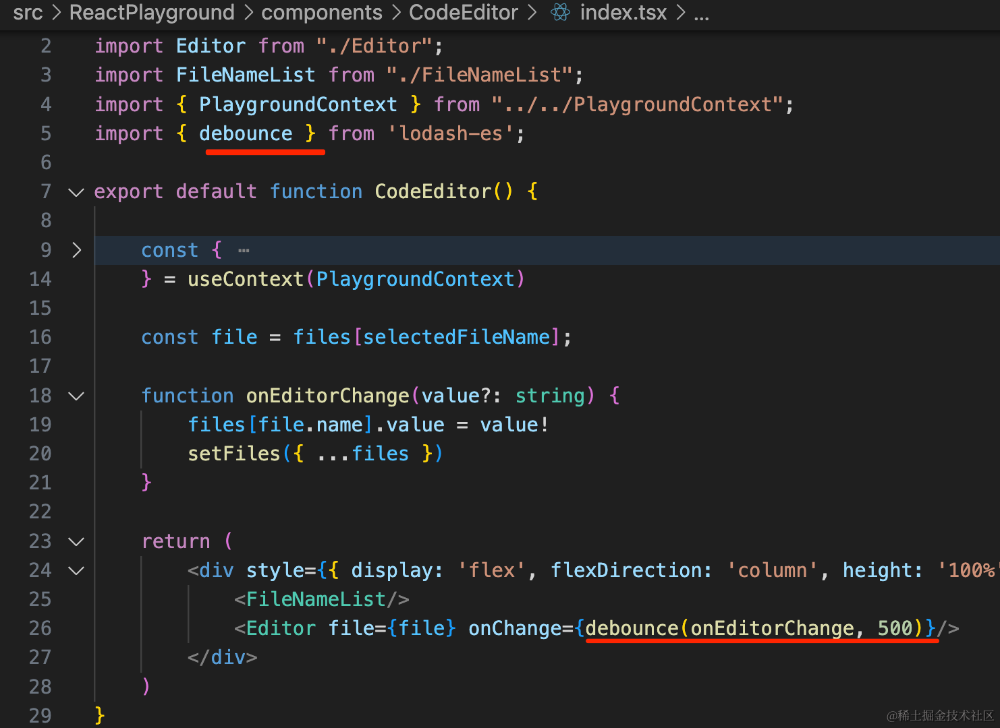


这样性能好一点。

案例代码上传了[小册仓库](https://github.com/QuarkGluonPlasma/react-course-code/tree/main/react-playground-project)，可以切换到这个 commit 查看：

```
git reset --hard 4621920c63b265b1c69865adbaabbba7babe66da
```

## 总结

这节我们实现了多文件的切换。

在 Context 中保存全局数据，比如 files、selectedFileName，还有对应的增删改的方法。

对 Context.Provider 封装了一层来注入初始化数据和方法，提供了 initFiles 的信息。

然后在 FileNameList 里读取 context 里的 files 来渲染文件列表。

点击 tab 的时候切换 selectedFileName，从而切换编辑器的内容。

这样，多文件的切换和编辑就完成了。
