# 第56章—ReactPlayground项目实战：babel编译、iframe预览

我们实现了多文件的切换、文件内容编辑：

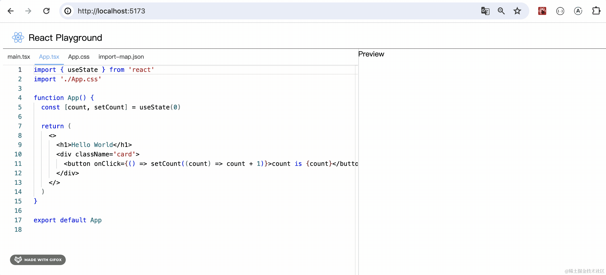

左边部分可以告一段落。

这节我们开始写右边部分，也就是文件的编译，还有 iframe 预览。

编译前面讲过，用 @babel/standalone 这个包。

安装下：

```
npm install --save @babel/standalone

npm install --save-dev @types/babel__standalone
```

在 Preview 目录下新建 compiler.ts

```javascript
import { transform } from '@babel/standalone'
import { Files } from '../../PlaygroundContext'
import { ENTRY_FILE_NAME } from '../../files'

export const babelTransform = (filename: string, code: string, files: Files) => {
  let result = ''
  try {
    result = transform(code, {
      presets: ['react', 'typescript'],
      filename,
      plugins: [],
      retainLines: true
    }).code!
  } catch (e) {
    console.error('编译出错', e);
  }
  return result
}

export const compile = (files: Files) => {
  const main = files[ENTRY_FILE_NAME]
  return babelTransform(ENTRY_FILE_NAME, main.value, files)
}
```
调用 babel 的 transform 方法进行编译。

presets 指定 react 和 typescript，也就是对 jsx 和 ts 语法做处理。

retainLines 是编译后保持原有行列号不变。

在 compile 方法里，对 main.tsx 的内容做编译，返回编译后的代码。

在 Preview 组件里调用下：

```javascript
import { useContext, useEffect, useState } from "react"
import { PlaygroundContext } from "../../PlaygroundContext"
import Editor from "../CodeEditor/Editor";
import { compile } from "./compiler";

export default function Preview() {

    const { files} = useContext(PlaygroundContext)
    const [compiledCode, setCompiledCode] = useState('')

    useEffect(() => {
        const res = compile(files);
        setCompiledCode(res);
    }, [files]);

    return <div style={{height: '100%'}}>
        <Editor file={{
            name: 'dist.js',
            value: compiledCode,
            language: 'javascript'
        }}/>
    </div>
}
```
在 files 变化的时候，对 main.tsx 内容做编译，然后展示编译后的代码。

看下效果：


可以看到，右边展示了编译后的代码，并且左边编辑的时候，右边会实时展示编译的结果。

这样编译后的代码能直接放到 iframe 里跑么？

明显不能，我们只编译了 main.tsx，它引入的模块没有做处理。

前面讲过，可以通过 babel 插件来处理 import 语句，转换成 blob url 的方式。

我们来写下这个插件：

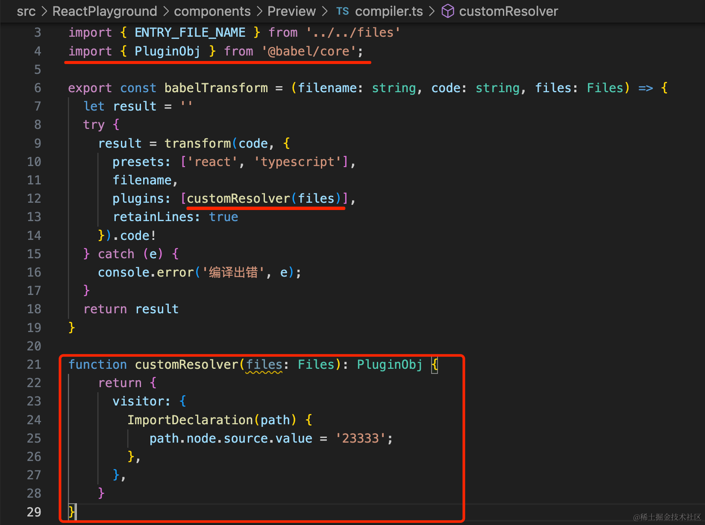

```javascript
function customResolver(files: Files): PluginObj {
    return {
      visitor: {
        ImportDeclaration(path) {
           path.node.source.value = '23333';
        },
      },
    }
}
```
babel 的编译流程分为 parse、transform、generate 三个阶段：

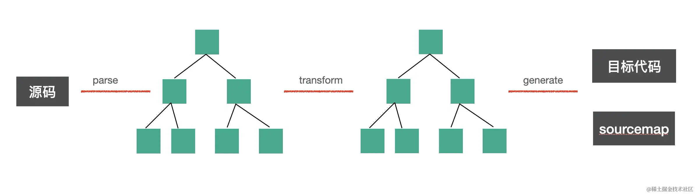

通过 [astexplorer.net](https://astexplorer.net/#/gist/6f01ee950445813f623214fb2c7abba9/b45fffd5a735f829d15098efa4f860438c3a070e) 看下对应的 AST：

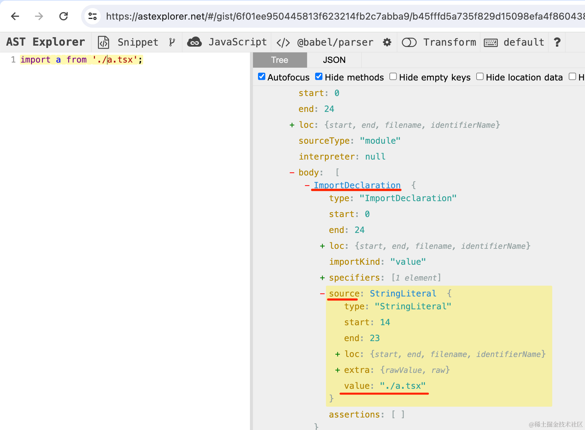

我们要改的就是 ImportDeclaration 节点的 source.value 的内容。

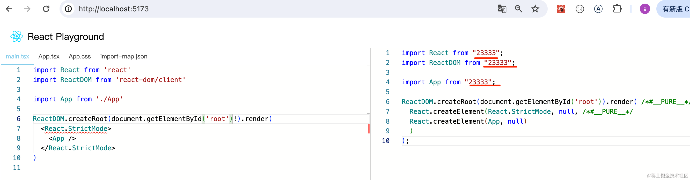

可以看到，确实被替换了。

那替换成什么样还不是我们说了算。

我们分别对 css、json 还有 tsx、ts 等后缀名的 import 做下替换：

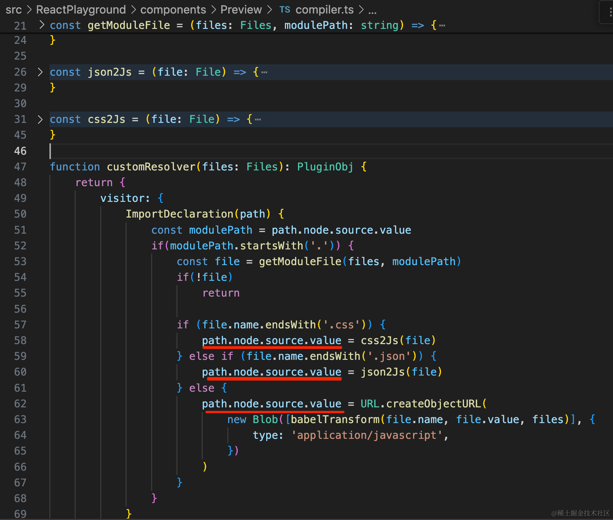

首先，我们要对路径做下处理，比如 ./App.css 这种路径提取出 App.css 部分

万一输入的是 ./App 这种路径，也要能查找到对应的 App.tsx 模块：

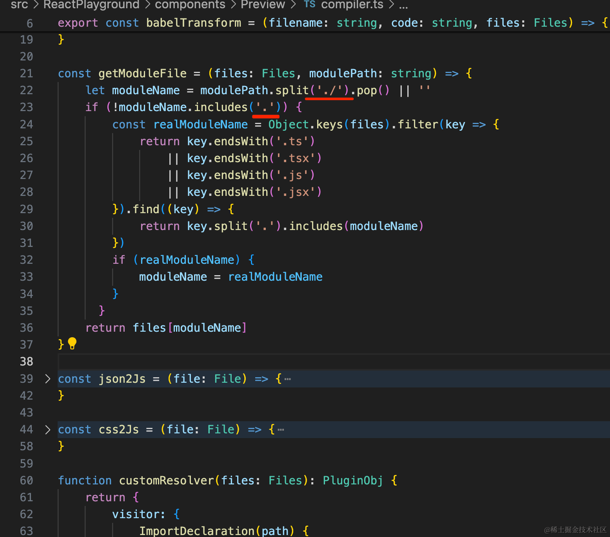

如果去掉 ./ 之后，剩下的不包含 . 比如 ./App 这种，那就要补全 App 为 App.tsx 等。

过滤下 files 里的 js、jsx、ts、tsx 文件，如果包含这个名字的模块，那就按照补全后的模块名来查找 file。

之后把 file.value 也就是文件内容转成对应的 blob url：


ts 文件的处理就是用 babel 编译下，然后用 URL.createObjectURL 把编译后的文件内容作为 url。

而 css 和 json 文件则是要再做一下处理：

json 文件的处理比较简单，就是把 export 一下这个 json，然后作为 blob url 即可：

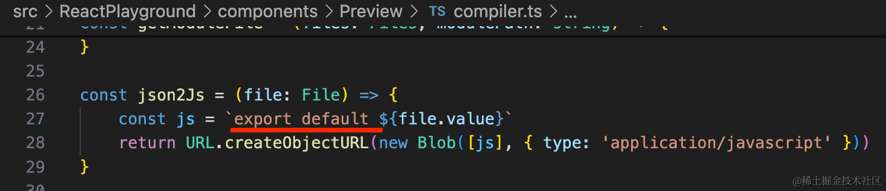

而 css 文件，则是要通过 js 代码把它添加到 head 里的 style 标签里：

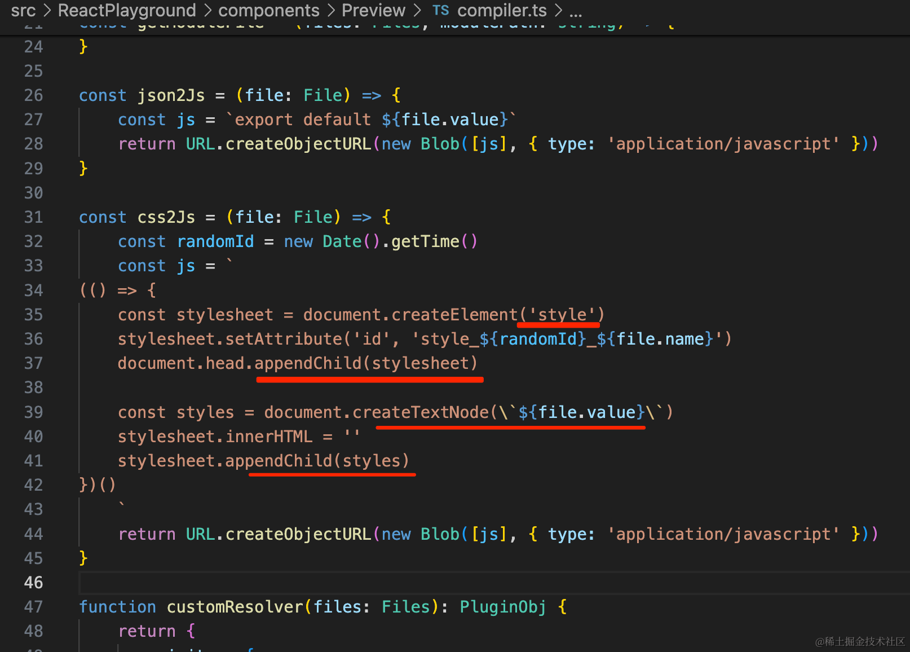

全部代码如下：

```javascript
import { transform } from '@babel/standalone'
import { File, Files } from '../../PlaygroundContext'
import { ENTRY_FILE_NAME } from '../../files'
import { PluginObj } from '@babel/core';

export const babelTransform = (filename: string, code: string, files: Files) => {
  let result = ''
  try {
    result = transform(code, {
      presets: ['react', 'typescript'],
      filename,
      plugins: [customResolver(files)],
      retainLines: true
    }).code!
  } catch (e) {
    console.error('编译出错', e);
  }
  return result
}

const getModuleFile = (files: Files, modulePath: string) => {
    let moduleName = modulePath.split('./').pop() || ''
    if (!moduleName.includes('.')) {
        const realModuleName = Object.keys(files).filter(key => {
            return key.endsWith('.ts') 
                || key.endsWith('.tsx') 
                || key.endsWith('.js')
                || key.endsWith('.jsx')
        }).find((key) => {
            return key.split('.').includes(moduleName)
        })
        if (realModuleName) {
            moduleName = realModuleName
        }
      }
    return files[moduleName]
}

const json2Js = (file: File) => {
    const js = `export default ${file.value}`
    return URL.createObjectURL(new Blob([js], { type: 'application/javascript' }))
}

const css2Js = (file: File) => {
    const randomId = new Date().getTime()
    const js = `
(() => {
    const stylesheet = document.createElement('style')
    stylesheet.setAttribute('id', 'style_${randomId}_${file.name}')
    document.head.appendChild(stylesheet)

    const styles = document.createTextNode(\`${file.value}\`)
    stylesheet.innerHTML = ''
    stylesheet.appendChild(styles)
})()
    `
    return URL.createObjectURL(new Blob([js], { type: 'application/javascript' }))
}

function customResolver(files: Files): PluginObj {
    return {
        visitor: {
            ImportDeclaration(path) {
                const modulePath = path.node.source.value
                if(modulePath.startsWith('.')) {
                    const file = getModuleFile(files, modulePath)
                    if(!file) 
                        return

                    if (file.name.endsWith('.css')) {
                        path.node.source.value = css2Js(file)
                    } else if (file.name.endsWith('.json')) {
                        path.node.source.value = json2Js(file)
                    } else {
                        path.node.source.value = URL.createObjectURL(
                            new Blob([babelTransform(file.name, file.value, files)], {
                                type: 'application/javascript',
                            })
                        )
                    }
                }
            }
        }
    }
}

export const compile = (files: Files) => {
  const main = files[ENTRY_FILE_NAME]
  return babelTransform(ENTRY_FILE_NAME, main.value, files)
}
```
看下效果：

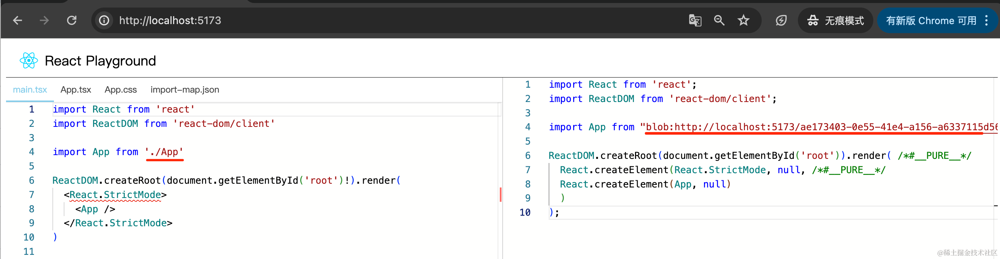

可以看到，./App 的模块内容编译之后变为了 blob url。

我们引入 ./App.css 试下：

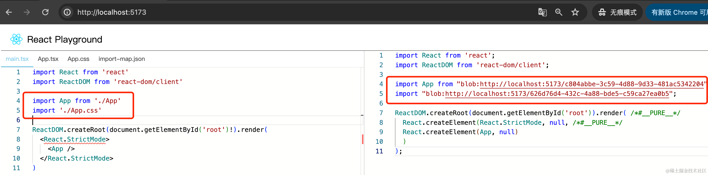

可以看到，css 模块也变为了 blob url。

我们在 devtools 里 fetch 下 blob url 可以看到它的内容：

```javascript
fetch("blob:http://localhost:5173/xxxx")
  .then(response => response.text())
  .then(text => {
    console.log(text);
  });
```
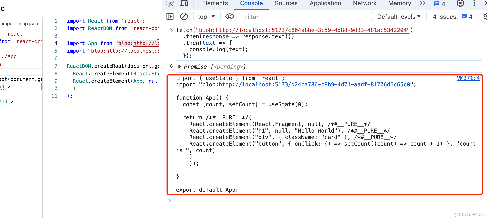

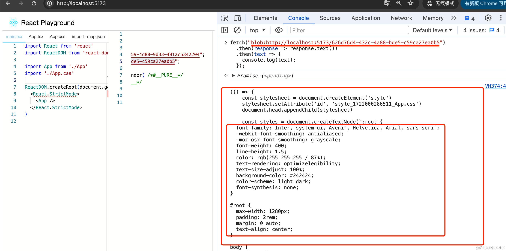

可以看到，./App.tsx 的内容是 babel 编译过后的。

./App.css 的内容也是我们做的转换。

而上面的 react、react-dom/client 的包是通过 import maps 引入：

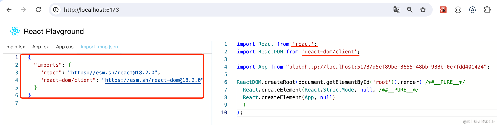

其实还有一个问题要处理：

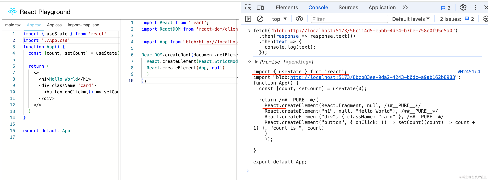

比如 App.tsx 的 jsx 内容编译后变成了 React.createElement，但是我们并没有引入 React，这样运行会报错。

处理下：

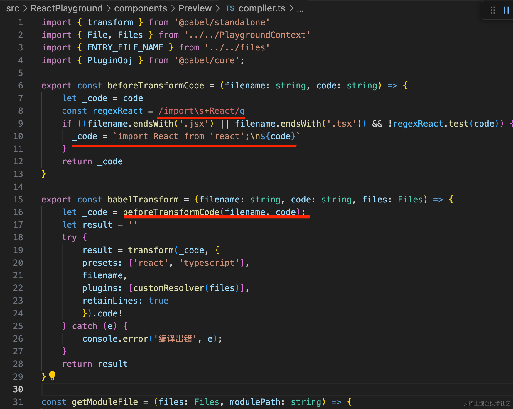

babel 编译之前，判断下文件内容有没有 import React，没有就 import 一下：

```javascript
export const beforeTransformCode = (filename: string, code: string) => {
    let _code = code
    const regexReact = /import\s+React/g
    if ((filename.endsWith('.jsx') || filename.endsWith('.tsx')) && !regexReact.test(code)) {
      _code = `import React from 'react';\n${code}`
    }
    return _code
}

export const babelTransform = (filename: string, code: string, files: Files) => {
    let _code = beforeTransformCode(filename, code);
    let result = ''
    try {
        result = transform(_code, {
        presets: ['react', 'typescript'],
        filename,
        plugins: [customResolver(files)],
        retainLines: true
        }).code!
    } catch (e) {
        console.error('编译出错', e);
    }
    return result
}

```

现在，如果没引入 React 就会自动引入：

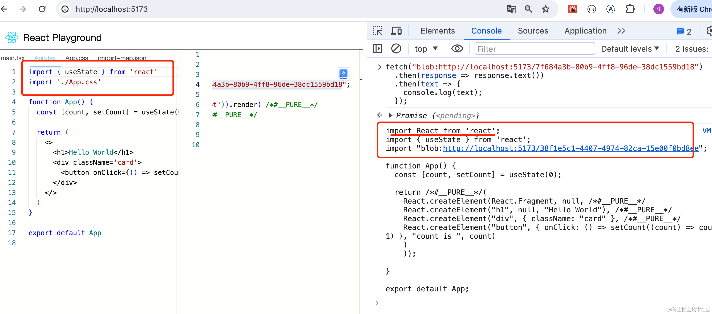

至此， main.tsx 的所有依赖都引入了：

- react、react-dom/client 的包通过 import maps 引入
- ./App.tsx、./App.css 或者 xx.json 之类的依赖通过 blob url 引入

这样，编译过后的这段代码就可以直接在浏览器里跑了：

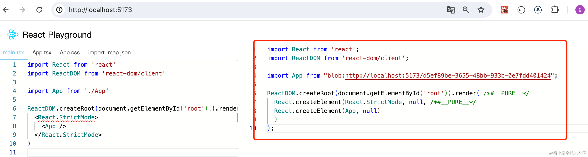

我们加个 iframe 来跑下：

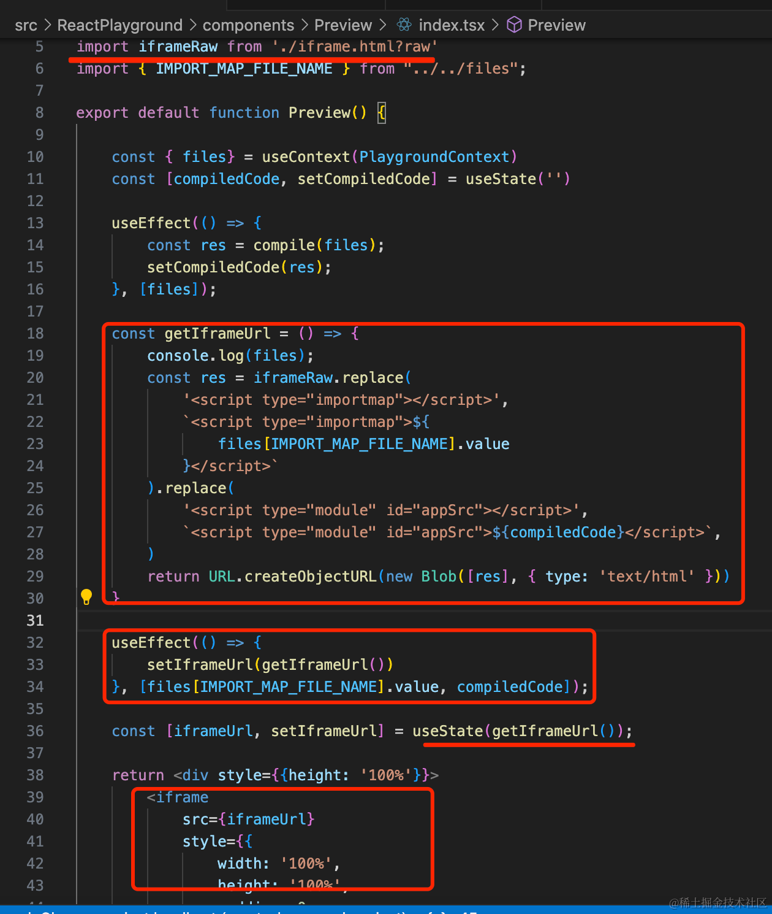

加一个 iframe 标签，src url 同样是用 blob url 的方式。

用 ?raw 的 import 引入 iframe.html的文件内容：

```html
<!doctype html>
<html lang="en">
<head>
  <meta charset="UTF-8"/>
  <meta name="viewport" content="width=device-width, initial-scale=1.0"/>
  <title>Preview</title>
</head>
<body>
<script type="importmap"></script>
<script type="module" id="appSrc"></script>
<div id="root"></div>
</body>
</html>
```
替换其中的 import maps 和 src 的内容。

之后创建 blob url 设置到 iframe 的 src。

当 import maps 的内容或者 compiledCode 的内容变化的时候，就重新生成 blob url。

```javascript
import { useContext, useEffect, useState } from "react"
import { PlaygroundContext } from "../../PlaygroundContext"
import Editor from "../CodeEditor/Editor";
import { compile } from "./compiler";
import iframeRaw from './iframe.html?raw'
import { IMPORT_MAP_FILE_NAME } from "../../files";

export default function Preview() {

    const { files} = useContext(PlaygroundContext)
    const [compiledCode, setCompiledCode] = useState('')
    const [iframeUrl, setIframeUrl] = useState(getIframeUrl());

    useEffect(() => {
        const res = compile(files);
        setCompiledCode(res);
    }, [files]);

    const getIframeUrl = () => {
        const res = iframeRaw.replace(
            '<script type="importmap"></script>', 
            `<script type="importmap">${
                files[IMPORT_MAP_FILE_NAME].value
            }</script>`
        ).replace(
            '<script type="module" id="appSrc"></script>',
            `<script type="module" id="appSrc">${compiledCode}</script>`,
        )
        return URL.createObjectURL(new Blob([res], { type: 'text/html' }))
    }

    useEffect(() => {
        setIframeUrl(getIframeUrl())
    }, [files[IMPORT_MAP_FILE_NAME].value, compiledCode]);

    return <div style={{height: '100%'}}>
        <iframe
            src={iframeUrl}
            style={{
                width: '100%',
                height: '100%',
                padding: 0,
                border: 'none',
            }}
        />
        {/* <Editor file={{
            name: 'dist.js',
            value: compiledCode,
            language: 'javascript'
        }}/> */}
    </div>
}
```

看下效果：


看下 iframe 的内容：

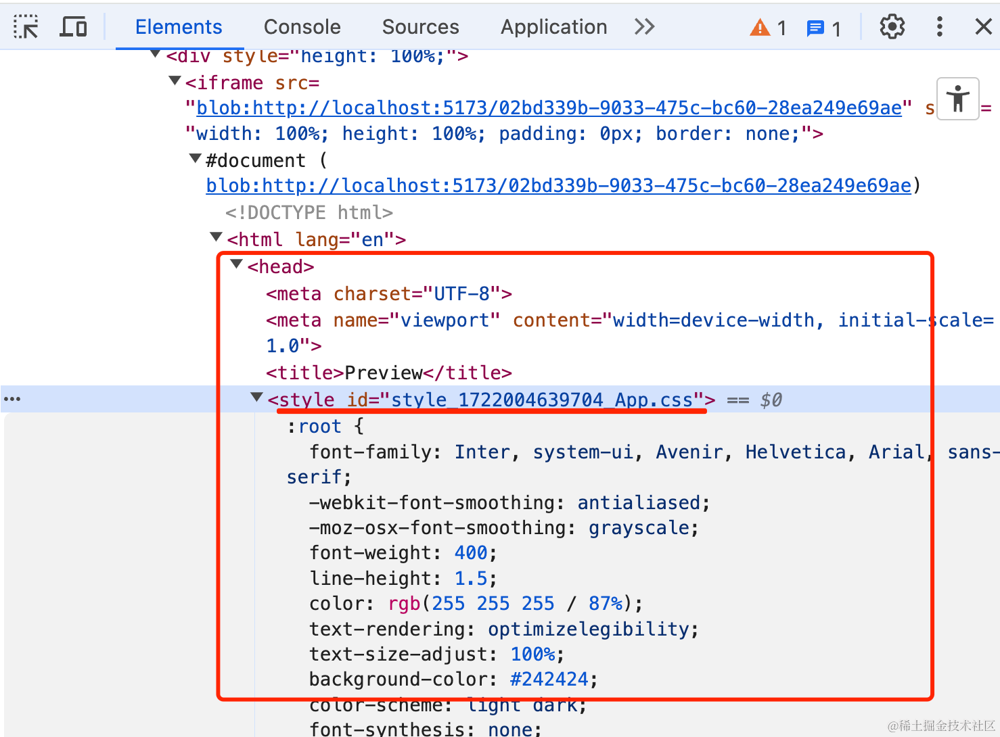

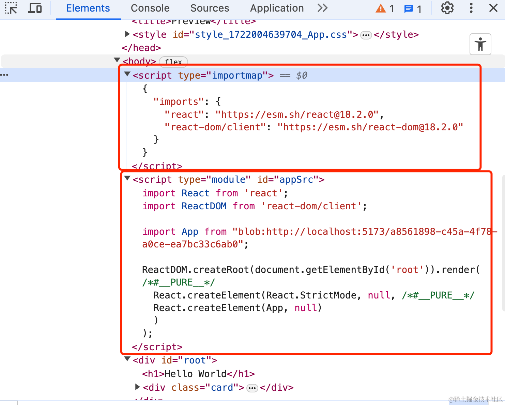

没啥问题。

预览功能完成！

案例代码上传了[小册仓库](https://github.com/QuarkGluonPlasma/react-course-code/tree/main/react-playground-project)，可以切换到这个 commit 查看：

```
git reset --hard a02195cfa12948e969bb9dc9cf01cdbe79331ab4
```

## 总结

前面章节实现了代码编辑，这节我们实现了编译以及在 iframe 里预览。

使用 @babel/standalone 做的 tsx 代码的编译，编译过程中需要对 .tsx、.css、.json 等模块的 import 做处理，变成 blob url 的方式。

tsx 模块直接用 babel 编译，css 模块包一层代码加到 head 的 style 标签里，json 包一层代码直接 export 即可。

对于 react、react-dom/client 这种，用浏览器的 import maps 来引入。

之后把 iframe.html 的内容替换 import maps 和 src 部分后，同样用 blob url 设置为 iframe 的 src 就可以了。

这样就能实现浏览器里的编译和预览。