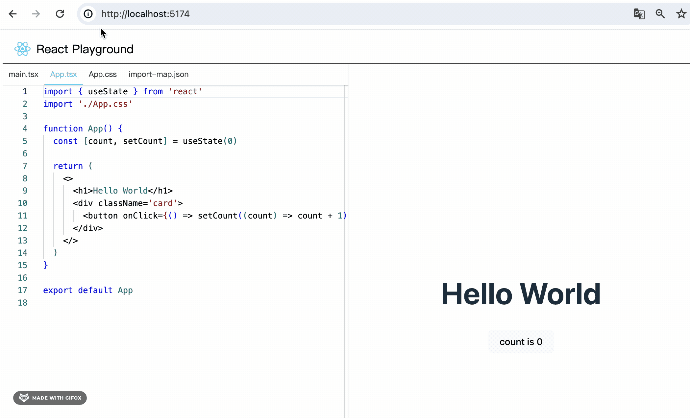
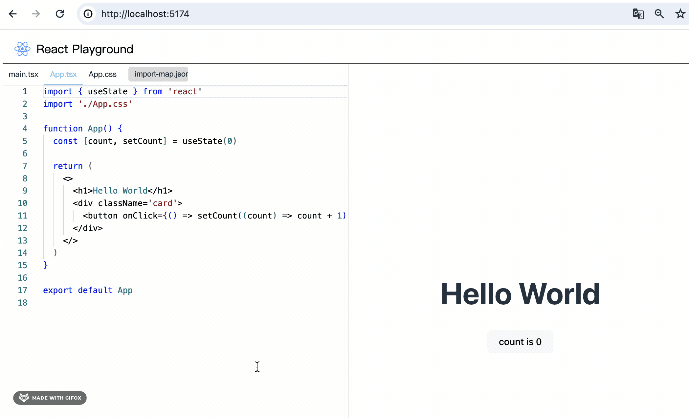
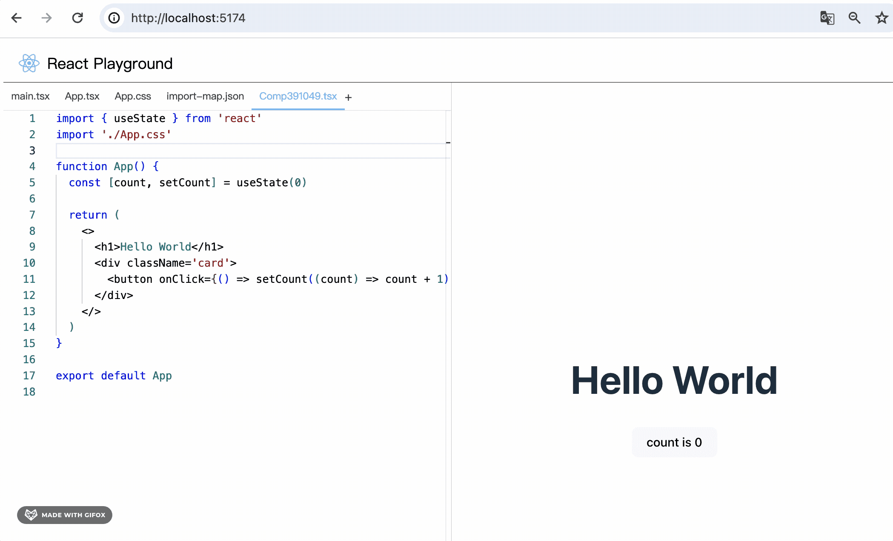

# 第57章—ReactPlayground项目实战：文件增删改

我们实现了多个文件的编辑、编译、预览，整体流程已经跑通了。


但是文件的新增、删除、文件名修改还没做：


这节来实现下。

改下 FileNameItem：


创建一个 editing 的 state 来记录编辑状态，然后用 ref 来保存 input 的引用。

双击文件名的时候，切换到编辑状态，然后聚焦输入框。

```javascript
import classnames from 'classnames'
import React, { useState, useRef, useEffect } from 'react'

import styles from './index.module.scss'

export interface FileNameItemProps {
    value: string
    actived: boolean
    onClick: () => void
}

export const FileNameItem: React.FC<FileNameItemProps> = (props) => {
  const {
    value,
    actived = false,
    onClick,
  } = props

  const [name, setName] = useState(value);
  const [editing, setEditing] = useState(false)
  const inputRef = useRef<HTMLInputElement>(null)

  const handleDoubleClick = () => {
    setEditing(true)
    setTimeout(() => {
      inputRef?.current?.focus()
    }, 0)
  }

  return (
    <div
      className={classnames(styles['tab-item'], actived ? styles.actived : null)}
      onClick={onClick}
    >
        {
            editing ? (
                <input
                    ref={inputRef}
                    className={styles['tabs-item-input']}
                    value={name}
                    onChange={(e) => setName(e.target.value)}
                />
            ) : (
                <span onDoubleClick={handleDoubleClick}>{name}</span>
            )
        }
    </div>
  )
}
```
试下效果：


然后 blur 的时候，切换为非编辑状态：


```javascript
const hanldeInputBlur = () => {
    setEditing(false);
}
```


当然，这里应该去修改 files 里的文件名。

我们在 FileNameList 组件里做这个，这里加一个回调函数：


然后在 FileNameList 组件传入：


修改文件名，并切换 selectedFileName 为新的文件名。

```javascript
import { useContext, useEffect, useState } from "react"
import { PlaygroundContext } from "../../../PlaygroundContext"

import { FileNameItem } from "./FileNameItem"
import styles from './index.module.scss'

export default function FileNameList() {
    const { 
        files, 
        removeFile, 
        addFile, 
        updateFileName, 
        selectedFileName,
        setSelectedFileName
    } = useContext(PlaygroundContext)

    const [tabs, setTabs] = useState([''])

    useEffect(() => {
        setTabs(Object.keys(files))
    }, [files])

    const handleEditComplete = (name: string, prevName: string) => {
        updateFileName(prevName, name);
        setSelectedFileName(name);
    }

    return <div className={styles.tabs}>
        {
            tabs.map((item, index) => (
                <FileNameItem 
                    key={item + index}  
                    value={item} 
                    actived={selectedFileName === item} 
                    onClick={() => setSelectedFileName(item)}
                    onEditComplete={(name: string) => handleEditComplete(name, item)}
                >
                </FileNameItem>
            ))
        }
    </div>
}
```
之前我们在 context.Provider 里注入了这个方法：


它会在 files 里查找旧的 file 信息，去掉后换成新的。


可以看到，修改完之后文件跑后面去了，这个是因为我们插入新 file 的时候就是往后面插入的。

然后修改完右面白屏了，打开 devtools 可以看到报错：


因为 App.tsx 文件改名了，那 main.tsx 里引用的路径也得改下：


这样，修改文件名的功能就完成了。

我们再来写下样式:


```css
.tabs-item-input {
    width: 90px;
    padding: 4px 0 4px 10px;
    font-size: 13px;

    color: #444;
    background-color: #ddd;
    border: 1px solid #ddd;
    border-radius: 4px;
    outline: none;
}
```
就是设置下 width、padding、背景色、border 就好了。



好看多了。

接下来实现下新增 file 功能：

新增其实和修改差不多，完全可以复用之前的逻辑。

我们加一个 creating 参数：


这样就可以由父组件来控制哪个 tab 是编辑状态。

props.creating 为 true 的时候让 input 聚焦

```javascript
useEffect(() => {
    if(creating) {
        inputRef?.current?.focus()
    }
}, [creating]);
```

比如我们让最后一个 tab 是编辑状态：


可以看到，现在不用双击也是编辑文件名的状态：



我们添加一个 + 按钮


创建一个 creating 的 state 来保存创建状态。

点击 + 按钮的时候进入创建状态，添加一个 file，文件名随机，然后把最后一个 tab 变为编辑状态。

编辑完把 creating 变为 false。

```javascript
import { useContext, useEffect, useState } from "react"
import { PlaygroundContext } from "../../../PlaygroundContext"

import { FileNameItem } from "./FileNameItem"
import styles from './index.module.scss'

export default function FileNameList() {
    const { 
        files, 
        removeFile, 
        addFile, 
        updateFileName, 
        selectedFileName,
        setSelectedFileName
    } = useContext(PlaygroundContext)

    const [tabs, setTabs] = useState([''])

    useEffect(() => {
        setTabs(Object.keys(files))
    }, [files])

    const handleEditComplete = (name: string, prevName: string) => {
        updateFileName(prevName, name);
        setSelectedFileName(name);

        setCreating(false);
    }

    const [creating, setCreating] = useState(false);

    const addTab = () => {
        const newFileName = 'Comp' + Math.random().toString().slice(2,8) + '.tsx';
        addFile(newFileName);
        setSelectedFileName(newFileName);
        setCreating(true)
    }

    return <div className={styles.tabs}>
        {
            tabs.map((item, index, arr) => (
                <FileNameItem 
                    key={item + index}  
                    value={item} 
                    creating={creating && index === arr.length - 1}
                    actived={selectedFileName === item} 
                    onClick={() => setSelectedFileName(item)}
                    onEditComplete={(name: string) => handleEditComplete(name, item)}
                >
                </FileNameItem>
            ))
        }
        <div className={styles.add} onClick={addTab}>
            +
        </div>
    </div>
}
```


没啥问题。

而且 tsx、css 等语法都能正确的高亮和提示：




因为我们 addFile 的时候已经做了处理：


最后还剩下个删除，这个比较简单。

在 FileNameItem 组件，文件名的右边用 svg 画一个 x


点击的时候回调 onRemove 参数

```javascript
import classnames from 'classnames'
import React, { useState, useRef, useEffect } from 'react'

import styles from './index.module.scss'

export interface FileNameItemProps {
    value: string
    actived: boolean
    creating: boolean
    onEditComplete: (name: string) => void
    onRemove: MouseEventHandler
    onClick: () => void
}

export const FileNameItem: React.FC<FileNameItemProps> = (props) => {
  const {
    value,
    actived = false,
    creating,
    onClick,
    onRemove,
    onEditComplete,
  } = props

  const [name, setName] = useState(value);
  const [editing, setEditing] = useState(creating)
  const inputRef = useRef<HTMLInputElement>(null)

  const handleDoubleClick = () => {
    setEditing(true)
    setTimeout(() => {
      inputRef?.current?.focus()
    }, 0)
  }

  useEffect(() => {
    if(creating) {
        inputRef?.current?.focus()
    }
  }, [creating]);

  const hanldeInputBlur = () => {
    setEditing(false);
    onEditComplete(name);
  }

  return (
    <div
      className={classnames(styles['tab-item'], actived ? styles.actived : null)}
      onClick={onClick}
    >
        {
            editing ? (
                <input
                    ref={inputRef}
                    className={styles['tabs-item-input']}
                    value={name}
                    onBlur={hanldeInputBlur}
                    onChange={(e) => setName(e.target.value)}
                />
            ) : (
                <>
                    <span onDoubleClick={handleDoubleClick}>{name}</span>
                    <span style={{ marginLeft: 5, display: 'flex' }} onClick={onRemove}>
                        <svg width='12' height='12' viewBox='0 0 24 24'>
                            <line stroke='#999' x1='18' y1='6' x2='6' y2='18'></line>
                            <line stroke='#999' x1='6' y1='6' x2='18' y2='18'></line>
                        </svg>
                    </span>
                </>
            )
        }
    </div>
  )
}
```
在 FileNameList 组件里处理下：


删除文件，并且把选中的文件名换成 main.tsx

注意，这里要阻止事件冒泡，不然会触发 item 的点击事件，切换 tab 到已经删除的文件。

```javascript
onRemove={(e) => {
    e.stopPropagation();
    handleRemove(item)
}}
```

```javascript
const handleRemove = (name: string) => {
    removeFile(name)
    setSelectedFileName(ENTRY_FILE_NAME)
}
```


没啥问题。

这里 main.tsx 是不能被删除的，它是入口模块。

import-map.json 也是不能删除。

我们加一个 readonly 参数：


非 readonly 状态才展示删除按钮。

同理，也是非 readonly 状态才可以双击编辑：


```javascript
import classnames from 'classnames'
import React, { useState, useRef, useEffect, MouseEventHandler } from 'react'

import styles from './index.module.scss'

export interface FileNameItemProps {
    value: string
    actived: boolean
    creating: boolean
    readonly: boolean
    onEditComplete: (name: string) => void
    onRemove: MouseEventHandler
    onClick: () => void
}

export const FileNameItem: React.FC<FileNameItemProps> = (props) => {
  const {
    value,
    actived = false,
    readonly,
    creating,
    onClick,
    onRemove,
    onEditComplete,
  } = props

  const [name, setName] = useState(value);
  const [editing, setEditing] = useState(creating)
  const inputRef = useRef<HTMLInputElement>(null)

  const handleDoubleClick = () => {
    setEditing(true)
    setTimeout(() => {
      inputRef?.current?.focus()
    }, 0)
  }

  useEffect(() => {
    if(creating) {
        inputRef?.current?.focus()
    }
  }, [creating]);

  const hanldeInputBlur = () => {
    setEditing(false);
    onEditComplete(name);
  }

  return (
    <div
      className={classnames(styles['tab-item'], actived ? styles.actived : null)}
      onClick={onClick}
    >
        {
            editing ? (
                <input
                    ref={inputRef}
                    className={styles['tabs-item-input']}
                    value={name}
                    onBlur={hanldeInputBlur}
                    onChange={(e) => setName(e.target.value)}
                />
            ) : (
                <>
                    <span onDoubleClick={!readonly ? handleDoubleClick : () => {}}>{name}</span>
                    {
                        !readonly ? <span style={{ marginLeft: 5, display: 'flex' }} onClick={onRemove}>
                            <svg width='12' height='12' viewBox='0 0 24 24'>
                                <line stroke='#999' x1='18' y1='6' x2='6' y2='18'></line>
                                <line stroke='#999' x1='6' y1='6' x2='18' y2='18'></line>
                            </svg>
                        </span> : null
                    }
                </>
            )
        }
    </div>
  )
}
```
然后 main.tsx、App.tsx、import-map.json 我们就都设为 readonly 了：


```javascript
const readonlyFileNames = [ENTRY_FILE_NAME, IMPORT_MAP_FILE_NAME, APP_COMPONENT_FILE_NAME];
```
试下效果：


可以看到，除了这三个文件外，其余文件名都是可以编辑和删除的。

然后，我们给删除加一个二次确认。

这里用 antd 的 Popconfirm 组件吧。

```
npm install --save antd
```


```javascript
{
    !readonly ? (
        <Popconfirm
            title="确认删除该文件吗？"
            okText="确定"
            cancelText="取消"
            onConfirm={(e) => {
                e?.stopPropagation();
                onRemove();
            }}
        >
            <span style={{ marginLeft: 5, display: 'flex' }}>
                <svg width='12' height='12' viewBox='0 0 24 24'>
                    <line stroke='#999' x1='18' y1='6' x2='6' y2='18'></line>
                    <line stroke='#999' x1='6' y1='6' x2='18' y2='18'></line>
                </svg>
            </span>
        </Popconfirm>
    ) : null
}
```
e.stopPropagation 在这里调用，父组件那里就不需要了。


（其实之前我们调用 e.stopPropagation 的位置就不对，应该是组件内处理完 stopPropagation 后再调用回调函数，而不是在父组件里 stopPropagation）

测试下：


没啥问题。

至此，我们文件增删改的功能就都完成了。

和前面实现的编译预览串联测试下：

新建一个 Aaa.tsx 组件：


```javascript
import './Aaa.css';

function Aaa() {
 
  return (
    <>
      <h1 id="guang" onClick={() => alert(666)}>神说要有光</h1>
    </>
  )
}

export default Aaa
```
然后创建用到的 Aaa.css


```css
#guang {
    background: pink;
    font-size: 50px;
}
```
在 App.tsx 里引入下：


看下效果：


没啥问题。

和之前的编译、预览功能配合的很好。

案例代码上传了[小册仓库](https://github.com/QuarkGluonPlasma/react-course-code/tree/main/react-playground-project)，可以切换到这个 commit 查看：

```
git reset --hard 1674a8f0021a06dd54dfdc56386928544ce609e5
```

## 总结

这节我们实现了文件新增、修改、删除的功能。

主要是在 FileNameItem 组件里添加了 editing 的 state 来切换编辑状态，编辑状态下可以在 input 里修改名字，然后同步到 files 里。

并且还添加了 creating 的 props 来控制 editing 状态，新增的时候添加一个 file ，然后设置 creating 参数为 true 就可以了。

删除就是从 files 里把对应文件名删除，然后切换到 main.tsx。

这些都是基于 context 里的 api 来实现的。

main.tsx、App.tsx、import-map.json 设置为 readonly，不可编辑和删除。

这样，文件增删改功能就完成了，和之前的编译、预览功能可以很好的配合。