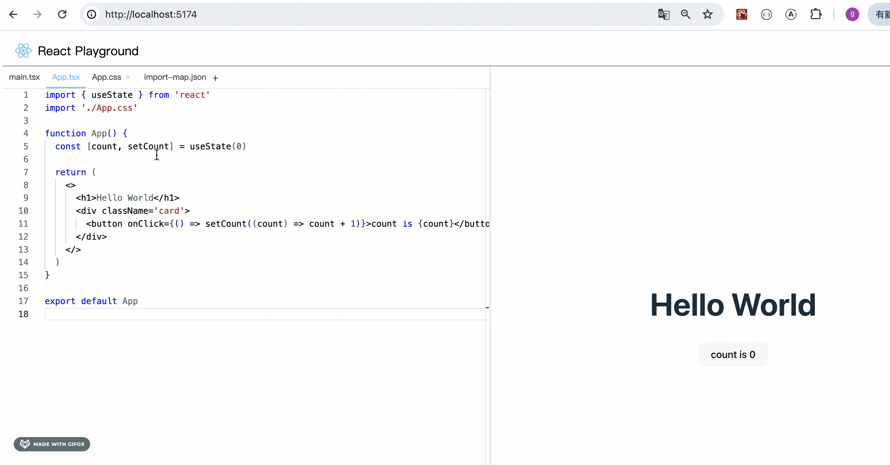
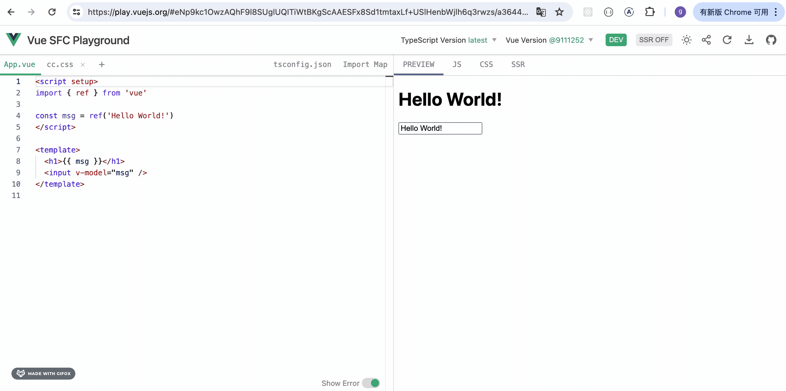

# 第58章—ReactPlayground项目实战：错误显示、主题切换

这节我们继续完善 playground 的功能。

首先，我们预览出错时，iframe 会白屏，并不会显示错误。

比如当依赖的模块找不到的时候：



这时候在 devtools 可以看到错误信息：


但总不能让开发者自己打开 devtools 看，我们要在页面做一下错误的显示。

新增 components/Message/index.tsx 组件

```javascript
import classnames from 'classnames'
import React, { useEffect, useState } from 'react'

import styles from './index.module.scss'

export interface MessageProps {
    type: 'error' | 'warn'
    content: string
}

export const Message: React.FC<MessageProps> = (props) => {
  const { type, content } = props
  const [visible, setVisible] = useState(false)

  useEffect(() => {
      setVisible(!!content)
  }, [content])

  return visible ? (
    <div className={classnames(styles.msg, styles[type])}>
      <pre dangerouslySetInnerHTML={{ __html: content }}></pre>
      <button className={styles.dismiss} onClick={() => setVisible(false)}>
        ✕
      </button>
    </div>
  ) : null
}
```
传入两个参数，type 是 error 还是 warn，还有错误内容 content。

这里 cotent 要作为 html 的方式设置到 pre 标签的标签体。

React 里设置 html 要用 dangerouslySetInnerHTML={{\_html: 'xxx'}} 的方式。

用 visible 的 state 控制显示隐藏，当传入内容的时候，设置 visible 为 true。

写下样式：

index.module.scss
```scss
.msg {
    position: absolute;
    right: 8px;
    bottom: 0;
    left: 8px;
    z-index: 10;

    display: flex;
    max-height: calc(100% - 300px);
    min-height: 40px;
    margin-bottom: 8px;
    color: var(--color);

    background-color: var(--bg-color);
    border: 2px solid #fff;
    border-radius: 6px;

    border-color: var(--color);
  
    &.error {
      --color: #f56c6c;
      --bg-color: #fef0f0;
    }
  
    &.warn {
      --color: #e6a23c;
      --bg-color: #fdf6ec;
    }
}
  
pre {
    padding: 12px 20px;
    margin: 0;
    overflow: auto;
    white-space: break-spaces;
}
  
.dismiss {
    position: absolute;
    top: 2px;
    right: 2px;

    display: block;
    width: 18px;
    height: 18px;
    padding: 0;

    font-size: 9px;
    line-height: 18px;
    color: var(--bg-color);

    text-align: center;
    cursor: pointer;
    background-color: var(--color);
    border: none;
    border-radius: 9px;
}
```
.msg 绝对定位在底部，设置下宽高。

.dismss 绝对定位在 .msg 的右上角。

注意，.error 和 .warn 的时候 color 和 background-color 都不同，我们声明了两个 css 变量。

css 变量可以在它元素和子元素 css 里生效，所以切换了 .error 和 .warn 就切换了整体的颜色：


在 Preview 组件引入下试试：


```javascript
<Message type='warn' content={new Error().stack!.toString()} />
```
看下效果：


把 type 换成 error，再缩小下窗口试试：


没啥问题。

那展示的错误内容从哪里来呢？

从 iframe 里传出来。


```html
<script>
    window.addEventListener('error', (e) => {
        window.parent.postMessage({type: 'ERROR', message: e.message})
    })
</script>
```
通过 postMessage 传递消息给父窗口。

然后在 Preview 组件里监听下：


```javascript
import { useContext, useEffect, useState } from "react"
import { PlaygroundContext } from "../../PlaygroundContext"
import Editor from "../CodeEditor/Editor";
import { compile } from "./compiler";
import iframeRaw from './iframe.html?raw'
import { IMPORT_MAP_FILE_NAME } from "../../files";
import { Message } from "../Message";

interface MessageData {
    data: {
      type: string
      message: string
    }
}

export default function Preview() {

    const { files} = useContext(PlaygroundContext)
    const [compiledCode, setCompiledCode] = useState('')

    useEffect(() => {
        const res = compile(files);
        setCompiledCode(res);
    }, [files]);

    const getIframeUrl = () => {
        const res = iframeRaw.replace(
            '<script type="importmap"></script>', 
            `<script type="importmap">${
                files[IMPORT_MAP_FILE_NAME].value
            }</script>`
        ).replace(
            '<script type="module" id="appSrc"></script>',
            `<script type="module" id="appSrc">${compiledCode}</script>`,
        )
        return URL.createObjectURL(new Blob([res], { type: 'text/html' }))
    }

    useEffect(() => {
        setIframeUrl(getIframeUrl())
    }, [files[IMPORT_MAP_FILE_NAME].value, compiledCode]);

    const [iframeUrl, setIframeUrl] = useState(getIframeUrl());

    const [error, setError] = useState('')

    const handleMessage = (msg: MessageData) => {
        const { type, message } = msg.data
        if (type === 'ERROR') {
          setError(message)
        }
    }

    useEffect(() => {
        window.addEventListener('message', handleMessage)
        return () => {
          window.removeEventListener('message', handleMessage)
        }
    }, [])

    return <div style={{height: '100%'}}>
        <iframe
            src={iframeUrl}
            style={{
                width: '100%',
                height: '100%',
                padding: 0,
                border: 'none',
            }}
        />
        <Message type='error' content={error} />

        {/* <Editor file={{
            name: 'dist.js',
            value: compiledCode,
            language: 'javascript'
        }}/> */}
    </div>
}
```
试下效果：


错误展示出来了，这就是控制台那个报错：


这里暂时用不到 warn，后面用到 warn 再切换 type。

然后再来做下主题切换：



这个同样要在 context 里保存配置：


然后加一个 theme 对应的 className：


写下用到的样式：

```css
.light {
    --text: #444;
    --bg: #fff;
}
  
.dark {
    --text: #fff;
    --bg: #1a1a1a;
} 
```

还记得前面讲过 css 变量的生效范围么？

在元素和它的所有子元素里生效。

所以只要把之前 css 的样式值改成这些变量就可以了。

比如我们在 Header 组件里用下：


然后把 theme 初始值改为 dark


这时候 Header 就切换为暗色主题了：


改为 light 就会变回来：


这就是主题切换的原理：

声明一些全局的 css 变量，写样式的时候用这些变量。切换主题时切换不同的全局变量值即可。

切成暗色主题后可以看到周边有点间距，加下重置样式：


然后我们在 Header 加一个切换主题的按钮：


```javascript
import styles from './index.module.scss'

import logoSvg from './icons/logo.svg';
import { useContext } from 'react';
import { PlaygroundContext } from '../../PlaygroundContext';
import { MoonOutlined, SunOutlined } from '@ant-design/icons';

export default function Header() {
  const { theme, setTheme} = useContext(PlaygroundContext)

  return (
    <div className={styles.header}>
      <div className={styles.logo}>
        
        <span>React Playground</span>
      </div>
      <div className={styles.links}>
        {theme === 'light' && (
          <MoonOutlined
            title='切换暗色主题'
            className={styles.theme}
            onClick={() => setTheme('dark')}
          />
        )}
        {theme === 'dark' && (
          <SunOutlined
            title='切换亮色主题'
            className={styles.theme}
            onClick={() => setTheme('light')}
          />
        )}
      </div>
    </div>
  )
}
```
安装用到的 icon 包：

```javascript
npm install @ant-design/icons --save
```

试下效果：


确实能切换了，不过我们要完善下暗色主题的样式。


其余地方也是同理。

再改下 FileNameList 的样式：


编辑器同样也可以切换主题，这个是 monaco editor 自带的。


这样，主题切换功能就完成了。

案例代码上传了[小册仓库](https://github.com/QuarkGluonPlasma/react-course-code/tree/main/react-playground-project)，可以切换到这个 commit 查看：

```
git reset --hard 4a77f1bf3dc8be9e270cc346145fde6a6a896b89
```

## 总结

这节我们实现了错误显示和主题切换功能。

我们创建了 Message 组件来显示错误，iframe 里监听 error 事件，发生错误的时候通过 postMessage 传递给父窗口。

父窗口里监听 message 事件传过来的错误，用 Message 组件显示。

主题切换就是在根元素加一个 .light、.dark 的 className，里面声明 css 变量，因为 css 变量可以在子元素里生效，子元素写样式基于这些变量，那切换了 className 也就切换了这些变量的值，从而实现主题切换。

实现这两个功能后，我们的 playground 就更完善了。
