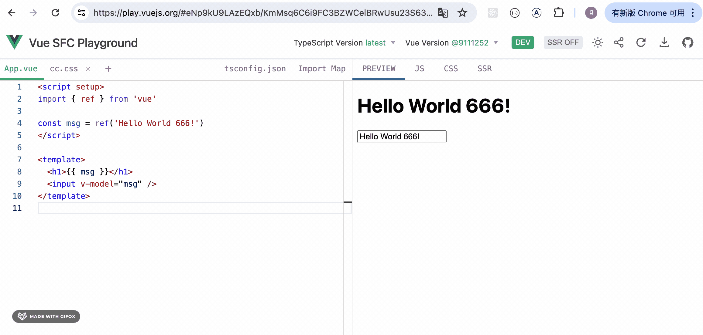

# 第59章—ReactPlayground项目实战：链接分享、代码下载

这节我们继续完善 playground 的功能。

代码写完后我们希望能通过链接分享出去，别人访问链接就可以看到这段代码。

vue playground 是有这个功能的：



点击分享按钮，链接会复制到剪贴板。

然后在新的浏览器窗口打开，可以看到分享的代码：


我们也来实现下。

大家想一下，我们要分享或者说保存的是哪部分数据呢？

其实就是 context 里的 files。

files 包含所有文件的信息，编辑、编译、预览都是围绕 files 来的。


而 files 是一个对象，我们只需要 JSON.stringify 一下，就变为字符串了。

我们把它放到 url 后面，然后初始化的时候读取出来 JSON.parse 一下，作为 files 的初始数据不就行了？

在 Context.Provider 里设置下 JSON.stringify(files) 到 location.hash


```javascript
useEffect(() => {
    const hash = JSON.stringify(files)
    window.location.hash = encodeURIComponent(hash)
}, [files])
```
当 files 内容变化的时候，会同步修改。

这里还要对字符串 encodeURIComponent 下，把 url 里不支持的字符做下转换：


可以看到，确实会把 files 内容保存到 hash。

那把这个 url 分享出去之后，初始化的时候用 hash 中的 files 就好了：


```javascript
const getFilesFromUrl = () => {
  let files: Files | undefined
  try {
      const hash = decodeURIComponent(window.location.hash.slice(1))
      files = JSON.parse(hash)
  } catch (error) {
    console.error(error)
  }
  return files
}
```
对 hash decodeURIComponent 一下，然后 JSON.parse 作为 files 的内容。

试下效果：


我在 chrome 里改了一下代码内容，新建了一个 Aaa.tsx 组件。


在别的浏览器打开这个链接试下：


可以看到，App.tsx、Aaa.tsx 组件都是我们改动的内容。

这样分享 url 功能就完成了。

当然，直接把文件内容放到 hash 上不大好，太长了，我们要压缩下。

用 [fflate](https://www.npmjs.com/package/fflate) 这个包：


安装下：

```
npm install --save fflate
```
在 utils.ts 添加两个方法


```javascript
import { strFromU8, strToU8, unzlibSync, zlibSync } from "fflate"

export function compress(data: string): string {
    const buffer = strToU8(data)
    const zipped = zlibSync(buffer, { level: 9 })
    const str = strFromU8(zipped, true)
    return btoa(str)
}

export function uncompress(base64: string): string {
    const binary = atob(base64)

    const buffer = strToU8(binary, true)
    const unzipped = unzlibSync(buffer)
    return strFromU8(unzipped)
}
```

这里的 atob、btoa 是二进制的 ASC 码和 base64 的字符串的转换：


compress 方法里，我们先调用 fflate 包的 strToU8 把字符串转为字节数组，然后 zlibSync 压缩，之后 strFromU8 转为字符串。

最后用 btoa 把这个 base64 编码的字符串转为 asc 码。

uncompress 方法正好反过来。

我们调用下试试效果：


```javascript
useEffect(() => {
    const hash = compress(JSON.stringify(files))
    window.location.hash = hash
}, [files])
```


```javascript
const getFilesFromUrl = () => {
  let files: Files | undefined
  try {
      const hash = uncompress(window.location.hash.slice(1))
      files = JSON.parse(hash)
  } catch (error) {
    console.error(error)
  }
  return files
}
```
现在，代码内容会压缩后以 asc 码字符串的方式保存在 url 里：


在另一个窗口里打开这个 url：


内容同样能恢复。

这样，代码分享功能就完成了。

在 Header 里加个按钮：


```javascript
<ShareAltOutlined 
  style={{marginLeft: '10px'}}
  onClick={() => {
    copy(window.location.href);
    message.success('分享链接已复制。')
  }}
/>
```
这里用到了 copy-to-clipboard 包，安装下：

```
npm install --save copy-to-clipboard
```


点击分享按钮，会把 url 复制到剪贴板，可以直接粘贴。

然后我们再来实现下代码下载功能：

我们需要在浏览器里把多个文件打成 zip 包，这需要用到 jszip：

```
npm install --save jszip
```
然后触发代码下载，我们用 file-saver：

```
npm install --save file-saver
npm install --save-dev @types/file-saver 
```
在 utils.ts 加一个 downloadFiles 方法：


```javascript
export async function downloadFiles(files: Files) {
    const zip = new JSZip()

    Object.keys(files).forEach((name) => {
        zip.file(name, files[name].value)
    })

    const blob = await zip.generateAsync({ type: 'blob' })
    saveAs(blob, `code${Math.random().toString().slice(2, 8)}.zip`)
}
```

然后在 Header 加一个按钮：


```javascript
<DownloadOutlined 
  style={{marginLeft: '10px'}}
  onClick={async () => {
    await downloadFiles(files);
    message.success('下载完成')
  }}
/>
```
试一下：


下载成功！

案例代码上传了[小册仓库](https://github.com/QuarkGluonPlasma/react-course-code/tree/main/react-playground-project)，可以切换到这个 commit 查看：

```
git reset --hard ea67b94f512f023779077dfedca02e87c6d59b4f
```

## 总结

这节我们实现了链接分享、代码下载功能。

链接分享原理就是把 files 信息 JSON.stringify 之后保存到 location.hash。

然后初始化的时候从 location.hash 读取出来 JSON.parse 之后设置到 files。

不过最好是做下压缩，我们用 fflate 这个包来对字符串进行压缩，然后用 btoa 转为 asc 码字符串。

代码下载则是基于 jszip 和 file saver 包实现的。

这样，playground 里写的代码内容就可以通过 url 分享出去，并且可以下载了。
