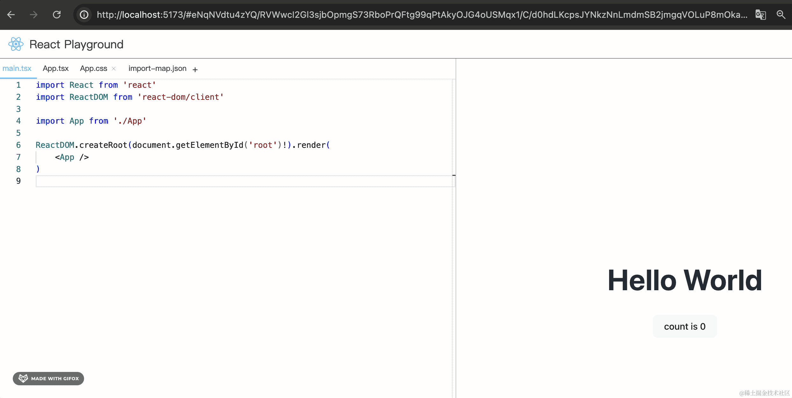

# 第60章—ReactPlayground项目实战：WebWorker性能优化

功能实现的差不多以后，我们做下代码的优化。

大家觉得我们的 playground 有啥性能瓶颈没有？

用 Performace 跑下就知道了：


用无痕模式打开这个页面，无痕模式下不会跑浏览器插件，比较准确。

打开 devtools，点击 reload 重新加载页面：


等页面渲染完点击停止，就可以看到录制的性能数据。

按住可以上下左右拖动，按住然后上下滑动可以放大缩小：


这里的 main 就是主线程：


主线程会通过 event loop 的方式跑一个个宏任务，也就是这里的 task。

超过 50ms 的被称为长任务 long task：


long task 会导致主线程一直被占据，阻塞渲染，表现出来的就是页面卡顿。

性能优化的目标就是消除这种 long task。

图中的宽度代表耗时，可以看到是 babelTransform 这个方法耗费了 24 ms


点击火焰图中的 babelTransform，下面会展示它的代码位置，点击可以跳到 Sources 面板的代码：


这就是我们要优化性能的代码。


这是 babel 内部代码，怎么优化呢？

其实这段代码就是计算量比较大，我们把它放到单独的 worker 线程来跑就好了，这样就不会占用主线程的时间。

vite 项目用 web worker 可以这样用：


我们用一下：


把 compiler.ts 改名为 compiler.worker.ts

然后在 worker 线程向主线程 postMessage

```javascript
self.postMessage({
    type: 'COMPILED_CODE',
    data: 'xx'
})
```

主线程里创建这个 worker 线程，监听 message 消息：


```javascript
import CompilerWorker from './compiler.worker?worker'
```

```javascript
const compilerWorkerRef = useRef<Worker>();

useEffect(() => {
    if(!compilerWorkerRef.current) {
        compilerWorkerRef.current = new CompilerWorker();
        compilerWorkerRef.current.addEventListener('message', (data) => {
            console.log('worker', data)
        })
    }
}, []);
```
跑一下：


可以看到，主线程接收到了 worker 线程传过来的消息。

反过来通信也是一样的 postMessage 和监听 message 事件。

主线程这边给 worker 线程传递 files，然后拿到 woker 线程传回来的编译后的代码：


```javascript
import { useContext, useEffect, useRef, useState } from "react"
import { PlaygroundContext } from "../../PlaygroundContext"
import Editor from "../CodeEditor/Editor";
import iframeRaw from './iframe.html?raw'
import { IMPORT_MAP_FILE_NAME } from "../../files";
import { Message } from "../Message";
import CompilerWorker from './compiler.worker?worker'

interface MessageData {
    data: {
      type: string
      message: string
    }
}

export default function Preview() {

    const { files} = useContext(PlaygroundContext)
    const [compiledCode, setCompiledCode] = useState('')
    const [error, setError] = useState('')

    const compilerWorkerRef = useRef<Worker>();

    useEffect(() => {
        if(!compilerWorkerRef.current) {
            compilerWorkerRef.current = new CompilerWorker();
            compilerWorkerRef.current.addEventListener('message', ({data}) => {
                console.log('worker', data);
                if(data.type === 'COMPILED_CODE') {
                    setCompiledCode(data.data);
                } else {
                    //console.log('error', data);
                }
            })
        }
    }, []);

    useEffect(() => {
        compilerWorkerRef.current?.postMessage(files)
    }, [files]);

    const getIframeUrl = () => {
        const res = iframeRaw.replace(
            '<script type="importmap"></script>', 
            `<script type="importmap">${
                files[IMPORT_MAP_FILE_NAME].value
            }</script>`
        ).replace(
            '<script type="module" id="appSrc"></script>',
            `<script type="module" id="appSrc">${compiledCode}</script>`,
        )
        return URL.createObjectURL(new Blob([res], { type: 'text/html' }))
    }

    useEffect(() => {
        setIframeUrl(getIframeUrl())
    }, [files[IMPORT_MAP_FILE_NAME].value, compiledCode]);

    const [iframeUrl, setIframeUrl] = useState(getIframeUrl());

    const handleMessage = (msg: MessageData) => {
        const { type, message } = msg.data
        if (type === 'ERROR') {
          setError(message)
        }
    }

    useEffect(() => {
        window.addEventListener('message', handleMessage)
        return () => {
          window.removeEventListener('message', handleMessage)
        }
    }, [])

    return <div style={{height: '100%'}}>
        <iframe
            src={iframeUrl}
            style={{
                width: '100%',
                height: '100%',
                padding: 0,
                border: 'none',
            }}
        />
        <Message type='error' content={error} />

        {/* <Editor file={{
            name: 'dist.js',
            value: compiledCode,
            language: 'javascript'
        }}/> */}
    </div>
}
```
而 worker 线程这边则是监听主线程的 message，传递 files 编译后的代码给主线程：


```javascript
self.addEventListener('message', async ({ data }) => {
    try {
        self.postMessage({
            type: 'COMPILED_CODE',
            data: compile(data)
        })
    } catch (e) {
         self.postMessage({ type: 'ERROR', error: e })
    }
})
```
可以看到，拿到了 worker 线程传过来的编译后的代码：


预览也正常。


其实 files 变化没必要那么频繁触发编译，我们加个防抖：

```javascript
useEffect(debounce(() => {
    compilerWorkerRef.current?.postMessage(files)
}, 500), [files]);
```

我们再用 performance 看下优化后的效果：


之前的编译代码的耗时没有了，现在被转移到了 worker 线程：


还是 24ms，但是不占据主线程了。

当然，因为我们文件内容很少，所以编译耗时少，如果文件多了，那编译耗时自然也就增加了，拆分就很有必要。

这样，性能优化就完成了。

然后再优化两处代码：


main.tsx 有个编辑器错误说 StrictMode 不是一个 jsx，这种不用解决，也不影响运行，改下模版把它去掉就行了：


上面那个只要编辑下文件就会触发类型下载，也不用解决：


再就是我们生成的文件名没必要 6 位随机数：


改为 4 位正好：




案例代码上传了[小册仓库](https://github.com/QuarkGluonPlasma/react-course-code/tree/main/react-playground-project)。

## 总结

这节我们做了下性能优化。

我们用 Performance 分析了页面的 Event Loop，发现有 long task，**性能优化的目标就是消除 long task**。

分析发现是 babel 编译的逻辑导致的。

我们通过 Web Worker 把 babel 编译的逻辑放到了 worker 线程跑，通过 message 事件和 postMessage 和主线程通信。

拆分后功能正常，再用 Performance 分析，发现耗时逻辑被转移到了 worker 线程，主线程这个 long task 没有了。

这样就达到了性能优化的目的。

当需要编译的文件多了之后，这种性能优化就更有意义。
