# 第61章—ReactPlayground项目实战：总结

我们从 0 到 1 实现了和 [vue playground](https://play.vuejs.org/) 功能一样的项目：


整体测试一下 react playground 的功能：

我们用 create-vite 创建的项目，进入项目，把开发服务跑起来：

```
npm run dev
```
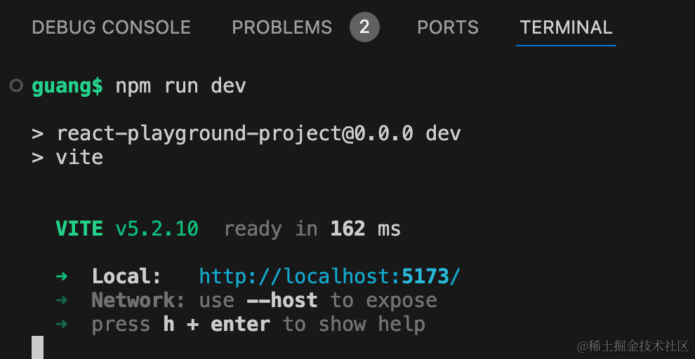

浏览器访问下：

我们可以在左侧编辑器写组件和样式，然后在右边实时预览：

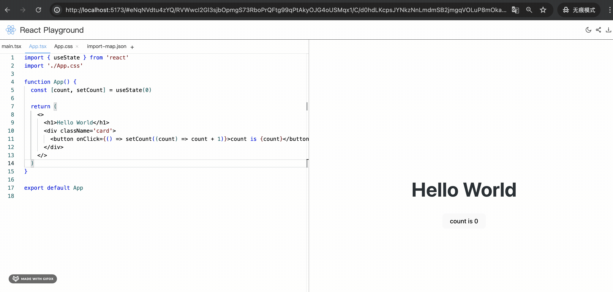

css 和 ts 代码都有提示：

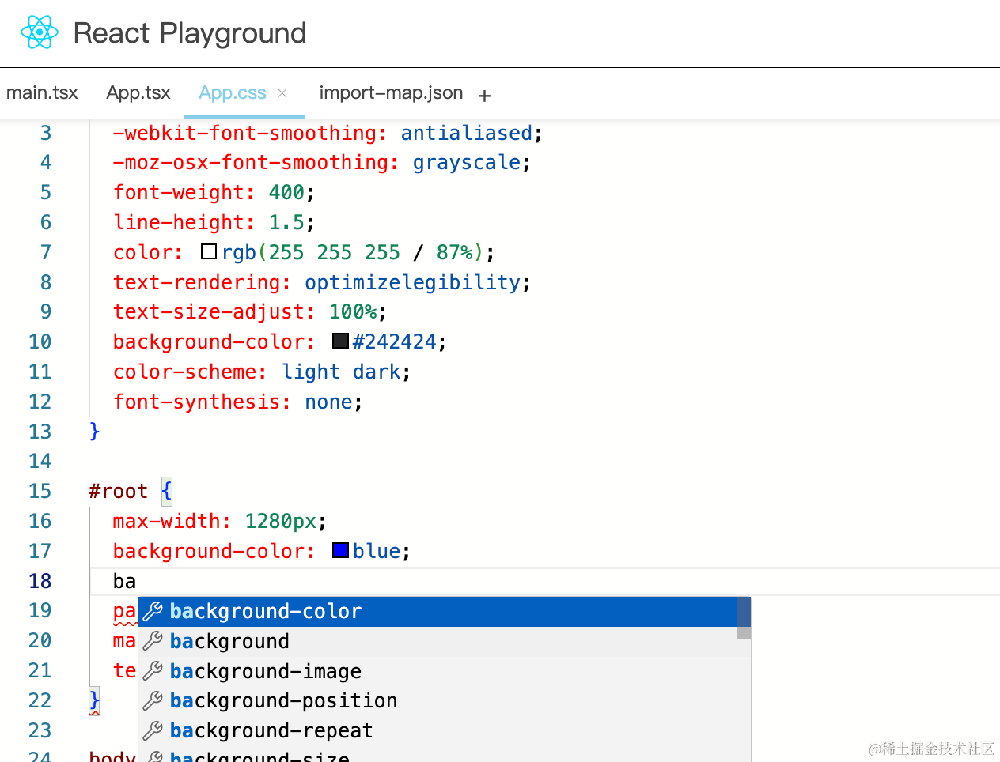

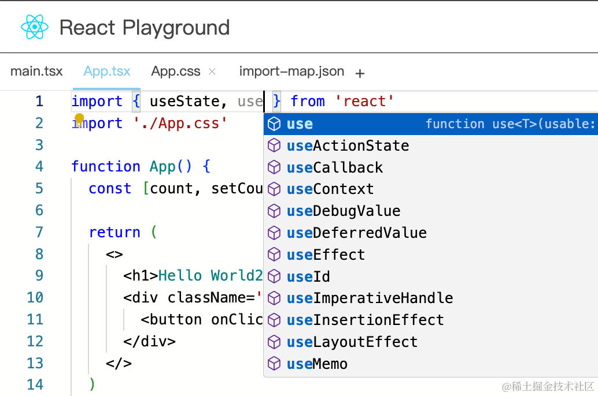

并且我们后面引入的 npm 包也会有类型提示：

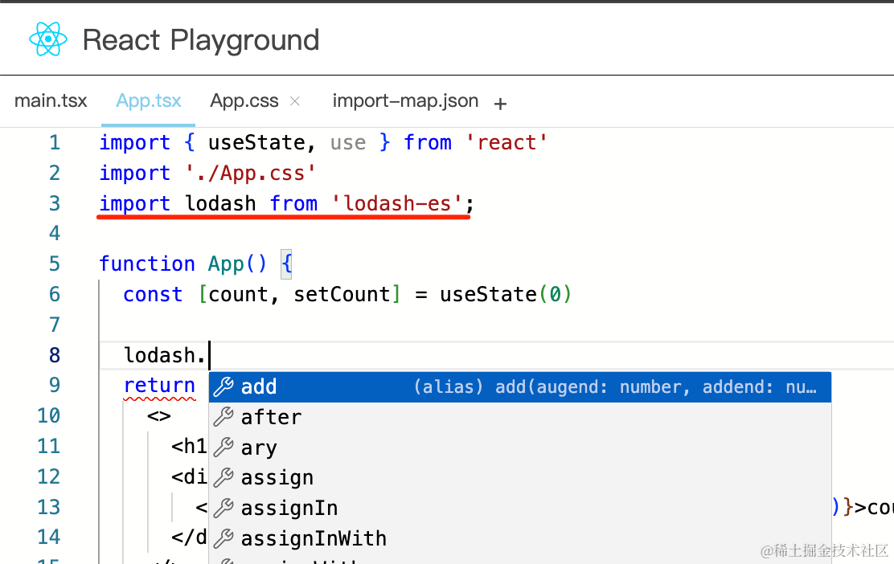

但额外引入的 npm 包不能直接用：

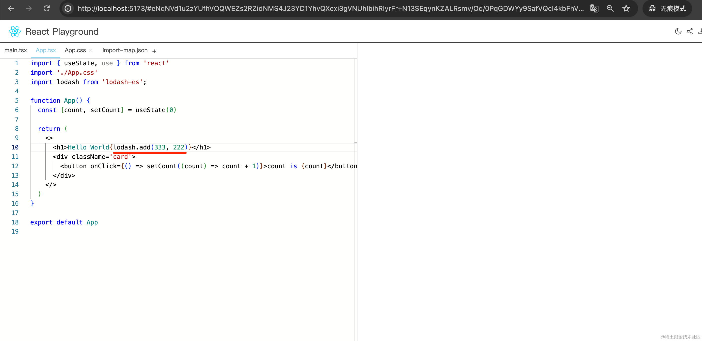

需要在 import-map.json 里配置下才行：

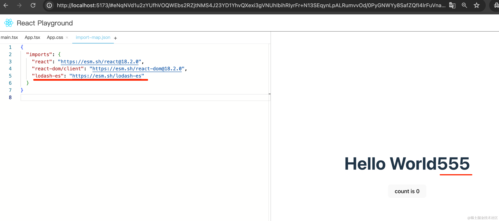

文件可以新增、删除、修改：


比如我们新增一个 Aaa.tsx 组件

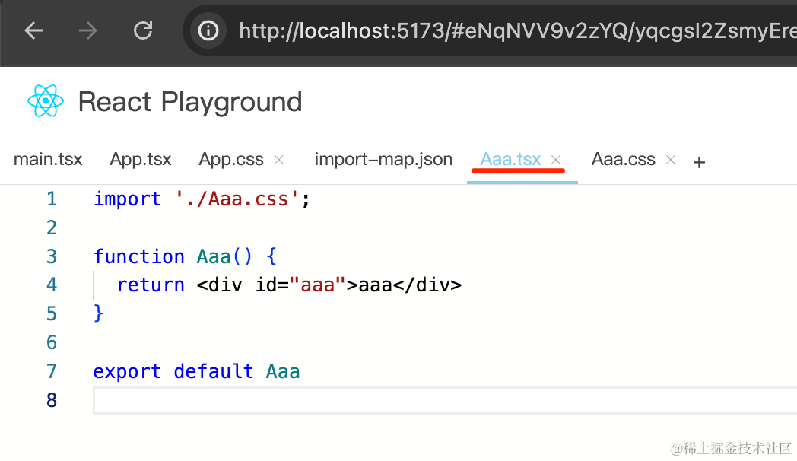

还有它的样式 Aaa.css

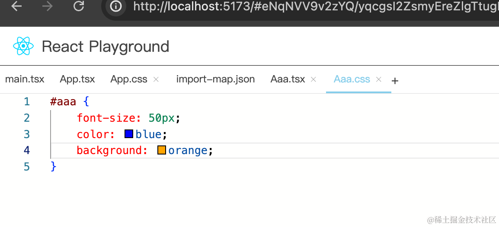

在 App.tsx 里引入后就可以使用：

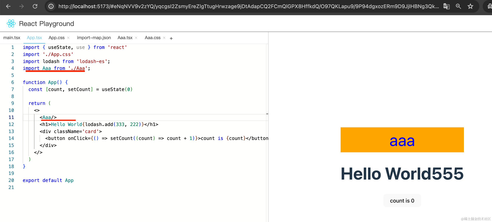

你可以直接打开[这个 url](http://localhost:5173/#eNqNVV9v2zYQ/yqcgsI2ZsmyEreZlgTtugHrwzage9jDtAdapCQ2FCmQlGPX8HffkdQ/O97QKLapu9/9P94dgxozERm9D9JjIHBNg3QkLQOORdni0lLNoaE6V6wxQN9h3loiqxupDPpMcW5QoWSNZsqeZ5mYsn7+47cpNySyXuWcUWGBA/RD03SoaAVnx+rFoxwkDf0spZkTmbc1yEYlNb9wao8/HT6R+UwBd7b4bhEpKghV80wg+HuweldPmVhkIjgtA3i9CLinfHO8R9Rq+qcBh5b2hE7XY/dxRLnWI41LgnXV4f1LSPXsxzELGI9ZwNhyMlG0IjdMCpuj+QIdbWS5FNqgv3PZCrNEmpqP9vQPehycm8cQMkL2o6hplUB9SiAb9tcmB2Obm+6tWj/9SjmX6C+pODl6/yJMyPz29naJkiRZnB5WgBokCNuhnGOtf4dcPs5yrMhs4AJ/2xoDfkvxkbP8+fEI3j8+Dd7O5859R3Mn9D1aL05P/sw0OroT2PR6RrsrMNy9PfgAINaTzRXduzwSWuCWu64a6w6luKi7pZzV3RP6gqe2p3y+CylMWOCa8UOKPglDFWT9oA2tw5Yt0YcdFQxIkL8dNSzHQFIMcwBhoUNNFSuglgiFL3T7zECV1adr0F8xUaYICwNwhjUlHlfLr6HU+1fAUuGDzjGnDua4L5SVlUnRXRw7ImeChlVHXEcbR8wllypFqtzOk80G9Z8Vun/3ZuEQhu5N6C+PsyQbw2r2lXJasi3jzBxGmAZ6iMmXVlsTcfzGsbY4fy4V1IyEnbmb5M4+owehziu4tCk4Ce4hgtXzGIg+CFNRzXSKhBQ2QlfTm7EMNd6HL4yYCqwm93Gzd8IN9KhzOVG0dpQaq5KJFMUIt0aOfkOKSyDnMDWo6vVvJTl49YTphmOocMGpV10z0Ru8TXp7ljjkN4531blN7xPHOQ0ZNAhEc26vWk96ymYSdEdJ5/lF8daDk/4qOcEh3jh6S2tA9cJnXcpEBZU0k/Q6U+sptm+dTdc6eau0rVsjWefx1aqusX08VypoGFDb7JGWnBFkFLR8g6GTvG2PCBUmrIVc3HdJdDBm51raQ5x6CCrZ6POw00ruqPLBT7Hgytu7t3lh79YUXsCS0Mvz13DHNNty6rXI1thMw6UBv22PTG6mBdsr4G30qt/XlDCM5o2iBVXaM8/buZvNk7Ex3LubZH27uXvnIr+a0sIFgZCzBYhJua/jf7BPLwL/dsr5LRLWuIm+aCkm0+6Sczb1Oko/9pzRrBPRWZD2bmSB23GWkgWVMY1OVyuq60hXK8d5v76PkijOAsj9RGCy8v9b1oJeyw9L8qrghHueCFhsl2u+o3zzmvcb2O3viy2Msd3CZ6vVbUJGHrMAY5wFT/DdL6mrawlAg58Xa6mj/M9augHtfUkmF3vTj6eh6baAf9VxMNjh5pVuugan0796w1lP) 试试

这个通过 url 分享代码也是 playgrond 的功能。

点击右上角的分享按钮可以复制分享链接：


此外，还可以下载代码到本地：

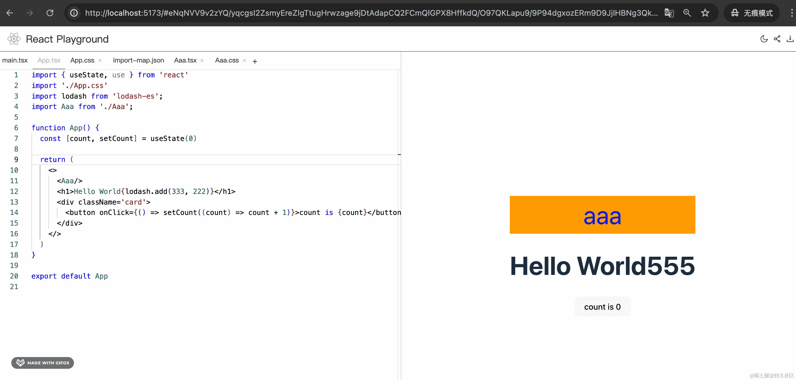

还有切换亮色、暗色主题：

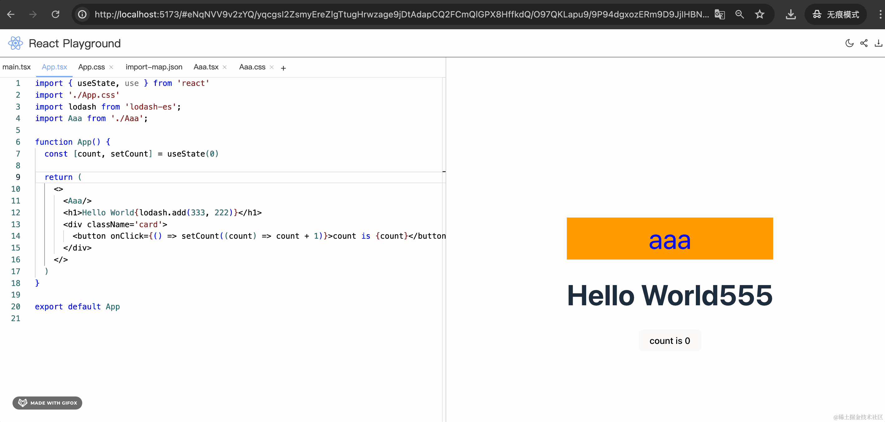

这些就是 React Playground 的全部功能。

最终实现的效果还不错。

回顾下我们的开发过程：

我们首先写了下布局：

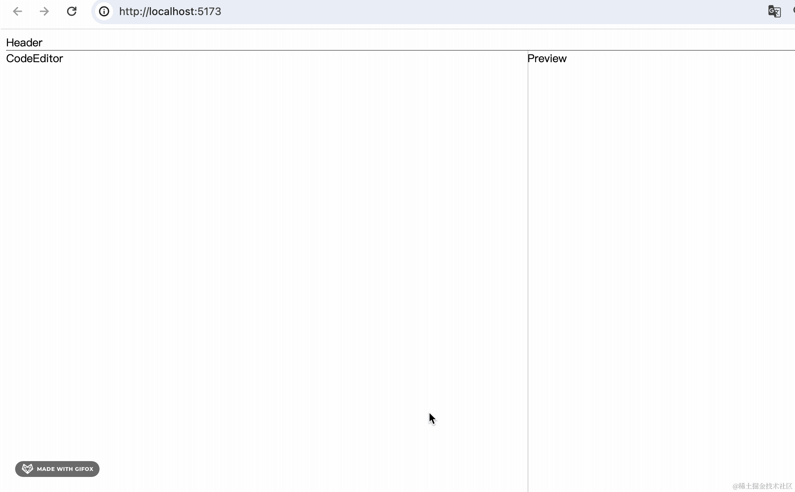

用 [allotment](https://www.npmjs.com/package/allotment) 实现的 split-pane，两边可以通过拖动改变大小。

然后集成 @monaco-editor/react 实现的编辑器。

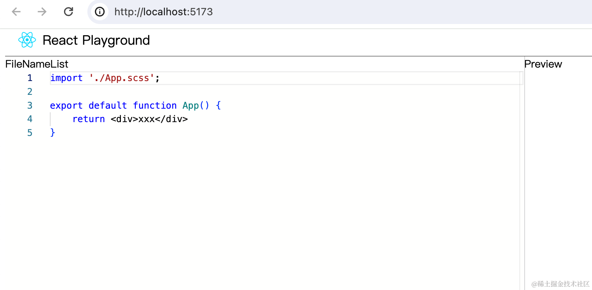

还用 @typescript/ata 包实现了代码改变时自动下载 dts 类型包的功能。

这样，在编辑器里写代码就有 ts 类型提示了。

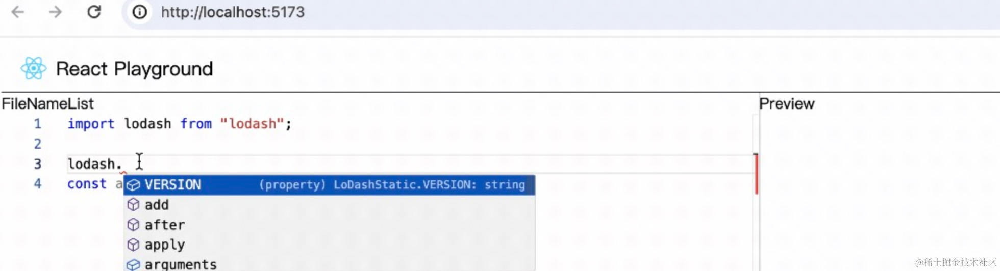

然后我们实现了多文件的切换：

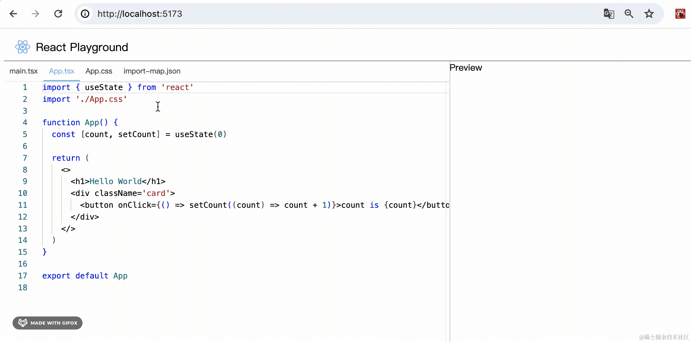

在 Context 中保存全局数据，比如 files、selectedFileName，还有对应的增删改的方法。

对 Context.Provider 封装了一层来注入初始化数据和方法，提供了 initFiles 的信息。

然后在 FileNameList 里读取 context 里的 files 来渲染文件列表。

点击 tab 的时候切换 selectedFileName，从而切换编辑器的内容。

然后实现了编译以及在 iframe 里预览。

使用 @babel/standalone 做的 tsx 代码的编译，编译过程中需要对 .tsx、.css、.json 等模块的 import 做处理，变成 blob url 的方式。


通过 babel 插件实现了对 import 语句的修改：


css 模块包一层代码加到 head 的 style 标签里，json 包一层代码直接 export，而 tsx 模块直接 babel 编译即可。

对于 react、react-dom/client 这种，用浏览器的 import maps 来引入。

然后通过 iframe 实现了预览：


替换 html 模版里 import maps 和 src 部分的 script 标签后，同样用 blob url 设置为 iframe 的 src 就可以了。

这样就可以预览了：


iframe 的代码如下：


正是替换了 importmap 和 src 部分的 html，并且 css 也被添加到了 head 里的 style 标签下。

然后我们实现了文件的新增、删除、修改：


main.tsx、App.tsx、import-map.json 设置为 readonly，不可编辑和删除。

之后实现了错误的显示，在 iframe 里监听 error 事件，发生错误的时候通过 postMessage 传递给父窗口。

父窗口里监听 message 事件传过来的错误，用 Message 组件显示。


然后实现了主题切换：


主题切换就是在根元素加一个 .light、.dark 的 className，里面声明 css 变量，因为 css 变量可以在子元素里生效，子元素写样式基于这些变量，那切换了 className 也就切换了这些变量的值，从而实现主题切换。

之后实现了通过链接分享代码的功能：

原理就是把 files 信息 JSON.stringify 之后保存到 location.hash。

然后初始化的时候从 location.hash 读取出来 JSON.parse 之后设置到 files。

这个过程中还要做下压缩，用 fflate 这个包来对字符串进行压缩，然后用 btoa 转为 asc 码字符串。

代码下载则是基于 jszip 和 file saver 包实现的。

这样，playground 里写的代码内容就可以通过 url 分享出去，并且可以下载了。

之后做了下性能优化：

用 Performance 分析了页面的 Event Loop，发现有 long task，性能优化的目标就是消除 long task。


分析发现是 babel 编译的逻辑导致的。


我们通过 Web Worker 把 babel 编译的逻辑放到了 worker 线程跑，通过 message 事件和 postMessage 和主线程通信。

拆分后功能正常，再用 Performance 分析，发现耗时逻辑被转移到了 worker 线程，主线程这个 long task 没有了。


这就是我们开发这个 playground 的全过程。

其实这个项目完全可以写到简历里，而且非常好讲故事，比如你开发的组件库，用这个 playground 来实现组件的在线预览。

而且这个项目有挺多技术亮点的：

- 用 @monaco-editor/react 实现了网页版 typescript 编辑器，并且实现了自动类型导入
- 通过 @babel/standalone 实现了文件编译，并且写了一个 babel 插件实现了 import 的 source 的修改
- 通过 blob url 来内联引入其他模块的代码，通过 import maps 来引入 react、react-dom 等第三方包的代码
- 通过 iframe 实现了预览功能，并且通过 postMessage 和父窗口通信来显示代码运行时的错误
- 基于 css 变量 + context 实现了主题切换功能
- 通过 fflate + btoa 实现了文件内容的编码、解码，可以通过链接分享代码
- 通过 Performance 分析性能问题，并通过 Web Worker 拆分编译逻辑到 worker 线程来进行性能优化，消除了 long lask

而且这些技术点也挺有价值的，通过 playground 项目对这些技术点有很好的掌握之后，在别的地方也能用到。

总之，大家可以把这个项目消化吸收，内化成你自己的东西。