# 第62章—手写MiniReact：思路分析

我们写了很多 React 组件，也学了一些 React 生态的库，用 React 这方面没啥问题了。

但想要深入掌握 React，理解它的实现原理也是必要的。

而理解 React 实现原理的最好方式就是写一个 Mini React。

这节我们先来分析下思路。

我们在组件里通过 JSX 描述页面：

jsx 会被 babel 或者 tsc 等编译器编译成 render function，也就是类似 React.createElement 这种：

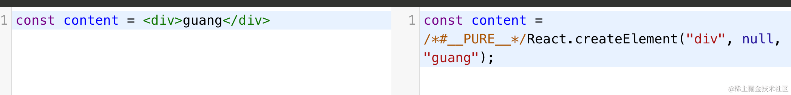

所以之前写 React 组件都必须有一行 import * as React from 'react'，因为编译后会用到 React 的 api。

你可以在 [babel 的 playground](https://babeljs.io/repl) 试一下。

但后来改为了这种 render function：

由 babel、tsc 等编译工具自动引入一个 react/jsx-runtime 的包，

把这里的 React Runtime 切换成自动引入的就可以看到：

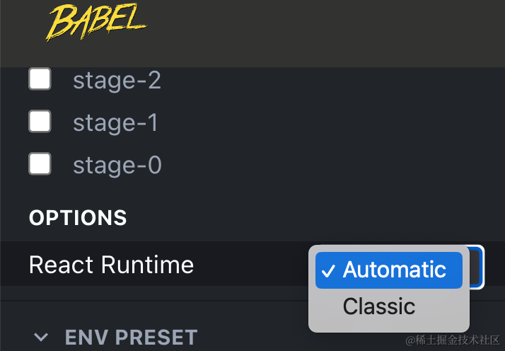

所以现在写组件就可以不引入 React 了。

然后 render function 执行后产生 React Element 对象，也就是常说的虚拟 dom。

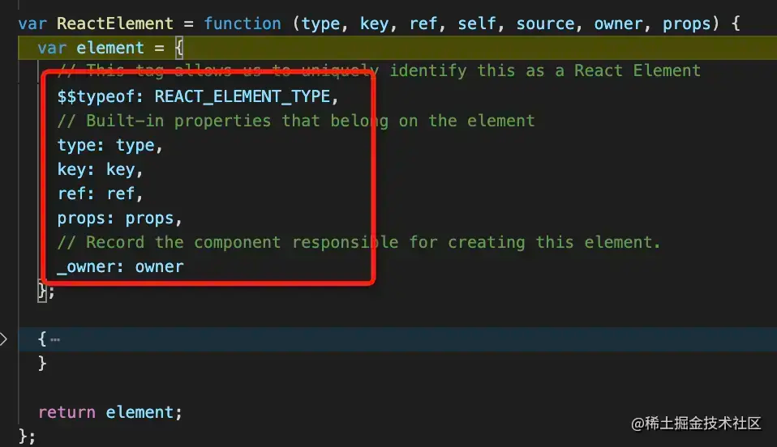

也就是这样的流程：

vdom （React Element）是一个通过 chilren 串联起来的树。

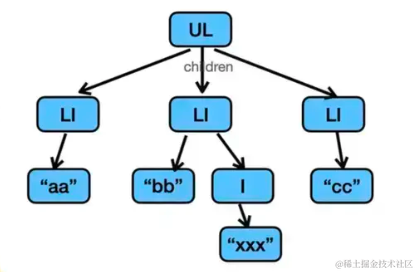

之后 React 会把 React Element 树转换为 fiber 结构，它是一个链表：

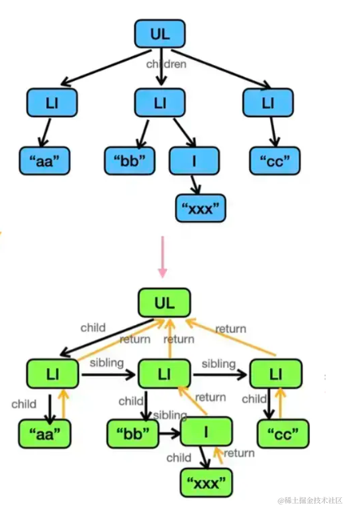

React Element 只有 children 属性来链接父子节点，但是转为 fiber 结构之后就有了 child、sibling、return 属性来关联父子、兄弟节点。

有同学说，这 fiber 结构看起来不也是一棵树么，为啥叫链表？

因为按照 child、sibling、sibling、return、sibling、return 之类的遍历顺序，可以把整个 vdom 树变成线性的链表结构：

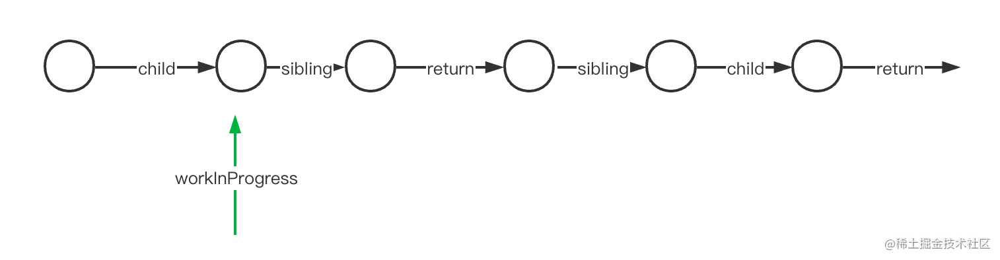

这样一个循环就可以处理完。

react 在处理 fiber 链表的时候通过一个叫 workInProgress 的指针指向当前 fiber 节点。

而 react 之所以能实现并发特性，就是基于 fiber 的链表结构。

因为之前的 React Element 树里只有 children，没有 parent、sibling 信息，这样只能一次性处理完，不然中断了就找不到它的 parent 和 sibling 节点了。

但是 fiber 不同，它额外保存了 return、sibling 节点，这样就算打断了也可以找到下一个节点继续处理。

所以现在完全可以先处理这个 fiber 树的某几个节点，然后暂停，处理其它的 fiber 树，之后再回来继续处理：

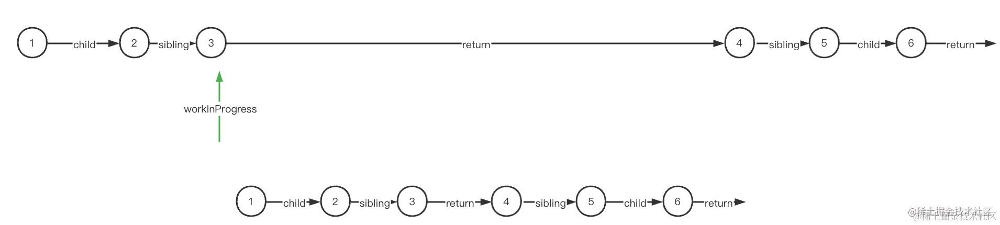

这也就是 React 所谓的并发。

浏览器里是通过 Event Loop 跑一个个 task。

如果某个 task 执行时间过长，就会阻塞渲染，导致丢帧，也就是页面卡顿。

之前直接基于 React Element 递归渲染的时候，很容易计算量过多导致页面卡顿。

而改成 fiber 结构再渲染之后，可以在每次渲染 fiber 节点之前判断是否超过一定的时间间隔，是的话就放到下个任务里跑，这样就不会阻塞渲染了。

有个两种架构对比的例子，我们来试一下：

https://claudiopro.github.io/react-fiber-vs-stack-demo/stack.html

先看下之前的：

用 Performance 录制下：

可以看到有很多超过 50ms 的长任务：

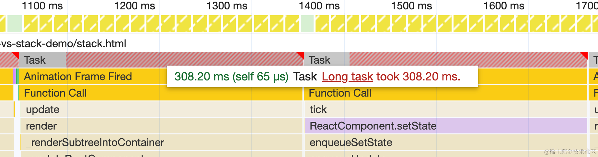

再看下 fiber 架构版本的 react

https://claudiopro.github.io/react-fiber-vs-stack-demo/fiber.html

可以看到，每个任务都是固定的时间内跑完的。

这就是 react 的时间分片机制。

怎么实现的呢？

很简单，fiber 链表的处理是可以打断的，每次处理一个节点：

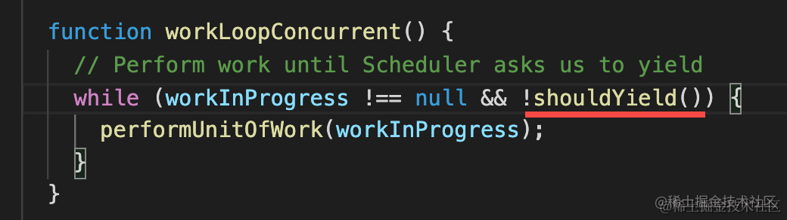

然后处理下个节点之前判断下当前时间片还有没有空余时间，有的话继续 performUnitOfWork 处理下个 fiber 节点。

否则放到下一次任务里跑。

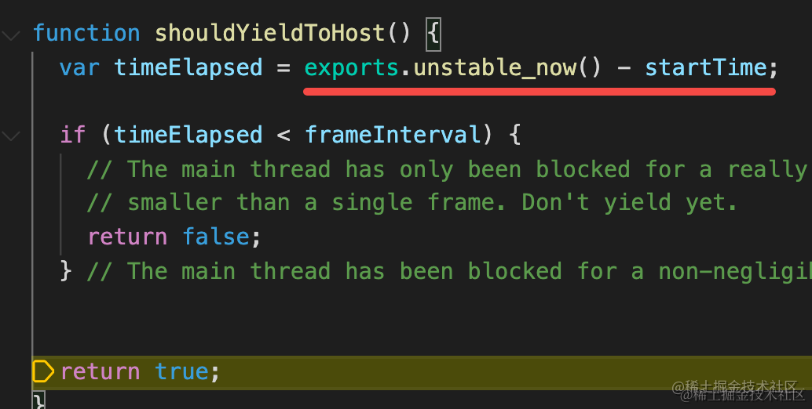

这个时间片的判断就是通过当前时间和任务开始时间点的差值。

体会到 fiber 架构的好处了么？

**通过记录 parent、slibling 信息，让树变成链表，可以打断。每次处理一个 fiber 节点，处理每个 fiber 节点前判断是否到了固定的时间间隔，也就是时间分片，通过时间分片把处理 fiber 的过程放到多个任务里跑，这样页面内容多了也不会导致卡顿。**

我们实现 Mini React 的话，这个时间分片机制可以直接用浏览器的 requestIdleCallback 的 api 来做。

知道了 fiber 架构的好处之后，我们继续来看 React 渲染流程。

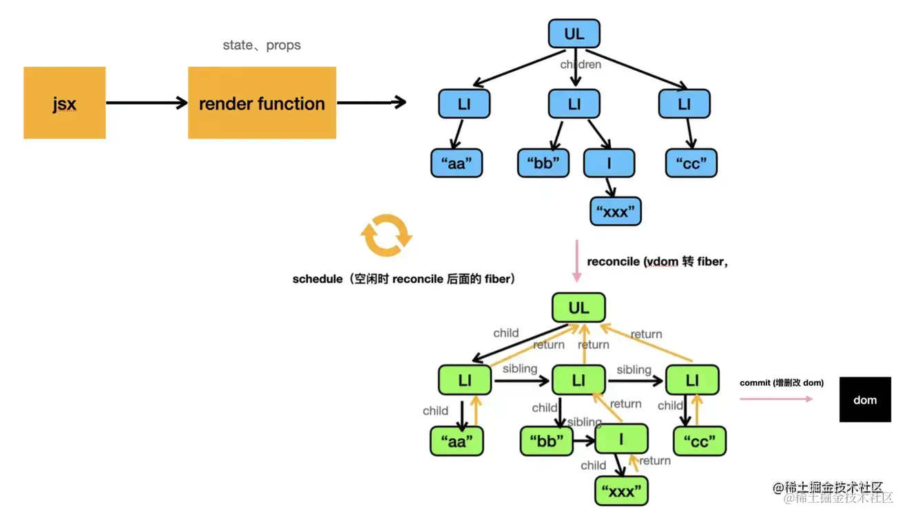

JSX 通过 babel、tsc 等编译成 render function，执行后变成 React Element 的树。

然后 React Element 转成 fiber 结构，这个过程叫做 reconcile。

之前 React Element 是这样的：

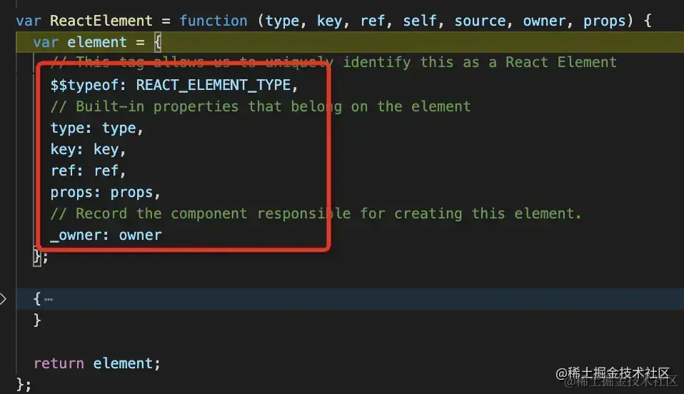

会变成这样的 fiber 节点：

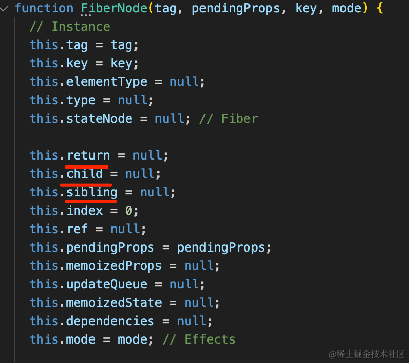

之后会根据 fiber 的类型做不同的处理：

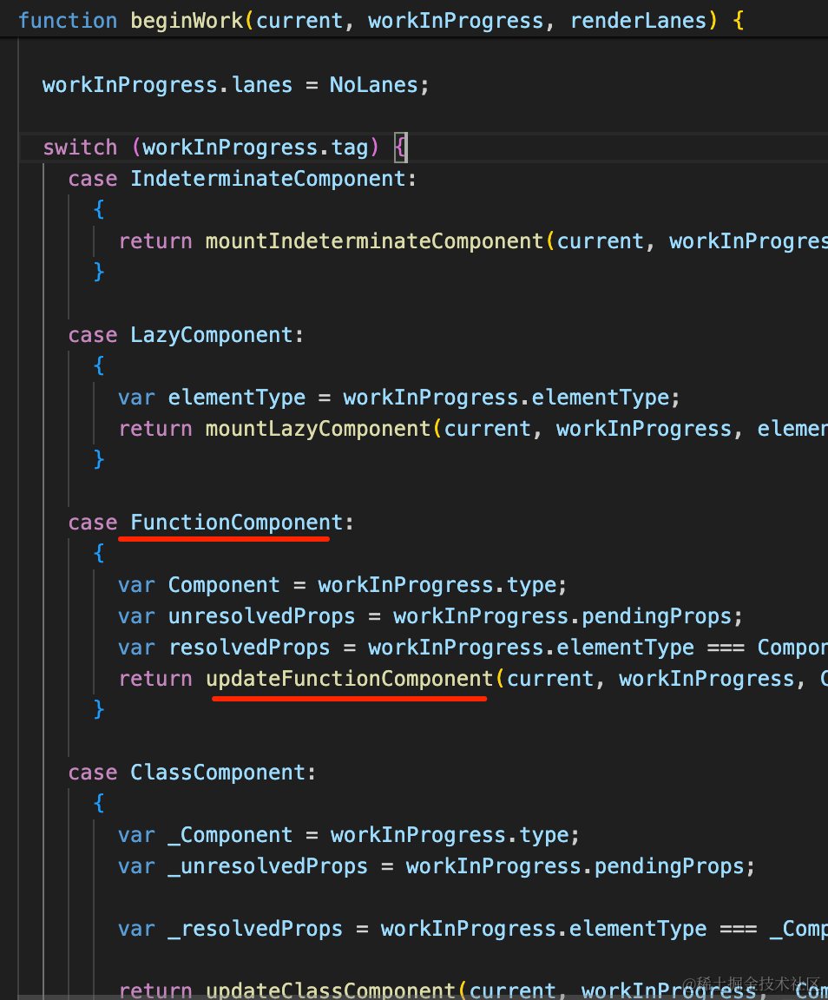

function 组件、Provider、Lazy 组件等类型的 fiber 节点，都会做相应的处理。

比如 function 组件的 fiber 节点，会调用函数，拿到返回值，之后继续 reconcile 它的 children：

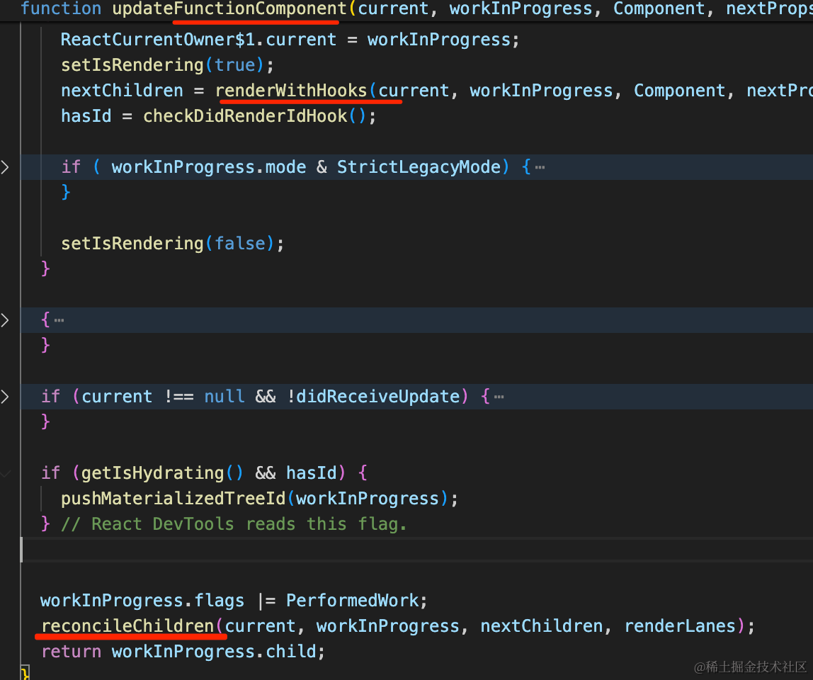

当然，reconcile 并不只是创建新的 fiber 节点，当更新的时候，还会和之前的 fiber 节点做 diff，判断是新增、修改、还是删除，然后打上对应的标记。

reconcile 完之后，fiber 链表也就构建好了，并且在每个 fiber 节点上保存了当前一些额外的信息。

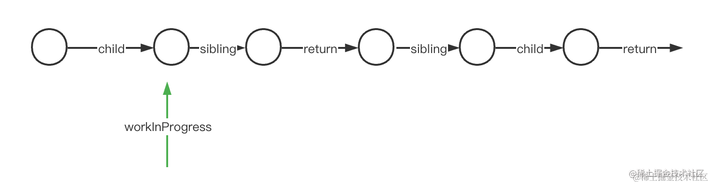

比如 function 组件要执行的 effect 函数。

之后会再次遍历构建好的这个 fiber 链表，处理其中的 effect，根据增删改的标记来更新 dom，这个阶段叫做 commit。

这样，React 的渲染流程就结束了。

整体分为两大阶段：

**render 阶段**：把 React Element 树（也可以叫 vdom） 转成 fiber 链表的 reconcile 过程，由 Scheduler 负责调度，通过时间分片来把计算分到多个任务里去。

**commit 阶段**：reconcile 结束就有了完整的 fiber 链表，再次遍历这个 fiber 链表，执行其中的 effect、增删改 dom等。

其实 commit 阶段也分成了三个小阶段：

- **before mutation**：操作 dom 之前
- **mutation**：操作 dom
- **layout**：操作 dom 之后。

比如 useEffect 的 effect 函数会在 before mutation 前异步调度执行，而 useLayoutEffect 的 effect 函数是在 layout 阶段同步执行。

React 团队按照操作 dom 前后来分了三个小阶段，更清晰了一点。

再就是 ref，在 mutaion 阶段更新了 dom，所以在 layout 阶段就可以拿到 ref 了。

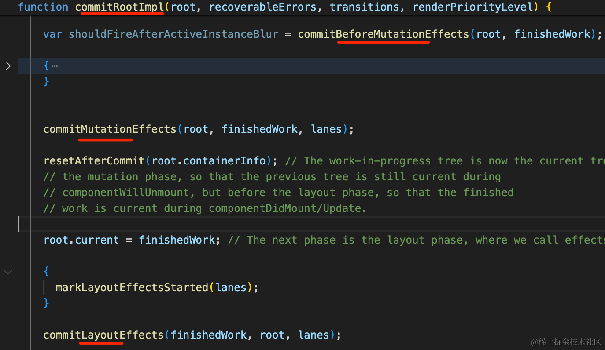

当然，我们实现的时候对 commit 阶段不用分的那么细。

## 总结

这节我们简单分析了下 React 的渲染流程。

JSX 通过 babel、tsc 等编译器编译成 render function，然后执行后产生 React Element 的树。

React Element 的树会转成 fiber 链表，这个过程叫做 reconcile，由 React 的 Scheduler 调度。

reconcile 每次只处理一个 fiber 节点，通过时间分片把 reconcile 的过程分到多个任务跑，这样  fiber 树再大也不会阻塞渲染。

reconcile + schedule 这个过程叫做 render 阶段，而之后会进入 commit 阶段。

commit 阶段会遍历构建好的 fiber 链表，执行 dom 操作，还有函数组件的 effect 等。

它按照更新 dom 前后，分了 before mutation、mutation、layout 三个小阶段。

这就是 React 的 fiber 架构的好处和渲染流程，下节我们按照这个流程来写下 Mini React。
