# 第63章—手写MiniReact：代码实现

上节我们梳理了 React 渲染流程，这节来具体实现下。

首先先完成从 JSX 到 React Element 的转换：


从 JSX 到 render function 这步是 babel 或者 tsc 帮我们做的。

新建个项目：

```
mkdir mini-react
cd mini-react
npm init -y
```

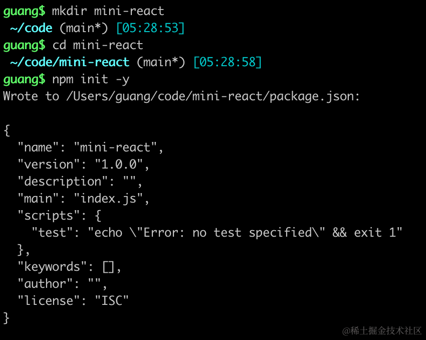

安装 typescript：

```
npm install --save-dev typescript
```

创建 tsconfig.json 配置文件：

```
npx tsc --init
```
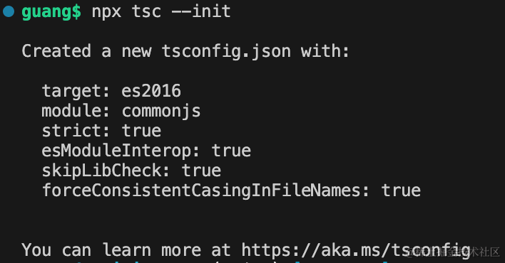

改一下生成的 tsconfig.json

```json
{
  "compilerOptions": {
    "outDir": "dist",
    "target": "es2016",                                  /* Set the JavaScript language version for emitted JavaScript and include compatible library declarations. */
    "jsx": "react",                                /* Specify what JSX code is generated. */
    "jsxFactory": "",                                 /* Specify the JSX factory function used when targeting React JSX emit, e.g. 'React.createElement' or 'h'. */
    "allowJs": true,                                  /* Allow JavaScript files to be a part of your program. Use the 'checkJS' option to get errors from these files. */
    "strict": true,                                      /* Enable all strict type-checking options. */
    "skipLibCheck": true                                 /* Skip type checking all .d.ts files. */
  }
}
```

添加 src/index.jsx

```javascript
const content = <div>
    <Guang>guang</Guang>
    <a href="xxx">link</a>
</div>
```
执行编译：

```
npx tsc
```

可以看到，生成的代码是这样的：

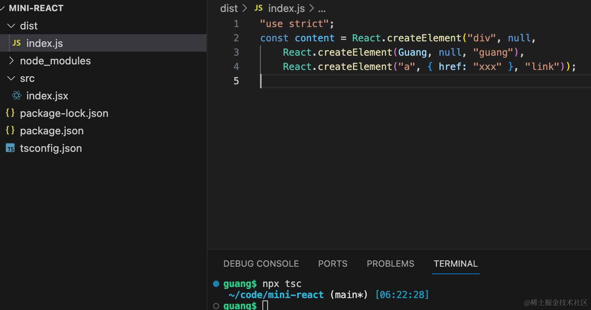

React.createElement 第一个参数是类型，第二个参数是 props，第三个参数是 children。

具体的 render function 的名字也可以指定：

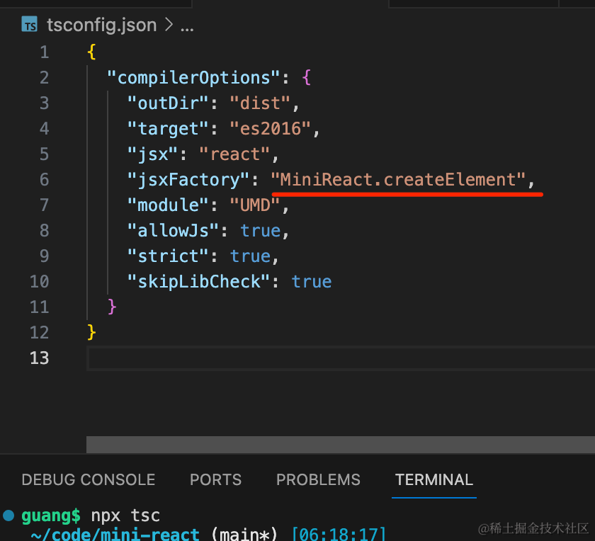

再次执行编译，生成的就是这样的：

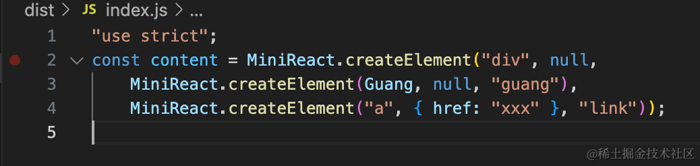

这就是从 jsx 到 render function 这一步，由 babel、tsc 等编译器来做：

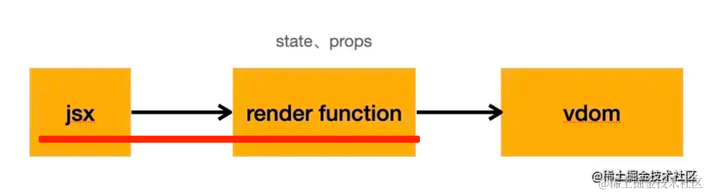

我们只要实现这些 render function，然后返回对应的 React Element 即可。

创建 src/mini-react.js

```javascript
function createElement(type, props, ...children) {
    return {
        type,
        props: {
            ...props,
            children: children.map((child) => {
                const isTextNode = typeof child === "string" || typeof child === "number";
                return isTextNode ? createTextNode(child) : child;
            }),
        },
    };
}

function createTextNode(nodeValue) {
    return {
        type: "TEXT_ELEMENT",
        props: {
        nodeValue,
            children: []
        },
    };
}

const MiniReact = {
    createElement
};

window.MiniReact = MiniReact;
```

MiniReact.createElement 就是我们实现的 render function。

为什么文本节点要单独处理呢？

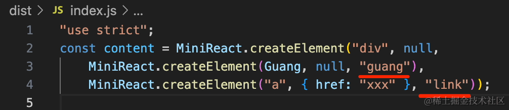

因为 div 的话，它的 type 是 div，可以有 props 和 children。

而文本节点是没有 type、children、props 的。

我们需要给它加个固定的 type TEXT_ELEMENT，并且设置 nodeValue 的 props。

这样结构统一，方便后面处理。

改下 index.jsx

```javascript
const content = <div>
    <a href="xxx">link</a>
</div>

console.log(JSON.stringify(content, null, 2));
```

编译一下：

```
npx tsc -w
```
在 dist 下生成了目标代码：

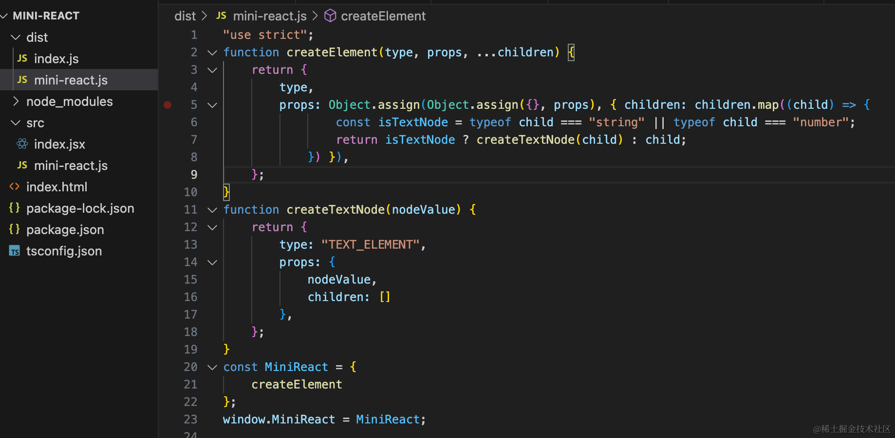
加一个 index.html 引入下 dist 的代码：

```html
<!DOCTYPE html>
<html lang="en">
<head>
    <meta charset="UTF-8">
    <meta name="viewport" content="width=device-width, initial-scale=1.0">
    <title>Document</title>
</head>
<body>
    <div id="root"></div>
    <script src="./dist/mini-react.js"></script>
    <script src="./dist/index.js"></script>
</body>
</html>
```
然后跑个静态服务：

```
npx http-server .
```

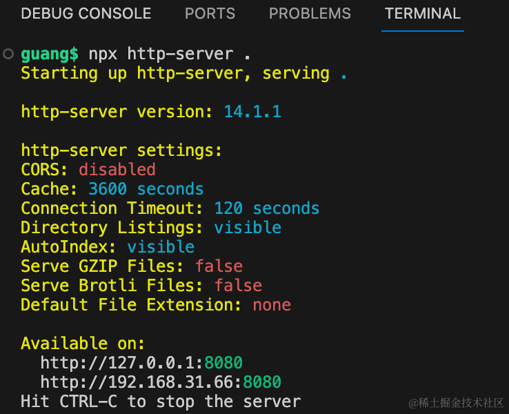

浏览器访问下：

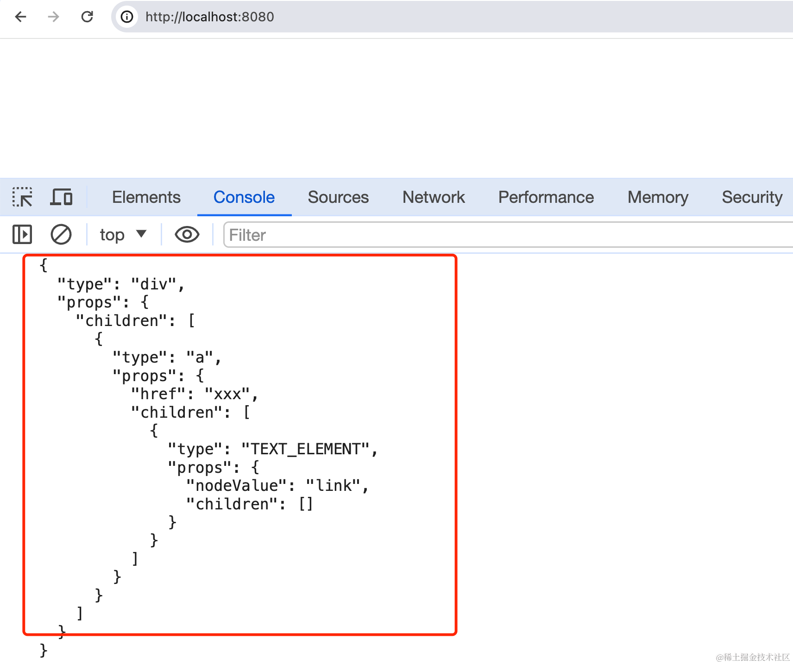

这个就是 React Element 的树，也就是我们常说的 vdom。

接下来要把它转成 fiber 结构。


这个过程叫做 reconcile。

它并不是一次性完成的，而是通过调度器调度，根据时间分片放到多个任务里完成，这里我们用 requestIdleCallback 来调度。

```javascript
let nextUnitOfWork = null
let wipRoot = null
let currentRoot = null

function render(element, container) {
    wipRoot = {
        dom: container,
        props: {
            children: [element],
        },
        alternate: currentRoot,
    }
    nextUnitOfWork = wipRoot
}

function workLoop(deadline) {
    let shouldYield = false
    while (nextUnitOfWork && !shouldYield) {
        nextUnitOfWork = performUnitOfWork(
            nextUnitOfWork
        )
        shouldYield = deadline.timeRemaining() < 1
    }
    requestIdleCallback(workLoop)
}

requestIdleCallback(workLoop)

function performUnitOfWork(fiber) {

    if (fiber.child) {
        return fiber.child
    }
    let nextFiber = fiber
    while (nextFiber) {
        if (nextFiber.sibling) {
            return nextFiber.sibling
        }
        nextFiber = nextFiber.return
    }
}
```
我们用 reqeustIdleCallback 来代替 React 的时间分片，把 React Element 树转 fiber 的 reconcile 过程放到不同的任务里跑。

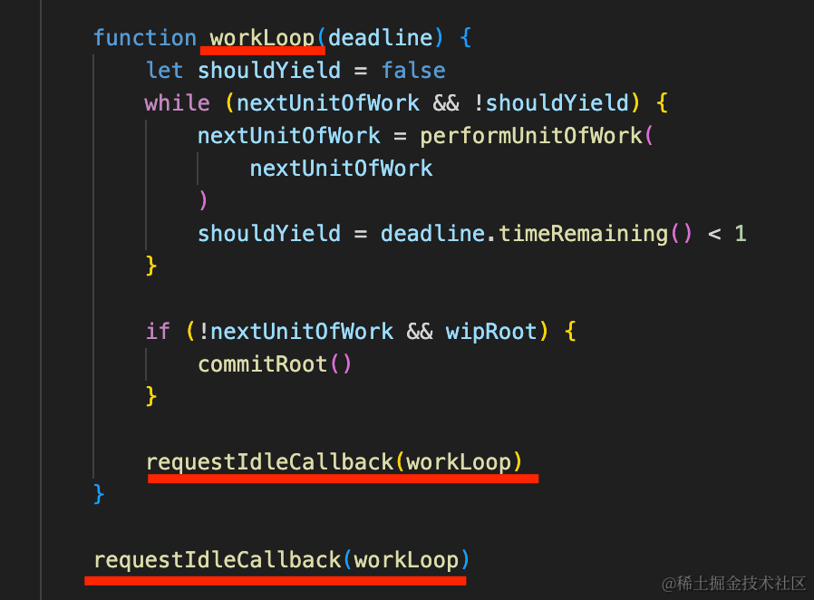

用 nextUnitOfWork 指向下一个要处理的 fiber 节点。

每次跑的时候判断下 timeRemaing 是否接近 0，是的话就中断循环，等下次 requestIdleCallback 的回调再继续处理 nextUnitOfWork 指向的 fiber 节点。

这里的 deadline.timeRemaing 是 requestIdleCallback 提供的，详细了解可以看下 [MDN 的文档](https://developer.mozilla.org/zh-CN/docs/Web/API/Background_Tasks_API#%E7%A4%BA%E4%BE%8B)。

render 方法里设置初始 nextUnitOfWork。

这里有两个 root，一个是当前正在处理的 fiber 链表的根 wipRoot，一个是之前的历史 fiber 链表的根 currentRoot。

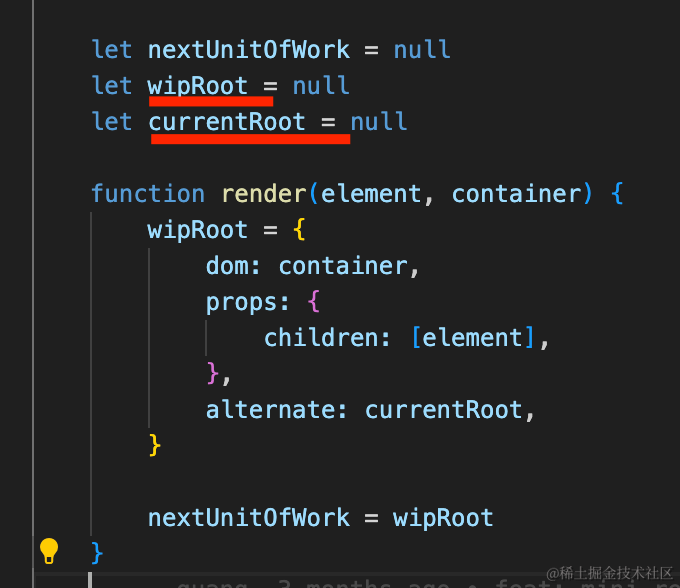

为什么有两个 root 呢？

因为初始渲染会生成一个 fiber 链表，然后后面 setState 更新会再生成一个新的 fiber 链表，两个 fiber 链表要做一些对比里决定对 dom 节点的增删改，所以都要保存。

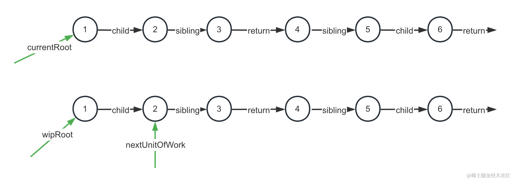

而 performUnitOfWork 处理每个 fiber 节点之后，会按照 child、sibling、return 的顺序返回下一个要处理的 fiber 节点：

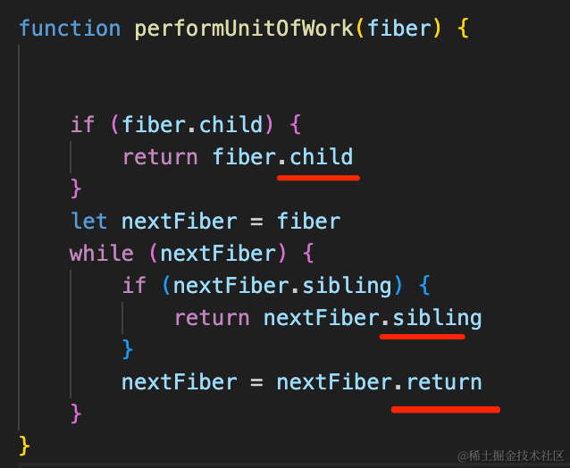

就是通过这种顺序来把 fiber 树变为链表的：

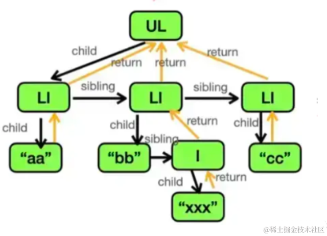

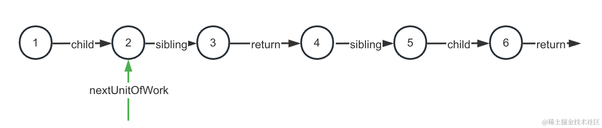

处理每个 fiber 节点的时候，要根据类型做不同的处理：

```javascript
function performUnitOfWork(fiber) {
    const isFunctionComponent = fiber.type instanceof Function
    if (isFunctionComponent) {
        updateFunctionComponent(fiber)
    } else {
        updateHostComponent(fiber)
    }
    if (fiber.child) {
        return fiber.child
    }
    let nextFiber = fiber
    while (nextFiber) {
        if (nextFiber.sibling) {
            return nextFiber.sibling
        }
        nextFiber = nextFiber.parent
    }
}

let wipFiber = null
let stateHookIndex = null

function updateFunctionComponent(fiber) {
  wipFiber = fiber
  stateHookIndex = 0
  wipFiber.stateHooks = []
  wipFiber.effectHooks = []

  const children = [fiber.type(fiber.props)]
  reconcileChildren(fiber, children)
}

function updateHostComponent(fiber) {
    if (!fiber.dom) {
        fiber.dom = createDom(fiber)
    }
    reconcileChildren(fiber, fiber.props.children)
}

```
判断下是函数组件（FunctionComponent），还是原生标签（HostComponent），分别做处理。

函数组件就是传入 props 调用它，并且函数组件的返回值就是要继续 reconcile 的节点。

这里用 wipFiber 指向当前处理的 fiber（之前的 nextUnitOfWork 是指向下一个要处理的 fiber 节点）

然后用一个 stateHooks 数组来存储 useState 的 hook 的值，用 effectHooks 数组存储 useEffect 的 hook 的值。

对于原生标签（HostComponent），就是创建它对应的 dom 节点。

具体创建 dom 的过程如下：

```javascript
function createDom(fiber) {
    const dom =
      fiber.type == "TEXT_ELEMENT"
        ? document.createTextNode("")
        : document.createElement(fiber.type)
  
    updateDom(dom, {}, fiber.props)
  
    return dom
}

const isEvent = key => key.startsWith("on")
const isProperty = key => key !== "children" && !isEvent(key)
const isNew = (prev, next) => key => prev[key] !== next[key]
const isGone = (prev, next) => key => !(key in next)

function updateDom(dom, prevProps, nextProps) {
  //Remove old or changed event listeners
  Object.keys(prevProps)
    .filter(isEvent)
    .filter(
      key => !(key in nextProps) || isNew(prevProps, nextProps)(key)
    )
    .forEach(name => {
      const eventType = name.toLowerCase().substring(2)
      dom.removeEventListener(eventType, prevProps[name])
    })

  // Remove old properties
  Object.keys(prevProps)
    .filter(isProperty)
    .filter(isGone(prevProps, nextProps))
    .forEach(name => {
      dom[name] = ""
    })

  // Set new or changed properties
  Object.keys(nextProps)
    .filter(isProperty)
    .filter(isNew(prevProps, nextProps))
    .forEach(name => {
      dom[name] = nextProps[name]
    })

  // Add event listeners
  Object.keys(nextProps)
    .filter(isEvent)
    .filter(isNew(prevProps, nextProps))
    .forEach(name => {
      const eventType = name.toLowerCase().substring(2)
      dom.addEventListener(eventType, nextProps[name])
    })
}
```
首先，根据是文本节点还是元素节点用 document.createElement 或 document.createTextNode 来创建。

然后更新 props。

首先删除旧的事件监听器，旧的属性，然后添加新的属性、新的事件监听器。

这样函数组件和原生标签的 reconcile 就处理完了。

继续处理它们的子节点：

```javascript
function reconcileChildren(wipFiber, elements) {
    let index = 0
    let oldFiber = wipFiber.alternate?.child
    let prevSibling = null

    while ( index < elements.length || oldFiber != null) {
        const element = elements[index]
        let newFiber = null

        const sameType = element?.type == oldFiber?.type

        if (sameType) {
            newFiber = {
                type: oldFiber.type,
                props: element.props,
                dom: oldFiber.dom,
                return: wipFiber,
                alternate: oldFiber,
                effectTag: "UPDATE",
            }
        }
        if (element && !sameType) {
            newFiber = {
                type: element.type,
                props: element.props,
                dom: null,
                return: wipFiber,
                alternate: null,
                effectTag: "PLACEMENT",
            }
        }
        if (oldFiber && !sameType) {
            oldFiber.effectTag = "DELETION"
            deletions.push(oldFiber)
        }

        if (oldFiber) {
            oldFiber = oldFiber.sibling
        }

        if (index === 0) {
            wipFiber.child = newFiber
        } else if (element) {
            prevSibling.sibling = newFiber
        }

        prevSibling = newFiber
        index++
    }
}
```
当时 wipRoot 我们就制定了 alternate，也就是之前的 fiber 树，这样当 reconcile 创建新的 fiber 树的时候，就可以和之前的做 diff，判断是新增、修改、删除，打上对应的标记。

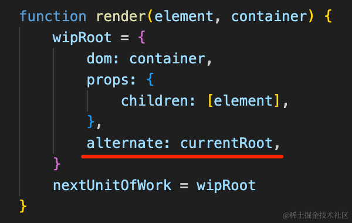

首先，拿到 alternate 的 child，依次取 sibling，逐一和新的 fiber 节点对比。

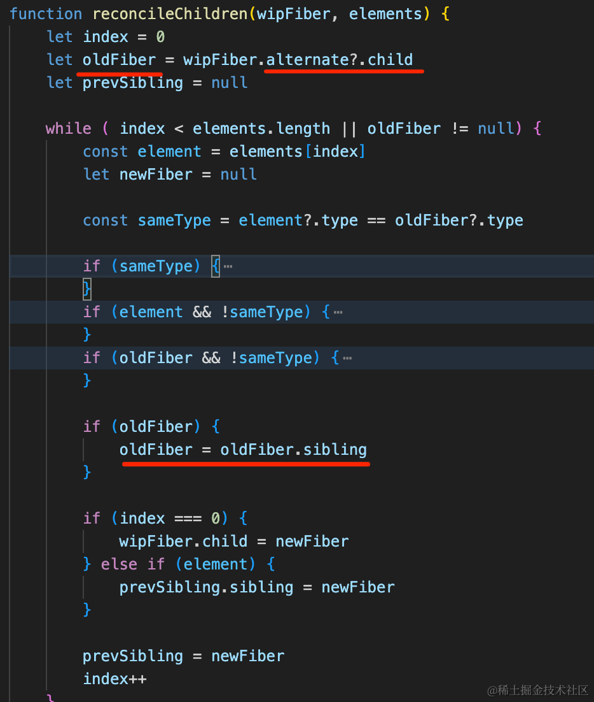

然后根据对比结果来创建新的 fiber 节点，也是先 child 后 sibling 的方式：

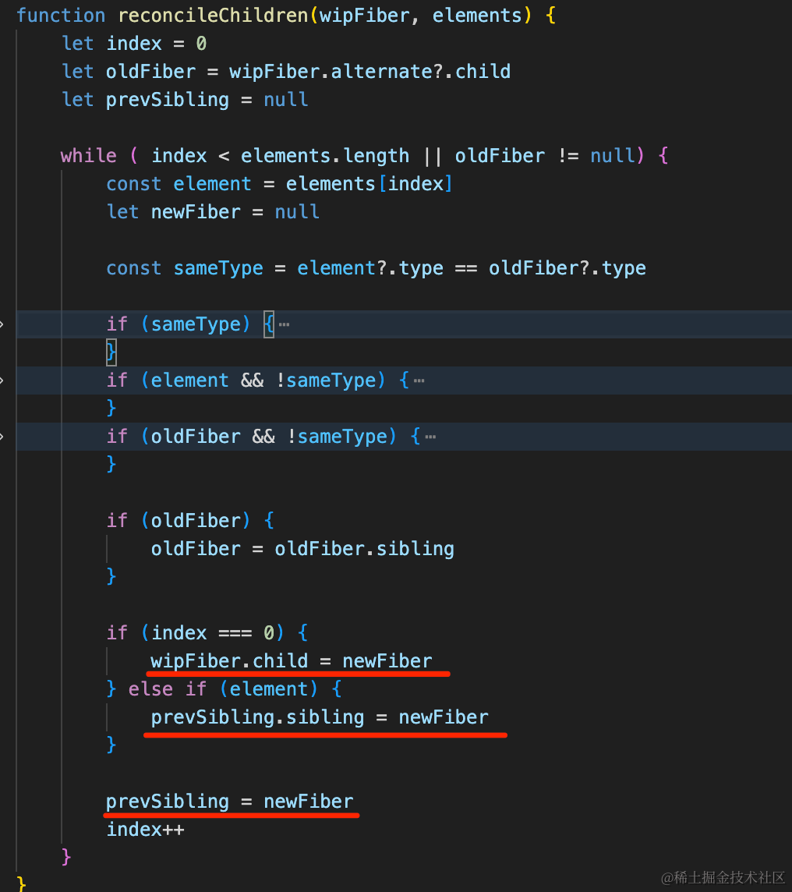

这样遍历之前的 fiber 链表和生成新的 fiber 链表的原因，看图很容易搞懂：

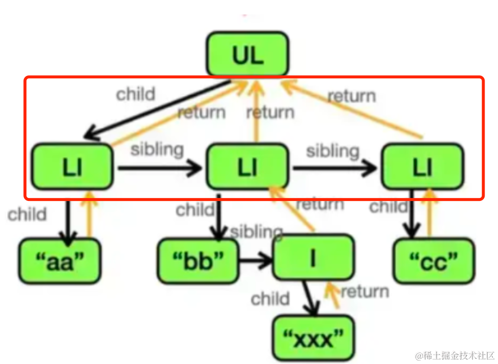

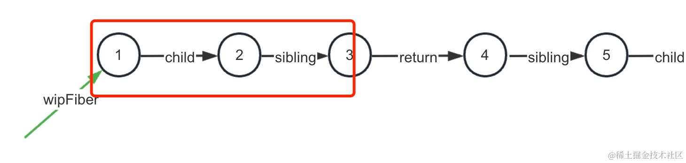

然后 diff 两个 fiber 链表，就是判断节点 type 是不是一样。

如果一样，就是修改，不一样，那就是删除或者新增，搭上对应的标记：

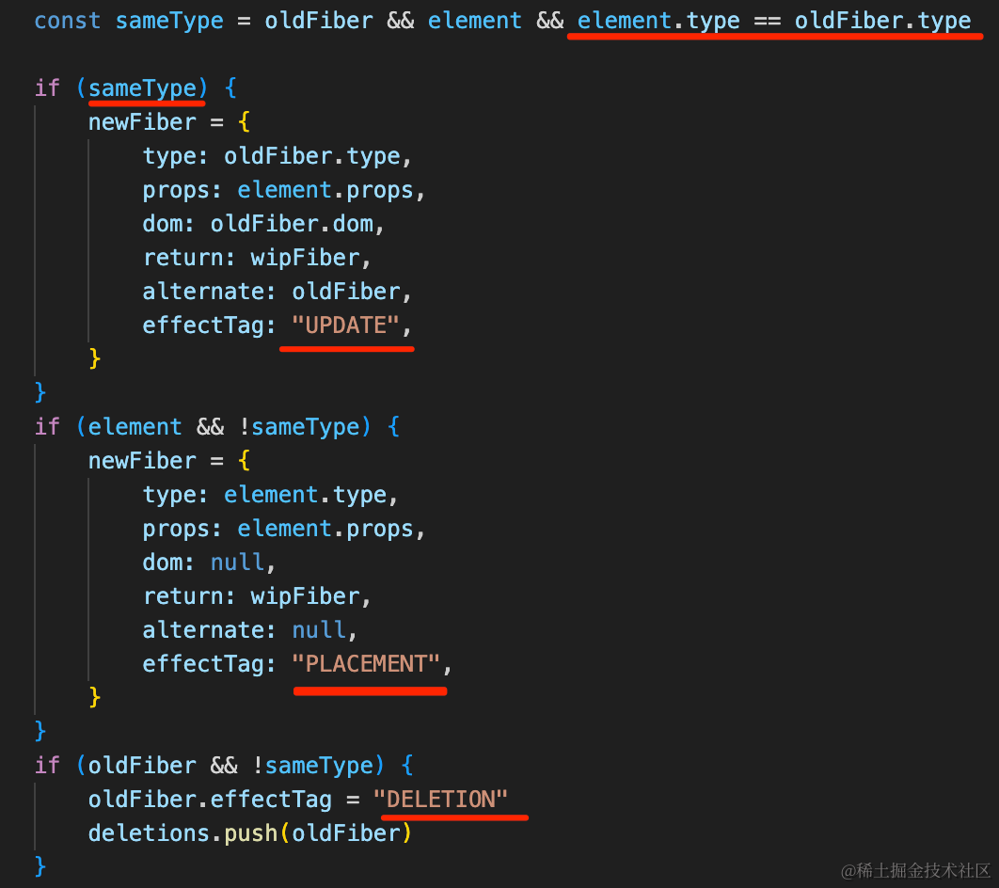

fiber 节点的 type、props 就是类型和参数。

dom 是对应的 dom 节点，

alternate 是对应的旧的 fiber 节点。

effectTag 是增删改的标记。

这里的 delections 数组，也就是要删除的节点，在 render 的时候初始化：

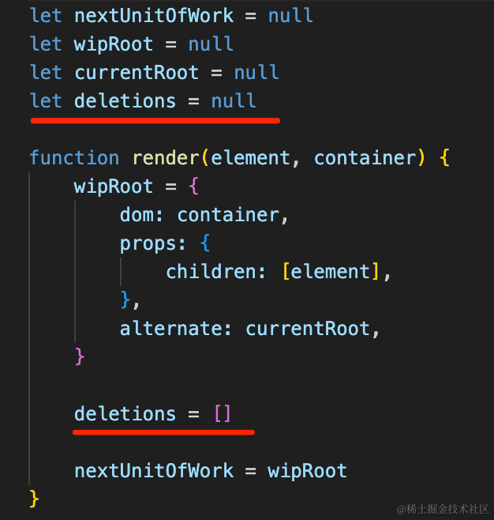

```javascript
let nextUnitOfWork = null
let wipRoot = null
let currentRoot = null
let deletions = null

function render(element, container) {
    wipRoot = {
        dom: container,
        props: {
            children: [element],
        },
        alternate: currentRoot,
    }
    
    deletions = []

    nextUnitOfWork = wipRoot
}
```
这样，从 wipRoot 开始，逐渐 reconcile 构建新的 fiber 节点，根据 FunctionComponent 还是原生标签（HostComponent）来分别执行函数和创建 dom，并且还对新旧的 fiber 节点做了 diff，搭上增删改标记。

reconcile 结束，新的 fiber 链表就创建好了。

其中，函数组件可能会调用 useState 或者 useEffect 的 api，我们也要实现一下：

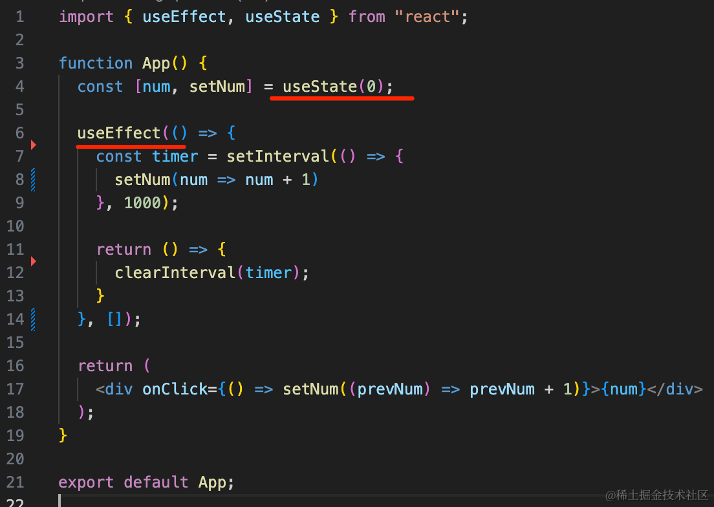

首先，useState 的 state 和 useEffect 的 effect 存在哪里呢？

肯定是在 fiber 上。

比如用两个数组 stateHooks 和 effectHooks 分别来存储：

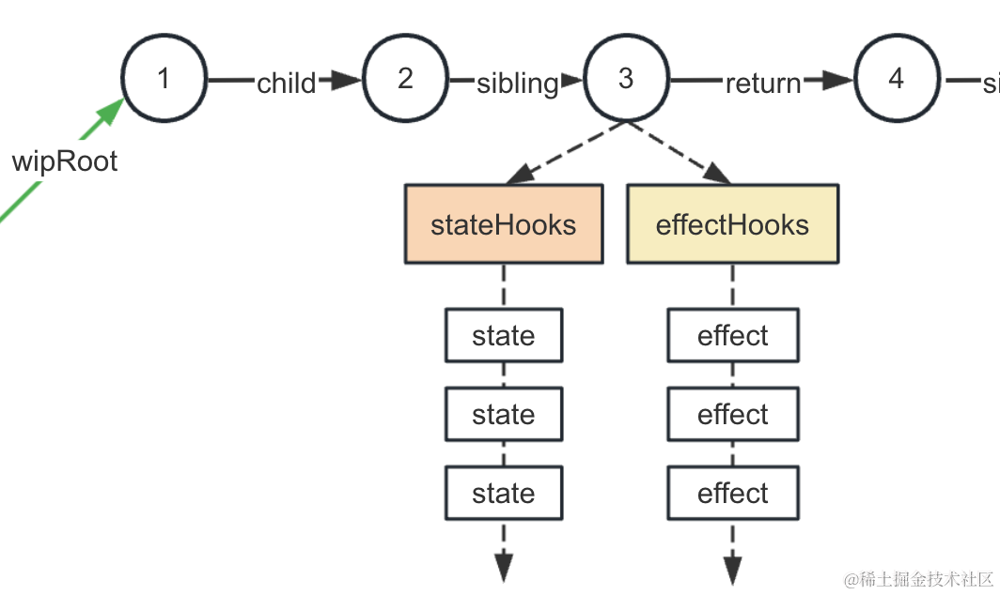

先实现 useState：

```javascript
function useState(initialState) {
    const currentFiber = wipFiber;

    const oldHook = wipFiber.alternate?.stateHooks[stateHookIndex];

    const stateHook = {
      state: oldHook ? oldHook.state : initialState,
      queue: oldHook ? oldHook.queue : [],
    };

    stateHook.queue.forEach((action) => {
      stateHook.state = action(stateHook.state);
    });

    stateHook.queue = [];

    stateHookIndex++;
    wipFiber.stateHooks.push(stateHook);

    function setState(action) {
      const isFunction = typeof action === "function";

      stateHook.queue.push(isFunction ? action : () => action);

      wipRoot = {
        ...currentFiber,
        alternate: currentFiber,
      };
      nextUnitOfWork = wipRoot;
    }

    return [stateHook.state, setState];
}
```
我们在 fiber 节点上用 stateHooks 数组来存储 state，还有多次调用 setState 的回调函数。

比如这样：


那 state 就是 0，然后 queue 里存了三个修改 state 的函数。

每次调用 useState 时会在 stateHooks 添加一个元素来保存 state：


state 的初始值是前面一次渲染的 state 值，也就是取 alternate 的同一位置的 state：

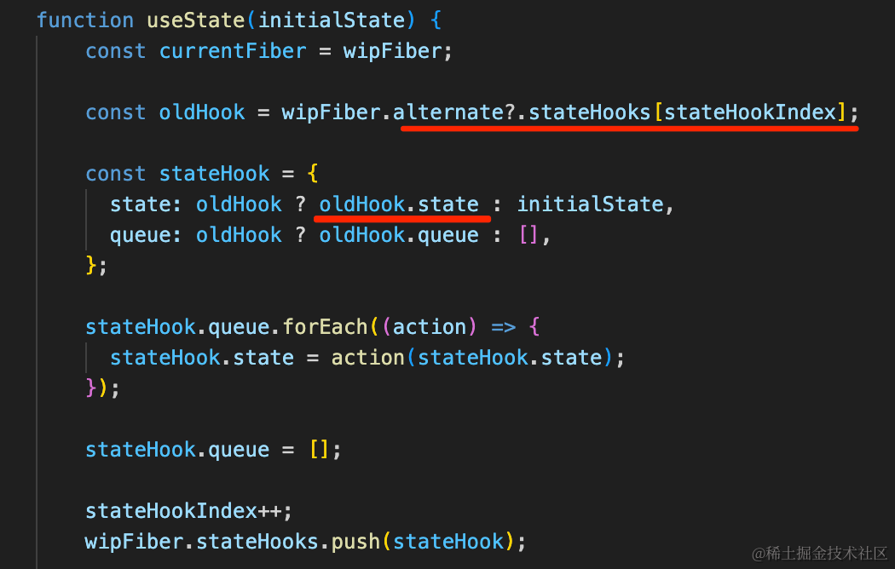

这样对初始 state 执行多个 action（也就是 setState） 之后，就拿到了最终的 state 值。

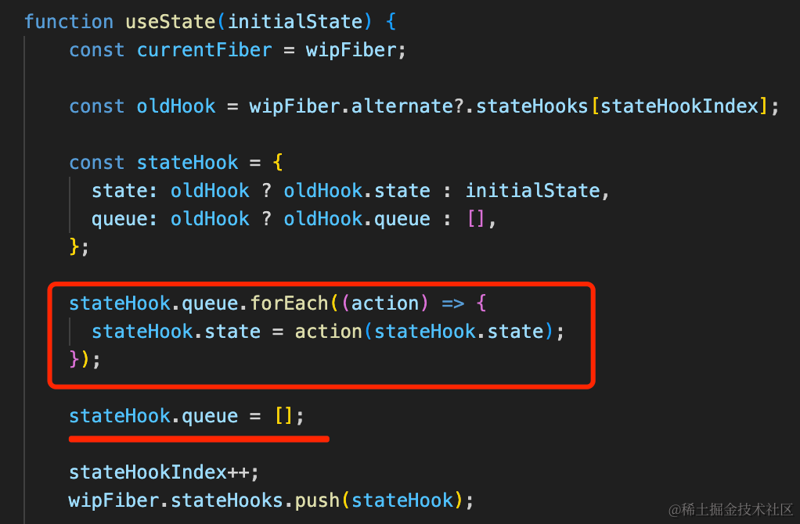

修改完 state 之后清空 queue。

比如这里初始 state 是 0，调用三次 action 之后，state 变为 3：

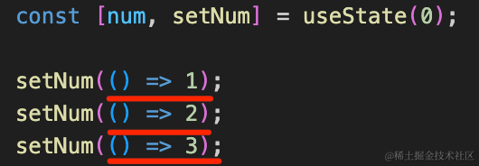

然后 setState 就是在 action 数组里添加新的 action，并且让 nextUnitOfWork 指向新的 wipRoot，从而开始新的一轮渲染：

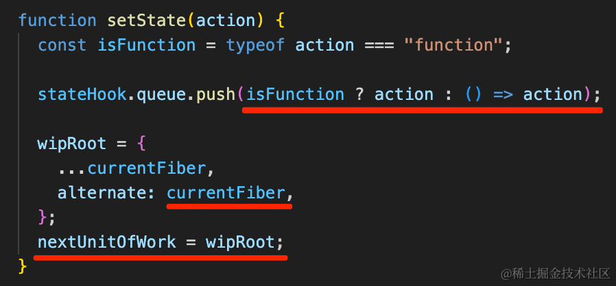

然后是 useEffect：

```javascript
function useEffect(callback, deps) {
  const effectHook = {
    callback,
    deps,
    cleanup: undefined,
  };
  wipFiber.effectHooks.push(effectHook);
}
```
它就是在 fiber.effectHooks 上添加一个元素。

这样，等 reconcile 结束，fiber 链表就构建好了，在 fiber 上打上了增删改的标记，并且也保存了要执行的 effect。

接下来只要遍历这个构建好的 fiber 链表，执行增删改和 effect 函数就好了。

这个阶段是 commit。

前面讲过，requestIdleCallback 在不断进行，每次处理一部分 fiber 的 reconcile。

我们只要在 reconcile 结束，也就是没有 nextUnitOfWork 的时候执行 commit 就行了：

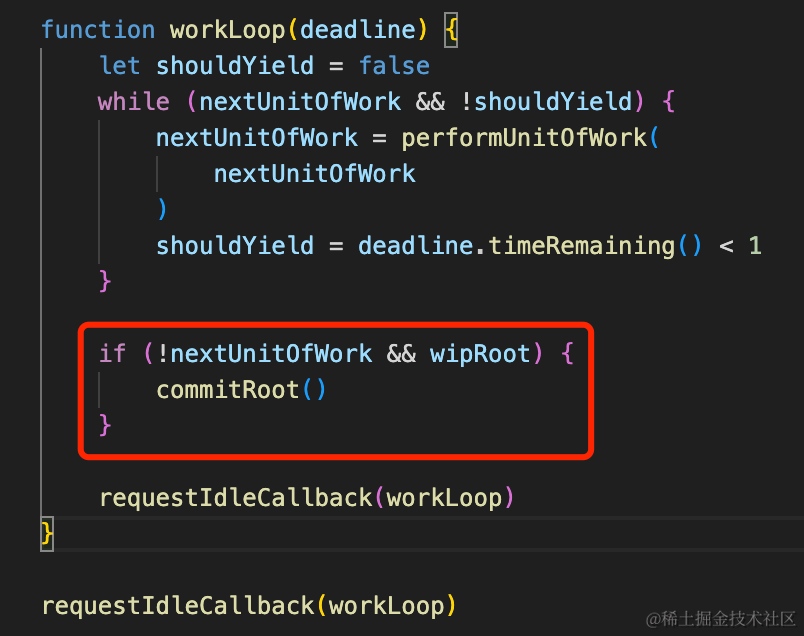

```javascript
if (!nextUnitOfWork && wipRoot) {
    commitRoot()
}
```
在 commitRoot 里，我们先把需要删除的节点都删掉，然后遍历 fiber 链表，处理其它节点：

```javascript
function commitRoot() {
    deletions.forEach(commitWork)
    commitWork(wipRoot.child)
    currentRoot = wipRoot
    wipRoot = null
    deletions = []
}
```
这里要把当前 wipRoot 设置为 currentRoot，然后把它置空，这就代表这次 reconcile 结束了。

处理完之后还要把 deletions 数组里保存的要删除的节点置空，这时候已经删除了。

```javascript
function commitWork(fiber) {
    if (!fiber) {
        return
    }


    commitWork(fiber.child)
    commitWork(fiber.sibling)
}
```

commitWork 按照 child、sibling 的顺序来递归遍历 fiber 链表。

```javascript
function commitWork(fiber) {
    if (!fiber) {
        return
    }

    let domParentFiber = fiber.return
    while (!domParentFiber.dom) {
        domParentFiber = domParentFiber.return
    }
    const domParent = domParentFiber.dom

    if (fiber.effectTag === "PLACEMENT" && fiber.dom != null) {
        domParent.appendChild(fiber.dom)
    } else if (fiber.effectTag === "UPDATE" && fiber.dom != null) {
        updateDom(fiber.dom, fiber.alternate.props, fiber.props)
    } else if (fiber.effectTag === "DELETION") {
        commitDeletion(fiber, domParent)
    }

    commitWork(fiber.child)
    commitWork(fiber.sibling)
}
```
首先，不断向上找，找到可以挂载的 dom 节点。

然后按照增增删改的 effectTag 来分别做处理。

```javascript
function commitDeletion(fiber, domParent) {
    if (fiber.dom) {
        domParent.removeChild(fiber.dom)
    } else {
        commitDeletion(fiber.child, domParent)
    }
}
```
删除的时候，如果当前 fiber 节点没有对应的 dom，就不断 child 向下找。

这样遍历完一遍之后，dom 的增删改就完成了。

此外，我们还需要处理 effect。

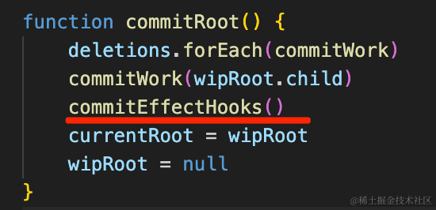

它同样要遍历 fiber 链表：

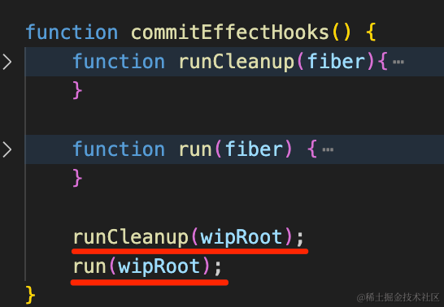

先遍历一遍执行所有的 cleanup 函数，然后再次遍历执行 effect 函数。

```javascript
function commitEffectHooks() {
    function runCleanup(fiber){
        if (!fiber) return;

        fiber.alternate?.effectHooks?.forEach((hook, index)=>{
            const deps = fiber.effectHooks[index].deps;

            if (!hook.deps || !isDepsEqual(hook.deps, deps)) {
                hook.cleanup?.();
            }
        })

        runCleanup(fiber.child);
        runCleanup(fiber.sibling);
    }

    function run(fiber) {
        if (!fiber) return;
  
        fiber.effectHooks?.forEach((newHook, index) => {
            if(!fiber.alternate) {
                hook.cleanup = hook.callback();
                return;
            }

            if(!newHook.deps) {
                hook.cleanup = hook.callback();
            }

            if (newHook.deps.length > 0) {
                const oldHook = fiber.alternate?.effectHooks[index];

                if(!isDepsEqual(oldHook.deps, newHook.deps)) {
                    newHook.cleanup = newHook.callback()
                }
            }
        });

        run(fiber.child);
        run(fiber.sibling);
    }
  
    runCleanup(wipRoot);
    run(wipRoot);
}

function isDepsEqual(deps, newDeps) {
    if(deps.length !== newDeps.length) {
        return false;
    }

    for(let i = 0; i < deps.length; i++) {
        if(deps[i] !== newDeps[i]) {
            return false;
        }
    }
    return true;
}

```
这里遍历 fiber 链表也是递归处理每个节点，每个节点递归处理 child、sibling。

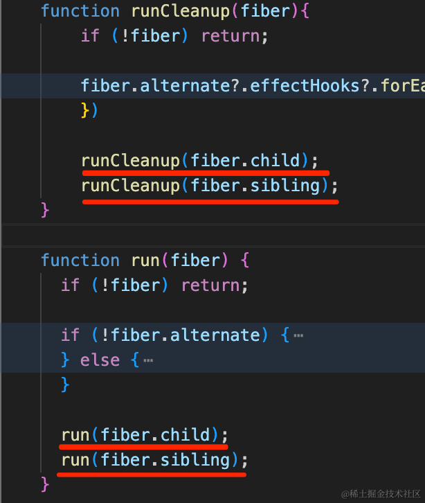

当没有传入 deps 数组，或者 deps 数组和上次不一致时，就执行 cleanup 函数。

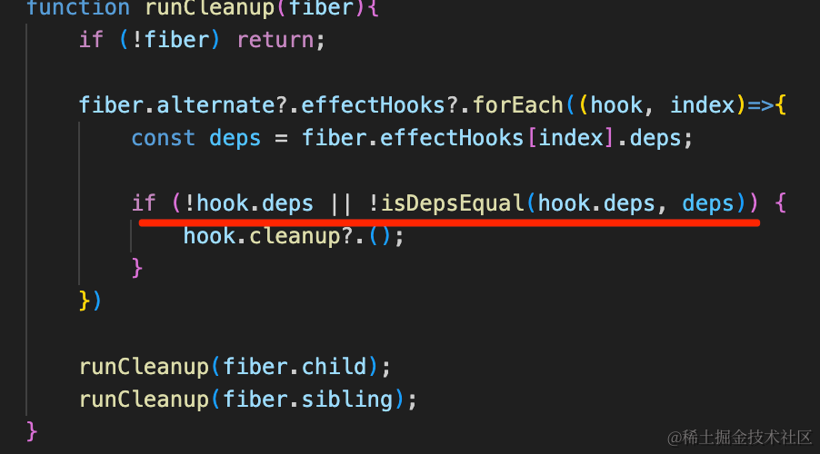

比如这样：
```javascript
useEffect(() => {
    const timer = setTimeout(() => {
    
    }, 1000);
    return () => clearTimeout(timer);
})
```
当没有传入 deps 或者 deps 数组变化的时候，会执行上次的 clearTimeout。

之后才会重新执行 effect：

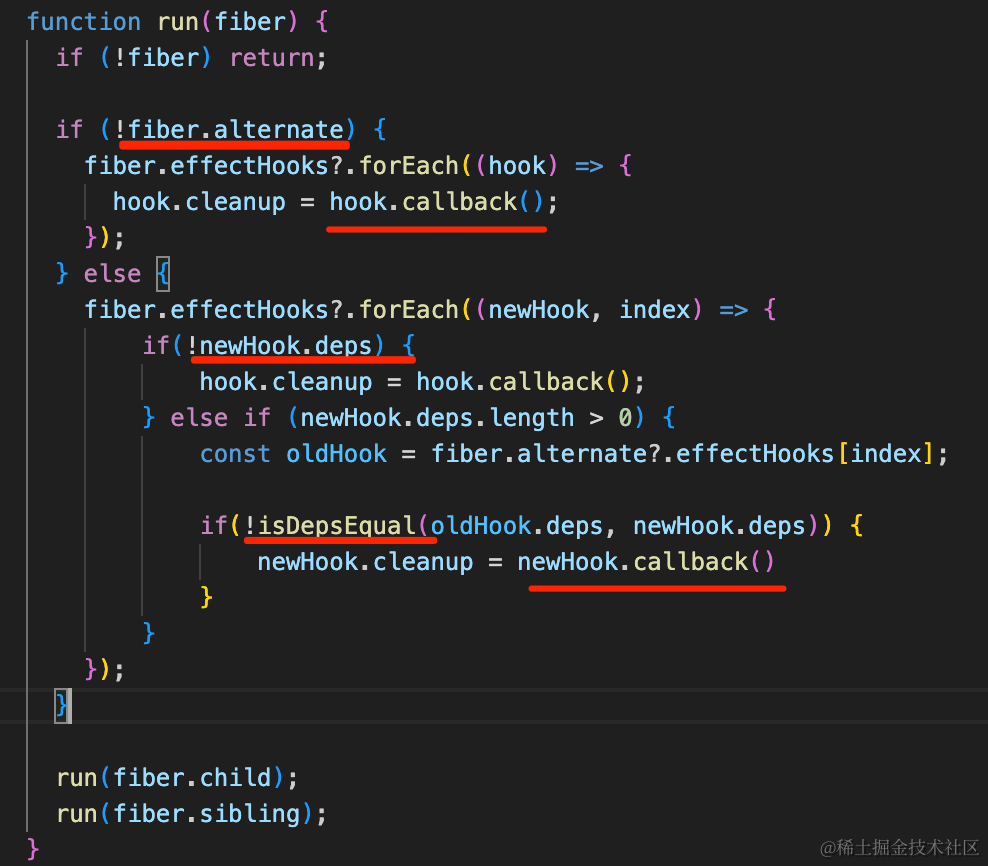

当没有 alternate 的时候，就是首次渲染，直接执行所有的 effect。

否则，如果没传入 deps 或者 deps 数组变化的时候再执行 effect 函数：

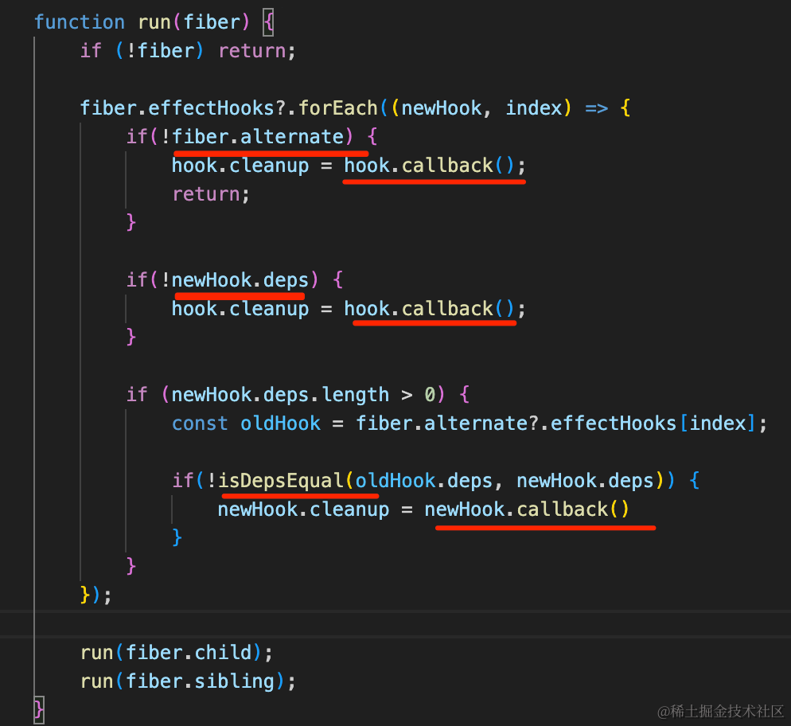

这样，commit 阶段，我们遍历 fiber 链表做的 dom 的增删改，执行了 effect 函数。

至此，react 的渲染流程的两大阶段 render 和 commit 就完成了。

导出 render、useState、useEffect 的 api：

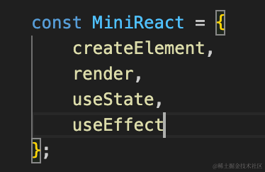

然后外面包一层函数，避免污染全局变量：

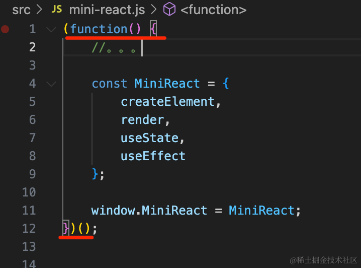

我们整体测试下：

改下 index.jsx

```javascript
const { render, useState, useEffect } = window.MiniReact;

function App() {
  const [count,setCount] = useState(0)
 
  function handleClick(){
    setCount((count)=> count + 1)
  }

  return <div>
    <p>{count}</p>
    <button onClick={handleClick}>加一</button>
  </div>;
}

render(<App/>, document.getElementById('root'));
```
测试下：

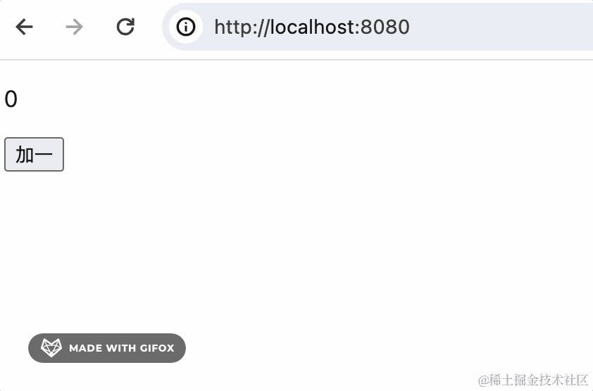

没啥问题。

再测试下 useEffect：

```javascript
const { render, useState, useEffect } = window.MiniReact;

function App() {
  const [count,setCount] = useState(0)

  useEffect(() => {
    const timer = setInterval(() => {
        setCount((count)=> count + 1)
    }, 1000);
    return () => clearTimeout(timer);
  }, []);

  return <div>
    <p>{count}</p>
  </div>;
}

render(<App/>, document.getElementById('root'));
```

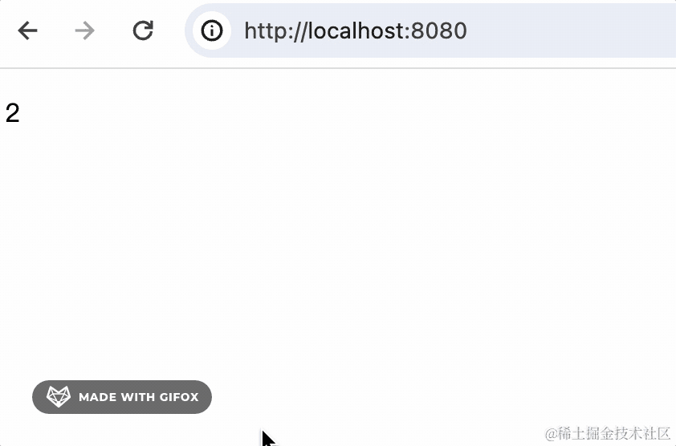

也没啥问题。

然后我们抽离一个组件，传入初始值和定时器的时间间隔：

```javascript
const { render, useState, useEffect } = window.MiniReact;

function Counter(props) {
  const {
    initialNum,
    interval
  } = props;

  const [count, setCount] = useState(initialNum)

  useEffect(() => {
    const timer = setInterval(() => {
        setCount((count)=> count + 1)
    }, interval);
    return () => clearTimeout(timer);
  }, []);

  return <div>
    <p>{count}</p>
  </div>;
}

function App() {
  return <Counter interval={1000} initialNum={10}></Counter>
}

render(<App/>, document.getElementById('root'));
```
Counter 组件有 interval 和 initialNum 两个参数。

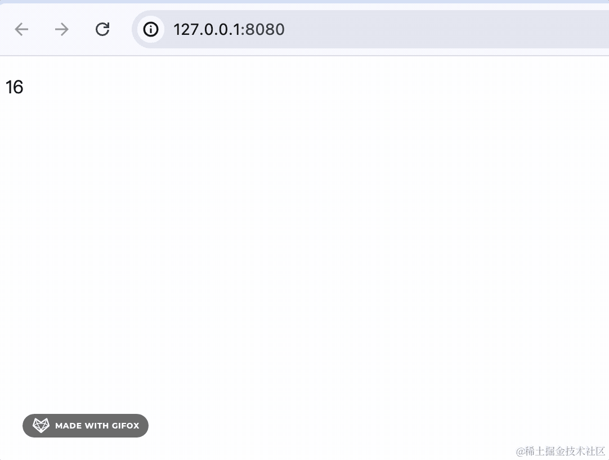

也没问题。

这样，我们的 mini react 就完成了。

案例代码上传了[小册仓库](https://github.com/QuarkGluonPlasma/react-course-code/tree/main/mini-react)。

## 总结

我们 React 的渲染流程来实现了下 mini react。

JSX 转 render function 这步是 babel 或 tsc 等编译器做的。

我们实现 React.createElement 函数，那执行后返回的就是 React Element 树，也就是 vdom。

通过 requestIdleCallback 在空闲时执行 React Element 转 fiber 的 reconcile 流程。

按照函数组件 FunctionComponent 或者原生标签 HostComponent 分别执行函数或者创建 dom。

reconcile 到子节点的时候要和 alternate 对比，判断是新增、修改还是删除，打上标记。

这个过程中如果调用了 useState 或者 useEffect 会在对应 fiber 节点的 hooks 数组上添加一些元素。

之后进入 commit 阶段，从根节点开始遍历 fiber 链表，根据标记来执行 dom 的增删改，以及执行 effect 函数。

然后 useState 的 setState 会设置新的 nextUnitOfWork，从而触发新的一轮渲染流程。

这样，和 React 的真实渲染流程类似的 mini react 就完成了。
