# 第65章—React18的并发机制是怎么实现的

React 18 最主要的特性就是并发了，很多 api 都是基于并发特性实现的。

那为什么 React 要实现并发？什么是并发？又是怎么实现的呢？

这节我们就一起来探究一下。

首先，我们过一遍 React 渲染的流程：

## React 渲染流程

React 是通过 JSX 描述页面的，JSX 编译成 render function（也就是 React.createElement 等），执行之后产生 vdom。


vdom 是指 React Element 的对象树：

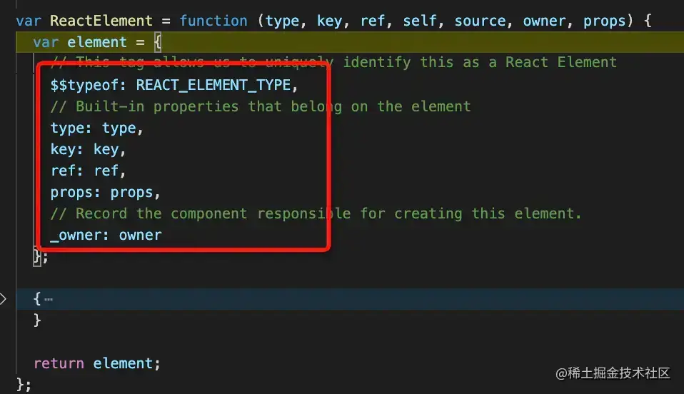

之后这个 vdom 会转换为 fiber 结构：

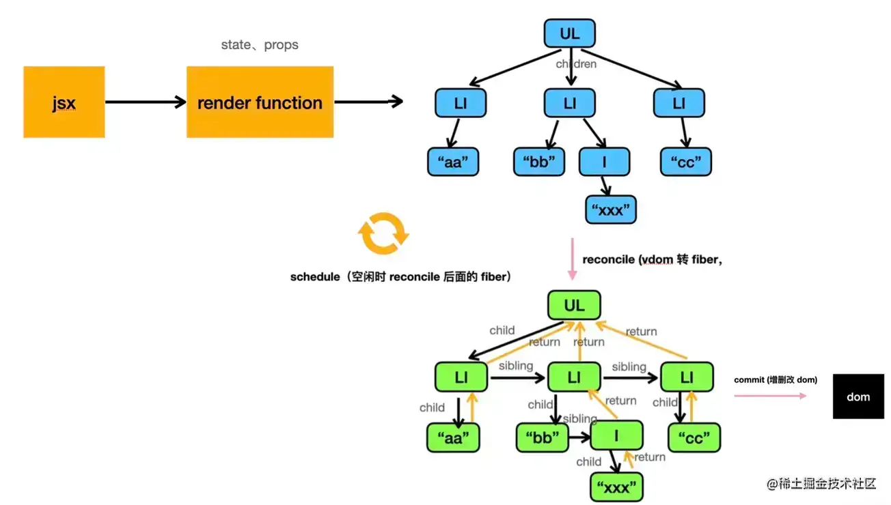

vdom 是通过 children 关联子节点，而 fiber 通过 child、sibling、return 关联了父节点、子节点、兄弟节点。

从 vdom 转 fiber 的过程叫做 reconcile，这个过程还会创建用到的 dom 节点，并且打上增删改的标记。

这个 reconcile 的过程叫做 render 阶段。


之后 commit 阶段会根据标记来增删改 dom。

commit 阶段也分为了 3 个小阶段，before mutation、mutation、layout。

mutation 阶段会增删改 dom，before mutation 是在 dom 操作之前，layout 是在 dom 操作之后。

综上，React 整体的渲染流程就是 render（reconcile 的过程） + commit（执行增删改 dom 和 effect、生命周期函数的执行、ref 的更新等）。

当你 setState 之后，就会触发一次渲染的流程，也就是上面的 render + commit。

当然，除了 setState 之外，入口处的 ReactDOM.render 还有函数组件里的 useState 也都能触发渲染。

那么问题来了，如果同时有多个 setState 触发的渲染，怎么处理呢？

## 同步 vs 并发

每次 setState 都会进行上面的那个 render + commit 的渲染流程，多次那就顺序处理不就行了？

这样是能满足功能的，也就是同步模式。

但是有个问题，比如用户在 input 输入内容的时候，会通过 setState 设置到状态里，会触发重新渲染。

这时候如果还有一个列表也会根据 input 输入的值来处理显示的数据，也会 setState 修改自己的状态。

这两个 setState 会一起发生，那么同步模式下也就会按照顺序依次执行。

但如果这个渲染流程中处理的 fiber 节点比较多，渲染一次就比较慢，这时候用户输入的内容可能就不能及时的渲染出来，用户就会感觉卡，体验不好。

怎么解决这个问题呢？

能不能指定这俩 setState 的重要程度不一样，用户输入的 setState 的更新重要程度更高，如果有这种更新就把别的先暂停，执行这次更新，执行完之后再继续处理。

React 18 里确实实现了这样一套并发的机制，这里的重要程度就是优先级，也就是基于优先级的可打断的渲染流程。

React 会把 vdom 树转成 fiber 链表，因为 vdom 里只有 children，没有 parent、sibling 信息，而 fiber 节点里有，这样就算打断了也可以找到下一个节点继续处理。fiber 结构就是为实现并发而准备的。

按照 child、sibling、sibling、return、sibling、return 之类的遍历顺序，可以把整个 vdom 树变成线性的链表结构，一个循环就可以处理完。


循环处理每个 fiber 节点的时候，有个指针记录着当前的 fiber 节点，叫做 workInProgress。

这个循环叫做 workLoop：


当然，上面这个是同步模式下的循环。

那并发模式下呢？

首先，并发和并行不一样，并行是同一时刻多件事情同时进行，而并发是只要一段时间内同时发生多件事情就行。

并发是通过交替执行来实现的，也就是这样：


上面是两个 setState 引起的两个渲染流程，先处理上面那次渲染的 1、2、3 的 fiber 节点，然后处理下面那次渲染的 1、2、3、4、5、6 的 fiber 节点，之后继续处理上面那次渲染的 4、5、6 的 fiber 节点。

这就是并发。

也就是在循环里多了个打断和恢复的机制，所以代码是这样的：


每处理一个 fiber 节点，都判断下是否打断，shouldYield 返回 true 的时候就终止这次循环。

那怎么恢复呢？

每次 setState 引起的渲染都是由 Scheduler 调度执行的，它维护了一个任务队列，上个任务执行完执行下个。

没渲染完的话，再加一个新任务进去不就行了？

判断是否是被中断的还是已经渲染完了，这个也很简单，当全部 fiber 节点都渲染完，那 workInProgress 的指针就是 null 了。

而如果是渲染到一半 yield 的，那 wip 就不是 null。

所以可以这样根据 wip 是否是 null 判断是否是中断了：

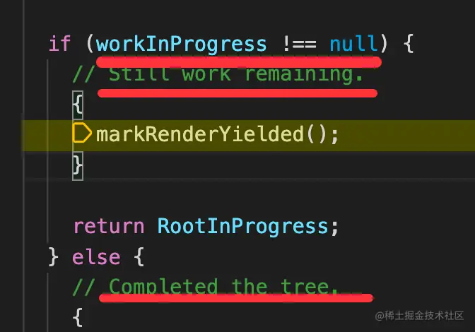

然后把剩下的节点 schdule 就好了。当再次 schedule 到这个任务，就会继续渲染。

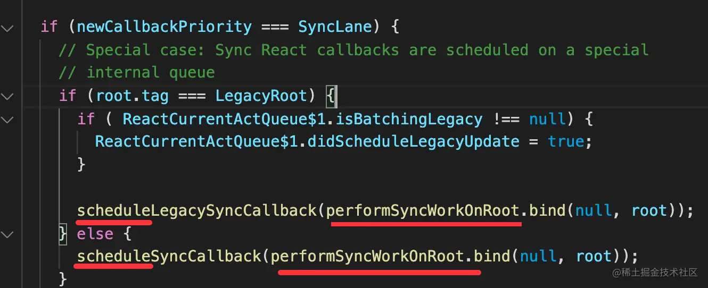

这就是并发模式的实现，也就是在 workLoop 里通过 shouldYield 的判断来打断渲染，之后把剩下的节点加入 Schedule 调度，来恢复渲染。

那 shouldYield 是根据什么来打断的呢？

根据过期时间，每次开始处理时记录个时间，如果处理完这个 fiber 节点，时间超了，那就打断。

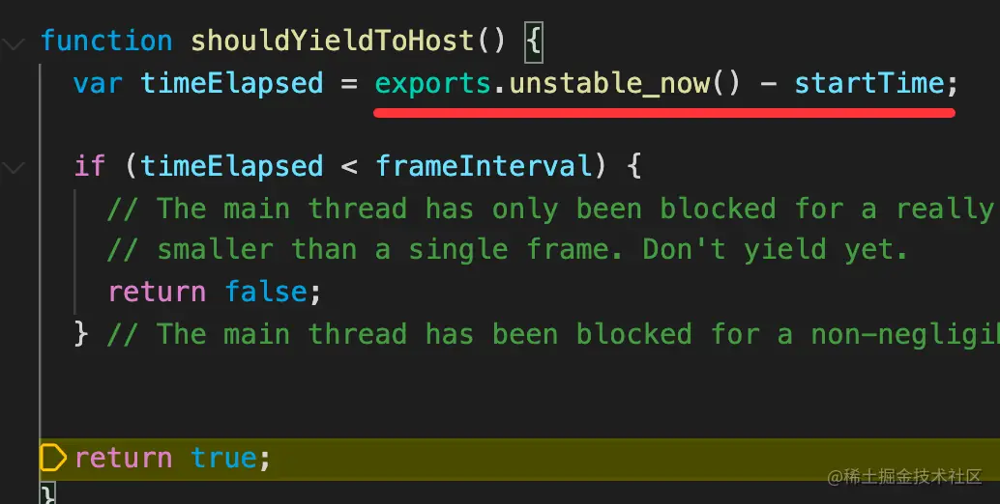

那优先级呢？不会根据任务优先级打断么？

并不会，优先级高低会影响 Scheduler 里的 taskQueue 的排序结果，但打断只会根据过期时间。

也就是时间分片的含义。

那这样就算并发了，不还是高优先级任务得不到即使执行？

那不会，因为一个时间分片是 5ms，所以按照按优先级排序好的任务顺序来执行，就能让高优先级任务得到及时处理。

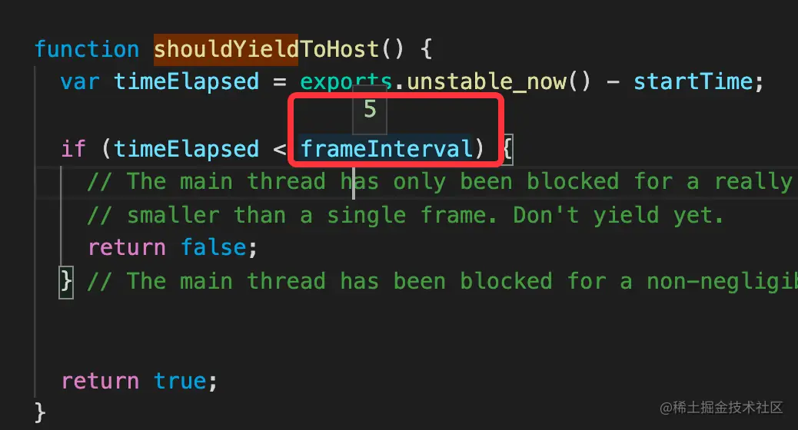

这个地方也是很多同学的误区，**react 的并发模式的打断只会根据时间片，也就是每 5ms 就打断一次，并不会根据优先级来打断，优先级只会影响任务队列的任务排序。**

那具体都有哪些优先级呢？

## react 里的优先级

首先，上面谈到的优先级是调度任务的优先级，有这 5 种：

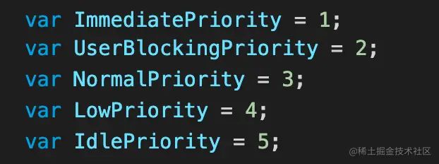

Immediate 是离散的一些事件，比如 click、keydown、input 这种。

UserBlocking 是连续的一些事件，比如 scroll、drag、mouseover 这种。

react 是这么划分的，离散的事件比连续事件优先级更高，这个倒是很容易理解。

然后是默认的优先级 NormalPriority、再就是低优先级 LowPriority，空闲优先级 IdlePriority。

Scheduler 会根据任务的优先级对任务排序来调度。

并发模式下不同的 setState 的优先级不同，就是通过指定 Scheduler 的优先级实现的。

但在 React 里优先级不是直接用这个。

因为 Schduler 是分离的一个包了，它的优先级机制也是独立的。

而且 React 有自己的一套优先级机制，那个分类可不止上面这 5 种，足足有 31 种，React 的那套优先级机制叫做 Lane。

31 种？那就是从 0 到 31 的数字呗 ？

并不是，react 是通过二机制的方式来保存不同优先级的：

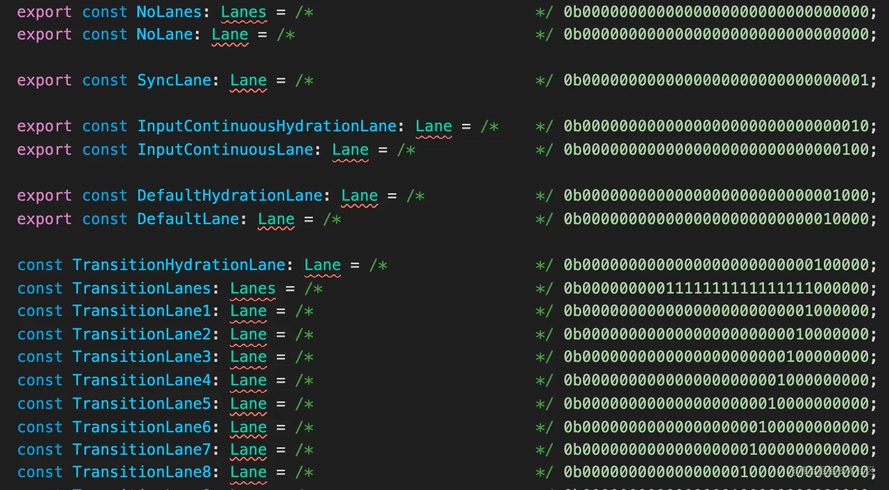

这样设计的好处，自然是可以用二进制运算快速得到是哪种优先级了：

比如按位与、按位或等：


这样性能会更好一点，位运算的性能肯定是最高的。

不过不好的地方是看这样的代码会绕一点。

那为啥就 Lane 呢？

Lane 是赛道的意思，看二进制的这种表示方式：


是不是就很像赛道：


这就是为啥 react 的优先级机制叫 Lane，就是形象地表示了这种二进制的优先级存储方式。

除了 react 的 lane 的优先级机制外，react 还给事件也区分了优先级：

- DiscreteEventPriority 离散事件优先级
- ContinuousEventPriority 连续事件优先级
- DefaultEventPriority 默认事件优先级
- IdleEventPriority 空闲事件优先级

事件的优先级会转化为 react 的 Lane 优先级，Lane 的优先级也可以转化为事件优先级。

那 react 通过 Scheduler 调度任务的时候，优先级是怎么转呢？

先把 Lane 转换为事件优先级，然后再转为 Scheduler 优先级。

为什么呢？

因为 Lane 的优先级有 31 个啊，而事件优先级那 4 个刚好和 Scheduler 的优先级对上。

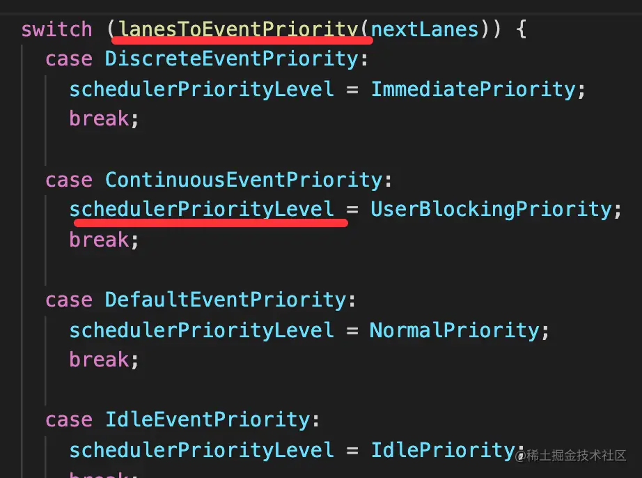

怎么实现的 Lane 优先级转 Event 优先级，那就是有几个分界点了：


也就是说，react 内部有 31 种 Lane 优先级，但是调度 Scheduler 任务的时候，会先转成事件优先级，然后再转成 Scheduler 的 5 种优先级。

知道了时间分片和优先级机制，那我们对 react 的并发模式的实现原理也就算比较了解了。

接下来看一些基于并发模式实现的 api：

## useTransition、useDeferredValue

前面介绍了两种 workLoop 的执行方式：

同步执行：


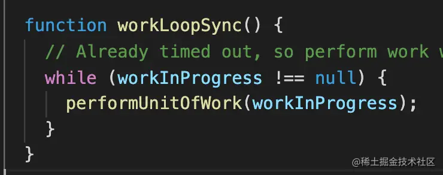

并发执行：

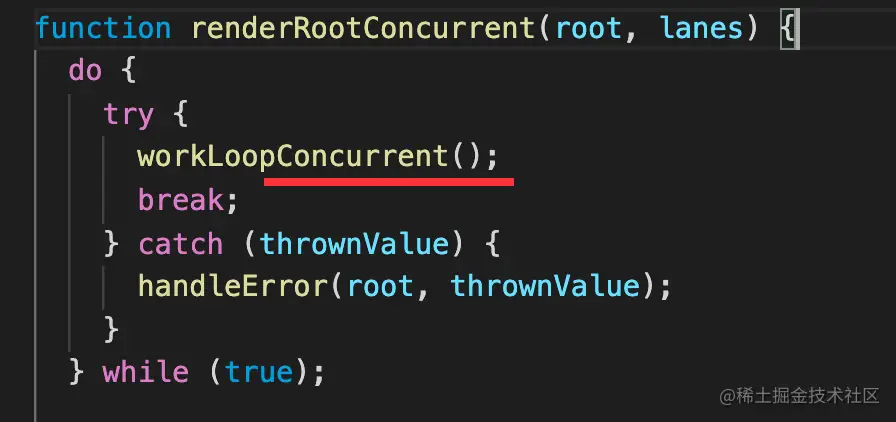


所谓的并发执行就是加了个 5ms 一次的时间分片。

react18 里同时存在着这两种循环方式，普通的循环和带时间分片的循环。

也不是所有的特性都要时间分片，只有部分需要。

那就如果这次 setState 更新里包含了并发特性，就是用 workLoopConcurrent，否则走 workLooSync 就好了。


如上，react 会根据 lane 来判断是否要开启时间分片。

看到这其实就能理解什么是并发特性的 api 了。

**所有能设置开启时间分片的 lane 的 api 都是基于并发的 api。**

比如 startTransition、useTransition、useDeferredValue 这些。

我们知道并发特性是可以给不同的 setState 标上不同的优先级的，怎么标呢？

就通过 trasition 的 api：

```javascript
import React, { useTransition, useState } from "react";

export default function App() {
  const [text, setText] = useState('guang');
  const [text2, setText2] = useState('guang2');

  const [isPending, startTransition] = useTransition()

  const handleClick = () => {
    startTransition(() => {
      setText('dong');
    });

    setText2('dong2');
  }

  return (
    <button onClick={handleClick}>{text}{text2}</button>
  );
}

```
比如上面有两个 setState，其中一个优先级高，另一个优先级低，那就把低的那个用 startTransition 包裹起来。

就可以实现高优先级的那个优先渲染。

怎么实现的呢？

我们来看下源码：

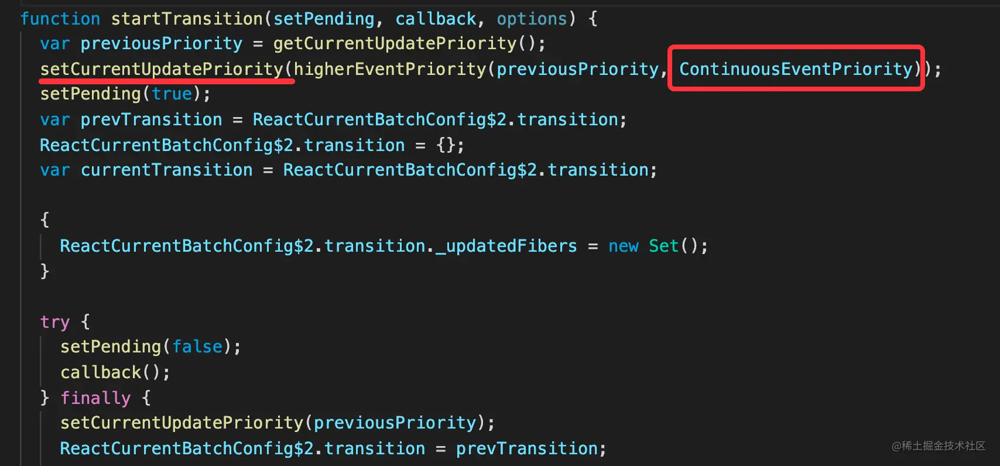

源码里是在调用回调函数之前设置了更新的优先级为 ContinuousEvent 的优先级，也就是连续事件优先级，比 DiscreteEvent 离散事件优先级更低，所以会比另一个 setState 触发的渲染的优先级低，在调度的时候排在后面。

这里设置的其实就是 Lane 的优先级：


那渲染的时候就会走 workLoopConcurrent 的带时间分片的循环，然后通过 Scheduler 对任务按照优先级排序，就实现了高优先级的渲染先执行的效果。

这就是 startTransition、useTransition 的用法和原理。

再就是 useDeferredValue 的 api，它的应用场景是这样的：

比如这样一段代码：

```javascript
function App() {
  const [text, setText] = useState("");

  const handleChange = (e) => {
    setText(e.target.value);
  };

  return (
    <div>
      <input value={text} onChange={handleChange}/>
      <List text={text}/>
    </div>
  );
};
```
List 里是根据输入的 text 来过滤结果展示的，现在每次输入都会触发渲染。

我们希望在内容输入完了再处理通知 List 渲染，就可以这样：

```javascript
function App() {
  const [text, setText] = useState("");
  const deferredText = useDeferredValue(text);

  const handleChange = (e) => {
    setText(e.target.value);
  };

  return (
    <div>
      <input value={text} onChange={handleChange}/>
      <List text={deferredText}/>
    </div>
  );
};
function 
```

对 state 用 useDeferredValue 包裹之后，新的 state 就会放到下一次更新。

这部分的源码看 react17 的比较容易理解：

react 17 里就是通过 useEffect 把这个值的更新时机延后了：

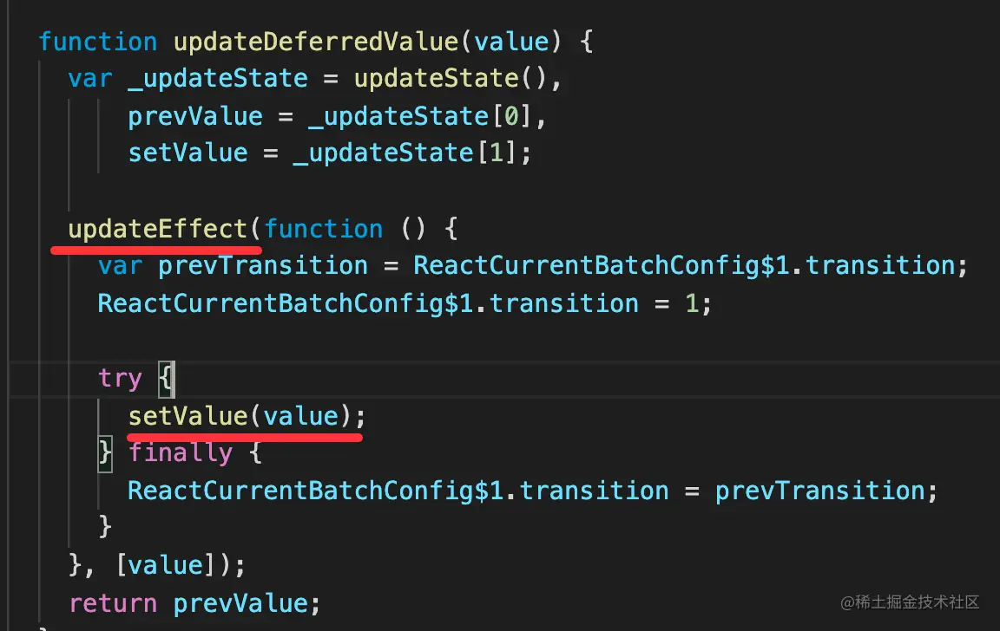

也就是其他的 setState 触发的 render 处理完了之后，在 commit 阶段去 setState，这就是 DeferedValue 的意思。

react 18 里也有这个 api，虽然功能一样，但实现变了，现在是基于并发模式的，通过 Lane 的优先级实现的延后更新。

这俩都是基于并发机制，也就是基于 Lane 的优先级实现的 api。当用到这些 api 的时候，react 才会启用 workLoopConcurrent 带时间分片的循环。

## 总结

react 的渲染流程是 render + commit。render 阶段实现 vdom 转 fiber 的 reconcile，之后 commit 阶段执行增删改 dom，更新 ref、调用 effect 回调和生命周期函数等。

多次 setState 会引起多个渲染流程，这之间可能有重要程度的不同，也就是优先级的不同。

为了让高优先级的更新能先渲染，react 实现了并发模式。

同步模式是循环处理 fiber 节点，并发模式多了个 shouldYield 的判断，每 5ms 打断一次，也就是时间分片。并且之后会重新调度渲染。

通过这种打断和恢复的方式实现了并发。

然后 Scheduler 可以根据优先级来对任务排序，这样就可以实现高优先级的更新先执行。

react 里有 Lane 的优先级机制，基于二进制设计的。它和事件的优先级机制、Scheduler 的优先级机制能够对应上。调度任务的时候先把 Lane 转事件优先级，然后转 Scheduler 的优先级。

react18 的 useTransition、useDeferredValue 都是基于并发特性实现的，useTransition 是把回调函数里的更新设置为连续事件的优先级，比离散事件的优先级低。useDeferredValue 则是延后更新 state 的值。

这些并发特性的 api 都是通过设置 Lane 实现的，react 检测到对应的 Lane 就会开启带有时间分片的 workLoopConcurrent 循环。

时间分片的 workLoop + 优先级调度，这就是 React 并发机制的实现原理。这就是 React 并发机制的实现原理。
