# 第70章—低代码编辑器：画布区click展示编辑框

上节实现了 hover 时展示高亮框和组件名的效果：

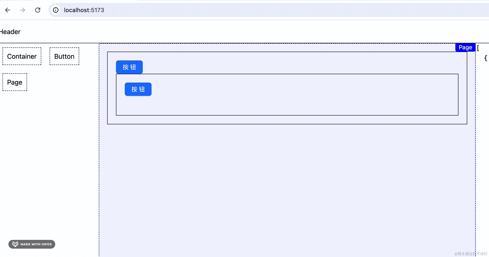

这节我们来实现 click 时展示编辑框，以及组件删除：


hover 时记录了 hoverComponentId：

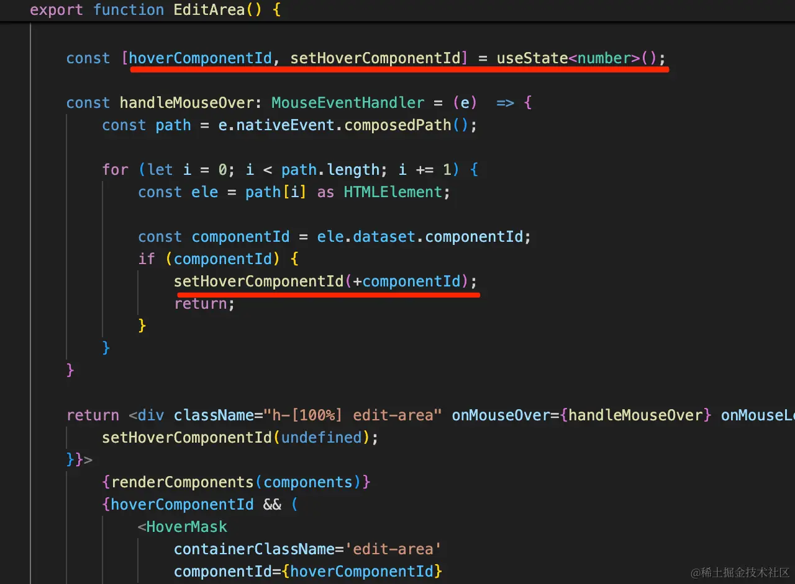

click 时同样也要记录。

但是 hover 时不一样，click 选中的组件除了展示编辑框，还要在右侧属性区展示对应的组件属性：


所以我们要把它记录到全局 store 里。

我们加一下：

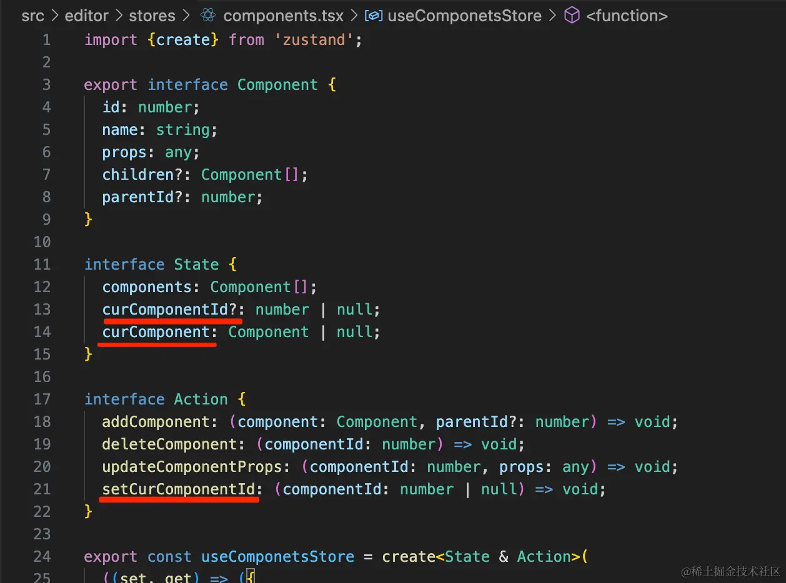

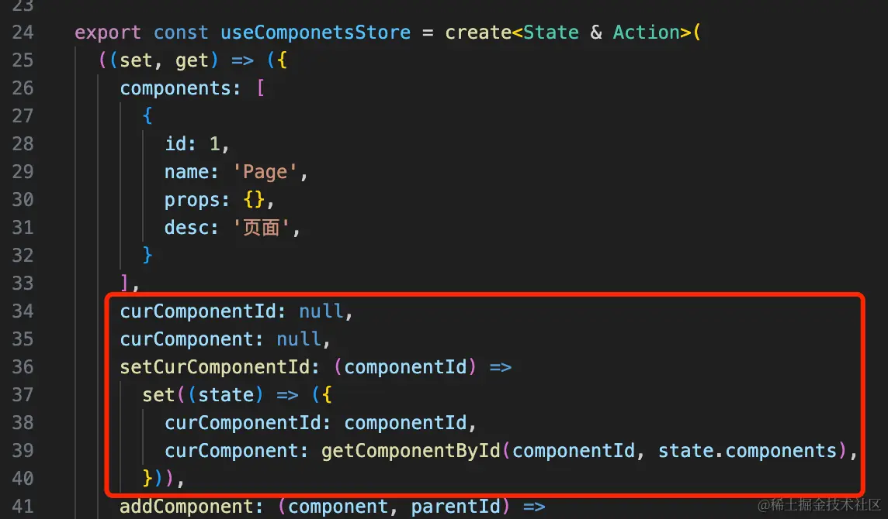

```javascript
interface State {
  components: Component[];
  curComponentId?: number | null;
  curComponent: Component | null;
}

interface Action {
  addComponent: (component: Component, parentId?: number) => void;
  deleteComponent: (componentId: number) => void;
  updateComponentProps: (componentId: number, props: any) => void;
  setCurComponentId: (componentId: number | null) => void;
}
```

```javascript
curComponentId: null,
curComponent: null,
setCurComponentId: (componentId) =>
  set((state) => ({
    curComponentId: componentId,
    curComponent: getComponentById(componentId, state.components),
  })),
```
同样，click 事件也是绑定在画布区根组件 EditArea 上的：

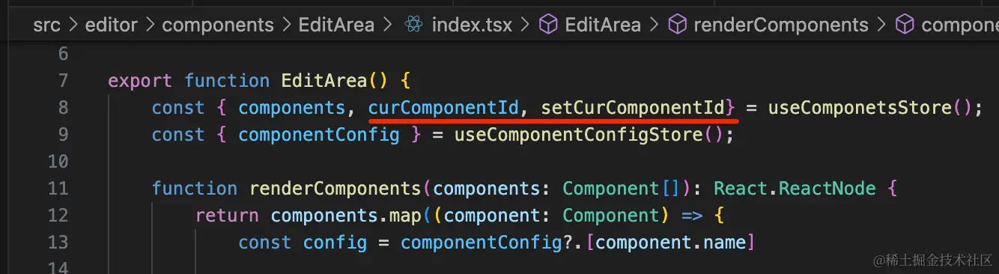

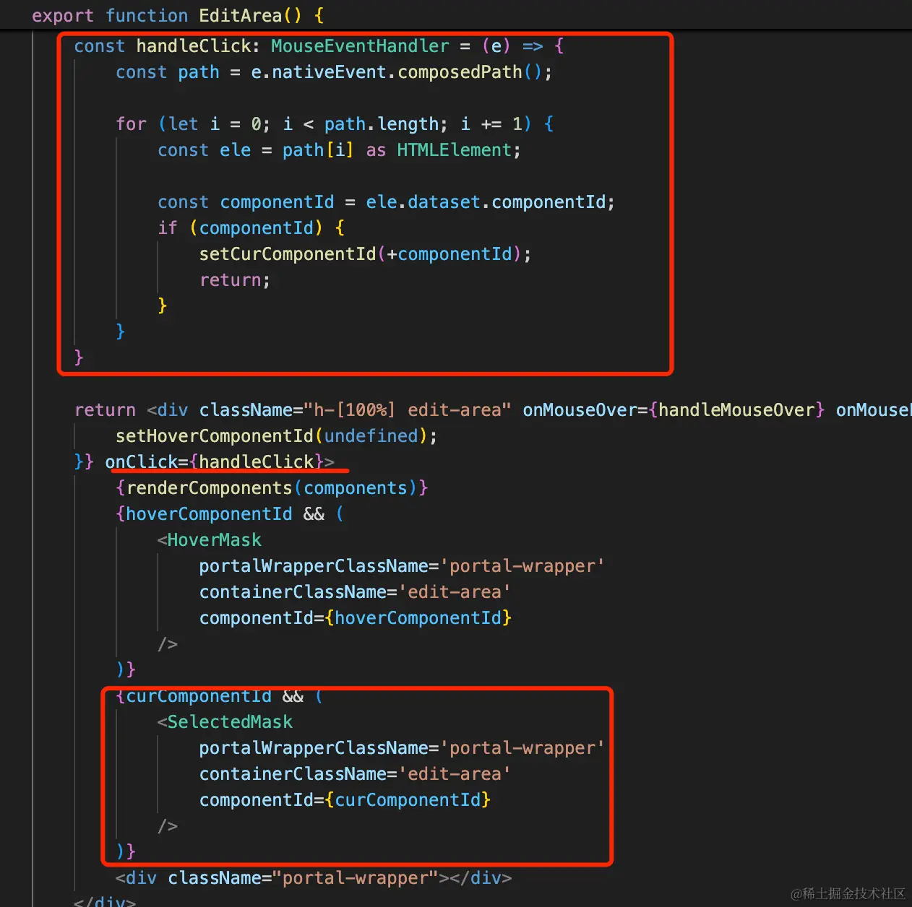

```javascript
import React, { MouseEventHandler, useEffect, useState } from "react";
import { useComponentConfigStore } from "../../stores/component-config";
import { Component, useComponetsStore } from "../../stores/components"
import HoverMask from "../HoverMask";
import SelectedMask from "../SelectedMask";

export function EditArea() {
    const { components, curComponentId, setCurComponentId} = useComponetsStore();
    const { componentConfig } = useComponentConfigStore();

    function renderComponents(components: Component[]): React.ReactNode {
        return components.map((component: Component) => {
            const config = componentConfig?.[component.name]

            if (!config?.component) {
                return null;
            }
            
            return React.createElement(
                config.component,
                {
                    key: component.id,
                    id: component.id,
                    name: component.name,
                    ...config.defaultProps,
                    ...component.props,
                },
                renderComponents(component.children || [])
            )
        })
    }

    const [hoverComponentId, setHoverComponentId] = useState<number>();

    const handleMouseOver: MouseEventHandler = (e)  => {
        const path = e.nativeEvent.composedPath();

        for (let i = 0; i < path.length; i += 1) {
            const ele = path[i] as HTMLElement;

            const componentId = ele.dataset?.componentId;
            if (componentId) {
                setHoverComponentId(+componentId);
                return;
            }
        }
    }
  
    const handleClick: MouseEventHandler = (e) => {
        const path = e.nativeEvent.composedPath();

        for (let i = 0; i < path.length; i += 1) {
            const ele = path[i] as HTMLElement;

            const componentId = ele.dataset?.componentId;
            if (componentId) {
                setCurComponentId(+componentId);
                return;
            }
        }
    }

    return <div className="h-[100%] edit-area" onMouseOver={handleMouseOver} onMouseLeave={() => {
        setHoverComponentId(undefined);
    }} onClick={handleClick}>
        {renderComponents(components)}
        {hoverComponentId && (
            <HoverMask
                portalWrapperClassName='portal-wrapper'
                containerClassName='edit-area'
                componentId={hoverComponentId}
            />
        )}
        {curComponentId && (
            <SelectedMask
                portalWrapperClassName='portal-wrapper'
                containerClassName='edit-area'
                componentId={curComponentId}
            />
        )}
        <div className="portal-wrapper"></div>
    </div>
}
```
点击事件触发时，找到元素对应的 component id，设置为 curComponentId。

然后渲染 curComponentId 对应的 SelectedMask。

实现下这个 SelectedMask 组件：

editor/components/SelectedMask/index.tsx

```javascript
import {
  useEffect,
  useMemo,
  useState,
} from 'react';
import { createPortal } from 'react-dom';
import { getComponentById, useComponetsStore } from '../../stores/components';
import { Popconfirm, Space } from 'antd';
import { DeleteOutlined } from '@ant-design/icons';

interface SelectedMaskProps {
  portalWrapperClassName: string
  containerClassName: string
  componentId: number;
}

function SelectedMask({ containerClassName, portalWrapperClassName, componentId }: SelectedMaskProps) {

  const [position, setPosition] = useState({
    left: 0,
    top: 0,
    width: 0,
    height: 0,
    labelTop: 0,
    labelLeft: 0,
  });

  const { components, curComponentId } = useComponetsStore();

  useEffect(() => {
    updatePosition();
  }, [componentId]);

  function updatePosition() {
    if (!componentId) return;

    const container = document.querySelector(`.${containerClassName}`);
    if (!container) return;

    const node = document.querySelector(`[data-component-id="${componentId}"]`);
    if (!node) return;

    const { top, left, width, height } = node.getBoundingClientRect();
    const { top: containerTop, left: containerLeft } = container.getBoundingClientRect();

    let labelTop = top - containerTop + container.scrollTop;
    let labelLeft = left - containerLeft + width;

    if (labelTop <= 0) {
      labelTop -= -20;
    }
  
    setPosition({
      top: top - containerTop + container.scrollTop,
      left: left - containerLeft + container.scrollTop,
      width,
      height,
      labelTop,
      labelLeft,
    });
  }

  const el = useMemo(() => {
      return document.querySelector(`.${portalWrapperClassName}`)!
  }, []);

  const curComponent = useMemo(() => {
    return getComponentById(componentId, components);
  }, [componentId]);

  function handleDelete() {

  }

  return createPortal((
    <>
      <div
        style={{
          position: "absolute",
          left: position.left,
          top: position.top,
          backgroundColor: "rgba(0, 0, 255, 0.1)",
          border: "1px dashed blue",
          pointerEvents: "none",
          width: position.width,
          height: position.height,
          zIndex: 12,
          borderRadius: 4,
          boxSizing: 'border-box',
        }}
      />
      <div
          style={{
            position: "absolute",
            left: position.labelLeft,
            top: position.labelTop,
            fontSize: "14px",
            zIndex: 13,
            display: (!position.width || position.width < 10) ? "none" : "inline",
            transform: 'translate(-100%, -100%)',
          }}
        >
          <Space>
            <div
              style={{
                padding: '0 8px',
                backgroundColor: 'blue',
                borderRadius: 4,
                color: '#fff',
                cursor: "pointer",
                whiteSpace: 'nowrap',
              }}
            >
              {curComponent?.name}
            </div>
            {curComponentId !== 1 && (
              <div style={{ padding: '0 8px', backgroundColor: 'blue' }}>
                <Popconfirm
                  title="确认删除？"
                  okText={'确认'}
                  cancelText={'取消'}
                  onConfirm={handleDelete}
                >
                  <DeleteOutlined style={{ color: '#fff' }}/>
                </Popconfirm>
              </div>
            )}
          </Space>
        </div>
    </>
  ), el)
}

export default SelectedMask;
```
和 HoverMask 区别不大，主要这几点区别：

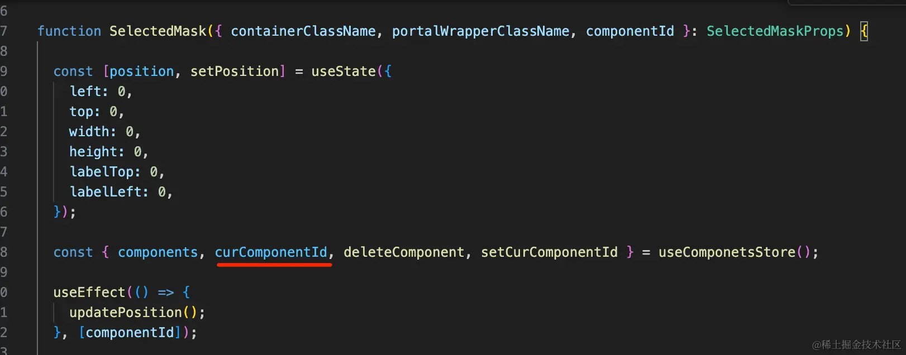

从 store 取出 curComponentId 来。

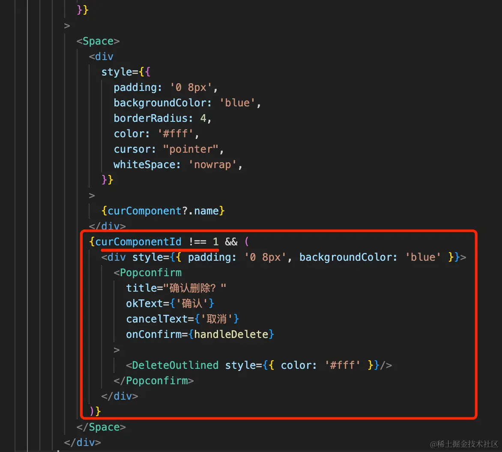

如果 id 不为 1，说明不是 Page 组件，就显示删除按钮。

点击的时候删除组件：

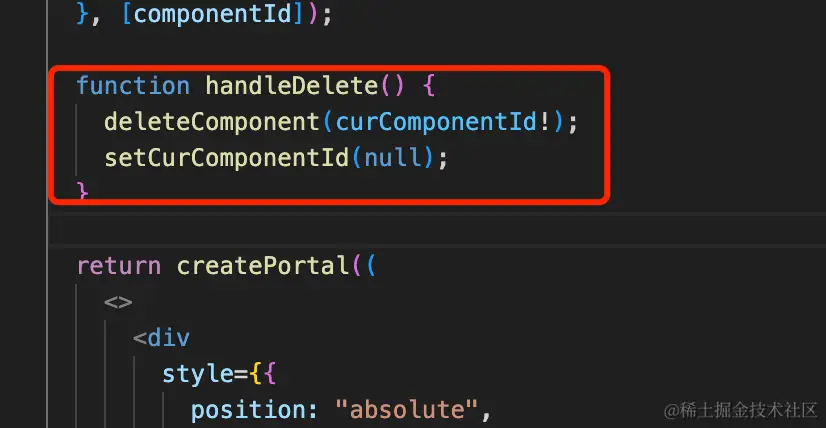

再就是编辑框的颜色稍微深一点：

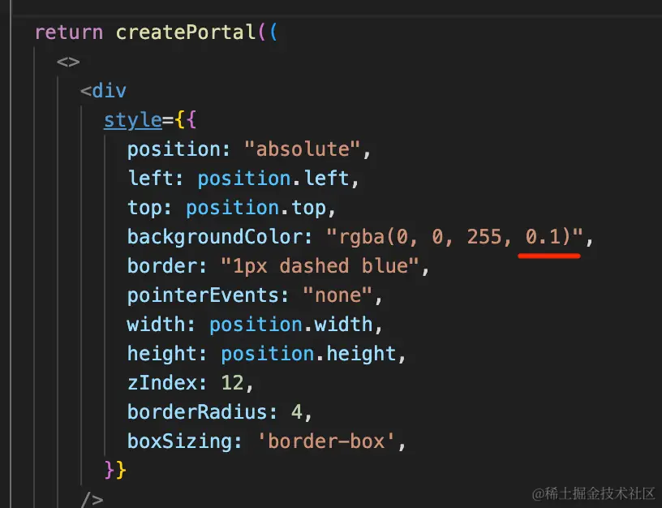

测试下：

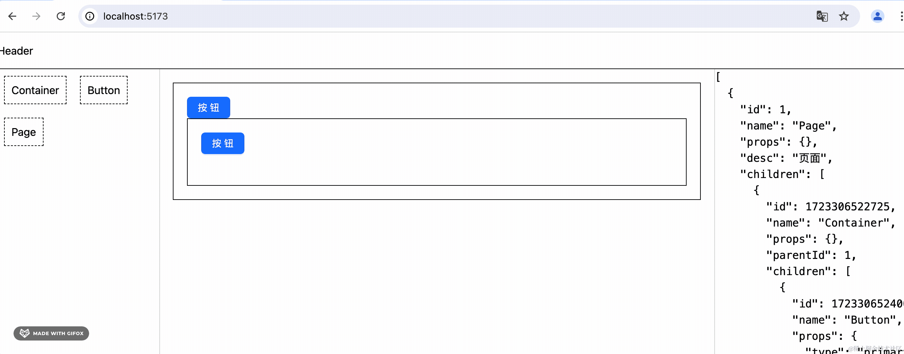

点击时显示了编辑框，并且点击删除能删除组件。

只是会和 HoverMask 重合。

我们处理下：

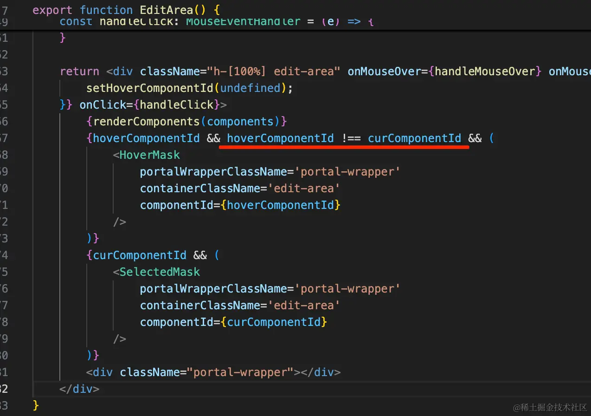

hoverComponentId 和 curComponentId 一样的时候，就不显示高亮框。


这样就好了。

amis 的编辑器还有这个功能：


组件会展示它所有的父组件，点击就会选中该父组件。

我们也实现下：

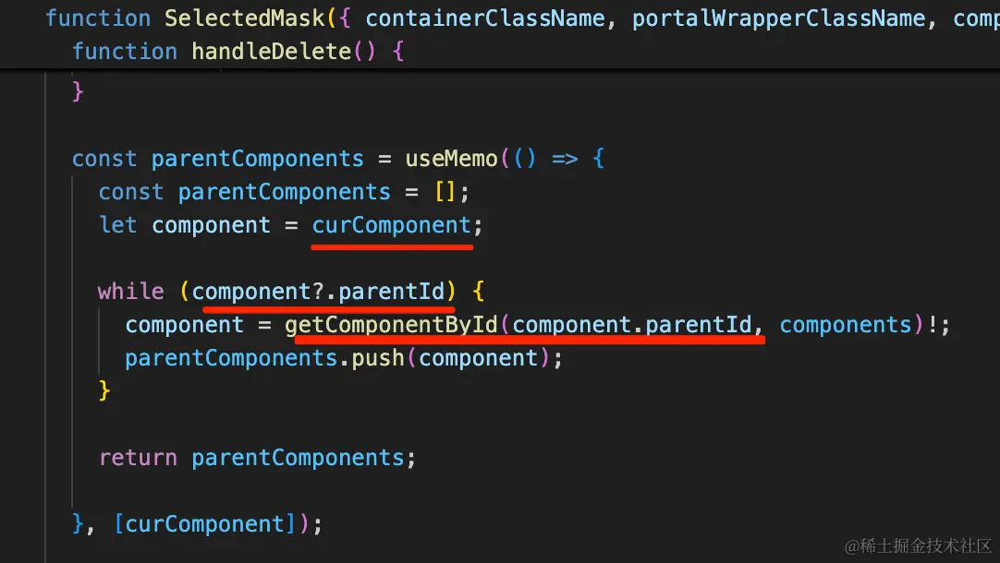

每个组件都有 component.parentId，用来找父组件也很简单，不断向上找，放到一个数组里就行。

然后用 DropDown 组件展示下拉列表：

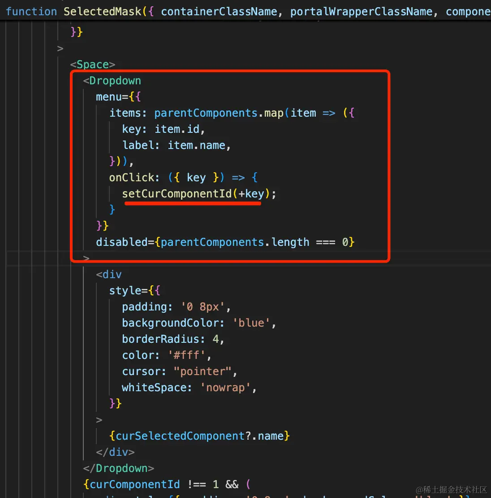

点击 item 的时候切换 curComponentId。

```javascript
import {
  useEffect,
  useMemo,
  useState,
} from 'react';
import { createPortal } from 'react-dom';
import { getComponentById, useComponetsStore } from '../../stores/components';
import { Dropdown, Popconfirm, Space } from 'antd';
import { DeleteOutlined } from '@ant-design/icons';

interface SelectedMaskProps {
  portalWrapperClassName: string
  containerClassName: string
  componentId: number;
}

function SelectedMask({ containerClassName, portalWrapperClassName, componentId }: SelectedMaskProps) {

  const [position, setPosition] = useState({
    left: 0,
    top: 0,
    width: 0,
    height: 0,
    labelTop: 0,
    labelLeft: 0,
  });

  const { components, curComponentId, curComponent, deleteComponent, setCurComponentId } = useComponetsStore();

  useEffect(() => {
    updatePosition();
  }, [componentId]);

  function updatePosition() {
    if (!componentId) return;

    const container = document.querySelector(`.${containerClassName}`);
    if (!container) return;

    const node = document.querySelector(`[data-component-id="${componentId}"]`);
    if (!node) return;

    const { top, left, width, height } = node.getBoundingClientRect();
    const { top: containerTop, left: containerLeft } = container.getBoundingClientRect();

    let labelTop = top - containerTop + container.scrollTop;
    let labelLeft = left - containerLeft + width;

    if (labelTop <= 0) {
      labelTop -= -20;
    }
  
    setPosition({
      top: top - containerTop + container.scrollTop,
      left: left - containerLeft + container.scrollTop,
      width,
      height,
      labelTop,
      labelLeft,
    });
  }

  const el = useMemo(() => {
      return document.querySelector(`.${portalWrapperClassName}`)!
  }, []);

  const curSelectedComponent = useMemo(() => {
    return getComponentById(componentId, components);
  }, [componentId]);

  function handleDelete() {
    deleteComponent(curComponentId!);
    setCurComponentId(null);
  }

  const parentComponents = useMemo(() => {
    const parentComponents = [];
    let component = curComponent;

    while (component?.parentId) {
      component = getComponentById(component.parentId, components)!;
      parentComponents.push(component);
    }

    return parentComponents;

  }, [curComponent]);

  return createPortal((
    <>
      <div
        style={{
          position: "absolute",
          left: position.left,
          top: position.top,
          backgroundColor: "rgba(0, 0, 255, 0.1)",
          border: "1px dashed blue",
          pointerEvents: "none",
          width: position.width,
          height: position.height,
          zIndex: 12,
          borderRadius: 4,
          boxSizing: 'border-box',
        }}
      />
      <div
          style={{
            position: "absolute",
            left: position.labelLeft,
            top: position.labelTop,
            fontSize: "14px",
            zIndex: 13,
            display: (!position.width || position.width < 10) ? "none" : "inline",
            transform: 'translate(-100%, -100%)',
          }}
        >
          <Space>
            <Dropdown
              menu={{
                items: parentComponents.map(item => ({
                  key: item.id,
                  label: item.name,
                })),
                onClick: ({ key }) => {
                  setCurComponentId(+key);
                }
              }}
              disabled={parentComponents.length === 0}
            >
              <div
                style={{
                  padding: '0 8px',
                  backgroundColor: 'blue',
                  borderRadius: 4,
                  color: '#fff',
                  cursor: "pointer",
                  whiteSpace: 'nowrap',
                }}
              >
                {curSelectedComponent?.name}
              </div>
            </Dropdown>
            {curComponentId !== 1 && (
              <div style={{ padding: '0 8px', backgroundColor: 'blue' }}>
                <Popconfirm
                  title="确认删除？"
                  okText={'确认'}
                  cancelText={'取消'}
                  onConfirm={handleDelete}
                >
                  <DeleteOutlined style={{ color: '#fff' }}/>
                </Popconfirm>
              </div>
            )}
          </Space>
        </div>
    </>
  ), el)
}

export default SelectedMask;
```
试一下：


这样，选中父组件的功能就完成了。

但现在有个问题：


删除组件后会触发它父组件的 hover，但这时候高亮框的高度是没删除元素的高度，会多出一块。

还有，click 选中的组件再添加组件的时候编辑框高度不会变化：

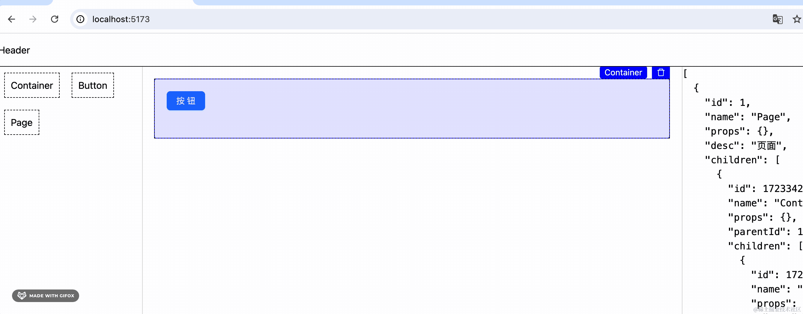

这个问题也好解决，在 components 变化后调用下 updatePosition 就好了：

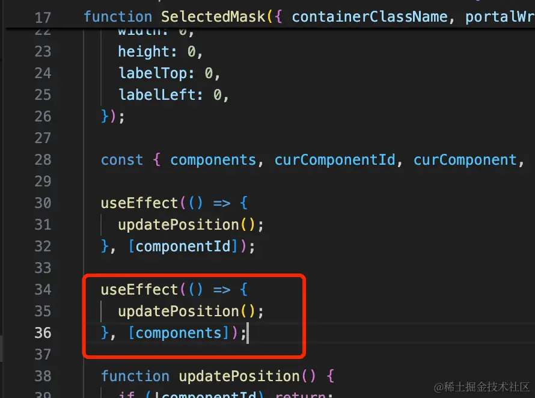

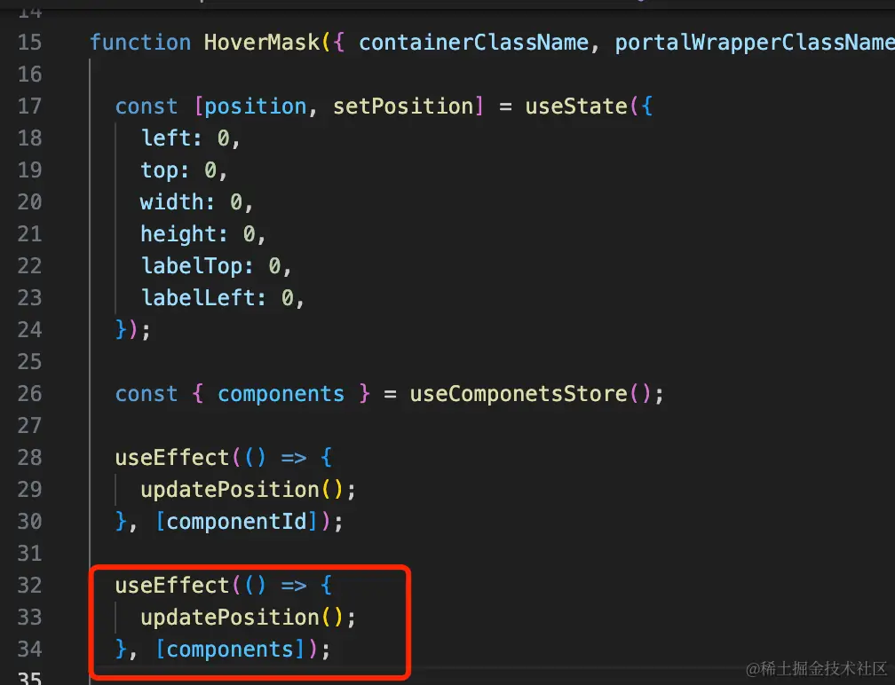

```javascript
useEffect(() => {
    updatePosition();
}, [components]);
```
SelectedMask 和 HoverMask 都处理下。


这样就好了。

此外，amis 编辑器左边物料和选中时的编辑框都是展示的组件描述，而我们直接展示组件名：

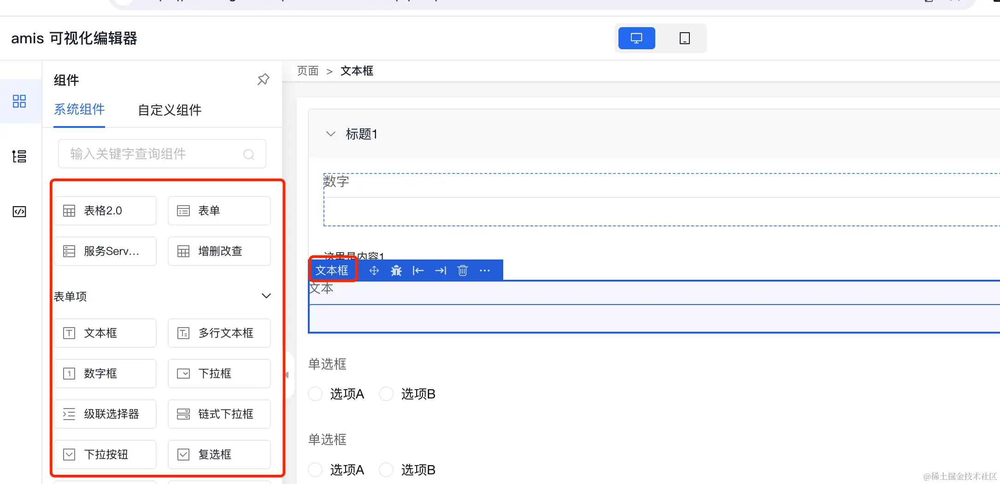

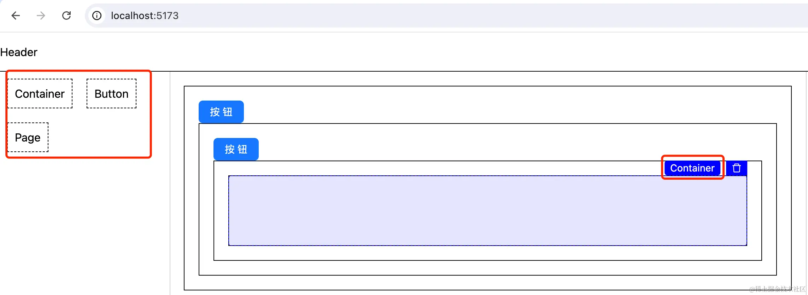

这样不大好，我们改一下：

在 Component 类型加一下 desc：

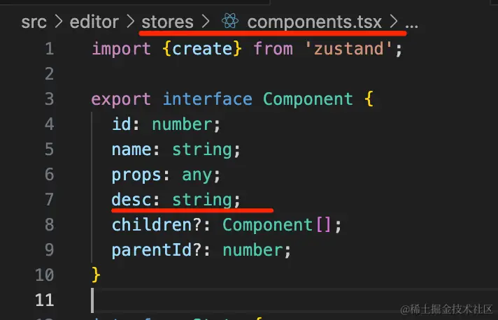

ComponentConfig 也加一下：

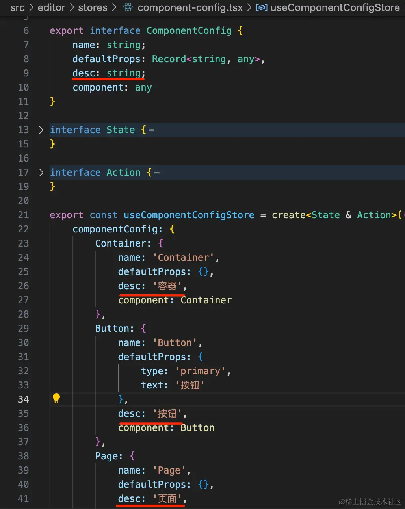

addComponent 的时候从 config 取出组件的 desc：

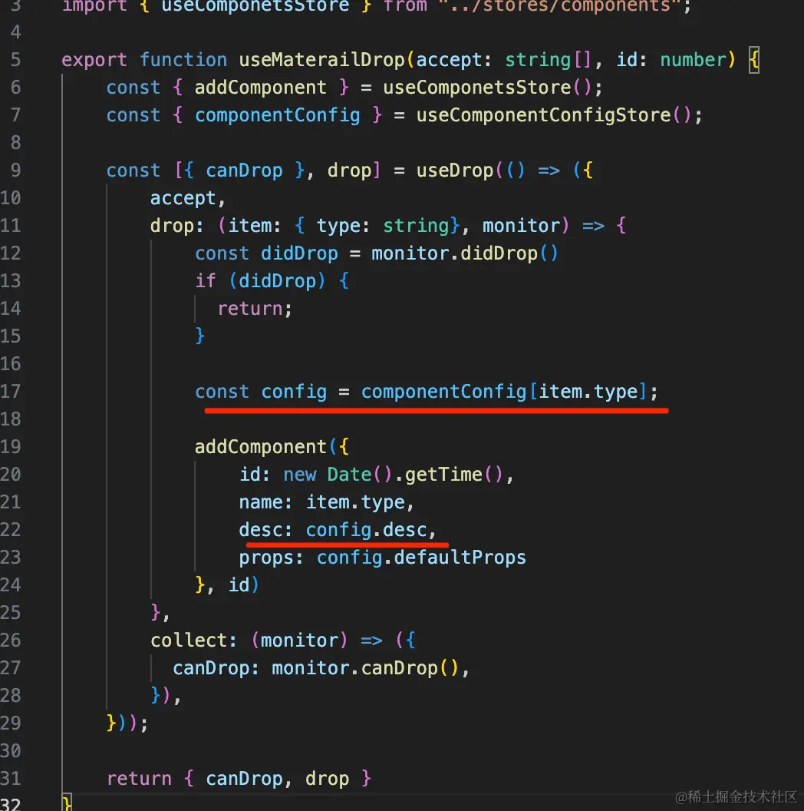

然后展示的时候展示 desc 就好了：

左边的 MaterialItem 传入 desc：

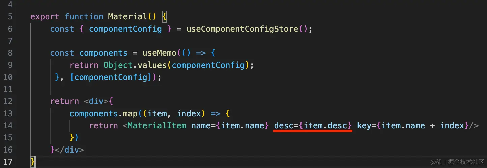

显示的文案改成 desc：

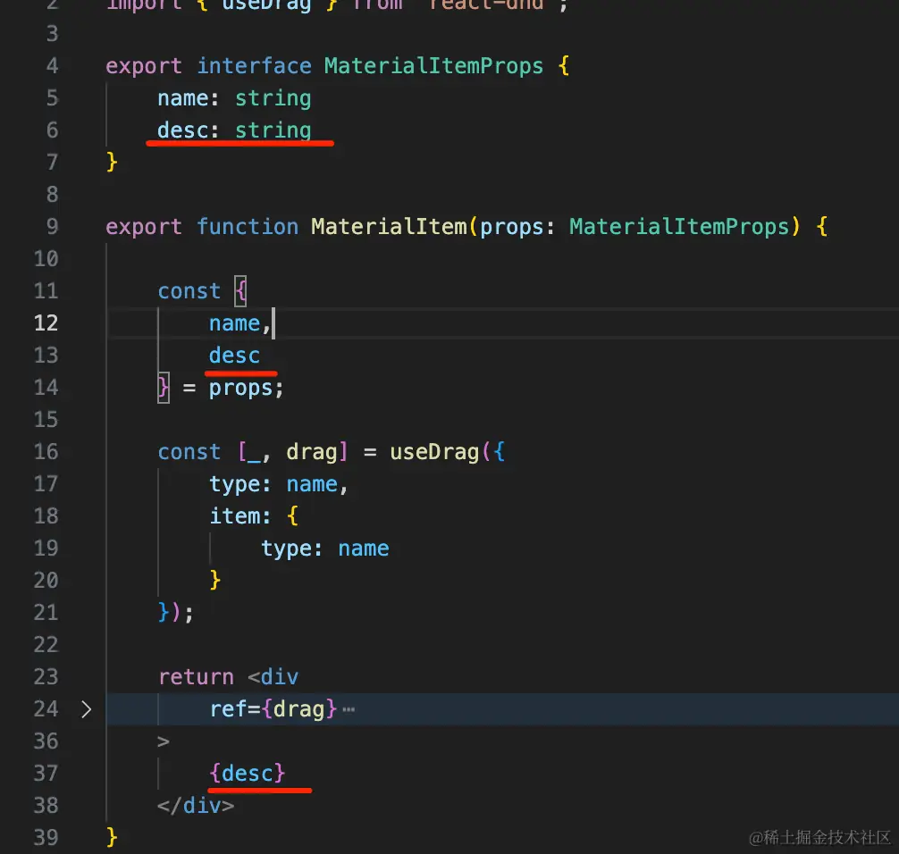

HoverMask 和 SelectedMask 也显示 desc：

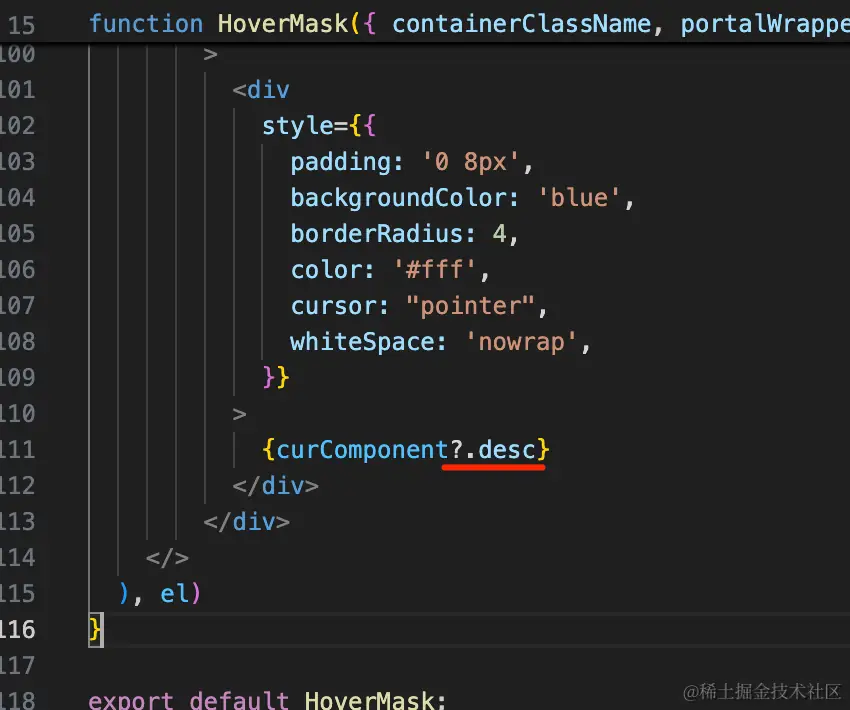

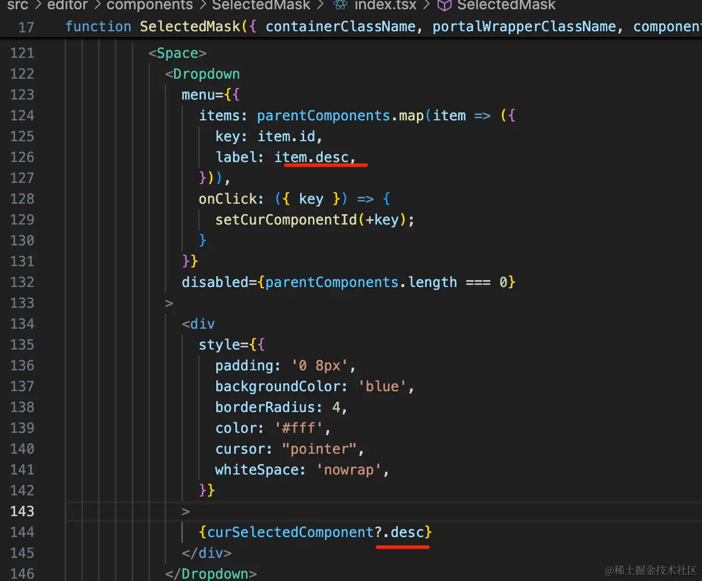

测试下：


没啥问题。

然后左边不需要展示页面组件，过滤下：

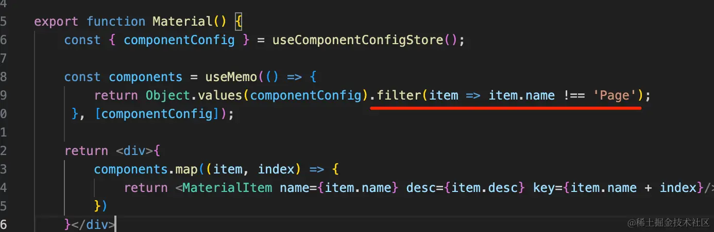

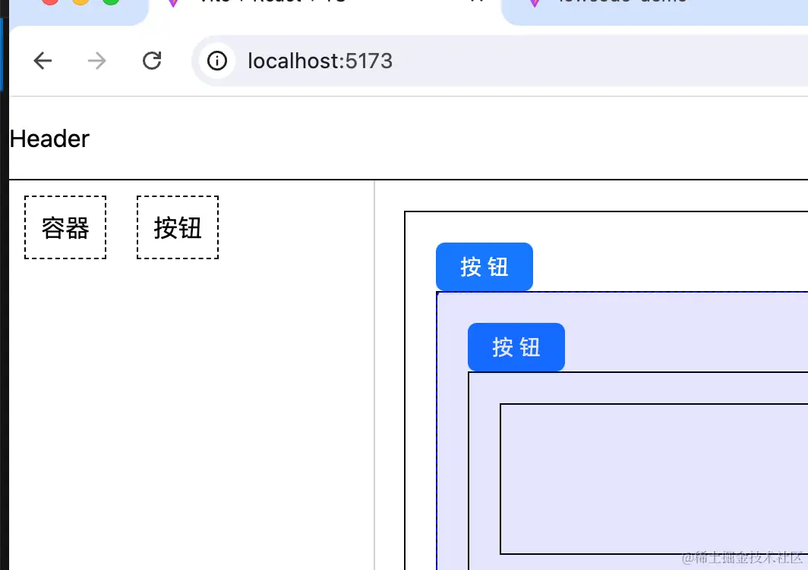

还有，使用者是可能调整窗口大小的，这时候编辑框没有重新计算位置：


做下处理：

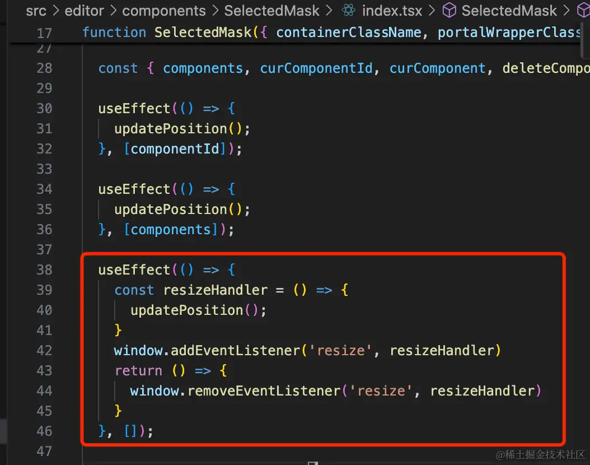

```javascript
useEffect(() => {
    const resizeHandler = () => {
      updatePosition();
    }
    window.addEventListener('resize', resizeHandler)
    return () => {
      window.removeEventListener('resize', resizeHandler)
    }
}, []);
```
这样就好了：


案例代码上传了[小册仓库](https://github.com/QuarkGluonPlasma/react-course-code/tree/main/lowcode-editor)，可以切换到这个 commit 查看：

```
git reset --hard f8f0cd06dc5c08f6df2f5dcb5d5327c4bb11d94b
```
## 总结

这节我们实现了点击时的编辑框。

首先在 components 的 store 里保存了 curComponentId。

然后在 EditArea 添加 click 事件，点击的时候拿到 data-component-id 设置到 curComponentId。

根据 curComponentId 渲染 SelectedMask。

SelctedMask 展示删除按钮，可以调用 deleteComponent 删除组件，展示父组件的列表，可以切换选中父组件。

渲染 SelectedMask 的时候要隐藏掉 HoverMask。

还要做 components 变化、window resize 的时候的 udpatePosition 处理。

此外，我们还把展示的 component.name 换成了 component.desc

这样，画布区的交互就完成了。
