# 第72章—低代码编辑器：预览、大纲

这节我们来做下大纲和预览的功能。

大纲就是树形展示组件结构：

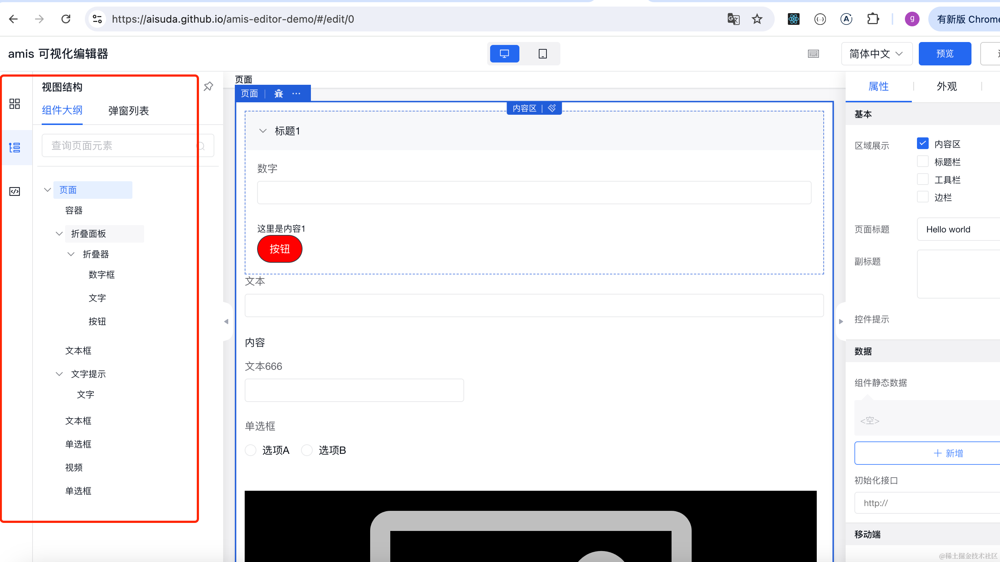

顺便把源码也做一下：

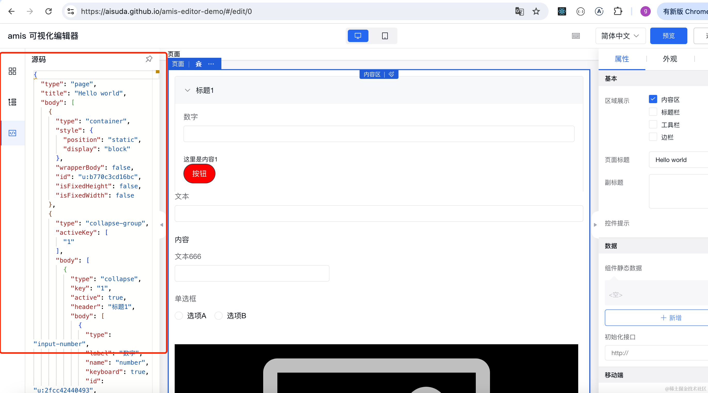

预览则是展示编辑好的页面：


我们先来实现下左边的大纲和源码。

创建 components/MaterialWrapper/index.tsx

```javascript
import { Segmented } from "antd";
import { useState } from "react";
import { Material } from "../Material";
import { Outline } from "../Outline";
import { Source } from "../Source";

export function MaterialWrapper() {

    const [key, setKey] = useState<string>('物料');
  
    return <div >
        <Segmented value={key} onChange={setKey} block options={['物料', '大纲', '源码']} />
        <div className='pt-[20px]'>
            {
                key === '物料' && <Material/>
            }
            {
                key === '大纲' && <Outline/>
            }
            {
                key === '源码' && <Source/>
            }
        </div>        
    </div>
}
```
同样用 Segmented 组件来写 tab。

然后创建 Outline、Source 组件：

components/Outline/index.tsx

```javascript
export function Outline() {
    return <div>Outline</div>
}
```
components/Source/index.tsx
```javascript
export function Source() {
    return <div>Source</div>
}
```
把 editor/index.tsx 里的 Materail 换成 MaterialWrapper

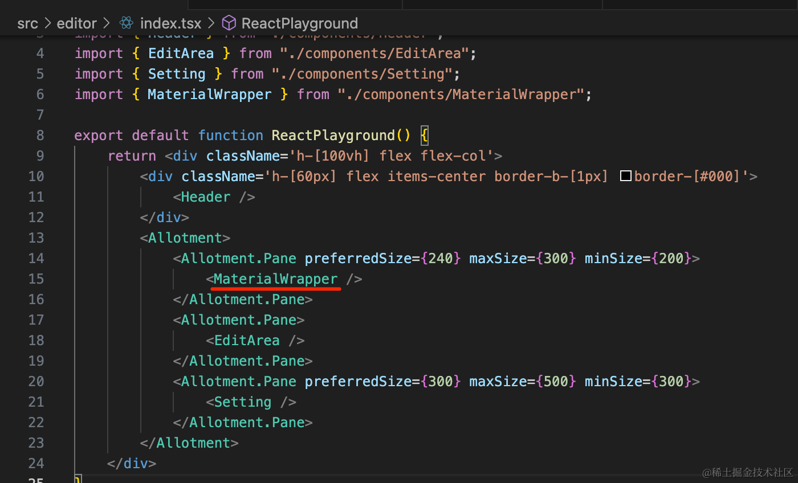

试一下：


这样，tab 切换就完成了，并且之前的物料拖拽依然是正常的。

然后实现下大纲和源码。

大纲就是树形展示组件树：

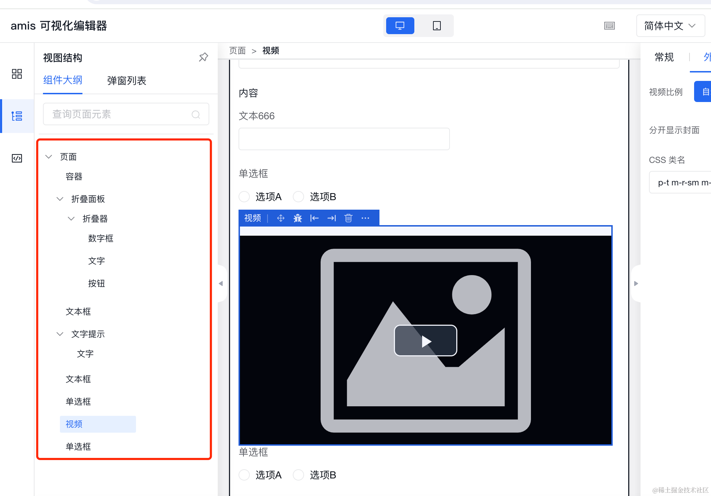

用 antd 的 Tree 组件就行

```javascript
import { Tree } from "antd";
import { useComponetsStore } from "../../stores/components";

export function Outline() {
    const { components, setCurComponentId } = useComponetsStore();

    return <Tree
        fieldNames={{ title: 'desc', key: 'id' }}
        treeData={components as any}
        showLine
        defaultExpandAll
        onSelect={([selectedKey]) => {
            setCurComponentId(selectedKey as number);
        }}
    />
}
```
title 是指定用哪个属性作为标题，key 是指定哪个属性作为 key。

选中的时候切换 curComponentId。

看下效果：


用 Tree 组件很简单就完成了。

然后是 Source，这个就更简单了，直接用 monaco editor 展示 json：

```javascript
import MonacoEditor, { OnMount } from '@monaco-editor/react'
import { useComponetsStore } from '../../stores/components';

export function Source() {
    const {components} = useComponetsStore();

    const handleEditorMount: OnMount = (editor, monaco) => {
      editor.addCommand(monaco.KeyMod.CtrlCmd | monaco.KeyCode.KeyJ, () => {
          editor.getAction('editor.action.formatDocument')?.run()
      });
    }

    return <MonacoEditor
        height={'100%'}
        path='components.json'
        language='json'
        onMount={handleEditorMount}
        value={JSON.stringify(components, null, 2)}
        options={
            {
                fontSize: 14,
                scrollBeyondLastLine: false,
                minimap: {
                  enabled: false,
                },
                scrollbar: {
                  verticalScrollbarSize: 6,
                  horizontalScrollbarSize: 6,
                }
            }
        }
    />
}
```
把 components 用 JSON.stringify 格式化后展示就行。

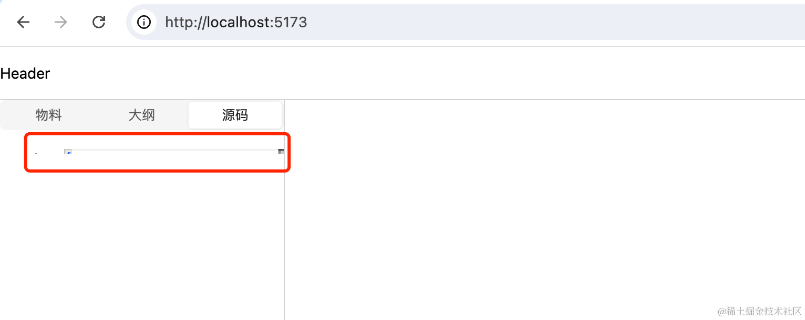

高度有点小，在 MaterialWrapper 设置下 height：

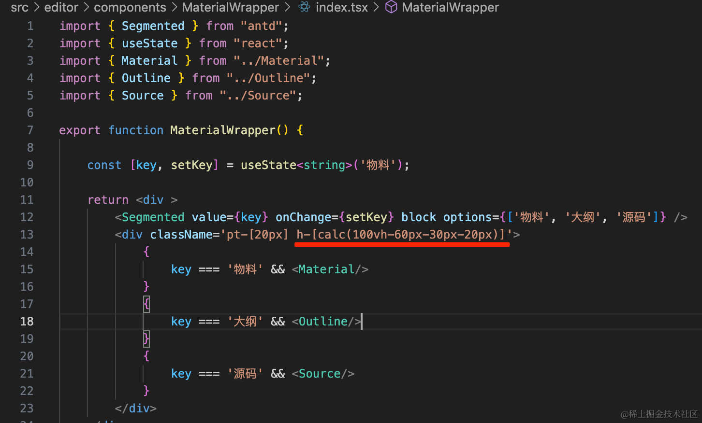

```
h-[calc(100vh-60px-30px-20px)]
```
就是 100 的视口高度减去 header、tab 还有 padding 之后剩下的。


然后我们再实现下预览功能：

有同学说，预览和画布区不一样也是遍历 json 递归渲染组件么？

对，但是渲染的组件不同。

就拿日期组件来说：


编辑的时候不响应点击事件，预览的时候才有反应。

这是因为编辑的组件做了处理：

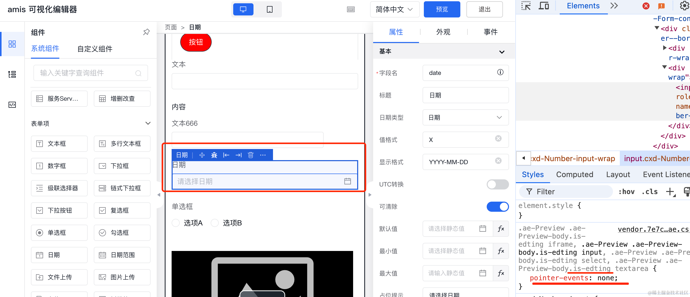

每个组件都要区分编辑和预览两种状态，甚至渲染的内容都不同。

所以，我们最好是编辑和预览状态的组件分开写：

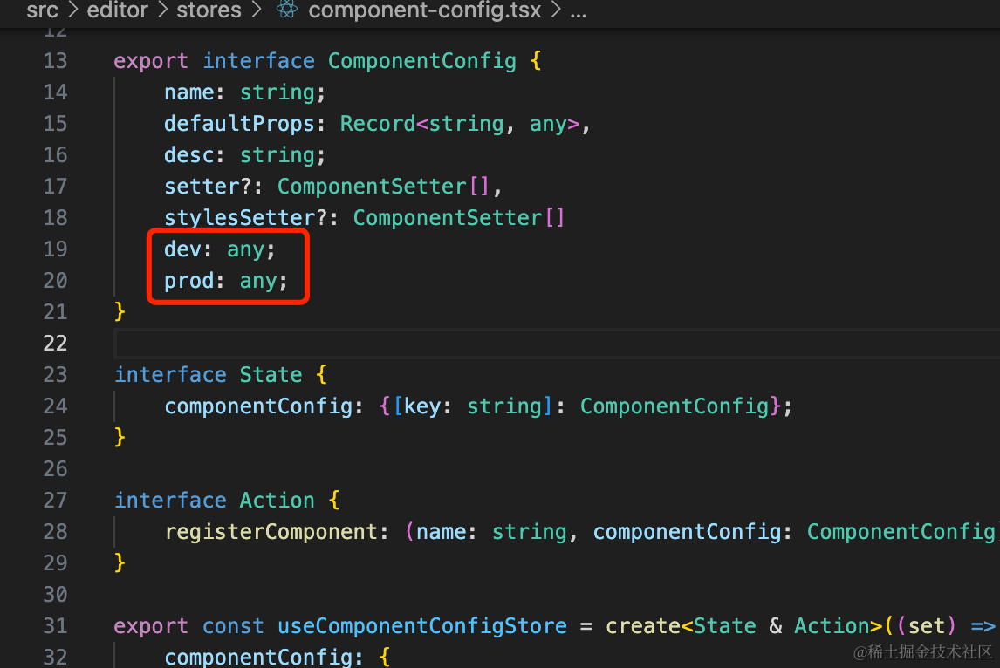

改下 ComponentConfig，添加 dev、prod 属性。

然后我们给 Page、Button、Container 组件都添加两种状态的：

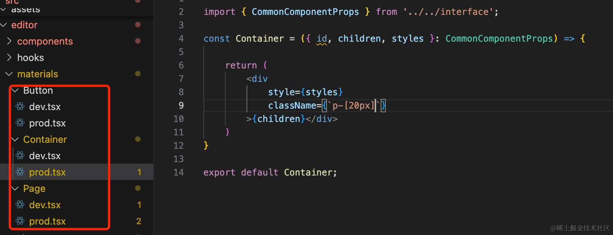

dev.tsx 就是之前的 index.tsx 

我们只看 prod.tsx

Button 组件：

```javascript
import { Button as AntdButton } from 'antd';
import { CommonComponentProps } from '../../interface';

const Button = ({id, type, text, styles}: CommonComponentProps) => {
  return (
    <AntdButton type={type} style={styles}>{text}</AntdButton>
  )
}

export default Button;
```
和 dev 状态差不多，只不过不用带 data-component-id 了

Container 组件：

```javascript
import { CommonComponentProps } from '../../interface';

const Container = ({ id, children, styles }: CommonComponentProps) => {

    return (
        <div 
            style={styles}
            className={`p-[20px]`}
        >{children}</div>
    )
}

export default Container;
```
不用带 border，也不用处理 drop 事件。

Page 组件：

```javascript
import { CommonComponentProps } from "../../interface";

function Page({ id, name, children, styles }: CommonComponentProps) {

    return (
        <div
            className='p-[20px]'
            style={{ ...styles }}
        >
            {children}
        </div>
    )
}

export default Page;
```
不用带 h-[100%] 了，这个只是编辑的时候需要。

然后在 ComponentConfig 里注册下：

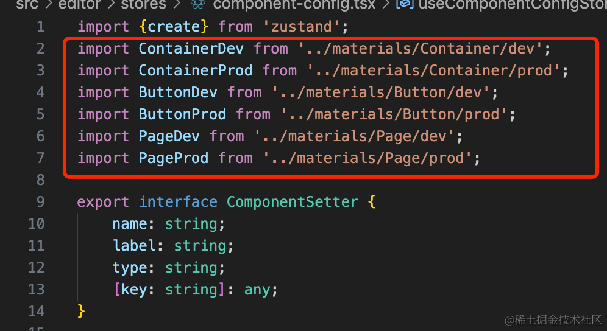

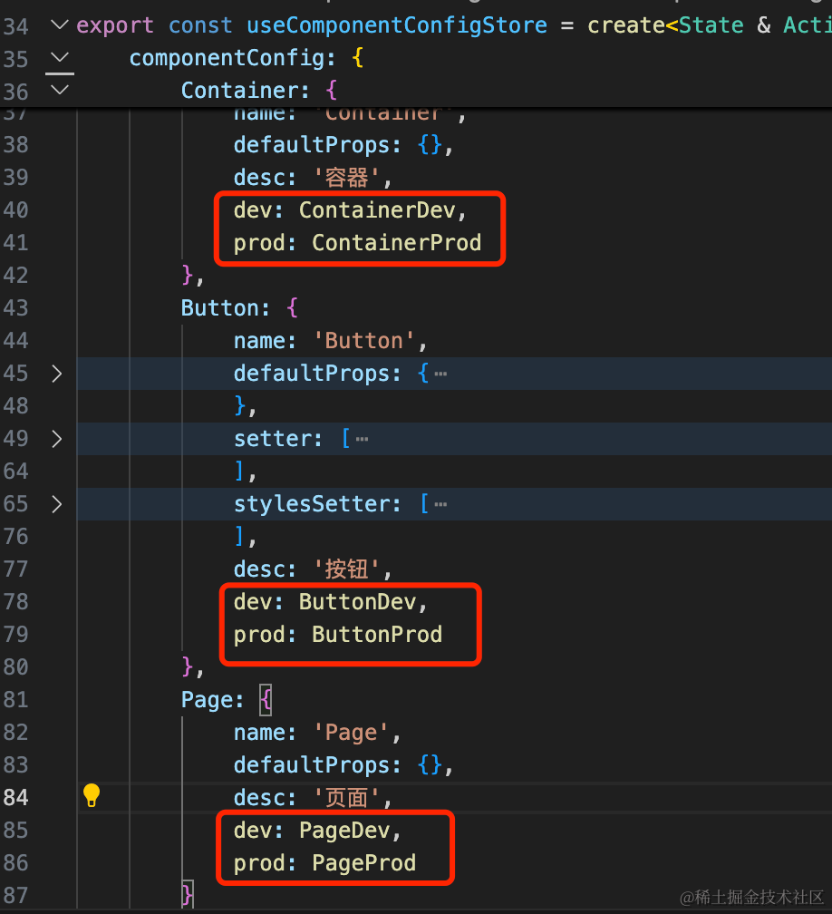

```javascript
import {create} from 'zustand';
import ContainerDev from '../materials/Container/dev';
import ContainerProd from '../materials/Container/prod';
import ButtonDev from '../materials/Button/dev';
import ButtonProd from '../materials/Button/prod';
import PageDev from '../materials/Page/dev';
import PageProd from '../materials/Page/prod';

export interface ComponentSetter {
    name: string;
    label: string;
    type: string;
    [key: string]: any;
}

export interface ComponentConfig {
    name: string;
    defaultProps: Record<string, any>,
    desc: string;
    setter?: ComponentSetter[],
    stylesSetter?: ComponentSetter[]
    dev: any;
    prod: any;
}

interface State {
    componentConfig: {[key: string]: ComponentConfig};
}

interface Action {
    registerComponent: (name: string, componentConfig: ComponentConfig) => void
}

export const useComponentConfigStore = create<State & Action>((set) => ({
    componentConfig: {
        Container: {
            name: 'Container',
            defaultProps: {},
            desc: '容器',
            dev: ContainerDev,
            prod: ContainerProd
        },
        Button: {
            name: 'Button',
            defaultProps: {
                type: 'primary',
                text: '按钮'
            },
            setter: [
                {
                  name: 'type',
                  label: '按钮类型',
                  type: 'select',
                  options: [
                    {label: '主按钮', value: 'primary'},
                    {label: '次按钮', value: 'default'},
                  ],
                },
                {
                  name: 'text',
                  label: '文本',
                  type: 'input',
                },
            ],
            stylesSetter: [
                {
                    name: 'width',
                    label: '宽度',
                    type: 'inputNumber',
                },
                {
                    name: 'height',
                    label: '高度',
                    type: 'inputNumber',
                }
            ],
            desc: '按钮',
            dev: ButtonDev,
            prod: ButtonProd
        },
        Page: {
            name: 'Page',
            defaultProps: {},
            desc: '页面',
            dev: PageDev,
            prod: PageProd
        }
    },
    registerComponent: (name, componentConfig) => set((state) => {
        return {
            ...state,
            componentConfig: {
                ...state.componentConfig,
                [name]: componentConfig
            }
        }
    })
}));
```
然后 EditArea 里面渲染也改一下：

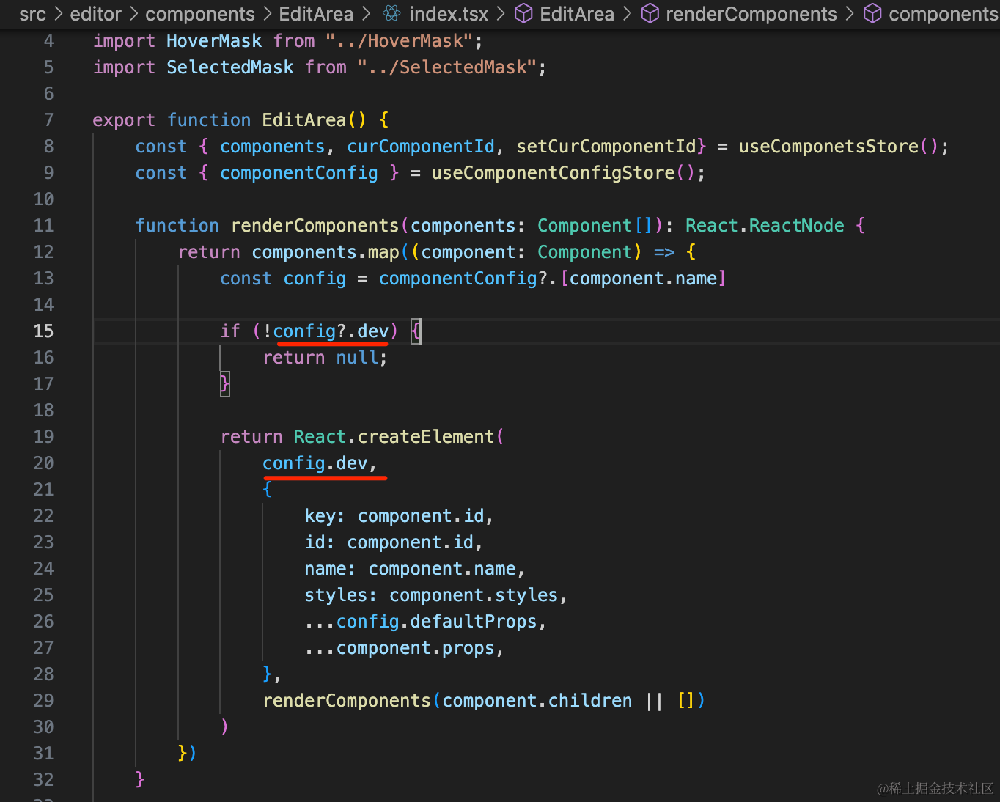

先看下效果：


功能正常。

然后加一个 Preview 组件：

components/Prview/index.tsx

```javascript
import React from "react";
import { useComponentConfigStore } from "../../stores/component-config";
import { Component, useComponetsStore } from "../../stores/components"

export function Preview() {
    const { components } = useComponetsStore();
    const { componentConfig } = useComponentConfigStore();

    function renderComponents(components: Component[]): React.ReactNode {
        return components.map((component: Component) => {
            const config = componentConfig?.[component.name]

            if (!config?.prod) {
                return null;
            }
            
            return React.createElement(
                config.prod,
                {
                    key: component.id,
                    id: component.id,
                    name: component.name,
                    styles: component.styles,
                    ...config.defaultProps,
                    ...component.props,
                },
                renderComponents(component.children || [])
            )
        })
    }

    return <div>
        {renderComponents(components)}
    </div>
}
```
这个组件比 EditArea 简单，只要把 json 递归渲染成 prod 的组件就行。

然后在 store 添加一个 mode 的 state 用来切换编辑、预览状态：

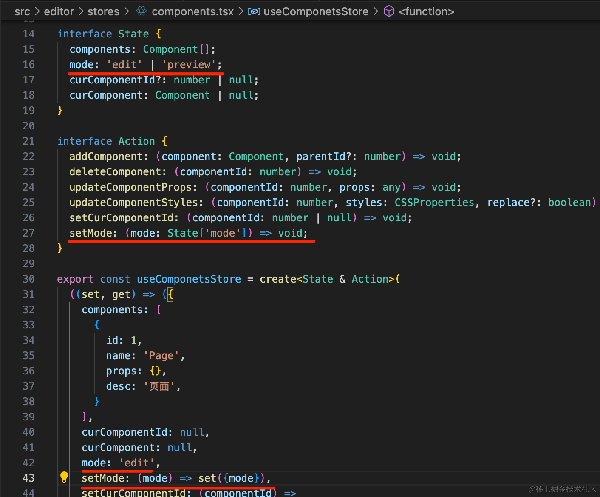
```javascript
mode: 'edit' | 'preview';
```
```javascript
setMode: (mode: State['mode']) => void;
```
```javascript
mode: 'edit',
setMode: (mode) => set({mode}),
```
然后渲染的时候用 mode 区分下：

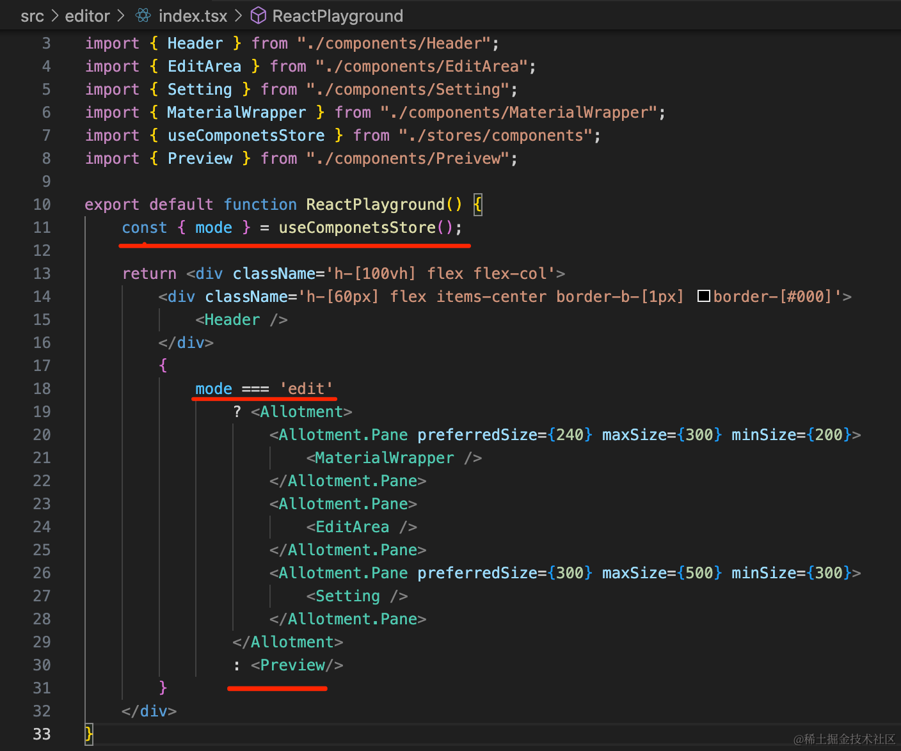

```javascript
import { Allotment } from "allotment";
import 'allotment/dist/style.css';
import { Header } from "./components/Header";
import { EditArea } from "./components/EditArea";
import { Setting } from "./components/Setting";
import { MaterialWrapper } from "./components/MaterialWrapper";
import { useComponetsStore } from "./stores/components";
import { Preview } from "./components/Preivew";

export default function ReactPlayground() {
    const { mode } = useComponetsStore();

    return <div className='h-[100vh] flex flex-col'>
        <div className='h-[60px] flex items-center border-b-[1px] border-[#000]'>
            <Header />
        </div>
        {
            mode === 'edit' 
                ? <Allotment>
                    <Allotment.Pane preferredSize={240} maxSize={300} minSize={200}>
                        <MaterialWrapper />
                    </Allotment.Pane>
                    <Allotment.Pane>
                        <EditArea />
                    </Allotment.Pane>
                    <Allotment.Pane preferredSize={300} maxSize={500} minSize={300}>
                        <Setting />
                    </Allotment.Pane>
                </Allotment>
                : <Preview/>
        }
    </div>
}
```
根据 mode 来渲染不同的足迹啊。

然后在 Header 加个预览按钮来切换 mode

```javascript
import { Button, Space } from 'antd';
import { useComponetsStore } from '../../stores/components';

export function Header() {

  const { mode, setMode, setCurComponentId } = useComponetsStore();

  return (
    <div className='w-[100%] h-[100%]'>
      <div className='h-[50px] flex justify-between items-center px-[20px]'>
        <div>低代码编辑器</div>
        <Space>
          {mode === 'edit' && (
            <Button
                onClick={() => {
                    setMode('preview');
                    setCurComponentId(null);
                }}
                type='primary'
            >
                预览
            </Button>
          )}
          {mode === 'preview' && (
            <Button
              onClick={() => { setMode('edit') }}
              type='primary'
            >
              退出预览
            </Button>
          )}
        </Space>
      </div>
    </div>
  )
}
```
加个预览、退出预览按钮，点击切换 mode。

当 mode 切换为 edit 时，还要把 curComponentId 置空

测试下：


这样，预览功能就完成了。

当然，现在组件比较少，后面多加一些组件就好了。

案例代码上传了[小册仓库](https://github.com/QuarkGluonPlasma/react-course-code/tree/main/lowcode-editor)，可以切换到这个 commit 查看：

```
git reset --hard 1db99bed7d588ac86fd0bdc006fad433f031cd31
```
## 总结

这节我们实现了源码、大纲、预览的功能。

源码和大纲比较简单，就是 json 的不同形式的展示，分别用 @monaco-editor/react 和 Tree 组件来做。

预览功能也是递归渲染 json 为组件树，但是组件不一样，预览和编辑状态的组件要分开写。

我们在 store 加了一个 mode 的状态，切换 mode 来切换渲染的内容。

这样，从编辑到预览的流程就打通了。
