# 第73章—低代码编辑器：事件绑定

这节我们来实现下事件绑定。

现在看下 amis 里事件绑定的流程：

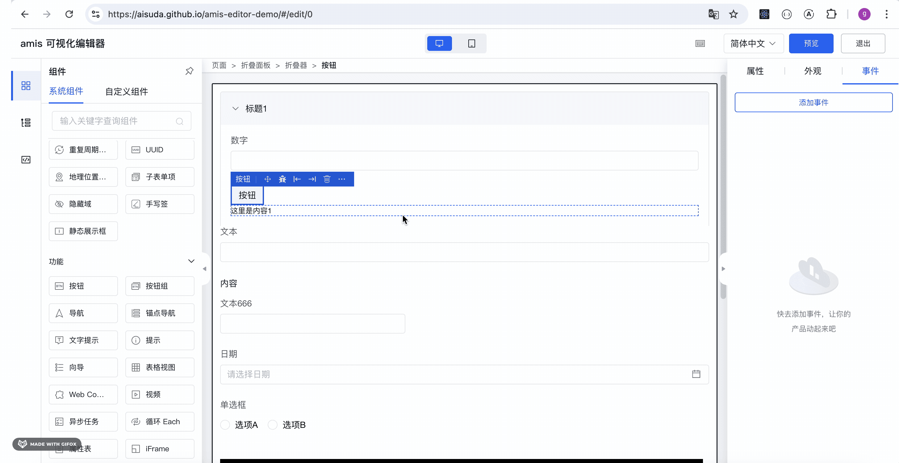

选中组件，在事件面板会列出可以绑定的事件。

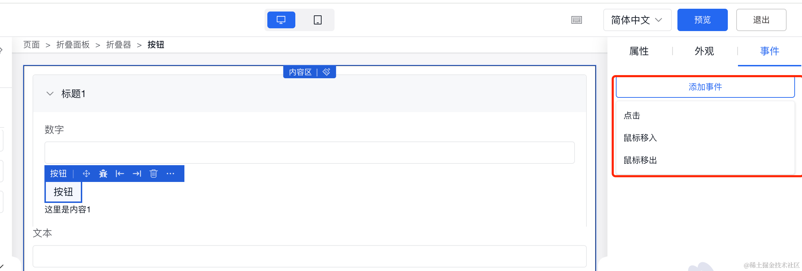

选中某个事件之后，可以添加动作：

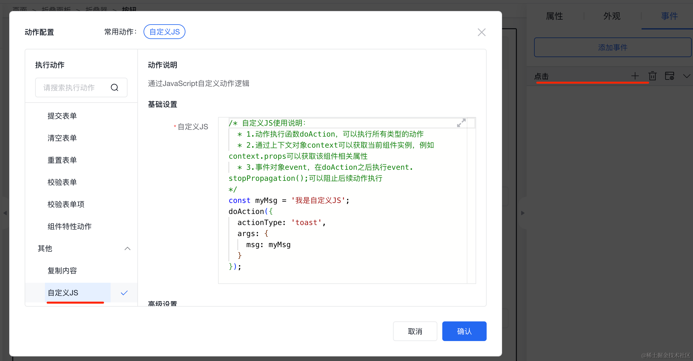

你可以添加自定义执行的 JS 代码。

或者执行一些内置的动作，比如跳转链接。

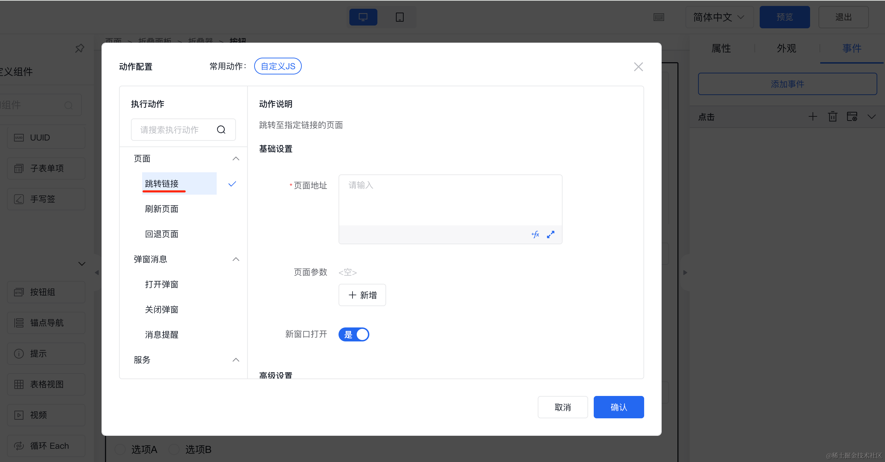

还可以调用别的组件的方法，比如修改某个组件的显示隐藏：

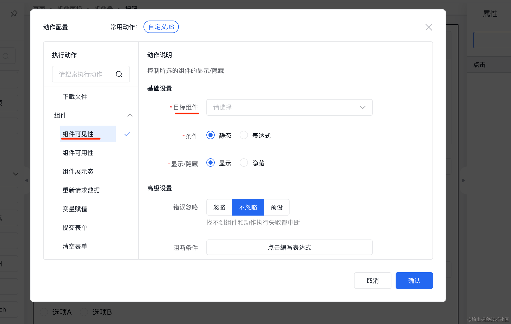

这节我们就实现下。

首先，不同组件可绑定的事件是不同的：

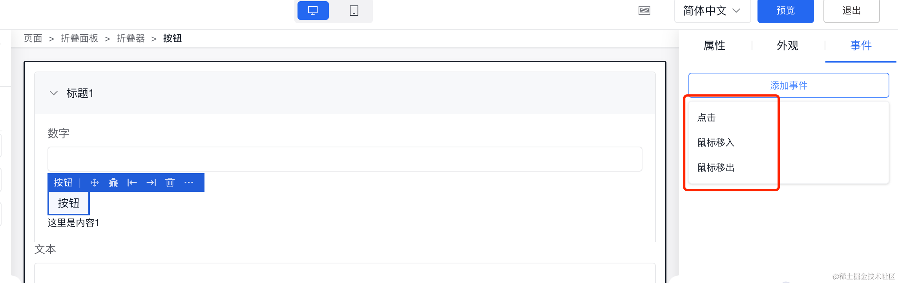

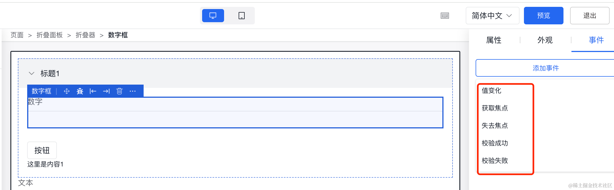

这明显也是需要配置的。

我们在 componentConfig 里加上这个配置：

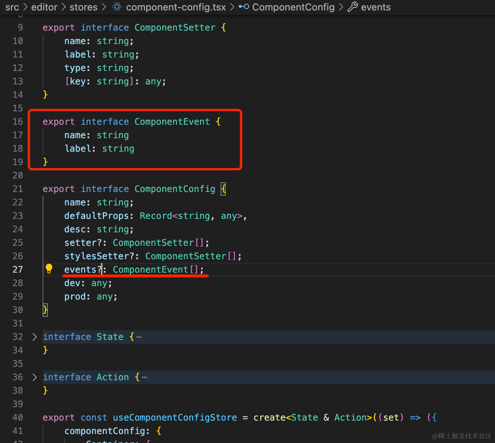

```javascript
export interface ComponentEvent {
    name: string
    label: string
}

export interface ComponentConfig {
    name: string;
    defaultProps: Record<string, any>,
    desc: string;
    setter?: ComponentSetter[];
    stylesSetter?: ComponentSetter[];
    events?: ComponentEvent[];
    dev: any;
    prod: any;
}
```
然后给 Button 组件配置一下：

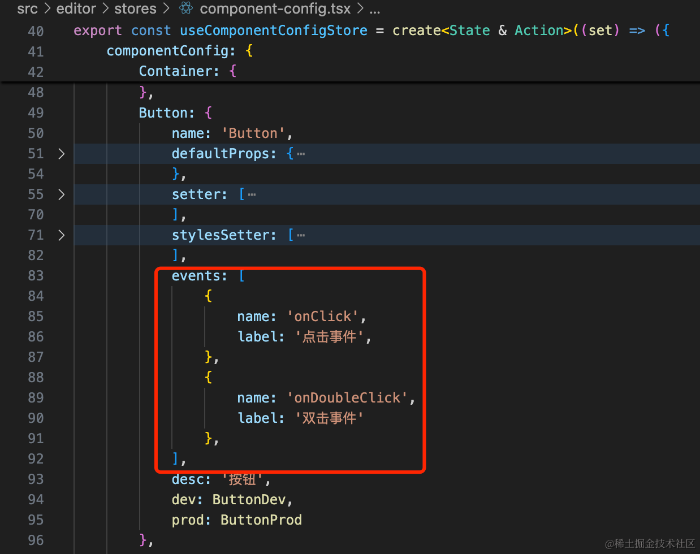

```javascript
events: [
    {
        name: 'onClick',
        label: '点击事件',
    },
    {
        name: 'onDoubleClick',
        label: '双击事件'
    },
],
```
改下 Setting/ComponentEvent.tsx 组件，把事件渲染出来：

```javascript
import { Collapse, Input, Select, CollapseProps} from 'antd';
import { useComponetsStore } from '../../stores/components';
import { useComponentConfigStore } from '../../stores/component-config';

export function ComponentEvent() {

    const { curComponentId, curComponent, updateComponentProps } = useComponetsStore();
    const { componentConfig } = useComponentConfigStore();

    if (!curComponent) return null;

    const items: CollapseProps['items'] = (componentConfig[curComponent.name].events || []).map(event => {
        return {
            key: event.name,
            label: event.label,
            children: <div>
                <div className='flex items-center'>
                    <div>动作：</div>
                    <Select
                        className='w-[160px]'
                        options={[
                            { label: '显示提示', value: 'showMessage' },
                            { label: '跳转链接', value: 'goToLink' },
                        ]}
                        value={curComponent?.props?.[event.name]?.type}
                    />
                </div>
            </div>
        }
    })

    return <div className='px-[10px]'>
        <Collapse className='mb-[10px]' items={items}/>
    </div>
}
```
根据 curComponent 从 componentConfig 取出对应组件的 events 配置。

用 antd 的 Collapse 组件渲染。


这样选中按钮组件的时候，就会渲染出它可以绑定的事件。

内置了两个动作：显示提示、跳转链接

当选择某个动作的时候，我们把它保存到 store 里。

比如 onClick 选择了 gotoLink 的动作，那就会在 component.props 上添加这样一个属性：

```javascript
onClick: {
    type: 'gotoLink'
}
```

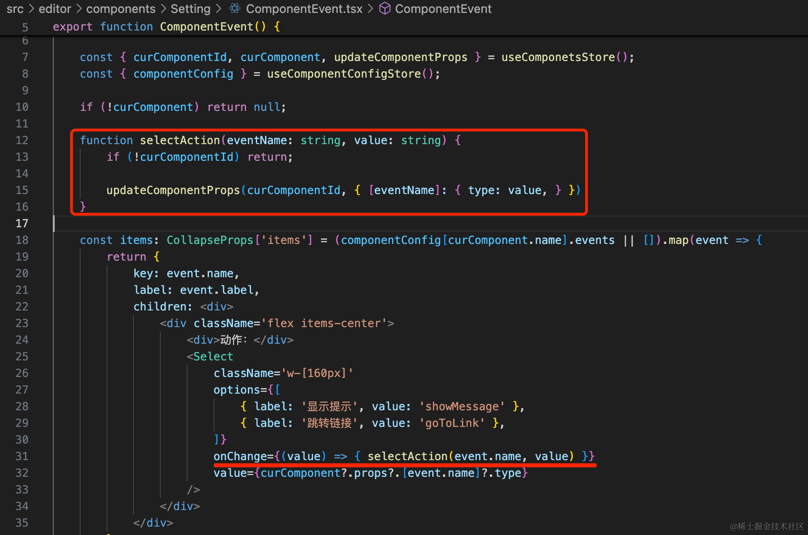

```javascript
onChange={(value) => { selectAction(event.name, value) }}
```
```javascript
function selectAction(eventName: string, value: string) {
    if (!curComponentId) return;

    updateComponentProps(curComponentId, { [eventName]: { type: value, } })
}
```
然后当切换到不同 action 的时候，显示对应的表单：

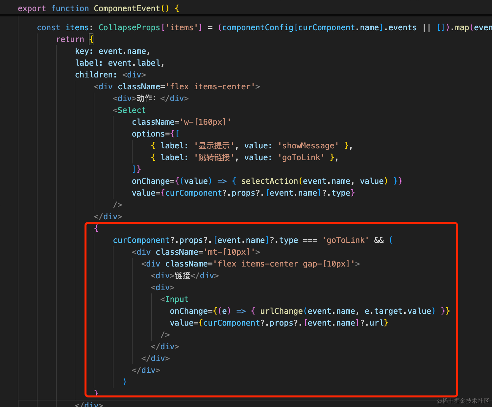

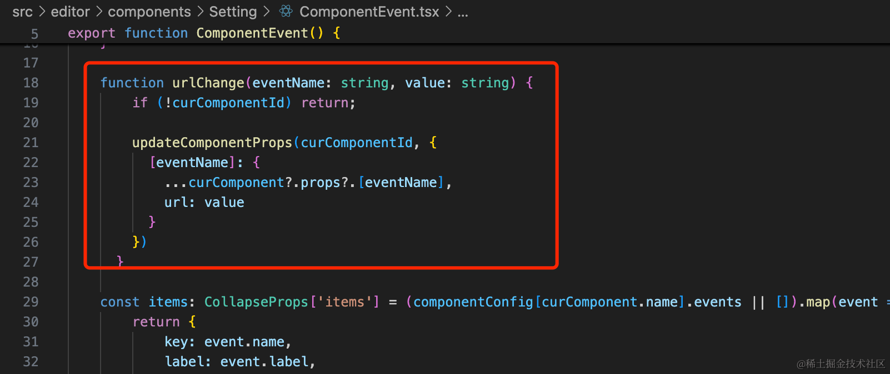

```javascript
import { Collapse, Input, Select, CollapseProps} from 'antd';
import { useComponetsStore } from '../../stores/components';
import { useComponentConfigStore } from '../../stores/component-config';

export function ComponentEvent() {

    const { curComponentId, curComponent, updateComponentProps } = useComponetsStore();
    const { componentConfig } = useComponentConfigStore();

    if (!curComponent) return null;

    function selectAction(eventName: string, value: string) {
        if (!curComponentId) return;

        updateComponentProps(curComponentId, { [eventName]: { type: value, } })
    }

    function urlChange(eventName: string, value: string) {
        if (!curComponentId) return;

        updateComponentProps(curComponentId, {
          [eventName]: {
            ...curComponent?.props?.[eventName],
            url: value
          }
        })
    }

    const items: CollapseProps['items'] = (componentConfig[curComponent.name].events || []).map(event => {
        return {
            key: event.name,
            label: event.label,
            children: <div>
                <div className='flex items-center'>
                    <div>动作：</div>
                    <Select
                        className='w-[160px]'
                        options={[
                            { label: '显示提示', value: 'showMessage' },
                            { label: '跳转链接', value: 'goToLink' },
                        ]}
                        onChange={(value) => { selectAction(event.name, value) }}
                        value={curComponent?.props?.[event.name]?.type}
                    />
                </div>
                {
                    curComponent?.props?.[event.name]?.type === 'goToLink' && (
                        <div className='mt-[10px]'>
                          <div className='flex items-center gap-[10px]'>
                            <div>链接</div>
                            <div>
                              <Input
                                onChange={(e) => { urlChange(event.name, e.target.value) }}
                                value={curComponent?.props?.[event.name]?.url}
                              />
                            </div>
                          </div>
                        </div>
                      )
                }
            </div>
        }
    })

    return <div className='px-[10px]'>
        <Collapse className='mb-[10px]' items={items}/>
    </div>
}
```
测试下：


当切换动作为跳转链接的时候，就会显示 url 的输入框。

输入 url 后，可以在 json 里看到这个信息：

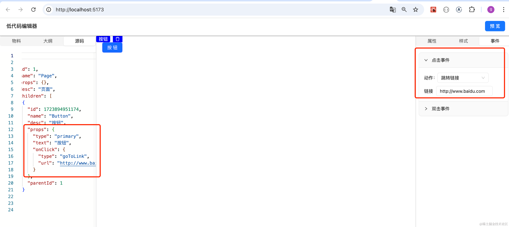

那渲染的时候根据这个绑定 click 事件就好了。

改下 Preview 组件：

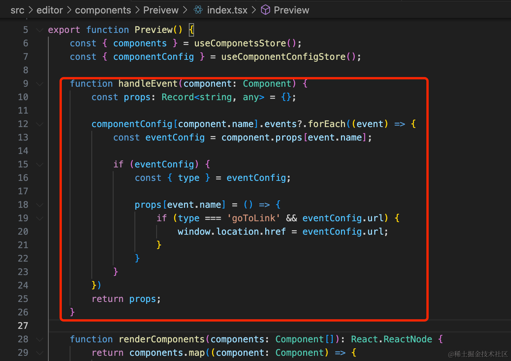

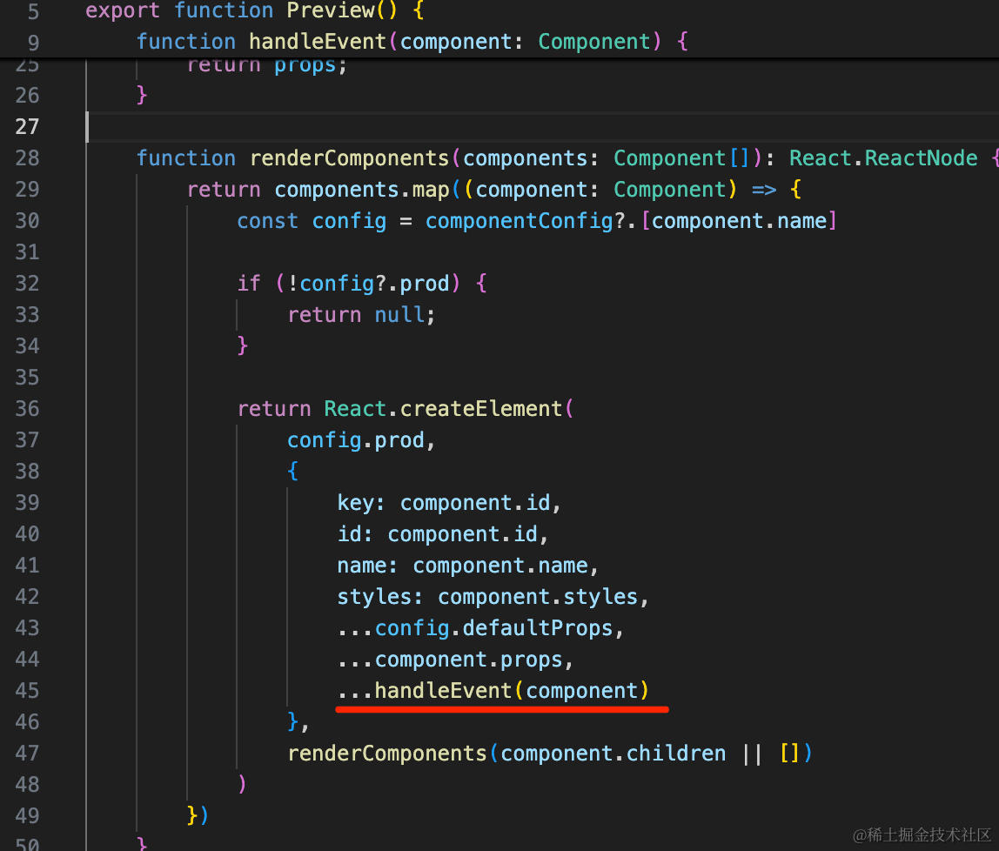

根据 componentConfig 里的事件类型给组件绑定事件。

如果有 components.props 里如果有 goToLink 的配置，就跳转链接。

```javascript
import React from "react";
import { useComponentConfigStore } from "../../stores/component-config";
import { Component, useComponetsStore } from "../../stores/components"

export function Preview() {
    const { components } = useComponetsStore();
    const { componentConfig } = useComponentConfigStore();

    function handleEvent(component: Component) {
        const props: Record<string, any> = {};

        componentConfig[component.name].events?.forEach((event) => {
            const eventConfig = component.props[event.name];

            if (eventConfig) {
                const { type } = eventConfig;

                props[event.name] = () => {
                    if (type === 'goToLink' && eventConfig.url) {
                        window.location.href = eventConfig.url;
                    }
                }
            }
        })
        return props;
    }

    function renderComponents(components: Component[]): React.ReactNode {
        return components.map((component: Component) => {
            const config = componentConfig?.[component.name]

            if (!config?.prod) {
                return null;
            }
            
            return React.createElement(
                config.prod,
                {
                    key: component.id,
                    id: component.id,
                    name: component.name,
                    styles: component.styles,
                    ...config.defaultProps,
                    ...component.props,
                    ...handleEvent(component)
                },
                renderComponents(component.children || [])
            )
        })
    }

    return <div>
        {renderComponents(components)}
    </div>
}
```

然后组件里接收这个参数：


测试下：

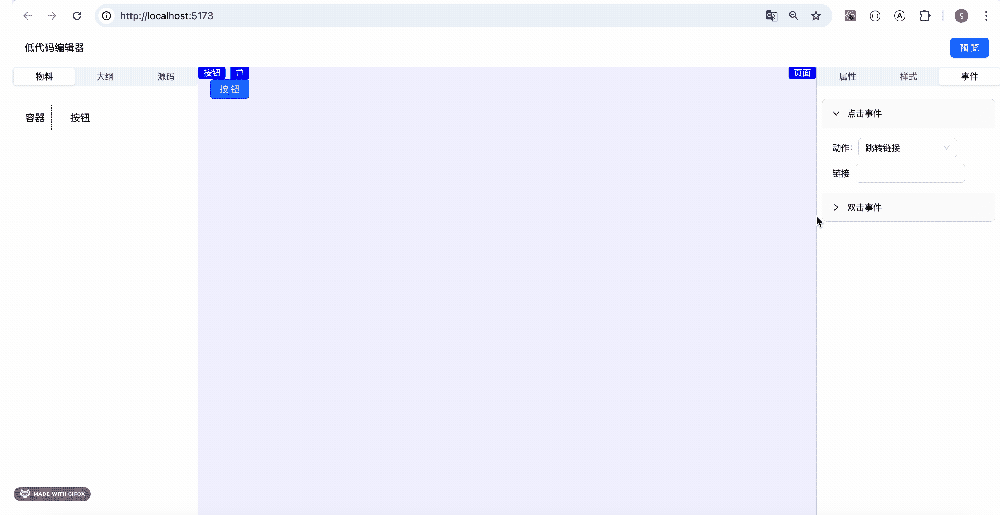

这样，我们第一个动作就完成了。

对比下 amis 里的实现：


没跳转是因为 amis 在预览模式下禁止了跳转：

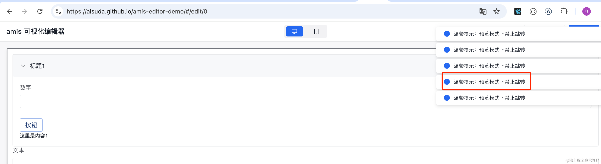

虽然交互有点区别，但流程是一样的。

看下 amis 的 json：

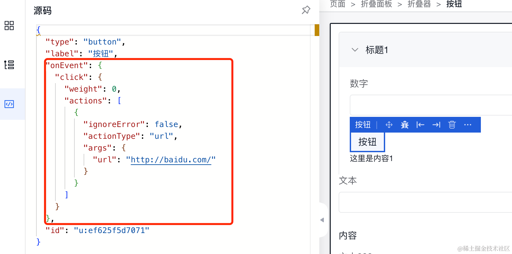

也是把动作信息记录在 json 里，渲染的时候用这些来绑定事件。

动作后面会越来越多，所以最好抽成组件：

新建 Setting/actions/GoToLink.tsx

```javascript
import { Input } from "antd"
import { ComponentEvent } from "../../../stores/component-config";
import { useComponetsStore } from "../../../stores/components";

export function GoToLink(props: { event: ComponentEvent }) {
    const { event } = props;

    const { curComponentId, curComponent, updateComponentProps } = useComponetsStore();

    function urlChange(eventName: string, value: string) {
        if (!curComponentId) return;

        updateComponentProps(curComponentId, {
          [eventName]: {
            ...curComponent?.props?.[eventName],
            url: value
          }
        })
    }

    return <div className='mt-[10px]'>
        <div className='flex items-center gap-[10px]'>
        <div>链接</div>
        <div>
            <Input
                onChange={(e) => { urlChange(event.name, e.target.value) }}
                value={curComponent?.props?.[event.name]?.url}
            />
        </div>
        </div>
    </div>
}
```
把跳转链接的表单抽离到这里：

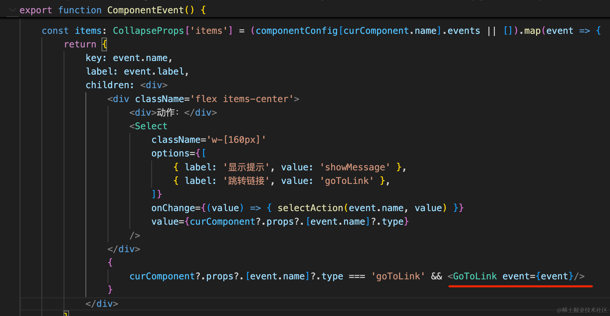

然后我们再实现一个动作：

Setting/actions/ShowMessage.tsx

```javascript
import { Input, Select } from "antd"
import { ComponentEvent } from "../../../stores/component-config";
import { useComponetsStore } from "../../../stores/components";

export function ShowMessage(props: { event: ComponentEvent }) {
    const { event } = props;

    const { curComponentId, curComponent, updateComponentProps } = useComponetsStore();

    function messageTypeChange(eventName: string, value: string) {
        if (!curComponentId) return;

        updateComponentProps(curComponentId, {
          [eventName]: {
            ...curComponent?.props?.[eventName],
            config: {
              ...curComponent?.props?.[eventName]?.config,
              type: value,
            },
          }
        })
      }
    
    function messageTextChange(eventName: string, value: string) {
        if (!curComponentId) return;

        updateComponentProps(curComponentId, {
            [eventName]: {
                ...curComponent?.props?.[eventName],
                config: {
                    ...curComponent?.props?.[eventName]?.config,
                    text: value,
                },
            },
        })
    }

    return <div className='mt-[10px]'>
        <div className='flex items-center gap-[10px]'>
            <div>类型：</div>
            <div>
            <Select
                style={{ width: 160 }}
                options={[
                    { label: '成功', value: 'success' },
                    { label: '失败', value: 'error' },
                ]}
                onChange={(value) => { messageTypeChange(event.name, value) }}
                value={curComponent?.props?.[event.name]?.config?.type}
            />
            </div>
        </div>
        <div className='flex items-center gap-[10px] mt-[10px]'>
            <div>文本：</div>
            <div>
            <Input
                onChange={(e) => { messageTextChange(event.name, e.target.value) }}
                value={curComponent?.props?.[event.name]?.config?.text}
            />
            </div>
        </div>
    </div>
}
```
和 GoToLink 差不多，只不过现在多了一个 Select 表单。

用一下：

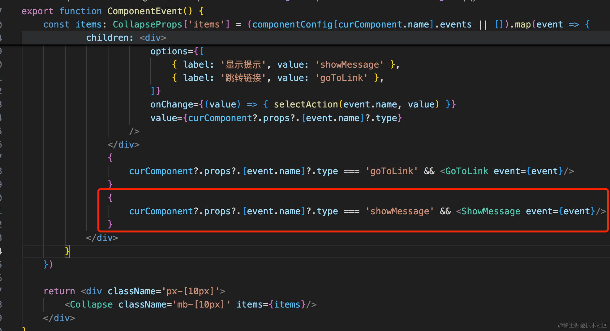

```javascript
{
    curComponent?.props?.[event.name]?.type === 'showMessage' && <ShowMessage event={event}/>
}
```
渲染的时候做下处理：

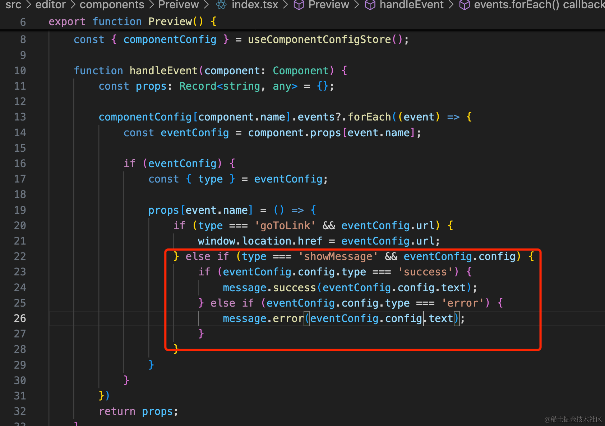

```javascript
props[event.name] = () => {
    if (type === 'goToLink' && eventConfig.url) {
        window.location.href = eventConfig.url;
    } else if (type === 'showMessage' && eventConfig.config) {
        if (eventConfig.config.type === 'success') {
            message.success(eventConfig.config.text);
        } else if (eventConfig.config.type === 'error') {
            message.error(eventConfig.config.text);
        }
    }
}
```
试一下效果：


这样我们就实现了 showMessage 的动作：

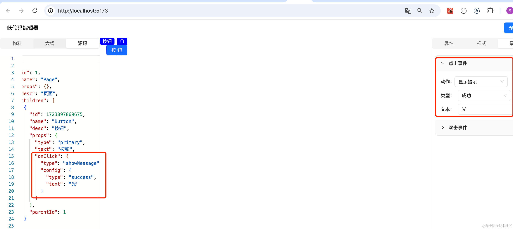

试下 amis 里的：


一样。

当然，amis 里是支持绑定多个动作的：

它的 actions 是个数组：

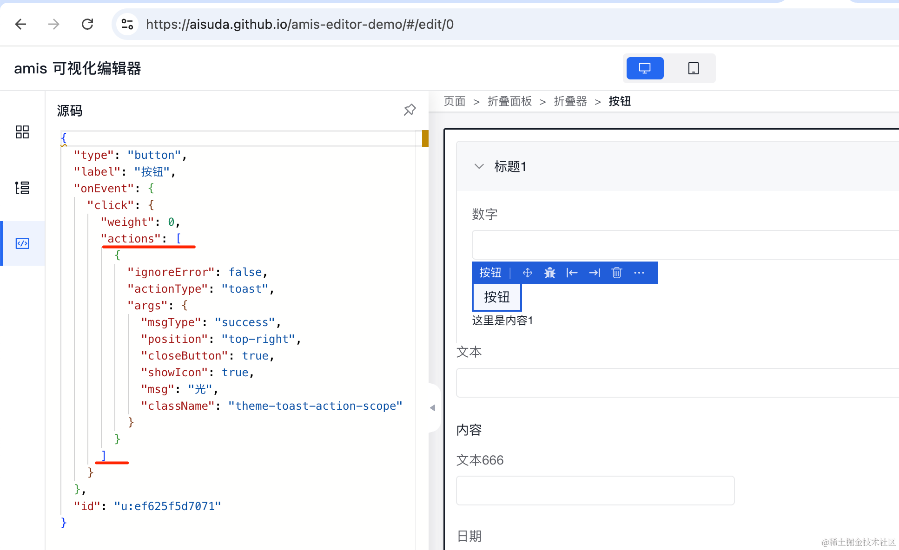

我们目前只支持绑定一个 action。

这个也很简单，就是把存储结构改为数组，然后界面支持添加多个动作，大家可以自己完善。

案例代码上传了[小册仓库](https://github.com/QuarkGluonPlasma/react-course-code/tree/main/lowcode-editor)，可以切换到这个 commit 查看：

```
git reset --hard 4fd81d180f8369efb4142876944b0c70a6f4cd6c
```

## 总结

这节我们实现了事件绑定。

我们先实现了内置动作的方式。

在 comonentConfig 里配置组件可以绑定的事件，然后在 Setting 区事件面板里展示。

可以选择绑定的动作，比如跳转链接，显示提示，输入一些参数之后，就会保存到 json 里。

然后渲染 Preview 的时候根据这些信息来绑定事件。

我们对比了下和 amis 的区别，内置动作这些的实现一样的。

当然，事件绑定还有别的方式，下节我们继续完善。
