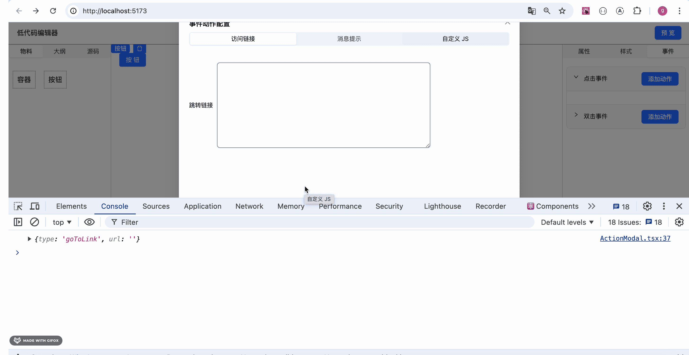

# 第74章—低代码编辑器：动作弹窗

上节我们实现了事件绑定，并内置了两个动作：


我们没用弹窗展示动作：


这样当动作多了就不好展示了。

我们改一下：

新建 Setting/ActionModal.tsx

```javascript
import { Modal, Segmented } from "antd";
import { useState } from "react";
import { GoToLink } from "./actions/GoToLink";
import { ComponentEvent } from "../../stores/component-config";
import { ShowMessage } from "./actions/ShowMessage";

interface ActionModalProps {
    visible: boolean
    eventConfig: ComponentEvent
    handleOk: () => void
    handleCancel: () => void
}

export function ActionModal(props: ActionModalProps) {
    const {
        visible,
        handleOk,
        eventConfig,
        handleCancel
    } = props;

    const [key, setKey] = useState<string>('访问链接');

    return  <Modal 
        title="事件动作配置" 
        width={800}
        open={visible}
        okText="添加"
        cancelText="取消"
        onOk={handleOk}
        onCancel={handleCancel}
    >
        <div className="h-[500px]">
            <Segmented value={key} onChange={setKey} block options={['访问链接', '消息提示', '自定义 JS']} />
            {
                key === '访问链接' && <GoToLink event={eventConfig}/>
            }
            {
                key === '消息提示' && <ShowMessage event={eventConfig}/>
            }
        </div>
    </Modal>
}
```

就是展示所有的动作，当选择某个动作，输入内容后，修改对应的 event 配置。

在 ComponentEvent 里调用下：


加一个 state 来控制弹窗打开关闭。

再加一个 state 来记录当前的 event 配置，当点击 label 的添加动作按钮的时候，打开弹窗，记录当前 event

```javascript
import { Collapse, Input, Select, CollapseProps, Button} from 'antd';
import { useComponetsStore } from '../../stores/components';
import { useComponentConfigStore } from '../../stores/component-config';
import type { ComponentEvent } from '../../stores/component-config';
import { ActionModal } from './ActionModal';
import { useState } from 'react';

export function ComponentEvent() {

    const { curComponentId, curComponent, updateComponentProps } = useComponetsStore();
    const { componentConfig } = useComponentConfigStore();
    const [actionModalOpen, setActionModalOpen] = useState(false);
    const [curEvent, setCurEvent] = useState<ComponentEvent>();

    if (!curComponent) return null;

    const items: CollapseProps['items'] = (componentConfig[curComponent.name].events || []).map(event => {
        return {
            key: event.name,
            label: <div className='flex justify-between leading-[30px]'>
                {event.label}
                <Button type="primary" onClick={() => {
                    setCurEvent(event);
                    setActionModalOpen(true);
                }}>添加动作</Button>
            </div>,
            children: <div>
                
            </div>
        }
    })

    return <div className='px-[10px]'>
        <Collapse className='mb-[10px]' items={items}/>
        <ActionModal visible={actionModalOpen} eventConfig={curEvent!} handleOk={() => {
            setActionModalOpen(false)
        }} handleCancel={() => {
            setActionModalOpen(false)
        }}/>
    </div>
}

```

试一下：


展示出来了，就是有点小。

我们把表单改大一点：


```javascript
import { Input } from "antd"
import { ComponentEvent } from "../../../stores/component-config";
import { useComponetsStore } from "../../../stores/components";
import TextArea from "antd/es/input/TextArea";

export function GoToLink(props: { event: ComponentEvent }) {
    const { event } = props;

    const { curComponentId, curComponent, updateComponentProps } = useComponetsStore();

    function urlChange(eventName: string, value: string) {
        if (!curComponentId) return;

        updateComponentProps(curComponentId, {
          [eventName]: {
            ...curComponent?.props?.[eventName],
            url: value
          }
        })
    }

    return <div className='mt-[40px]'>
        <div className='flex items-center gap-[10px]'>
            <div>跳转链接</div>
            <div>
                <TextArea
                    style={{height: 200, width: 500, border: '1px solid #000'}}
                    onChange={(e) => { urlChange(event.name, e.target.value) }}
                    value={curComponent?.props?.[event.name]?.url}
                />
            </div>
        </div>
    </div>
}
```
```javascript
import { Input, Select } from "antd"
import { ComponentEvent } from "../../../stores/component-config";
import { useComponetsStore } from "../../../stores/components";

export function ShowMessage(props: { event: ComponentEvent }) {
    const { event } = props;

    const { curComponentId, curComponent, updateComponentProps } = useComponetsStore();

    function messageTypeChange(eventName: string, value: string) {
        if (!curComponentId) return;

        updateComponentProps(curComponentId, {
          [eventName]: {
            ...curComponent?.props?.[eventName],
            config: {
              ...curComponent?.props?.[eventName]?.config,
              type: value,
            },
          }
        })
      }
    
    function messageTextChange(eventName: string, value: string) {
        if (!curComponentId) return;

        updateComponentProps(curComponentId, {
            [eventName]: {
                ...curComponent?.props?.[eventName],
                config: {
                    ...curComponent?.props?.[eventName]?.config,
                    text: value,
                },
            },
        })
    }

    return <div className='mt-[30px]'>
        <div className='flex items-center gap-[20px]'>
            <div>类型：</div>
            <div>
            <Select
                style={{ width: 500, height: 50 }}
                options={[
                    { label: '成功', value: 'success' },
                    { label: '失败', value: 'error' },
                ]}
                onChange={(value) => { messageTypeChange(event.name, value) }}
                value={curComponent?.props?.[event.name]?.config?.type}
            />
            </div>
        </div>
        <div className='flex items-center gap-[20px] mt-[50px]'>
            <div>文本：</div>
                <div>
                <Input
                    style={{ width: 500, height: 50 }}
                    onChange={(e) => { messageTextChange(event.name, e.target.value) }}
                    value={curComponent?.props?.[event.name]?.config?.text}
                />
            </div>
        </div>
    </div>
}
```
看下效果：


好多了。

之前我们是在 action 组件里直接修改 json，

现在改为通过 onChange 暴露出来，然后后面在点添加按钮的时候再改 json：


```javascript
import { useState } from "react";
import { useComponetsStore } from "../../../stores/components";
import TextArea from "antd/es/input/TextArea";

export interface GoToLinkConfig {
    type: 'goToLink',
    url: string
}

export interface GoToLinkProps {
    defaultValue?: string
    onChange?: (config: GoToLinkConfig) => void
}

export function GoToLink(props: GoToLinkProps) {
    const { defaultValue, onChange } = props;

    const { curComponentId } = useComponetsStore();
    const [value, setValue] = useState(defaultValue);

    function urlChange(value: string) {
        if (!curComponentId) return;

        setValue(value);

        onChange?.({
            type: 'goToLink',
            url: value
        });
    }

    return <div className='mt-[40px]'>
        <div className='flex items-center gap-[10px]'>
            <div>跳转链接</div>
            <div>
                <TextArea
                    style={{height: 200, width: 500, border: '1px solid #000'}}
                    onChange={(e) => { urlChange(e.target.value) }}
                    value={value || ''}
                />
            </div>
        </div>
    </div>
}
```
现在不用传入 event 配置了，传入回显的 value 就行。

ShowMessage 组件也是这样改：


```javascript
import { Input, Select } from "antd"
import { useComponetsStore } from "../../../stores/components";
import { useState } from "react";

export interface ShowMessageConfig {
    type: 'showMessage',
    config: {
        type: 'success' | 'error'
        text: string
    }
}

export interface ShowMessageProps {
    value?: ShowMessageConfig['config']
    onChange?: (config: ShowMessageConfig) => void
}

export function ShowMessage(props: ShowMessageProps) {
    const { value, onChange } = props;

    const { curComponentId } = useComponetsStore();

    const [type, setType] = useState<'success' | 'error'>(value?.type || 'success');
    const [text, setText] = useState<string>(value?.text || '');

    function messageTypeChange(value: 'success' | 'error') {
        if (!curComponentId) return;

        setType(value);

        onChange?.({
            type: 'showMessage',
            config: {
                type: value,
                text
            }
        })
      }
    
    function messageTextChange(value: string) {
        if (!curComponentId) return;

        setText(value);

        onChange?.({
            type: 'showMessage',
            config: {
                type,
                text: value
            }
        })
    }

    return <div className='mt-[30px]'>
        <div className='flex items-center gap-[20px]'>
            <div>类型：</div>
            <div>
            <Select
                style={{ width: 500, height: 50 }}
                options={[
                    { label: '成功', value: 'success' },
                    { label: '失败', value: 'error' },
                ]}
                onChange={(value) => { messageTypeChange(value) }}
                value={type}
            />
            </div>
        </div>
        <div className='flex items-center gap-[20px] mt-[50px]'>
            <div>文本：</div>
                <div>
                <Input
                    style={{ width: 500, height: 50 }}
                    onChange={(e) => { messageTextChange(e.target.value) }}
                    value={text}
                />
            </div>
        </div>
    </div>
}
```
试一下：


```javascript
{
    key === '访问链接' && <GoToLink onChange={(config) => {
        console.log(config);
    }}/>
}
{
    key === '消息提示' && <ShowMessage onChange={(config) => {
        console.log(config);
    }}/>
}
```



现在选择某个动作，填入配置的时候，在 ActionModal 里就能拿到。

那接下来只要在 handleOk 里传出去，然后父组件里加到 store 就可以了。


```javascript
import { Modal, Segmented } from "antd";
import { useState } from "react";
import { GoToLink, GoToLinkConfig } from "./actions/GoToLink";
import { ComponentEvent } from "../../stores/component-config";
import { ShowMessage, ShowMessageConfig } from "./actions/ShowMessage";

interface ActionModalProps {
    visible: boolean
    handleOk: (config?: GoToLinkConfig | ShowMessageConfig) => void
    handleCancel: () => void
}

export function ActionModal(props: ActionModalProps) {
    const {
        visible,
        handleOk,
        handleCancel
    } = props;

    const [key, setKey] = useState<string>('访问链接');
    const [curConfig, setCurConfig] = useState<GoToLinkConfig | ShowMessageConfig>();

    return  <Modal 
        title="事件动作配置" 
        width={800}
        open={visible}
        okText="确认"
        cancelText="取消"
        onOk={() => handleOk(curConfig)}
        onCancel={handleCancel}
    >
        <div className="h-[500px]">
            <Segmented value={key} onChange={setKey} block options={['访问链接', '消息提示', '自定义 JS']} />
            {
                key === '访问链接' && <GoToLink onChange={(config) => {
                    setCurConfig(config);
                }}/>
            }
            {
                key === '消息提示' && <ShowMessage onChange={(config) => {
                    setCurConfig(config);
                }}/>
            }
        </div>
    </Modal>
}
```
在父组件里添加到 store 里：


```javascript
import { Collapse, Input, Select, CollapseProps, Button} from 'antd';
import { useComponetsStore } from '../../stores/components';
import { useComponentConfigStore } from '../../stores/component-config';
import type { ComponentEvent } from '../../stores/component-config';
import { ActionModal } from './ActionModal';
import { useState } from 'react';
import { GoToLinkConfig } from './actions/GoToLink';
import { ShowMessageConfig } from './actions/ShowMessage';

export function ComponentEvent() {

    const { curComponentId, curComponent, updateComponentProps } = useComponetsStore();
    const { componentConfig } = useComponentConfigStore();
    const [actionModalOpen, setActionModalOpen] = useState(false);
    const [curEvent, setCurEvent] = useState<ComponentEvent>();

    if (!curComponent) return null;

    const items: CollapseProps['items'] = (componentConfig[curComponent.name].events || []).map(event => {
        return {
            key: event.name,
            label: <div className='flex justify-between leading-[30px]'>
                {event.label}
                <Button type="primary" onClick={() => {
                    setCurEvent(event);
                    setActionModalOpen(true);
                }}>添加动作</Button>
            </div>,
            children: <div>
                
            </div>
        }
    })

    function handleModalOk(config?: GoToLinkConfig | ShowMessageConfig) {
        if(!config || !curEvent || !curComponent) {
            return ;
        }

        updateComponentProps(curComponent.id,  { 
            [curEvent.name]: { 
                actions: [
                    ...(curComponent.props[curEvent.name]?.actions || []),
                    config
                ]
            }
        })

        setActionModalOpen(false)
    }

    return <div className='px-[10px]'>
        <Collapse className='mb-[10px]' items={items}/>
        <ActionModal visible={actionModalOpen} handleOk={handleModalOk} handleCancel={() => {
            setActionModalOpen(false)
        }}/>
    </div>
}
```
试一下：


现在的 json 结构就支持多个动作了：


和 amis 的一样：


然后我们也做下这个列表展示：


```javascript
children: <div>
    {
        (curComponent.props[event.name]?.actions || []).map((item: GoToLinkConfig | ShowMessageConfig) => {
            return <div>
                {
                    item.type === 'goToLink' ? <div className='border border-[#aaa] m-[10px] p-[10px]'>
                        <div className='text-[blue]'>跳转链接</div>
                        <div>{item.url}</div>
                    </div> : null
                }
                {
                    item.type === 'showMessage' ? <div className='border border-[#aaa] m-[10px] p-[10px]'>
                        <div className='text-[blue]'>消息弹窗</div>
                        <div>{item.config.type}</div>
                        <div>{item.config.text}</div>
                    </div> : null
                }
            </div>
        })
    }
</div>
```


列表展示没问题。

只是每次都会触发展开收起。

我们加一个 defaultActiveKey 让所有的都展开：


```javascript
defaultActiveKey={componentConfig[curComponent.name].events?.map(item =>item.name)}
```

然后禁止点击事件冒泡，这样点击按钮就不会收起 Collapse 了：


然后在 Preview 组件里处理下事件绑定：


```javascript
function handleEvent(component: Component) {
    const props: Record<string, any> = {};

    componentConfig[component.name].events?.forEach((event) => {
        const eventConfig = component.props[event.name];

        if (eventConfig) {
            props[event.name] = () => {
                eventConfig?.actions?.forEach((action: GoToLinkConfig | ShowMessageConfig) => {
                    if (action.type === 'goToLink') {
                        window.location.href = action.url;
                    } else if (action.type === 'showMessage') {
                        if (action.config.type === 'success') {
                            message.success(action.config.text);
                        } else if (action.config.type === 'error') {
                            message.error(action.config.text);
                        }
                    }
                })

            }
        }
    })
    return props;
}
```
相比之前，就是多了个遍历的过程。

测试下：


添加两个消息提示的动作，可以看到，两个动作都执行了。

最后我们再做下动作的删除就好了：


通过绝对定位在右上角显示一个删除按钮，点击按钮删除对应 index 的 action。

```javascript
import { Collapse, Input, Select, CollapseProps, Button} from 'antd';
import { useComponetsStore } from '../../stores/components';
import { useComponentConfigStore } from '../../stores/component-config';
import type { ComponentEvent } from '../../stores/component-config';
import { ActionModal } from './ActionModal';
import { useState } from 'react';
import { GoToLinkConfig } from './actions/GoToLink';
import { ShowMessageConfig } from './actions/ShowMessage';
import { DeleteOutlined } from '@ant-design/icons';

export function ComponentEvent() {

    const { curComponentId, curComponent, updateComponentProps } = useComponetsStore();
    const { componentConfig } = useComponentConfigStore();
    const [actionModalOpen, setActionModalOpen] = useState(false);
    const [curEvent, setCurEvent] = useState<ComponentEvent>();

    if (!curComponent) return null;

    function deleteAction(event: ComponentEvent, index: number) {
        if(!curComponent) {
            return;
        }

        const actions = curComponent.props[event.name]?.actions;

        actions.splice(index, 1)

        updateComponentProps(curComponent.id,  { 
            [event.name]: { 
                actions: actions
            }
        })
    }

    const items: CollapseProps['items'] = (componentConfig[curComponent.name].events || []).map(event => {
        return {
            key: event.name,
            label: <div className='flex justify-between leading-[30px]'>
                {event.label}
                <Button type="primary" onClick={(e) => {
                    e.stopPropagation();

                    setCurEvent(event);
                    setActionModalOpen(true);
                }}>添加动作</Button>
            </div>,
            children: <div>
                {
                    (curComponent.props[event.name]?.actions || []).map((item: GoToLinkConfig | ShowMessageConfig, index: number) => {
                        return <div>
                            {
                                item.type === 'goToLink' ? <div className='border border-[#aaa] m-[10px] p-[10px] relative'>
                                    <div className='text-[blue]'>跳转链接</div>
                                    <div>{item.url}</div>
                                    <div style={{ position: 'absolute', top: 10, right: 10, cursor: 'pointer' }}
                                        onClick={() => deleteAction(event, index)}
                                    ><DeleteOutlined /></div>
                                </div> : null
                            }
                            {
                                item.type === 'showMessage' ? <div className='border border-[#aaa] m-[10px] p-[10px] relative'>
                                    <div className='text-[blue]'>消息弹窗</div>
                                    <div>{item.config.type}</div>
                                    <div>{item.config.text}</div>
                                    <div style={{ position: 'absolute', top: 10, right: 10, cursor: 'pointer' }}
                                        onClick={() => deleteAction(event, index)}
                                    ><DeleteOutlined /></div>
                                </div> : null
                            }
                        </div>
                    })
                }
            </div>
        }
    })

    function handleModalOk(config?: GoToLinkConfig | ShowMessageConfig) {
        if(!config || !curEvent || !curComponent) {
            return ;
        }

        updateComponentProps(curComponent.id,  { 
            [curEvent.name]: { 
                actions: [
                    ...(curComponent.props[curEvent.name]?.actions || []),
                    config
                ]
            }
        })

        setActionModalOpen(false)
    }

    return <div className='px-[10px]'>
        <Collapse className='mb-[10px]' items={items} defaultActiveKey={componentConfig[curComponent.name].events?.map(item =>item.name)}/>
        <ActionModal visible={actionModalOpen} handleOk={handleModalOk} handleCancel={() => {
            setActionModalOpen(false)
        }}/>
    </div>
}
```


删除成功，json 也修改了。

案例代码上传了[小册仓库](https://github.com/QuarkGluonPlasma/react-course-code/tree/main/lowcode-editor)，可以切换到这个 commit 查看：

```
git reset --hard c85c9913270242f216ec28d18f03cb64887475b4
```
## 总结

之前我们是直接在 Setting 区域展示的动作表单，动作多了以后不好展示，这节我们实现了动作选择弹窗。

选择一个动作，填入信息之后，点击添加就可以添加到 actions 里。

在预览的时候会同时执行多个动作。

主流的低代码编辑器的添加动作的交互都是这么做的。
