# 第75章—低代码编辑器：自定义JS

前面实现了内置的几个动作，这节来实现下自定义 JS。

比如 [amis](https://aisuda.github.io/amis-editor-demo/#/edit/0)：

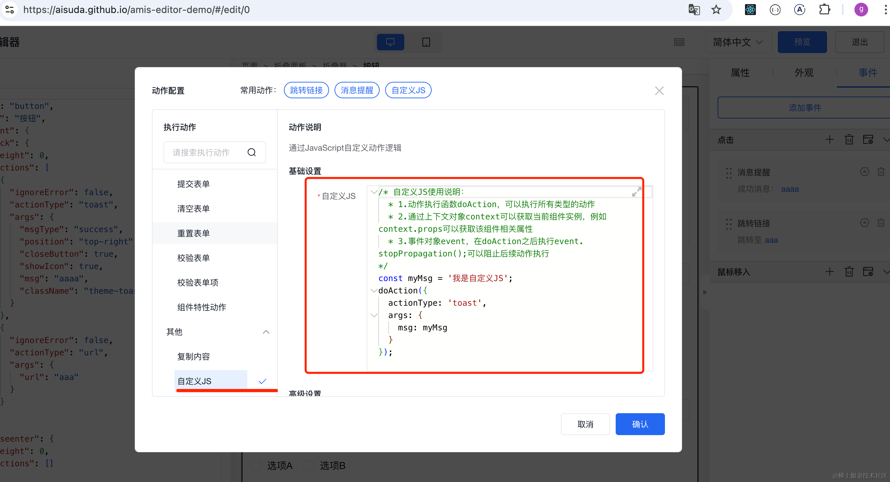

它就支持通过代码来自定义动作。

而且自定义 JS 可以拿到 doAction 方法来执行其他动作：

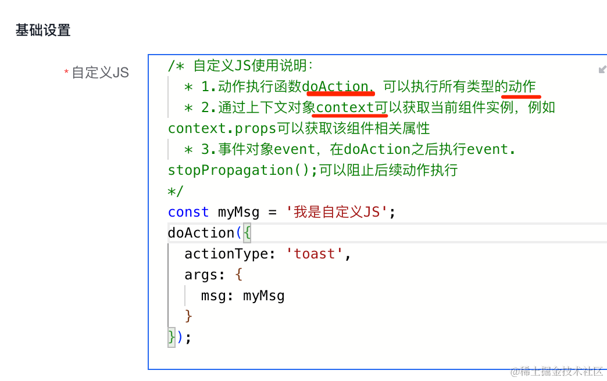

可以通过 context 拿到组件信息。

我们也来实现下。

创建 Setting/actions/CustomJS.tsx

```javascript
import { useState } from "react";
import { useComponetsStore } from "../../../stores/components";
import MonacoEditor, { OnMount } from '@monaco-editor/react'

export interface CustomJSConfig {
    type: 'customJS',
    code: string
}

export interface CustomJSProps {
    defaultValue?: string
    onChange?: (config: CustomJSConfig) => void
}

export function CustomJS(props: CustomJSProps) {
    const { defaultValue, onChange } = props;

    const { curComponentId } = useComponetsStore();
    const [value, setValue] = useState(defaultValue);

    function codeChange(value?: string) {
        if (!curComponentId) return;

        setValue(value);

        onChange?.({
            type: 'customJS',
            code: value!
        })
    }

    const handleEditorMount: OnMount = (editor, monaco) => {
        editor.addCommand(monaco.KeyMod.CtrlCmd | monaco.KeyCode.KeyJ, () => {
            editor.getAction('editor.action.formatDocument')?.run()
        });
    }

    return <div className='mt-[40px]'>
        <div className='flex items-start gap-[20px]'>
            <div>自定义 JS</div>
            <div>
                <MonacoEditor
                    width={'600px'}
                    height={'400px'}
                    path='action.js'
                    language='javascript'
                    onMount={handleEditorMount}
                    onChange={codeChange}
                    value={value}
                    options={
                        {
                            fontSize: 14,
                            scrollBeyondLastLine: false,
                            minimap: {
                                enabled: false,
                            },
                            scrollbar: {
                                verticalScrollbarSize: 6,
                                horizontalScrollbarSize: 6,
                            },
                        }
                    }
                />
            </div>
        </div>
    </div>
}
```

和其他动作表单不同的是这里用 monaco editor。

然后在 ActionModal 里用一下：

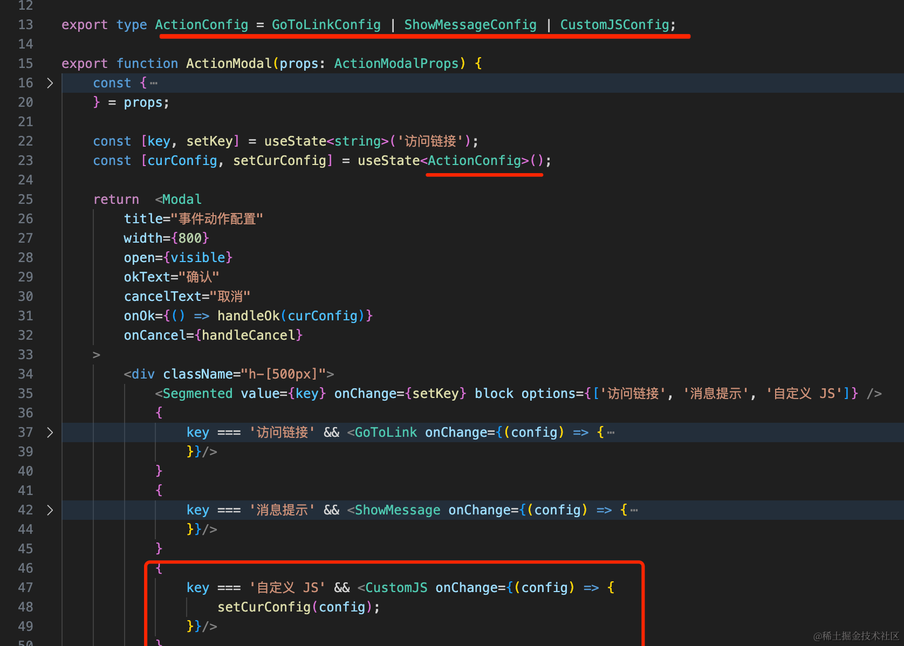

切换自定义 JS 的 tab 时，渲染 CustomJS 组件。

顺便把类型也改一下，加上 CustomJSConfig 的类型

```javascript
import { Modal, Segmented } from "antd";
import { useState } from "react";
import { GoToLink, GoToLinkConfig } from "./actions/GoToLink";
import { ShowMessage, ShowMessageConfig } from "./actions/ShowMessage";
import { CustomJS, CustomJSConfig } from "./actions/CustomJS";

export interface ActionModalProps {
    visible: boolean
    handleOk: (config?: ActionConfig) => void
    handleCancel: () => void
}

export type ActionConfig = GoToLinkConfig | ShowMessageConfig | CustomJSConfig;

export function ActionModal(props: ActionModalProps) {
    const {
        visible,
        handleOk,
        handleCancel
    } = props;

    const [key, setKey] = useState<string>('访问链接');
    const [curConfig, setCurConfig] = useState<ActionConfig>();

    return  <Modal 
        title="事件动作配置" 
        width={800}
        open={visible}
        okText="确认"
        cancelText="取消"
        onOk={() => handleOk(curConfig)}
        onCancel={handleCancel}
    >
        <div className="h-[500px]">
            <Segmented value={key} onChange={setKey} block options={['访问链接', '消息提示', '自定义 JS']} />
            {
                key === '访问链接' && <GoToLink onChange={(config) => {
                    setCurConfig(config);
                }}/>
            }
            {
                key === '消息提示' && <ShowMessage onChange={(config) => {
                    setCurConfig(config);
                }}/>
            }
            {
                key === '自定义 JS' && <CustomJS onChange={(config) => {
                    setCurConfig(config);
                }}/>
            }
        </div>
    </Modal>
}
```
ComponentEvent 里渲染的时候也支持 customJS，并改下 ts 类型：

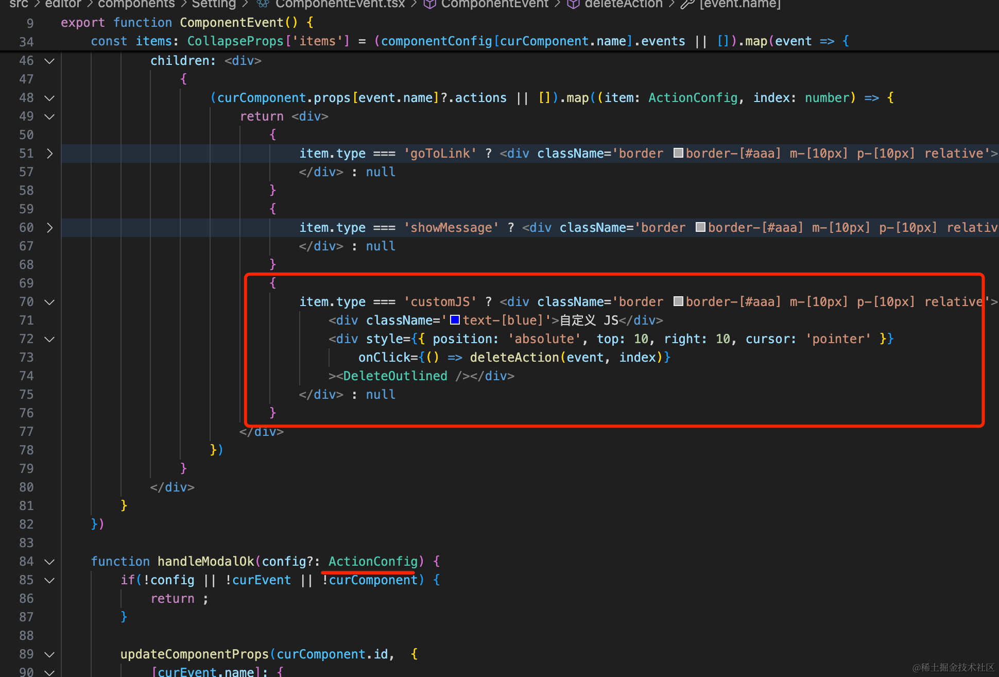

```javascript
import { Collapse, Input, Select, CollapseProps, Button} from 'antd';
import { useComponetsStore } from '../../stores/components';
import { useComponentConfigStore } from '../../stores/component-config';
import type { ComponentEvent } from '../../stores/component-config';
import { ActionConfig, ActionModal } from './ActionModal';
import { useState } from 'react';
import { DeleteOutlined } from '@ant-design/icons';

export function ComponentEvent() {

    const { curComponentId, curComponent, updateComponentProps } = useComponetsStore();
    const { componentConfig } = useComponentConfigStore();
    const [actionModalOpen, setActionModalOpen] = useState(false);
    const [curEvent, setCurEvent] = useState<ComponentEvent>();

    if (!curComponent) return null;

    function deleteAction(event: ComponentEvent, index: number) {
        if(!curComponent) {
            return;
        }

        const actions = curComponent.props[event.name]?.actions;

        actions.splice(index, 1)

        updateComponentProps(curComponent.id,  { 
            [event.name]: { 
                actions: actions
            }
        })
    }

    const items: CollapseProps['items'] = (componentConfig[curComponent.name].events || []).map(event => {
        return {
            key: event.name,
            label: <div className='flex justify-between leading-[30px]'>
                {event.label}
                <Button type="primary" onClick={(e) => {
                    e.stopPropagation();

                    setCurEvent(event);
                    setActionModalOpen(true);
                }}>添加动作</Button>
            </div>,
            children: <div>
                {
                    (curComponent.props[event.name]?.actions || []).map((item: ActionConfig, index: number) => {
                        return <div>
                            {
                                item.type === 'goToLink' ? <div key="goToLink" className='border border-[#aaa] m-[10px] p-[10px] relative'>
                                    <div className='text-[blue]'>跳转链接</div>
                                    <div>{item.url}</div>
                                    <div style={{ position: 'absolute', top: 10, right: 10, cursor: 'pointer' }}
                                        onClick={() => deleteAction(event, index)}
                                    ><DeleteOutlined /></div>
                                </div> : null
                            }
                            {
                                item.type === 'showMessage' ? <div key="showMessage" className='border border-[#aaa] m-[10px] p-[10px] relative'>
                                    <div className='text-[blue]'>消息弹窗</div>
                                    <div>{item.config.type}</div>
                                    <div>{item.config.text}</div>
                                    <div style={{ position: 'absolute', top: 10, right: 10, cursor: 'pointer' }}
                                        onClick={() => deleteAction(event, index)}
                                    ><DeleteOutlined /></div>
                                </div> : null
                            }
                            {
                                item.type === 'customJS' ? <div key="customJS" className='border border-[#aaa] m-[10px] p-[10px] relative'>
                                    <div className='text-[blue]'>自定义 JS</div>
                                    <div style={{ position: 'absolute', top: 10, right: 10, cursor: 'pointer' }}
                                        onClick={() => deleteAction(event, index)}
                                    ><DeleteOutlined /></div>
                                </div> : null
                            }
                        </div>
                    })
                }
            </div>
        }
    })

    function handleModalOk(config?: ActionConfig) {
        if(!config || !curEvent || !curComponent) {
            return ;
        }

        updateComponentProps(curComponent.id,  { 
            [curEvent.name]: { 
                actions: [
                    ...(curComponent.props[curEvent.name]?.actions || []),
                    config
                ]
            }
        })

        setActionModalOpen(false)
    }

    return <div className='px-[10px]'>
        <Collapse className='mb-[10px]' items={items} defaultActiveKey={componentConfig[curComponent.name].events?.map(item =>item.name)}/>
        <ActionModal visible={actionModalOpen} handleOk={handleModalOk} handleCancel={() => {
            setActionModalOpen(false)
        }}/>
    </div>
}
```
测试下：


动作添加成功。

在 json 里可以看到这个配置：

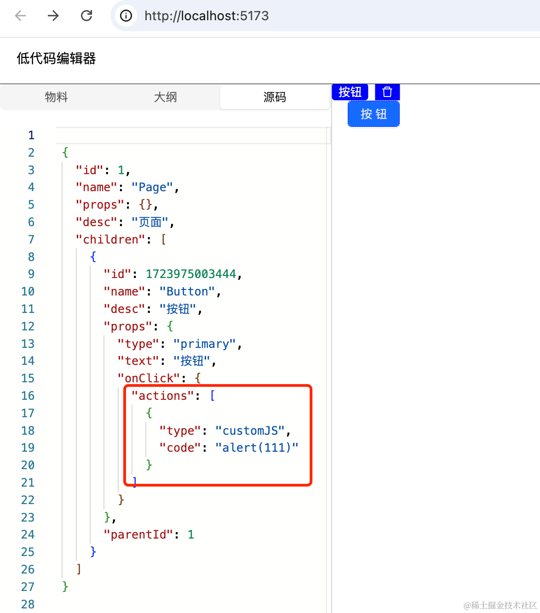

接下来只要 Preview 的时候实现这种 action 的执行就好了。

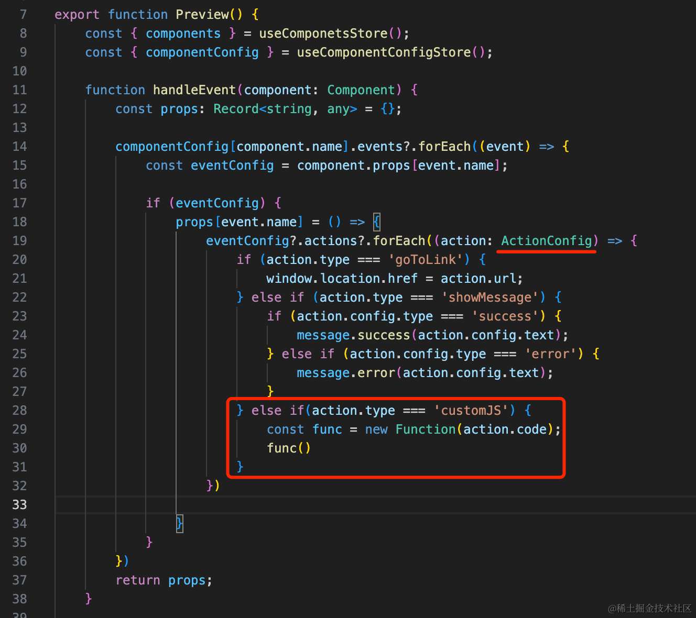

支持 customJS 的 action 执行，顺便改下类型。

```javascript
props[event.name] = () => {
    eventConfig?.actions?.forEach((action: ActionConfig) => {
        if (action.type === 'goToLink') {
            window.location.href = action.url;
        } else if (action.type === 'showMessage') {
            if (action.config.type === 'success') {
                message.success(action.config.text);
            } else if (action.config.type === 'error') {
                message.error(action.config.text);
            }
        } else if(action.type === 'customJS') {
            const func = new Function(action.code);
            func()
        }
    })

}
```
测试下：


这样就实现了自定义 JS 的执行。

然后给执行的函数加上一些参数：

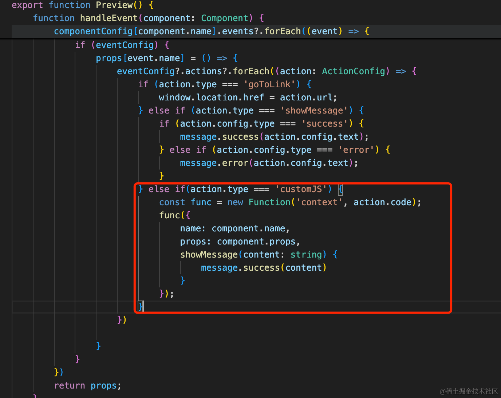

new Function 可以传入任意个参数，最后一个是函数体，前面都会作为函数参数的名字。

然后调用的时候传入参数。

我们这里只传入了当前组件的 name、props 还有一个方法。

```javascript
const func = new Function('context', action.code);
func({
    name: component.name,
    props: component.props,
    showMessage(content: string) {
        message.success(content)
    }
});
```

测试下：


这样，自定义 JS 的功能就完成了。

但现在有个问题：

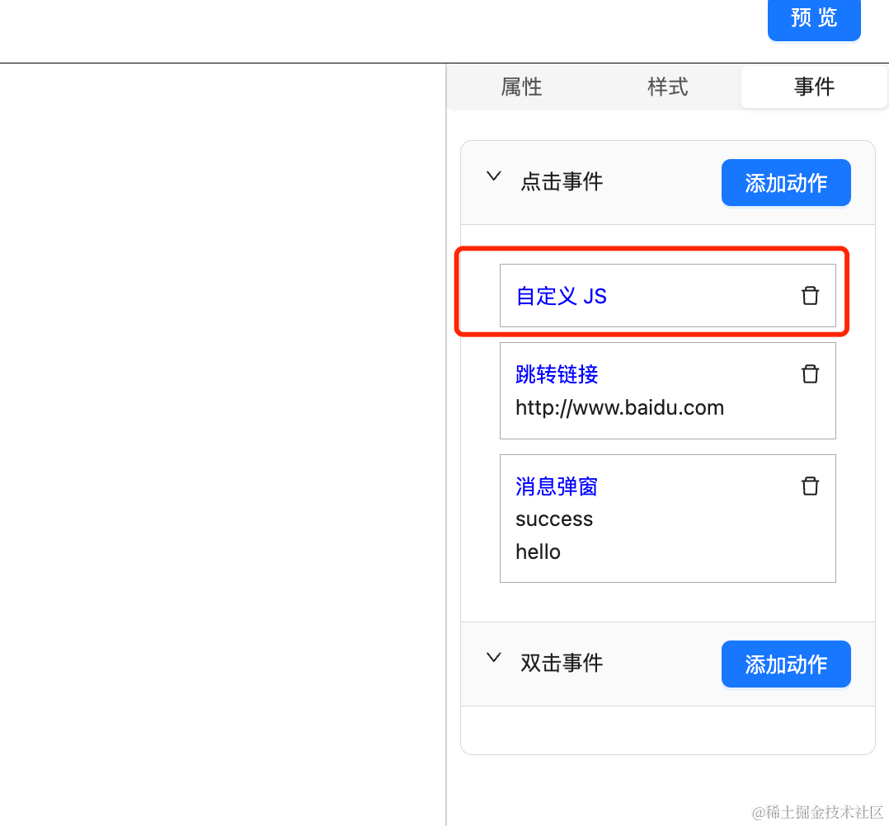

我们上节做了动作的新增、删除，并没有做编辑。

这对于跳转链接、消息弹窗这种动作还好，参数比较简单。

但是对于自定义 JS，写一段 JS 成本还是挺高的，删了再重写体验不好，所以我们得支持下编辑。


改下 ComponentEvent 组件：

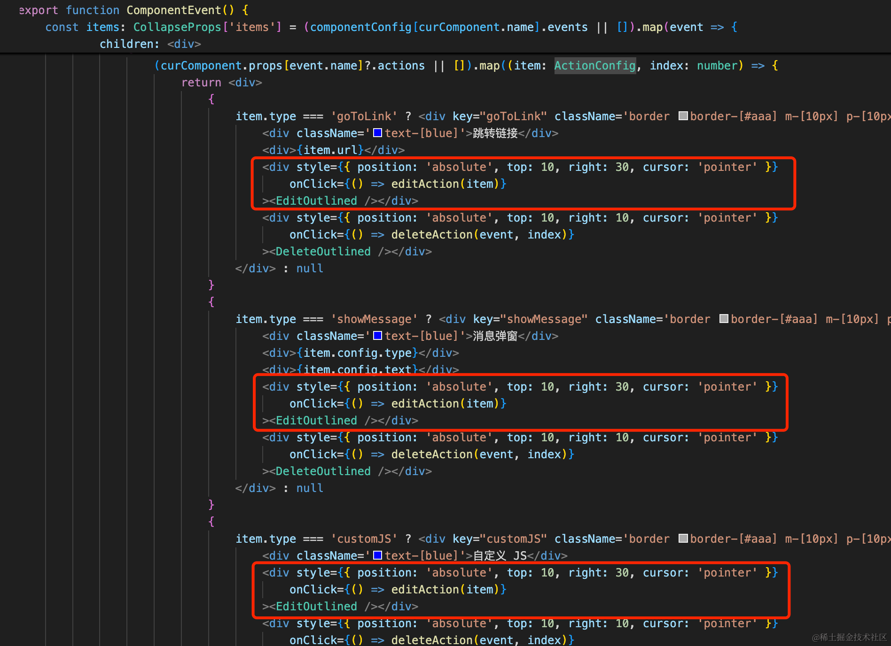

```javascript
<div style={{ position: 'absolute', top: 10, right: 30, cursor: 'pointer' }}
    onClick={() => editAction(item)}
><EditOutlined /></div>
```
加一个绝对定位的 icon。

点击的时候打开弹窗：

```javascript
function editAction(config: ActionConfig) {
    if(!curComponent) {
        return;
    }

    setActionModalOpen(true);
}
```
测试下：


能打开弹窗，但是还没回显内容。

在 ActionModal 传入 action 来回显：

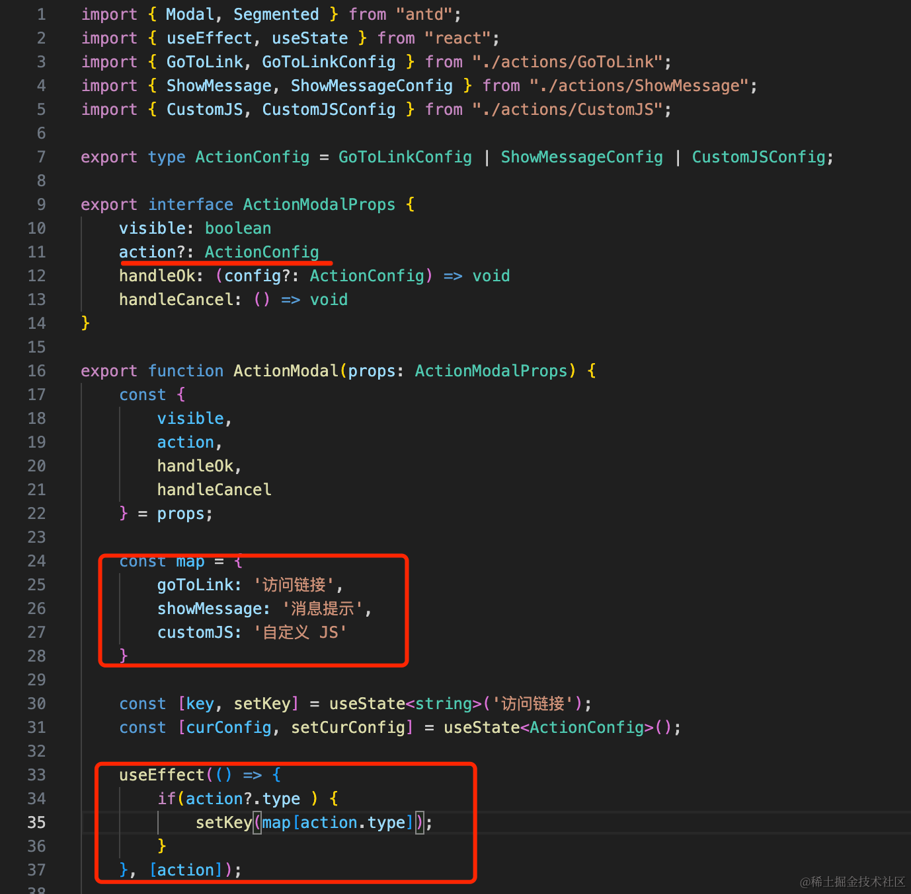

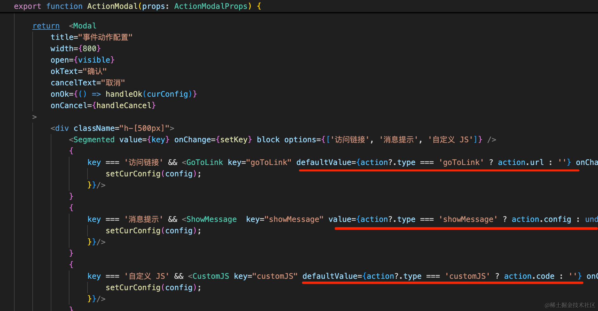

```javascript
import { Modal, Segmented } from "antd";
import { useEffect, useState } from "react";
import { GoToLink, GoToLinkConfig } from "./actions/GoToLink";
import { ShowMessage, ShowMessageConfig } from "./actions/ShowMessage";
import { CustomJS, CustomJSConfig } from "./actions/CustomJS";

export type ActionConfig = GoToLinkConfig | ShowMessageConfig | CustomJSConfig;

export interface ActionModalProps {
    visible: boolean
    action?: ActionConfig
    handleOk: (config?: ActionConfig) => void
    handleCancel: () => void
}

export function ActionModal(props: ActionModalProps) {
    const {
        visible,
        action,
        handleOk,
        handleCancel
    } = props;

    const map = {
        goToLink: '访问链接',
        showMessage: '消息提示',
        customJS: '自定义 JS'
    }

    const [key, setKey] = useState<string>('访问链接');
    const [curConfig, setCurConfig] = useState<ActionConfig>();

    useEffect(() => {
        if(action?.type ) {
            setKey(map[action.type]);
        }
    }, [action]);

    return  <Modal 
        title="事件动作配置" 
        width={800}
        open={visible}
        okText="确认"
        cancelText="取消"
        onOk={() => handleOk(curConfig)}
        onCancel={handleCancel}
    >
        <div className="h-[500px]">
            <Segmented value={key} onChange={setKey} block options={['访问链接', '消息提示', '自定义 JS']} />
            {
                key === '访问链接' && <GoToLink key="goToLink" defaultValue={action?.type === 'goToLink' ? action.url : ''} onChange={(config) => {
                    setCurConfig(config);
                }}/>
            }
            {
                key === '消息提示' && <ShowMessage  key="showMessage" value={action?.type === 'showMessage' ? action.config : undefined} onChange={(config) => {
                    setCurConfig(config);
                }}/>
            }
            {
                key === '自定义 JS' && <CustomJS key="customJS" defaultValue={action?.type === 'customJS' ? action.code : ''} onChange={(config) => {
                    setCurConfig(config);
                }}/>
            }
        </div>
    </Modal>
}
```
然后在 ComponentEvent 里传入这个参数：

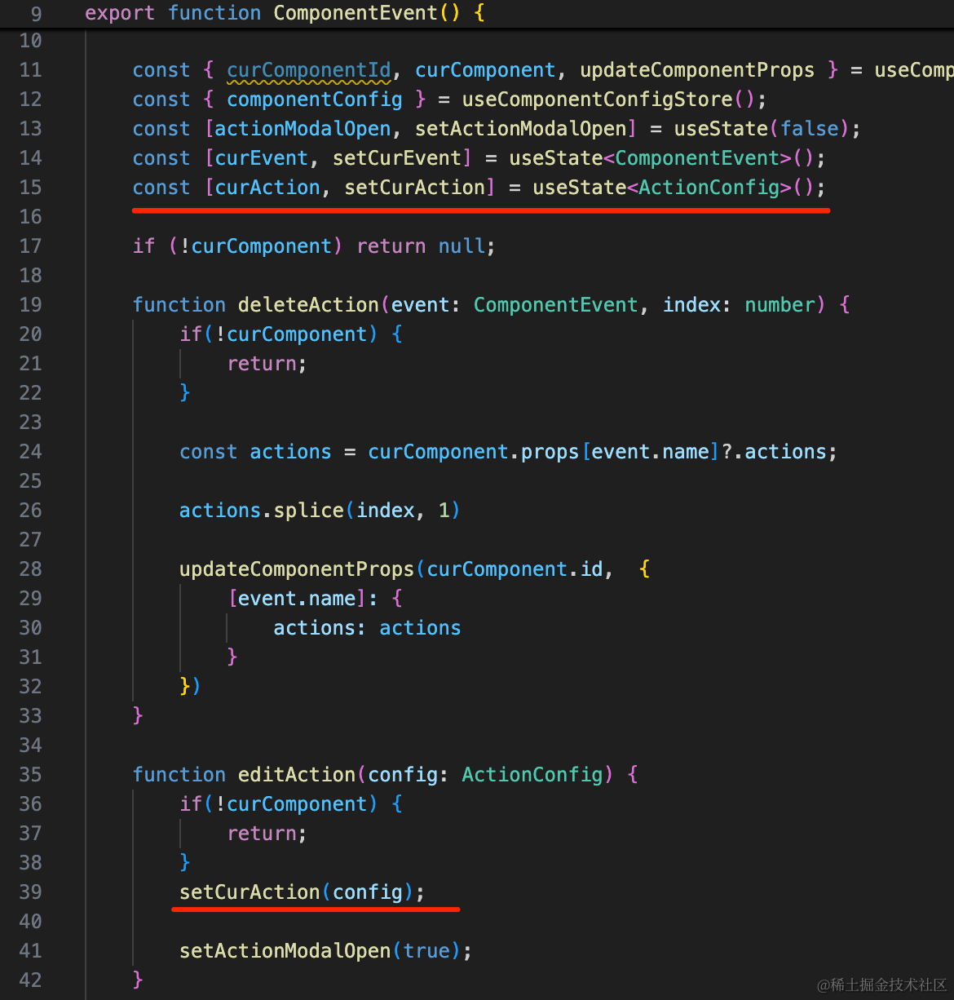

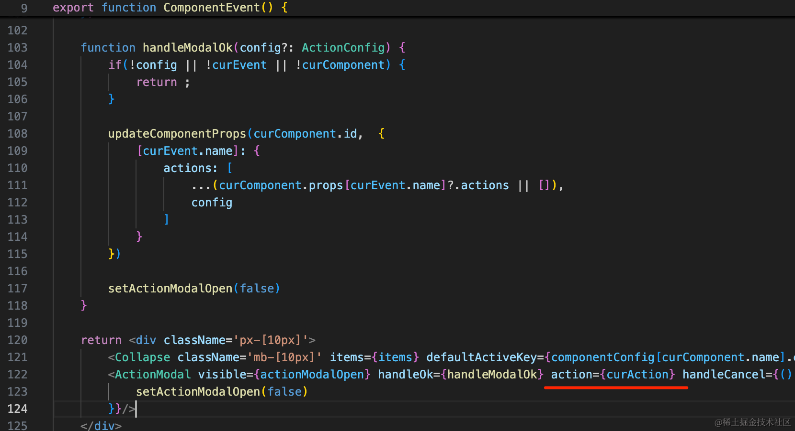

```javascript
const [curAction, setCurAction] = useState<ActionConfig>();
```
测试下：


这样，回显就完成了。

然后保存的时候也要处理下：

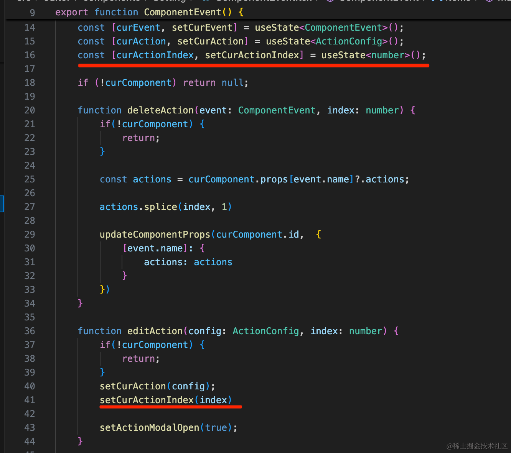

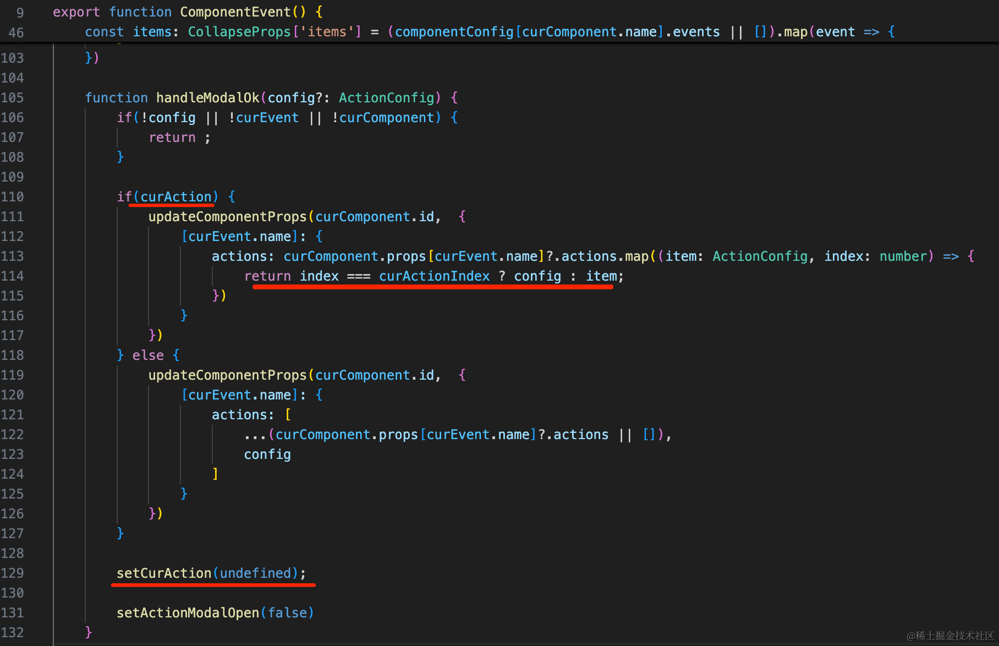

记录下当前编辑的 action 的 index。

保存的时候如果有 curAction，就是修改，没有的话才是新增。

```javascript
import { Collapse, Input, Select, CollapseProps, Button} from 'antd';
import { useComponetsStore } from '../../stores/components';
import { useComponentConfigStore } from '../../stores/component-config';
import type { ComponentEvent } from '../../stores/component-config';
import { ActionConfig, ActionModal } from './ActionModal';
import { useState } from 'react';
import { DeleteOutlined, EditOutlined } from '@ant-design/icons';

export function ComponentEvent() {

    const { curComponentId, curComponent, updateComponentProps } = useComponetsStore();
    const { componentConfig } = useComponentConfigStore();
    const [actionModalOpen, setActionModalOpen] = useState(false);
    const [curEvent, setCurEvent] = useState<ComponentEvent>();
    const [curAction, setCurAction] = useState<ActionConfig>();
    const [curActionIndex, setCurActionIndex] = useState<number>();

    if (!curComponent) return null;

    function deleteAction(event: ComponentEvent, index: number) {
        if(!curComponent) {
            return;
        }

        const actions = curComponent.props[event.name]?.actions;

        actions.splice(index, 1)

        updateComponentProps(curComponent.id,  { 
            [event.name]: { 
                actions: actions
            }
        })
    }

    function editAction(config: ActionConfig, index: number) {
        if(!curComponent) {
            return;
        }
        setCurAction(config);
        setCurActionIndex(index)

        setActionModalOpen(true);
    }

    const items: CollapseProps['items'] = (componentConfig[curComponent.name].events || []).map(event => {
        return {
            key: event.name,
            label: <div className='flex justify-between leading-[30px]'>
                {event.label}
                <Button type="primary" onClick={(e) => {
                    e.stopPropagation();

                    setCurEvent(event);
                    setActionModalOpen(true);
                }}>添加动作</Button>
            </div>,
            children: <div>
                {
                    (curComponent.props[event.name]?.actions || []).map((item: ActionConfig, index: number) => {
                        return <div>
                            {
                                item.type === 'goToLink' ? <div key="goToLink" className='border border-[#aaa] m-[10px] p-[10px] relative'>
                                    <div className='text-[blue]'>跳转链接</div>
                                    <div>{item.url}</div>
                                    <div style={{ position: 'absolute', top: 10, right: 30, cursor: 'pointer' }}
                                        onClick={() => editAction(item, index)}
                                    ><EditOutlined /></div>
                                    <div style={{ position: 'absolute', top: 10, right: 10, cursor: 'pointer' }}
                                        onClick={() => deleteAction(event, index)}
                                    ><DeleteOutlined /></div>
                                </div> : null
                            }
                            {
                                item.type === 'showMessage' ? <div key="showMessage" className='border border-[#aaa] m-[10px] p-[10px] relative'>
                                    <div className='text-[blue]'>消息弹窗</div>
                                    <div>{item.config.type}</div>
                                    <div>{item.config.text}</div>
                                    <div style={{ position: 'absolute', top: 10, right: 30, cursor: 'pointer' }}
                                        onClick={() => editAction(item, index)}
                                        ><EditOutlined /></div>
                                    <div style={{ position: 'absolute', top: 10, right: 10, cursor: 'pointer' }}
                                        onClick={() => deleteAction(event, index)}
                                    ><DeleteOutlined /></div>
                                </div> : null
                            }
                            {
                                item.type === 'customJS' ? <div key="customJS" className='border border-[#aaa] m-[10px] p-[10px] relative'>
                                    <div className='text-[blue]'>自定义 JS</div>
                                    <div style={{ position: 'absolute', top: 10, right: 30, cursor: 'pointer' }}
                                        onClick={() => editAction(item, index)}
                                    ><EditOutlined /></div>
                                    <div style={{ position: 'absolute', top: 10, right: 10, cursor: 'pointer' }}
                                        onClick={() => deleteAction(event, index)}
                                    ><DeleteOutlined /></div>
                                </div> : null
                            }
                        </div>
                    })
                }
            </div>
        }
    })

    function handleModalOk(config?: ActionConfig) {
        if(!config || !curEvent || !curComponent) {
            return ;
        }

        if(curAction) {
            updateComponentProps(curComponent.id,  { 
                [curEvent.name]: { 
                    actions: curComponent.props[curEvent.name]?.actions.map((item: ActionConfig, index: number) => {
                        return index === curActionIndex ? config : item;
                    })
                }
            })
        } else {
            updateComponentProps(curComponent.id,  { 
                [curEvent.name]: { 
                    actions: [
                        ...(curComponent.props[curEvent.name]?.actions || []),
                        config
                    ]
                }
            })
        }

        setCurAction(undefined);

        setActionModalOpen(false)
    }

    return <div className='px-[10px]'>
        <Collapse className='mb-[10px]' items={items} defaultActiveKey={componentConfig[curComponent.name].events?.map(item =>item.name)}/>
        <ActionModal visible={actionModalOpen} handleOk={handleModalOk} action={curAction} handleCancel={() => {
            setCurAction(undefined);
            setActionModalOpen(false)
        }}/>
    </div>
}
```
测试下：


action 的新增和修改正常。

这时候我发现虽然最终保存的是对的，回显的不对：


如上图，我修改下面的 action 的时候，回显的依然是之前的值，但保存是对的。

这是为什么呢？我们不是传了参数了么：

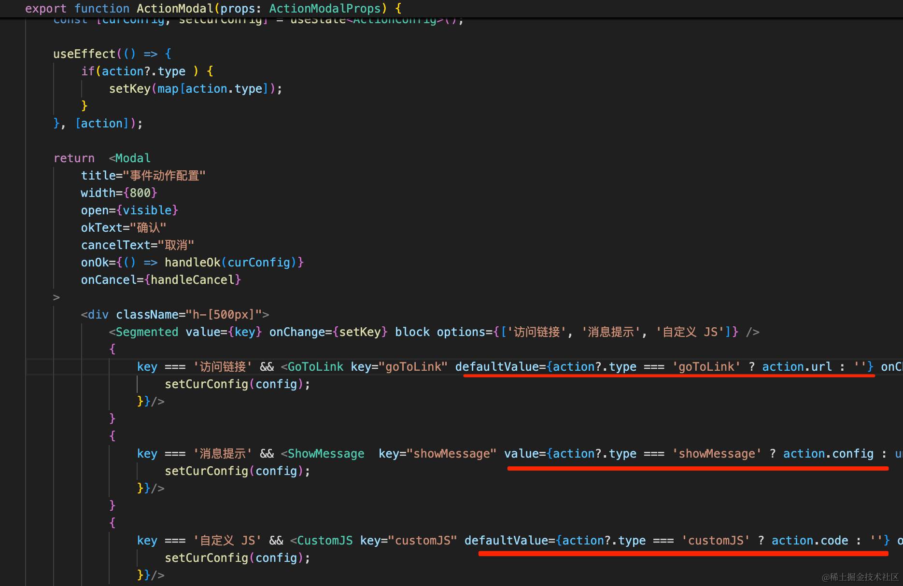

因为我们是用非受控模式写的，传的参数作为表单的默认值：

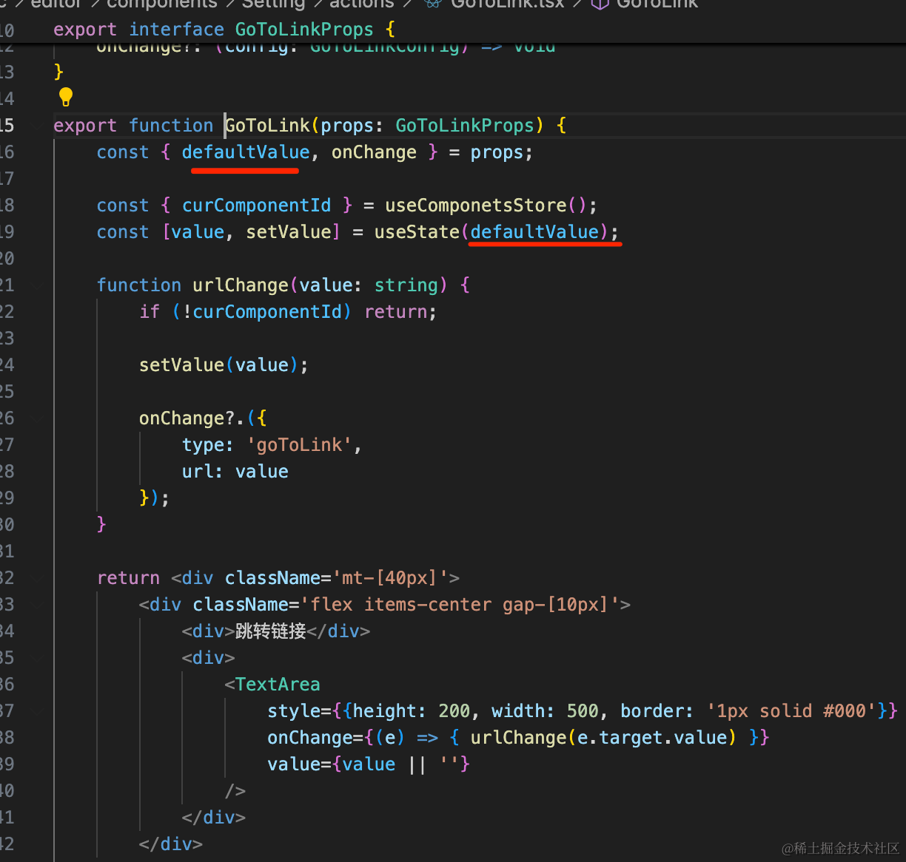

所以修改 defaultValue 并不会修改表单值。

**有回显需求的表单，必须用受控模式来写。**

我们改一下：

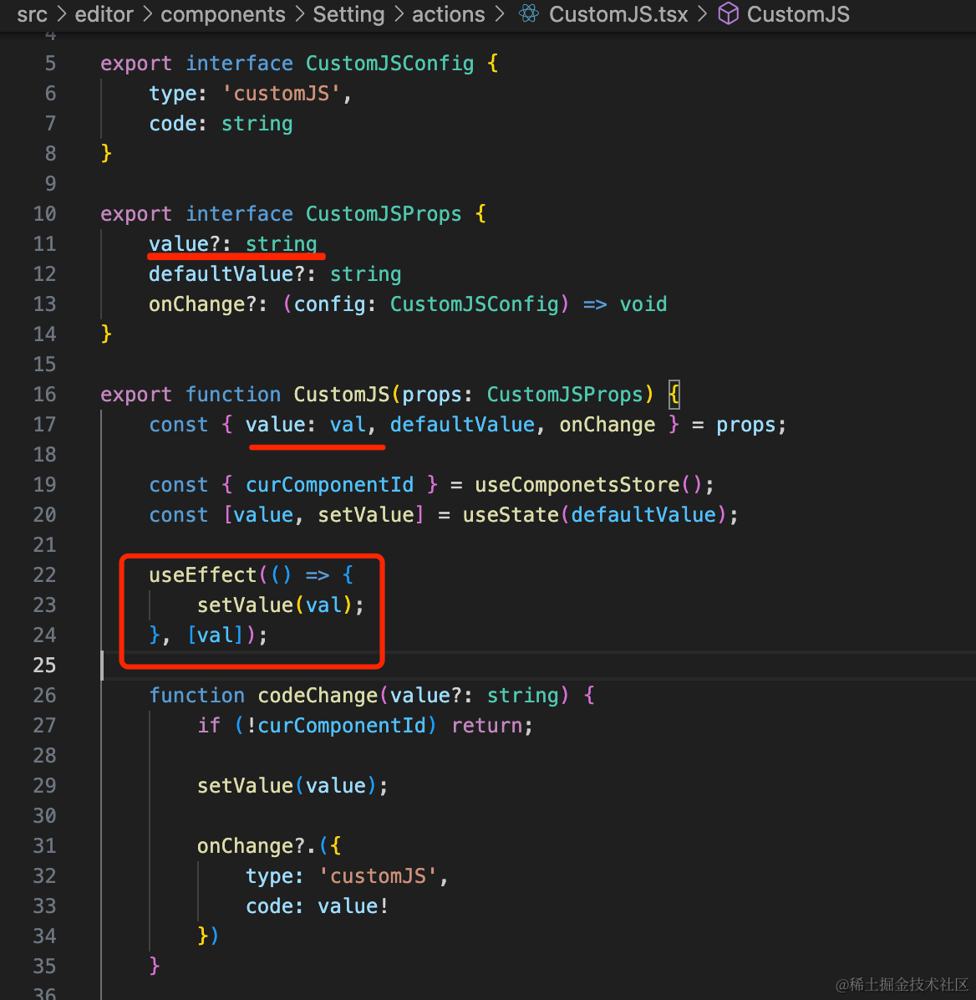


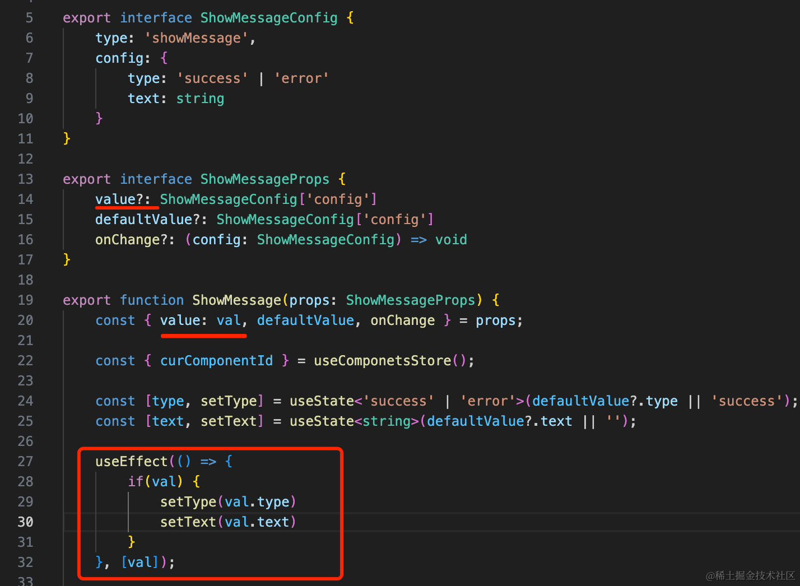

当传入 value 参数的时候，同步设置内部的 value

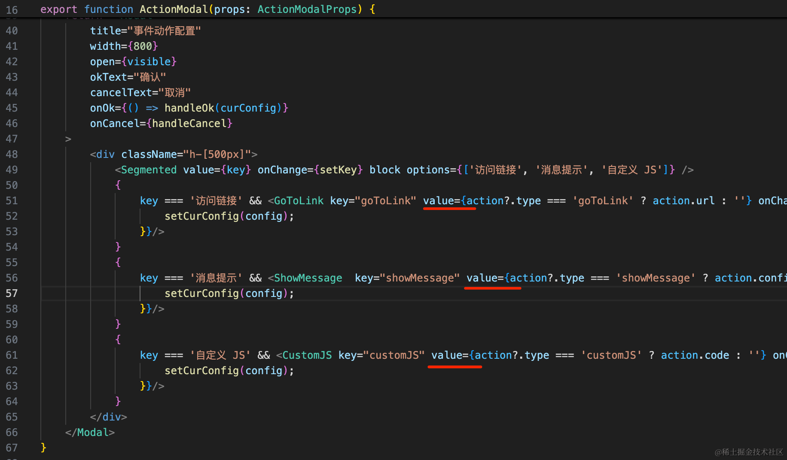

测试下：


这样就好了。

案例代码上传了[小册仓库](https://github.com/QuarkGluonPlasma/react-course-code/tree/main/lowcode-editor)，可以切换到这个 commit 查看：

```
git reset --hard 29562eb568bdc05e4efbdd02ba4f817f47201279
```
## 总结

这节我们实现了自定义 JS。

通过 monaco editor 来输入代码，然后通过 new Function 来动态执行代码，执行的代码可以访问 context，传入一些属性方法。

然后我们实现了动作的编辑，点击编辑按钮会在弹窗回显 action，保存之后会修改 json。

**主要回显的表单一定是受控模式，这样才可以随时 value，不然只能设置初始值 defaultValue**

这样，内置动作、自定义 JS 的动作就都完成了。
