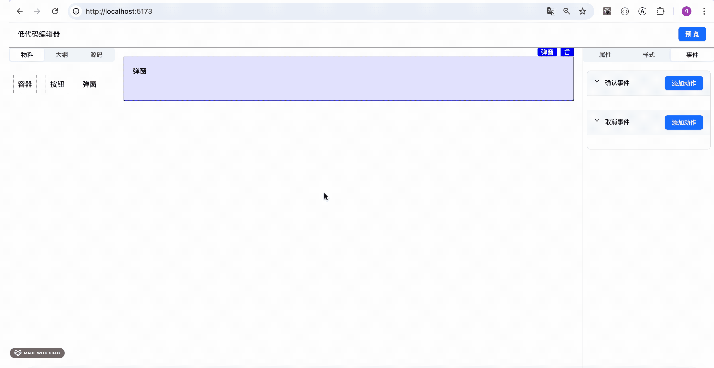

# 第76章—低代码编辑器：组件联动

这节我们来实现组件联动。

它是动作的一种类型：


比如 [amis](https://aisuda.github.io/amis-editor-demo/#/edit/0) 里，点击按钮的时候修改视频组件为隐藏。

这种组件和组件之间的关联就叫组件联动：


那它是怎么实现的呢？

其实也很简单：

我们知道，forwardRef + useImperativeHandle 可以让组件暴露一些方法出来：


我们在递归渲染组件 renderComponents 的时候，把组件 ref 收集起来，放到一个 map 里。

key 为组件 id

```javascript
{
    1111: {
        aaa() {
        }
        bbb() {
        }
    },
    222: {
        ccc() {
        }
        ddd() {
        }
    }
}
```

这样 id 为 111 的组件想调用 id 为 222 的组件的 ccc 方法，就只需要在动作里加一个配置：

```javascript
actions: [
    {
        type: 'componentMethod',
        config: {
            componentId: 222,
            method: 'ccc'
        }
    }
]
```
然后处理事件的时候，根据这个 componentId 和 method 从 refs 里拿到对应的方法执行就好了。

这样就实现了组件联动。

这个 actions 是配置在 components 的 store 里。

而组件有什么 method 是配置在 componentConfig 的 store 里。

思路理清了，我们来写下代码：

当然，现在的组件没啥好暴露的方法，我们加一个 Modal 组件：

materials/Modal/prod.tsx

```javascript
import { Modal as AntdModal } from 'antd';
import { forwardRef, useImperativeHandle, useState } from 'react';
import { CommonComponentProps } from '../../interface';

export interface ModalRef {
    open: () => void
    close: () => void
}

const Modal: React.ForwardRefRenderFunction<ModalRef, CommonComponentProps> = ({ children, title, onOk, onCancel, styles }, ref) => {

  const [open, setOpen] = useState(false);

  useImperativeHandle(ref, () => {
    return {
      open: () => {
        setOpen(true);
      },
      close: () => {
        setOpen(false);
      }
    }
  }, []);

  return (
    <AntdModal
      title={title}
      style={styles}
      open={open}
      onCancel={() => {
        onCancel && onCancel();
        setOpen(false);
      }}
      onOk={() => {
        onOk && onOk();
      }}
      destroyOnClose
    >
      {children}
    </AntdModal>
  );
}

export default forwardRef(Modal);
```
可以传入 title、onOk、onCancel、styles 的参数，并且暴露了 open、close 方法用于控制弹窗显示隐藏。

然后写下 dev 时的组件：

materials/Modal/dev.tsx
```javascript
import { useMaterailDrop } from '../../hooks/useMaterailDrop';
import { CommonComponentProps } from '../../interface';

function Modal({ id, children, title, styles }: CommonComponentProps) {

    const {canDrop, drop } = useMaterailDrop(['Button', 'Container'], id);

    return (
        <div 
            ref={drop}
            style={styles}
            data-component-id={id}  
            className={`min-h-[100px] p-[20px] ${ canDrop ? 'border-[2px] border-[blue]' : 'border-[1px] border-[#000]'}`}
        >
            <h4>{title}</h4>
            <div>
                {children}
            </div>
        </div>
    );
}

export default Modal;
```
dev 时的组件和 prod 时的组件不一样，我们要加上 drop 的处理，，设置 drop 时的高亮，添加 data-compnent-id，并且指定最小高度

在 componentConfig 里配一下：


```javascript
Modal: {
    name: 'Modal',
    defaultProps: {
        title: '弹窗'
    },
    setter: [
        {
          name: 'title',
          label: '标题',
          type: 'input'
        }
    ],
    stylesSetter: [],
    events: [
        {
            name: 'onOk',
            label: '确认事件',
        },
        {
            name: 'onCancel',
            label: '取消事件'
        },
    ],
    desc: '弹窗',
    dev: ModalDev,
    prod: ModalProd
},
```
试下效果：


编辑时可以拖拽组件进去，预览时为空，因为默认是隐藏的。

我们先改为默认显示试试：


然后我们设置下属性和样式：


绑定下事件：


和之前的功能能无缝结合。

**低代码编辑器的核心完成后，支持不同场景只要增加不同组件就可以了。**

然后我们回过头来继续做组件联动：


默认弹窗是隐藏的，我们要通过组件联动的方式，调用它的 open、close 方法来控制。

在 componentConfig 里配置下这两个 methods：


```javascript
export interface ComponentMethod {
    name: string
    label: string
}

export interface ComponentConfig {
    name: string;
    defaultProps: Record<string, any>,
    desc: string;
    setter?: ComponentSetter[];
    stylesSetter?: ComponentSetter[];
    events?: ComponentEvent[];
    methods?: ComponentMethod[]
    dev: any;
    prod: any;
}

```
```javascript
methods: [
    {
        name: 'open',
        label: '打开弹窗',
    },
    {
        name: 'close',
        label: '关闭弹窗'
    }
],
```
然后在 ActionModal 里支持选择组件联动的方式：


```javascript
import { Modal, Segmented } from "antd";
import { useEffect, useState } from "react";
import { GoToLink, GoToLinkConfig } from "./actions/GoToLink";
import { ShowMessage, ShowMessageConfig } from "./actions/ShowMessage";
import { CustomJS, CustomJSConfig } from "./actions/CustomJS";
import { ComponentMethod, ComponentMethodConfig } from "./actions/ComponentMethod";

export type ActionConfig = GoToLinkConfig | ShowMessageConfig | CustomJSConfig | ComponentMethodConfig;

export interface ActionModalProps {
    visible: boolean
    action?: ActionConfig
    handleOk: (config?: ActionConfig) => void
    handleCancel: () => void
}

export function ActionModal(props: ActionModalProps) {
    const {
        visible,
        action,
        handleOk,
        handleCancel
    } = props;

    const map = {
        goToLink: '访问链接',
        showMessage: '消息提示',
        customJS: '自定义 JS',
        componentMethod: '组件方法'
    }

    const [key, setKey] = useState<string>('访问链接');
    const [curConfig, setCurConfig] = useState<ActionConfig>();

    useEffect(() => {
        if(action?.type ) {
            setKey(map[action.type]);
        }
    }, [action]);

    return  <Modal 
        title="事件动作配置"
        width={800}
        open={visible}
        okText="确认"
        cancelText="取消"
        onOk={() => handleOk(curConfig)}
        onCancel={handleCancel}
    >
        <div className="h-[500px]">
            <Segmented value={key} onChange={setKey} block options={['访问链接', '消息提示', '组件方法', '自定义 JS']} />
            {
                key === '访问链接' && <GoToLink key="goToLink" value={action?.type === 'goToLink' ? action.url : ''} onChange={(config) => {
                    setCurConfig(config);
                }}/>
            }
            {
                key === '消息提示' && <ShowMessage  key="showMessage" value={action?.type === 'showMessage' ? action.config : undefined} onChange={(config) => {
                setCurConfig(config);
                }}/>
            }
            {
                key === '组件方法' && <ComponentMethod  key="showMessage" value={action?.type === 'componentMethod' ? action.config : undefined} onChange={(config) => {
                    setCurConfig(config);
                }}/>
            }
            {
                key === '自定义 JS' && <CustomJS key="customJS" value={action?.type === 'customJS' ? action.code : ''} onChange={(config) => {
                    setCurConfig(config);
                }}/>
            }
        </div>
    </Modal>
}
```
实现下这个 ComponentMethod 组件：

Setting/actions/ComponentMethod.tsx

```javascript
import { useEffect, useState } from "react";
import { Component, getComponentById, useComponetsStore } from "../../../stores/components";
import { Select, TreeSelect } from "antd";
import { useComponentConfigStore } from "../../../stores/component-config";

export interface ComponentMethodConfig {
    type: 'componentMethod',
    config: {
        componentId: number,
        method: string
    }
}

export interface ComponentMethodProps {
    value?: string
    onChange?: (config: ComponentMethodConfig) => void
}

export function ComponentMethod(props: ComponentMethodProps) {

    const { components, curComponentId } = useComponetsStore();
    const { componentConfig } = useComponentConfigStore();
    const [selectedComponent, setSelectedComponent] = useState<Component | null>();

    function componentChange(value: number) {
        if (!curComponentId) return;
    
        setSelectedComponent(getComponentById(value, components))
    }

    return <div className='mt-[40px]'>
        <div  className='flex items-center gap-[10px]'>
            <div>组件：</div>
            <div>
                <TreeSelect
                    style={{ width: 500, height: 50 }}
                    treeData={components}
                    fieldNames={{
                        label: 'name',
                        value: 'id',
                    }}
                    onChange={(value) => { componentChange(value) }}
                />
            </div>
        </div>
        {componentConfig[selectedComponent?.name || ''] && (
            <div  className='flex items-center gap-[10px] mt-[20px]'>
                <div>方法：</div>
                <div>
                    <Select
                        style={{ width: 500, height: 50 }}
                        options={componentConfig[selectedComponent?.name || ''].methods?.map(
                            method => ({ label: method.label, value: method.name })
                        )}
                        onChange={(value) => { }}
                    />
                </div>
            </div>
        )}
    </div>
}
```
就是两个 Select，一个选择组件、一个选择组件的方法。

需要加一个 selectedComponent 的 state 来记录选中的组件。

测试下：



这样，组件方法的选择就完成了。

我们再处理下 value 和 onChange，做下数据的保存和回显：


```javascript
import { useEffect, useState } from "react";
import { Component, getComponentById, useComponetsStore } from "../../../stores/components";
import { Select, TreeSelect } from "antd";
import { useComponentConfigStore } from "../../../stores/component-config";

export interface ComponentMethodConfig {
    type: 'componentMethod',
    config: {
        componentId: number,
        method: string
    }
}

export interface ComponentMethodProps {
    value?: ComponentMethodConfig['config']
    onChange?: (config: ComponentMethodConfig) => void
}

export function ComponentMethod(props: ComponentMethodProps) {

    const { value, onChange} = props;
    const { components, curComponentId } = useComponetsStore();
    const { componentConfig } = useComponentConfigStore();
    const [selectedComponent, setSelectedComponent] = useState<Component | null>();

    const [curId, setCurId] = useState<number>();
    const [curMethod, setCurMethod] = useState<string>();

    useEffect(() => {
        if(value) {
            setCurId(value.componentId)
            setCurMethod(value.method)

            setSelectedComponent(getComponentById(value.componentId, components))
        }
    }, [value]);

    function componentChange(value: number) {
        if (!curComponentId) return;
    
        setCurId(value);
        setSelectedComponent(getComponentById(value, components))
    }

    function componentMethodChange(value: string) {
        if (!curComponentId || !selectedComponent) return;

        setCurMethod(value);

        onChange?.({
            type: 'componentMethod',
            config: {
                componentId: selectedComponent?.id,
                method: value
            }
        })
    }

    return <div className='mt-[40px]'>
        <div  className='flex items-center gap-[10px]'>
            <div>组件：</div>
            <div>
                <TreeSelect
                    style={{ width: 500, height: 50 }}
                    treeData={components}
                    fieldNames={{
                        label: 'name',
                        value: 'id',
                    }}
                    value={curId}
                    onChange={(value) => { componentChange(value) }}
                />
            </div>
        </div>
        {componentConfig[selectedComponent?.name || ''] && (
            <div  className='flex items-center gap-[10px] mt-[20px]'>
                <div>方法：</div>
                <div>
                    <Select
                        style={{ width: 500, height: 50 }}
                        options={componentConfig[selectedComponent?.name || ''].methods?.map(
                            method => ({ label: method.label, value: method.name })
                        )}
                        value={curMethod}
                        onChange={(value) => { componentMethodChange(value) }}
                    />
                </div>
            </div>
        )}
    </div>
}
```
然后还要在动作列表回显下：


```javascript
{
    item.type === 'componentMethod' ? <div key="componentMethod" className='border border-[#aaa] m-[10px] p-[10px] relative'>
        <div className='text-[blue]'>组件方法</div>
        <div>{getComponentById(item.config.componentId, components)?.desc}</div>
        <div>{item.config.componentId}</div>
        <div>{item.config.method}</div>
        <div style={{ position: 'absolute', top: 10, right: 30, cursor: 'pointer' }}
            onClick={() => editAction(item, index)}
        ><EditOutlined /></div>
        <div style={{ position: 'absolute', top: 10, right: 10, cursor: 'pointer' }}
            onClick={() => deleteAction(event, index)}
        ><DeleteOutlined /></div>
    </div> : null
}
```
测试下：


添加、编辑都没问题。

然后我们在 Preview 里做下事件处理：


收集所有的 refs，按照 id 来索引，调用方法的时候根据 componentId 和 method 来调用。

```javascript
const componentRefs = useRef<Record<string, any>>({});
```
```javascript
ref: (ref: Record<string, any>) => { componentRefs.current[component.id] = ref; },
```

```javascript
else if(action.type === 'componentMethod') {
    const component = componentRefs.current[action.config.componentId];

    if (component) {
      component[action.config.method]?.();
    }
}
```

测试下：


这样，组件联动就完成了。

案例代码上传了[小册仓库](https://github.com/QuarkGluonPlasma/react-course-code/tree/main/lowcode-editor)，可以切换到这个 commit 查看：

```
git reset --hard 909a148d0145db4b7ce93ce2f16f676f87c37013
```

## 总结

这节我们实现了组件联动，也就是一个组件可以调用另一个组件的方法。

原理就是组件通过 forwardRef + useImperativeHandle 暴露一些方法，然后在 action 里配置 componentId、method。

这样预览的时候收集所有组件的 ref，事件触发的时候根据配置调用对应 componentId 的对应 method。

这样，我们支持了内置动作、自定义 JS、组件联动，事件绑定的功能就比较完整了。
