# 第77章—低代码编辑器：拖拽优化、Table组件

在 [amis](https://aisuda.github.io/amis-editor-demo/#/edit/0) 编辑器里，物料拖动到画布区后，还可以拖动改变位置：


现在我们的编辑器没有支持拖动改变位置：

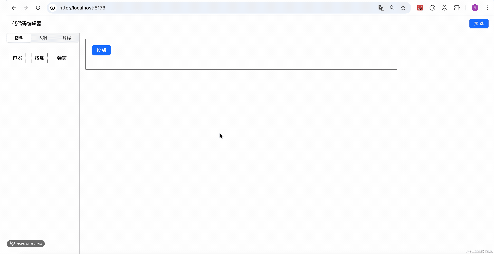

我们来实现下：

其实这个也很简单，就是给物料也加上 useDrag 就可以了。

比如给 Button 加一下：

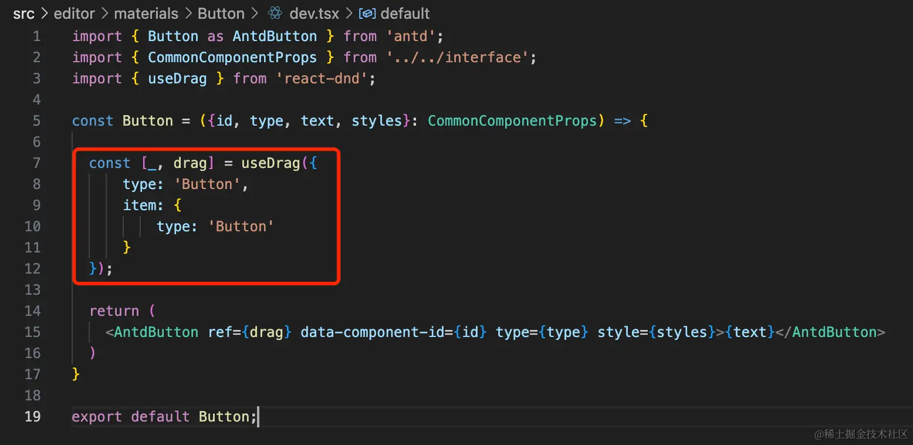

```javascript
const [_, drag] = useDrag({
  type: 'Button',
  item: {
      type: 'Button'
  }
});
```


现在是能拖动了，但是和从物料区拖过来的 drop 逻辑一样，都是新增组件。

我们得区分下两者。

加上 dragType 属性，然后带上当前拖拽的组件 id：

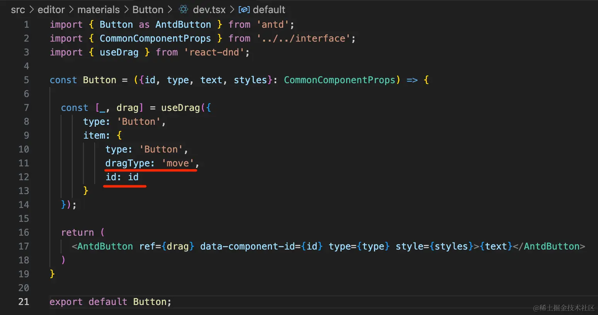

在 useDrop 的时候判断下 dragTag，如果是 move，那就先 delete 再 add

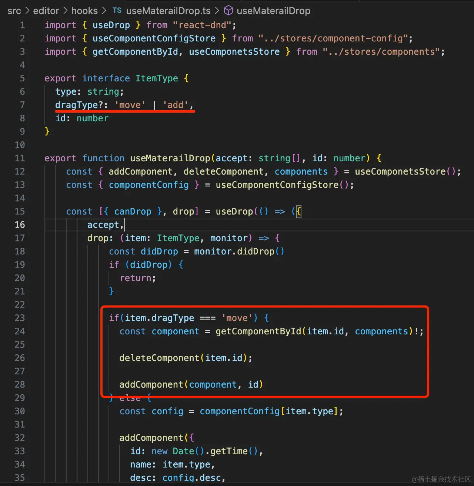

```javascript
import { useDrop } from "react-dnd";
import { useComponentConfigStore } from "../stores/component-config";
import { getComponentById, useComponetsStore } from "../stores/components";

export interface ItemType {
  type: string;
  dragType?: 'move' | 'add',
  id: number
}

export function useMaterailDrop(accept: string[], id: number) {
    const { addComponent, deleteComponent, components } = useComponetsStore();
    const { componentConfig } = useComponentConfigStore();

    const [{ canDrop }, drop] = useDrop(() => ({
        accept,
        drop: (item: ItemType, monitor) => {
            const didDrop = monitor.didDrop()
            if (didDrop) {
              return;
            }

            if(item.dragType === 'move') {
              const component = getComponentById(item.id, components)!;

              deleteComponent(item.id);

              addComponent(component, id)
            } else {
              const config = componentConfig[item.type];

              addComponent({
                id: new Date().getTime(),
                name: item.type,
                desc: config.desc,
                props: config.defaultProps
              }, id)
            }
        },
        collect: (monitor) => ({
          canDrop: monitor.canDrop(),
        }),
    }));

    return { canDrop, drop }
}
```
测试下：

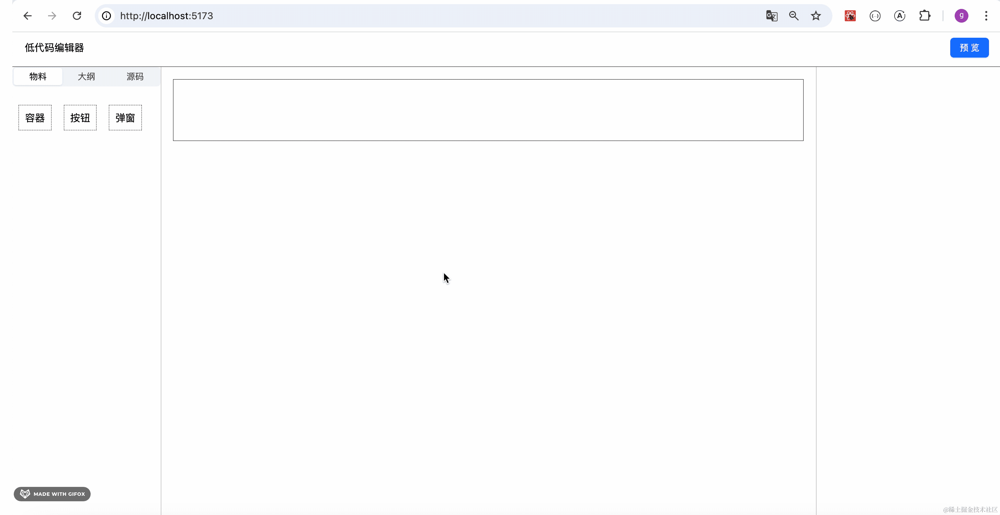

这样就实现了拖拽改变位置。

在 Container 组件也加上 useDrag：


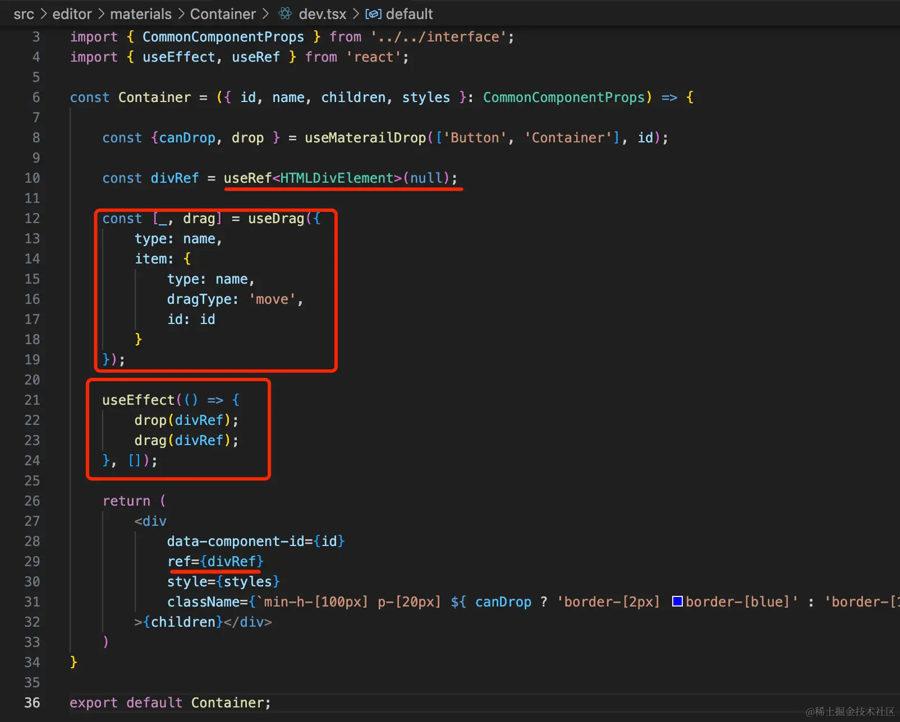

这里因为要同时给 div 绑定 drag、drop 的处理，所以用 useRef 拿到 ref 之后再绑定。

```javascript
import { useDrag } from 'react-dnd';
import { useMaterailDrop } from '../../hooks/useMaterailDrop';
import { CommonComponentProps } from '../../interface';
import { useEffect, useRef } from 'react';

const Container = ({ id, name, children, styles }: CommonComponentProps) => {

    const {canDrop, drop } = useMaterailDrop(['Button', 'Container'], id);

    const divRef = useRef<HTMLDivElement>(null);

    const [_, drag] = useDrag({
        type: name,
        item: {
            type: name,
            dragType: 'move',
            id: id
        }
    });

    useEffect(() => {
        drop(divRef);
        drag(divRef);
    }, []);
    
    return (
        <div 
            data-component-id={id}
            ref={divRef}
            style={styles}
            className={`min-h-[100px] p-[20px] ${ canDrop ? 'border-[2px] border-[blue]' : 'border-[1px] border-[#000]'}`}
        >{children}</div>
    )
}

export default Container;
```


接下来我们加一下 Table 的物料组件：

materials/Table/dev.tsx

```javascript
import { Table as AntdTable } from 'antd';
import React, { useEffect, useMemo, useRef } from 'react';
import { CommonComponentProps } from '../../interface';
import { useMaterailDrop } from '../../hooks/useMaterailDrop';
import { useDrag } from 'react-dnd';

function Table({ id, name, children, styles }: CommonComponentProps) {

    const {canDrop, drop } = useMaterailDrop(['TableColumn'], id);
    
    const divRef = useRef<HTMLDivElement>(null);

    const [_, drag] = useDrag({
        type: name,
        item: {
            type: name,
            dragType: 'move',
            id: id
        }
    });

    useEffect(() => {
        drop(divRef);
        drag(divRef);
    }, []);

    const columns = useMemo(() => {
        return React.Children.map(children, (item: any) => {
            return {
                title: <div className='m-[-16px] p-[16px]' data-component-id={item.props?.id}>{item.props?.title}</div>,
                dataIndex: item.props?.dataIndex,
                key: item
            }
        })
    }, [children]);

    return (
        <div
            className={`w-[100%] ${canDrop ? 'border-[2px] border-[blue]' : 'border-[1px] border-[#000]'}`}
            ref={divRef}
            data-component-id={id}
            style={styles}
        >
            <AntdTable
                columns={columns}
                dataSource={[]}
                pagination={false}
            />
        </div>
    );
}

export default Table;
```
添加 drop、drag 的处理，用 antd 的 table 来渲染。

这里 columns 的处理比较巧妙：

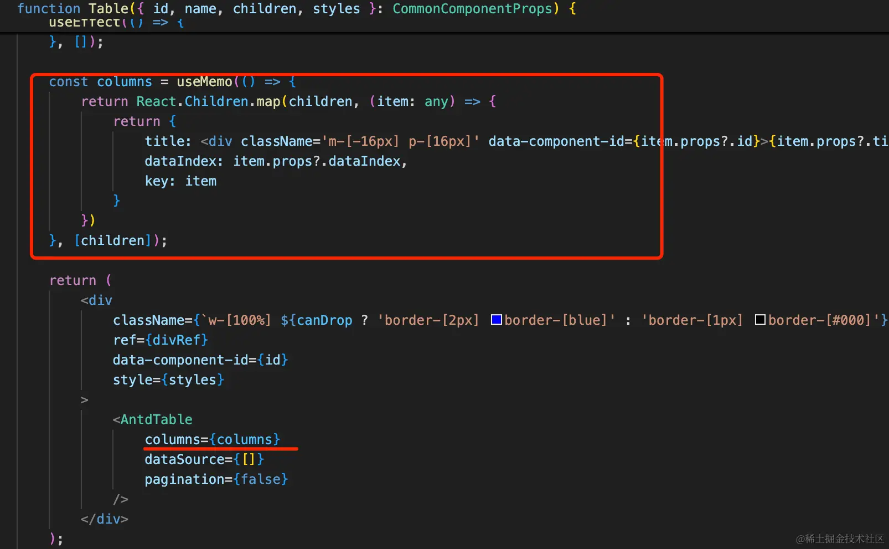

我们拖拽 TableColumn 组件过来的时候，用 React.Children 遍历，把它变为 columns 配置。

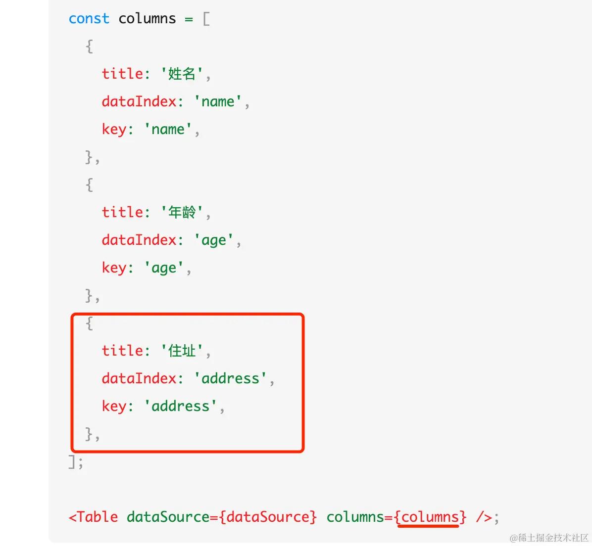

当然，这个 TableColumn 组件还没写。

在 componentConfig 添加 Table 组件的配置：

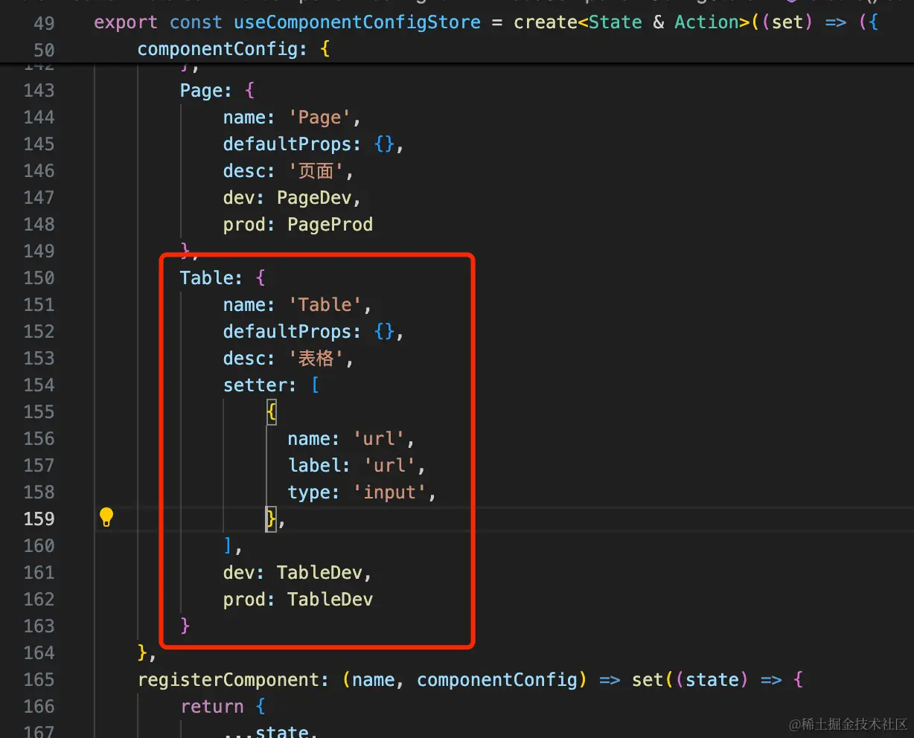

```javascript
Table: {
    name: 'Table',
    defaultProps: {},
    desc: '表格',
    setter: [
        {
          name: 'url',
          label: 'url',
          type: 'input',
        },
    ],
    dev: TableDev,
    prod: TableDev
}
```
然后在 Page、Modal、Container 组件里支持下 Table 的 drop：

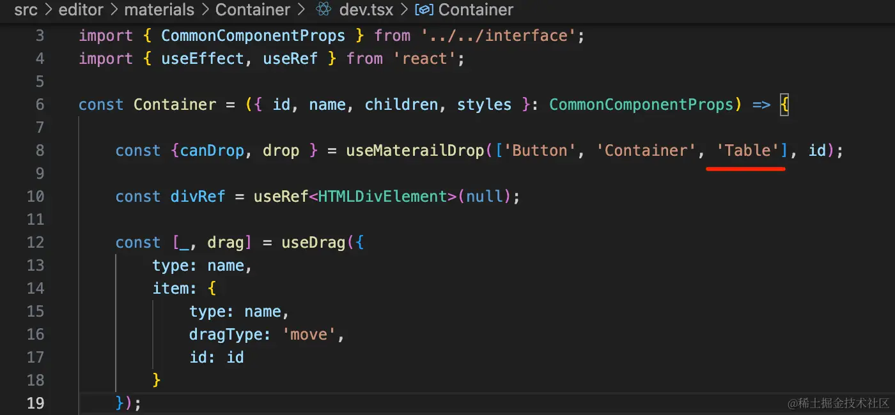

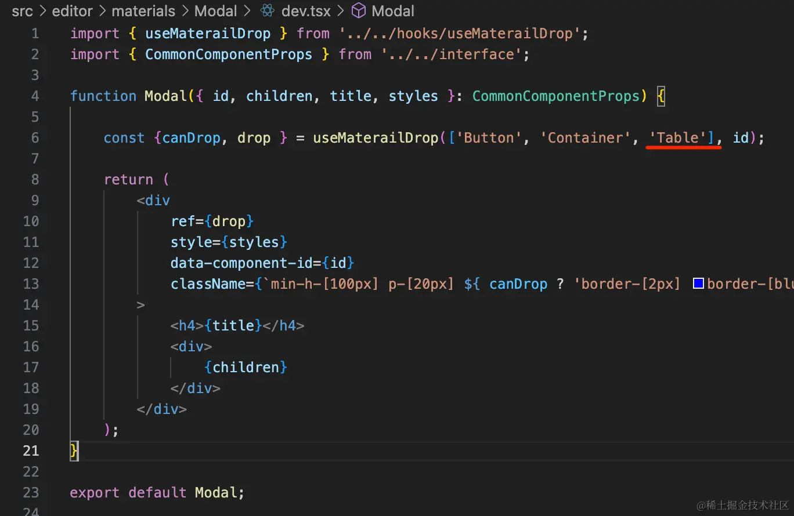

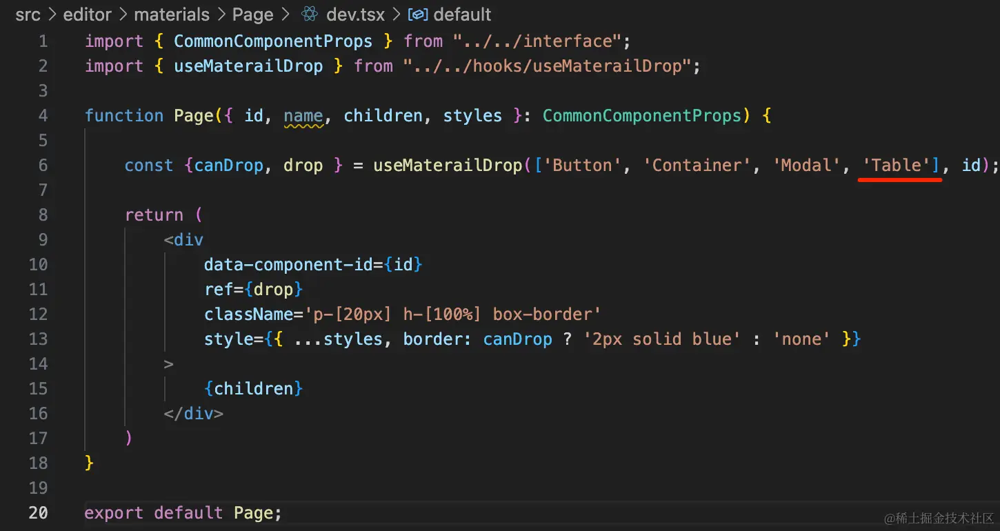

试一下：


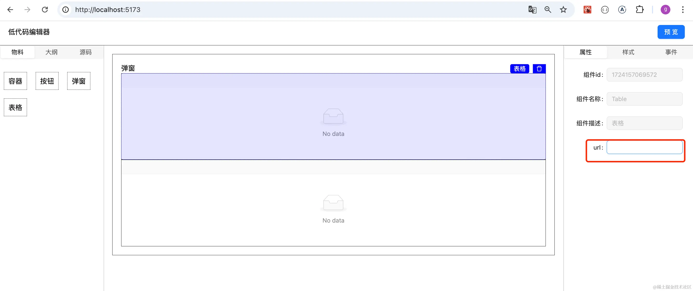

没啥问题。

然后再实现下 TableColumn 组件：

materials/TableColumn/dev.tsx
```javascript
const TableColumn = () => {
  return <></>
}

export default TableColumn;
```
materials/TableColumn/prod.tsx
```javascript
const TableColumn = () => {
    return <></>
}

export default TableColumn;
```
这只是我们做 column 配置用的，不需要渲染内容。

在 ColumnConfig 加一下配置：

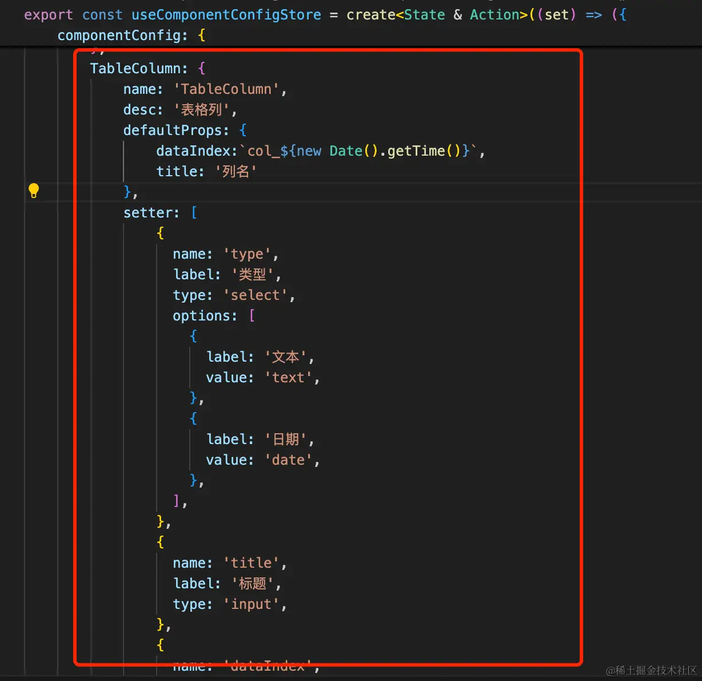

```javascript
TableColumn: {
    name: 'TableColumn',
    desc: '表格列',
    defaultProps: {
        dataIndex:`col_${new Date().getTime()}`,
        title: '列名'
    },
    setter: [
        {
          name: 'type',
          label: '类型',
          type: 'select',
          options: [
            {
              label: '文本',
              value: 'text',
            },
            {
              label: '日期',
              value: 'date',
            },
          ],
        },
        {
          name: 'title',
          label: '标题',
          type: 'input',
        },
        {
          name: 'dataIndex',
          label: '字段',
          type: 'input',
        },
      ],
    dev: TableColumnDev,
    prod: TableColumnProd,
}
```
试下效果：


我们用 TableColumn 组件来配置字段。

然后再来实现 Table 组件的 prod 版本：

materials/Table/prod.tsx

```javascript
import { Table as AntdTable } from 'antd';
import dayjs from 'dayjs';
import React, { useEffect, useMemo, useState } from 'react';
import axios from 'axios';
import { CommonComponentProps } from '../../interface';

const Table = ({ url, children }: CommonComponentProps) => {

  const [data, setData] = useState<Array<Record<string, any>>>([]);
  const [loading, setLoading] = useState(false);

  const getData = async () => {
    if (url) {
      setLoading(true);

      const { data } = await axios.get(url);
      setData(data);

      setLoading(false);
    }
  }

  useEffect(() => {
    getData();
  }, []);

  const columns = useMemo(() => {
    return React.Children.map(children, (item: any) => {
        if (item?.props?.type === 'date') {
            return {
                title: item.props?.title,
                dataIndex: item.props?.dataIndex,
                render: (value: any) => value ? dayjs(value).format('YYYY-MM-DD') : null,
            }
        } else {
            return {
                title: item.props?.title,
                dataIndex: item.props?.dataIndex,
            }
        }
    })
  }, [children]);

  return (
    <AntdTable
      columns={columns}
      dataSource={data}
      pagination={false}
      rowKey="id"
      loading={loading}
    />
  );
}

export default Table;
```

生产环境的 Table 需要请求 url，拿到数据后设置到 table。

并且渲染列的时候，如果是 date，要用 dayjs 做下格式化。

安装下用到的包：

```
npm install --save axios
npm install --save dayjs
```
改下 componentConfig 里的组件：

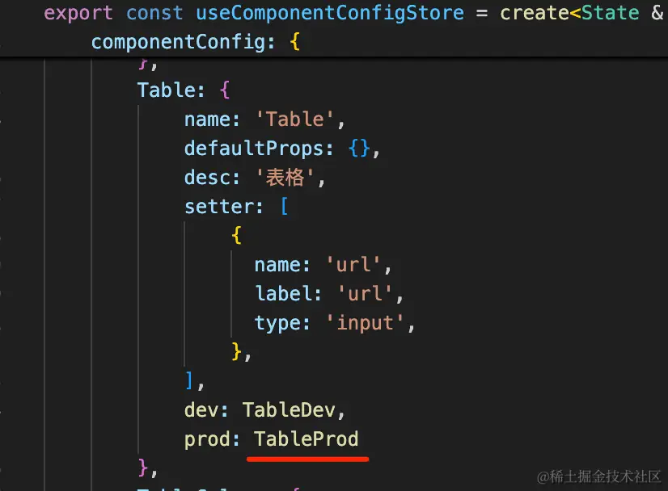

试一下：


可以看到，确实发请求了。

只不过现在没这个接口。

我们用 nest 创建一个后端服务：

```
npx @nestjs/cli new lowcode-demo-backend
```
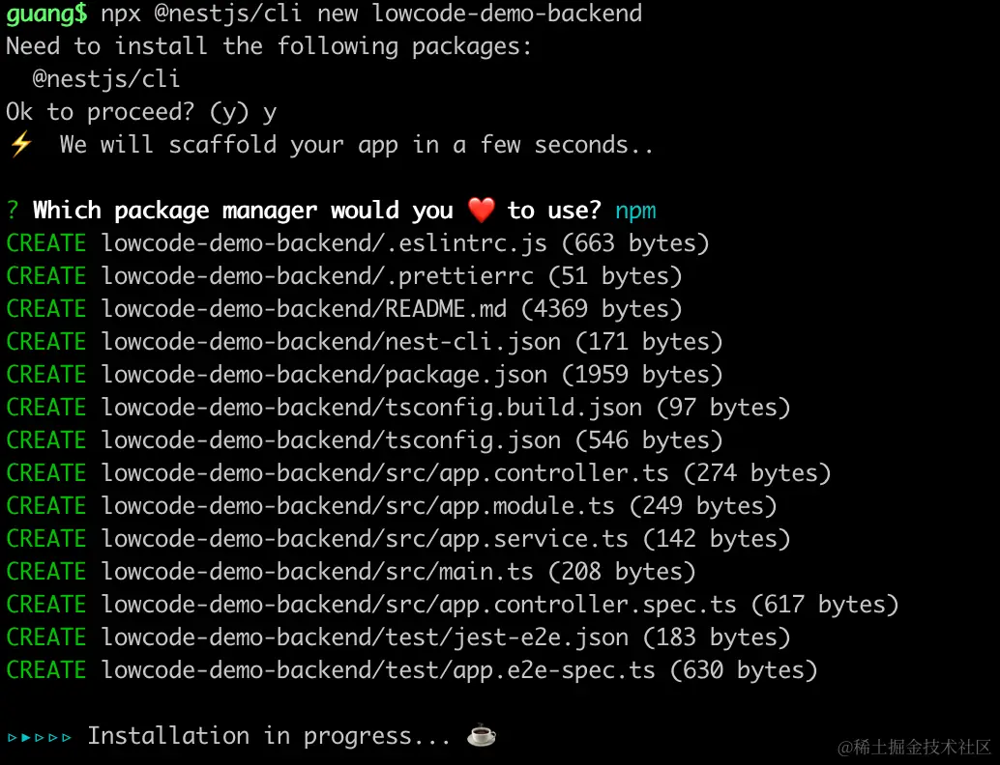

改下 AppController，加一个接口：

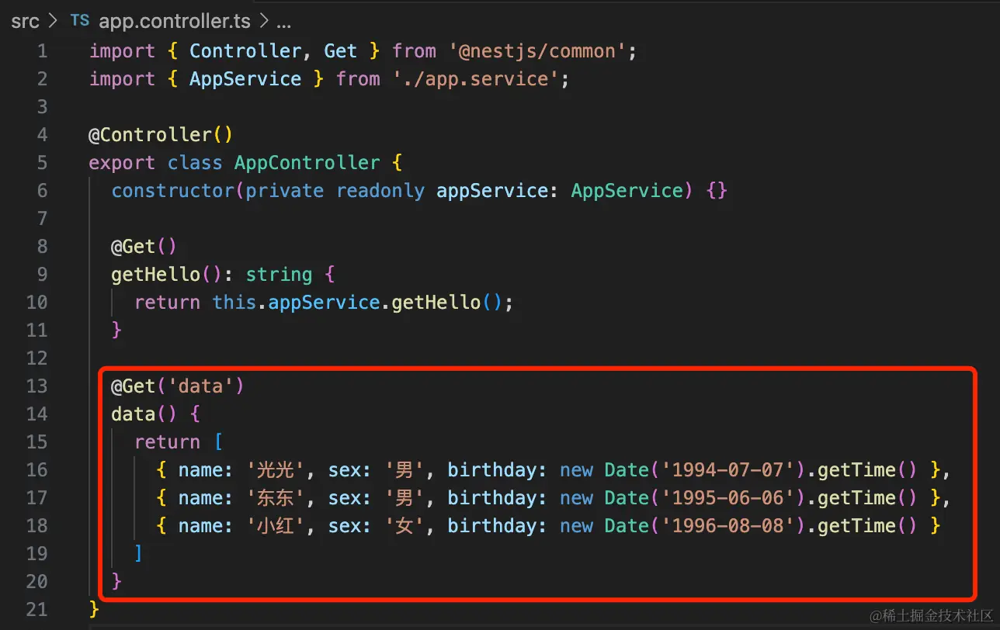

```javascript
@Get('data')
data() {
    return [
      { name: '光光', sex: '男', birthday: new Date('1994-07-07').getTime() },
      { name: '东东', sex: '男', birthday: new Date('1995-06-06').getTime() },
      { name: '小红', sex: '女', birthday: new Date('1996-08-08').getTime() }
    ]
}
```
在 main.ts 开启跨域：

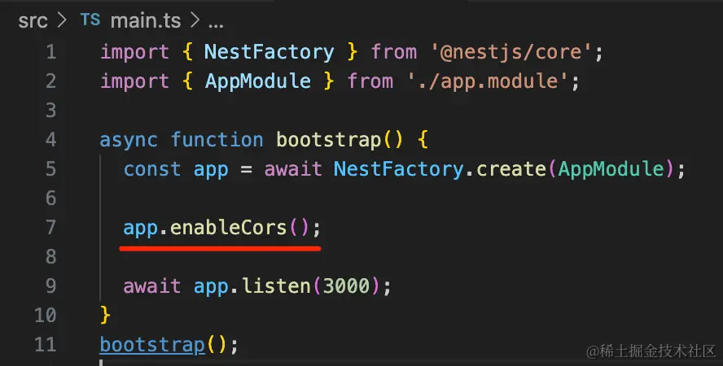

把服务跑起来：
```
npm run start:dev
```


浏览器访问下：


这样接口就有了。

我们再来试下 Table 组件：

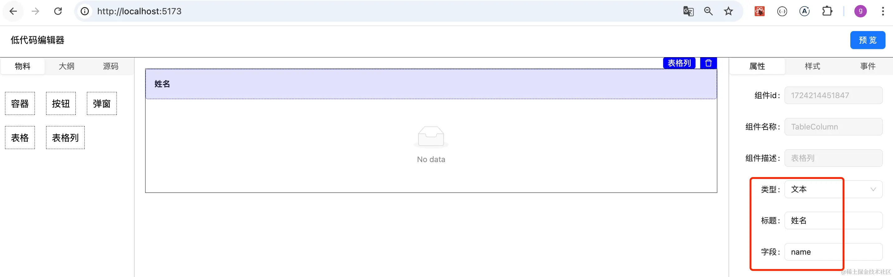

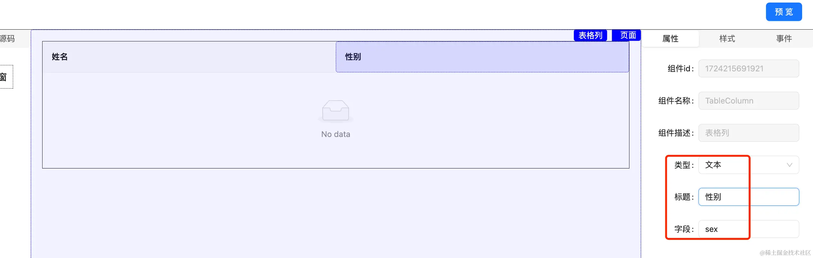

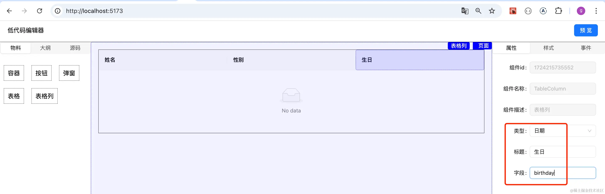

添加三个 TableColumn，配置下字段。

然后在 Table 配置下 url：

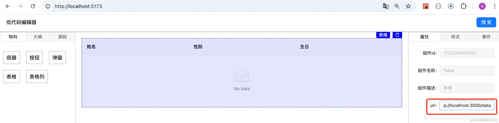

再点击预览：

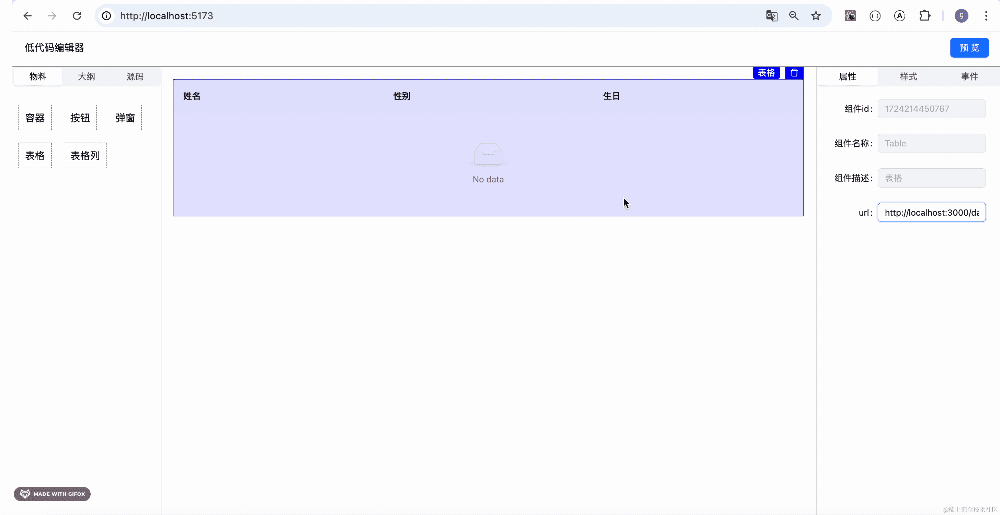

这样，Table 组件就会请求 url，然后根据配置渲染表格

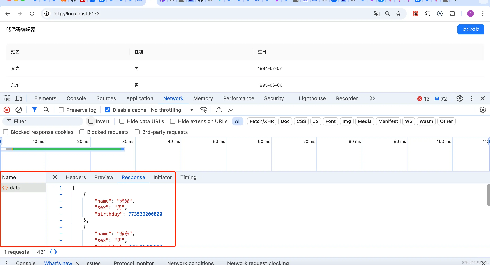

案例代码上传了[小册仓库](https://github.com/QuarkGluonPlasma/react-course-code/tree/main/lowcode-editor)，可以切换到这个 commit 查看：

```
git reset --hard 3df08cf3e09d69817f1bc75bf1b0f9f5e8cb41c4
```

## 总结

这节我们实现了物料组件拖拽改变位置，并实现了 Table 组件。

拖拽改变位置只要在物料组件上加上 useDrag 就可以了，要注意区分 add 和 move 的情况，加上标识，分别做处理。

Table 组件可以配置 url，然后拖拽 TableColumn 进来，TableColumn 可以配置字段信息。

Preview 渲染的时候，根据 url 请求接口，然后根据 columns 的配置来渲染数据。

这样，Table 的物料组件就完成了。
