# 第78章—低代码编辑器：Form组件、store持久化

上节实现了 Table 的物料组件，这节继续来实现 Form 组件。

创建 materails/Form/dev.tsx

```javascript
import { Form as AntdForm, Input } from 'antd';
import React, { useEffect, useMemo, useRef } from 'react';
import { useMaterailDrop } from '../../hooks/useMaterailDrop';
import { CommonComponentProps } from '../../interface';
import { useDrag } from 'react-dnd';

function Form({ id, name, children, onFinish }: CommonComponentProps) {
    const [form] = AntdForm.useForm();

    const {canDrop, drop } = useMaterailDrop(['FormItem'], id);

    const divRef = useRef<HTMLDivElement>(null);

    const [_, drag] = useDrag({
        type: name,
        item: {
            type: name,
            dragType: 'move',
            id: id
        }
    });

    useEffect(() => {
        drop(divRef);
        drag(divRef);
    }, []);

    const formItems = useMemo(() => {
        return React.Children.map(children, (item: any) => {
            return {
                label: item.props?.label,
                name: item.props?.name,
                type: item.props?.type,
                id: item.props?.id,
            }
        });
    }, [children]);

    return <div
        className={`w-[100%] p-[20px] min-h-[100px] ${canDrop ? 'border-[2px] border-[blue]' : 'border-[1px] border-[#000]'}`}
        ref={divRef}
        data-component-id={id}
    >
        <AntdForm labelCol={{ span: 6 }} wrapperCol={{ span: 18 }} form={form} onFinish={(values) =>{
            onFinish && onFinish(values)
        }}>
            {formItems.map((item: any) => {
                return <AntdForm.Item key={item.name} data-component-id={item.id} name={item.name} label={item.label} >
                    <Input style={{pointerEvents: 'none'}}/>
                </AntdForm.Item>
            })}
        </AntdForm>
    </div>
}

export default Form;
```
和 Table 的实现方式差不多，可以拖拽 FormItem 进来，然后通过 React.Children.map 变成表单项配置，之后遍历渲染 Form.Item

注意要加上 pointerEvent:none，因为编辑时 Input 不需要输入内容

在 Page、Container、Modal 组件里支持 Form 组件的 drop：

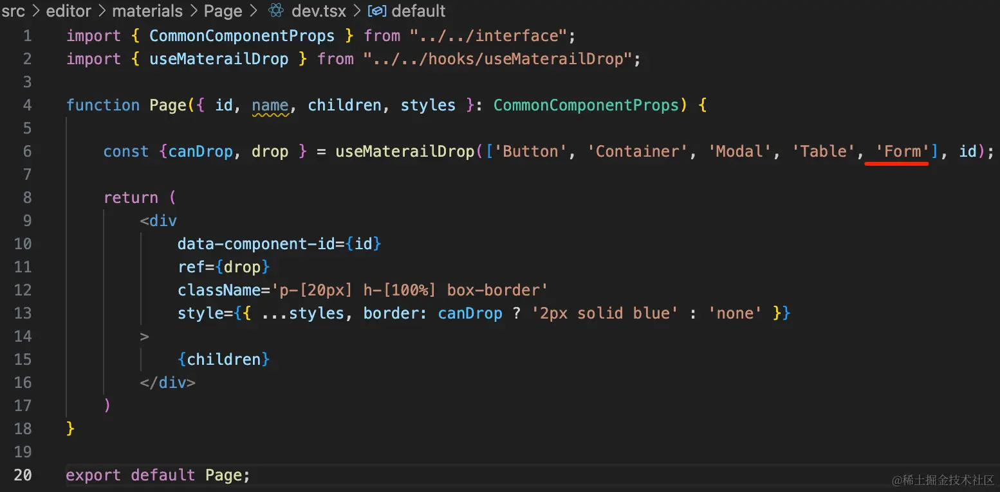

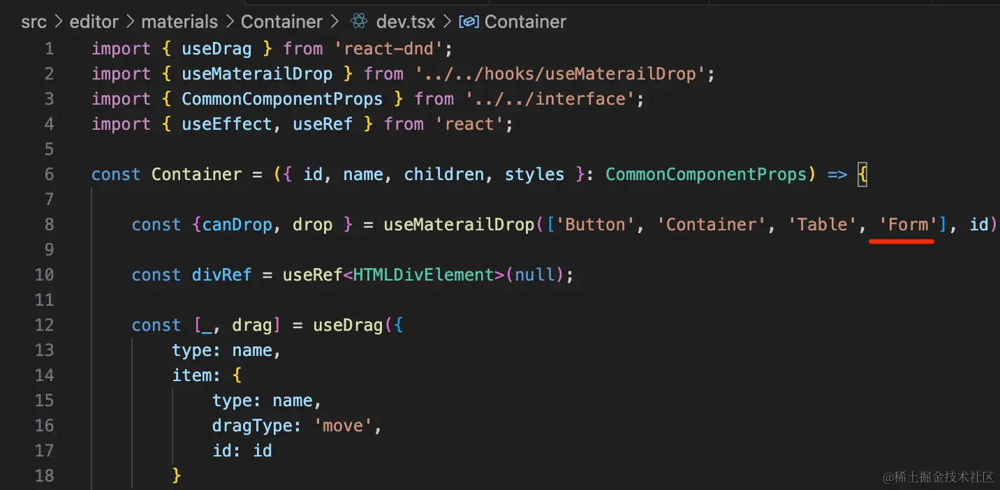

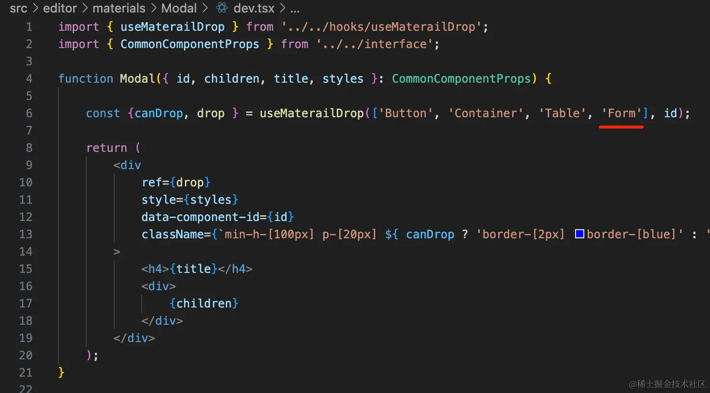

在 componentConfig 里添加 Form 组件的配置：

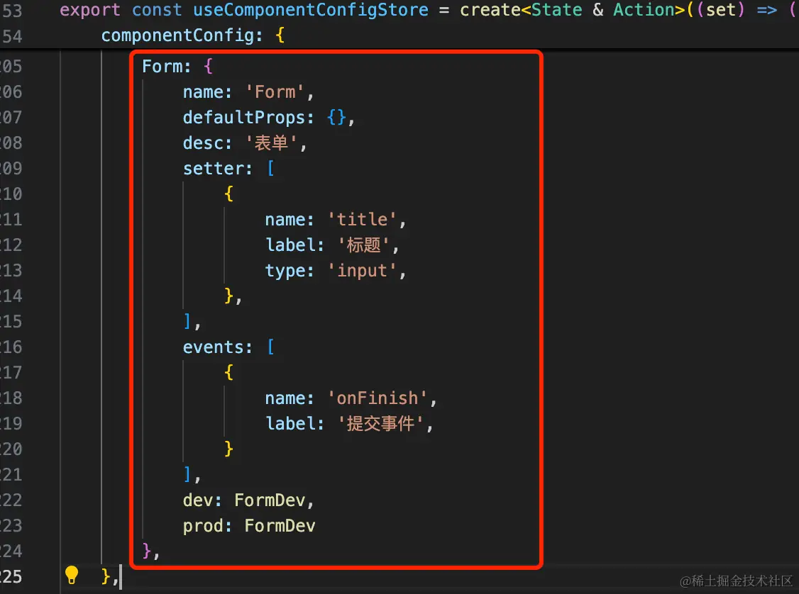

```javascript
Form: {
    name: 'Form',
    defaultProps: {},
    desc: '表单',
    setter: [
        {
            name: 'title',
            label: '标题',
            type: 'input',
        },
    ],
    events: [
        {
            name: 'onFinish',
            label: '提交事件',
        }
    ],
    dev: FormDev,
    prod: FormDev
},
```
测试下：


没啥问题。

然后我们实现 FormItem 组件：

materials/FormItem/dev.tsx

```javascript
const FormItem = () => <></>;

export default FormItem;
```

materials/FormItem/prod.tsx

```javascript
const FormItem = () => <></>;

export default FormItem;
```

和 TableColumn 一样，它只是用于配置的，不需要渲染啥。

在 componentConfig 里配置下：

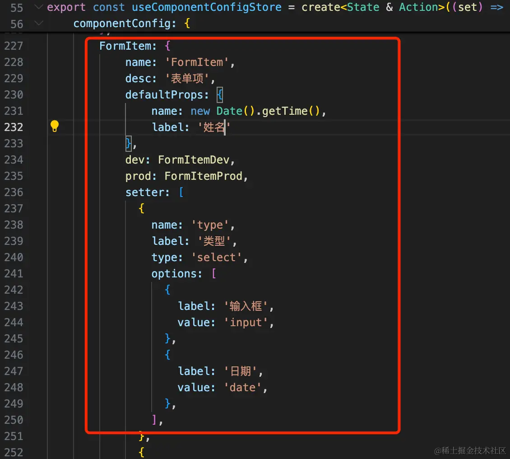

```javascript
FormItem: {
    name: 'FormItem',
    desc: '表单项',
    defaultProps: {
        name: new Date().getTime(),
        label: '姓名'
    },
    dev: FormItemDev,
    prod: FormItemProd,
    setter: [
      {
        name: 'type',
        label: '类型',
        type: 'select',
        options: [
          {
            label: '文本',
            value: 'input',
          },
          {
            label: '日期',
            value: 'date',
          },
        ],
      },
      {
        name: 'label',
        label: '标题',
        type: 'input',
      },
      {
        name: 'name',
        label: '字段',
        type: 'input',
      },
      {
        name: 'rules',
        label: '校验',
        type: 'select',
        options: [
          {
            label: '必填',
            value: 'required',
          },
        ],
      }
    ]
}
```


然后实现下 prod 的 Form 组件：

```javascript
import { Form as AntdForm, DatePicker, Input } from 'antd';
import React, { forwardRef, ForwardRefRenderFunction, useEffect, useImperativeHandle, useMemo } from 'react';
import { CommonComponentProps } from '../../interface';
import dayjs from 'dayjs';

export interface FormRef {
    submit: () => void
}

const Form: ForwardRefRenderFunction<FormRef, CommonComponentProps> = ({ children, onFinish }, ref)  => {
    const [form] = AntdForm.useForm();

    useImperativeHandle(ref, () => {
        return {
            submit: () => {
                form.submit();
            }
        }
    }, [form]);

    const formItems = useMemo(() => {
        return React.Children.map(children, (item: any) => {
            return {
                label: item.props?.label,
                name: item.props?.name,
                type: item.props?.type,
                id: item.props?.id,
                rules: item.props?.rules,
            }
        });
    }, [children]);


    async function save(values: any) {
        Object.keys(values).forEach(key => {
            if (dayjs.isDayjs(values[key])) {
                values[key] = values[key].format('YYYY-MM-DD')
            }
        })

        onFinish(values);
    }

    return <AntdForm name='form' labelCol={{ span: 5 }} wrapperCol={{ span: 18 }} form={form} onFinish={save}>
        {formItems.map((item: any) => {
            return (
                <AntdForm.Item
                    key={item.name}
                    name={item.name}
                    label={item.label}
                    rules={
                        item.rules === 'required' ? [{
                            required: true,
                            message: '不能为空'
                        }] : []
                    }
                >
                    {item.type === 'input' && <Input />}
                    {item.type === 'date' && <DatePicker />}
                </AntdForm.Item>
            )
        })}
    </AntdForm>
}

export default forwardRef(Form);
```
用 React.Children.map 拿到要渲染的 formItems 信息，然后遍历渲染表单项 From.Item，根据类型渲染不同表单。

onFinish 的时候，需要对 DatePicker 的 value 做下处理，因为值是 dayjs 对象，需要 format 一下拿到字符串值。

我们还通过 forwardRef + useImperativeHandle 暴露了 submit 方法，需要在 componentConfig 里注册下：

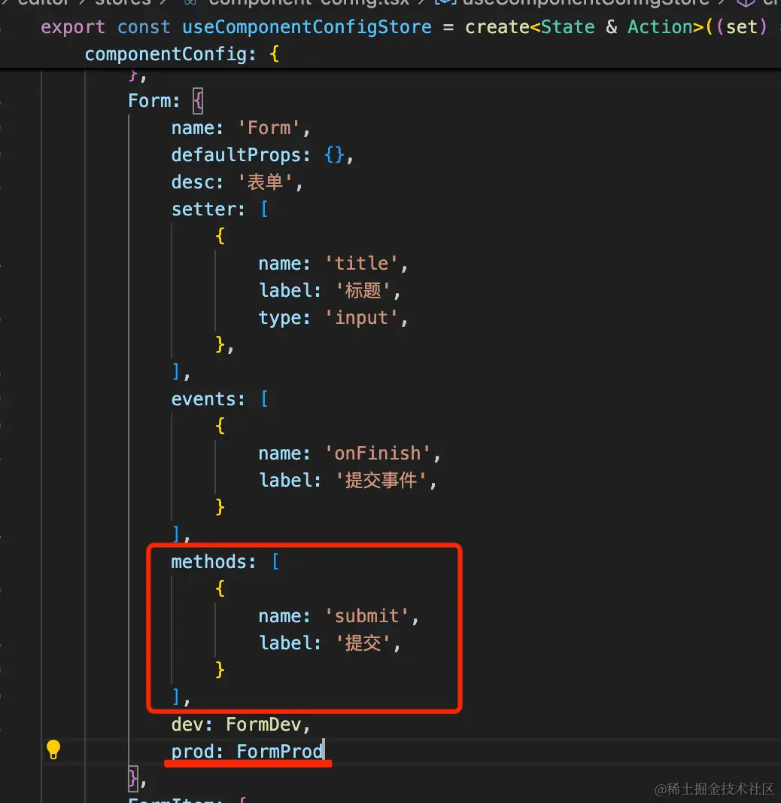
```javascript
methods: [
    {
        name: 'submit',
        label: '提交',
    }
],
```
并且修改 prod 为刚才写的组件。

测试下看看：


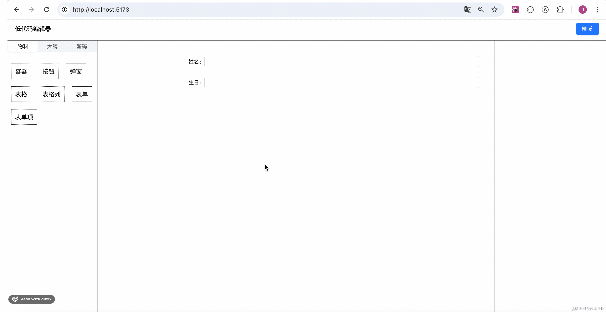

然后我们加一个按钮来触发表单提交。


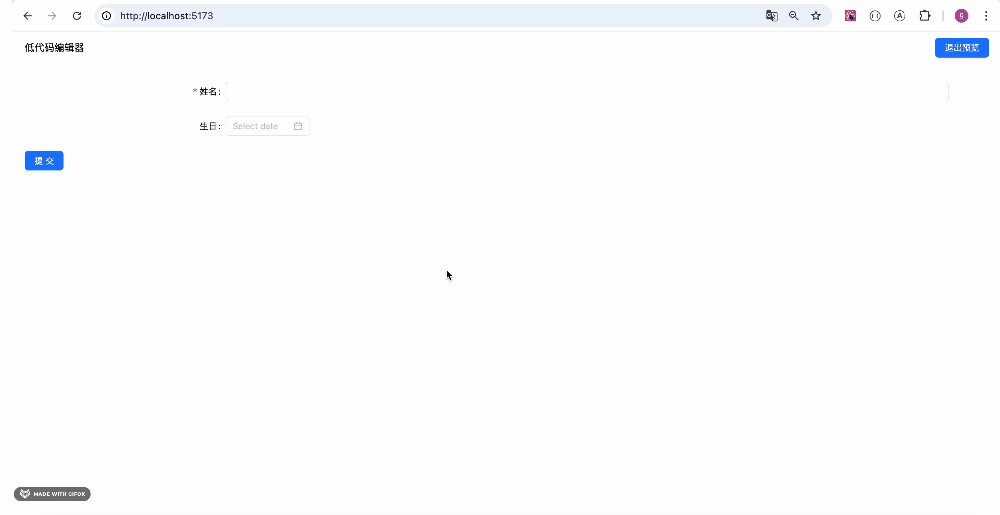

我们应该能在事件处理函数里拿到传过来的 values：

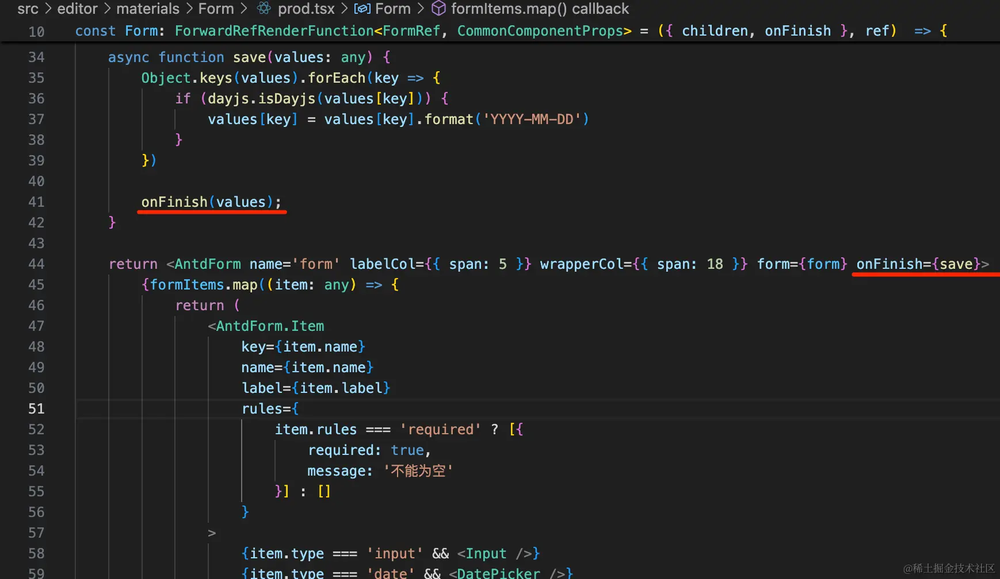

在 Preview 绑定事件的时候加一下参数：

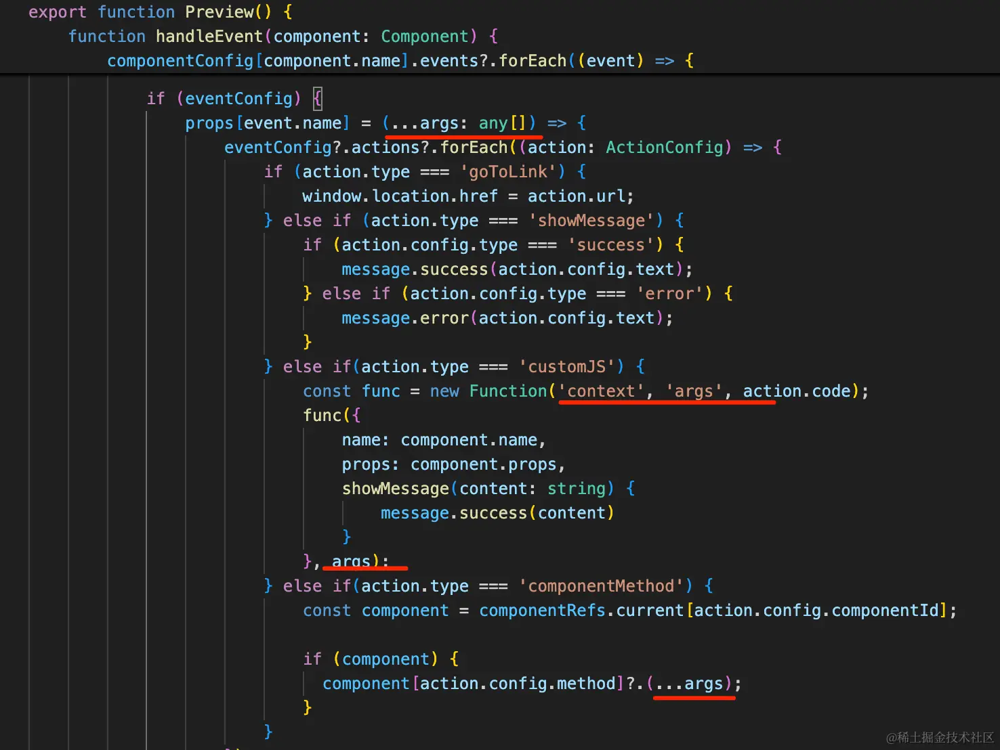
测试下：


```javascript
const values = args[0];

alert(JSON.stringify(values))
```
点击按钮触发表单提交的动作。

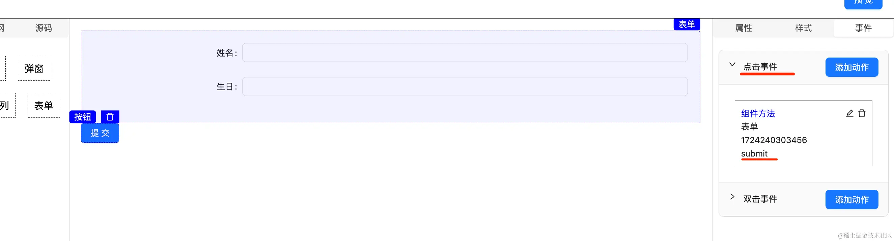

表单提交触发脚本执行的动作。

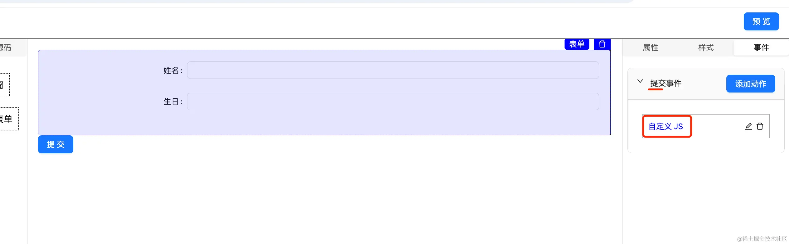

我们可以再加一个发送请求的动作，根据传入的 values 来发送创建请求，之后调用 Table 的刷新方法就好了。

现在我们编辑完的画布，一刷新就没有了：


这样体验不好，我们最好做一下持久化。

这是 zustand 自带的功能，用 persist 中间件实现就行：

我们做拖拽版 todolist 那个案例的时候用过：

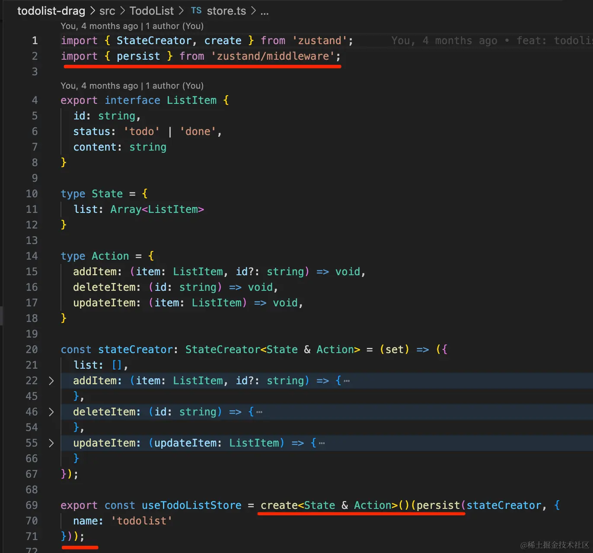

用了 ts + middleware 的时候，create 要换种写法。

[文档的解释](https://github.com/pmndrs/zustand/blob/main/docs/guides/typescript.md)是为了更好的处理类型：

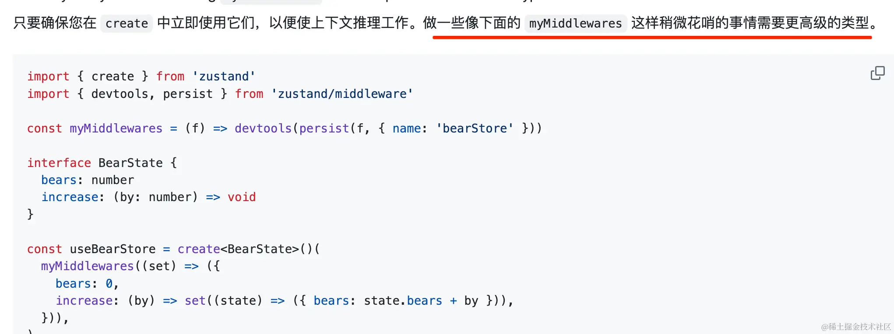

不影响功能。

我们加一下：

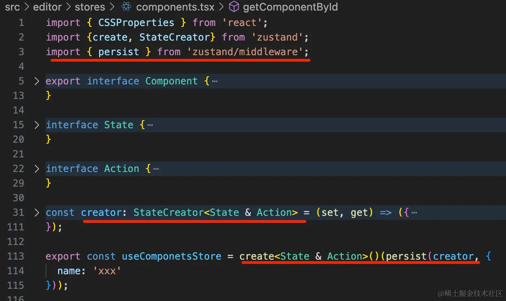

```javascript
const creator: StateCreator<State & Action> = (set, get) => ({
    //...
});

export const useComponetsStore = create<State & Action>()(persist(creator, {
  name: 'xxx'
}));
```
测试下：


这样刷新后依然保存着编辑的内容。

案例代码上传了[小册仓库](https://github.com/QuarkGluonPlasma/react-course-code/tree/main/lowcode-editor)

## 总结

这节我们实现了 Form 组件，并做了 store 的持久化。

Form 组件和 Table 组件一样，通过 FormItem 来配置字段，FormItem 本身不渲染内容。

Form 暴露了 submit 方法，并且支持绑定 onFinish 事件。

我们可以通过 Button 的点击事件触发 Form 的 submit，然后给 Form 的 onFinish 事件绑定一个发请求的动作，这样就实现了提交表单保存到服务端。

至此，我们的低代码编辑器就比较完善了，物料、动作都可以根据需要自己添加。
