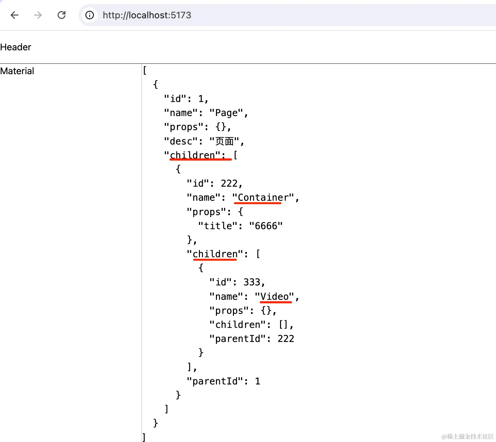
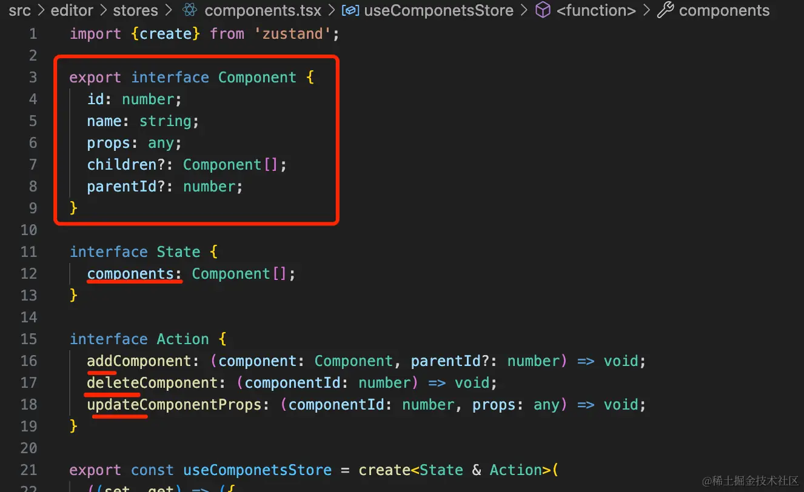
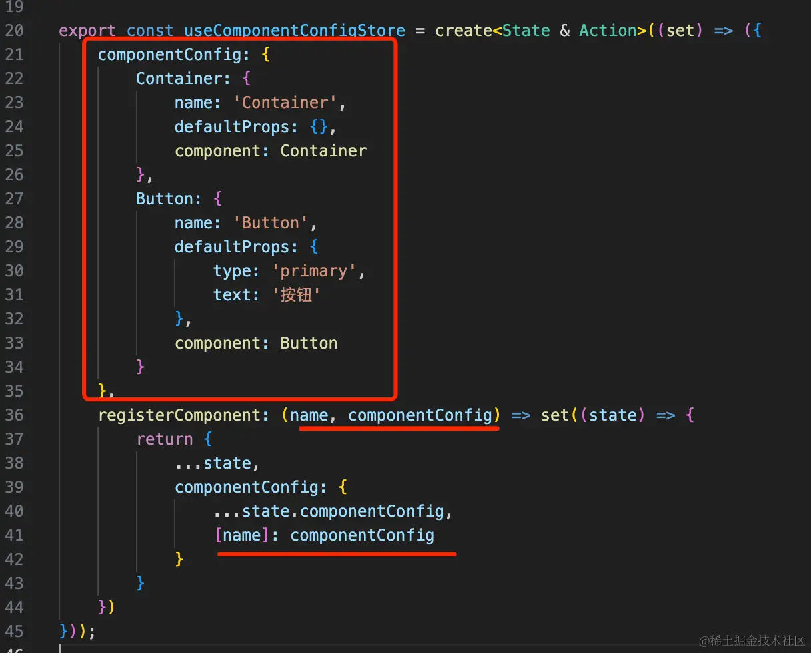
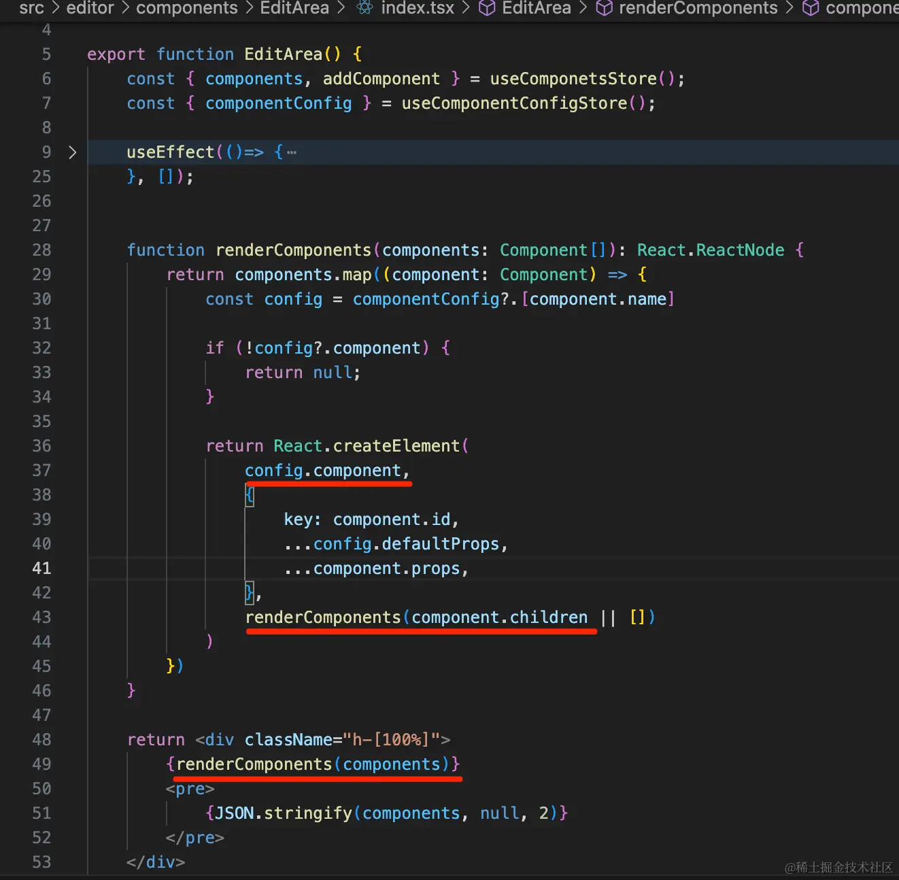
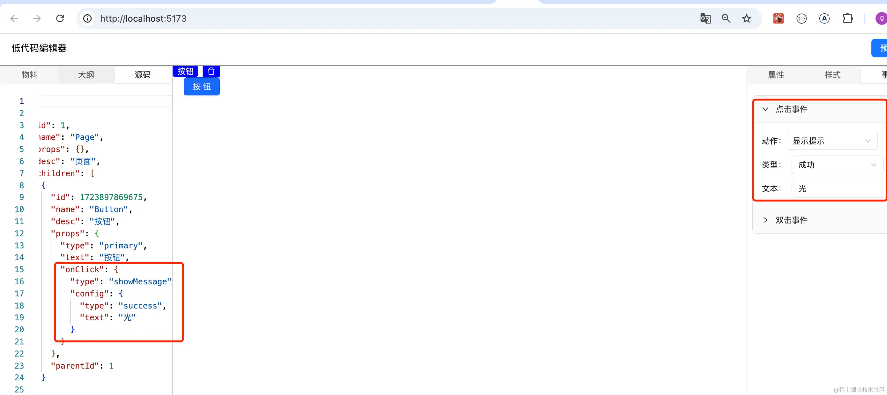
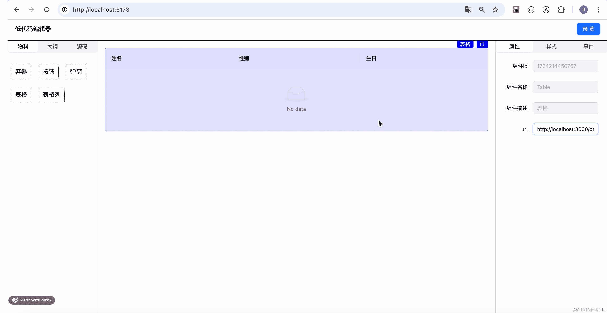

# 第79章—低代码编辑器：项目总结

我们从 0 到 1 实现了一个低代码编辑器，和 amis 功能类似。

先过一下整体功能：

可以拖拽物料组件到画布区，可以放在任意层次：

并且组件还可以拖拽改变位置：

组件选中之后可以编辑属性：

编辑样式：

还可以绑定事件：

事件可以绑定不同的动作，比如跳转链接、消息提示、自定义 JS、或者调用其他组件的方法：

可以编辑、删除事件绑定的动作：

可以切换大纲、源码视图：

编辑完之后可以预览：

这就是低代码编辑器的全部功能。

其实大多数低代码编辑器都是这样做的。

比如我们看下百度的 [amis](https://aisuda.github.io/amis-editor-demo/#/edit/0)：

阿里的 ：

华为的 [tiny engine](https://opentiny.design/tiny-engine#/tiny-engine-editor)

功能大同小异。

当然，我们的低代码编辑器内置的物料组件不多，你完全可以自己扩展物料，支持各种场景的搭建。

回顾下我们开发的过程：

首先，我们分析了低代码的核心就是一个 json 的数据结构。

这个 json 就是一个通过 children 属性串联的组件对象树。

从物料区拖拽组件到画布区，就是在 json 的某一层级加了一个组件对象。

选中组件在右侧编辑属性，就是修改 json 里某个组件对象的属性。

大纲就是把这个 json 用树形展示。

然后我们写了下代码，用 allomet 实现了 split pane 布局，用 tailwind 来写样式，引入 zustand 来做全局 store。

在 store 中定义了 components 和对应的 add、update、delete 方法。

然后实现了拖拽组件到画布，也就是拖拽编辑 json。

我们添加了 Button 和 Container 组件，并创建了 componentConfig 的全局 store，用来保存组件配置。

然后实现了 renderComponents，它就是递归渲染 component，用到的组件配置从 componentConfig 取。

之后引入 react-dnd 实现了拖拽编辑，左侧的物料添加 useDrag，画布里的组件添加 useDrop，然后当 drop 的时候，在对应 id 下添加一个对应的类型的组件。

还要处理下 didDrop，保证只 drop 一次。

之后我们实现了下编辑的时候的交互，实现了 hover 时的高亮框，和点击时的编辑框。

在每个组件渲染的时候加上了 data-component-id，然后在画布区根组件监听 mouseover、click 事件，通过触发事件的元素一层层往上找，找到 component-id。

然后 getBoudingClientRect 拿到这个元素的 width、height、left、top 等信息，和画布区根元素的位置做计算，算出高亮框、编辑框的位置。

接下来实现了属性和样式的编辑。

在 componentConfig 里加了 setter、stylesSetter 来保存不同组件的属性、样式表单配置。

然后在 Setting 区域渲染对应的表单。

表单变化的时候，修改 components 里对应的 styles、props 信息，传入组件渲染。

然后实现了源码、大纲、预览的功能。

源码和大纲比较简单，就是 json 的不同形式的展示，分别用 @monaco-editor/react 和 Tree 组件来做。

预览功能也是递归渲染 json 为组件树，但是组件不一样，预览和编辑状态的组件要分开写。

我们在 store 加了一个 mode 的状态，切换 mode 来切换渲染的内容。

然后实现了事件绑定：

在 comonentConfig 里配置组件可以绑定的事件，然后在 Setting 区事件面板里展示。

可以选择绑定的动作，比如跳转链接，显示提示，输入一些参数之后，就会保存到 json 里。

然后渲染 Preview 的时候根据这些信息来绑定事件。

但直接在 Setting 区域展示的动作表单，动作多了以后不好展示，于是我们实现了动作选择弹窗。

主流低代码编辑器绑定动作的交互都是这么做的。

然后我们实现了自定义 JS 的动作：

通过 monaco editor 来输入代码，然后通过 new Function 来动态执行代码，执行的代码可以访问 context，传入一些属性方法。

实现了组件联动，也就是一个组件可以调用另一个组件的方法。

原理就是组件通过 forwardRef + useImperativeHandle 暴露一些方法，然后在 action 里配置 componentId、method。

这样预览的时候收集所有组件的 ref，事件触发的时候根据配置调用对应 componentId 的对应 method。

综上，我们支持了内置动作、自定义 JS、组件联动，事件绑定的功能就比较完整了。

然后加了 Table、Form 等物料组件。

Table 组件可以配置 url，然后拖拽 TableColumn 进来，TableColumn 可以配置字段信息。

Preview 渲染的时候，根据 url 请求接口，然后根据 columns 的配置来渲染数据。

Form 组件和 Table 组件一样，通过 FormItem 来配置字段，FormItem 本身不渲染内容。

Form 暴露了 submit 方法，并且支持绑定 onFinish 事件。

我们可以通过 Button 的点击事件触发 Form 的 submit，然后给 Form 的 onFinish 事件绑定一个发请求的动作，这样就实现了提交表单保存到服务端。

你可以基于这个低代码编辑器扩展一些物料、动作，支持某些场景的搭建。

这个项目也有挺多技术亮点的：

- 基于 react-dnd 实现了拖拽，可以拖拽物料到组件树的任意层级
- 通过 zustand 实现了全局 store 的存储，比如组件树、组件配置等，并用 persist 中间件做了持久化
- 通过 tailwind 来写样式，不需要写 css 文件
- 通过 getBoudingClientRect 拿到 hover、click 的组件边界，动态计算编辑框位置
- 通过 json 递归渲染组件，基于 React.cloneElement 来修改组件 props
- 通过 ref 实现了组件联动，组件通过 forwardRef + useImperativeHandle 暴露方法，然后全局注册，供别的组件调用

其实整体做下来，实现一个低代码编辑器并不是很难，难点大概在实现各种物料组件、支持各种属性配置吧 🤔️

很多公司都有团队在做专职做低代码业务，学会这个项目，写在简历上，或许能给你增加一些机会。
