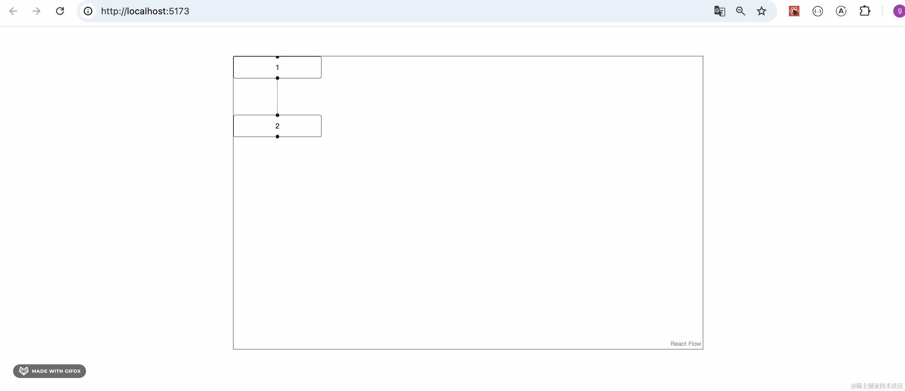

# 第80章—快速掌握ReactFlow画流程图

这节我们来学下用 React Flow 来画流程图。

有同学会问，这有什么应用么？

有很多。

现在很多 AI 工具都支持通过流程图来画工作流，然后执行：

比如 [Coze](https://www.coze.cn/store/workflow) 的：


或者 Defi 的：


在 Defi 的[前端代码](https://github.com/langgenius/dify/blob/main/web/package.json#L86)可以看到用的 reactflow


工作流是 AI 工具的一个卖点，并不是所有的 AI 工具都支持：


能作为业务卖点的功能，这技术就很有价值了。

而且低代码编辑器的事件处理也可以用流程图来做逻辑编排：


然后执行这个流程。

同样，不是所有的低代码平台都支持逻辑编排，这也是一个可以作为业务卖点的功能。

所以说，学习 React Flow 是很有价值的。

下面我们新建个项目来学习下：

```
npx create-vite react-flow-test
```


进入项目，安装 reactflow 的包：

```
npm install
npm install --save @xyflow/react
```
把 main.tsx 里的样式和 StrictMode 去掉。


然后改一下 App.tsx

```javascript
import { ReactFlow } from '@xyflow/react';
import '@xyflow/react/dist/style.css';
 
const initialNodes = [
  { id: '1', position: { x: 0, y: 0 }, data: { label: '1' } },
  { id: '2', position: { x: 0, y: 100 }, data: { label: '2' } },
];
const initialEdges = [{ id: 'e1-2', source: '1', target: '2' }];
 
export default function App() {
  return (
    <div style={{ width: '800px', height: '500px', border: '1px solid #000', margin: '50px auto' }}>
      <ReactFlow nodes={initialNodes} edges={initialEdges} />
    </div>
  );
}
```

其实 React Flow 也很简单，就是指定 node（节点） 和 edge（边） 就好了。

比如我们指定了 2 个节点：


id 是节点 id、position 是在画布中的坐标，data 是传递给节点组件的参数。

指定了一条边来连接 id 为 1 和 id 为 2 的节点。


指定了这两部分，就是一个流程图了：


跑起来看下效果：

```
npm run dev
```


可以看到，流程图绘制出来了，可以放缩画布，但不能拖动流程图。

这是因为没处理拖动的事件，加一下就好了：


因为只有 node 和 edge，所以也就只有三种事件： node 变化、edge 变化、node 和 node 连接，也就是 onNodesChange、onEdgesChange、onConnect

onNodesChange 和 onEdgesChange 直接用 reactflow 提供的就好。

而 onConnect 就是调用 addEdge 新加一条边，然后调用 setEdges 更新。

```javascript
import { addEdge, Connection, OnConnect, ReactFlow, useEdgesState, useNodesState } from '@xyflow/react';
import '@xyflow/react/dist/style.css';
 
const initialNodes = [
  { id: '1', position: { x: 0, y: 0 }, data: { label: '1' } },
  { id: '2', position: { x: 0, y: 100 }, data: { label: '2' } },
];
const initialEdges = [{ id: 'e1-2', source: '1', target: '2' }];
 
export default function App() {
  const [nodes, setNodes, onNodesChange] = useNodesState(initialNodes);
  const [edges, setEdges, onEdgesChange] = useEdgesState(initialEdges);
 
  const onConnect = (params: Connection) => {
    setEdges((eds) => addEdge(params, eds))
  }

  return (
    <div style={{ width: '800px', height: '500px', border: '1px solid #000', margin: '50px auto' }}>
      <ReactFlow 
        nodes={nodes}
        edges={edges}
        onNodesChange={onNodesChange}
        onEdgesChange={onEdgesChange}
        onConnect={onConnect}
      />
    </div>
  );
}
```
试一下：



现在节点就可以拖拽了，并且可以删除节点、删除边、创建新的连接。

ractflow 还内置了一些工具。


分别是控制条、缩略图、背景：


当然，用点做背景不太明显，你可以换成线：


```javascript
<Background variant={BackgroundVariant.Lines}/>
```


你可以用鼠标滚轮放缩画布，也可以用控制条来控制：


或者可以在 MiniMap 上加上 zoomable 参数：


这样就可以通过缩略图放缩画布了：


回到流程图本身：

像这些节点明显都是自己绘制的：


我们也实现下：

```javascript
import { addEdge, Background, BackgroundVariant, Connection, Controls, Handle, MiniMap, OnConnect, Position, ReactFlow, useEdgesState, useNodesState } from '@xyflow/react';
import '@xyflow/react/dist/style.css';
 
const initialNodes = [
  { id: '1', position: { x: 0, y: 0 }, type: 'red', data: { label: '1' } },
  { id: '2', position: { x: 200, y: 300 }, type: 'blue', data: { label: '2' } },
];
const initialEdges = [{ id: 'e1-2', source: '1', target: '2' }];
 
interface NodePorps {
  data: {
    label: string
  }
}
function RedNode({ data }: NodePorps) {
  return <div style={{background: 'red', width: '100px', height: '100px', textAlign: 'center'}}>
    <Handle type="source" position={Position.Right} />
    <Handle type="target" position={Position.Bottom} />


    <div>{data.label}</div>
  </div>
}

function BlueNode({ data }: NodePorps) {
  return <div style={{background: 'blue', width: '50px', height: '50px', textAlign: 'center', color: '#fff'}}>
    <Handle type="source" position={Position.Bottom} />
    <Handle type="target" position={Position.Top} />

    <div>{data.label}</div>
  </div>
}

export default function App() {
  const [nodes, setNodes, onNodesChange] = useNodesState(initialNodes);
  const [edges, setEdges, onEdgesChange] = useEdgesState(initialEdges);
 
  const onConnect = (params: Connection) => {
    setEdges((eds) => addEdge(params, eds))
  }

  return (
    <div style={{ width: '800px', height: '500px', border: '1px solid #000', margin: '50px auto' }}>
      <ReactFlow 
        nodes={nodes}
        edges={edges}
        onNodesChange={onNodesChange}
        onEdgesChange={onEdgesChange}
        onConnect={onConnect}
        nodeTypes={{
          red: RedNode,
          blue: BlueNode
        }}
      >
        <Controls/>
        <MiniMap zoomable/>
        <Background variant={BackgroundVariant.Lines}/>
      </ReactFlow>
    </div>
  );
}
```
我们增加了两个组件 RedNode 和 BlueNode：


它的 props 里的 data 就是 node 里的 data 属性。

那渲染 node 的时候如何对应到不同的组件呢？

根据 nodeTypes 的映射：


我们指定了 type 为 red 就渲染 RedNode，这样渲染流程图的时候就会用对应的组件来渲染。

看下效果：


可以看到，渲染的节点变成了我们自己的组件。

你可以绘制更多东西，比如这种：


而且节点上有一个黑点可以用来连接别的节点：


这个黑点叫做 Handle：


在自定义节点里，用 Handle 来指定黑点出现的位置。

还要指定 type，可以连线从 source 的 Handle 到 source 为 target 的 Handle，不能反过来。

除了 node 外， edge 自然也是可以自定义的。

```javascript
import { addEdge, Background, BackgroundVariant, BaseEdge, Connection, Controls, EdgeLabelRenderer, EdgeProps, getBezierPath, getStraightPath, Handle, MiniMap, OnConnect, Position, ReactFlow, useEdgesState, useNodesState, useReactFlow } from '@xyflow/react';
import '@xyflow/react/dist/style.css';
 
const initialNodes = [
  { id: '1', position: { x: 0, y: 0 }, type: 'red', data: { label: '1' } },
  { id: '2', position: { x: 200, y: 300 }, type: 'blue', data: { label: '2' } },
];
const initialEdges = [{ id: 'e1-2', source: '1', target: '2', type: 'custom' }];
 
interface NodePorps {
  data: {
    label: string
  }
}
function RedNode({ data }: NodePorps) {
  return <div style={{background: 'red', width: '100px', height: '100px', textAlign: 'center'}}>
    <Handle type="source" position={Position.Right} />
    <Handle type="target" position={Position.Bottom} />

    <div>{data.label}</div>
  </div>
}

function BlueNode({ data }: NodePorps) {
  return <div style={{background: 'blue', width: '50px', height: '50px', textAlign: 'center', color: '#fff'}}>
    <Handle type="source" position={Position.Bottom} />
    <Handle type="target" position={Position.Top} />

    <div>{data.label}</div>
  </div>
}

function CustomEdge({
  id,
  sourceX,
  sourceY,
  targetX,
  targetY,
  sourcePosition,
  targetPosition,
  style = {},
  markerEnd,
}: EdgeProps) {

  const { setEdges } = useReactFlow();

  const [edgePath, labelX, labelY] = getBezierPath({
    sourceX,
    sourceY,
    sourcePosition,
    targetX,
    targetY,
    targetPosition,
  });

  const onEdgeClick = () => {
    setEdges((edges) => edges.filter((edge) => edge.id !== id));
  };

  return (
    <>
      <BaseEdge path={edgePath} markerEnd={markerEnd} style={style} />
      <EdgeLabelRenderer>
        <div
          style={{
            position: 'absolute',
            transform: `translate(-50%, -50%) translate(${labelX}px,${labelY}px)`,
            fontSize: 12,
            // EdgeLabelRenderer 里的组件默认不处理鼠标事件，如果要处理就要声明 pointerEvents: all
            pointerEvents: 'all',
          }}
        >
          <button onClick={onEdgeClick}>
            ×
          </button>
        </div>
      </EdgeLabelRenderer>
    </>
  );
}

export default function App() {
  const [nodes, setNodes, onNodesChange] = useNodesState(initialNodes);
  const [edges, setEdges, onEdgesChange] = useEdgesState(initialEdges);
 
  const onConnect = (params: Connection) => {
    setEdges((eds) => addEdge(params, eds))
  }

  return (
    <div style={{ width: '800px', height: '500px', border: '1px solid #000', margin: '50px auto' }}>
      <ReactFlow 
        nodes={nodes}
        edges={edges}
        onNodesChange={onNodesChange}
        onEdgesChange={onEdgesChange}
        onConnect={onConnect}
        nodeTypes={{
          red: RedNode,
          blue: BlueNode
        }}
        edgeTypes={{
          custom: CustomEdge
        }}
      >
        <Controls/>
        <MiniMap zoomable/>
        <Background variant={BackgroundVariant.Lines}/>
      </ReactFlow>
    </div>
  );
}
```
和 nodeTypes 自定义节点类似，在 edgeTypes 里配置自定义边就可以了：


绘制边稍微复杂一些：


主要是要根据传入的起始位置和目标位置，计算一条贝塞尔曲线，拿到 path 之后传入 BaseEdge 就可以绘制边了。

如果想绘制额外的内容，就放在 EdgeLabelRenderer 组件里。

这里 button 我们想加上点击事件，需要设置 pointerEvents: all，不然默认不响应鼠标事件。

点击的时候，删除这条边，也是调用 setEdeges，这个 API 通过 useReactFlow 的 hook 拿到。

看下效果：


绘制的边多了一个按钮，并且点击可以删除这条边。

有同学可能会说，如果我想绘制直线呢？

那更简单，只需要起始、结束点的坐标就能计算出路径：


```javascript
const [edgePath, labelX, labelY] = getStraightPath({
    sourceX,
    sourceY,
    targetX,
    targetY
})
```
现在绘制的就是直线了：


最后我们在右上角加一个按钮：


点击的时候添加一个节点：

```javascript
<Panel position="top-right">
  <button onClick={() => {
    setNodes([...nodes, { 
      id: Math.random().toString().slice(2,6) + '', 
      type: 'red', 
      position: { x: 0, y: 0 }, 
      data: {
        label: '光'
    }}])
  }}>添加节点</button>
</Panel>
```
试下效果：


至此，reactflow 的常用功能我们就学会了。

案例代码上传了[小册仓库](https://github.com/QuarkGluonPlasma/react-course-code/tree/main/react-flow-test)

## 总结

这节我们学会了基于 React Flow 画流程图。

它有很多有价值的应用，比如 AI 工具的工作流编辑、低代码的逻辑编排等。

但它学起来并不难，核心就是 node（节点） 和 edge（边）。

对应三个事件： nodesChange（节点变化）、edgesChange（边变化）、connect（连接节点和节点）

每个节点可以通过 type 指定绘制用的组件，我们可以自定义节点的内容，通过 data 指定传给组件的参数。

然后通过 nodeTypes 来指定 type 和组件的映射。

同样，边也可以自定义，通过 edgeTypes 来指定映射。

在自定义 node 里，通过 Handle 来声明黑点位置。

在自定义 edge 里，通过 BaseEdge 来画线，通过 EdgeLabelRenderer 来画其他内容。

画边的时候计算贝塞尔曲线的路径、直线的路径用 reactflow 提供的 hook 就行。

此外，还可以通过 Controls、MiniMap、Background 来实现控制条、缩略图、背景等功能。通过 Panel 组件在画布上放置一些按钮之类的。

学完了这个案例，React Flow 就算入门了。
