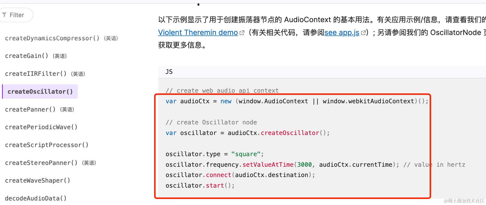
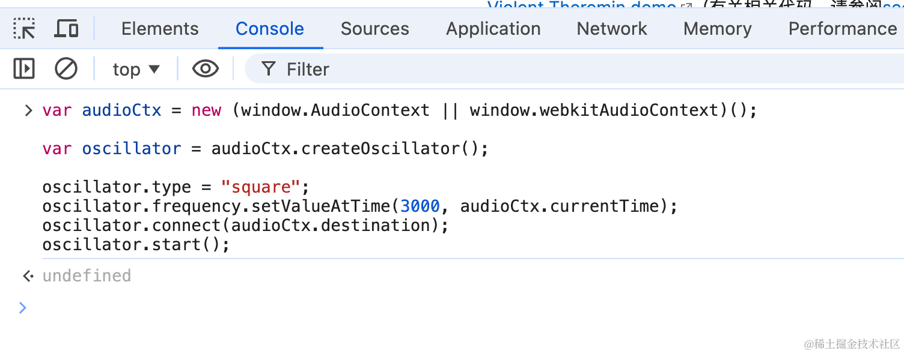
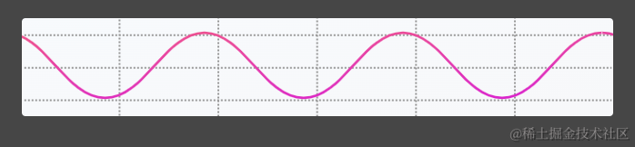
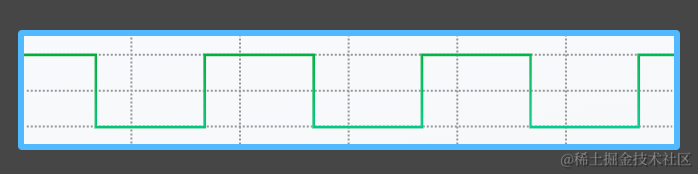
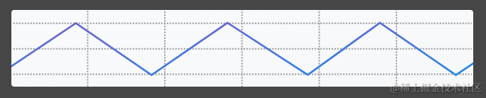
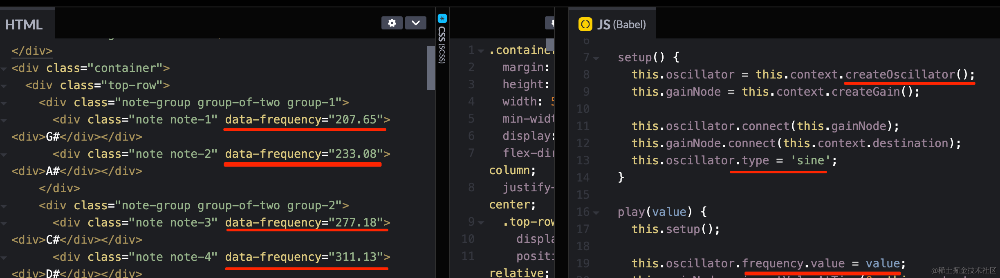
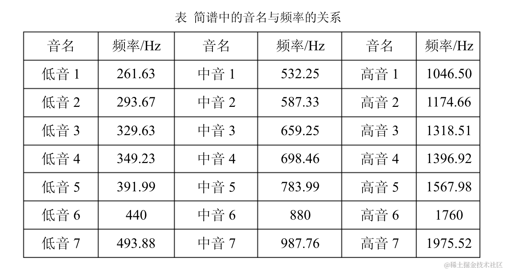
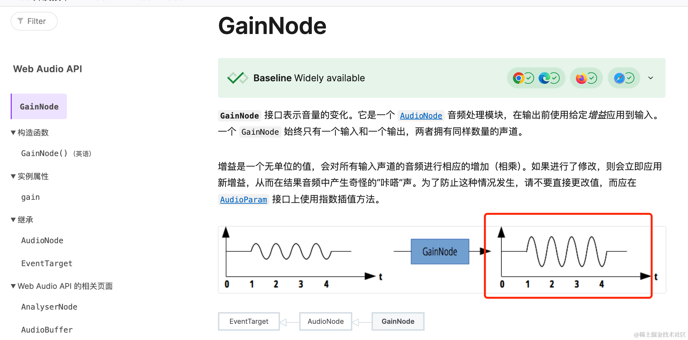
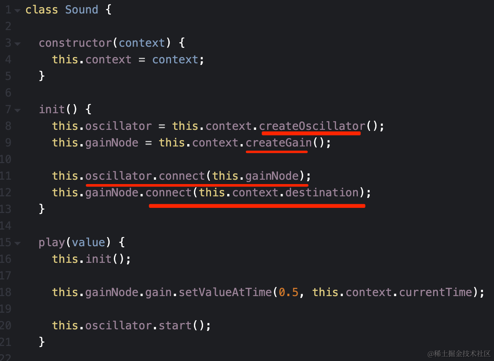
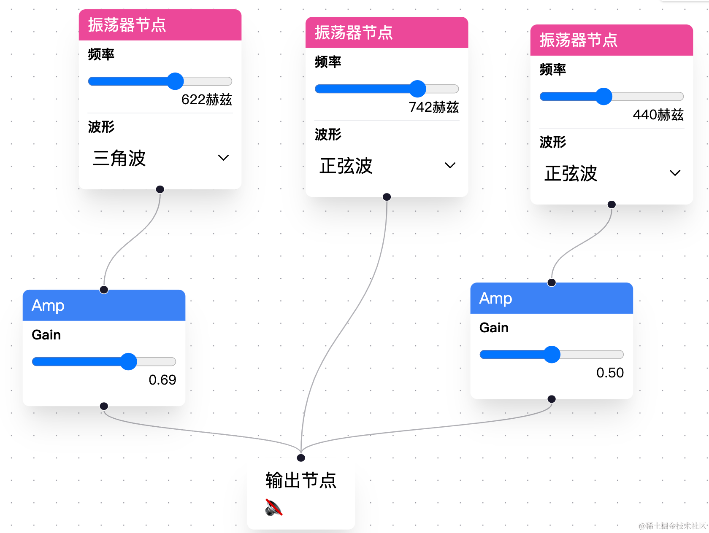

# 第81章—ReactFlow振荡器调音：项目介绍

学完 React Flow，我们来做一个实战案例：振荡器调音。

什么是振荡器呢？

我们知道，声音是由振动产生的，不同的频率，不同的振动波型，就会产生不同的声音。

比如钢琴的琴键，每个键的声音都不同，这个就是不同的振荡频率产生的。

浏览器提供了振荡器的 api [createOscillator](https://developer.mozilla.org/zh-CN/docs/Web/API/BaseAudioContext/createOscillator)：


这样用：



```javascript
var audioCtx = new (window.AudioContext || window.webkitAudioContext)();

var oscillator = audioCtx.createOscillator();

oscillator.type = "square";
oscillator.frequency.setValueAtTime(3000, audioCtx.currentTime);
oscillator.connect(audioCtx.destination);
oscillator.start();
```
你可以现在打开 devtools 跑下这段代码：



是不是听到了一个持续的尖锐的声音？

这就是振荡器生成的。

我们可以设置不同的频率、波形，产生不同的声音。

频率好理解，不同波形也就是[这个](https://codepen.io/gregh/pen/LxJEaj)：


你可以打开[链接](https://codepen.io/gregh/pen/LxJEaj)听一下区别。

正弦波（sine）：



[jaudio](https://lf-activity-static.juejin.cn/obj/juejin-activity-static/user_book/2788017216685118_1724899586576_5433.mp3)

方波（square）：



[jaudio](https://lf-activity-static.juejin.cn/obj/juejin-activity-static/user_book/2788017216685118_1724899664151_1724.mp3)

三角波（triangle）：



[jaudio](https://lf-activity-static.juejin.cn/obj/juejin-activity-static/user_book/2788017216685118_1724899767351_9069.mp3)

锯齿波（sawtooth）：


[jaudio](https://lf-activity-static.juejin.cn/obj/juejin-activity-static/user_book/2788017216685118_1724899782636_3047.mp3)

有的同学可能会问，这有什么用呢？

有很多用处：

比如生成[钢琴不同琴键的声音](https://codepen.io/gregh/pen/RKVNgB)：


[jaudio](https://lf-activity-static.juejin.cn/obj/juejin-activity-static/user_book/2788017216685118_1724898368513_3903.mp3)

实现原理就是正弦波，不同琴键振荡频率不同：



所以说，通过 createOscillator 创建振荡器，然后修改波形、修改频率，就能产生不同的声音。

这个频率在网上也可以搜到：



声音调好了之后，你还可以通过 GainNode 调节音量：



比如下面的代码：



通过 createOscillator 创建振荡器，然后用 createGain 创建调节音量的节点。

oscillator 连接 gainNode，gainNode 连接最终输出。

这样，就实现了调音、音量修改、输出声音的流程。

这个过程很适合用流程图来做：


在振荡器节点调节频率和波形，在 Gain 节点调节音量，最后在输出节点播放调节好的声音。

而且振荡器节点是可以设置多个的，会把多种声音合并播放：



这就是我们要做的实战项目，通过 React Flow 添加振荡器节点、设置参数，节点连接之后，播放合成的声音。

## 总结

这节我们学了 AudioContext 的 createOscillator api，它会创建一个振荡器，可以设置不同的波形、频率，产生不同的声音。

比如钢琴琴键的声音，游戏中的一些音效，都是设置不同波形、频率产生的。

而且还可以通过 GainNode 来调节音量。

可以通过流程图来可视化的创建 Oscillator 节点，设置参数，最后输出声音。

下节开始我们正式进入开发。
