# 第83章—ReactFlow振荡器调音：合成声音

这节来写音频部分，通过流程图设置参数，然后生成声音。

我们先用一下 AudioContext 的 api。

创建 audio.ts

```javascript
const context = new AudioContext();

const osc = context.createOscillator();
osc.frequency.value = 220;
osc.type = 'square';
osc.start();

const volume = context.createGain();
volume.gain.value = 0.5;

const out = context.destination;

osc.connect(volume);
volume.connect(out);
```
创建一个 Oscillator 节点，一个 Gain 节点，和 destination 节点连接起来：

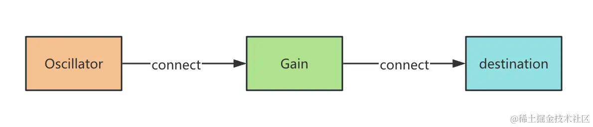

Oscillator 振荡器节点产生不同波形、频率的声音，Gain 节点调节音量，然后 destination 节点播放声音。

在 main.ts 里引入下：

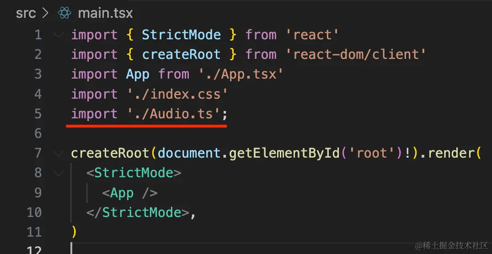

这时候你在页面上就能听到声音了。

[jaudio](https://lf-activity-static.juejin.cn/obj/juejin-activity-static/user_book/2788017216685118_1724930888896_3064.mp3)

有 connect 当然也有 disconnect：

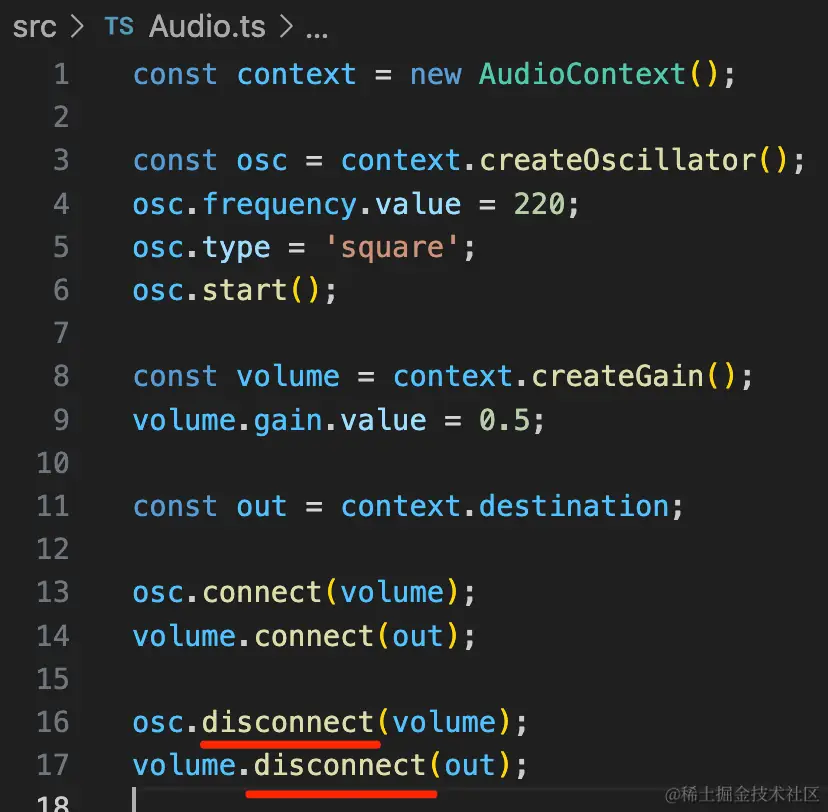

断开节点的连接就没声音了。

connect、disconnect 在流程图上就是 edge 的创建和删除。

所以很容易把两者结合起来。

而且你可以用两个振荡器节点 connect 到一个 destination

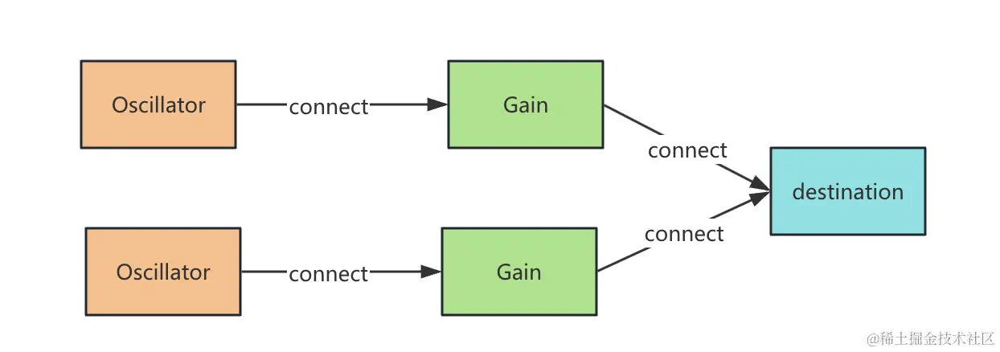

对应的代码就是这样：


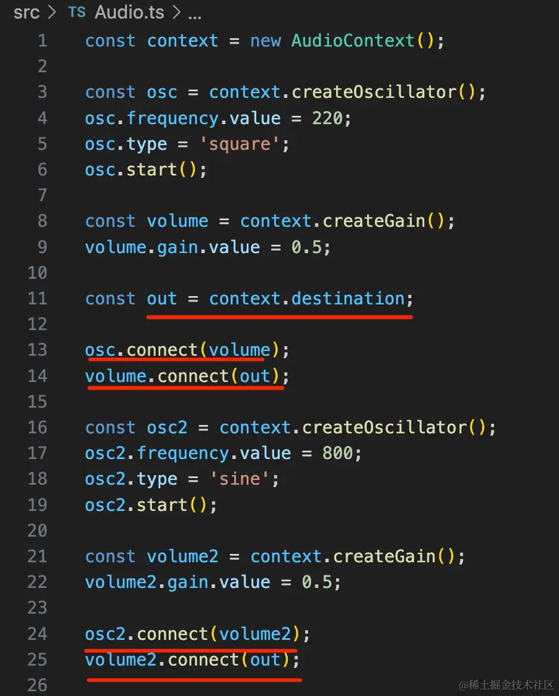

```javascript
const context = new AudioContext();

const osc = context.createOscillator();
osc.frequency.value = 220;
osc.type = 'square';
osc.start();

const volume = context.createGain();
volume.gain.value = 0.5;

const out = context.destination;

osc.connect(volume);
volume.connect(out);

const osc2 = context.createOscillator();
osc2.frequency.value = 800;
osc2.type = 'sine';
osc2.start();

const volume2 = context.createGain();
volume2.gain.value = 0.5;

osc2.connect(volume2);
volume2.connect(out);
```
两个振荡器分别设置不同的波形、频率，产生不同的声音。

你可以听一下，声音是不是两者的合并：

[jaudio](https://lf-activity-static.juejin.cn/obj/juejin-activity-static/user_book/2788017216685118_1724934947163_9470.mp3)

对比听下之前的：

[jaudio](https://lf-activity-static.juejin.cn/obj/juejin-activity-static/user_book/2788017216685118_1724930888896_3064.mp3)

对应到流程图就是这样的：

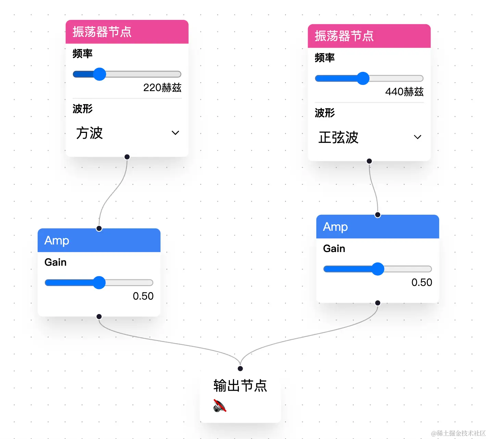

接下来我们就来实现流程图操作到 audio 的对应。

改下 Audio.tsx

```javascript
const context = new AudioContext();

const osc = context.createOscillator();
osc.frequency.value = 220;
osc.type = 'square';
osc.start();

const volume = context.createGain();
volume.gain.value = 0.5;

const out = context.destination;

const nodes = new Map();

nodes.set('a', osc);
nodes.set('b', volume);
nodes.set('c', out);

export function isRunning() {
  return context.state === 'running';
}

export function toggleAudio() {
  return isRunning() ? context.suspend() : context.resume();
}

export function updateAudioNode(id: string, data: Record<string, any>) {
    const node = nodes.get(id);
  
    for (const [key, val] of Object.entries(data)) {
      if (node[key] instanceof AudioParam) {
        node[key].value = val;
      } else {
        node[key] = val;
      }
    }
}

export function removeAudioNode(id: string) {
    const node = nodes.get(id);
  
    node.disconnect();
    node.stop?.();
  
    nodes.delete(id);
}

export function connect(sourceId: string, targetId: string) {
    const source = nodes.get(sourceId);
    const target = nodes.get(targetId);
  
    source.connect(target);
}

export function disconnect(sourceId: string, targetId: string) {
    const source = nodes.get(sourceId);
    const target = nodes.get(targetId);
    source.disconnect(target);
}


export function createAudioNode(id: string, type: string, data: Record<string, any>) {
  switch (type) {
    case 'osc': {
      const node = context.createOscillator();
      node.frequency.value = data.frequency;
      node.type = data.type;
      node.start();

      nodes.set(id, node);
      break;
    }

    case 'volume': {
      const node = context.createGain();
      node.gain.value = data.gain;

      nodes.set(id, node);
      break;
    }
  }
}
```
从上往下看：

因为可能有多个振荡器节点、音量节点，所以用一个 Map 来存储，key 是流程图节点 id：


首先，内置 3 个节点：

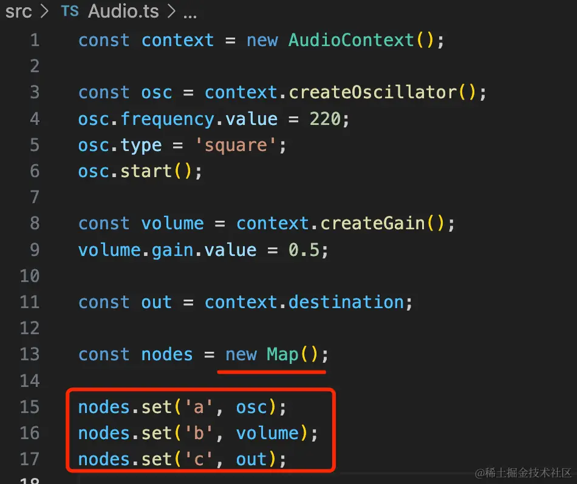

然后暴露了一个 createAudioNode 的方法来创建两种节点（destination 节点只有一个）：

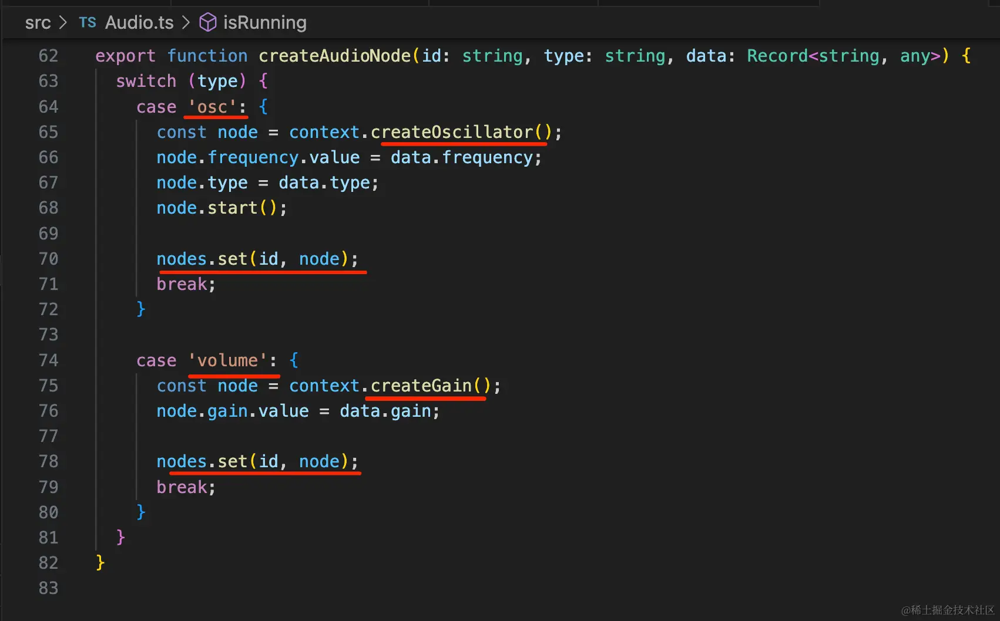

创建完加到 Map 里。

然后提供两个 Audio 节点的连接和断开连接的方法：

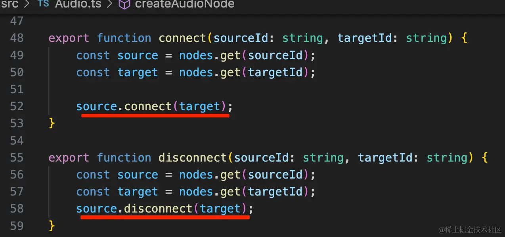

这就是我们用流程图节点 id 来作为 Map 的 key 的好处，可以直接把流程图节点的操作对应到 Audio 节点。

然后暴露一个删除 Audio 节点的方法：

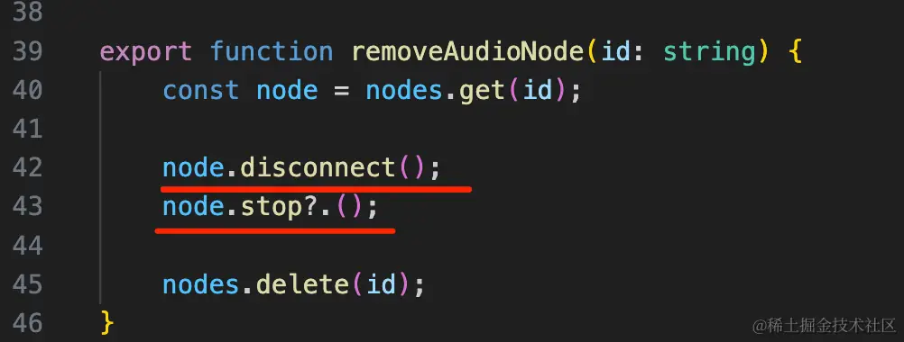

首先 disconnect 所有的连接，然后 stop 这个 Audio 节点，之后从 map 中删除它。

然后是更新参数的方法：

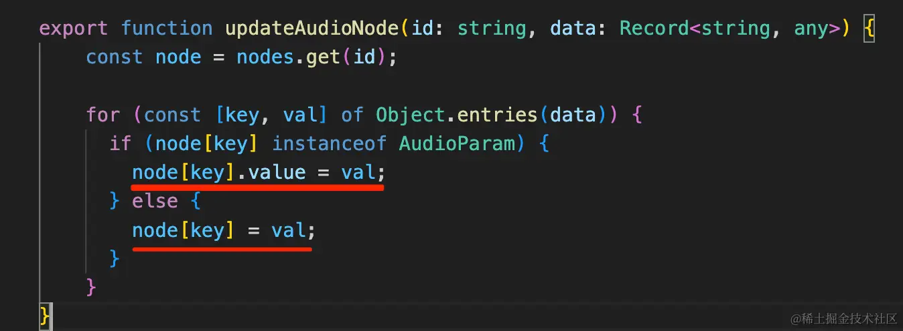

两种流程图节点中的参数修改，就通过这个方法更新到 Audio 节点


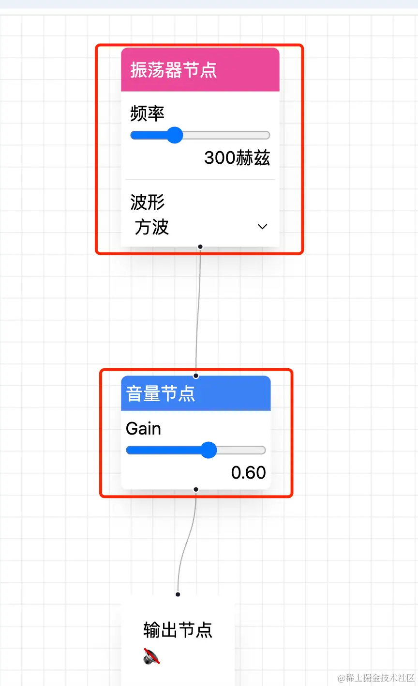

最后暴露一个暂停、修复声音播放的方法：

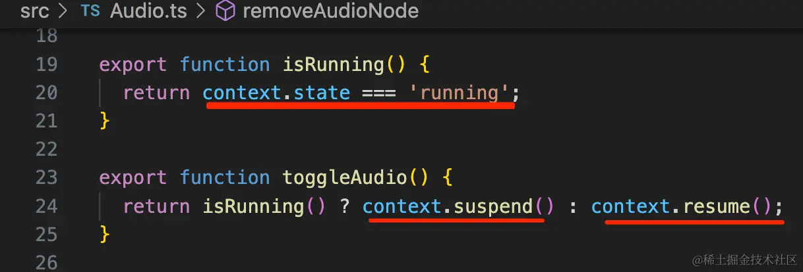

总结一下，就是用一个 Map 保存所有的 Audio 节点，key 为对应流程图节点的 id，然后暴露创建节点、节点连接、删除节点、更新节点参数，暂停、恢复播放的方法。

之后就可以把节点的 onNodeChanges、onEdgeChanges、onConnect 事件对应到这些 更新 audio 节点的方法了。

改下 App.tsx

初始有 a、b、c 三个节点：

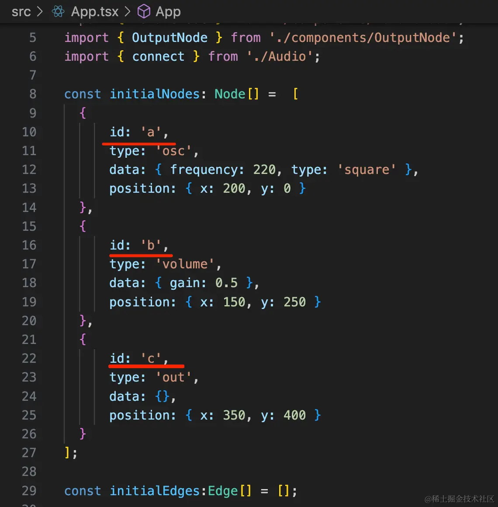

没有边。

流程图节点 connect 的时候，顺便也把对应的 Audio 节点 connect：

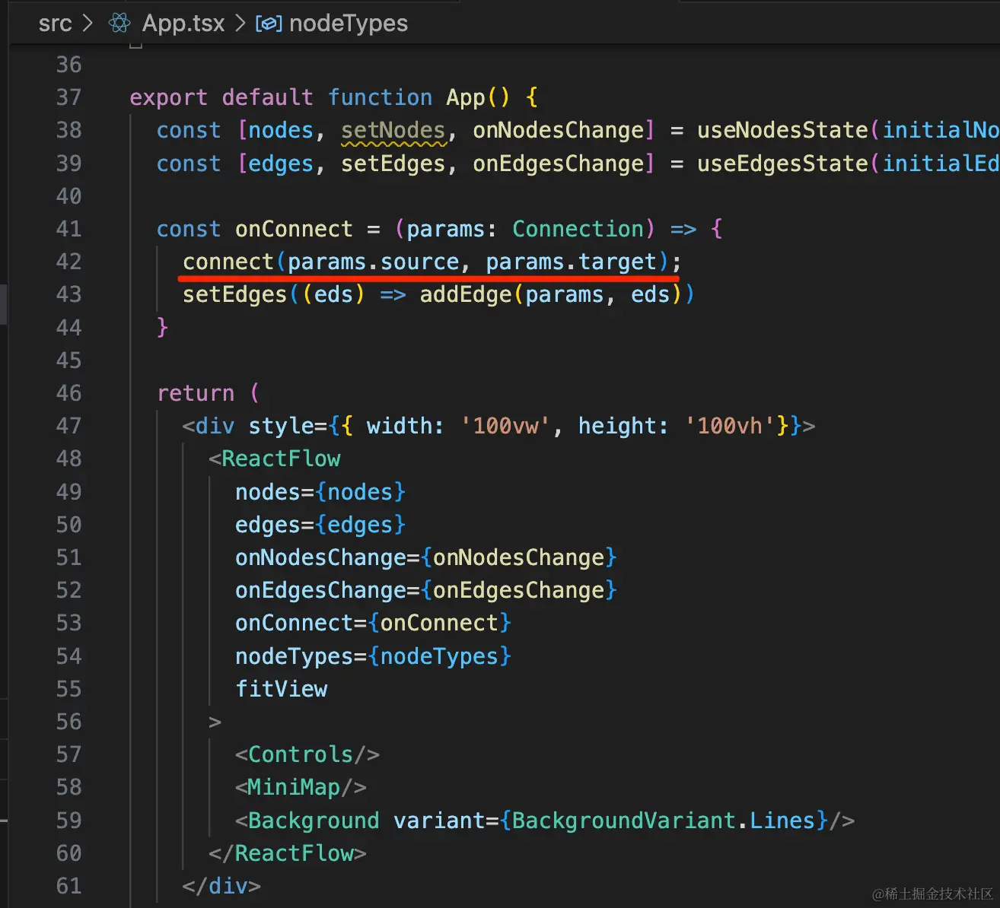

```javascript
const initialNodes: Node[] =  [
  {
      id: 'a',
      type: 'osc',
      data: { frequency: 220, type: 'square' },
      position: { x: 200, y: 0 }
  },
  { 
      id: 'b', 
      type: 'volume', 
      data: { gain: 0.5 },
      position: { x: 150, y: 250 } 
  },
  { 
      id: 'c',
      type: 'out',
      data: {},
      position: { x: 350, y: 400 } 
  }
];

const initialEdges:Edge[] = [];
```
```javascript
connect(params.source, params.target);
```
然后你再在界面上连下线：


连完 3 个节点，你会发现还是没声音。

因为默认是在 suspend 状态，需要 resume 一下：

我们在 OutputNode 点击喇叭的时候调用下 toogleAudio 来切换状态：

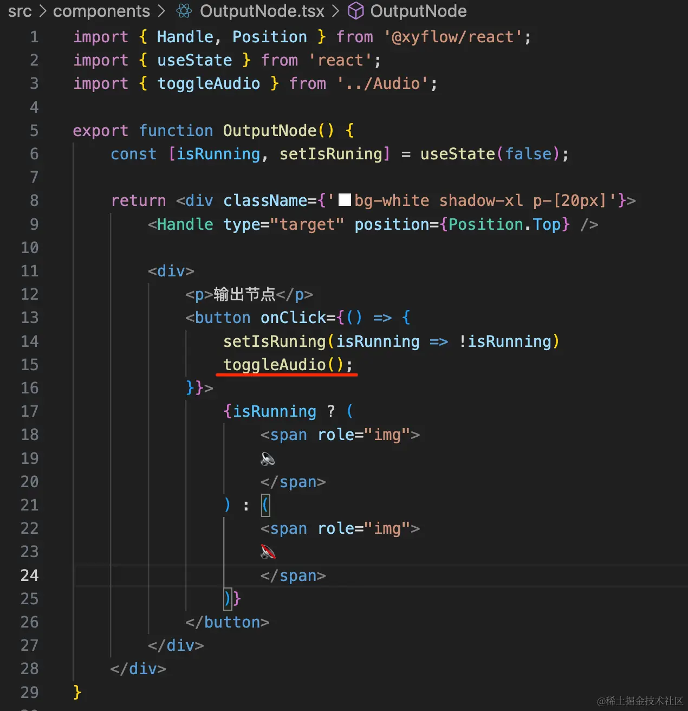

这样点击喇叭就有声音了：


再点击一次就会暂停。

然后再支持下参数的调整：

在 onChange 的时候，修改 audio 节点的参数：

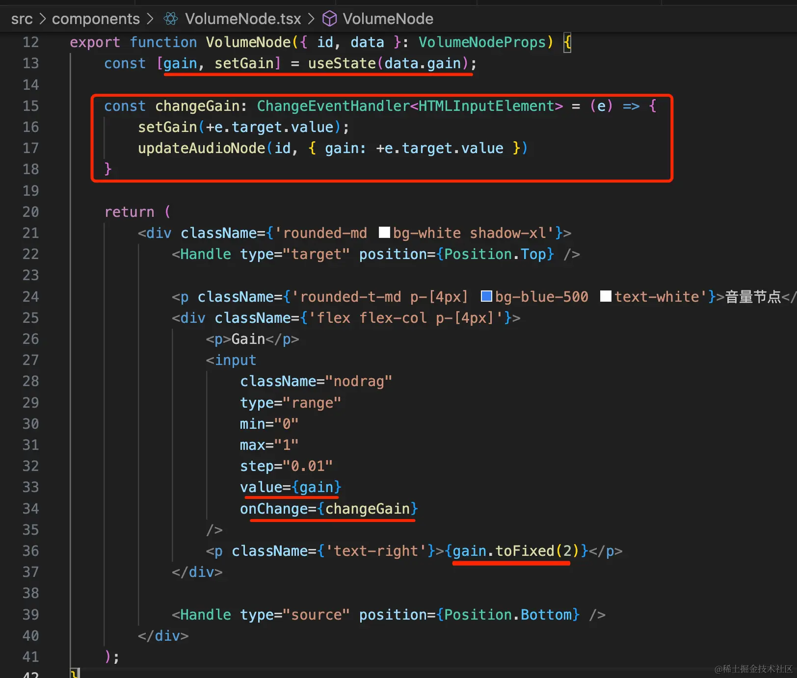
```javascript
import { Handle, Position } from '@xyflow/react';
import { updateAudioNode } from '../Audio';
import { ChangeEvent, ChangeEventHandler, useState } from 'react';

export interface VolumeNodeProps {
  id: string
  data: {
    gain: number
  }
}

export function VolumeNode({ id, data }: VolumeNodeProps) {
    const [gain, setGain] = useState(data.gain);

    const changeGain: ChangeEventHandler<HTMLInputElement> = (e) => {
        setGain(+e.target.value);
        updateAudioNode(id, { gain: +e.target.value })
    }

    return (
        <div className={'rounded-md bg-white shadow-xl'}>
            <Handle type="target" position={Position.Top} />

            <p className={'rounded-t-md p-[4px] bg-blue-500 text-white'}>音量节点</p>
            <div className={'flex flex-col p-[4px]'}>
                <p>Gain</p>
                <input
                    className="nodrag"
                    type="range"
                    min="0"
                    max="1"
                    step="0.01"
                    value={gain}
                    onChange={changeGain}
                />
                <p className={'text-right'}>{gain.toFixed(2)}</p>
            </div>

            <Handle type="source" position={Position.Bottom} />
        </div>
    );
}
```
试一下：

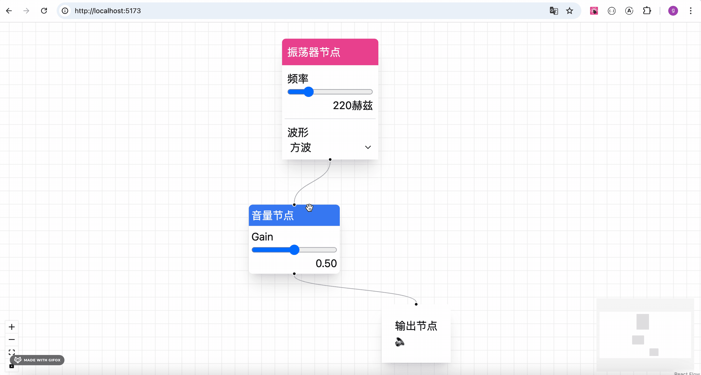

拖动调整音量，你能听到声音大小的变化。

[jaudio](https://lf-activity-static.juejin.cn/obj/juejin-activity-static/user_book/2788017216685118_1724975765635_1230.mp3)

注意，这里加上了 nodrag：

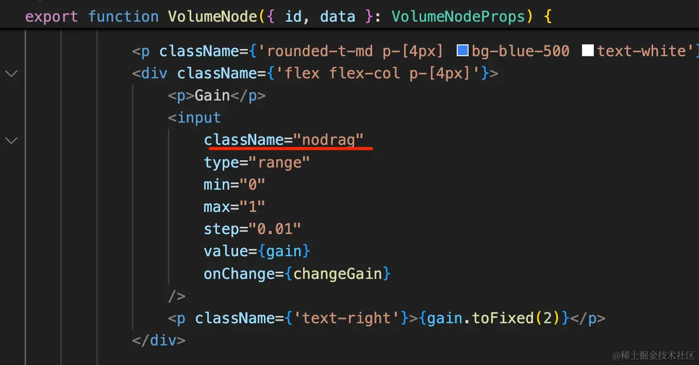

不加的话拖动进度条就变成了拖动节点：


这个是 react flow 提供的用于禁止拖动的 className：

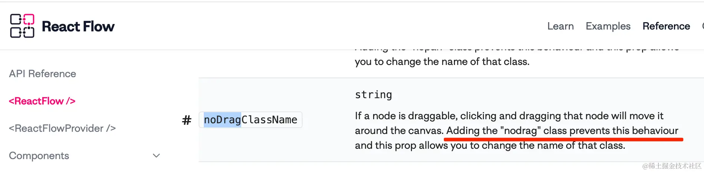

同样的方式处理下 OscillatorNode

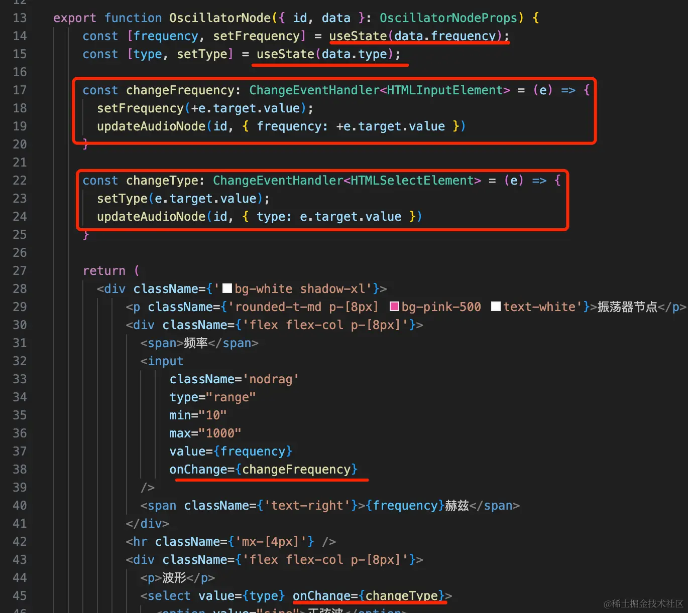


```javascript
import { Handle, Position, useReactFlow } from '@xyflow/react';
import { updateAudioNode } from '../Audio';
import { ChangeEvent, ChangeEventHandler, useState } from 'react';

export interface OscillatorNodeProps {
  id: string
  data: {
    frequency: number
    type: string
  }
}

export function OscillatorNode({ id, data }: OscillatorNodeProps) {
    const [frequency, setFrequency] = useState(data.frequency);
    const [type, setType] = useState(data.type);

    const changeFrequency: ChangeEventHandler<HTMLInputElement> = (e) => {
      setFrequency(+e.target.value);
      updateAudioNode(id, { frequency: +e.target.value })
    }

    const changeType: ChangeEventHandler<HTMLSelectElement> = (e) => {
      setType(e.target.value);
      updateAudioNode(id, { type: e.target.value })
    }

    return (
      <div className={'bg-white shadow-xl'}>
          <p className={'rounded-t-md p-[8px] bg-pink-500 text-white'}>振荡器节点</p>
          <div className={'flex flex-col p-[8px]'}>
            <span>频率</span>
            <input
                className='nodrag'
                type="range"
                min="10"
                max="1000"
                value={frequency}
                onChange={changeFrequency}
            />
            <span className={'text-right'}>{frequency}赫兹</span>
          </div>
          <hr className={'mx-[4px]'} />
          <div className={'flex flex-col p-[8px]'}>
            <p>波形</p>
            <select value={type} onChange={changeType}>
              <option value="sine">正弦波</option>
              <option value="triangle">三角波</option>
              <option value="sawtooth">锯齿波</option>
              <option value="square">方波</option>
            </select>
          </div>
          <Handle type="source" position={Position.Bottom} />
      </div>
    );
};
```


现在就能听到不同频率、波形的声音了。

然后我们再支持下添加振荡器节点和音量节点：


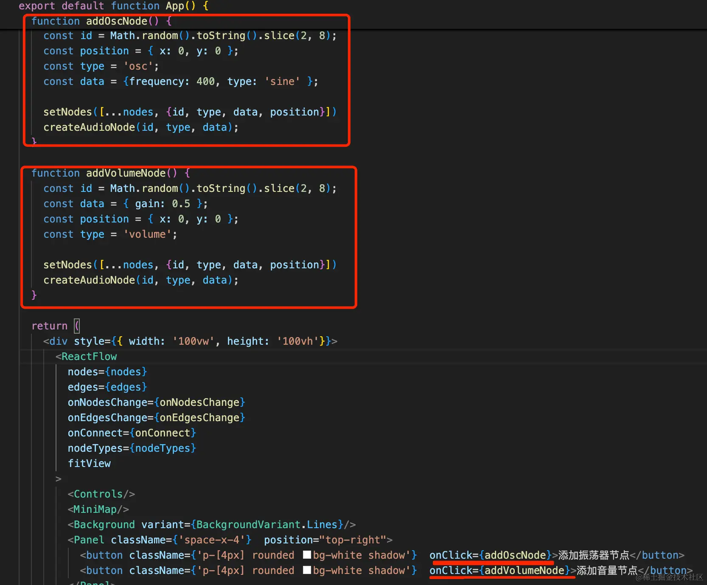

```javascript
import { addEdge, Background, BackgroundVariant, Connection, Controls, Edge, EdgeTypes, MiniMap, Node, OnConnect, Panel, ReactFlow, useEdgesState, useNodesState } from '@xyflow/react';
import '@xyflow/react/dist/style.css';
import { OscillatorNode } from './components/OscillatorNode';
import { VolumeNode } from './components/VolumeNode';
import { OutputNode } from './components/OutputNode';
import { connect, createAudioNode } from './Audio';

const initialNodes: Node[] =  [
  {
      id: 'a',
      type: 'osc',
      data: { frequency: 220, type: 'square' },
      position: { x: 200, y: 0 }
  },
  { 
      id: 'b', 
      type: 'volume', 
      data: { gain: 0.5 },
      position: { x: 150, y: 250 } 
  },
  { 
      id: 'c',
      type: 'out',
      data: {},
      position: { x: 350, y: 400 } 
  }
];

const initialEdges:Edge[] = [];

const nodeTypes = {
  'osc': OscillatorNode,
  'volume': VolumeNode,
  'out': OutputNode
}

export default function App() {
  const [nodes, setNodes, onNodesChange] = useNodesState(initialNodes);
  const [edges, setEdges, onEdgesChange] = useEdgesState(initialEdges);
 
  const onConnect = (params: Connection) => {
    connect(params.source, params.target);
    setEdges((eds) => addEdge(params, eds))
  }

  function addOscNode() {
    const id = Math.random().toString().slice(2, 8);
    const position = { x: 0, y: 0 };
    const type = 'osc';
    const data = {frequency: 400, type: 'sine' };

    setNodes([...nodes, {id, type, data, position}])
    createAudioNode(id, type, data);
  }

  function addVolumeNode() {
    const id = Math.random().toString().slice(2, 8);
    const data = { gain: 0.5 };
    const position = { x: 0, y: 0 };
    const type = 'volume';
  
    setNodes([...nodes, {id, type, data, position}])
    createAudioNode(id, type, data);
  }

  return (
    <div style={{ width: '100vw', height: '100vh'}}>
      <ReactFlow 
        nodes={nodes}
        edges={edges}
        onNodesChange={onNodesChange}
        onEdgesChange={onEdgesChange}
        onConnect={onConnect}
        nodeTypes={nodeTypes}
        fitView
      >
        <Controls/>
        <MiniMap/>
        <Background variant={BackgroundVariant.Lines}/>
        <Panel className={'space-x-4'}  position="top-right">
          <button className={'p-[4px] rounded bg-white shadow'}  onClick={addOscNode}>添加振荡器节点</button>
          <button className={'p-[4px] rounded bg-white shadow'}  onClick={addVolumeNode}>添加音量节点</button>
        </Panel>
      </ReactFlow>
    </div>
  );
}
```
试一下：


这样，添加节点就完成了。

多个节点的时候，声音是它们的合成音。

我们还没处理流程节点删除的时候，去掉 Audio Node，也做一下：

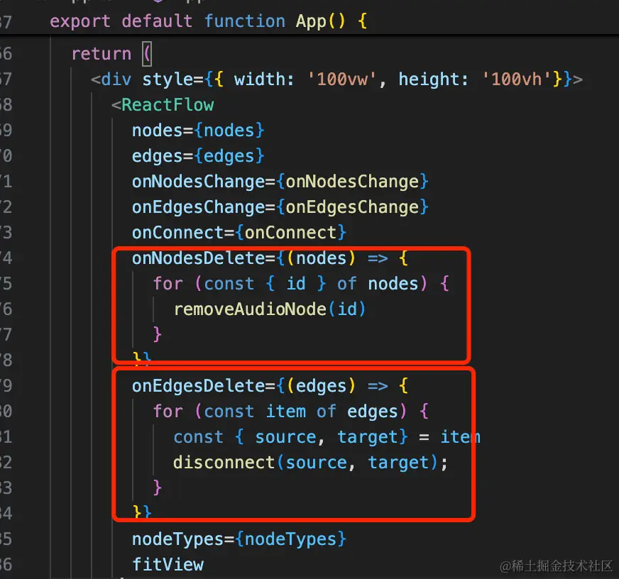

```javascript
onNodesDelete={(nodes) => {
  for (const { id } of nodes) {
    removeAudioNode(id)
  }
}}
onEdgesDelete={(edges) => {
  for (const item of edges) {
    const { source, target} = item
    disconnect(source, target);
  }
}}
```
节点删除对应 removeAudioNode，边删除对应 disconnect。

至此，我们的 React Flow 振荡器调音就完成了。

不过现在不好操作，Handle 有点小，我们加大一点：

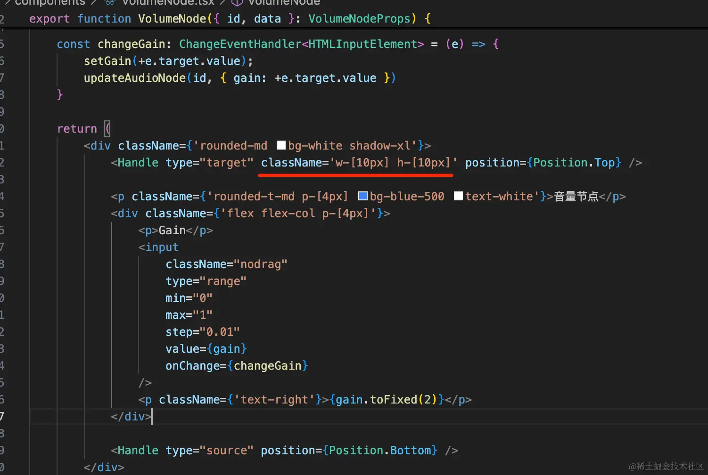

看下效果：

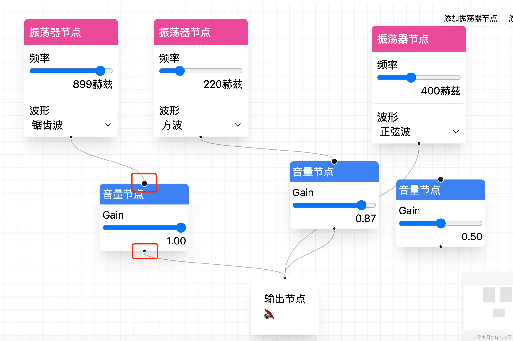

这样，操作起来就方便多了。

案例代码上传了[小册仓库](https://github.com/QuarkGluonPlasma/react-course-code/tree/main/audio-flow)

## 总结

这节我们实现了流程图节点和 AudioContext 节点的同步。

Audio 是通过 createOscillator 创建振荡器节点，通过 createGain 创建音量节点，然后把它们 connect 起来 connect 到 context.destination 节点播放声音。

这和 React Flow 流程图的节点创建、节点连接很容易对应上。

我们分别把流程图节点的 connect 对应到 Audio Node 的 connect 上。

流程图节点表单参数的修改对应到相同 id 的 Audio Node 的参数修改。

流程图节点的创建、删除对应到 Audio Node 的添加删除上。

这样，就可以可视化的调音了。
