# 第84章—AudioContext实现在线钢琴

前面学了 AudioContext，它可以通过调整波形、频率产生不同的声音。

这节我们就用它来实现一个在线钢琴。

css 我们用过 CSS Modules、用过 tailwind，这节用 css in js 方法 styled-components 来写。

创建个项目：

```
npx create-vite online-piano
```

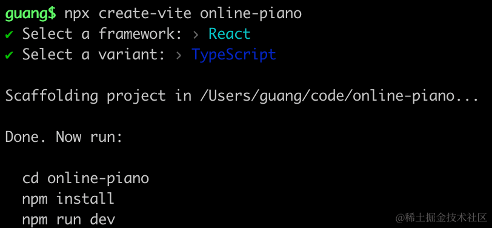

安装 styled-components

```javascript
npm install

npm install --save styled-components
```

去掉 index.css 和 StrictMode：

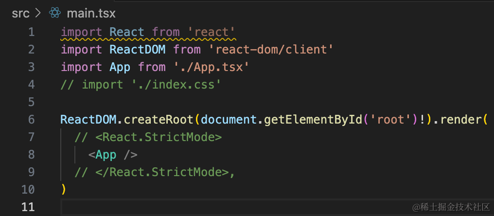

然后改下 App.tsx：

```javascript
import { styled, createGlobalStyle, css } from "styled-components"

function App() {

  const keys: Record<string, { frequency: number }> = {
    A: {
      frequency: 196
    },
    S: {
      frequency: 220
    },
    D: {
      frequency: 246
    },
    F: {
      frequency: 261
    },
    G: {
      frequency: 293
    },
    H: {
      frequency: 329
    },
    J: {
      frequency: 349
    },
    K: {
      frequency: 392
    }
  }

  const GlobalStyles = createGlobalStyle`
    body {
      background: #000;
    }
  `;


  const KeysStyle = styled.div`
    width: 800px;
    height: 400px;
    margin: 40px auto;

    display: flex;
    flex-direction: row;
    justify-content: space-between;
    overflow: hidden;
  `
  const textStyle = css`
    line-height: 500px;
    text-align: center;
    font-size: 50px;
  `

  const KeyStyle = styled.div`
    border: 4px solid black;
    background: #fff;
    flex: 1;
    ${textStyle}

    &:hover {
      background: #aaa;
    }
  `

  const play = (key: string) => {
    const frequency = keys[key]?.frequency;
    if(!frequency) {
      return;
    }


  }

  return <KeysStyle as='section'>
    {
      Object.keys(keys).map((item: any) => {
        return  <KeyStyle as='div' key={item}>
          <div onClick={() => play(item)}>
            <span>{item}</span>
          </div>
        </KeyStyle>
      })
    }
    <GlobalStyles />
  </KeysStyle>
}

export default App
```
这里用一个对象来保存所有的 key 和对应的频率。

用 styled-components 来写样式。


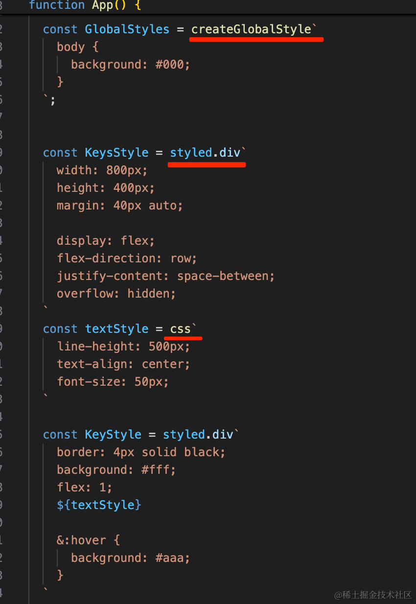

这里用到 3 个 styled-components 的 api：

用 styled.xxx 写样式组件。

用 createGlobalStyle 写全局样式。

用 css 创建复用的 css 片段。

样式组件自然就是可以当作组件来用的：

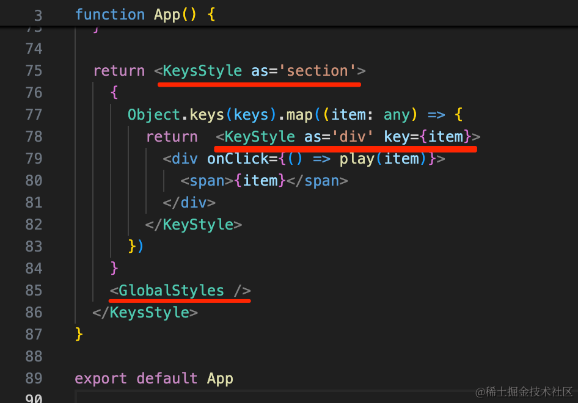

这也是用了 styled-components 的代码的特点。

可以用 as 修改渲染的标签。

跑起来看下：

```
npm run start:dev
```

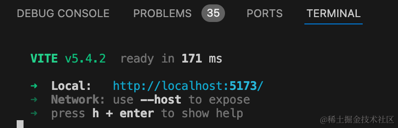

看下效果：


没啥问题。

打开控制台看下：


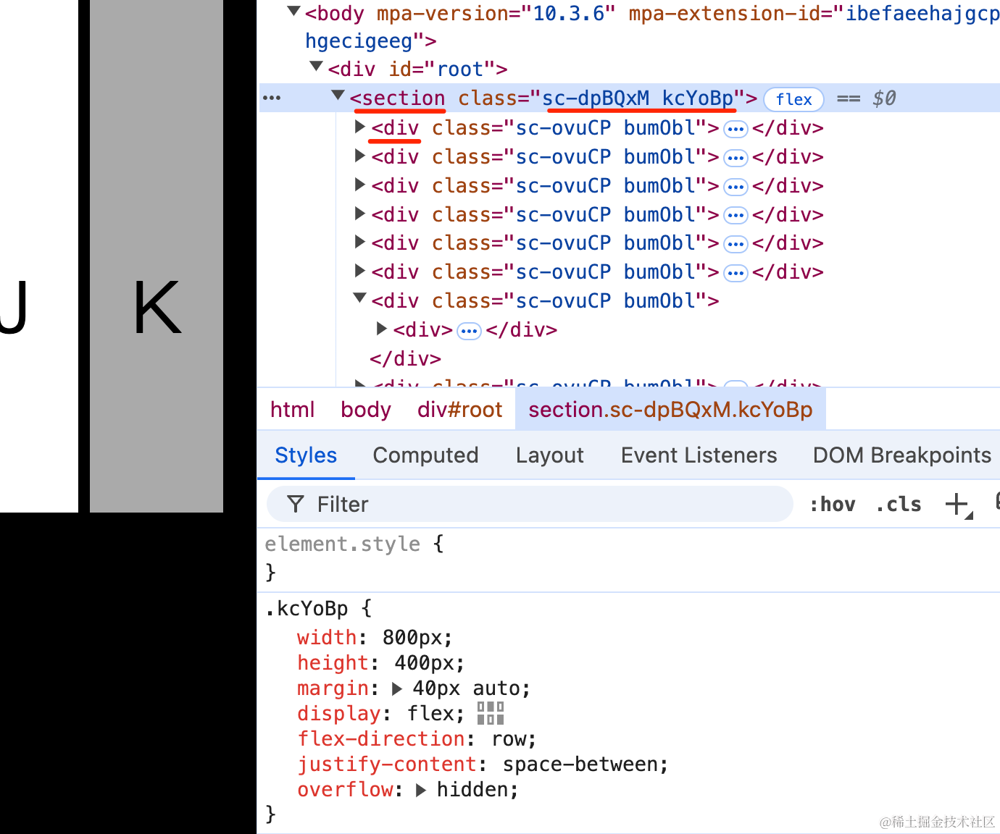

可以看到，className 是编译过的，完全不用担心样式冲突问题。

这就是 styled-components 的好处之一。

这样，样式部分就写完了。

然后我们来写 Audio 部分：

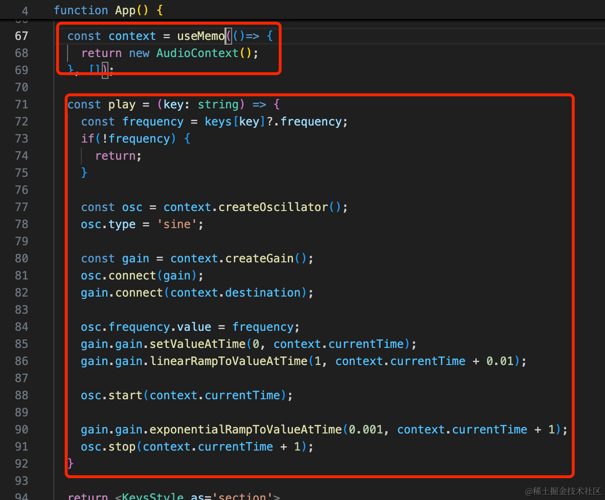

```javascript
const context = useMemo(()=> {
    return new AudioContext();
}, []);

const play = (key: string) => {
    const frequency = keys[key]?.frequency;
    if(!frequency) {
      return;
    }

    const osc = context.createOscillator();
    osc.type = 'sine';

    const gain = context.createGain();
    osc.connect(gain);
    gain.connect(context.destination);

    osc.frequency.value = frequency;
    gain.gain.setValueAtTime(0, context.currentTime);
    gain.gain.linearRampToValueAtTime(1, context.currentTime + 0.01);

    osc.start(context.currentTime);

    gain.gain.exponentialRampToValueAtTime(0.001, context.currentTime + 1);
    osc.stop(context.currentTime + 1);
}
```
我们从上到下看下代码：

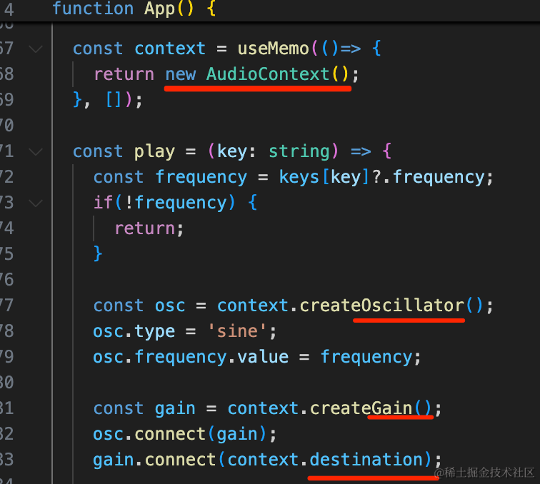

首先，创建 AudioContext，这个不需要每次渲染都创建，所以用 useMemo 包裹。

然后创建 oscillator 节点、gain 节点、destination 节点，连接起来。

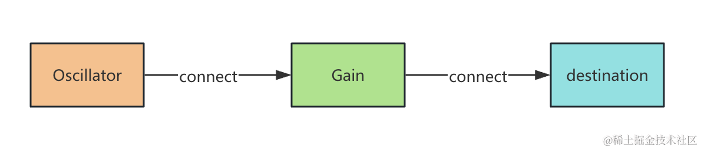

这些我们比较熟悉了。

重点是下面部分：

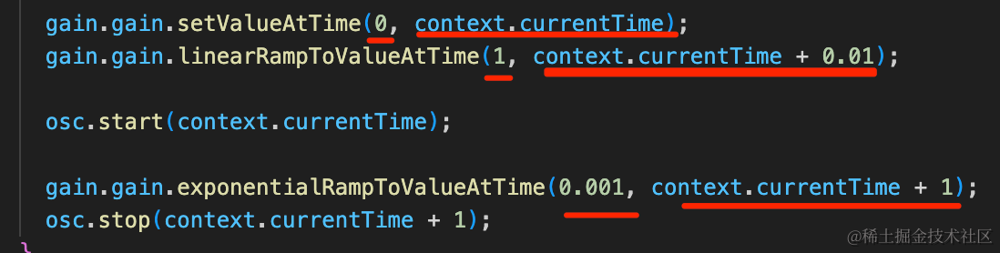

前面我们用 GainNode 修改音量的方式都是直接改 value。

其实它可以按照某种规律修改音量。

我们在 currentTime 当前时间设置音量为 0 

然后 0.01 秒后设置为 1，也就是声音是逐渐变大的（linear 是线性）

然后在 1 秒后设置音量为 0.01，也就是声音指数级的变小。（exponential 是指数级）

这样，按每个键声音都是一秒，但这一秒内有音量从小到大再到小的变化。

大概是这样变化的：

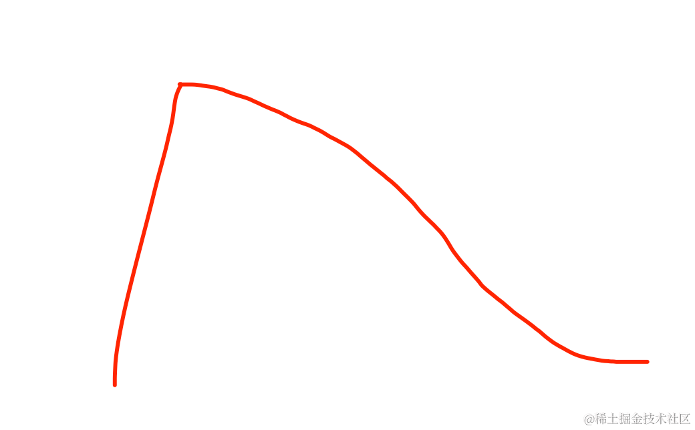

这样听起来就很自然。

正好 start 到 stop 间隔 1 秒，就是按照上面的规律变化的音量：


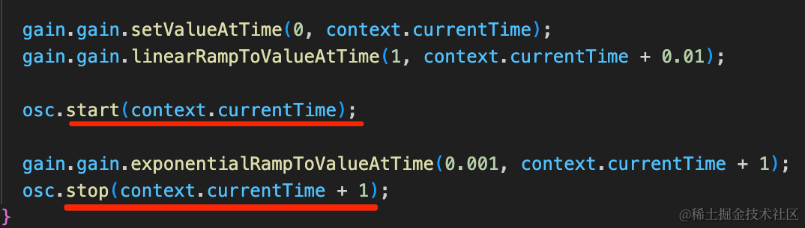

我们试一下：


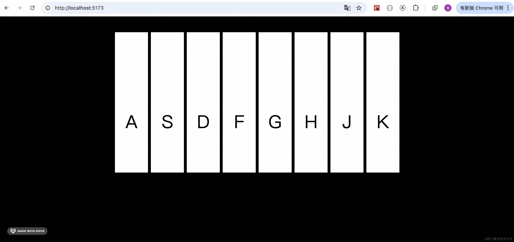

声音是这样的：

[jaudio](https://lf-activity-static.juejin.cn/obj/juejin-activity-static/user_book/2788017216685118_1725027188795_5197.mp3)

是不是很自然！

如果没有音量变化是什么样呢？

注释掉试试：

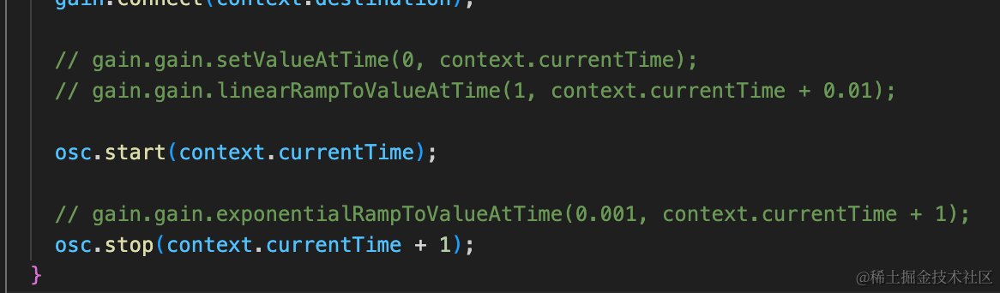

听下现在的声音：

[jaudio](https://lf-activity-static.juejin.cn/obj/juejin-activity-static/user_book/2788017216685118_1725027422304_7077.mp3)

音量完全没变化，听起来就不好听。

现在我们可以点击对应的键来演奏音乐了。

但这样不方便，我们再加上键盘控制：

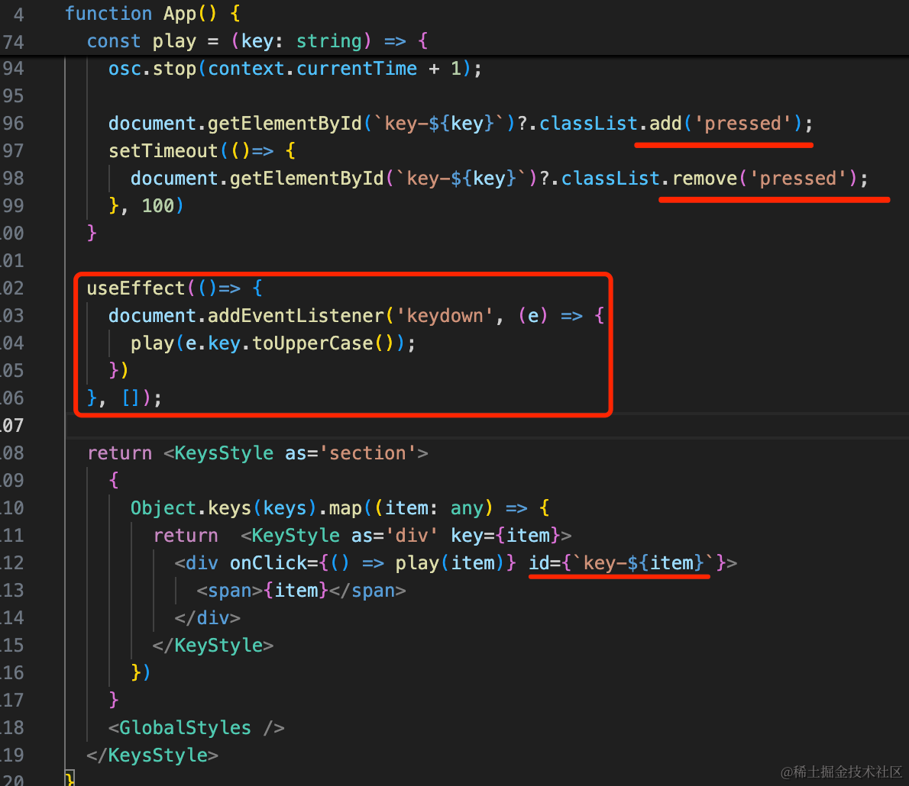

监听 keydown 事件，调用 play 方法传入 key 就可以了。

但按键盘不会触发 hover 效果，所以我们手动加一下 className 来显示按下的效果。

在 global style 加一下这个全局的 className：

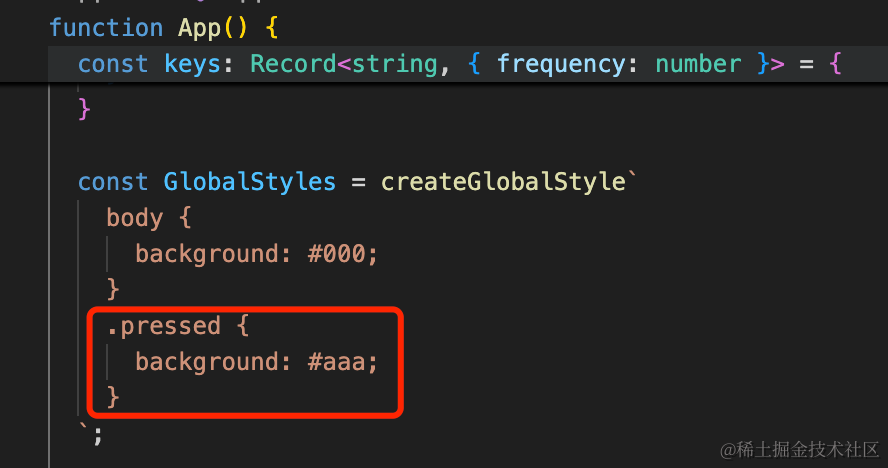

全局 className 不会被编译。

试一下：


这样，按键盘就可以弹奏了。

然后我们用它来演奏几首歌曲：

从网上找下歌曲的简谱：

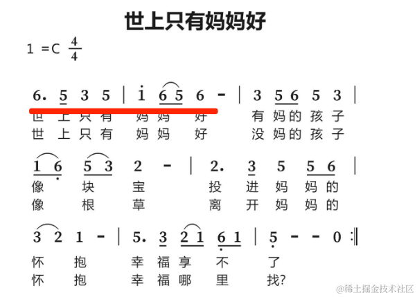

这里我们就只演奏第一句吧


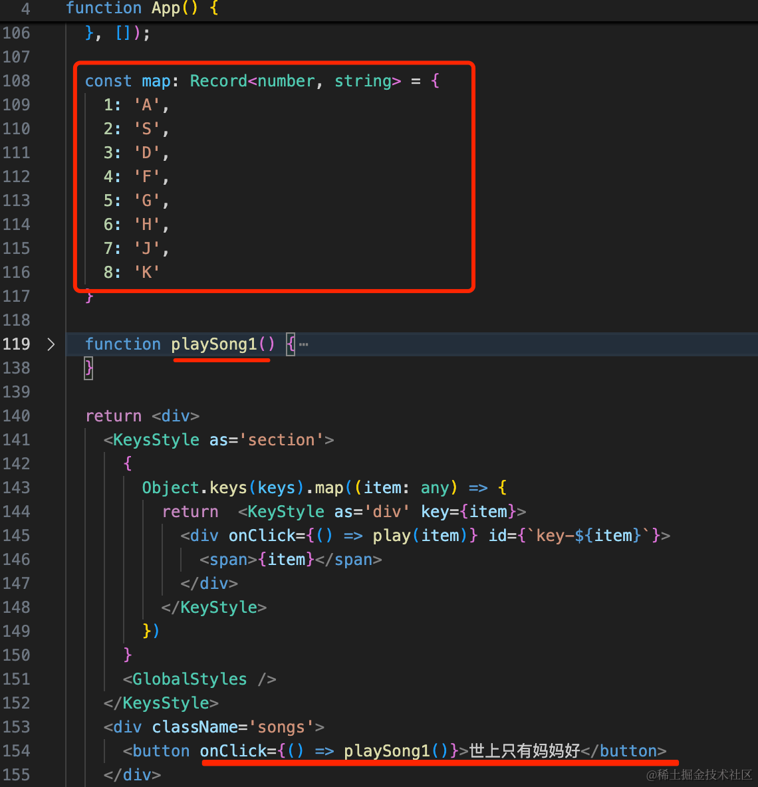


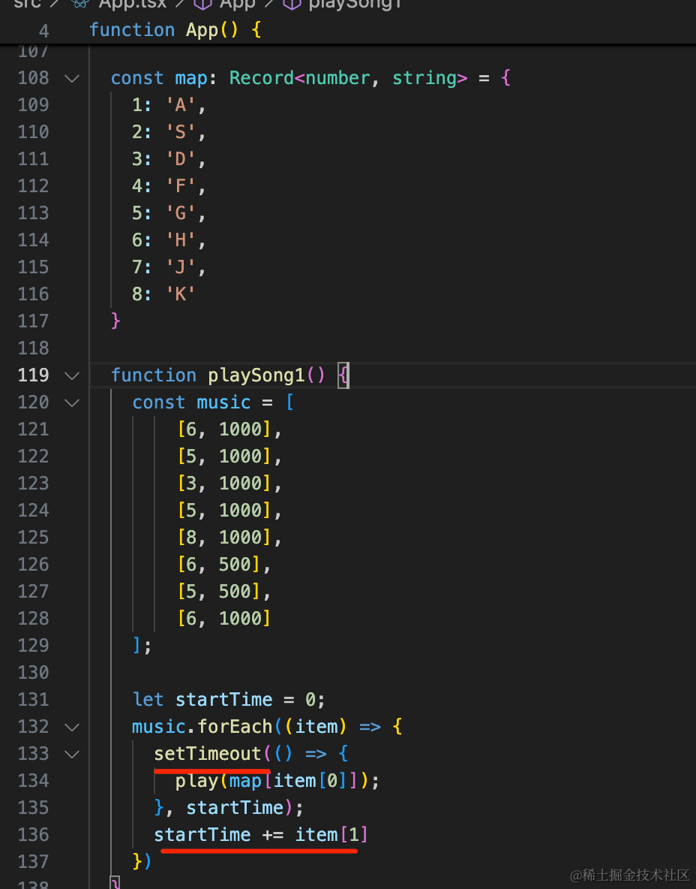

我们定义了简谱数字和键的对应关系。

然后不同的时间按下不同的键就可以了。

```javascript
import { useEffect, useMemo } from "react";
import { styled, createGlobalStyle, css } from "styled-components"

function App() {

  const keys: Record<string, { frequency: number }> = {
    A: {
      frequency: 196
    },
    S: {
      frequency: 220
    },
    D: {
      frequency: 246
    },
    F: {
      frequency: 261
    },
    G: {
      frequency: 293
    },
    H: {
      frequency: 329
    },
    J: {
      frequency: 349
    },
    K: {
      frequency: 392
    }
  }

  const GlobalStyles = createGlobalStyle`
    body {
      background: #000;
    }
    .pressed {
      background: #aaa;
    }
  `;


  const KeysStyle = styled.div`
    width: 800px;
    height: 400px;
    margin: 40px auto;

    display: flex;
    flex-direction: row;
    justify-content: space-between;
    overflow: hidden;
  `
  const textStyle = css`
    line-height: 500px;
    text-align: center;
    font-size: 50px;
  `

  const KeyStyle = styled.div`
    border: 4px solid black;
    background: #fff;
    flex: 1;
    ${textStyle}

    &:hover {
      background: #aaa;
    }
  `

  const context = useMemo(()=> {
    return new AudioContext();
  }, []);

  const play = (key: string) => {
    const frequency = keys[key]?.frequency;
    if(!frequency) {
      return;
    }

    const osc = context.createOscillator();
    osc.type = 'sine';
    osc.frequency.value = frequency;
  
    const gain = context.createGain();
    osc.connect(gain);
    gain.connect(context.destination);
  
    gain.gain.setValueAtTime(0, context.currentTime);
    gain.gain.linearRampToValueAtTime(1, context.currentTime + 0.01);

    osc.start(context.currentTime);
  
    gain.gain.exponentialRampToValueAtTime(0.001, context.currentTime + 1);
    osc.stop(context.currentTime + 1);

    document.getElementById(`key-${key}`)?.classList.add('pressed');
    setTimeout(()=> {
      document.getElementById(`key-${key}`)?.classList.remove('pressed');
    }, 100)
  }

  useEffect(()=> {
    document.addEventListener('keydown', (e) => {
      play(e.key.toUpperCase());
    })
  }, []);

  const map: Record<number, string> = {
    1: 'A',
    2: 'S',
    3: 'D',
    4: 'F',
    5: 'G',
    6: 'H',
    7: 'J',
    8: 'K'
  }

  function playSong1() {
    const music = [
        [6, 1000],
        [5, 1000],
        [3, 1000],
        [5, 1000],
        [8, 1000],
        [6, 500],
        [5, 500],
        [6, 1000]
    ];

    let startTime = 0;
    music.forEach((item) => {
      setTimeout(() => {
        play(map[item[0]]);
      }, startTime);
      startTime += item[1]
    })   
  }

  return <div>
    <KeysStyle as='section'>
      {
        Object.keys(keys).map((item: any) => {
          return  <KeyStyle as='div' key={item}>
            <div onClick={() => play(item)} id={`key-${item}`}>
              <span>{item}</span>
            </div>
          </KeyStyle>
        })
      }
      <GlobalStyles />
    </KeysStyle>
    <div className='songs'>
      <button onClick={() => playSong1()}>世上只有妈妈好</button>
    </div>
  </div>
}

export default App
```

听一下：


[jaudio](https://lf-activity-static.juejin.cn/obj/juejin-activity-static/user_book/2788017216685118_1725028699155_9504.mp3)

再加一首《奢香夫人》：

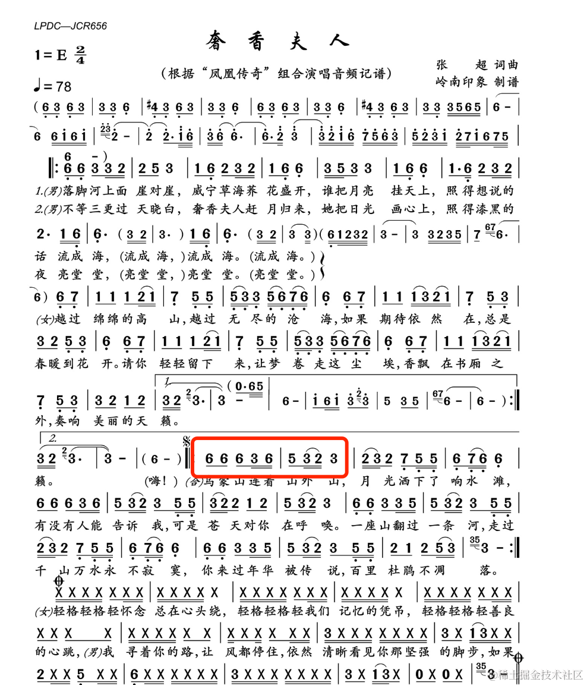

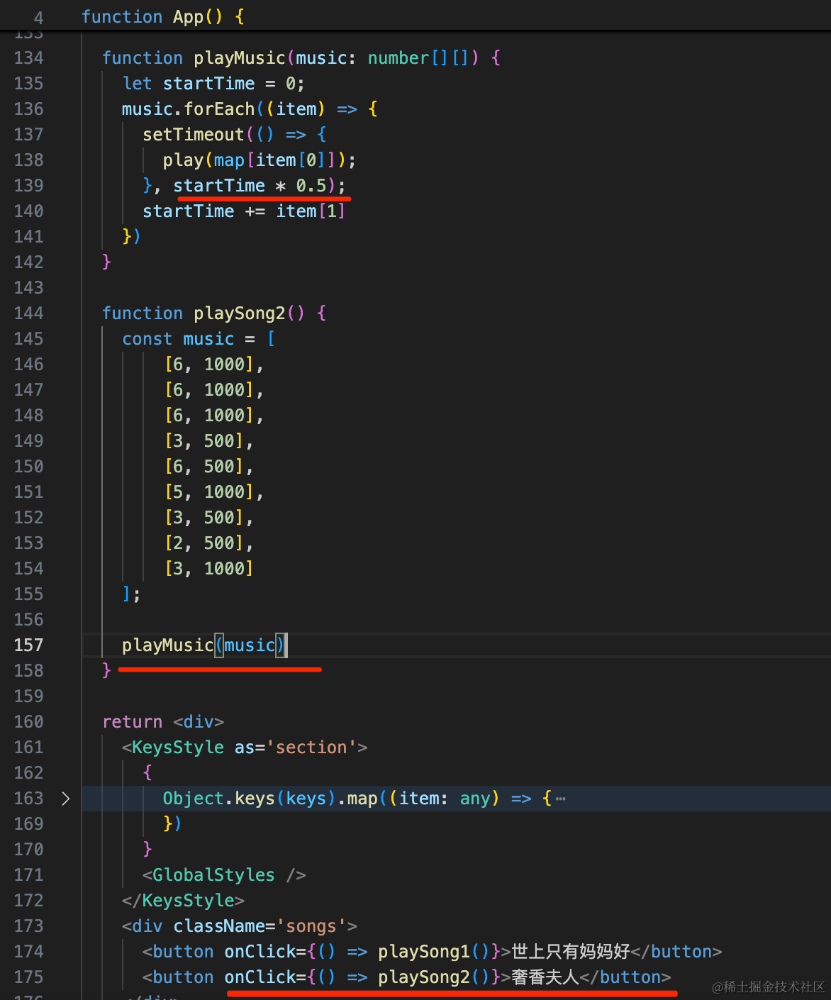

抽取一个 playMusic 的方法，并且 startTime 缩短一半。

```javascript
function playMusic(music: number[][]) {
    let startTime = 0;
    music.forEach((item) => {
      setTimeout(() => {
        play(map[item[0]]);
      }, startTime * 0.5);
      startTime += item[1]
    }) 
}

function playSong2() {
    const music = [
        [6, 1000],
        [6, 1000],
        [6, 1000],
        [3, 500],
        [6, 500],
        [5, 1000],
        [3, 500],
        [2, 500],
        [3, 1000]
    ];

    playMusic(music)
}
```

```javascript
<button onClick={() => playSong2()}>奢香夫人</button>
```

听一下：

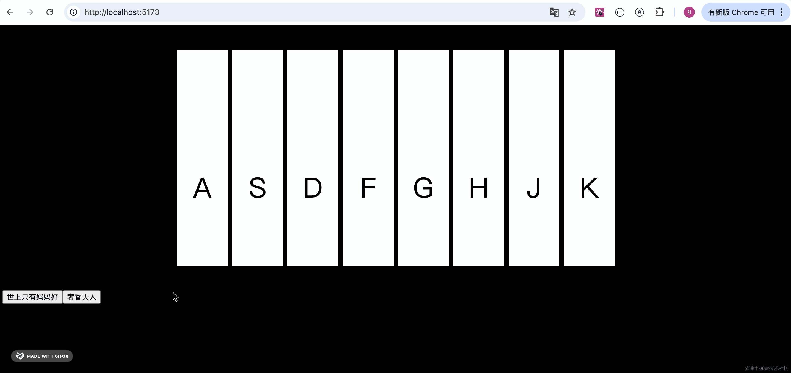

[jaudio](https://lf-activity-static.juejin.cn/obj/juejin-activity-static/user_book/2788017216685118_1725030624858_9137.mp3)

至此，我们的在线钢琴就完成了。

案例代码上传了[小册仓库](https://github.com/QuarkGluonPlasma/react-course-code/tree/main/online-piano)

## 总结

上节学了 AudioContext 的振荡器调音，这节我们基于 AudioContext 实现了一个在线钢琴。

不同键只是振动频率不同，然后按下的时候设置音量有个从小到大再到小的变化就好了。

我们用 styled-components 写的样式，它是通过组件的方式来使用某段样式。

我们监听了 keydown 事件，触发不同键的按下的处理。

然后根据简谱，通过不同 setTimeout 实现了乐曲的自动播放。

做完这个案例，我们会对 AudioContext 有更深的理解。
