# 第85章—React服务端渲染：从SSR到hydrate

SSR 是 Server Side Rendering，服务端渲染，服务端返回渲染出的 html，浏览器解析 html 来构建页面。

其实这是一项很古老的技术，很早之前服务端就是通过 JSP、PHP 等模版引擎，渲染填充数据的模版，产生 html 返回的。只不过这时候没有组件的概念。

有了组件之后再做服务端渲染就不一样了，你需要基于这些组件来填充数据，渲染出 html 返回。

并且在浏览器渲染出 html 后，还要把它关联到对应的组件上，添加交互逻辑和管理之后的渲染。

这时候的 SSR 服务只能是 Node.js 了，因为要服务端也要执行 JS 逻辑，也就是渲染组件。

可以看到，同样的组件在服务端渲染了一次，在客户端渲染了一次，这种可以在双端渲染的方式，叫做同构渲染。

比如这样一个组件：

```javascript
import { useState } from 'react';

export default function App() {
  return (
    <>
      <h1>Hello, world!</h1>
      <Counter />
    </>
  );
}

function Counter() {
  const [count, setCount] = useState(0);
  return (
    <button onClick={() => setCount(count + 1)}>
      You clicked me {count} times
    </button>
  );
}

```
在服务端渲染是这样的：
```javascript
import { renderToString } from 'react-dom/server';
import App from './App';

console.log(renderToString(<App/>));
```
结果如下：


当然，这里应该有个 http 的 server，把组件 renderToString 的结果拼接成 html 返回。这里省略了。

假设下面就是服务端返回的 SSR 出的 html：


现在浏览器接收到它后，要再次渲染：

```javascript
import React from 'react';
import { hydrateRoot } from 'react-dom/client';
import './index.css';
import App from './App';

hydrateRoot(document.getElementById('root'), <App/>);
```

注意，这里执行的不是 renderRoot 的 api，而是 hydrateRoot 的 api。

因为浏览器接收到 html 就会把它渲染出来，这时候已经有标签了，只需要把它和组件关联之后，就可以更新和绑定事件了。

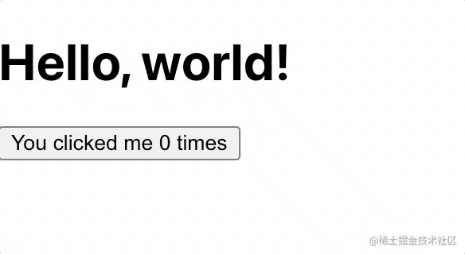

hydrate 会在渲染的过程中，不创建 html 标签，而是直接关联已有的。这样就避免了没必要的渲染。

这就是整个 SSR 的流程：

**服务端渲染组件为 string，拼接成 html 返回，浏览器渲染出返回的 html，然后执行 hydrate，把渲染和已有的 html 标签关联。**

那服务端是怎么 render 出字符串的，浏览器端又是怎么 hydrate 的呢？

我们分别来看一下：

其实服务端渲染就是拼接 html 的过程，组件和元素分别有不同的渲染逻辑：

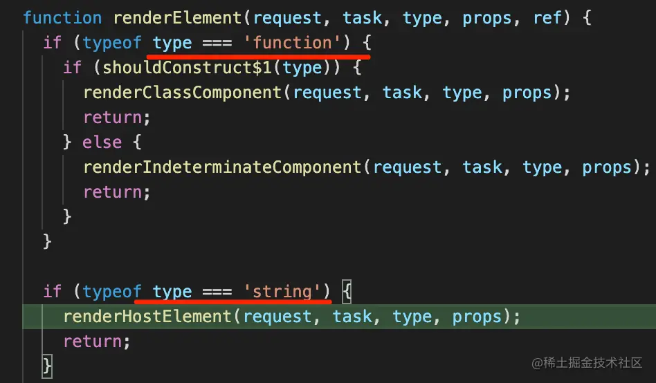

组件的话就传入参数执行：


元素的话就拼接字符串：

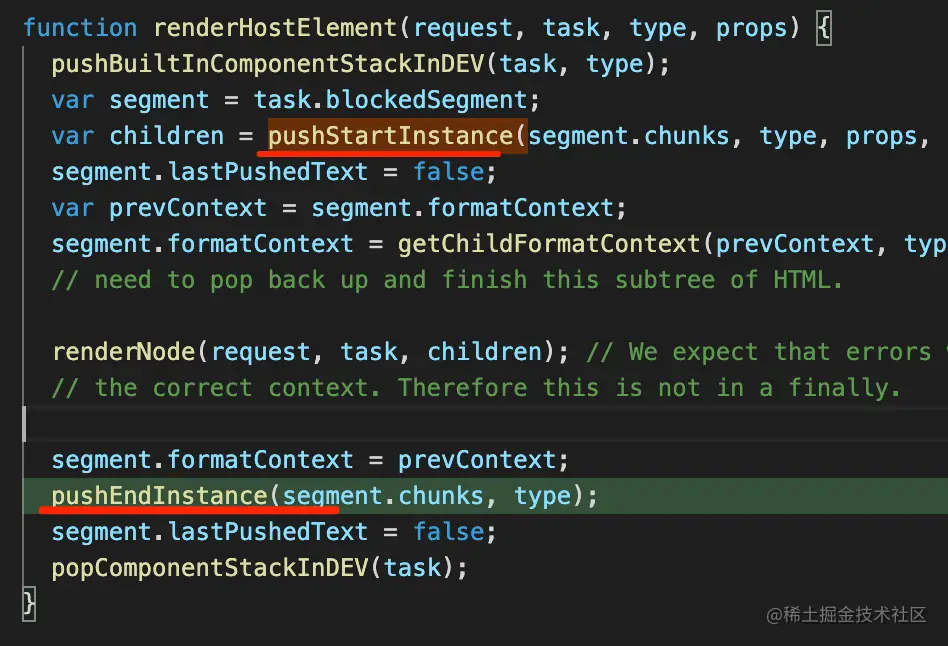
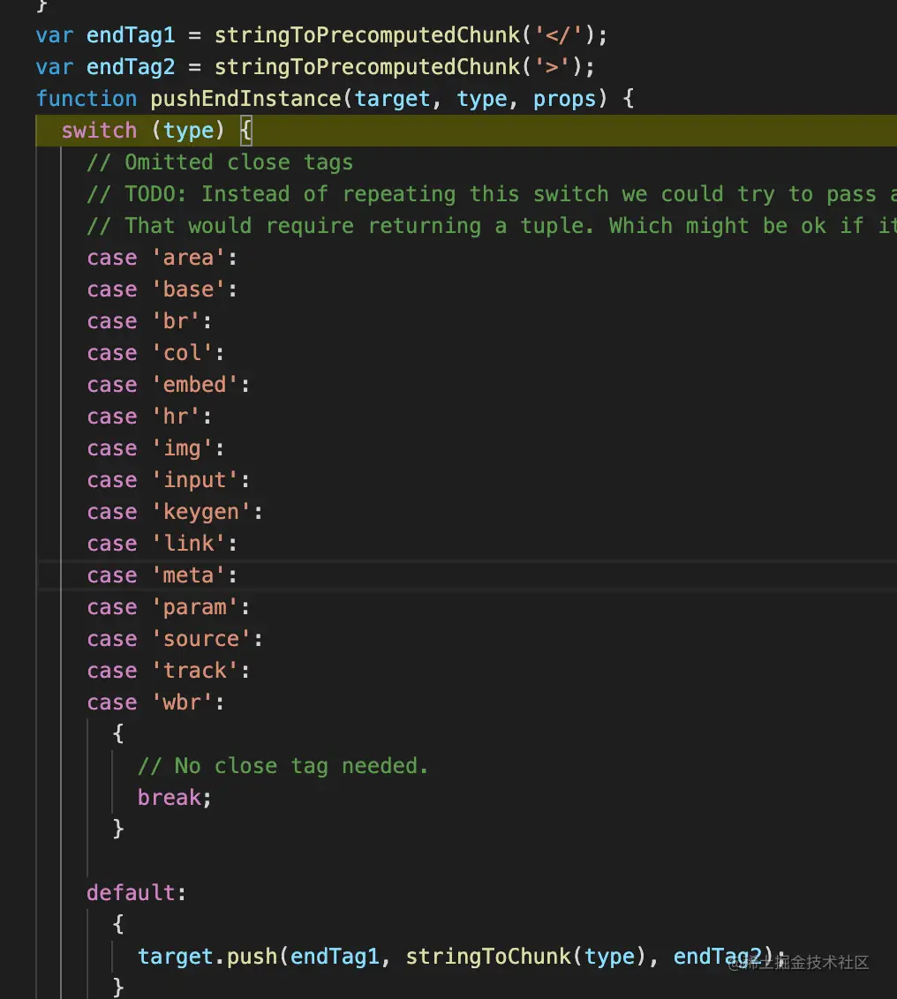

这样递归渲染一遍，结果就是字符串了：


服务端渲染的部分还是挺简单的，再来看客户端渲染的 hydrate 部分：

这里涉及到 react 的渲染流程，我们简单过一遍：

我们组件里写的这些是 jsx 代码：


它们编译后会变成类似 React.createElement 这种代码，叫做 render function。

render function 执行的结果是 React Element。

类似这样：

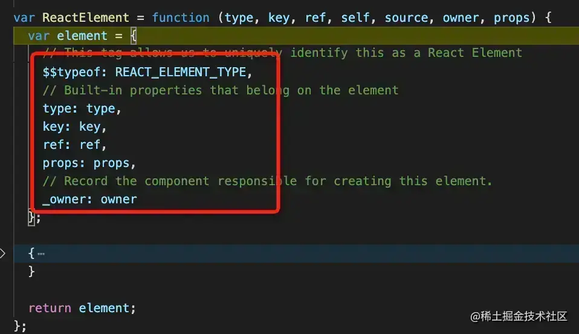

我们也经常把 React Element 叫做 vdom。

react 会把 vdom 转成 fiber 的结构，这个过程叫做 reconcile：

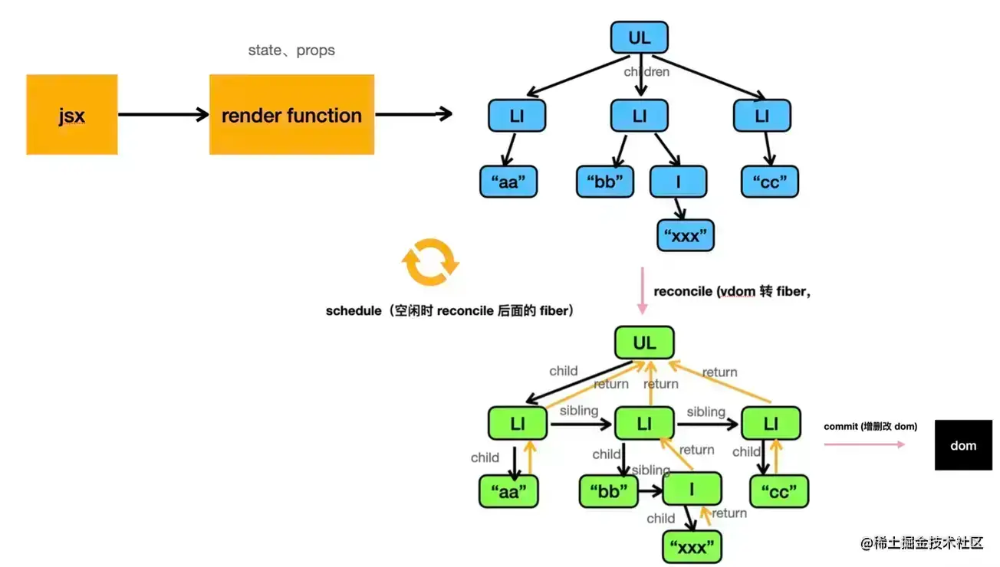

在这样的循环里，依次处理 vdom 转 fiber：

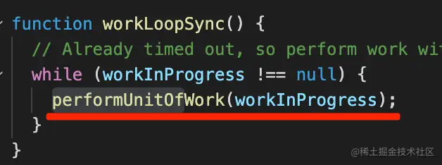

根据不同的类型，会做不同的处理：

这个处理分为两个阶段： beginWork 和 completeWork

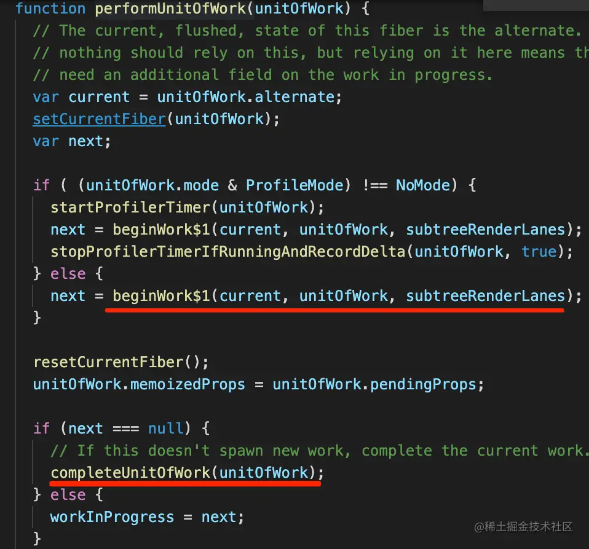

beginWork 里根据不同的 React Element（vdom）类型，做不同的处理：

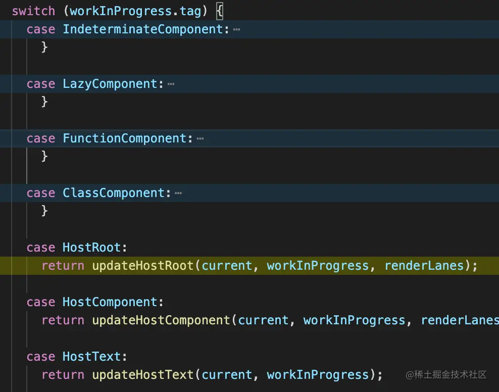

常见的几个，比如 FunctionComponent 是函数组件、ClassComponent 是类组件，而 HostComponent 是原生标签、HostText 是原生文本节点，HostRoot 是 fiber 树的根，是 reconcile 的处理入口。

依次处理不同 React Element 转 fiber，这是 beginWork 的部分。

转换完之后就到了 completeWork 的部分：

这个阶段也是按照不同 React Element 类型做的不同处理：

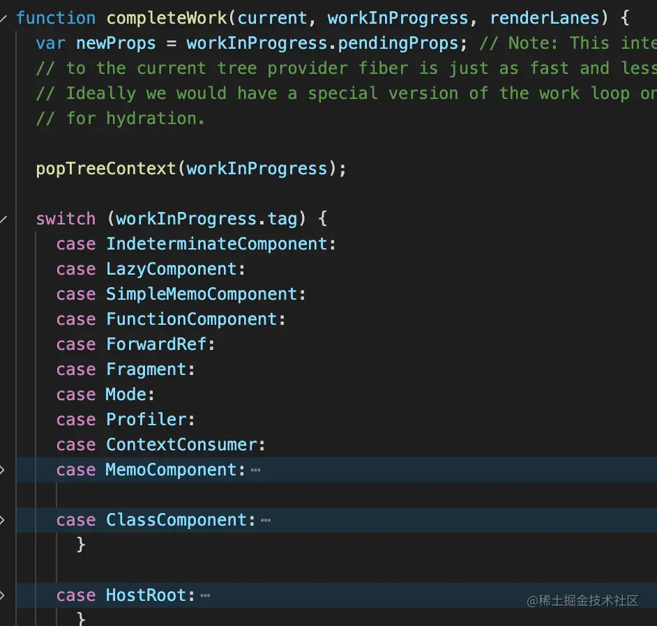

我们主要看 HostComponent 原生标签部分：
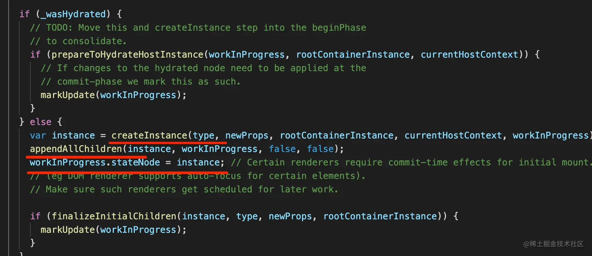

在这里做的事情就是创建元素、添加子元素、更新属性、然后把这个元素放到 fiber.stateNode 属性上。

因为 beginWork 的过程是从上往下的，而 completeWork 正好反过来，那就可以按顺序创建元素，组装成一个 dom 树。

小结一下：

**我们在组件里写的 jsx 会被编译成 render function，执行产生 vdom（React Element），经过 reconcile 的过程转为 fiber 树。**

**reconcile 的过程分为 beginWork 和 completeWork 两个阶段，beginWork 从上往下执行不同类型的 React Element 的渲染，而 completeWork 正好反过来，依次创建元素、更新属性，并组装起来。**

这里创建的元素是挂载在 fiber.stateNode 上的，并且 dom 元素上也记录着它关联的 fiber 节点：


那如果是 hydrate 呢？还需要创建新元素么？

明显是不用的，hydrate 会在 beginWork 的时候对比当前 dom 是不是可以复用，可以复用的话就直接放到 fiber.stateNode 上了。

首先，beginWork 会从 HostRoot （fiber 的根节点）开始处理：


hydrate 的时候会执行 enterHydrationState 函数：


在这里会开启 isHydrating 标记，并记录当前的 dom 节点，也就是 nextHydratableInstance。

找的顺序是先找到 firstChild，然后依次找 nextSibling，很明显，这是一个深度优先搜索的过程，一层层往下遍历：


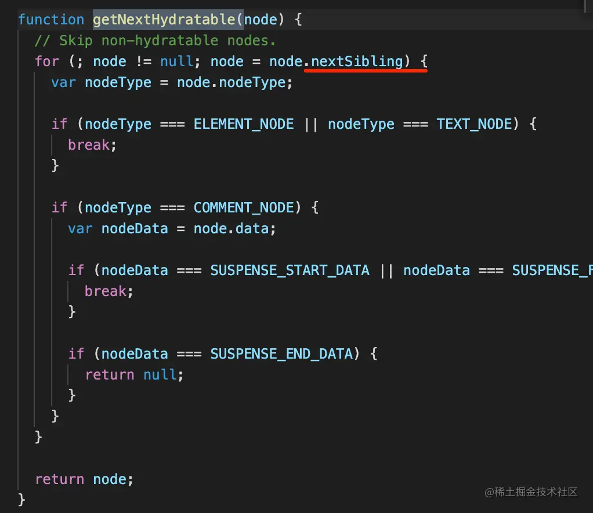

所以在我们这个案例里，最先找到的是 h1：

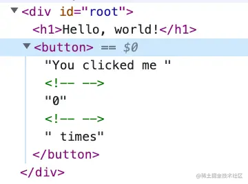


然后 reconcile 的过程中会处理到这个标签，也就是 HostComponent 类型：


这里因为 isHydrating 设置为 true 了，所以会进入 hydrate 逻辑：

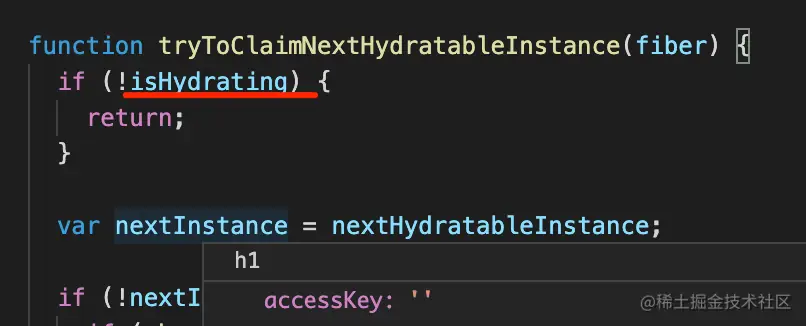

这是 nextInstance 就是 h1 标签。

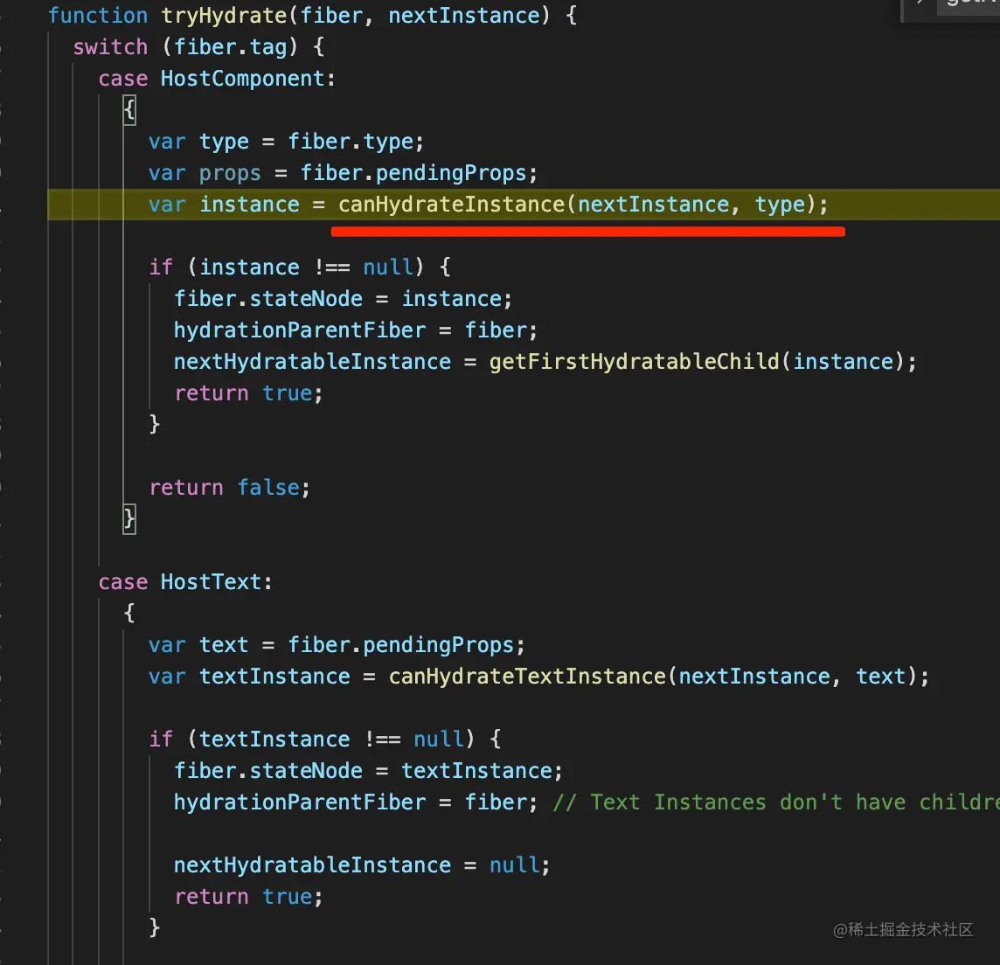

这里是否可以 hydrate 的逻辑很简单：

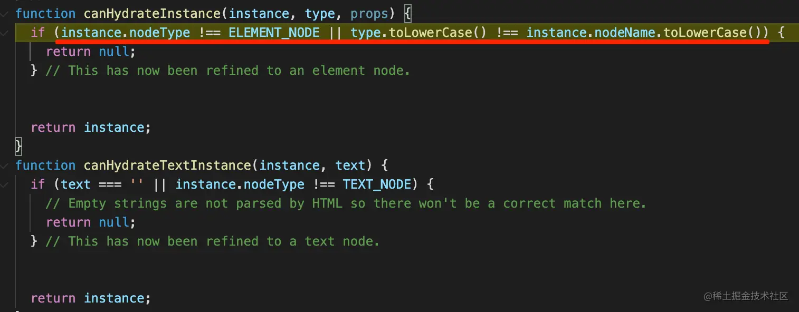

如果标签名一样就可以 hydrate，也就是直接复用。

把它设置到 fiber.stateNode 上：

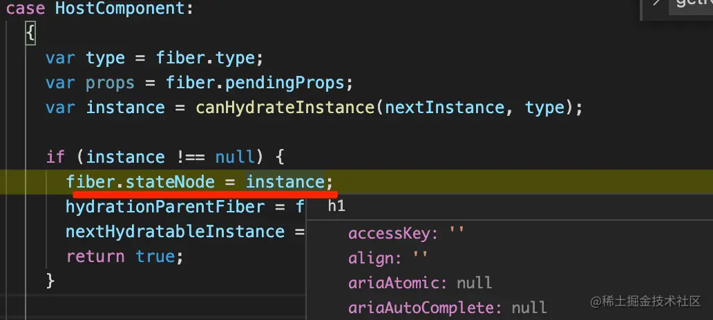

然后找下一个可以 hydrate 的 dom 节点，就找到了文本节点：

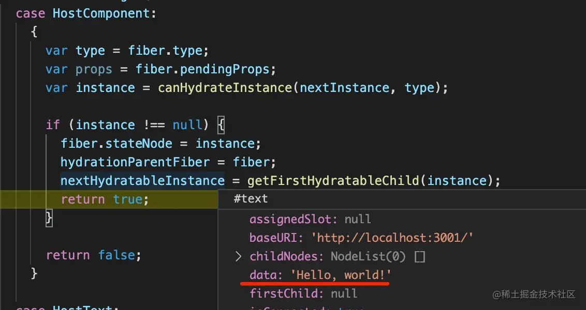

这样在 beginWork 的过程中依次 hydrate，就把 dom 和对应的 fiber 关联了起来。

然后在 completeWork 的时候，就不用再走创建标签的逻辑，因为 dom 已经有了，就可以跳过这部分。

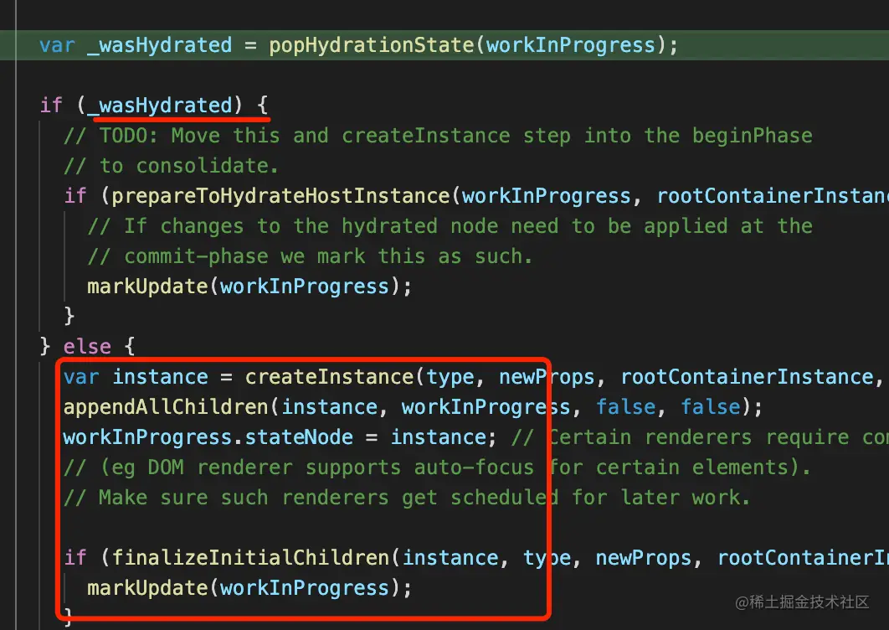

这就是 hydrate 的原理。

fiber 树创建成功之后，之后的再次渲染就和客户端渲染没有区别了。

这样我们就把 SSR 从 renderToString 到 hydrate 的流程给串联了起来。

## 总结

SSR 是 JSP、PHP 时代就存在的古老的技术，只不过之前是通过模版引擎，而现在是通过 node 服务渲染组件成字符串，客户端再次渲染，这种叫做同构渲染的模式。

React SSR 是服务端通过 renderToString 把组件树渲染成 html 字符串，浏览器通过 hydrate 把已有的 dom 关联到 fiber 树，加上交互逻辑和再次渲染。

服务端 renderToString 就是递归拼接字符串的过程，遇到组件会传入参数执行，遇到标签会拼接对应的字符串，最终返回一段 html 给浏览器。

浏览器端 hydrate 是在 reconcile 的 beginWork 阶段，依次判断 dom 是否可以复用到当前 fiber，可以的话就设置到 fiber.stateNode，然后在 completeWork 阶段就可以跳过节点的创建。

这就是 React SSR 从服务端的 renderToString 到浏览器端的 hydrate 的全流程的原理。
