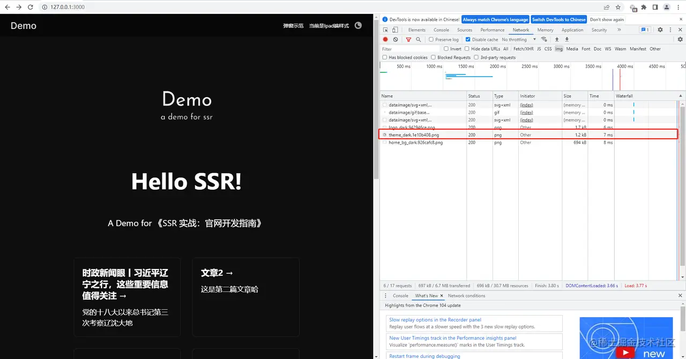
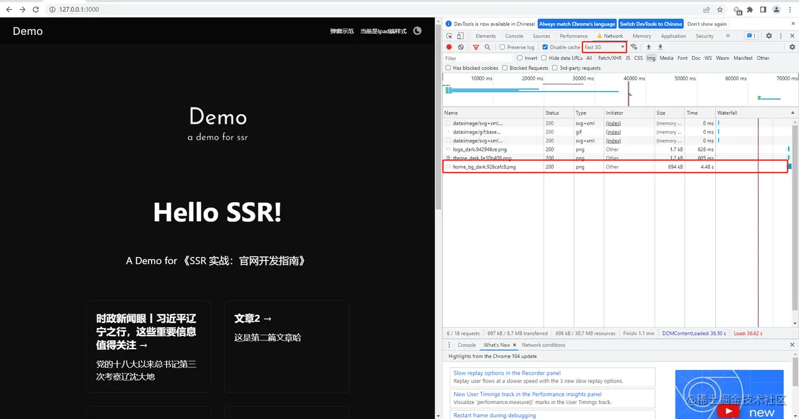
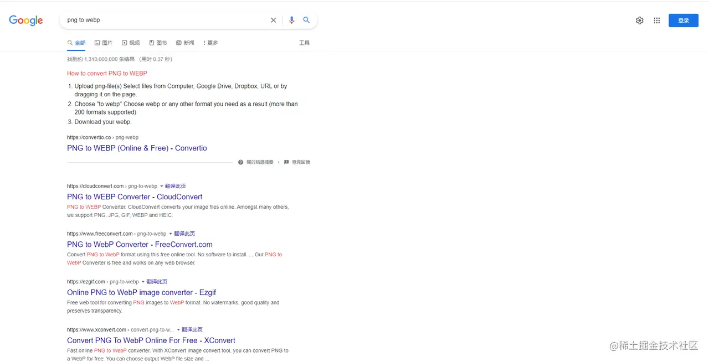
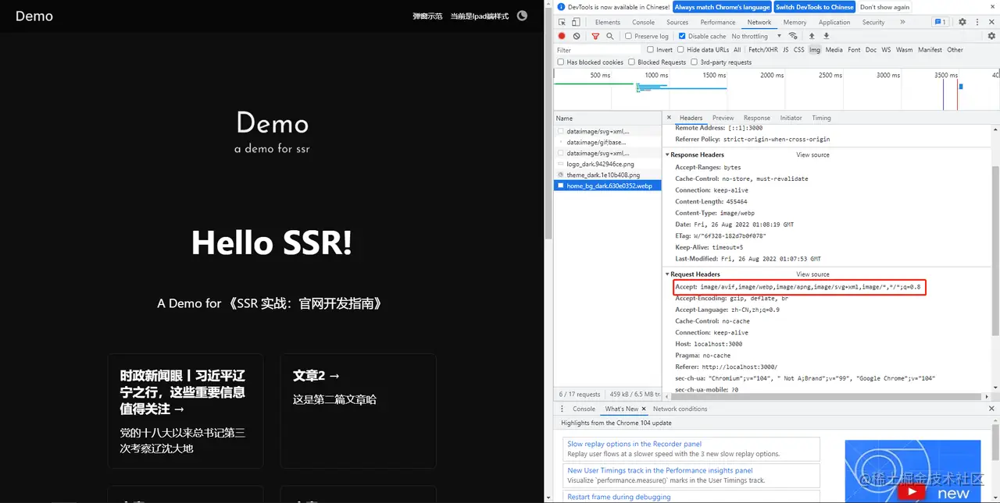
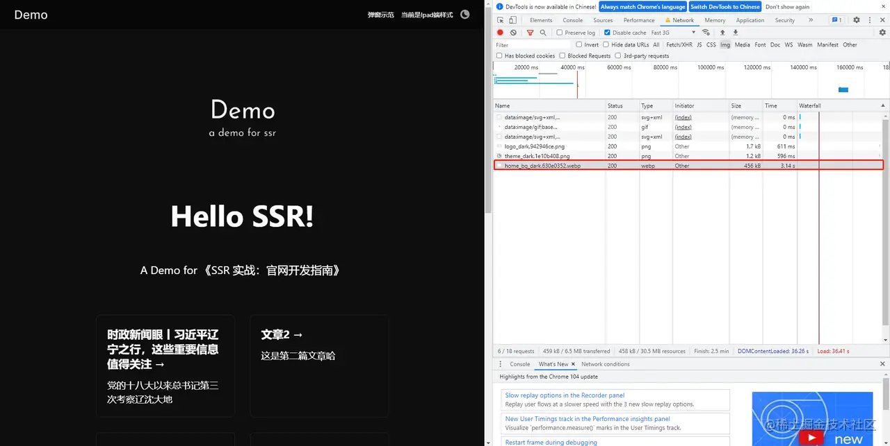

# 15.首屏优化_ 针对大图低网速加载场景的首屏优化方案

> 仓库地址： https://github.com/czm1290433700/nextjs-demo

前几节课我们针对官网的常见需求进行了学习，包括主题化、多媒体适配、动画、分页、组件实现等，相信大家后面面对官网的常见需求，都会有自己的思路，同时我们的官网现在也已经实现了大部分功能，麻雀虽小五脏俱全。从这节课开始，我们将开始学习性能优化篇，针对一些常见性能优化问题展开学习。

官网需求的交互中，通常会有一些高分辨率图片用于展示，这些图片通常体积大、加载时间长，且占页面区域较大，如果在网速较快的情况下可能尚可，但是在低网速，类似 fast 3G， slow 3G 的场景下，几百 kb，甚至几 mb 的图片资源加载是难以忍受的，加上区域大，很可能会出现页面内容已经加载完成，但是图片区域长时间留白的问题。这节课我们将一起讨论下，高分辨率图在低网速下加载时，应该如何减少加载时间，达到首屏优化的目的。

## 静态样式

首先我们先切两个大图，加在首页的位置，大小控制在 500kb 上下的清晰度（500px * 500px 2x) 即可，这种在快速 3g 的网速下，通常需要请求几十秒左右可以完全加载，可以用来说明我们这个场景。

```
// ./pages/global.scss
html[data-theme="dark"] {
  --home-background-icon: url("../public/home_bg_dark.png");
}

html[data-theme="light"] {
  --home-background-icon: url("../public/home_bg_light.png");
}
```

```
// ./pages/index.tsx
// ...
<div className={styles.header}></div>
```

```
// ./pages/index.module.scss
.header {
      background-image: var(--home-background-icon);
      background-size: 18.75rem 18.75rem;
      background-repeat: no-repeat;
      width: 18.75rem;
      height: 18.75rem;
    }
```

样式最后是这样的，图片的大小大致在 700kb， 正常 4g 网络下的加载时长为 7ms 左右。




我们把网速切换至 fast 3g，看看这个图片的加载时长需要多久。




可以看到需要 4s，远远超过其他的静态资源，这意味着我们页面元素加载出来后，用户需要再等好几秒图片才能缓缓加载出来，虽然现在低网速用户群体不多，但我们还是要考虑一下怎么做。针对这个问题，我在实际业务开发中有尝试过几个方案，在这里和大家分享讨论一下。

## navigator.connection.effectiveType

> The `effectiveType` read-only property of the `NetworkInformation` interface returns the effective type of the connection meaning one of 'slow-2g', '2g', '3g', or '4g'. This value is determined using a combination of recently observed, round-trip time and downlink values.

这是 [MDN 2020年 网络信息接口提案](https://wicg.github.io/netinfo/)中提出的最新 BOM 属性，我们可以通过这个 BOM 来获取当前的流量状态，根据不同的流量状态进行图片清晰度的选择，在较低网速下的场景，我们可以选择优先加载 0.5x 或是 1x 的图片，同时我们也加载 2x 的大图，通过隐藏 DOM 的方式隐性加载，然后监听 2x 资源的 onload 事件，在资源加载完成时，进行类的切换即可。


**这种方案在低网速下的效果是所有方案中最好的**，用户的感知视角是，他只需要等待 0.5x 到 1x 的模糊图加载时长，不会有区域的大面积留白，同时最后也可以体验到高清图的交互。

不过这种方案毕竟还是一个实验性属性，兼容性各方面并不是很好，只有较少的浏览器支持这个属性，大家可以看下面 MDN 中显示已支持的浏览器类型。


可以看到在 IOS 上这个属性都还不支持，所以我们不采用这个方案，等过段时间如果成为了正式属性，我是更推荐大家用这种方式根据实际场景进行优化的。感兴趣的同学可以下来自己尝试一下，还是挺有意思的，思路参照上面的就可。需要注意的有两点：

-   考虑到兼容性问题，navigator.connection.effectiveType 的使用需要进行判空处理，避免因为 ` navigator.connection is not defined  `的报错阻塞页面渲染，可以写成`navigator?.connection?.effectiveType`来进行调用。

<!---->

-   因为是 BOM，在前面的实现篇、需求进阶篇等课程中，我们多次提到因为同构的原理，我们的模板页面会同时执行在服务器端和客户端，在服务器端是没有 BOM 等属性的注入的，如果是在 hook 以外的地方调用，我们需要对第一个元素进行判空，采用`typeof navigator !== "undefined" && navigator?.connection?.effectiveType`的方式调用。

## responsive images / picture

浏览器有提供响应式图片的能力，分别是 img srcset 和 picture，它们都支持根据不同的像素场景自动选取不同的元素来进行适配，下面是两个 MDN 的使用例子。

```
// img srcset

// picture
<picture>
    <source srcset="/media/cc0-images/surfer-240-200.jpg"
            media="(min-width: 800px)">
    
</picture>
```

> img srcset 直接根据像素比来选取适合的静态资源加载，而对于 picture, [user agent](https://developer.mozilla.org/zh-CN/docs/Glossary/User_agent) 会检查每个 `<source>` 的 `srcset`、`media` 和 `type` 属性，来选择最匹配页面当前布局、显示设备特征等的兼容图像。

这种方案兼容性很强，不过缺陷也很明显，针对 PC 端的确是需要高清图且低网速的场景，它没办法做任何处理。且如果在低像素场景下，低分辨率的图也没办法满足需求时，这个方案也是束手无策的，它的本质还是根据不同页宽来调整资源的分辨率，没办法改变高分辨率资源加载时间长的现状。

不过这两种方案在 C 端中也有广泛的应用，对于多媒体设备，可以针对不同页宽设备选取不同分辨率的资源，对性能也是有很大提高的，同学们感兴趣可以下来尝试一下。

## webp

> WebP is a modern **image format** that provides superior **lossless and lossy** compression for images on the web. Using WebP, webmasters and web developers can create smaller, richer images that make the web faster.

Webp 是谷歌推出的一种新的格式，简单来说，它可以通过 jpg、 png 等主流资源格式转换，达到无损画质的效果，并且相比正常的图片资源，压缩体积会减少到 40% 以上，大量主流浏览器已经支持了webp，并且最近 IOS14 及以上设备的 safari 浏览器也已经新增对 webp 的支持，只有少部分 IOS 低版本还不兼容。**这是我比较推荐大家使用的方案**，我们以我们的 demo 官网项目为例试验一下。

首先，我们针对静态样式部分的资源进行 webp 相关的转换，转换的方式很简单，大家可以在 google 上搜索 png to webp，有很多开源免费的转换器可以帮助我们进行资源的转换。




资源压缩后，我们可以看到 webp 对应的大小为 456kb，相比当初的 700kb 减少了近 40%，接下来我们把它加到代码中，试验一下 3g 场景下实际加载的时间可以优化多少。


```
// ./pages/global.scss
html[data-theme="dark"] {
  // ...
  --home-background-icon-webp: url("../public/home_bg_dark.webp");
}

html[data-theme="light"] {
  // ...
  --home-background-icon-webp: url("../public/home_bg_light.webp");
}
```

因为一些浏览器还不支持 webp， 所以我们需要对它的兼容性进行判断，在资源请求的请求头 accept 字段中，包含了当前浏览器所支持的静态资源类型，我们可以通过这个字段来进行判断。




```
// ./utils/index.ts
export const getIsSupportWebp = (context: AppContext) => {
  const { headers = {} } = context.ctx.req || {};
  return headers.accept?.includes("image/webp");
};
```

我们可以在 _app.tsx 中对所有的组件进行 isSupportWebp 的注入，这样我们每个页面模板都可以拿到这个字段。

```
// ./pages/_app.tsx
import type { AppProps, AppContext } from "next/app";
import App from "next/app";
import { Layout, ILayoutProps } from "@/components/layout";
import Head from "next/head";
import axios from "axios";
import { getIsMobile, getIsSupportWebp, LOCALDOMAIN } from "@/utils";
import { ThemeContextProvider } from "@/stores/theme";
import { UserAgentProvider } from "@/stores/userAgent";
import { LanguageContextProvider } from "@/stores/language";
import "./global.scss";

export interface IComponentProps {
  isMobile?: boolean;
  isSupportWebp?: boolean;
}

const MyApp = (
  data: AppProps & ILayoutProps & { isMobile: boolean; isSupportWebp: boolean }
) => {
  const {
    Component,
    pageProps,
    navbarData,
    footerData,
    isMobile,
    isSupportWebp,
  } = data;

  return (
    <div>
      <Head>
        <title>{`A Demo for 《SSR 实战：官网开发指南》(${
          isMobile ? "移动端" : "pc端"
        })`}</title>
        <meta
          name="description"
          content={`A Demo for 《SSR 实战：官网开发指南》(${
            isMobile ? "移动端" : "pc端"
          })`}
        />
        <link rel="icon" href="/favicon.ico" />
      </Head>
      <LanguageContextProvider>
        <ThemeContextProvider>
          <UserAgentProvider>
            <Layout navbarData={navbarData} footerData={footerData}>
              <Component
                {...pageProps}
                isMobile={isMobile}
                isSupportWebp={isSupportWebp}
              />
            </Layout>
          </UserAgentProvider>
        </ThemeContextProvider>
      </LanguageContextProvider>
    </div>
  );
};

MyApp.getInitialProps = async (context: AppContext) => {
  const pageProps = await App.getInitialProps(context);
  const { data = {} } = await axios.get(`${LOCALDOMAIN}/api/layout`);

  return {
    ...pageProps,
    ...data,
    isMobile: getIsMobile(context),
    isSupportWebp: getIsSupportWebp(context),
  };
};

export default MyApp;
```

接下来我们只需要在 index.tsx 中引入对应的 webp 资源就可以了。

```
import type { NextPage } from "next";
import styles from "./index.module.scss";
import cName from "classnames";
import { useContext, useEffect, useRef, useState } from "react";
import { ThemeContext } from "@/stores/theme";
import { Pagination } from "@douyinfe/semi-ui";
import axios from "axios";
import { LOCALDOMAIN } from "@/utils";
import { IArticleIntro } from "./api/articleIntro";
import App from "next/app";
import { IComponentProps } from "./_app";

interface IProps {
  title: string;
  description: string;
  articles: {
    list: {
      label: string;
      info: string;
      link: string;
    }[];
    total: number;
  };
}

const Home: NextPage<IProps & IComponentProps> = ({
  title,
  description,
  articles,
  isSupportWebp,
}) => {
  const [content, setContent] = useState(articles);
  const mainRef = useRef<HTMLDivElement>(null);
  const { theme } = useContext(ThemeContext);

  useEffect(() => {
    mainRef.current?.classList.remove(styles.withAnimation);
    window.requestAnimationFrame(() => {
      mainRef.current?.classList.add(styles.withAnimation);
    });
  }, [theme]);

  return (
    <div className={styles.container}>
      <main
        className={cName([styles.main, styles.withAnimation])}
        ref={mainRef}
      >
        <div
          className={cName({
            [styles.header]: true,
            [styles.headerWebp]: isSupportWebp,
          })}
        ></div>
        <h1 className={styles.title}>{title}</h1>
        <p className={styles.description}>{description}</p>

        <div className={styles.grid}>
          {content?.list?.map((item, index) => {
            return (
              <div
                key={index}
                className={styles.card}
                onClick={(): void => {
                  window.open(
                    item.link,
                    "blank",
                    "noopener=yes,noreferrer=yes"
                  );
                }}
              >
                <h2>{item.label} &rarr;</h2>
                <p>{item.info}</p>
              </div>
            );
          })}
          <div className={styles.paginationArea}>
            <Pagination
              total={content?.total}
              pageSize={6}
              onPageChange={(pageNo) => {
                axios
                  .post(`${LOCALDOMAIN}/api/articleIntro`, {
                    pageNo,
                    pageSize: 6,
                  })
                  .then(({ data }) => {
                    setContent({
                      list: data.list.map((item: IArticleIntro) => {
                        return {
                          label: item.label,
                          info: item.info,
                          link: `${LOCALDOMAIN}/article/${item.articleId}`,
                        };
                      }),
                      total: data.total,
                    });
                  });
              }}
            />
          </div>
        </div>
      </main>
    </div>
  );
};

Home.getInitialProps = async (context) => {
  const { data: homeData } = await axios.get(`${LOCALDOMAIN}/api/home`);
  const { data: articleData } = await axios.post(
    `${LOCALDOMAIN}/api/articleIntro`,
    {
      pageNo: 1,
      pageSize: 6,
    }
  );

  return {
    title: homeData.title,
    description: homeData.description,
    articles: {
      list: articleData.list.map((item: IArticleIntro) => {
        return {
          label: item.label,
          info: item.info,
          link: `${LOCALDOMAIN}/article/${item.articleId}`,
        };
      }),
      total: articleData.total,
    },
  };
};

export default Home;
```

```
// ./pages/index.module.scss
// ...
.headerWebp {
  background-image: var(--home-background-icon-webp);
}
```

然后我们来看看效果，fast 3g 下对应资源的加载时间 从 4s 减少到了 3s，优化了近 25%！




## webp 的小彩蛋

同学们可能对 webp 的原理并不清楚，这里值得一提的是，为什么 webp 可以在保证无损画质的前提下，缩小这么多体积呢？很有意思的一件事是，当处于极快网速的情况下，**webp 相比同画质的 png 的加载时间反而会更长**，即使它相比其他类型的资源，体积上缩小了整整 40% 以上。为什么会有这样的现象呢？

webp 的低体积并不是毫无代价的，webp 在压缩过程中进行了分块、帧内预测、量化等操作，这些操作是减少 webp 体积的核心原因，不过作为交换的是，相比 jpg、 png 等资源，它具备更长的解析时长，不过这个是不受网速等影响的，因为是浏览器内置的能力。

所以这也是为什么在极快网速的情况下，webp 的加载时间有时会呈现为负优化的原因，因为减少的资源请求时间不足够抵消掉额外的解析时间，不过这个时间差值并不长，几毫秒在用户体验的过程中是无伤大雅的。

但是在低网速的场景下，这个优化比例是极高的，因为 40% 的体积大小，对于低网速场景下，请求时间将会是质的提高，相比之下，几毫秒的解析时长就无关紧要了。上面我们测试的是 fast 3g，同学们可以下来试试 slow 3g 的效果，随着网络质量的变差，这个优化会更加显著！

## 小结

这一节课我们学习了怎么针对低网速场景对高分辨率图片进行首屏优化，我们分别对比了navigator.connection.effectiveType、 responsive images / picture 和 webp 三种方案。

其中 navigator.connection.effectiveType 仍然处于 MDN 提案试验属性的阶段，兼容性不高，虽然效果很理想，但是并不建议大家使用。

responsive images / picture 可以针对不同页宽的图片选取不同的资源，在 C 端优化中有广泛的使用，但是并不能解决我们低网速高分辨率加载时间长的痛点。

最推荐大家使用的是 google 推出的一个新的格式 webp，虽然仍然未适配所有的浏览器，但是主流的浏览器和 IOS 高版本浏览器都已经支持了这个方案，它通过更细致的解析，可以大幅度减少同画质资源的体积，虽然会有相对更多一些的解析时长，但是在低网速场景，优化的体积可以大幅度地减少加载时间，从而优化首屏，随着网络质量的变差，这个优化会更加显著。

IOS 是我们站点一种常用的设备类型，相比安卓和 PC 等浏览器，它具备更多自己的特性，我们实际开发中往往需要兼容这些场景。下一节课我们将来探讨，针对 IOS 常见的橡皮筋和 300ms delay 问题，我们可以怎么去优化解决。