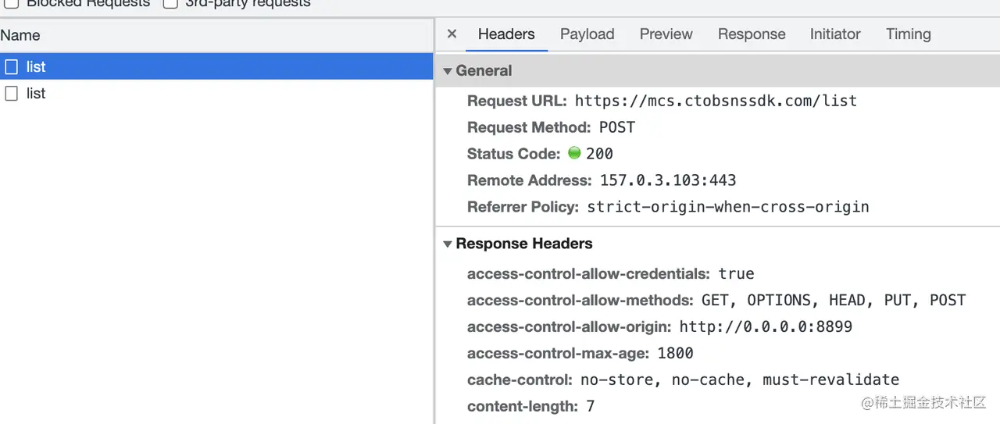
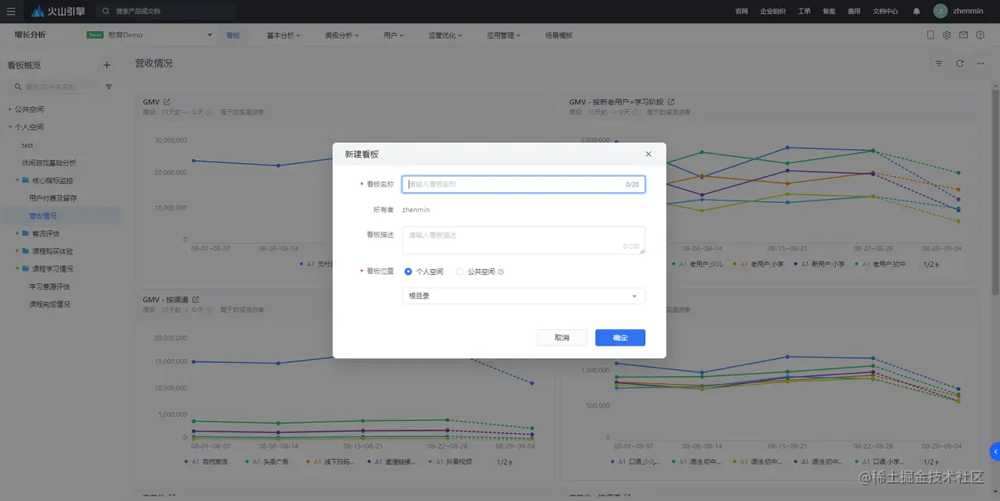
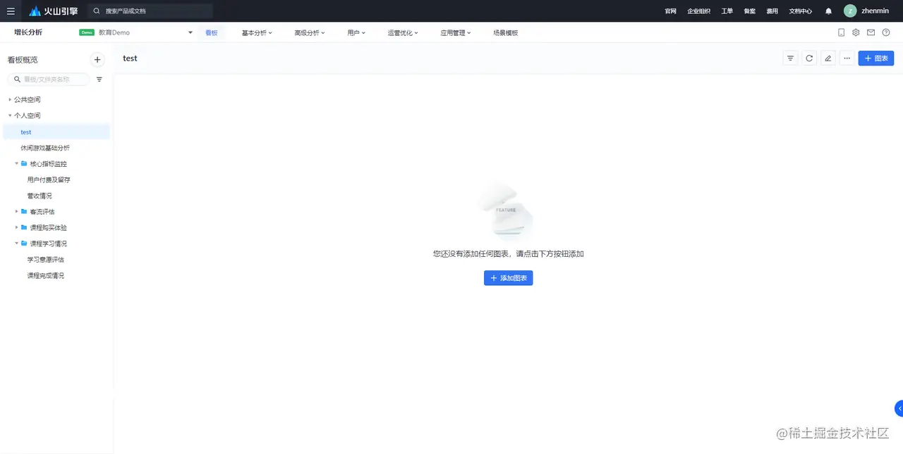
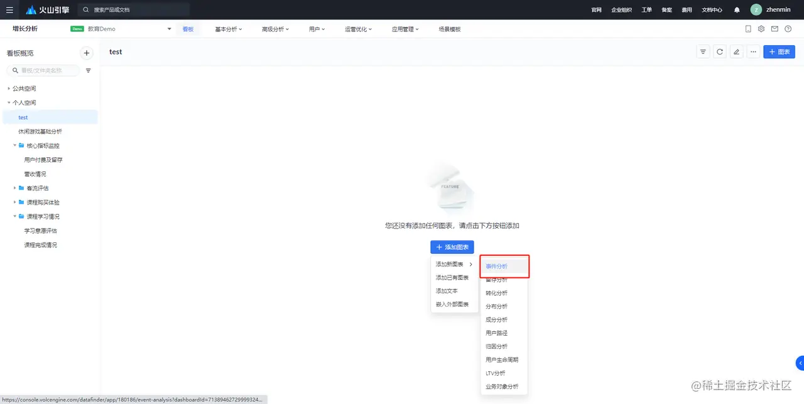
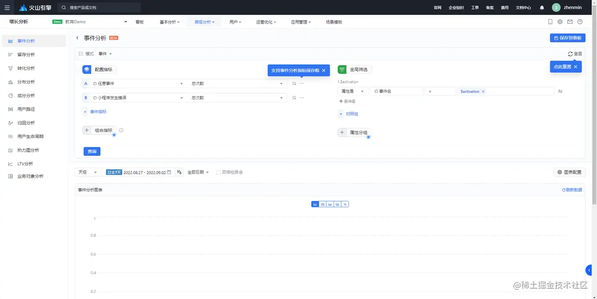
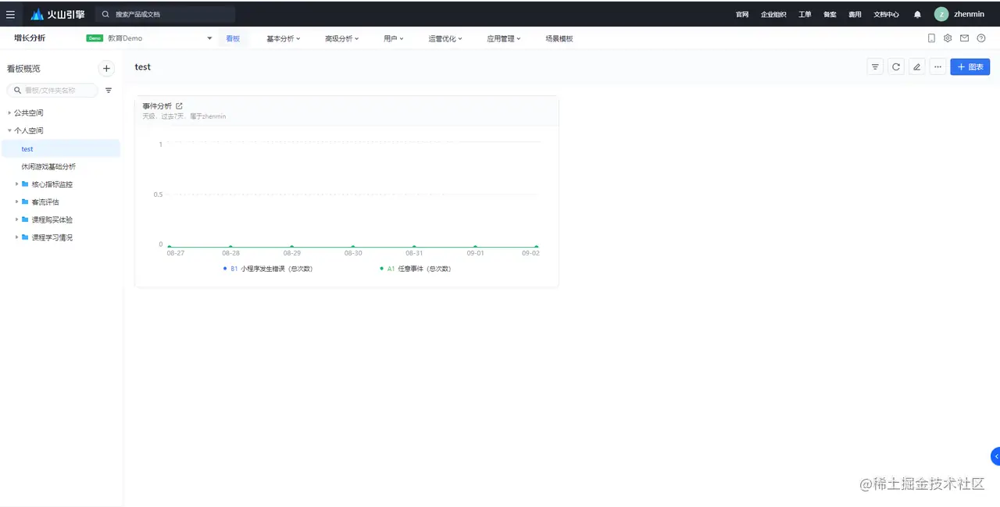

# 18.数据埋点：用户数据的上报统计分析

> 仓库地址： https://github.com/czm1290433700/nextjs-demo

上一节课，我们学习了怎么对官网应用进行上线前的压力测试，从兼容性、配置难度、上手习惯和数据结构多个方面对比了 WebBench、wrk 和 autocannon 三种方案，最终选用了 autucannon 进行应用的压力测试。它是一款基于 nodejs 实现编写的 HTTP/1.1 基准测试工具，而且兼容 Windows， Mac 和 Linux 的 环境，使用轻量，且更符合前端的开发习惯。这节课我们来学习一个部署中同样重要的阶段，数据埋点。

## 为什么要做数据埋点？

数据埋点是什么？简单来说，它是一种用户数据采集和上报的步骤，例如像收集用户访问、用户在页面中的一些操作等，收集这些数据是为了对站点整体状况进行分析。比如产品新上线了一个需求，怎么去判断这个需求是不是正向收益，用户对新功能更关注的点，更频繁使用的内容是哪些，从而来优化产品的方案和做出下一步的决策。可以说，数据埋点是一个C 端站点必不可少的能力，是对产品功能查漏补缺的重要手段。

埋点这么重要，那么这些用户数据是怎么上报上去的呢？这里我们需要了解“埋点事件”的概念，通常业内会把埋点事件分成全埋点、代码埋点、可视化埋点这三类，这个只是埋点内部的实现划分而已，大家并不需要太关注，可以简单把事件理解成一个 key - value 的 map，通过定义唯一的事件 key，上报对应 key 所需要的事件数据，最后汇总这些数据进行一些分析，这就是埋点事件最基础的原理了。

## 怎么进行数据埋点？

业内有很多自研的数据埋点平台可以供大家选择，当然都是要收费的=、=。比如百度统计（原来免费，现在事件分析的部分也收敛作为付费内容了），因为埋点平台通常是一整套的数据相关的解决方案，不仅是提供埋点能力，还涵括有数据分析、爬虫检测、A/B实验、反转实验等来提供更精准的用户分析，这些如果自研需要消耗很大的人力成本和时间成本，所以大多是要收费的，往往只提供一些基础的免费能力。

这边给大家推荐一个我们字节内部（包括在火山引擎中）在用的解决方案，我也有特意提 oncall 问过相关的 pm 同学，最近有推出一个[火种计划](https://www.volcengine.com/activity/data1)，中小型企业认证完可以免费使用 12 个月（不是推销，的确暂时没有更合适的开源免费方案0.0）。


### 如何接入埋点？

因为我们是客户端 Web 埋点，所以我们直接引用它的 web js sdk 即可，之前我们有介绍过 nextjs 中，我们可以在 pages 目录下的 _documents 文件（模板文件）中引入对应的外部脚本，我们来做一下下面的初始化配置。

需要注意的是，这个初始化配置分为 SaaS 版本和私有化版本，对于 SaaS 版本，就是使用火山引擎（也就是字节的 cdn 服务器）来存储对应的部署数据，详细区别大家可以参照[开发者文档](https://www.volcengine.com/docs/6285/93209)，SaaS 配置相对更简单，而且也不需要考虑私服的部署，可以理解为一条龙服务，下面以 SaaS 版本为例介绍。

```
// ./pages/_document.tsx
// ....
<Script id="data-buried">
  {`(function(win, export_obj) {
      win['LogAnalyticsObject'] = export_obj;
      if (!win[export_obj]) {
          function _collect() {
              _collect.q.push(arguments);
          }
          _collect.q = _collect.q || [];
          win[export_obj] = _collect;                
      }
      win[export_obj].l = +new Date();
  })(window, 'collectEvent');`}
</Script>
<Script
  async
  src="{{domain}}/collect-privity-v5.1.2.js"
  strategy="beforeInteractive"
></Script>
```

这几个文件是火山引擎的初始化配置文件，接下来我们来针对我们的应用进行初始化配置，进行这一步前，我们需要一个 appid（类似123456这种纯数字id），不知道怎么获取的同学可以参照这个[步骤](https://www.volcengine.com/docs/6285/66205#_3-%E9%A6%96%E6%AC%A1%E8%BF%9B%E5%85%A5%E4%BA%A7%E5%93%81%E5%A6%82%E4%BD%95%E5%88%9B%E5%BB%BA%E5%BA%94%E7%94%A8%EF%BC%9F-%E5%A6%82%E4%BD%95%E5%88%9B%E5%BB%BA%E6%96%B0%E5%BA%94%E7%94%A8%EF%BC%9F)。

```
// ./pages/_document.tsx
import { Html, Head, Main, NextScript } from "next/document";
import Script from "next/script";

export default function Document() {
  return (
    <Html>
      <Head />
      <body>
        <Main />
        <NextScript />
        <Script id="theme-script" strategy="beforeInteractive">
          {`const item = localStorage.getItem('theme') || 'light';
          localStorage.setItem('theme', item);
          document.getElementsByTagName('html')[0].dataset.theme = item;`}
        </Script>
        <Script id="data-buried">
          {`(function(win, export_obj) {
              win['LogAnalyticsObject'] = export_obj;
              if (!win[export_obj]) {
                  function _collect() {
                      _collect.q.push(arguments);
                  }
                  _collect.q = _collect.q || [];
                  win[export_obj] = _collect;                
              }
              win[export_obj].l = +new Date();
          })(window, 'collectEvent');`}
        </Script>
        <Script
          async
          src="{{domain}}/collect-privity-v5.1.2.js"
          strategy="beforeInteractive"
        ></Script>
        <Script id="init">
          {`window.collectEvent('init', {
              app_id: {{APPID}}, // 把appid填进来就可以了
              channel: 'cn', 
              log: true, 
              autotrack: false 
          });
          window.collectEvent('start');`}
        </Script>
      </body>
    </Html>
  );
}
```

然后我们参照上面的步骤把 appid 拿到以后，就可以开始创建我们需要的埋点事件了，像 PV， UV 这些基础数据不需要我们自己上报，这些是全埋点事件，脚本默认就会帮我们上报的。SDK 初始化完成后，会自动上报一条 predefine_pageview 事件的埋点。




至于代码埋点很简单，火山引擎会给 window 变量里写入一个 collectEvent 事件，我们通过这个创建埋点就可以了，第一个参数是事件的名称，可以自己随便定义，不重复就可，第二个参数是对应事件所上报的数据，这个上报完成以后，咱们可以在数据看板里找到对应的事件进行一些分析。

```
window.collectEvent('config', {
    language: 'cn',
    weeks: 'Monday',
})
```

### 如何创建数据看板进行数据的事件分析？

我们在进行对应埋点后，可以在[增长分析](https://console.volcengine.com/datafinder/app/180186/dashboard/7138946272999932447)处看到我们的看板，像 PV、 UV这种全埋点应该已经创建好了一些默认的看板。


除了默认看板，我们还可以通过点左边菜单栏的“ +” 来创建我们需要的看板。







这里我已经创建了一个 test 的看板，我们点击添加图表 - 添加新图表 - 事件分析。







在左边事件中，包含了默认的全埋点和我们主动上报的埋点事件，我们选取我们需要的，并且配置右边的一些正则匹配就可以创建出我们需要的图表了，然后点保存即可。



可以看到，除了用户信息外，我们还可以上报程序的一些异常信息作为埋点内容，进行性能监控，异常汇总的操作。火山引擎是一套解决方案平台，除埋点外，火山引擎还提供了 A / B实验等能力，大家也可以去体验看看。

## 小结

这节课我们学习了如何通过数据埋点的方式对用户数据进行上报统计分析，对于 C 端产品而言，用户的体验和反馈对产品的优化是有着重要意义的，数据埋点就是一种获取用户反馈和信息的高效方式，同时，数据埋点除了可以对用户数据进行上报，我们还可以对站点的报错、加载时长等进行上报，进行代码层面性能上的监控。

除压测和埋点，还有一个同样重要的知识点 SEO ，它决定了站点在搜索引擎中的排行，以及能否获得预期的流量，可以说是 C 端产品部署中最重要的部分，所以下一节课我们就来学习如何对官网项目进行 SEO 优化。
