> 仓库地址：https://github.com/czm1290433700/nextjs-cms

上一节课程，我们学习了 Nextjs 中静态页面的开发方式，了解了 Nextjs 的文件约定式路由，模板页面的开发和通用 layout 的配置，不过之前的页面数据仍然是通过静态的数据进行注入的。从这节课开始，我们将继续完善官网项目数据层的链路。

作为 C 端网站，通常都有一个后台数据配置的平台，即 CMS（内容管理平台）。这个平台是居于后端与前端之间的一个数据管理平台，通常给运营或是相关审核同学进行内容的配置。

官网也不例外，不同的是，官网的数据具备更强的实时性要求，不仅仅是数据文章，包括 logo、标题等官网内可见的数据，其实都可能会涉及到频繁变动，那么，怎么去搭建一个后台平台可以灵活配置官网数据，又可以尽可能低地降低开发成本呢？

我们知道设计模式中有一种模式是装饰者模式，通过定义装饰类型，来对基础类型提供一些额外的能力，从而达到我们需要的不同场景，所以其实针对 CMS ，我们也并不需要从头去开发，因为大部分场景下的基础能力其实是高度相似的，只是不同的业务场景所需要配置的表格和字段不同。

这里我推荐大家使用 Strapi， 这是一个开源无头的 CMS 配置 Api。基于 Strapi ，可以快速针对我们的业务场景搭建一套对应的 CMS，包括增删改查和联表等较复杂场景，都可以通过可视化的配置实现。对于自定义较高的场景，它也暴露了相关的参数进行自定义，我们可以使用较少的开发量去实现特殊场景，下面我们就通过 Strapi 来实现我们官网后台的数据配置。

# 8.数据可视化：基于 Strapi 实现后台数据的灵活配置

首先我们执行 Strapi 提供的脚手架命令来初始化项目。

```
npx create-strapi-app nextjs-cms --quickstart
```

它会在当前目录生成名为 nextjs-cms 的项目，并且会自动运行，我们也可以进入到项目目录中执行脚本运行。

```
npm install
npm run develop
```

会打开一个登录页，我们按照指示配置一下账号密码，登录一下就可以了。


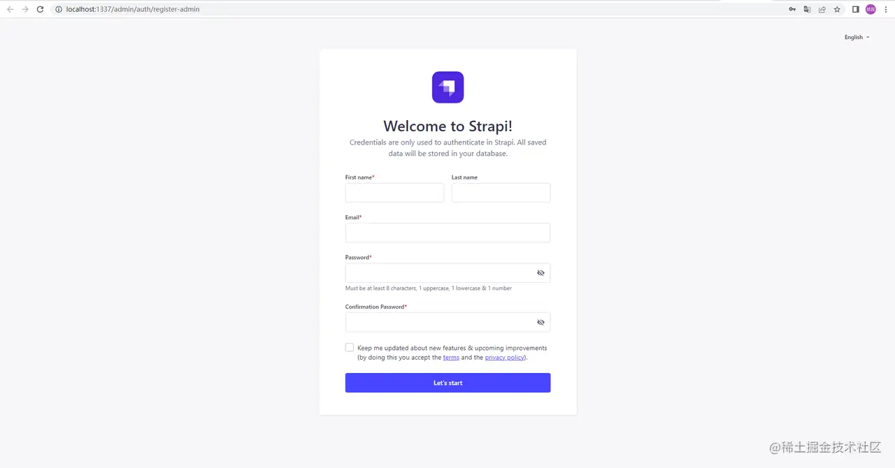

# 数据的可视化配置

1.  ## 结构体的定义

在完成上面的登录后，我们可以进到 Strapi 的管理页面。


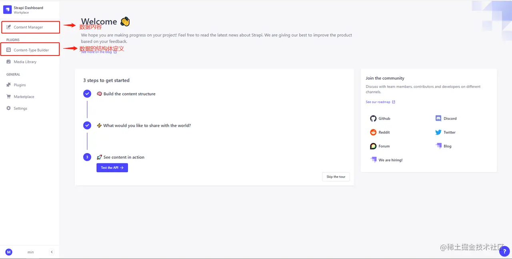

其中`content manager`是我们 Api 的数据，而`content-type builder`对应我们 Api 的结构体，我们以上一章节 layout 下的静态数据举例：

```
footerData: {
      title: "Demo",
      linkList: [
        {
          title: "技术栈",
          list: [
            {
              label: "react",
            },
            {
              label: "typescript",
            },
            {
              label: "ssr",
            },
            {
              label: "nodejs",
            },
          ],
        },
        {
          title: "了解更多",
          list: [
            {
              label: "掘金",
              link: "https://juejin.cn/user/2714061017452557",
            },
            {
              label: "知乎",
              link: "https://www.zhihu.com/people/zmAboutFront",
            },
            {
              label: "csdn",
            },
          ],
        },
        {
          title: "联系我",
          list: [{ label: "微信" }, { label: "QQ" }],
        },
      ],
      qrCode: {
        image: code,
        text: "祯民讲前端微信公众号",
      },
      copyRight: "Copyright © 2022 xxx. 保留所有权利",
      siteNumber: "粤ICP备XXXXXXXX号-X",
      publicNumber: "粤公网安备 xxxxxxxxxxxxxx号",
    },
  }
```

针对这样一个结构体，应该如何去定义我们的 Api 呢，首先我们切到 `content-type builder`。


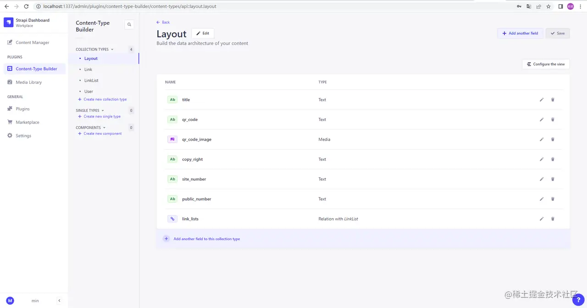

大家打开的时候应该只有一个 User，这几个结构体是我后面创建的，可以看到，这其中定义的其实就是我们需要的对应字段和它们的类型，如果需要创建一个新的结构体，我们点击`create new collection type`。


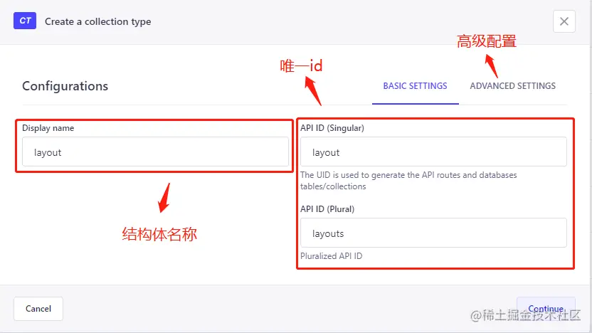

填完`display name`后，对应的单数和复数 id 它会自动生成，就是右边的两项，name 我们填需要的结构体就可以，至于右边的 tab 是一些高级配置，我们这里用不到可以先不管它。


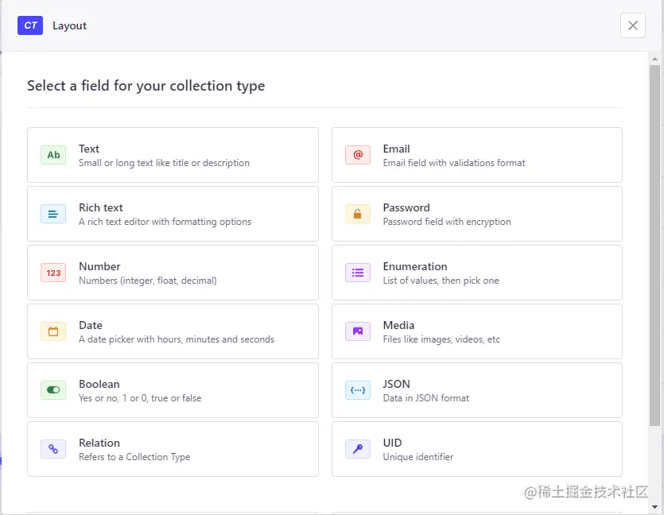

然后为我们的结构体创建一些字段，常见的类型包括文本、boolean值、富文本，这些这里都是有的，咱们以 title 举例，因为是一个字符串，所以我们点 `text`。


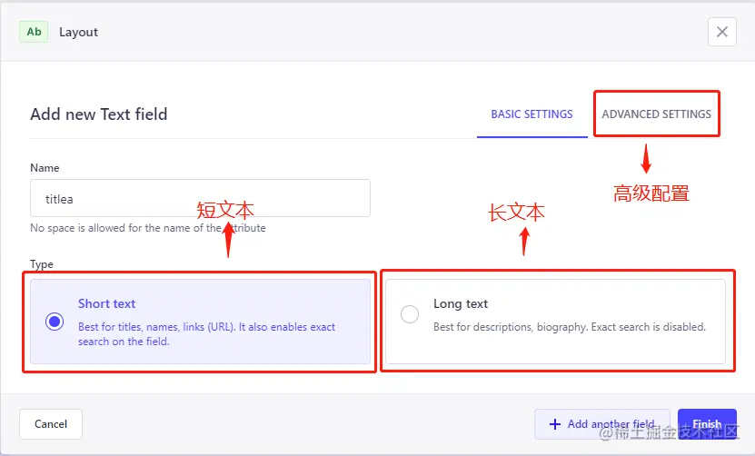


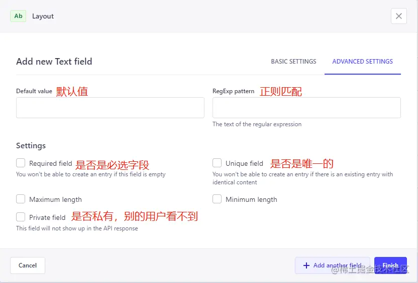

咱们这个直接用短文本就好，然后高级配置我们可以选个必填和唯一。


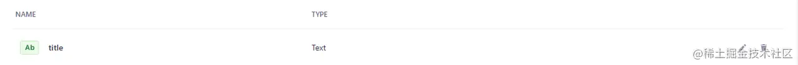

对应的字段就加好了，对于别的部分，我们用相同的方式加进来就可以，稍微特殊一些的字段是 linkList，可以看到它其实是一个对象数组，我们先把 footdata 的关系按照思维导图梳理一下。
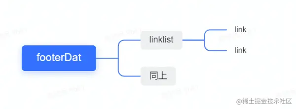

按照数据结构我们可以发现，footerdata 和 linklist，它们是一对多的关系，而 linklist 中又包含多个link，也是一对多的关系，所以要描述这部分字段，光 layout 一个结构体是不够的，我们需要创建 linklist 和 link，然后给它们之间来建立对应的关系。

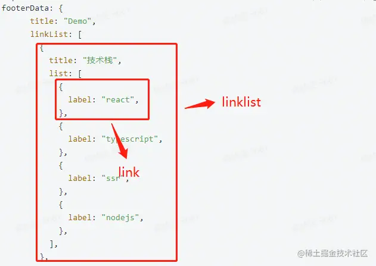

确定了思路，我们按照上面的来创建好 linklist 和 link 的结构体。


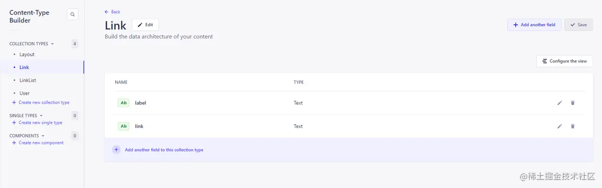

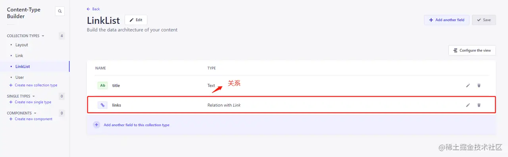

那 linklist 和 link 的关系我们应该怎么建立呢？可以按之前说的，我们在 linklist 结构体中，点新建字段。


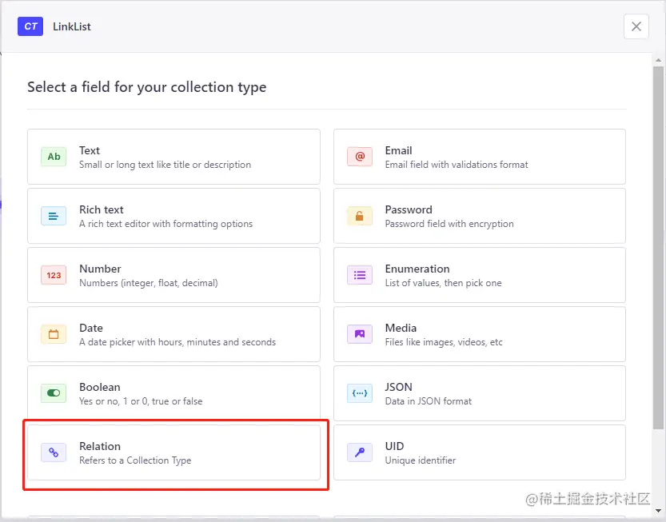

然后我们点击 relation 属性，这个属性我们用来联立结构体之间的数据库关系。


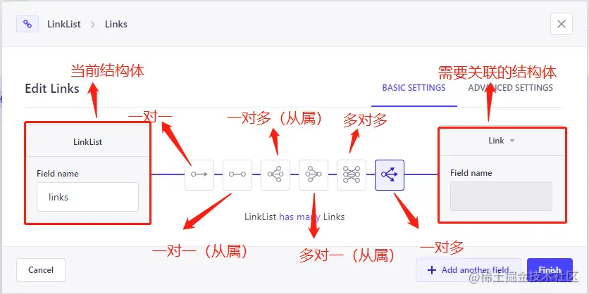

这里说一下从属和普通联合的区别，如果是从属关系，对应的属性会加到需要关联的结构体，并不会体现在当前表，可以理解为 a 是 b 的一个属性。如果是普通的联合，图中 icon 带有箭头的，是将 b 作为属性加到 a 中，每次切换下面也有对应的英文描述，大家可以结合理解。

根据上面我们说的关系，这里应该是选最后一个，也就是一对多，link 是作为 linklist 的属性来存在的，我们可以点完成，发现就已经加上了。


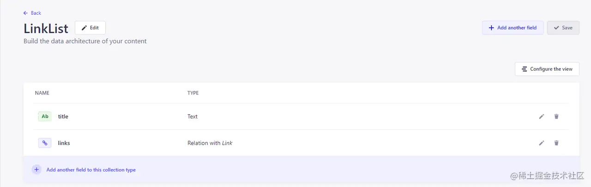

接下来，我们按照上面的原理配置完所有的结构体即可。

2.  ## 结构体数据的写入

定义完结构体以后，我们需要为结构体加入一些数据，通常在开发完后，运营相关的同学配置，就只要进行这一步就可以了，别的部分就不需要再调整了，我们点击`content manager`。


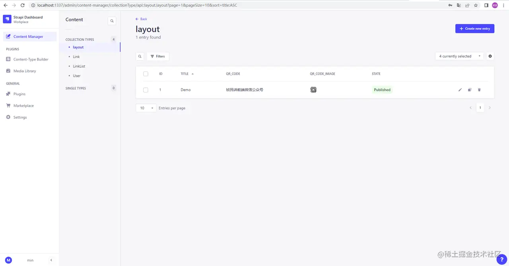

数据的配置我们需要按照**从子到父**的原则，很好理解，因为 layout 有相关的字段依赖于 linklist， linklist 又依赖于 link，所以只有 link 配置完以后，才可以进行 linklist 和 layout 的配置，这里我们以 link 和 linklist 举例。

切到 link 的部分，点击 `create new entry`，可以进到下面的页面，我们输入完内容以后，可以进行保存，这里保存有两个按钮， 一个是 save， 一个是 publish，如果点击 publish 会生效到实际 cdn， 这里我们可以先点击 publish， 实际场景下运营配置的时候可以点 save，在 review 没问题后再发布即可。


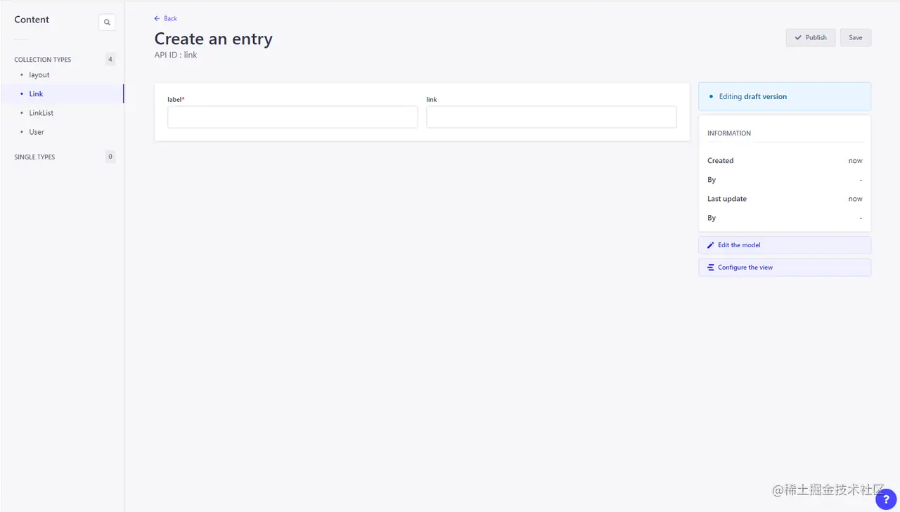

配置完大致是这样的：


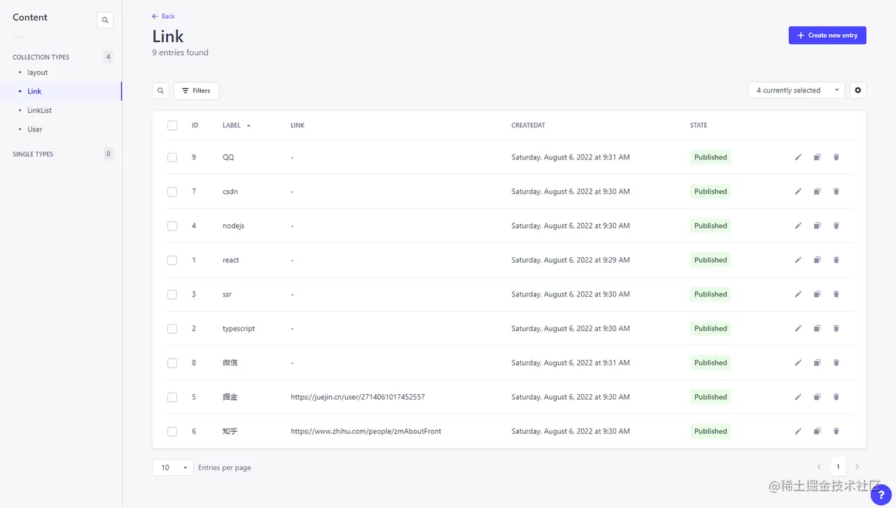

然后我们配置 linklist 的部分，同样是点`create new entry`。


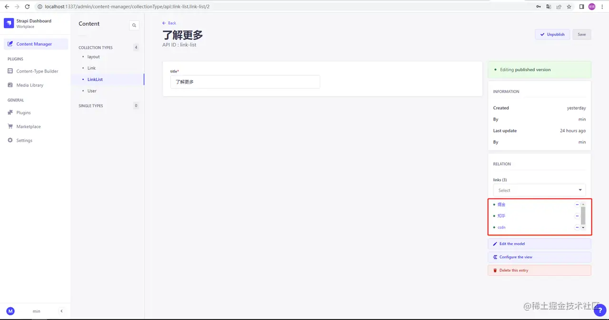

除了基本的字段，右侧还会有对应关联的字段，勾选我们需要的就可以关联上了。


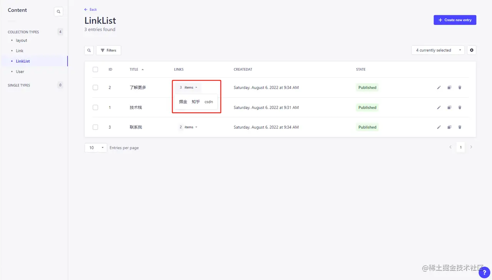

保存完成后，我们可以看到对应的关联对象内容，确认无误就行了，然后剩下的部分我们用同样的原理完成就行。

3.  ## Api 权限配置及上线

结构体和数据定义完成后，我们已经完成大半了，现在问题是我们应该在哪里配置我们的 Api，使得有个 cdn 可以看到呢？

我们点击`settings -> Roles`，这里是权限配置的部分，包含作者权限和公共权限，因为需要所有的人可以看到我们的接口，所以我们点 public 右侧的 🖊（如果有特别需求的同学，可以点击 `add new role` 新增权限角色，再进行后续的步骤。


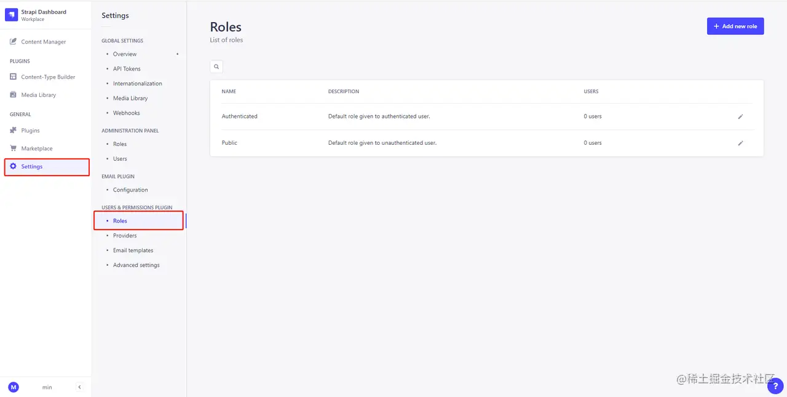

可以看到，我们之前定义的结构体，左侧对应结构体支持的类型，右侧对应结构体接口的指向 Api 路由。因为我们这边要给对应的接口配置全查和单查的能力，所以我们勾选上 find 和 findOne。


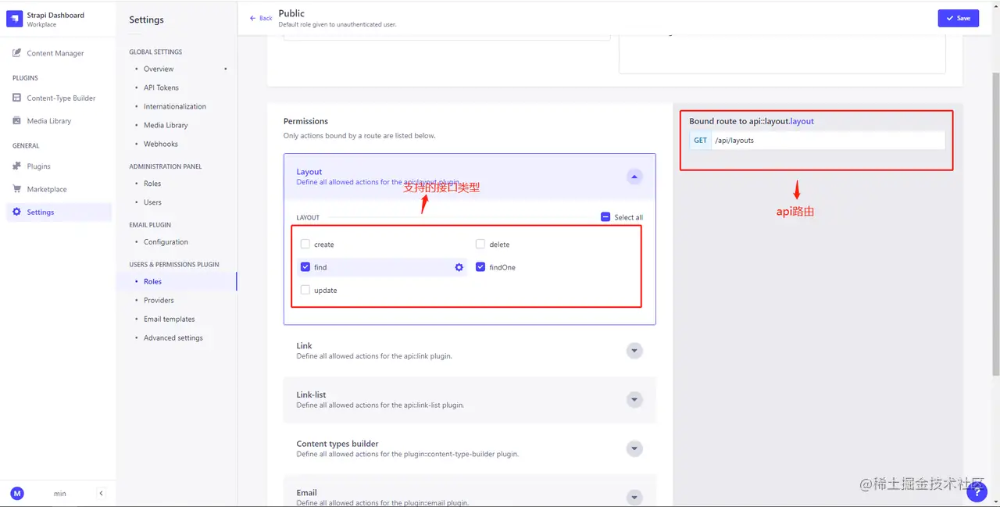

因为 layout 依赖于 link 和 link-list，所以 link 和 link-list 的结构体我们也需勾选上 find 和 findOne，完成这些后，我们访问 http://localhost:1337/api/layouts 试一下。


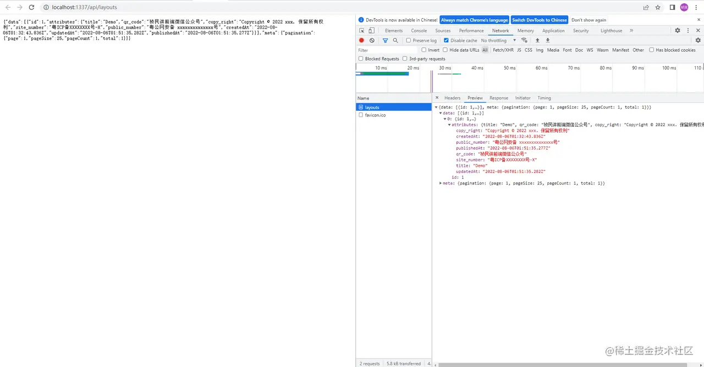

细心的同学会发现，好像只有基础的字段，联表的 linklist 和 link 去哪里了？这是因为 Strapi 默认是不会填充联表关系的，我们可以在路由后加`populate=*`，这个入参的意义是为所有的关系填充一级关系。


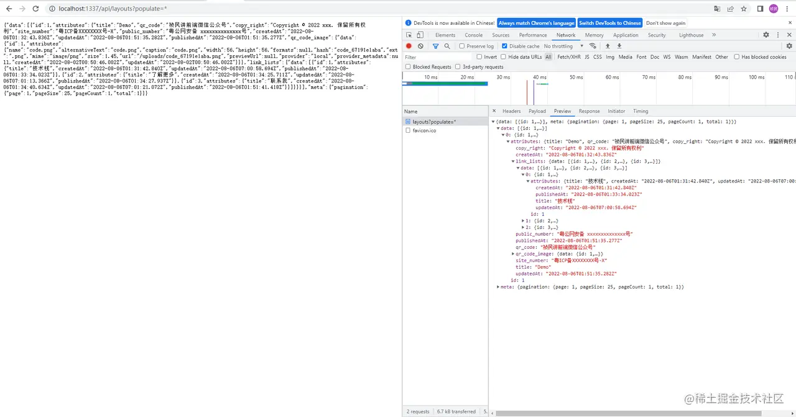

可以看到现在已经有了，不过这个入参只能填充一级深度，如果有两层这种写法就不行了，引用一个官网的例子。


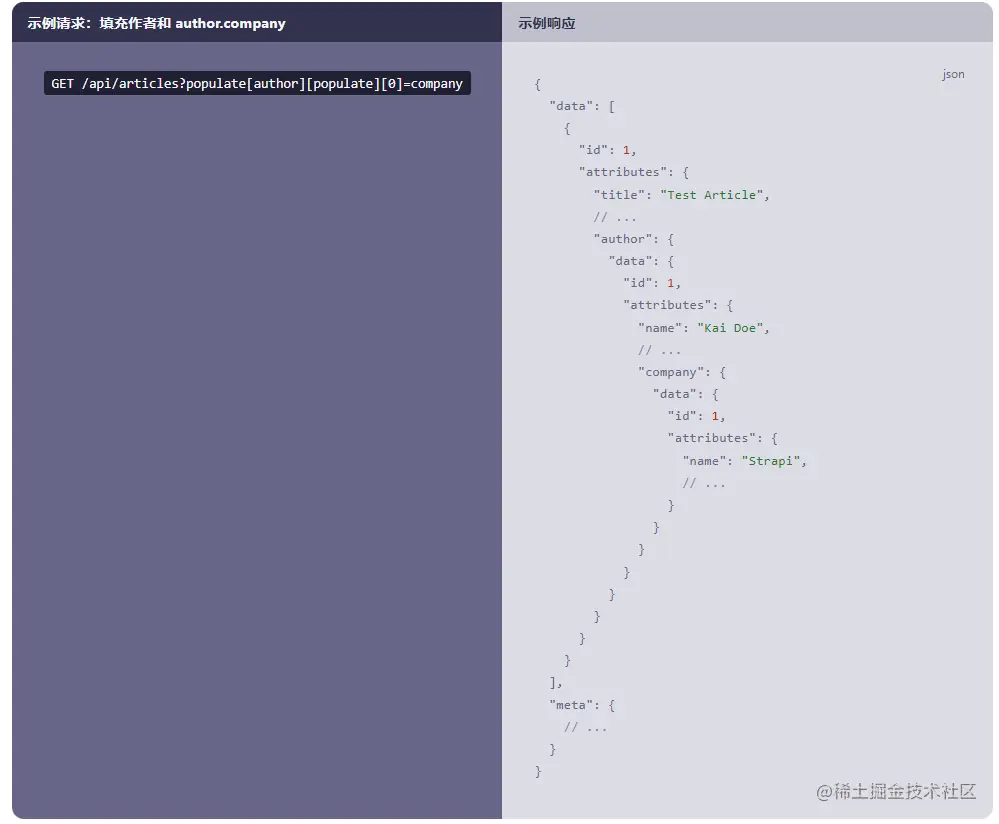

比如这样的结构，我们需要指定对应属性和子属性才可以，如果是这样，那可真的太糟糕了，每次我们配置一个复杂的结构体得花多少精力来配置入参呀！为了解决这个问题，我推荐大家使用`strapi-plugin-populate-deep`，这是基于 Strapi 的一个深度插件，我们切到项目目录下的终端安装一下。

```
npm install strapi-plugin-populate-deep --save
```

然后重启一下，我们尝试访问 http://localhost:1337/api/layouts?populate=deep 。


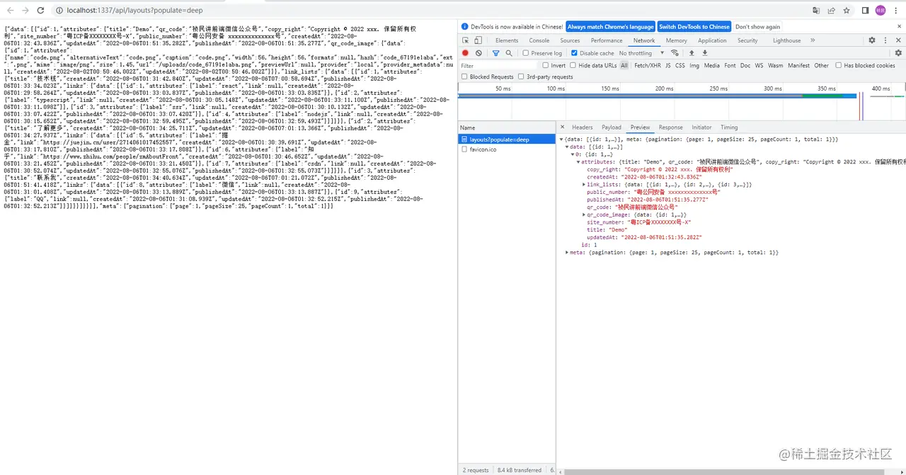

deep 参数的含义为使用默认的最大深度填充请求，即 5 层，如果 5 层不满足大家的需求，需要更多，入参的调整也很方便，比如针对 10 层的场景，我们只需要传递入参 `populate=deep,10`就可以，相比原生复杂的语法定义好理解很多~

# 项目结构 & 调试

上面我们通过可视化配置了一个接口，不过 Strapi 的能力远不止此，它提供了大量的 openApi ，可以支持自定义接口的开发，为了大家后续能更好理解自定义开发的过程，我们一起来看看之前脚手架生成的 Strapi 项目结构是怎么样的。


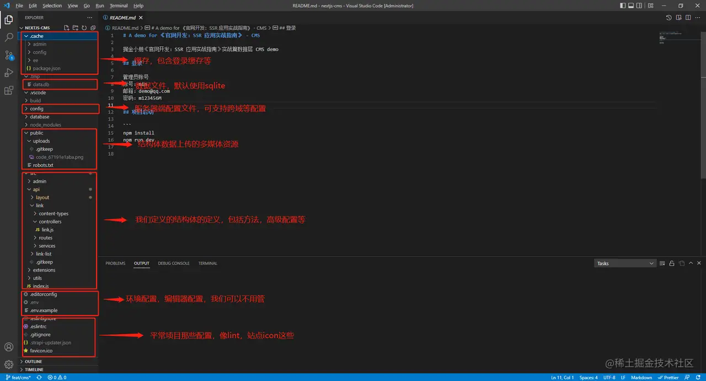

这其中咱们最需要关注的有三个文件夹：

-   .tmp/data.db: 我们项目的 db 文件，存放有 user、结构体、Api 鉴权等所有数据，默认使用 SQLite，我们可以使用 navicat for SQLite 打开看看。


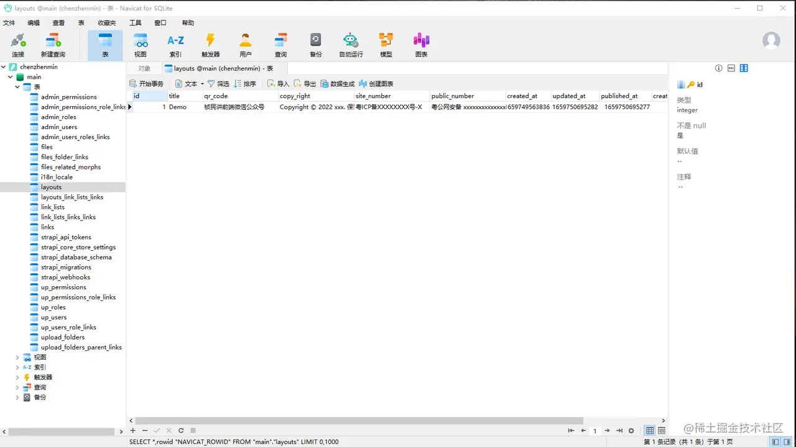

-   config/ **.* : config目录下包含着我们项目使用的配置，比如数据库、中间件等配置，可以通过它来换用别的数据库或是进行跨域网关等操作。以数据库文件举例，我们可以看到，其中使用着 SQlite 的数据库，并指向了上面我们提到的 db 文件路径。


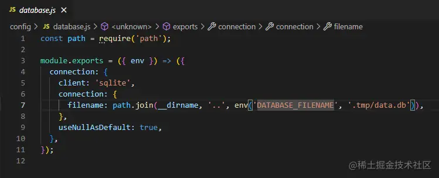

-   src/api/*: 这其中定义着我们之前配置的结构体，我们可以在这其中对我们配置的 Api 数据进行拦截进行一些额外的处理等自定义操作，具体我们会在下一节课举例说明。

因为是一个服务器端项目，所以我们肯定也需要在服务器层进行接口的调试，调试的方式很简单，我们只需要在 VSCode 的 debugger 控制台下运行项目，然后正常 debugger 即可。


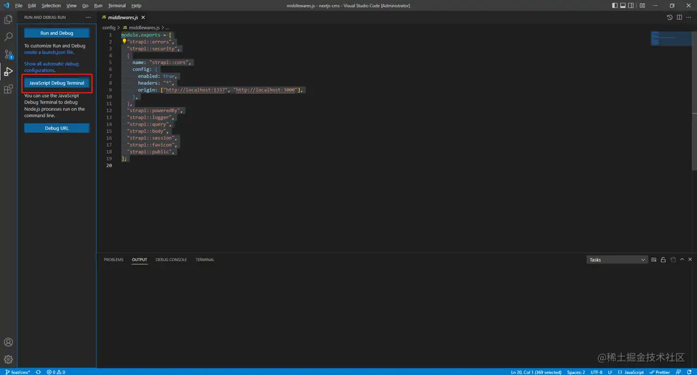

# 小结

这节课，我们学习了怎么通过 Strapi 搭建一个符合我们自己业务场景的 CMS，并定义了对应的 find 接口用于后续的查询，同时我们遇到了不能深度联表的问题，并引入了对应的深度查询插件来解决。我们还学习了 Strapi 的项目结构和调试能力，为下一节课的自定义学习打下了基础。

下一节课我们将在目前 CMS 接口基础上进行一些自定义的调整，并且定义 BFF 层调用我们这节课配置好的数据源接口，来替换之前我们写的固定的静态数据，完成整个数据链路的过程。