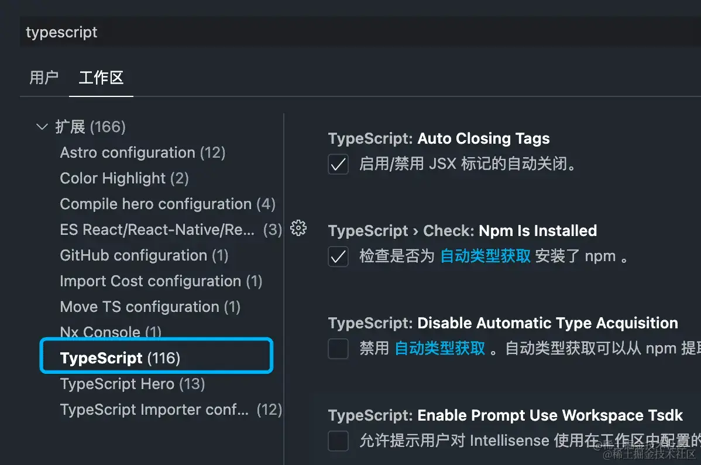
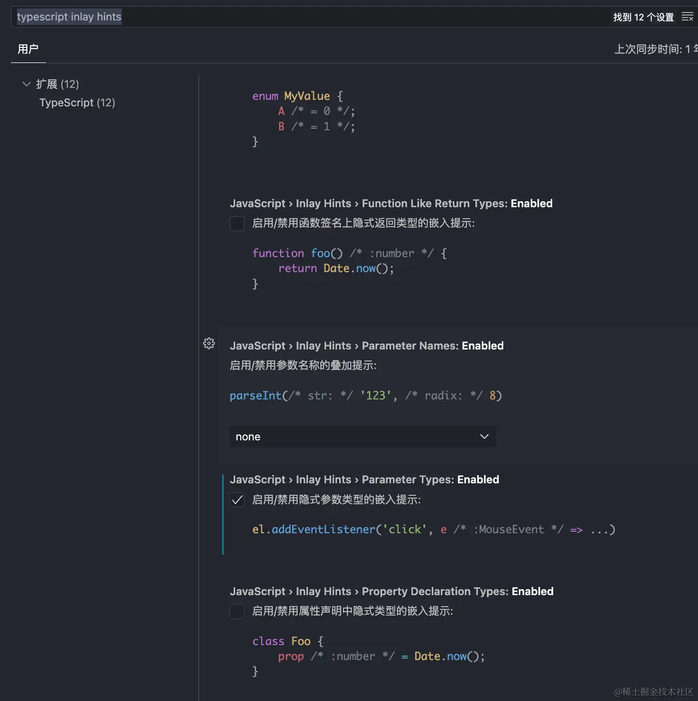
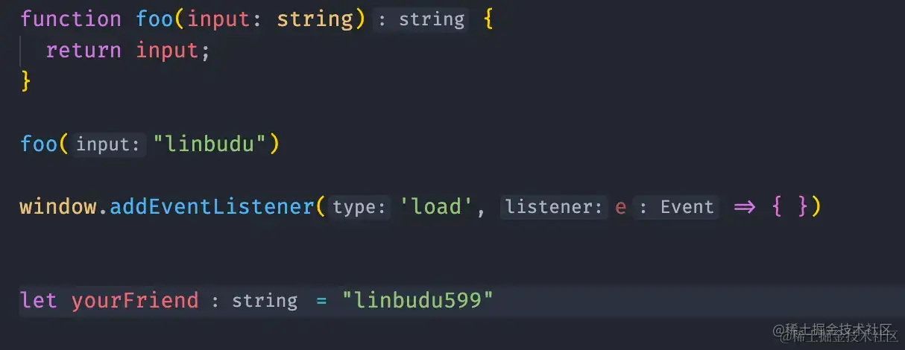
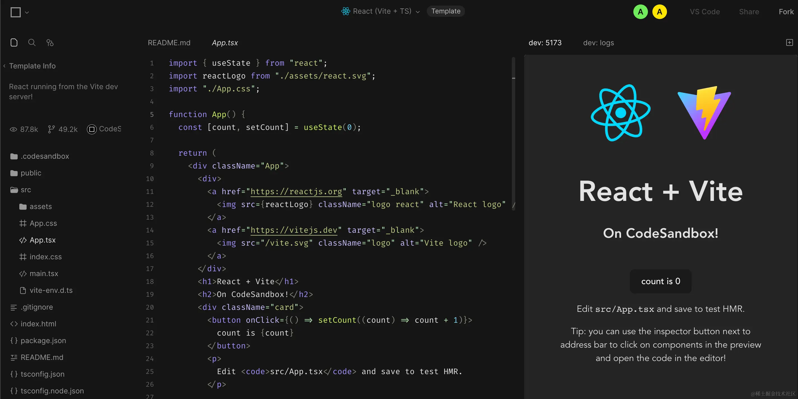
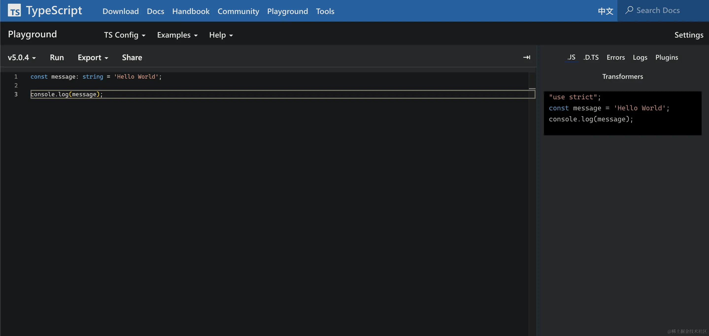
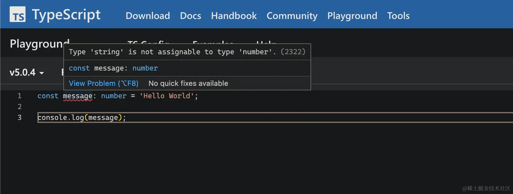

# 2.又一次 Hello World：TypeScript 开发环境搭建

在开始正式学习前，我们有必要先搭建好 TypeScript 的开发环境。在你初学 JavaScript / NodeJs 时，可能花了相当多的时间在环境配置中，很是费了一顿功夫才慢慢有了今天你非常熟悉的各种开发流程。但这次不一样了，我们只需要非常简单的配置就能完成 TypeScript 开发环境的搭建。

在代码编辑器方面，我们选择 VS Code，即使你不使用它，也一定听闻过。作为一个使用 TypeScript 开发的代码编辑器，VS Code 内置了非常全面的 TypeScript 支持，如类型检查，代码提示，自动补全等等，基本你高频使用的功能都无需配置就能开箱即用。

同时，VS Code 插件市场中提供的大量各式插件也相当好用，但就入门教程而言，我们暂时还不需要动用到除内置以外的功能，因此如果你有兴趣，可以自行探索插件市场有哪些可以提供更多 TypeScript 开发助力的插件。

对于 VS Code 中的设置，我们也有一些需要额外介绍的点，因为内置的 TypeScript 支持能力并没有全部启用，有一些能力需要我们通过额外的设置开启——当然，之所以这些配置没有被默认启用，就是因为不同的开发者对这些能力的喜好是不同的，可能你弃之如敝屣的能力，就是我每天都离不开的那些。因此下面介绍的配置项中，你可以根据他们的实际效果自行调节。

首先，通过 Ctrl(Command) + Shift + P 打开命令面板，找到「打开工作区设置」这一项。


在打开的设置中输入 typescript，筛选出所有 TypeScript 有关的配置，点击左侧的"TypeScript"，这里才是官方内置的配置。



补全搜索词，使用“typescript inlay hints”：



推荐开启的配置项主要是这几个：

-   Function Like Return Types，显示推导得到的函数返回值类型；
-   Parameter Names，显示函数入参的名称；
-   Parameter Types，显示函数入参的类型；
-   Variable Types，显示变量的类型。

  


而启用后的效果则是这样的：



这些配置的主要能力就是把参数名，参数类型，以及推导得到的类型等等信息直接展示在屏幕上，否则你就需要悬浮鼠标在代码上来查看这些信息了。对于入门阶段的开发者来说，可以开启这些配置项来获得更清晰的类型信息。

  


本地的代码开发环境是最重要的。但有时候，如果我们在敲代码的时候遇到了问题，需要求助他人，如何让好心人看到我们的代码呢？截图？还是整个文件甚至整个项目发过去？认真地说，这是一种对双方都不利的行为，对于被求助的人来说，很难有愉悦的心情配置环境，安装依赖，再在一个项目里找寻那一两处问题，而对于求助者来说，可能就丧失了正确进行提问的能力。更推荐的方式是使用 Web IDE，比如 CodeSandbox：



将你的问题代码简化和脱敏，然后放到 CodeSandbox 上，将链接直接发送给别人即可，这样打开就能够看到代码，省下来的功夫和耐心也能够更好地帮助你检查问题。

而对于 TypeScript，如果你需要粘贴 TypeScript 代码进行求助，其实还有一个更好的选择——TypeScript 官方提供的 [TypeScript Playground](https://www.typescriptlang.org/play)：



在你编写代码后，URL 会自动更新，将代码信息保存到地址上，因此你同样可以通过链接分享来快速地共享代码。

我们来简单地介绍一下它的功能，主要是检查、配置以及编译执行这么几个能力。首先是检查，与 VS Code 中的类型检查一致，TypeScript Playground 中也能进行类型检查：



同时，由于某些检查行为其实和 TS 的配置项有关，在 Playground 中你可以通过上方的 TS Config ，来配置相关的信息。关于 TS 的配置项，我们在后面也会介绍到。而需要说明的是，如果你是将本地代码粘贴上来后发现表现不一致，可能就是配置项和 TS 版本的差异导致的。你可以在左上角调整 Playground 使用的 TS 版本。

同时，Playground 中也能够直接查看编译后的 JS 代码：


编译行为会随着你的代码变更自动执行，无需手动操作，但是如果你希望执行编译后的 JS 代码，就需要通过 Command(Ctrl) + Enter 的方式了：


  


TypeScript Playground 是非常好用的 TS 代码在线编辑工具与分享工具。请谨记，如果你遇到了什么 TS 报错，在已经尝试过自己解决但效果不佳的情况下，如果想要对外求助答疑，不论这个问题可能有多简单，都请尽可能同时提供代码截图和 Playground 两种渠道的信息，这么做一定能够能让你的问题更快得到解决。

  


现在，我们就可以在配置完毕的环境里写下我们的第一行 Hello World 了！就像你初学 JavaScript 时写下的那行代码一样，这句 Hello World 会为你打开新世界的大门：

```typescript
const message: string = 'Hello World!';

console.log(message);
```

诶，这个时候你可能会想，当我们初学 JavaScript 时，通常会使用浏览器控制台或 NodeJs 来执行第一个 Hello World，那 TypeScript 并不能在浏览器中直接执行，我们又该如何见证第一个 Hello World 成功运行？前面我们已经说过，TS 文件会在编译后得到 JS 文件，也就是说我们可以先编译后再进行执行——但这样会不会太麻烦了？此时我们可以使用来自社区的 npm 包 esno：

```bash
$ npx esno index.ts

Hello World!
```

> 简单地说，esno 也是先编译再执行的过程，只不过它底层使用的是快如闪电的 ESBuild 进行编译，所以使用它来执行 TS 文件，我们几乎感觉不到编译的过程。

在这一节，我们学习了基础的 TypeScript 开发环境搭建，包括在 VS Code 中通过几个简单的配置项来提升 TypeScript 的开发效率，使用 TypeScript Playground 来在线执行和分享你的 TS 代码，以及使用 esno 来执行你的 TS 文件，这几条经验实际上可以伴随你非常之久，甚至我在今天也一直使用着这套环境。