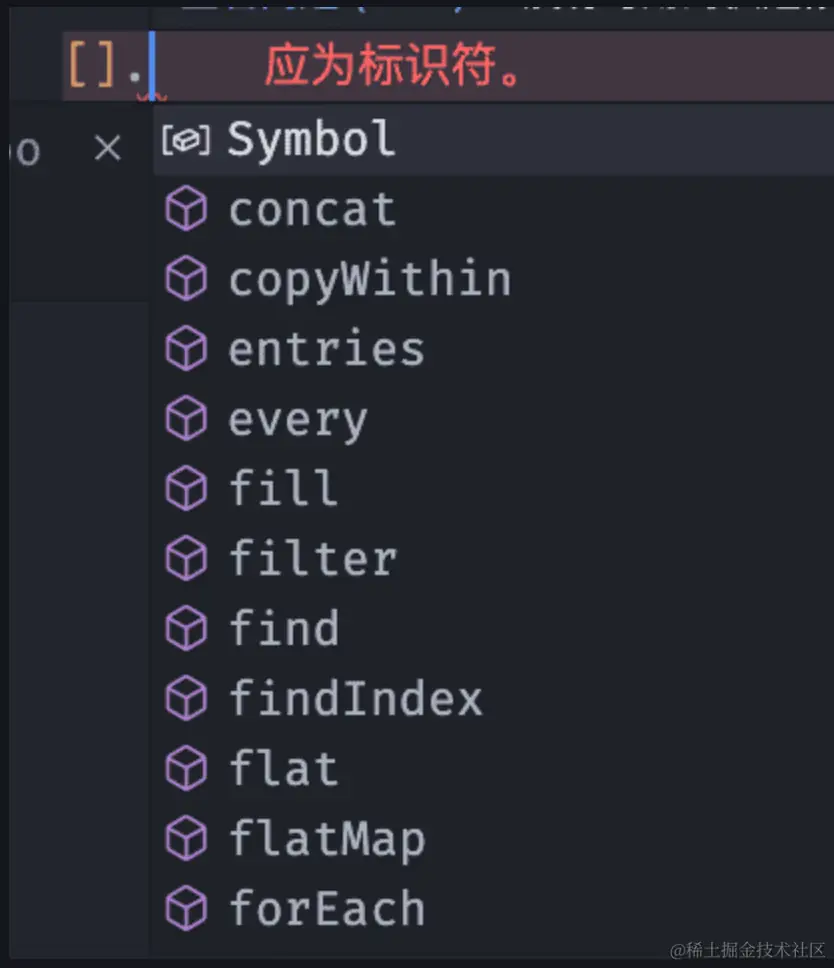

# 3.原始类型与对象类型：还是熟悉的配方

完成了环境搭建后，我们就可以正式开始学习了。有必要提前说明的是，在这一系列教程中，对于那些全新的概念，我们会尽可能尝试用 JavaScript 中你已了解的部分类比，而这也是我个人认为，在学习新事物时相当高效的一种方式。

JavaScript 中的数据类型可以简单分为原始类型与对象类型两类：

```typescript
const userNick = 'linbudu'; // 字符串
const userAge = 18; // 数字
const userMarried = false; // 布尔值
const userNull = null; // null
const userUndefined = undefined; // undefined

const userObject = {}; // 对象
const userList = []; // 数组
```

可以看到，上面这些变量在声明时，并没有指定类型，因此只能靠变量名来提示开发者这可能是个什么类型，比如 userList 应该是个数组，userNick 应该是个字符串，userAge 应该是个数字...。同时，由于使用 let 声明的变量可以再次赋值，所以一个名叫 userList 的变量在它的一生中可能客串了数组、对象、集合（Set）...。

总结一下，JavaScript 中的变量声明存在这么一个问题：一个（let 声明的）变量可以被赋值为任意类型。而这会带来的影响也很明显：我们只能依赖变量名感知这个变量的值与作用，即使它在运行过程中被篡改，我们也无法提前感知，直到在某一处报错了。

更合理的情况是，一个变量首次被赋值后，即使它是使用 let 声明的，也应当将类型确定为这个值的类型，比如 userList 一开始是数组，那么无论后续程序如何运行，它始终都是一个数组，只不过数组的长度可能发生变化罢了。

而使用 TypeScript，当我们声明一个变量并赋值后，它的类型就确定了：

```typescript
let userAge = 0; //

userAge = 'linbudu'; // 不能将类型“string”分配给类型“number”
```

可以看到，TypeScript 在这里给出了一个错误，因为你尝试给一个数字类型的变量赋值字符串，之前你可能习惯了这种操作，但不好意思，现在 TypeScript 可不允许你这么做。

更进一步的，在声明变量之后，到实际赋值之前，我们其实可以提前标注好类型：

```typescript
let userAge: number;

userAge = 18; // ok
userAge = '18'; // error 不能将类型“string”分配给类型“number”

const userName: string = 'linbudu';
```

这两种方式的主要区别是，第一种方式是“我给了你一个值，从此以后你就是这个形状了”，而第二种方式是“我给你画好了形状，以后谁给你赋值也得是这个形状”，也就是由开发者主观为其赋予类型约束，更加符合我们对类型安全的定义。

完成了类型标注后，这个变量不仅获得了后续赋值的类型保障后，还获得了一个非常重要的好处：类型提示。你可以理解为，TypeScript 中收集了 JavaScript 所有内置的方法，比如这里每个数据结构对应的属性与方法：



对于原始类型的类型标注相对简单，我们使用 `: 类型` 的语法来实现，这里的类型其实也就是 string / number / boolean：

```typescript
const userName: string = 'linbudu';
const userAge: number = 18;
const userMarried: boolean = false;
```

而对数组类型与对象类型我们有必要展开说明一下。首先，在 TypeScript 中有两种方式可以描述一个数组类型，`Array<数组类型>` 或 `数组类型[]`：

```typescript
const userNames1: string[] = [];
const userNames2: Array<string> = [];
```

这两种方式没有明显的区别，获得的类型提示都是完全一致的，仅仅取决于你想把数组成员的类型写在前还是后。

而对于对象类型，我们需要首先使用 TypeScript 的语法，先编写一个 interface，即接口：

```typescript
interface User {
  userName: string;
  userAge: number;
  userMarried: boolean;
}
```

然后再使用这个接口来作为对象类型变量的类型标注：

```typescript
const user: User = {
  userName: 'test',
  userAge: 20,
  userMarried: false,
};
```

看起来有点奇怪，我们就好像把一个对象类型写了两遍一样。但实际上，将对象类型抽象为一个接口，我们能够在后续很方便地复用这个类型标注，以及在类型编程中，对这个接口类型进行各种处理获得新的类型，当然，这是后话了。在眼下，我们只要知道接口是专用于进行对象类型标注即可。

可以看到，接口的属性类型可以是任意有效的类型，那么它当然也还可以又是一个接口：

```typescript
interface JobModel {
  // ...
}

interface Job {
  currentModel: JobModel;
}

interface User {
  userJob: Job;
}
```

而接口加上数组类型，就可以描述一个成员是对象的数组类型：

```typescript
const userList: User[] = [
  {
    userName: 'test',
    userAge: 20,
    userMarried: false,
  },
  {
    userName: 'test',
    userAge: 20,
    userMarried: false,
  },
  {
    userName: 'test',
    userAge: 20,
    userMarried: false,
  },
];
```

使用接口来描述对象类型意味着，代码中的赋值需要完全符合这个接口定义的接口：必须拥有所有接口中定义的属性，不能多也不能少：

```typescript
// 类型 "{ userName: string; userAge: number; }" 中缺少属性 "userMarried"
const user1: User = {
  userName: 'test',
  userAge: 20,
};

const user2: User = {
  userName: 'test',
  userAge: 20,
  userMarried: false,
  // 对象字面量只能指定已知属性，并且“userJob”不在类型“User”中。
  userJob: 'fe',
};
```

那么你可能会想，如果我的对象中，存在一个比较飘忽的属性，它可能存在也可能不存在，而是否存在都不影响我这个对象是否符合类型的判断，应该怎么做？此时我们可以使用可选标记：

```typescript
interface User {
  userName: string;
  userAge: number;
  userMarried: boolean;
  userJob?: string;
}
```

这里的问号意味着，userJob 被标记成了一个可选的属性，也就是说变量即使不具有 userJob 属性，也可以认为是符合了 User 类型：

```typescript
const user: User = {
  userName: 'test',
  userAge: 20,
  userMarried: false,
};
```

上面这些例子中，本质上都是使用对象来存放一个“值”，即这个对象描述的是一组具体的信息：你的用户名、你的年龄等。而在 JavaScript 中，我们还经常使用对象来存放常量：

```typescript
const userLevelCode = {
  Visitor: 10001,
  NonVIPUser: 10002,
  VIPUser: 10003,
  Admin: 10010,
  // ... 
}
```

这么做的好处是我们能够避免项目中出现 Magic Value，即莫名其妙的一个值，没有任何的注释，只能靠猜来理解这到底是个什么玩意：

```typescript
fetchUserInfo({
  // ...
  // 后续维护者：这到底是个啥？？
  userCode: 10001
})

fetchUserInfo({
  // ...
  // 后续维护者：哦，这里要给访客用户啊
  userCode: userLevelCode.Visitor
})
```

而在 TypeScript 中则提供了一个更好的常量定义方式，即枚举，上面的例子用枚举改写后是这样的：

```typescript
enum UserLevelCode {
  Visitor = 10001,
  NonVIPUser = 10002,
  VIPUser = 10003,
  Admin = 10010,
  // ... 
}
```

看起来好像只是换了个写法，但其实枚举能带来更明显的好处，首先最重要的就是，相比于使用对象，枚举能够提供清晰的提示，甚至可以看到这个枚举成员的值：


同时，对于这种数字类型的值，枚举能够自动累加值：

```typescript
enum UserLevelCode {
  Visitor = 10001,
  NonVIPUser,
  VIPUser,
  Admin = 10010,
  // ...
}
```

由于 NonVIPUser 和 VIPUser 是直接累加的，因此这里我们可以省略赋值，由枚举自动地进行累加，以此用更少的代码来保持一致的功能性。

最后，枚举中可以同时支持数字、字符串、函数计算等成员：

```typescript
function generate() {
  return Math.random() * 10000;
}

enum UserLevelCode {
  Visitor = 10001,
  NonVIPUser = 10002,
  VIPUser,
  Admin,
  Mixed = 'Mixed',
  Random = generate(),
  // ...
}
```

除了常见的原始类型与对象类型以外，随着 ES6 的引入，Set 类型与 Map 类型的使用率也在不断上升。而对这两个类型的标注则类似于数组类型标注中的 `Array<类型>`，在后面我们会学习到这里的 `<类型>` 到底是什么来路，现在只要照葫芦画瓢就好：

```typescript
const set = new Set<number>();

set.add(1);
set.add('2'); // X 类型“string”的参数不能赋给类型“number”的参数。

const map = new Map<number, string>();

map.set(1, '1');
map.set('2', '2'); // X 类型“string”的参数不能赋给类型“number”的参数。
```


在这一节，我们学习了 TypeScript 中如何对基础的原始类型与对象类型进行标注，其中原始类型和数组类型的标注还相对简单，都是 `: 类型` 的语法。而对象类型的标注就要稍微复杂一点点，它需要使用一个新引入的语法 接口 interface 来描述一个对象类型，同时，我们可以在接口中对部分属性加上个 `?`，来表示这个属性“可有可无”。对于入门同学来说，这第一节内容可能还是要稍显陌生，毕竟不可避免地接触了新的知识点，但其实只要多反复写写这些类型标注，很快就能对它们熟悉起来。