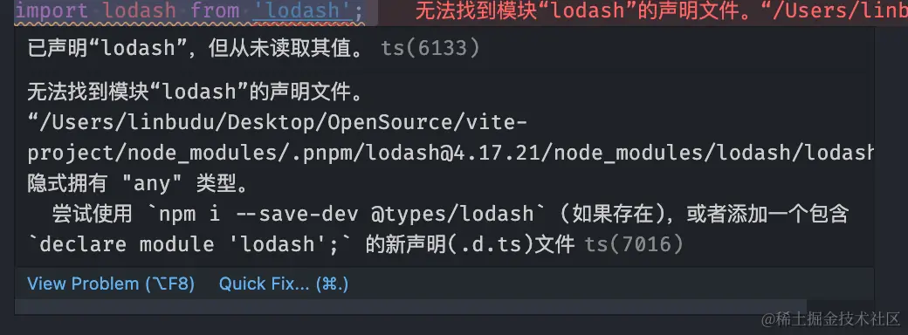
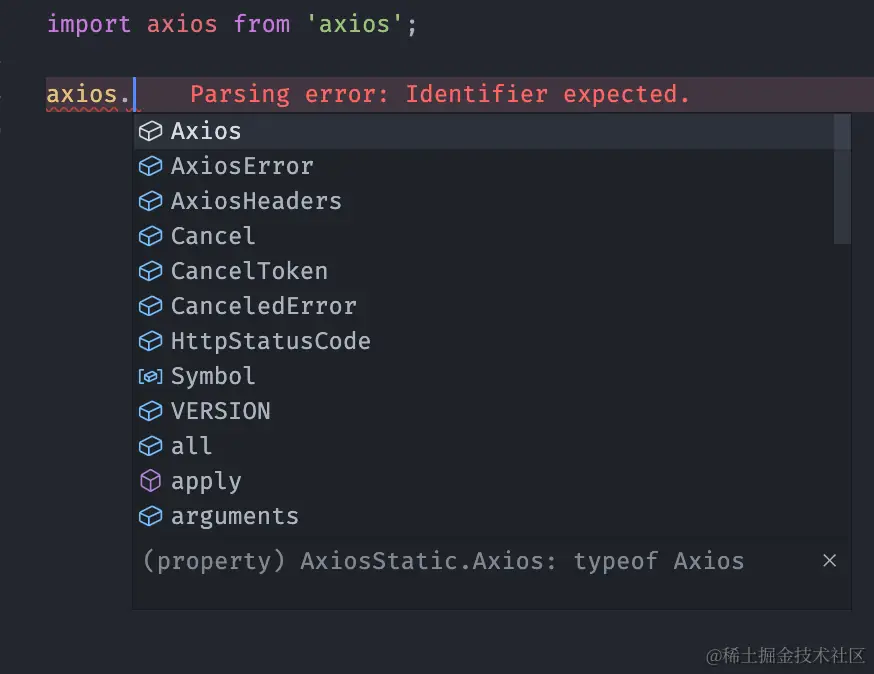
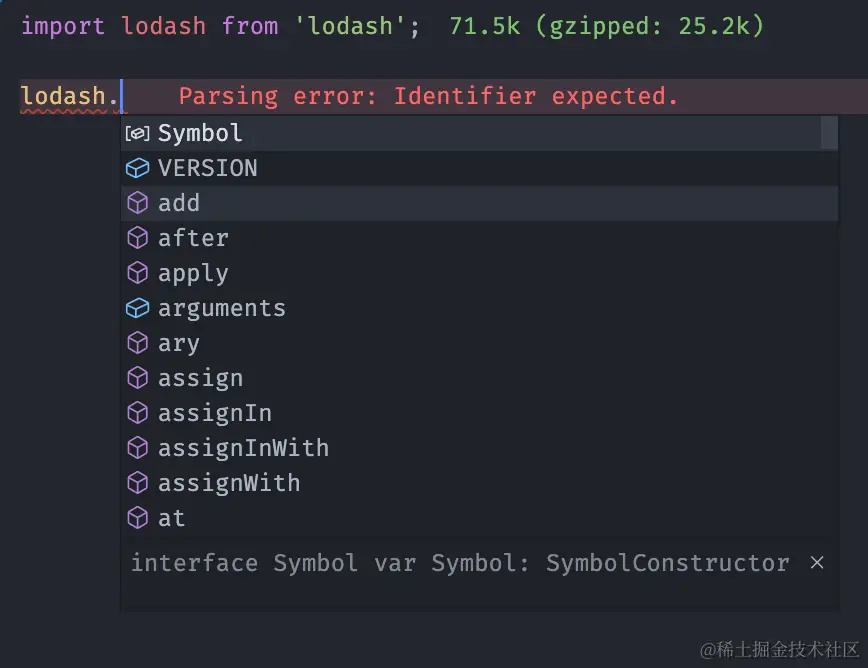
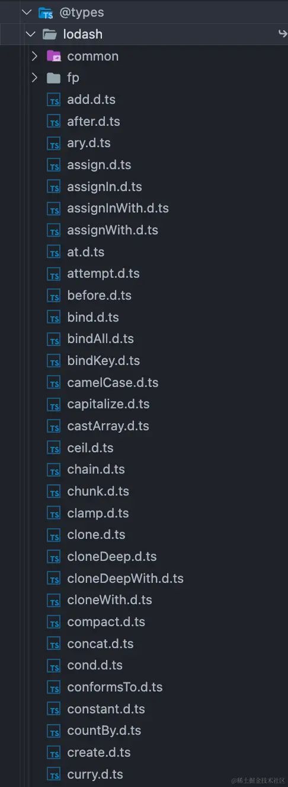

# 9.类型声明：让 JS 和 TS 融合得再紧密一些

在第一节的介绍中，我们提到了这么一条：“TypeScript 能够非常好地兼容 JavaScript 生态”，当时我们并没有去解释这句话，而是将其视为理所当然的。但深入思考一下，你可能会产生一些疑问：JavaScript 生态指的是什么？TypeScript 的兼容又体现在哪里？

关于 JavaScript 的生态，编程语言的生态指的可不是生态圈，而是整个语言社区中，无数开发者提供的那些覆盖各种场景与用途的“包”，在 JavaScript 社区这指的当然就是 npm 包！作为世界上最大的编程语言包社区，npm 社区现在拥有超过 300w 个npm包。而 TypeScript 之所以如今能取得如此的成功，被广大 JavaScript 开发者接纳，一个不可忽视的原因就是它对 npm 包的兼容能力。

简单地说，一个 npm 包可能是在数年前编写发布的，作者已经不再维护，但它仍然拥有数千万的周下载量。此时，如果作者希望提供 TypeScript 支持，让你在使用这个包的时候能获得类型提示，他并不需要分布一个新的版本，然后你再升级这个版本，只需要一点由 TypeScript 提供的黑科技——类型声明就行。

此前我们学习的类型知识，都是和 TS 代码绑定，需要我们提前提供好的。也即是说，必须标注这个变量为数组类型后，才能享受到后续对数组方法的提示，以及对数组类型的保障。那么 TypeScript 又是怎么让我们不需要为 npm 包编写类型就能享受到类型提示的？类型声明此时闪亮登场，你可以理解为它是存在于全局的 TS 类型，当你访问数组变量，它会读取 Array 这个顶级对象在全局声明的类型，然后为你提供对应的类型提示，对于 npm 包也是如此。

说了这么多概念，是时候来实战一下了。我们从一个日常使用频率非常高的库 Lodash 开始说起，首先安装它：

```bash
npm i lodash
```

然后导入它，此时你会发现 VS Code 给出了这么个提示：



对应的是，我们使用 Lodash 这个导入时，没有任何提示。而先不管其他的，我们再安装一个模块 axios 看看：

```bash
npm i axios
```

你会发现，此时 axios 导入是包括了完整的类型声明的：



为什么同样是 npm 包，一个无法提供类型提示，另一个却拥有非常完善的类型提示呢？回到 Lodash 导入给我们的报错，尝试按照提示安装下 @types/lodash 这个 npm 包：

```bash
npm i @types/lodash
```

此时我们的类型提示就出现了！



现在我们可以来解释下这两个包存在的差异了。Lodash 就是我们上面说的那个下载量非常高，却缺少了 TypeScript 支持的 npm 包。而 @types/lodash 就是 TypeScript 提供的黑魔法之一，我们先不需要理解这个 @types 开头的 npm 包到底是做什么的，只需要知道这个包内包含了提供给 Lodash 的「类型声明」，当你安装这个包时，TypeScript 会自动地识别其中的类型声明，并在你导入 Lodash 这个包时使用这些类型声明作为提示。也就是说，类型声明提供了一种独立于 JavaScript 代码之外，为 JavaScript 代码提供类型信息的方式。

那么上面的 axios 为什么不需要 @types/axios ？因为它选择了另一种方式，即通过将类型声明包含在 axios 这个包内的方式，这样，TypeScript 也能识别到其中的类型声明，并为 axios 这个导入提供类型提示。

而类型声明又是什么？打开 node_modules 中的 @types/lodash，你会发现其中包含了一个个 .d.ts 文件：



这些文件是什么，看起来像 TS 文件，但又不完全像？实际上，类型声明这个概念在 TypeScript 中，需要专门的 .d.ts 文件来进行书写，这里的 d 即是 declaration 声明之意。我们打开 @types/lodash/common/string.d.ts，其中包含了 Lodash 中所有字符串相关方法的类型声明，简化后看起来是这样的：

```typescript
declare module "lodash" {
  camelCase(string?: string): string;
  capitalize(string?: string): string;
  endsWith(string?: string): string;
  // ...
}
```

首先是 declare module "lodash" ，这是我们从未了解过的语法，可以称它为模块类型声明，它的作用其实就是告诉 TypeScript ，我们要为模块（module）lodash 进行类型声明（declare），在导入这个模块并访问属性时，你需要提示这个对象上具有 camelCase，capitalize 等方法。

而模块类型声明不仅仅可以声明三方模块，还可以为一些非 JS/TS 类型的文件提供类型声明，比如我们后面会了解到的在 Vite 初始化项目中，为 CSS Modules 提供了类型声明：

```typescript
// CSS modules
type CSSModuleClasses = { readonly [key: string]: string }

declare module '*.module.css' {
  const classes: CSSModuleClasses
  export default classes
}
declare module '*.module.scss' {
  const classes: CSSModuleClasses
  export default classes
}
declare module '*.module.sass' {
  const classes: CSSModuleClasses
  export default classes
}
// ...
```

通过上面的例子，我们已经能意识到类型声明的作用了。概括地说，类型声明文件就是一种不包括任何实际逻辑，仅仅包含类型信息，并且无需导入操作，就能够被 TypeScript 自动加载的文件。也就是说，如果定义了类型声明文件，即使你都不知道这个文件放在哪里了，其中的类型信息也能够被加载，然后成为你开发时的类型提示来源。

除了模块声明以外，还有一种常见的声明是对变量的声明。比如你在 TS 文件中写个 window，然后尝试访问这个 window 的类型：

```typescript
declare var window: Window & typeof globalThis;

interface Window {
  // ...
}
```

你会发现，跳转到了 lib.dom.d.ts 文件，其中使用 declare var 这么个语法对 window 变量进行了类型声明。刚刚感到熟悉的你是不是又乱了阵脚？首先，declare var 这个语法称为变量类型声明，我们知道 var 声明变量意味着这个变量在全局作用域可用，因此 declare var 自然也是将这个类型声明提供到全局，所以你才能在任何地方都访问到 window 这个变量的类型。而 lib.dom.d.ts 文件，我们明明没有安装任何相关 npm 包，它又是哪来的？我们将 lib.xxx.d.ts 文件称为内置类型声明文件，它们是由 TypeScript 官方维护并提供的，用于描述 JavaScript 这门语言内置的顶级对象、方法以及 DOM API 等等的类型声明文件。而这，就是我们此前在编写 TypeScript 时，能够一上来就获得事无巨细类型提示的原因。

而如果你已经尝试过使用 TypeScript 自带的编译器 tsc ，会发现当你编译一个 TS 文件时，它不仅仅会产生 JS 文件，还会产生一个 .d.ts 文件——也就是我们上面说到的类型声明文件。举例来说，这么一个 TS 文件：

```typescript
export const name: string = 'linbudu';

export function handler(input: string): void { };

export interface IUser {
    name: string;
    age: number;
}

export const users: IUser[] = [];
```

会被编译为一个 JS 文件和一个声明文件：

```typescript
// .js
export const name = 'linbudu';
export function handler(input) { }
;
export const users = [];

// .d.ts
export declare const name: string;
export declare function handler(input: string): void;
export interface IUser {
    name: string;
    age: number;
}
export declare const users: IUser[];
```

也就是说，在从 TS 编译到 JS 的过程中，类型并不是真的全部消失了，而是被放到了专门的类型声明文件里。为什么要这么设计？当然是为了和上面 npm 包类型定义一样的效果，也就是在别人是使用 JS 代码调用你的编译产物时，既可以保证直接能够运行，又可以通过类型声明提供完整的类型信息。

这么看起来真的有点奇怪，类型声明怎么好像分分合合，一会从 TS 文件生成声明文件，一会 JS 文件又需要声明文件提供类型信息...，其实不然，两种场景只是由一段代码是作为消费者还是生产者来决定的，如果你是消费者，需要声明文件作为类型信息的提供方，如果你是生产者，为了用户的五星好评开发体验，则要记得生成类型声明文件。

在这一节，我们学习了类型声明这么一个概念，它就像是最熟悉的陌生人，熟悉——其实你一直享受到的 JS API、DOM API 的类型提示都是它的功劳，陌生——此前你大概率意识不到这一点。这一节里我们学习了类型声明的诞生——从 TS 到 JS 文件，类型声明与 npm 包的融合——@types 开头的 npm 包能神奇地补全类型，以及终于意识到了它在我们的日常开发里有多常见。