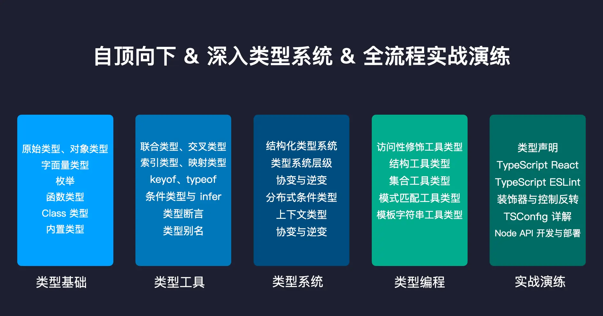

# 1.开篇：用正确的方式学习 TypeScript

最近，软件开发设计公司 The Software House 针对 2022 年前端市场状态的调查显示，84% 的受访者都在使用 TypeScript，43% 的受访者甚至认为 TypeScript 将超越 JavaScript 成为前端开发的主要语言。

无论 TypeScript 是否会超越 JavaScript，可以肯定的是，TypeScript 已被开发人员普遍接受，和 ES6 语法以及前端框架一起，被视为前端开发领域的基础工具。但是，关于 TypeScript 的质疑却一直没有减少，比如：

-   TypeScript 限制了 JavaScript 的灵活性；
-   TypeScript 并不能提高应用程序的性能；
-   TypeScript 开发需要更多额外的类型代码。

这些质疑其实可以归纳为一点：**TypeScript 会影响实际项目的开发效率**。事实真的是这样吗？

## 为什么说 TypeScript 可能超越 JavaScript？

我们知道，JavaScript 一直以灵活性著称。在实际开发时，我们不需要确定一个变量的类型，就能直接访问可能并不存在的属性，所以无需为每一步操作都定义类型。在小型项目中，这种灵活性可以有效提高开发效率，帮助我们掌控全局。

但随着项目规模的增大，这些变量类型的数量也会成倍增加，你总有记错、遗漏的时候。此时，灵活性就变成了埋在项目内的定时炸弹。在《[Top 10 JavaScript errors from 1000+ projects](https://link.juejin.cn/?target=https%3A%2F%2Frollbar.com%2Fblog%2Ftop-10-javascript-errors%2F)》 中，最常见的错误就是 `Cannot read property 'xxx' of undefined`、`undefined is not a function` 等。这些错误就是我们过度依赖灵活性的后果，一旦它们被触发，就会导致你的页面白屏、卡死，甚至崩溃。

**要解决灵活性带来的隐患，我们需要的是类型。更准确地说，是项目开发时的类型检查能力。** TypeScript 通过易上手且功能强大的类型系统，为 JavaScript 提供了强大的类型检查能力。在类型的帮助下，我们无需实际运行代码，就能通过类型的流转观察到变量的值是如何改变的。同时，类型的标记也能帮助我们确保每一处访问、赋值与操作的类型是符合预期的，有效减少我们需要承受的心智负担。

由于类型的引入，**TypeScript 的确限制了 JavaScript 的灵活性，但也增强了项目代码的健壮性**，并且对于其他同属于灵活性的代表特性，如 this、原型链、闭包以及函数等，TypeScript 丝毫没有限制。

但是，想要获得类型的帮助，我们需要额外的类型代码。这会影响开发效率吗？会有影响，但更多是正向的。

首先，要实现类型的精确标注，我们并不一定需要大量的类型代码。就像你给变量 A 新增一些属性得到变量 B，你会完全重新声明这两个变量的值吗？不会。在类型层面也是一样，变量 B 的类型会基于变量 A 的类型派生得到，它们并不是两个完全独立的类型。基于这一方式，我们就能让类型之间存在紧密的关联，减少冗余的类型代码。

其次，当项目规模增大到某一阈值后，这些类型代码会是你开发时最得力的助手，让你有底气大胆地进行各种逻辑操作，不需要先把这些值都打印出来确认一遍。同时，由于 TypeScript 强大的类型推导能力，随着你对变量进行各种操作，TypeScript 就会自动地推导出变量最终的类型。你只需要确保类型符合，最终的结果就是符合你预期的。而在你敲击下 `.` 来访问一个变量的属性时，TypeScript 也会将所有的属性展示出来供你挑选。这就是类型代码对开发效率的提升所在。

而在最终编译时，TypeScript 又会将这些类型代码抹除，还给你可以直接放进浏览器里跑的、纯粹的 JavaScript 代码。因此，TypeScript 确实不能提高应用程序的性能，因为最终运行的仍然是 JavaScript。

总的来说，TypeScript 对开发效率的影响和项目的规模息息相关。在小项目中，TypeScript 确实不可避免地降低了项目的开发效率。但如果我们放眼于项目的整个生命周期，得益于严密的类型检查与如臂使指的类型推导，TypeScript 不仅避免了 JavaScript 灵活性可能会带来的隐患，还能让你在面对 Bug 时更快地定位问题，让程序跑得更稳定一些！从这个方面来说，TypeScript 对开发效率的提升是终身制的。

## 如何系统学习 TypeScript？

随着越来越多的前端开发者开始尝试学习和使用 TypeScript，理论上 TypeScript 应该已经完全取代 JavaScript 了，但实际上并没有。一方面，就像我们前面所说，项目规模较小或部分开发者仍然更偏爱灵活的 JavaScript 。另一方面，作为 JavaScript 中不存在的概念，类型能力相关的学习成本让很多开发者停留在入门阶段，无法前进。

许多时候，**高昂的学习成本往往来自于我们对 TypeScript 不正确的认知，以及错误的学习路径**。比如说，有人认为“把类型相关的概念学习完就算掌握 TypeScript 了”，有人过了一遍文档和社区文章，简单地上手使用一下，就觉得自己的 TypeScript 水平已经相当不错了。

首先，通过社区资源自学并没有什么问题，但好内容太少，找起来也需要很多时间。其次，任何知识点都不能孤立地学习。不然在实际开发时，遇到一个复杂点的类型编程场景，我们就束手无策了。

那么，我们到底该怎么学习 TypeScript 呢？**学习没有捷径，最好的学习方法就是先建立起对事物的全面认知，然后由浅入深地系统学习。** 这里的“全面”如何理解？我们首先要了解 TypeScript 是由哪些部分组成的。相对严谨来说，TypeScript 由三个部分组成：**类型、语法与工程**。我们可以从这三个部分入手，来建立起一个全面、系统的学习路径。

首先是**类型能力**。它是最核心的部分，也是学习成本最高的部分。它为 JavaScript 中的变量、函数等概念提供了类型的标注，同时内置了一批类型工具，基于这些类型工具我们就能实现更复杂的类型描述，将类型关联起来。你可以从最简单的类型开始，每学到一个新的类型能力就添加上去，思考它和已掌握部分的交相融合，以此一步步掌握整个类型系统。

接着是**语法部分**。TypeScript 提前支持了一些已经到达 Stage 3 / 4 阶段，或是比较重要的 TC39 提案，比如使用最多的可选链（`?.`）、空值合并（`??`）、装饰器等，这些语法都已经或即将成为 ECMAScript Next 的新成员。在 TypeScript 中使用这些新语法时，你只需要简单的配置就能实现语法的降级，让编译后的代码可以运行在更低的浏览器或 Node 版本下。这一部分几乎没有学习成本，他们就像语言的 API，你只需要多提醒自己去使用，及时查询官方文档就能熟悉了。

类型能力与新语法确实很棒，但浏览器不认怎么办？TypeScript 会在构建时被抹除类型代码与语法的降级。这一能力就是通过 TypeScript Compiler（tsc）实现的。tsc 以及 tsc 配置（TSConfig）是 TypeScript 工程层面的重要部分。除此以外，TypeScript 工程能力的另一重要体现就是，我们可以通过类型声明的方式，在 TypeScript 中愉快地使用 JavaScript 社区的大量 npm 包。

类型、语法、工程其实也代表了三个不同阶段使用 TypeScript 目的：**为 JavaScript 代码添加类型与类型检查来确保健壮性，提前使用新语法或新特性来简化代码，以及最终获得可用的 JavaScript 代码。因此，类型-语法-工程，也是学习 TypeScript 的最佳路径。**

## 这门课程是如何设计的？

按照我们上面讲到的学习路径，这门课程也将分为**类型能力篇、语法篇和工程实践篇**。从下图中也能看出，我们会将重点更多地放在类型部分。

我们会从 TypeScript 的类型基础开始学习，然后到泛型、条件类型等这些首次见面的类型工具。在这些类型工具的学习与使用中，我们会遇到许多困惑。这时不妨转换下方向，来了解 TypeScript 的类型系统，包括它是如何进行类型比较的，以及整个类型世界的运行规则是怎样的。这一步将帮助你从根源上理解 TypeScript 的类型能力设计与底层运行规则。

掌握了类型工具与类型系统后，我们才会学习类型能力最复杂的概念：类型编程。这部分我们会从内置工具类型讲解到内置工具类型进阶，带你循序渐进地掌握类型编程中的 4 大范式。

通过这一路线，你将建立起全面的 TypeScript 类型能力知识体系，懂得如何结合使用各种类型工具来进行类型编程，如何独立解决各种类型报错，以及最重要的能力——理解类型世界的基本规则与运行规律。

迈过了类型这座大山以后，我们将面对新朋友：语法，它们比类型部分轻松友好多了。我们会从 TypeScript 与 ECMAScript 的关系开始说起，介绍这些新语法的使用，对其中的重量级角色装饰器，我们更会搭配实战。

在最后的工程部分，除了我们已经提到的 tsc 以及 TSConfig ，我们还会有更多的工程场景实战，类型声明与类型指令，与 React / ESLint 等框架或工具的紧密结合，开发并部署一个基于 TypeScript 的 Node API 。就像这本小册的名字《 TypeScript 全面进阶指南 》一样，我们的目标是全方位、无死角地掌握 TypeScript 。

## 写在最后

无论你处于哪个阶段，只要想开始学习 TypeScript，这门课程就是适合你的。只要你沿着课程中给出的路线，完成这一路上的各种任务，就一定能从新手成功迈向高级玩家。

同时我也希望，你可以把它当作一本备忘手册，时常回顾和翻阅。比如说，当你忘记了 never 类型的具体意义，当你忘记了 tsconfig 的某一个配置具体作用，当你忘记了某一类工具类型的实现原理，你都可以回来在小册中找到答案。

最后，也欢迎你在交流群或 GitHub 仓库的 issue 区，与我交流 TypeScript 学习路上的问题。除了与其他读者互相交流解惑以外，我也会安排固定的答疑时间来统一解决问题，期待与你一同进步。

> ## 课程中的代码
>
> 小册中的所有代码都会存放在 **[TypeScript-Tiny-Book](https://github.com/linbudu599/TypeScript-Tiny-Book)** 这个仓库里，基于 Monorepo 架构来隔离了各个不同部分的示例代码，同时在每一节也会给出对应代码的地址。