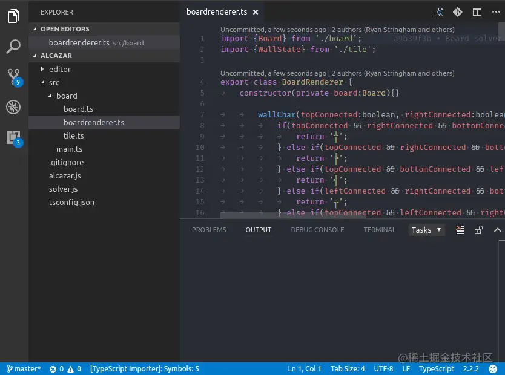
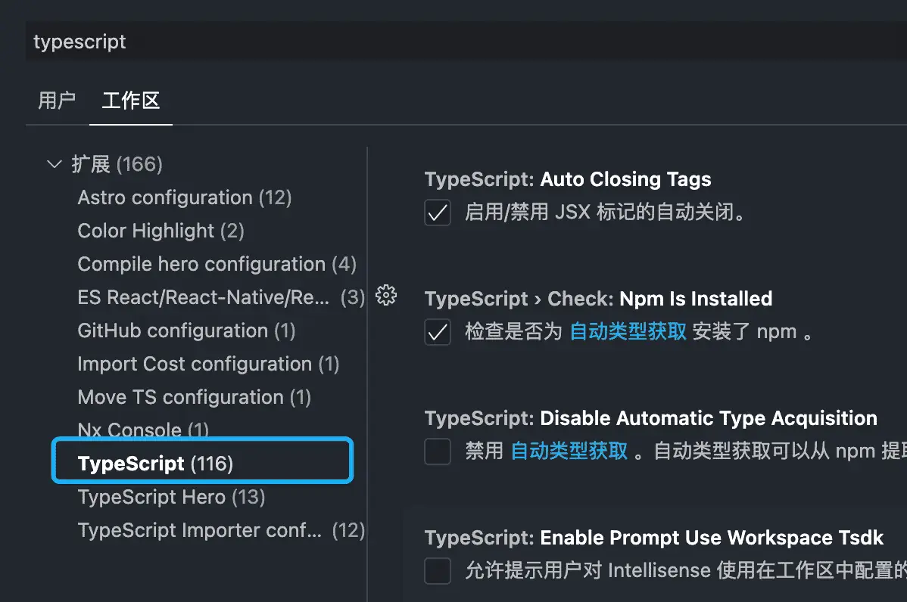
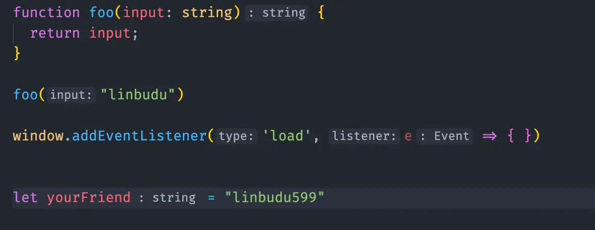
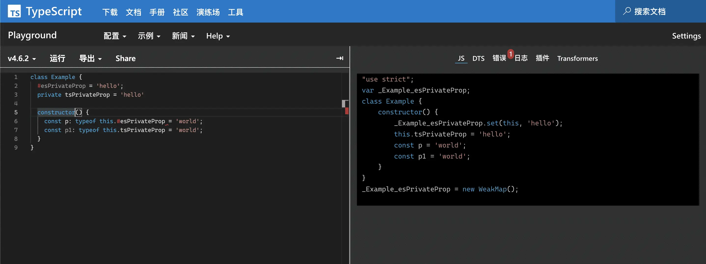
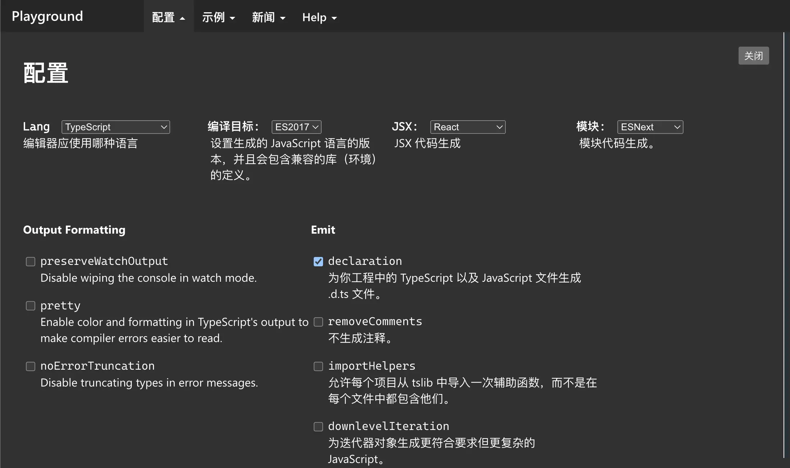

# 2.工欲善其事：打造最舒适的 TypeScript 开发环境

在正式开始小册的学习前，我们还有一件事要做，那就是搭建 TypeScript 的开发环境。一个舒适、便捷且顺手的开发环境，不仅能大大提高学习效率，也会对我们日常的开发工作有很大帮助。

这一节我们就来介绍 VS Code 下的 TypeScript 环境搭建：插件以及配置项。对于 TS 文件的执行，我们会介绍 ts-node、ts-node-dev 等工具，帮助你快速验证 TS 代码的执行结果。而如果你只想快速开始学习，我们也会介绍 TypeScript 官方提供的 TypeScript Playground，利用它你可以快速开始编写及分享 TS 代码。最后，我们还会介绍如何通过 TS 声明的方式来检查类型兼容性。

话不多说，我们快点开始吧~

> 本节代码见：[Starter](https://github.com/linbudu599/TypeScript-Tiny-Book/tree/main/packages/00-starter)

## VS Code 配置与插件

VS Code 本身就是由 TypeScript 编写的，因此它对 TypeScript 有着非常全面的支持，包括类型检查、补全等功能，我们需要的两个 TS 插件都来自于社区，这两个插件分别提供了**类型的自动导入**，和**快速移动 TypeScript 文件**的能力。

首先是 [TypeScript Importer](https://marketplace.visualstudio.com/items?itemName=pmneo.tsimporter) 。这一插件会收集你项目内所有的类型定义，在你敲出`:`时提供这些类型来进行补全。如果你选择了一个，它还会自动帮你把这个类型导入进来。效果如图所示：


这一功能在日常开发中真得非常非常好用，尤其是当项目里有数百个声明分散在各个文件中时。

[Move TS](https://marketplace.visualstudio.com/items?itemName=stringham.move-ts)，这一插件在重构以及像我们这样写 demo 的场景下很有帮助。它可以让你通过编辑文件的路径，直接修改项目的目录结构。比如从`home/project/learn-interface.ts` 修改成 `home/project/interface-notes/interface-extend.ts`，这个插件会自动帮你把文件目录更改到对应的样子，并且更新其他文件中对这一文件的导入语句。



当然，对于 VS Code 内置的 TypeScript 支持，我们也可以通过一些配置项获得更好的开发体验。首先，你需要通过 Ctrl(Command) + Shift + P 打开命令面板，找到「打开工作区设置」这一项。


然后，在打开的设置中输入 typescript，筛选出所有 TypeScript 有关的配置，点击左侧的"TypeScript"，这里才是官方内置的配置。



我们需要做的就是开启一些代码提示功能（hints），我们知道 TS 能够在很多地方进行类型地自动推导，但你往往要把鼠标悬浮在代码上才能看到推导得到的类型，其实我们可以通过配置将这些推导类型显示出来：

在前面配置搜索处，搜索 'typescript Inlay Hints'，展示的配置就都是提示相关的了，推荐开启的有这么几个：

- Function Like Return Types，显示推导得到的函数返回值类型；
- Parameter Names，显示函数入参的名称；
- Parameter Types，显示函数入参的类型；
- Variable Types，显示变量的类型。

以上选项开启后的效果如下：



当然，并不是所有人都习惯这样的显示方式，你可以根据自己的需要进行调整。除了这些提示的配置以外，VS Code 还支持了百余项 TS 配置，你可以看看是否有你需要的配置。

### 其他插件

除了 TS 强相关的插件与配置，还有一些额外的、能提升你学习效率的插件，你可以依据自己的喜好进行添加，以下的插件列表将会不定期进行更新。

- [ErrorLens](https://marketplace.visualstudio.com/items?itemName=PhilHindle.errorlens)，这一插件能够把你的 VS Code 底部问题栏的错误下直接显示到代码文件中的对应位置，比如这样：

  

## Playground：懒人福音

如果你只是想拥有一个简单的环境，能写 TypeScript，能检查错误，能快速地调整 tsconfig，那官方提供的 [Playground](https://www.typescriptlang.org/zh/play) 一定能满足你的需求。



你可以在这里编写 TS 代码，快速查看编译后的 JS 代码与声明文件，还可以通过 Shift + Enter 来执行 TS 文件。可以说，如果不需要 VS Code 更强大的提示能力与一些特殊插件、主题等，Demo 学习使用 Playground 真的够够的了。

Playground 最强大的能力其实在于，支持非常简单的配置切换，如 TS 版本（左上角 ），以及通过可视化的方式配置 tsconfig （左上角的配置）等，非常适合在这里研究 tsconfig 各项配置的作用。



## TS 文件的快速执行：ts-node 与 ts-node-dev

当然，如果你主要是想执行 TypeScript 文件，就像 `node index.js` 这样快速地验证代码逻辑，这个时候你就需要 [ts-node](https://github.com/TypeStrong/ts-node) 以及 [ts-node-dev](https://github.com/wclr/ts-node-dev) 这一类工具了。它们能直接执行 ts 文件，并且支持监听文件重新执行。同时，它们也支持跳过类型检查这一步骤来获得更快的执行体验。

对于 ts-node，你可以将其安装到项目本地或直接全局安装，我个人更推荐安装到全局然后配置 alias 快速启动，像 `tsn index.ts` 这样。执行以下命令将 ts-node 与 typescript 安装到全局：

```bash
$ npm i ts-node typescript -g
```

然后，在项目中执行以下命令创建 TypeScript 的项目配置文件： tsconfig.json。

```typescript
npx --package typescript tsc --init
// 如果全局安装了 TypeScript，可以这么做
tsc --init
```

接着，创建一个 TS 文件：

```typescript
console.log("Hello TypeScript");
```

再使用 ts-node 执行：

```bash
ts-node index.ts
```

如果一切正常，此时你的终端能够正确地输出字符。ts-node 可以通过两种方式进行配置，在 tsconfig 中新增 `'ts-node'` 字段，或在执行 ts-node 时作为命令行的参数，这里我们主要介绍通过命令行进行常用配置的方式。

- `-P,--project`：指定你的 tsconfig 文件位置。默认情况下 ts-node 会查找项目下的 tsconfig.json 文件，如果你的配置文件是 `tsconfig.script.json`、`tsconfig.base.json` 这种，就需要使用这一参数来进行配置了。
- `-T, --transpileOnly`：禁用掉执行过程中的类型检查过程，这能让你的文件执行速度更快，且不会被类型报错卡住。这一选项的实质是使用了 TypeScript Compiler API 中的 transpileModule 方法，我们会在后面的章节详细讲解。
- `--swc`：在 transpileOnly 的基础上，还会使用 swc 来进行文件的编译，进一步提升执行速度。
- `--emit`：如果你不仅是想要执行，还想顺便查看下产物，可以使用这一选项来把编译产物输出到 `.ts-node` 文件夹下（需要同时与 `--compilerHost` 选项一同使用）。

除了直接使用 ts-node 以外，你也可以通过 node + require hook 的形式来执行 TS 文件：

```bash
node -r ts-node/register index.ts
```

但此时，如果想要传递参数给 ts-node ，你就需要使用环境变量了，比如要传递之前的 transpileOnly 选项：

```bash
TS_NODE_TRANSPILE_ONLY=true node -r ts-node/register index.ts
```

关于选项对应的环境变量，请参考 ts-node 的官方文档了解更多。

ts-node 本身并不支持自动地监听文件变更然后重新执行，而这一能力又是某些项目场景下的刚需，如 NodeJs API 的开发。因此，我们需要 [ts-node-dev](https://github.com/wclr/ts-node-dev) 库来实现这一能力。ts-node-dev 基于 [node-dev](https://github.com/fgnass/node-dev)（你可以理解一个类似 nodemon 的库，提供监听文件重新执行的能力） 与 [ts-node](https://github.com/TypeStrong/ts-node) 实现，并在重启文件进程时共享同一个 TS 编译进程，避免了每次重启时需要重新实例化编译进程等操作。

首先，我们还是在全局安装：

```bash
npm i ts-node-dev -g
```

ts-node-dev 在全局提供了 `tsnd` 这一简写，你可以运行 `tsnd` 来检查安装情况。最常见的使用命令是这样的：

```bash
ts-node-dev --respawn --transpile-only app.ts
```

respawn 选项启用了监听重启的能力，而 transpileOnly 提供了更快的编译速度。你可以查看官方仓库来了解更多选项，但在大部分场景中以上这个命令已经足够了。

## 更方便的类型兼容性检查

某些时候，我们在进行类型比较时，需要使用一个具有具体类型的变量与一个类型进行赋值操作，比如下面这个例子中：

```typescript
interface Foo {
  name: string;
  age: number;
}

interface Bar {
  name: string;
  job: string;
}

let foo:Foo = {
  name: '林不渡',
  age: 18
}

let bar:Bar = {
  name: '林不渡',
  job: 'fe'
}

foo = bar;
```

在“只是想要进行类型比较”的前提下，其实并没有必要真的去声明两个变量，即涉及了值空间的操作。我们完全可以只在类型空间中（你可以理解为**用于存放 TypeScript 类型信息的内存空间**）比较这些类型，只需要使用 declare 关键字：

```typescript
interface Foo {
  name: string;
  age: number;
}

interface Bar {
  name: string;
  job: string;
}

declare let foo: Foo;
declare let bar: Bar;

foo = bar;
```

你可以理解为在开始时的例子，我们使用一个值空间存放这个变量具体的属性，一个类型空间存放这个变量的类型。而通过 declare 关键字，我们声明了一个仅在类型空间存在的变量，它在运行时完全不存在，这样就避免了略显繁琐的属性声明。

对于类型兼容的检查，除了两两声明然后进行赋值以外，我们还可以通过工具类型的形式，如 [tsd](https://www.npmjs.com/package/tsd) 这个 npm 包提供的一系列工具类型，能帮助你进行声明式的类型检查：：

```typescript
import { expectType } from 'tsd';

expectType<string>("linbudu"); // √
expectType<string>(599); // ×
```

> 这一部分的内容并不是初学需要掌握的，但你可以选择提前用起来，不必急着去理解具体的实现原理。

它的结构大致是这样：`expectType<你预期的类型>(表达式或变量等)`，除了 `expectType`（检查预期类型与表达式或变量的类型是否一致），tsd 还提供了 `expectNotType`（检查预期类型与表达式或变量的类型是否不同）、`expectAssignable`（检查表达式或变量的类型是否能赋值给预期类型）等工具类型，其中涉及工具类型与泛型的知识，我们会在后面的课程中一一讲解。

## 总结

在这一节中，我们主要了解了 TypeScript 开发环境的搭建，包括了 VS Code 的配置、插件，使用 Playground 作为一个简易又强大的临时编辑器，以及如何使用 ts-node 与 ts-node-dev 来快速执行你的 ts 文件。在最后，我们稍微提前了一些对后面学习大有裨益的知识，即通过类型声明（declare）与 tsd 来进行更方便的类型兼容性检查。

这些知识不仅仅只在这本小册的学习过程中起到作用，它们在未来实际项目开发中也是你的得力助手。本着磨刀不误砍柴工的原则，请务必搭建出你最舒适的 TypeScript 开发环境后，再开始这本小册的学习。

## 扩展阅读

### require extension

我们知道，node 中最早使用的是 CommonJs 与 require 来进行模块的导入，除了 `.js` 文件的导入以外，node 中还支持以扩展的形式来提供自定义扩展名的模块加载机制，这也是 ts-node、[require-ts](https://www.npmjs.com/package/@adonisjs/require-ts) （允许你去 require 一个 TS 文件）这些工具库的工作原理，它们的核心逻辑其实都是通过 `require.extension`，注册了 `.ts` 文件的处理逻辑：

```typescript
require.extenstions['.ts'] = function (module, filename) {
  const content = fs.readFileSync(filename, 'utf8')
  module._compile(content, filename)
}
```

在 require-ts 中，使用了 [pirates](https://www.npmjs.com/package/pirates) 这个库来简化注册逻辑：

```typescript
const compiler = new Compiler();

addHook(
  (code, filename) => {
    return compiler.compile(filename, code)
  },
  { exts: ['.ts', '.tsx'], matcher: () => true }
)
```

NodeJs 中的 require 逻辑执行大概是这样的：

- Resolution，基于入参拼接出 require 文件的绝对路径，当路径中不包含后缀名时，会按照 node 的模块解析策略来进行处理，如 `require('./utils')` 会解析到 `PATH/TO/project/utils.js`，而 `require('project-utils')` 会解析到 `PATH/TO/project/node_modules/project-utils/src/index.js`，以及内置模块等。需要注意的是在浏览器中，require **需要带上完整的后缀名**（浏览器并不能查找服务器的文件），但一般 bundler 会帮你处理好。
- 基于绝对路径，去 `require.cache` 这个全局变量中，查找此文件是否已经已缓存，并在存在时直接使用缓存的文件内容（即这个文件的导出信息等）。
- Loading，基于绝对路径实例化一个 Module 类实例，基于路径后缀名调用内置的处理函数。比如 js、json 文件都是通过 `fs.readFileSync` 读取文件内容。
- Wrapping，对于 js 文件，将文件内容字符串外层包裹一个函数，执行这个函数。对于 Json 文件，将内容包裹挂载到 `module.exports` 下。
- Evaluating，执行这个文件内容。
- Caching，对于未曾缓存的文件，将其执行结果缓存起来。

在上述过程中进行操作拦截，就可以实现很多有用的功能。比如对 `.ts` 文件去注册自定义的处理函数，将其编译为可以直接执行的 js 代码（`ts-node/register`），对 `.js` 代码进行预处理（babel-register），在代码执行时进行覆盖率统计（istanbul）。以及，对 `require.cache` 进行缓存清除来实现 node 服务的热更新（decache），但这里涉及到 require cache 的缓存策略，与本小册的主题没有太大关联，就不做展开啦。