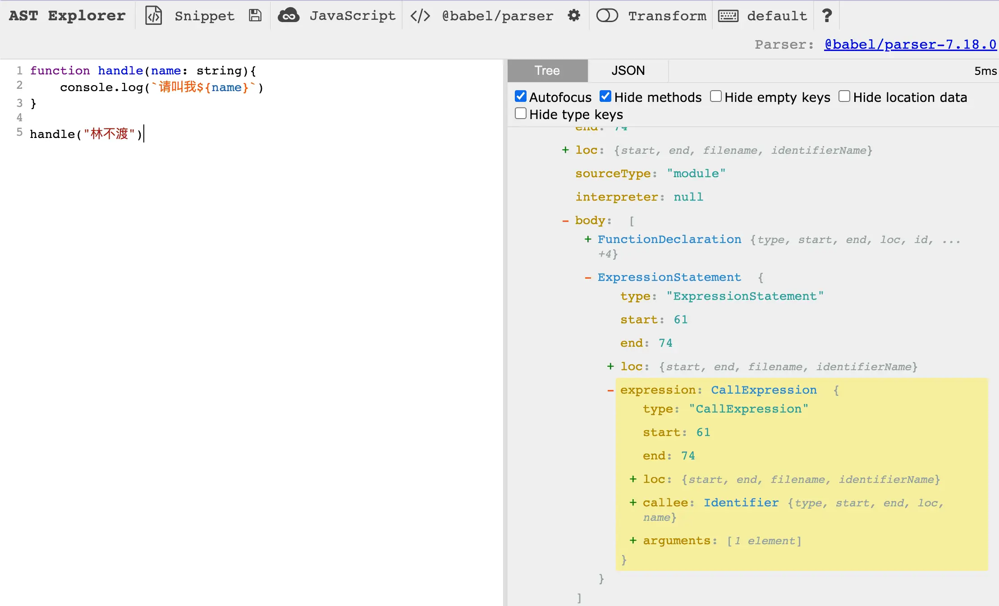
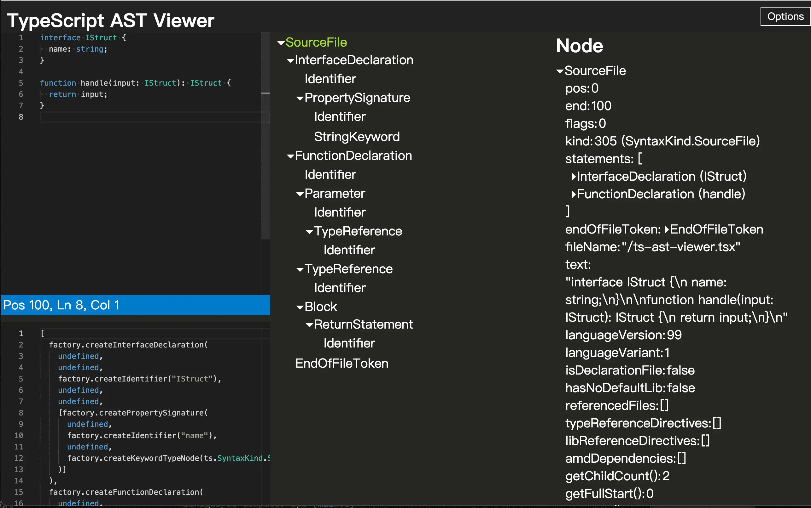
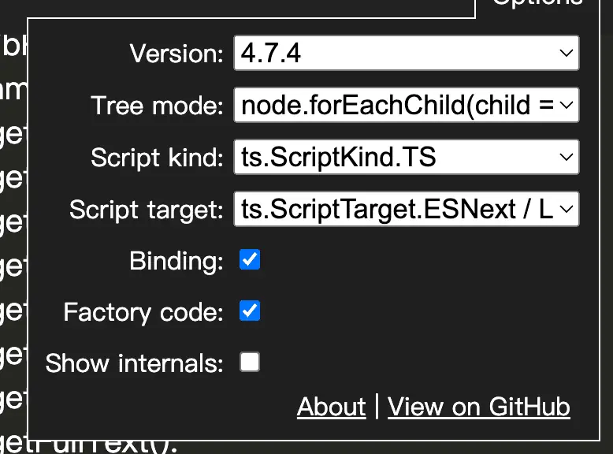
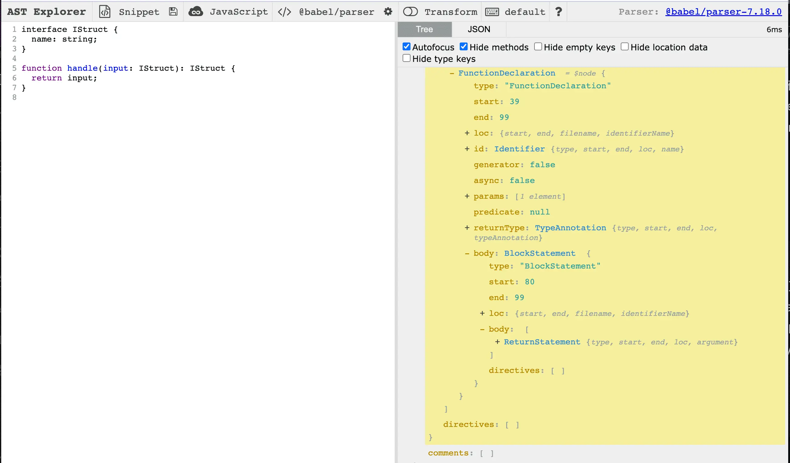
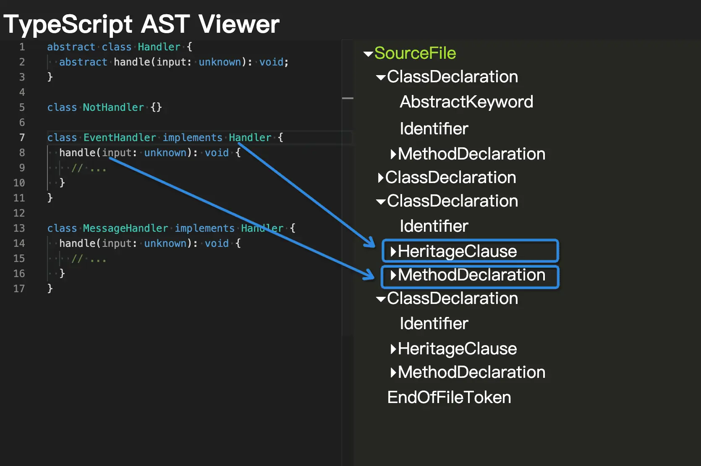
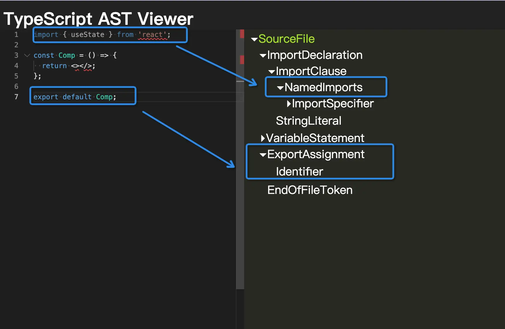
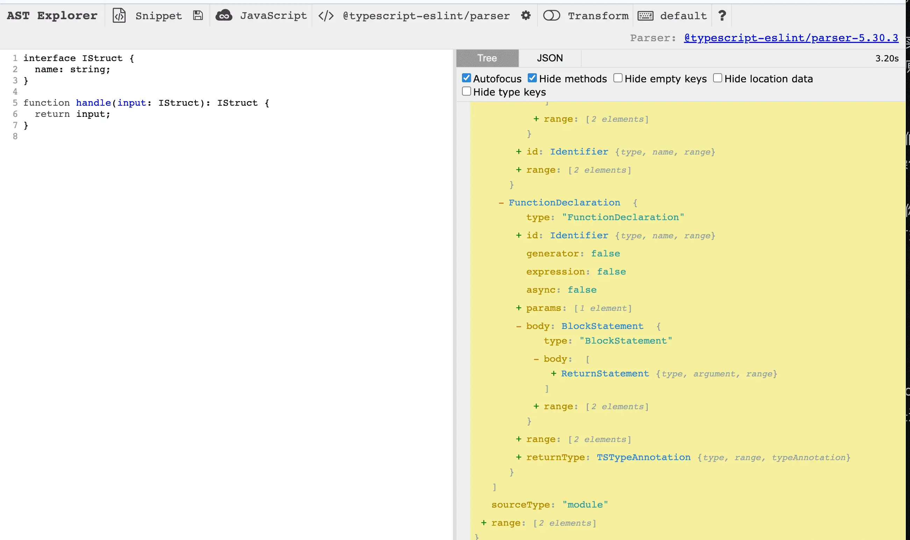

# 31.玩转 TypeScript AST：AST Checker 与 CodeMod

## 前置知识：Babel 的基本工作流程

在本节的最开始，我有必要郑重说明下，我本身并不是科班出身，没有系统学习过编译原理，以下涉及编译原理的概念大部分来自于在社区的学习所得，也欢迎你指出其中的错误，我将认真对待并修正。

> 本节原本是被作为短小精悍的漫谈篇呈现的，但有部分同学反馈对这部分知识确实有刚需，因此进行了大量内容扩充后加入到正文篇中。

对大部分前端同学来说，提到编译原理第一时间想到的就是 Babel，即使你没有直接使用过它，也一定间接地接触过，不论是已经搭建好的项目还是更底层的 Webpack 与 Babel Loader 。

而 Babel 的作用你应该也至少了解过一些，其实它的核心功能就是**语法降级**。是的，就是 TypeScript 在编译时会进行的类型擦除与语法降级中的那个语法降级，Babel 的曾用名是 6to5，意为将 ES6 代码转换为 ES5 代码。这是因为，当时 ES6 已经算是时代的弄潮儿了，很多浏览器还无法完全支持其中的特性，这就需要 Babel 将其转换为能够在更低版本的浏览器上运行的代码。而它现在的这个名字，意为巴别塔，是圣经中记载的一座通天之塔，当时的人们只有一种语言，彼此之间精诚合作，尝试联合起来建立起通往天堂的高塔，而上帝为了阻止这一行动，让人类之间使用不同的语言，彼此之间无法沟通，而计划最终自然失败。Babel 使用这一名字，正是为了更好地宣告自己的使命：**让所有各不相同的 JavaScript 语法，最终都能转换为能在相同环境下直接运行的代码**。

可你是否了解 Babel 的工作流程？

从功能角度，Babel 的[源码](https://github.com/babel/babel)大致可以分为这么几个部分：

- 核心部分，包括 [Parser](https://github.com/babel/babel/blob/main/packages/babel-parser/README.md)、[Transformer](https://github.com/babel/babel/tree/main/packages/babel-traverse) 以及 [Generator](https://github.com/babel/babel/tree/main/packages/babel-generator)，它们主要负责对源码的解析、转换以及生成等工作。一份源码首先会被 Parser 通过词法分析与语法分析，转换为 AST，也就是抽象语法树的形式，然后由 Transformer 对这棵语法树上的 AST 结点进行遍历处理，比如将所有的函数声明转换为函数表达式，最后由 Generator 基于处理完毕的 AST 结点转换出新的代码，就实现了语法的降级。

  AST其实就是将代码的每个部分进行拆分，得到一棵树形的结构表示，你可以在 [AST Explorer](https://astexplorer.net/) 上，实时查看一段代码转换完毕的 AST 结构。

  

- 插件相关，如 `babel-plugin-syntax-jsx` `babel-plugin-transform-for-of` 以及 `babel-plugin-proposal-decorators` 等，上面的核心部分只包括最简单的处理逻辑，如果你想转换 JSX 代码，想将 for...of 降级为 for 循环，想使用装饰器等语法，就需要这些插件来支持，这些插件其实就是遍历 AST 时，对目标的 AST 结点注册处理逻辑。一般来说一个插件只会关注一种特定的语法。当然，每个浏览器支持的语法版本都是差异巨大的，因此我们需要 `babel-preset-env`，自动地基于浏览器版本去确定需要使用的插件。

除了依赖 Babel Loader 这样的工具来进行源码的转换以外，其实你也可以使用 `@babel/core`，来编程式地调用 Babel 的 Compiler API ，并对应地配置插件、预设等等。

可以看到，在工作流程中其实有一样东西贯穿了整个过程，那就是 AST 。而这也是我们本节所关注的：如何玩转 TypeScript 的 AST。

## 使用 TypeScript Compiler API

编译处理 TypeScript 代码，我们其实仍然可以使用 Babel，但实际上 TypeScript 本身就将几乎所有 Compiler API 都暴露了出来，也就是说如果你希望更贴近 tsc 的行为，其实更应该使用 TypeScript Compiler API 。

然而相比 Babel，TS Compiler API 的使用成本要高一些。我们直接看一个官方例子的精简版本，大致感受下其使用方式即可：

> 由于本节的重点并不是详细介绍 Compiler API 的使用，因此并不会对其进行非常详细介绍。

```typescript
import ts from 'typescript';

function makeFactorialFunction() {
  // 创建代表函数名 factorial 的 Identifier 结点
  const functionName = ts.factory.createIdentifier('factorial');
  // 创建代表参数名 n 的 Identifier 结点
  const paramName = ts.factory.createIdentifier('n');
  // 创建参数类型结点
  const paramType = ts.factory.createKeywordTypeNode(
    ts.SyntaxKind.NumberKeyword
  );

  // 创建参数的声明
  const parameter = ts.factory.createParameterDeclaration(
    undefined,
    [],
    undefined,
    paramName,
    undefined,
    paramType
  );

  // 创建表达式 n ≤ 1
  const condition = ts.factory.createBinaryExpression(
    // n
    paramName,
    // ≤
    ts.SyntaxKind.LessThanEqualsToken,
    // 1
    ts.factory.createNumericLiteral(1)
  );

  // 创建代码块
  const ifBody = ts.factory.createBlock(
    // 创建代码块内的返回语句
    [ts.factory.createReturnStatement(ts.factory.createNumericLiteral(1))],
    true
  );

  // 创建表达式 n - 1
  const decrementedArg = ts.factory.createBinaryExpression(
    paramName,
    ts.SyntaxKind.MinusToken,
    ts.factory.createNumericLiteral(1)
  );

  // 创建表达式 n * factorial(n - 1)
  const recurse = ts.factory.createBinaryExpression(
    paramName,
    ts.SyntaxKind.AsteriskToken,
    // 创建函数调用表达式
    ts.factory.createCallExpression(functionName, undefined, [decrementedArg])
  );

  const statements = [
    // 创建 IF 语句
    ts.factory.createIfStatement(condition, ifBody),
    // 创建 return 语句
    ts.factory.createReturnStatement(recurse),
  ];

  // 创建函数声明
  return ts.factory.createFunctionDeclaration(
    undefined,
    [ts.factory.createToken(ts.SyntaxKind.ExportKeyword)],
    undefined,
    functionName,
    undefined,
    [parameter],
    // 函数返回值类型
    ts.factory.createKeywordTypeNode(ts.SyntaxKind.NumberKeyword),
    // 函数体
    ts.factory.createBlock(statements, true)
  );
}

// 创建一个虚拟的源文件
const resultFile = ts.createSourceFile(
  './source.ts',
  '',
  ts.ScriptTarget.Latest,
  false,
  ts.ScriptKind.TS
);

const printer = ts.createPrinter({ newLine: ts.NewLineKind.LineFeed });

const result = printer.printNode(
  ts.EmitHint.Unspecified,
  makeFactorialFunction(),
  resultFile
);

console.log(result);
```

这么一长串代码，最后会生成这样的一段函数声明：

```typescript
export function factorial(n: number): number {
  if (n <= 1) {
    return 1;
  }
  return n * factorial(n - 1);
}
```

在这个例子中，我们从最基础的 identifier （代表变量名的结点）开始创建，组装参数、if 语句条件与代码块、函数的返回语句，最后通过 `createFunctionDeclaration` 完成组装。要想流畅地使用，你需要对 Expression、Declaration、Statement 等 AST 的结点类型有比较清晰地了解，比如上面的 If 语句需要使用哪些 token 来组装，还需要了解 TypeScript 的 AST，如 interface、类型别名、装饰器等实际的 AST 结构。

TypeScript Compiler API 和 Babel、JSCodeShift 等工具的使用方式都不同，Babel 是声明式的 Visitor 模式，我们声明对哪一部分语句做哪些处理，然后 Babel 在遍历 AST 时（`@babel/traverse`），发现这些语句被注册了操作，就进行对应地执行：

> 以下示例来自于神光的文章分享，也推荐各位有兴趣进一步学习编译原理的同学关注神光老师的社区分享。

```typescript
const { declare } = require("@babel/helper-plugin-utils");

// 不允许函数类型的赋值
const noFuncAssignLint = declare((api, options, dirname) => {
  api.assertVersion(7);

  return {
    pre(file) {
      file.set("errors", []);
    },
    visitor: {
      AssignmentExpression(path, state) {
        const errors = state.file.get("errors");
        const assignTarget = path.get("left").toString();
        const binding = path.scope.getBinding(assignTarget);
        if (binding) {
          if (
            binding.path.isFunctionDeclaration() ||
            binding.path.isFunctionExpression()
          ) {
            const tmp = Error.stackTraceLimit;
            Error.stackTraceLimit = 0;
            errors.push(
              path.buildCodeFrameError("can not reassign to function", Error)
            );
            Error.stackTraceLimit = tmp;
          }
        }
      },
    },
    post(file) {
      console.log(file.get("errors"));
    },
  };
});
```

而 jscodeshift 则提供的是命令式的 API：

```typescript
module.exports = function (fileInfo, api) {
  return api
    .jscodeshift(fileInfo.source)
    .findVariableDeclarators("foo")
    .renameTo("bar")
    .toSource();
};
```

虽然命令式看起来很简单，但却可能导致对 AST 节点的遗漏（如果底层封装没有完全覆盖掉边界情况），就像鱼和熊掌不可兼得一样。而 TypeScript Compiler API 同样属于命令式，只不过它的使用风格并非链式，而更像是组合式。

铺垫了这么多，是时候请出我们本节的主角了。

## 使用 ts-morph

上面的例子看下来，可能有部分同学已经被劝退了，这一堆眼花缭乱的 API，我咋知道啥时候该用哪个，难道还要先从头学一遍编译原理？

当然不，你可以永远相信 JavaScript 社区。为了简化 TypeScript AST 的操作，我们本节的主角 [ts-morph](https://www.npmjs.com/package/ts-morph) 诞生了，它的原名为 `ts-simple-ast`，从这两个名字你都能感受到它的目的：**让 AST 操作更简单一些**（morph 意为变形）。

我们直接来看它的使用方式，直观地感受下它是如何实现更简单的 AST 操作的：

```typescript
import path from 'path';
import chalk from 'chalk';
import { Project, SyntaxKind } from 'ts-morph';

// 实例化一个“项目实例”
const p = new Project();

// 将某个路径的文件添加到这个项目内
const source = p.addSourceFileAtPath(path.resolve(__dirname, './source.ts'));

/**
 * 创建一个接口
 *
 * interface IUser { }
 */
const interfaceDec = source.addInterface({
  name: 'IUser',
  properties: [],
});

// 新增属性
interfaceDec.addProperties([
  {
    name: 'name',
    type: 'string',
  },
  {
    name: 'age',
    type: 'number',
  },
]);

// 添加 JSDoc 注释 @author Linbudu
interfaceDec.addJsDoc({
  tags: [
    {
      tagName: 'author',
      text: 'Linbudu',
    },
  ],
});

// 添加泛型 T extends Record<string, any>
interfaceDec.addTypeParameter({
  name: 'T',
  constraint: 'Record<string, any>',
});

// 获取接口名称
interfaceDec.getName();

// 删除这个接口声明
interfaceDec.remove();

// 创建一条导入：import { readFile, rmSync } from 'fs';
const importDec = source.addImportDeclaration({
  namedImports: ['readFile', 'rmSync'],
  moduleSpecifier: 'fs',
});

// 新增具名导入 appendFile
importDec.addNamedImport('appendFile');
// 设置默认导入 fs
importDec.setDefaultImport('fs');

// 删除默认导入
importDec.removeDefaultImport();
// 删除命名空间导入
importDec.removeNamespaceImport();

// 删除这条导入声明
importDec.remove();
```

可以看到，ts-morph 提供了一系列直观的封装方法，只要调用这些方法就可以完成对 AST 的各种操作，包括新增、更新、删除、读取等等！

通过使用 ts-morph，你可以使用非常简便的方式来完成各种有趣好玩的操作，比如我们下面会讲到的为 React 组件添加 memo、检查并更新导入语句、从 JSON 文件转换到 TypeScript 类型等等。而实际实现中，当然也是基于 Compiler API 的封装，但是它屏蔽了 Statement、Expression、Declaration、Token 等等概念，直接提供给你应用层的实现：创建一个接口，添加泛型参数，添加属性，添加继承，将其设置为导出，完成！在这个过程中，你并不需要理解底层发生了哪些 AST 结点的变化和操作。

光是这样，其实还是具有一定使用成本，毕竟要对 AST 进行操作，还是需要分析出整个 AST 结构，以及定位到需要操作的目标 AST 结点。如果是和我一样没有学习过编译原理的同学，这一步仍然是天堑。

感谢万能的社区，我们可以使用 [TS-AST-Viewer](https://ts-ast-viewer.com/#) 这个在线网页来直观地检查一段代码的 AST 结构：



从左到右依次是输入的源码（左上）与对应的 Compiler API 代码（左下）、AST 结构以及其在 TypeScript 内部的编译产物。

你可以通过右上角的配置来调整 TS 版本等功能：



> 除了 TS AST Viewer 以外，此前你可能也使用过支持数十种语言或 SDL，以及其对应的 parser 的 [AST Explorer](https://astexplorer.net/)，它们的功能是类似的，但 AST Explorer 目前并不支持使用 TypeScript Compiler API 来解析 TS 代码：
>
> 

有了 TS AST Viewer，我们的操作流程就会变得非常流畅了。首先一级级向下找到目标 AST 结点，这一步我们可以使用 ts-morph 提供的 getFirstChildByKind 方法来获取一个 AST 结点内我们需要的子结点，“ByKind” 的 Kind 指的是  TypeScript Compiler API 内的 SyntaxKind 枚举，它描述了所有可能的 AST 结点类型。

拿到目标 AST 结点后，我们就可以调用上面已经提供好的方法（如导入声明的 `getModuleSpecifierValue` 方法可以直接获得此导入的模块名），最后保存即可。

最后，ts-morph 其实也并不能完全替代原生 Compiler API，它并没有对 Block 内的 AST 操作进行封装，比如最开始我们使用 Compiler API 创建函数的例子，如果换成 ts-morph ，那么对于函数体内的逻辑它是无能为力的，你要么直接写入字符串，要么将这部分仍然使用原生的 Compiler API 实现。

## AST Checker 与 CodeMod

了解了 ts-morph 的基本使用，接下来我们就通过几个具有实际意义的示例进一步掌握它。这些示例基本都是我遇见过的实际场景，如果不通过 AST 操作，就需要自己手动一个个处理。

这些操作其实可以分为两大类：AST Checker 与 CodeMod。其中 AST Checker 指的是完全不进行新增/更新/删除操作，只是通过 AST + 预设的条件检查源码是否符合要求，比如不允许调用某个方法、不允许默认导出、要求某个导入必须存在，都属于 AST Checker 的范畴。

> 关于 AST Checker 与 ESLint 的区别，请参考扩展阅读部分。

而 CodeMod 你此前可能已经使用过，它通常会在基础框架发生大版本更新时出现，用来降低使用者的迁移成本，比如 Antd Design 的 [codemod](https://www.npmjs.com/package/@ant-design/codemod-v4)，Material UI 的 [codemod](https://www.npmjs.com/package/@mui/codemod) 等，这些 codemod 会进行依赖升级、配置文件更新以及源码更新等操作，这里我们指的 codemod，其实就只是源码更新这一部分。它需要对源码进行新增、更新以及删除等等操作。

接下来我们会使用 ts-morph 来实现数个示例，它们没有什么难度，毕竟我们的目的在于熟悉“分析-定位-处理-保存”这个工作流程嘛。而且有了 ts-morph 的加持，很多 AST 操作的难度都会下降几个级别。

### 示例：导入语句

许多场景的 AST 操作中，其实都会涉及对导入语句的处理。比如 CodeMod 会将你旧版本的导入更新为新版本的导入，或者更换导入语句的导入路径（模块名），而在某些工程场景下，AST Checker 也会检查代码中是否进行了必需的 polyfill 导入。

我们的源码如下：

```typescript
import { readFileSync } from 'fs';
import 'some_required_polyfill';
```

操作后的代码如下：

```typescript
import 'some_required_polyfill';
import { readFile } from "fs/promises";
```

在这个例子中，我们希望进行两种操作：

- 将来自于 fs 的 sync api 导入，更换为来自 `fs/promise` 的 async api，如 `import { readFile } from 'fs/promises'`
- 检查是否存在对 `some_required_polyfill` 的导入

首先第一步，一定是分析源代码的 AST 结构：


整理一下思路：

- 将 fs 更改为 fs/promises
- 将来自 fs 的，以 Sync 结尾的导入进行更改
- 检查是否存在以 `some_required_polyfill` 为导入名的导入声明

直接看具体实现：

```typescript
import path from 'path';
import { Project, SyntaxKind, SourceFile, ImportDeclaration } from 'ts-morph';
import { uniq } from 'lodash';

const p = new Project();

const source = p.addSourceFileAtPath(path.resolve(__dirname, './source.ts'));

// 获取所有导入声明中的模块名
export function getImportModuleSpecifiers(source: SourceFile): string[] {
  return uniq(
    source.getImportDeclarations().map((i) => i.getModuleSpecifierValue())
  );
}

const REQUIRED = ['some_required_polyfill'];

const allDeclarations = source.getImportDeclarations();

const allSpecifiers = getImportModuleSpecifiers(source);

if (!REQUIRED.every((i) => allSpecifiers.includes(i))) {
  throw new Error('missing required polyfill');
}

// 设计一个通用的替换模式
const FORBIDDEN = [
  {
    // 要被替换的导入路径
    moduleSpecifier: 'fs',
    // 替换为这个值
    replacement: 'fs/promises',
    // 原本的导入如何更新
    namedImportsReplacement: (raw: string) =>
      raw.endsWith('Sync') ? raw.slice(0, -4) : raw,
  },
];

const FORBIDDEN_SPECIFIERS = FORBIDDEN.map((i) => i.moduleSpecifier);

for (const specifier of allSpecifiers) {
  if (FORBIDDEN_SPECIFIERS.includes(specifier)) {
    const target = allDeclarations.find(
      (i) =>
        // 检查是否是要被替换的模块
        i.getModuleSpecifierValue() === specifier
    );

    // 找到要被替换的导入声明
    const replacementMatch = FORBIDDEN.find(
      (i) => i.moduleSpecifier === specifier
    );

    // 收集原本的具名导入
    const namedImports = target?.getNamedImports() ?? [];

    // 替换为新的具名导入
    const namedImportsReplacement = namedImports.map((i) =>
      replacementMatch?.namedImportsReplacement(i.getText())
    );

    // 移除原本的导入
    target?.remove();

    // 增加新的导入
    source.addImportDeclaration({
      moduleSpecifier: replacementMatch?.replacement!,
      namedImports: namedImportsReplacement.map((i) => ({
        name: i!,
      })),
    });
  }
}

console.log(source.getText());
```

这里我们使用的 API 主要包括：

- `source.getImportDeclarations()`，获取源码的所有导入声明
- `source.addImportDeclaration`，源码新增导入声明语句
- `i.getModuleSpecifierValue`，获取导入声明的模块名（或者说导入路径）
- `target?.getNamedImports`，获取导入声明的具名导入

扩展：如何处理默认导入、命名空间导入的形式？

### 示例：添加装饰器

在装饰器一节我们说到，可以使用方法装饰器来测量一个方法的调用耗时，但一个一个加未免太过麻烦，更好的方式是通过 AST 来批量处理目标 Class 的目标方法：

```typescript
abstract class Handler {
  abstract handle(input: unknown): void;
}

class NotHandler {}

class EventHandler implements Handler {
  handle(input: unknown): void {
    // ...
  }
}

class MessageHandler implements Handler {
  handle(input: unknown): void {
    // ...
  }
}
```

其处理结果应当是这样的：

```typescript
abstract class Handler {
  abstract handle(input: unknown): void;
}

class NotHandler {}

class EventHandler implements Handler {
    @PerformanceMark()
    handle(input: unknown): void {
    // ...
  }
}

class MessageHandler implements Handler {
    @PerformanceMark()
    handle(input: unknown): void {
    // ...
  }
}
```

这里我们使用抽象类来区分目标 Class，即只有实现了某一抽象类的 Class 才需要进行处理。

首先分析 AST 结构：



整理一下实现思路：

- 拿到所有实现了 Handler 抽象类的 Class 声明
- 为这些声明内部的 handle 方法添加 `@PerformanceMark` 装饰器

完整实现如下：

```typescript
import path from 'path';
import { Project, ClassDeclaration } from 'ts-morph';

const p = new Project();

const source = p.addSourceFileAtPath(path.resolve(__dirname, './source.ts'));

const IMPLS = ['Handler'];

// 获取所有目标 Class 声明
const filteredClassDeclarations: ClassDeclaration[] = source
  .getClasses()
  .filter((cls) => {
    const impls = cls.getImplements().map((impl) => impl.getText());
    return IMPLS.some((impl) => impls.includes(impl));
  });

const METHODS = ['handle'];

for (const cls of filteredClassDeclarations) {
  // 拿到所有方法
  const methods = cls.getMethods().map((method) => method.getName());
  for (const method of methods) {
    if (METHODS.includes(method)) {
      // 拿到目标方法声明
      const methodDeclaration = cls.getMethod(method)!;
      methodDeclaration.addDecorator({
        name: 'PerformanceMark',
        arguments: [],
      });
    }
  }
}

console.log(source.getText());
```

我们主要使用了这么几个 API：

- `source.getClasses`，获取源码中所有的 Class 声明
- `cls.getImplements`，获取 Class 声明实现的抽象类
- `cls.getMethods` 与 `cls.getMethod`，获取 Class 声明中的方法声明
- `methodDeclaration.addDecorator`，为方法声明新增装饰器

扩展：试试给方法的参数也添加方法参数装饰器？

### 示例：添加 memo

为 React 组件添加 memo 是一个常见的优化手段，我们是否可以通过 AST 操作来批量为组件添加 memo ？

我们的源码是这样的：

```typescript
import { useState } from 'react';

const Comp = () => {
  return <></>;
};

export default Comp;
```

处理后的结果则是这样的：

```typescript
import { memo, useState } from 'react';

const Comp = () => {
  return <></>;
};

export default memo(Comp);
```

也就是说，我们需要添加具名导入，以及修改默认导出表达式两个步骤。

首先分析 AST 结构：



可以看到，我们需要处理的两处分别为 NamedImports 与 ExportAssignment ，接下来就简单了：

```typescript
import path from 'path';
import { Project, SyntaxKind, SourceFile } from 'ts-morph';

const p = new Project();

const source = p.addSourceFileAtPath(path.resolve(__dirname, './source.tsx'));

// 获取默认导出
const exportDefaultAssignment = source
  .getFirstChildByKind(SyntaxKind.SyntaxList)!
  .getFirstChildByKind(SyntaxKind.ExportAssignment)!;

// 获取原本的导出语句的组件名
const targetIdentifier = exportDefaultAssignment
  ?.getFirstChildByKind(SyntaxKind.Identifier)
  ?.getText()!;

// 获取 react 对应的导入声明
const reactImport = source.getImportDeclaration(
  (imp) => imp.getModuleSpecifierValue() === 'react'
)!;

// 新增一个具名导入
reactImport.insertNamedImport(0, 'memo');

// 新增 memo 包裹
!targetIdentifier.startsWith('memo') &&
 exportDefaultAssignment.setExpression(`memo(${targetIdentifier})`);

console.log(source.getText());
```

我们主要调用了这些 API：

- `source.getFirstChildByKind(SyntaxKind.SyntaxList)`，获取一个 AST 结点下首个目标类型的子结点，在上面我们都是直接使用 `source.getClasses()` 形式获取目标类型，而这里则是另外一种方式，`source.getFirstChildByKind(SyntaxKind.SyntaxList).getFirstChildByKind(SyntaxKind.ExportAssignment)` 即意味着拿到源码中的第一个导出语句。需要注意的是，使用这种方式必须首先拿到 `SyntaxKind.SyntaxList` 类型的子结点。
- `source.getImportDeclaration`，获取源码中所有的导入声明
- `imp.getModuleSpecifierValue`，获取导入的模块名
- `import.insertNamedImport`，为导入声明插入一个具名导入
- `exportDefaultAssignment.setExpression`，修改导出语句的表达式

扩展：上面我们直接将默认导出语句作为了组件，然后通过修改它的表达式来实现添加 memo。不妨试试如何支持 `export const` 形式的组件导出？

### 示例：JSON 转类型定义

这个例子可能是最最刚需的一个了，把后端响应的 JSON 放进去，就得到了 TypeScript 的类型定义。

我们输入的 json 是这样的：

```json
{
  "name": "linbudu",
  "age": 22,
  "sex": "male",
  "favors": [
    "execrise",
    "writting",
    999
  ],
  "job": {
    "name": "programmer",
    "stack": "javascript",
    "company": "alibaba"
  },
  "pets": [
    {
      "id": 1,
      "type": "dog"
    },
    {
      "id": 2,
      "type": "cat"
    }
  ]
}
```

最终输出的类型定义是这样的：

```typescript
export interface IStruct {
    name: string;
    age: number;
    sex: string;
    favors: (string | number)[];
    IJob: IJob;
    pets: IStructPets[];
}

export interface IJob {
    name: string;
    stack: string;
    company: string;
}

export interface IStructPets {
    id: number;
    type: string;
}
```

具体实现其实并不复杂，由于 JSON 的限制，我们无需处理函数之类的类型，但也无法实现字面量类型与枚举这样精确的定义。然而绝大部分情况下，JSON 中的值类型其实还是字符串、数字、布尔值以及对象与数组这五位。

我们来整理一下思路：

- 遍历 JSON
- 对于原始类型元素，直接使用 typeof （注意，是 JavaScript 中的 typeof，不是类型查询操作符）的值作为类型，调用 `interfaceDeclaration.addProperty` 方法新增属性
- 对于对象类型，遍历此对象类型，将此对象类型生成的接口也调用 `source.addInterface` 方法添加到源码中，并将其名称调用 `interfaceDeclaration.addProperty` 添加到顶层的对象中
- 对于数组类型，如果其中是原始类型，提取所有原始类型值的类型，合并为联合类型，如果其中是对象类型，则遍历其中的对象类型，类似上一步。

来看完整的代码：

```typescript
import path from 'path';
import fs from 'fs-extra';
import { Project } from 'ts-morph';
import { capitalize, uniq } from 'lodash';

import json from './source.json';

const p = new Project();

const filePath = path.resolve(__dirname, './source.ts');

fs.rmSync(filePath);
fs.ensureFileSync(filePath);

const source = p.addSourceFileAtPath(filePath);

function objectToInterfaceStruct(
  identifier: string,
  input: Record<string, unknown>
) {
  const interfaceDeclaration = source.addInterface({
    name: identifier,
    isExported: true,
  });

  for (const [key, value] of Object.entries(input)) {
    // 最简单的情况，直接添加属性
    if (['string', 'number', 'boolean'].includes(typeof value)) {
      interfaceDeclaration.addProperty({
        name: key,
        type: typeof value,
      });
    }

    // 简单起见，不处理混合或者更复杂的情况
    if (Array.isArray(value)) {
      // 对象类型元素
      const objectElement = value.filter((v) => typeof v === 'object');
      // 原始类型元素
      const primitiveElement = value.filter((v) =>
        ['string', 'number', 'boolean'].includes(typeof v)
      );

      const primitiveElementTypes = uniq(primitiveElement.map((v) => typeof v));

      // 对对象类型元素，只取第一个来提取类型
      if (objectElement.length > 0) {
        // 再次遍历此方法
        const objectType = objectToInterfaceStruct(
          `${identifier}${capitalize(key)}`,
          objectElement[0]
        );
        interfaceDeclaration.addProperty({
          name: key,
          type: `${objectType.getName()}[]`,
        });
      } else {
        interfaceDeclaration.addProperty({
          name: key,
          // 使用联合类型 + 数组作为此属性的类型
          type: `(${primitiveElementTypes.join(' | ')})[]`,
        });
      }

      continue;
    }

    // 对于对象类型，再次遍历
    if (typeof value === 'object') {
      const nestedStruct = objectToInterfaceStruct(
        `I${capitalize(key)}`,
        value as Record<string, unknown>
      );

      interfaceDeclaration.addProperty({
        name: key,
        // 使用从接口结构得到的接口名称
        type: nestedStruct.getName(),
      });
    }
  }

  return interfaceDeclaration;
}

objectToInterfaceStruct('IStruct', json);

source.saveSync();

console.log(source.getText());
```

在这一部分，我们主要使用两个 API ：

- `source.addInterface`，在源码中新增一个接口声明，如：

- `interfaceDeclaration.addProperty`，为接口声明新增一个属性，如：

扩展：上面的处理逻辑并没有很好地处理掉对象类型与数组类型中的复杂情况，比如数组中既有原始类型也有对象类型，不妨试着完善一下这部分逻辑？

### 示例：基于 JSDoc 的任务过期检测

很多时候，我们可能会写一些存在过期时效的代码，比如紧急更新、临时 bugfix 等，如果在规模较为庞大的代码库中，很可能你写完就忘记这个方法只是临时方法了。这个示例中，我们会使用 JSDoc 的形式来标记一个方法的过期时间，并通过 AST 来检查此方法是否过期：

```typescript
/**
 * @expires 2022-08-01
 * @author linbudu
 * @description 这是一个临时的 bugfix，需要在下次更新时删除
 */
function tempFix() {}

/**
 * @expires 2022-01-01
 * @author linbudu
 * @description 这是一个临时的兼容
 */
function tempSolution() {}

/**
 * 工具方法
 */
function utils() {}
```

由于 TS AST Viewer 目前不支持 JSDoc 的解析，这里我们直接来整理一下实现思路：

- 检查所有函数的 JSDoc 区域
- 如果发现了 `@expires`，对比其标注的过期时间与当前的时间
- 如果过期，抛出错误，并指出 `@author` 标记的作者

直接来看实现：

```typescript
import path from 'path';
import chalk from 'chalk';
import { Project, SyntaxKind, SourceFile, FunctionDeclaration } from 'ts-morph';

const p = new Project();

const source = p.addSourceFileAtPath(path.resolve(__dirname, './source.ts'));

// 收集所有的函数声明
export function getAllFunctionDeclarations(
  source: SourceFile
): FunctionDeclaration[] {
  const functionDeclarationList = source
    .getFirstChildByKind(SyntaxKind.SyntaxList)!
    .getChildrenOfKind(SyntaxKind.FunctionDeclaration);

  return functionDeclarationList;
}

// 收集所有存在 JSDoc 的函数声明
const filteredFuncDeclarations = getAllFunctionDeclarations(source).filter(
  (func) => func.getJsDocs().length > 0
);

for (const func of filteredFuncDeclarations) {
  const jsdocContent = func.getJsDocs()[0];

  const tags = jsdocContent.getTags();

  const expireTag = tags.find((tag) => tag.getTagName() === 'expires');

  // 如果不存在 @expires 标签，则跳过
  if (!expireTag) continue;

  // 将其值处理为可解析的字符串
  const [, expireDesc] = expireTag.getText().replace(/\*|\n/g, '').split(' ');

  const expireDate = new Date(expireDesc).getTime();
  const now = new Date().getTime();

  // 对比时间
  if (expireDate < now) {
    const authorTag = tags.find((tag) => tag.getTagName() === 'author');
    const [, author] = authorTag
      ? authorTag.getText().replace(/\*|\n/g, '').split(' ')
      : 'unknown';

    console.log(
      chalk.red(
        `Function ${chalk.yellow(
          func.getName()
        )} is expired, author: ${chalk.white(author)}`
      )
    );
  }
}
```

使用效果是这样的：


扩展：上面的例子只能基于硬编码的日期进行处理，而另外一种可能的情况是基于版本来做检查，比如某一部分代码应该在 `package.json` 中的 `version` 到达 `1.0.0` 以前被再次优化一遍，不妨来试一下支持这种情况？


以上的示例应该能帮助你领会到，使用 ts-morph 来进行源码检查与操作的窍门。同时你可能注意到了，上面的示例我们封装了不少方法，如 `getAllFunctionDeclarations`、`getClassDeclarations`、`getImportDeclarations` 等，这也是我比较推荐的一种方式：在 ts-morph 上进一步封装 AST 方法，让 AST 操作就像调用 Lodash 方法一样简单。

## 总结

在这一节，我们主要学习了如何使用 TypeScript 的 Compiler API 和 ts-morph 来对 TS 源码进行操作，就像数据库的 CRUD 一样，对源码的常见操作其实也可以被归类为检查、变更、新增这么几类。

对没有系统学习过编译原理的同学，其实更推荐使用 ts-morph 来简化这些 AST 操作。原因上面我们也已经了解到了，ts-morph 通过更符合直觉的 API 封装掉了很多底层的操作，能够大大地简化使用成本与理解负担。

当然，由于封装带来了黑盒的底层实现与各种不确定性，如果你对操作的稳定性要求高，最好的方式还是使用原生的 Compiler API 或 Babel 一点点进行实现。

而通过 TS AST Viewer 的帮助，我们还可以更进一步简化操作。检查 AST 结构、确定目标 AST 结构、执行操作以及保存，就能完成一次处理。

最后，除了本节给到的操作示例，你还可以根据自身的实际需要来探索更多有趣的例子，试着来感受“换一种方式使用 TypeScript”的乐趣吧！

## 扩展阅读

### AST Checker 与 ESLint

在上面的介绍中，听起来 AST Checker 和 ESLint 很相似，都是检查代码是否符合规则，并且 ESLint 也是通过 AST 来进行检查，如 AST Explorer 中使用 TypeScript ESLint Parser：



然而二者的差异实际上非常大。首先， Lint 不会涉及业务逻辑的检查，比如我们要求对某个 polyfill 的导入必须存在，或者要求必须调用某个全局的顶级方法，此时就应该是 AST Checker 的工作范畴，而非 Lint。Lint 更多关注的是纯粹的、完全不涉及业务逻辑的规则。

另外，Lint 规则的维度通常更高，比如我要求团队内的所有代码库都必须遵守一系列规则。而 AST Checker 的规则通常只是项目维度的，比如只在几个项目内要求遵守这条规则，这也就意味着 AST Checker 的规则不具备或很难具备可推广性。