# 18.原理篇：编译 ts 代码用 tsc 还是 babel？

编译 TypeScript 代码用什么编译器？

那还用说，肯定是 ts 自带的 compiler 呀。

但其实 babel 也能编译 ts 代码，那用 babel 和 tsc 编译 ts 代码有什么区别呢？

我们分别来看一下：

## tsc 的编译流程

typescript compiler 的编译流程是这样的：


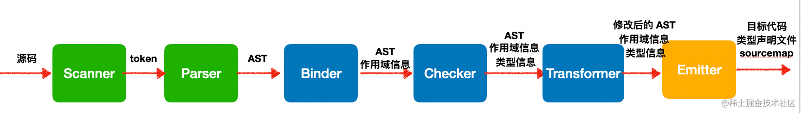

源码要先用 Scanner 进行词法分析，拆分成一个个不能细分的单词，叫做 token。

然后用 Parser 进行语法分析，组装成抽象语法树（Abstract Syntax Tree）AST。

之后做语义分析，包括用 Binder 进行作用域分析，和有 Checker 做类型检查。如果有类型的错误，就是在 Checker 这个阶段报的。

如果有 Transformer 插件（tsc 支持 custom transform），会在 Checker 之后调用，可以对 AST 做各种增删改。

类型检查通过后就会用 Emmiter 把 AST 打印成目标代码，生成类型声明文件 d.ts，还有 sourcemap。

> sourcemap 的作用是映射源码和目标代码的代码位置，这样调试的时候打断点可以定位到相应的源码，线上报错的时候也能根据 sourcemap 定位到源码报错的位置。

tsc 生成的 AST 可以用 [astexplorer.net](https://astexplorer.net/) 可视化的查看：

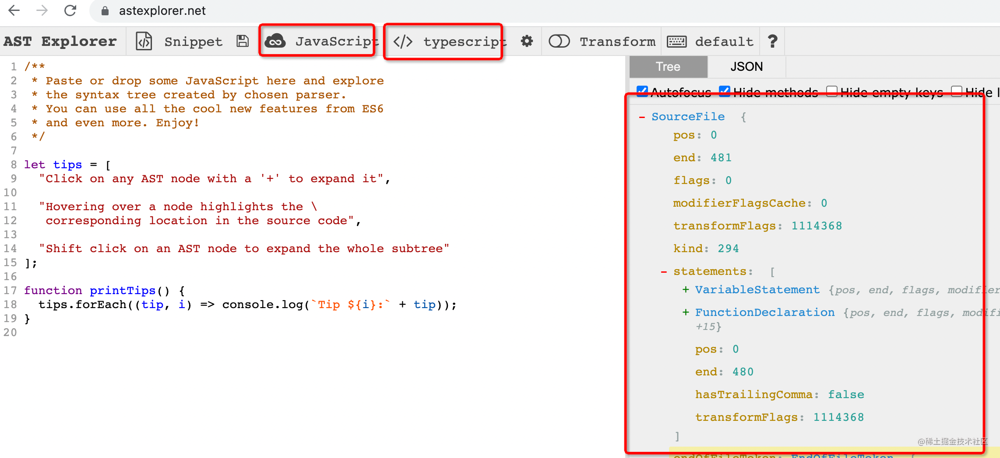

生成的目标代码和 d.ts 和报错信息也可以用 [ts playground](https://www.typescriptlang.org/play?ts=4.5.0-beta#code/DYUwLgBA9gRgVgLggJRAYygJwCYB4DOYmAlgHYDmANBAIakCeAfANwBQrscEAvBAN6sIQiKRoBbEEgDk5AK51yU1gF8gA) 来直接查看：

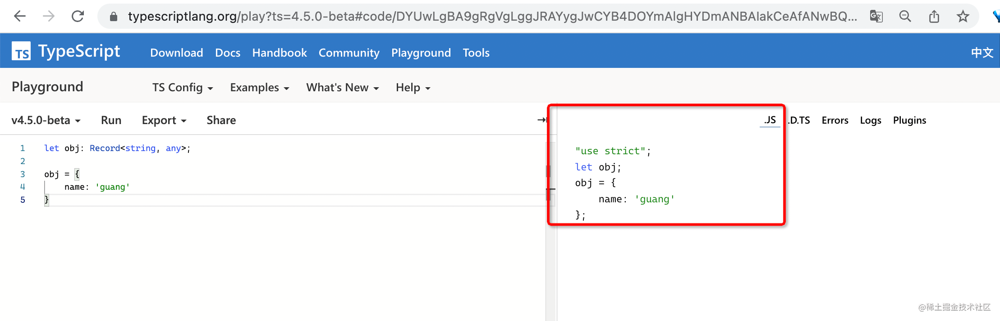

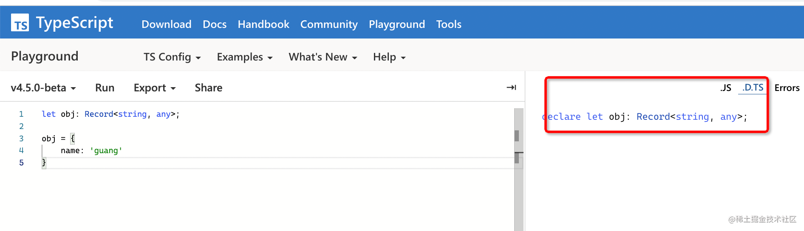

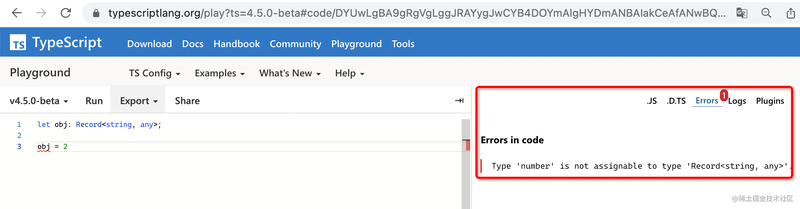

大概了解了 tsc 的编译流程，我们再来看下 babel 的：

## babel 的编译流程

babel 的编译流程是这样的：


源码经过 Parser 做词法分析和语法分析，生成 token 和 AST。

AST 会做语义分析生成作用域信息，然后会调用 Transformer 进行 AST 的转换。

最后会用 Generator 把 AST 打印成目标代码并生成 sourcemap。

babel 的 AST 和 token 也可以用 [astexplorer.net](https://astexplorer.net/) 可视化的查看：

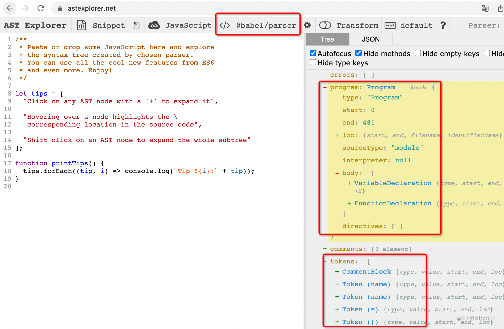

如果想看到 tokens，需要点开设置，开启 tokens：

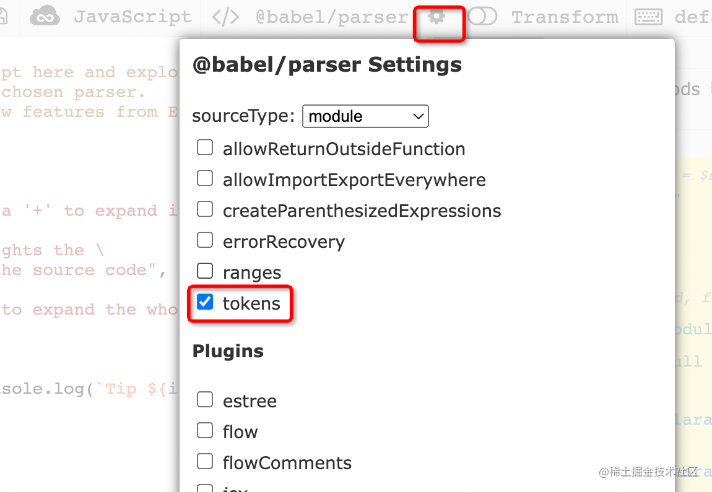

而且 babel 也有 [playground](https://www.babeljs.cn/repl)（babel 的叫 repl） 可以直接看编译之后生成的代码：

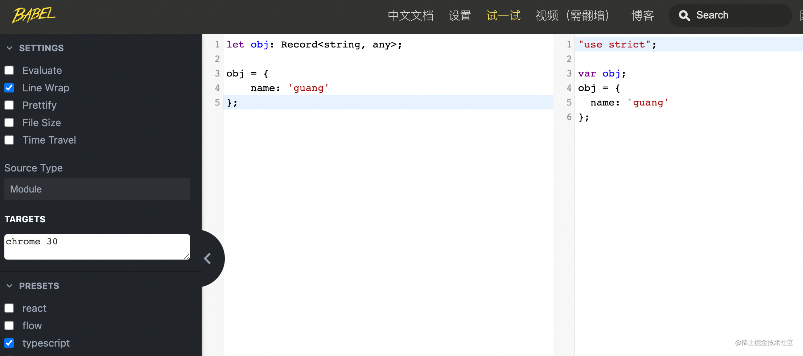

其实对比下 tsc 的编译流程，区别并不大：

Parser 对应 tsc 的 Scanner 和 Parser，都是做词法分析和语法分析，只不过 babel 没有细分。

Transform 阶段做语义分析和代码转换，对应 tsc 的 Binder 和 Transformer。**只不过 babel 不会做类型检查，没有 Checker。**

Generator 做目标代码和 sourcemap 的生成，对应 tsc 的 Emitter。**只不过因为没有类型信息，不会生成 d.ts。**

对比两者的编译流程，会发现 babel 除了不会做类型检查和生成类型声明文件外，tsc 能做的事情，babel 都能做。

看起来好像是这样的，但是 babel 和 tsc 实现这些功能是有区别的：

## babel 和 tsc 的区别

抛开类型检查和生成 d.ts 这俩 babel 不支持的功能不谈，我们看下其他功能的对比：

分别对比下语法支持和代码生成两方面：

### 语法支持

tsc 默认支持最新的 es 规范的语法和一些还在草案阶段的语法（比如 decorators），想支持新语法就要升级 tsc 的版本。

babel 是通过 @babel/preset-env 按照目标环境 targets 的配置自动引入需要用到的插件来支持标准语法，对于还在草案阶段的语法需要单独引入  @babel/proposal-xx 的插件来支持。

所以如果你只用标准语法，那用 tsc 或者 babel 都行，但是如果你想用一些草案阶段的语法，tsc 可能很多都不支持，而 babel 却可以引入 @babel/poposal-xx 的插件来支持。

从支持的语法特性上来说，babel 更多一些。

### 代码生成

tsc 生成的代码没有做 polyfill 的处理，想做兼容处理就需要在入口引入下 core-js（polyfill 的实现）。

```typescript
import "core-js";

Promise.resolve;
```

babel 的 @babel/preset-env 可以根据 targets 的配置来自动引入需要的插件，引入需要用到的 core-js 模块，


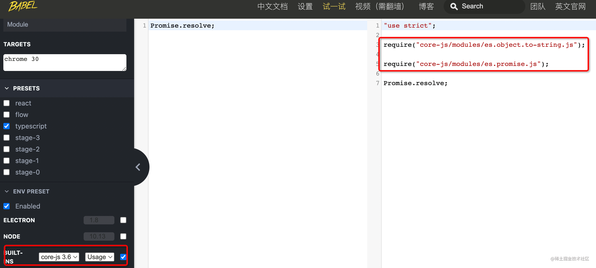

引入方式可以通过 useBuiltIns 来配置：

entry 是在入口引入根据 targets 过滤出的所有需要用的 core-js。

usage 则是每个模块按照使用到了哪些来按需引入。

```javascript
module.exports = {
    presets: [
        [
            '@babel/preset-typescript',
            '@babel/preset-env',
            {
                targets: '目标环境',
                useBuiltIns: 'entry' // ‘usage’
            }
        ]
    ]
}
```

此外，babel 会注入一些  helper 代码，可以通过 @babel/plugin-transform-runtime 插件抽离出来，从 @babel/runtime 包引入。

使用 transform-runtime 之前：

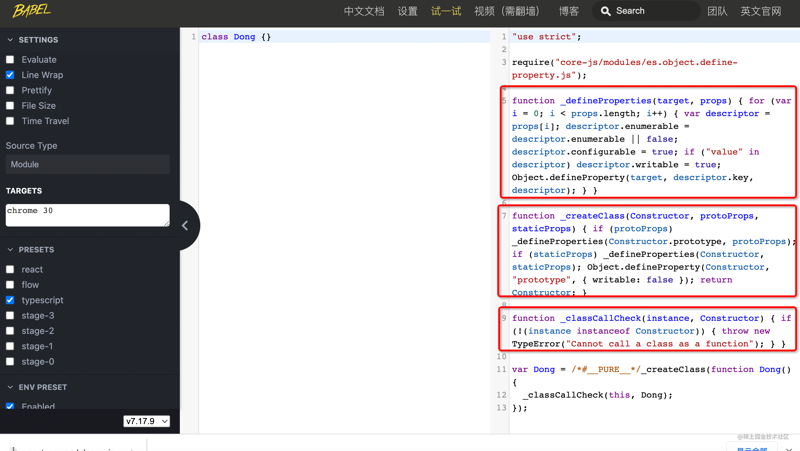

使用 transform-runtime 之后：

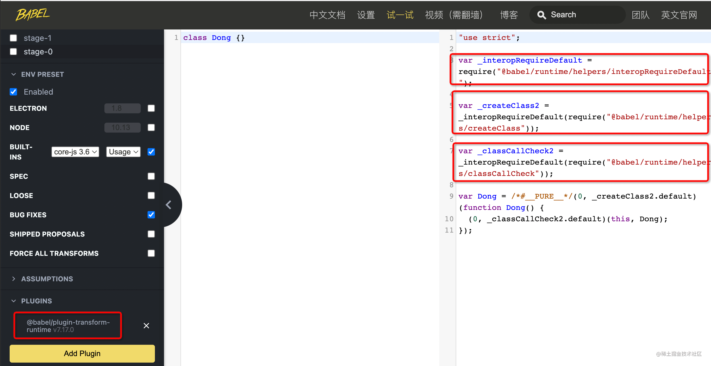

（transform runtime 顾名思义就是 transform to runtime，转换成从 runtime 包引入 helper 代码的方式）

所以一般babel 都会这么配：
```javascript
module.exports = {
    presets: [
        [
            '@babel/preset-typescript'
        ],
        [
            '@babel/preset-env',
            {
                targets: '目标环境',
                useBuiltIns: 'usage' // ‘entry’
            }
        ]
    ],
    plugins: [ '@babel/plugin-transform-runtime']
}
```
当然，这里不是讲 babel 怎么配置，我们绕回主题，babel 和 tsc 生成代码的区别：

**tsc 生成的代码没有做 polyfill 的处理，需要全量引入 core-js，而 babel 则可以用 @babel/preset-env 根据 targets 的配置来按需引入 core-js 的部分模块，所以生成的代码体积更小。**

看起来用 babel 编译 ts 代码全是优点？

也不全是，babel 有一些 ts 语法并不支持：

## babel 不支持的 ts 语法

babel 是每个文件单独编译的，而 tsc 不是，tsc 是整个项目一起编译，会处理类型声明文件，会做跨文件的类型声明合并，比如 namespace 和 interface 就可以跨文件合并。

所以 babel 编译 ts 代码有一些特性是没法支持的：

### const enum 不支持

enum 编译之后是[这样的](https://www.typescriptlang.org/play?ts=4.5.0-beta#code/KYOwrgtgBACsBOBnA9iA3gKCtqARVA5lALxQDkAJoWQDRY4DiYAhiEaWQS22RgL4YMAY1QoANsAB0Y5AQAUcJKkn42ASgDcQA)：

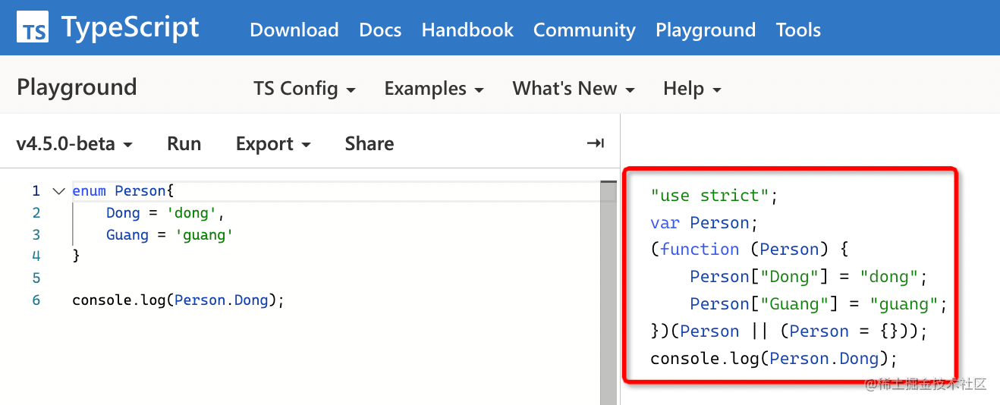
而 const enum 编译之后是直接替换用到 enum 的地方为对应的值，是[这样的](https://www.typescriptlang.org/play?ts=4.5.0-beta#code/MYewdgzgLgBApmArgWxgBTgJwuA3gKBiJgBFwBzGAXhgHIATC2gGkOIHFEBDMSm28t1618AX3z5QkEABs4AOhkhyACgzZw8srwCUAbiA)：

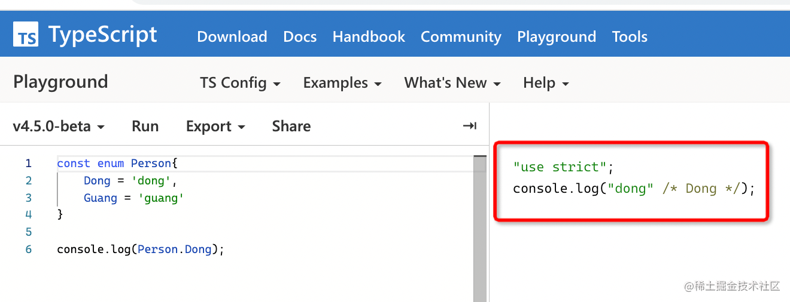

const enum 是在编译期间把 enum 的引用替换成具体的值，需要解析类型信息，而 babel 并不会解析，所以它会把 const enum 转成 enum 来处理：

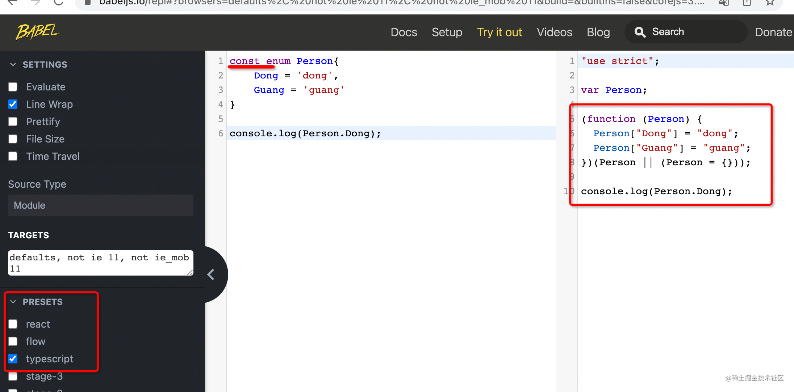

后记：babel 7.15 以后开始支持了，在 @babel/preset-typescript 里加了个 [optimizeCosntEnums 选项](https://babeljs.io/docs/babel-preset-typescript#optimizeconstenums)，原理应该是通过 AST 做了 enum 引用的解析，然后编译时替换引用的值。

### namespace 部分支持：不支持 namespace 的合并，不支持导出非 const 的值

比如这样一段 ts 代码：

```typescript
namespace Guang {
    export const name = 'guang';
}

namespace Guang {
    export const name2 = name;
}

console.log(Guang.name2);
```

按理说 Guang.name2 是 'dong'，因为 ts 会自动合并同名 namespace。

ts 编译之后的代码是[这样的](https://www.typescriptlang.org/play?ts=4.5.0-beta#code/HYQwtgpgzgDiDGEAEBxAriYBzJBvAUAJAQAeMA9gE4AuS85wUtokSAvEgORYbacDc+AL758LaHESpeOAsTJVa9Rs3AQATOyTjBI-MqjkANhAB0R8lgAU6TFlPj1ASkFA)：

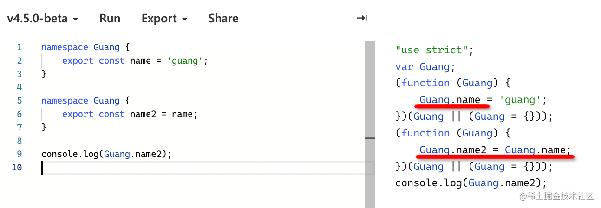

都挂到了 Guang 这个对象上，所以 name2 就能取到 name 的值。

而 babel 对每个 namespace 都是单独处理，所以是[这样的](https://babeljs.io/repl#?browsers=defaults%2C%20not%20ie%2011%2C%20not%20ie_mob%2011&build=&builtIns=false&corejs=3.21&spec=false&loose=false&code_lz=HYQwtgpgzgDiDGEAEBxAriYBzJBvAUAJAQAeMA9gE4AuS85wUtokSAvEgORYbacDc-AL758LaHESpeOAsTJVa9Rs3AQATOyTjBI_MqjkANhAB0R8lgAU6TFlPj1ASkFA&debug=false&forceAllTransforms=false&shippedProposals=false&circleciRepo=&evaluate=false&fileSize=false&timeTravel=false&sourceType=module&lineWrap=true&presets=env%2Ctypescript&prettier=false&targets=&version=7.17.9&externalPlugins=%40babel%2Fplugin-proposal-private-property-in-object%407.16.7&assumptions=%7B%7D)：

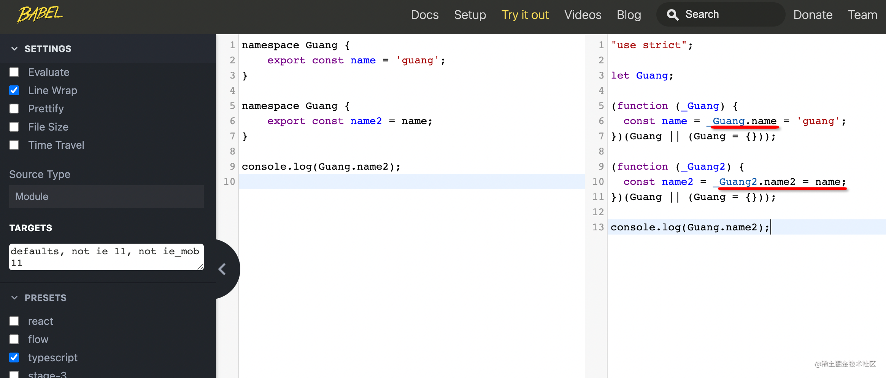

因为不会做 namespace 的合并，所以 name 为 undefined。

还有 namespace 不支持导出非 const 的值。

ts 的 namespace 是可以导出非 const 的值的，后面可以修改：

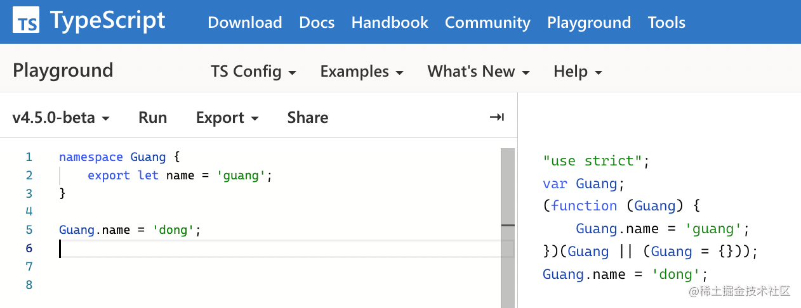

但是 babel 并[不支持](https://babeljs.io/repl#?browsers=defaults%2C%20not%20ie%2011%2C%20not%20ie_mob%2011&build=&builtIns=false&corejs=3.21&spec=false&loose=false&code_lz=HYQwtgpgzgDiDGEAEBxAriYBzJBvAUAJAQAeMA9gE4AuSANhLaJEgLxIDkWG2HA3PgC--IA&debug=false&forceAllTransforms=false&shippedProposals=false&circleciRepo=&evaluate=false&fileSize=false&timeTravel=false&sourceType=module&lineWrap=true&presets=env%2Ctypescript&prettier=false&targets=&version=7.17.9&externalPlugins=%40babel%2Fplugin-proposal-private-property-in-object%407.16.7&assumptions=%7B%7D)：

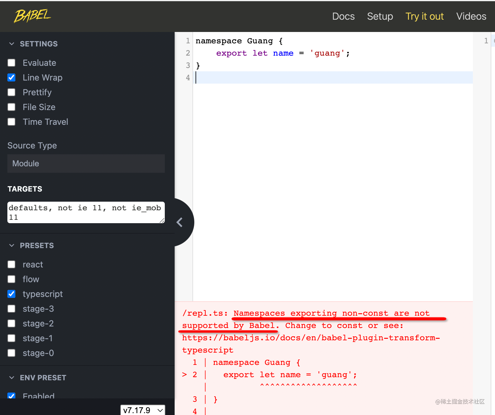

原因也是因为不会做 namespace 的解析，而 namespace 是全局的，如果在另一个文件改了 namespace 导出的值，babel 并不能处理。所以不支持对 namespace 导出的值做修改。

除此以外，还有一些语法也不支持：

### 部分语法不支持

像 export = import = 这种过时的模块语法并[不支持](https://babeljs.io/repl#?browsers=defaults%2C%20not%20ie%2011%2C%20not%20ie_mob%2011&build=&builtIns=false&corejs=3.21&spec=false&loose=false&code_lz=JYWwDg9gTgLgBAcQK4EMB2BzOBeOUCmAjksAQBQBEAdAPQaqYUCUA3AFBtA&debug=false&forceAllTransforms=false&shippedProposals=false&circleciRepo=&evaluate=false&fileSize=false&timeTravel=false&sourceType=module&lineWrap=true&presets=env%2Ctypescript&prettier=false&targets=&version=7.17.9&externalPlugins=%40babel%2Fplugin-proposal-private-property-in-object%407.16.7&assumptions=%7B%7D)：

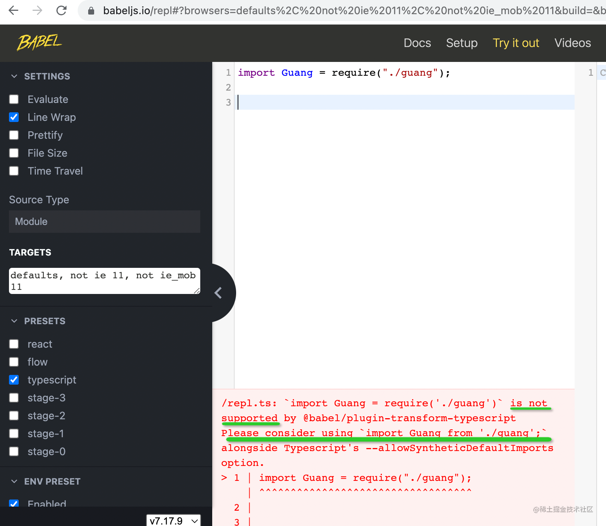

开启了 jsx 编译之后，不能用 \<type> 的方式做类型断言：

我们知道，ts 是可以做类型断言来修改某个类型到某个类型的，[用 as xx 或者 \<xx> 的方式](https://www.typescriptlang.org/play?jsx=0&ts=4.5.0-beta#code/DYUwLgBAHjBcEFcB2BrJB7A7kg3AKD1EgHMEBDJY+AZzACcBLS-PUi4iAXgmhgjOoRajZgTaUuEADzCmxAHy8oOIA)。

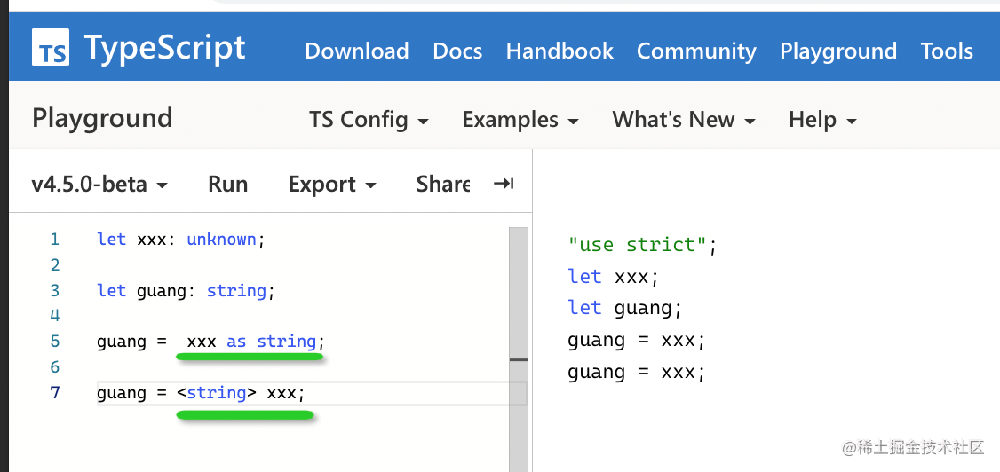

但是如果开启了 jsx 编译之后，\<xx> 的形式会和 jsx 的语法冲突，所以就[不支持 \<xx> 做类型断言了](https://www.typescriptlang.org/play?ts=4.5.0-beta#code/DYUwLgBAHjBcEFcB2BrJB7A7kg3AKD1EgHMEBDJY+AZzACcBLS-PUi4iAXgmhgjOoRajZgTaUuEADzCmxAHy8oOIA)：

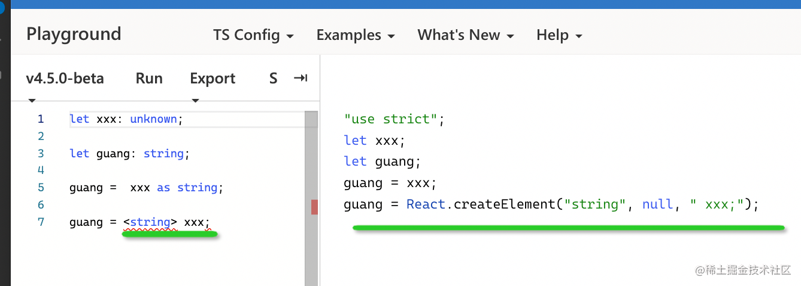

tsc 都不支持，babel 当然也是一样：

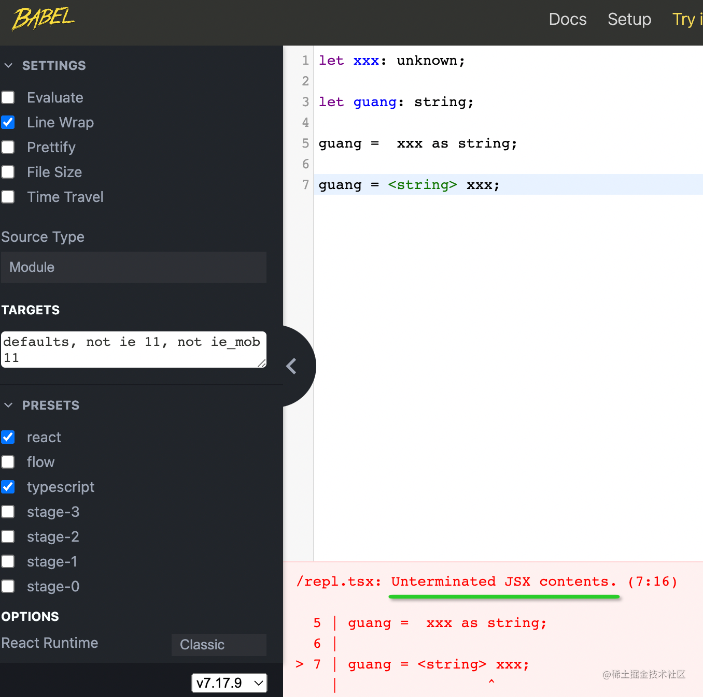

babel 不支持 ts 这些特性，那是否可以用 babel 编译 ts 呢？

## babel 还是 tsc？

babel 不支持 const enum（会作为 enum 处理），不支持 namespace 的跨文件合并，导出非 const 的值，不支持过时的 export = import = 的模块语法。

这些其实影响并不大，只要代码里没用到这些语法，完全可以用 babel 来编译 ts。

babel 编译 ts 代码的优点是可以通过插件支持更多的语言特性，而且生成的代码是按照 targets 的配置按需引入 core-js 的，而 tsc 没做这方面的处理，只能全量引入。

而且 tsc 因为要做类型检查所以是比较慢的，而 babel 不做类型检查，编译会快很多。

那用 babel 编译，就不做类型检查了么？

可以用 tsc --noEmit 来做类型检查，加上 noEmit选项就不会生成代码了。

如果你要生成 d.ts，也要单独跑下 tsc 编译。

## 总结

babel 和 tsc 的编译流程大同小异，都有把源码转换成 AST 的 Parser，都会做语义分析（作用域分析）和 AST 的 transform，最后都会用 Generator（或者 Emitter）把 AST 打印成目标代码并生成 sourcemap。但是 babel 不做类型检查，也不会生成 d.ts 文件。

tsc 支持最新的 es 标准特性和部分草案的特性（比如 decorator），而 babel 通过 @babel/preset-env 支持所有标准特性，也可以通过 @babel/proposal-xx 来支持各种非标准特性，支持的语言特性上 babel 更强一些。

tsc 没有做 polyfill 的处理，需要全量引入 core-js，而 babel 的 @babel/preset-env 会根据 targets 的配置按需引入 core-js，引入方式受 useBuiltIns 影响 (entry 是在入口引入 targets 需要的，usage 是每个模块引入用到的)。

但是 babel 因为是每个文件单独编译的（tsc 是整个项目一起编译），而且也不解析类型，所以 const enum（后来支持了），namespace 合并，namespace 导出非 const 值并不支持。而且过时的 export =  的模块语法也不支持。

但这些影响不大，完全可以用 babel 编译 ts 代码来生成体积更小的代码，不做类型检查编译速度也更快。如果想做类型检查可以单独执行 tsc --noEmit。

当然，文中只是讨论了 tsc 和 babel 编译 ts 代码的区别，并没有说最好用什么，具体用什么编译 ts，大家可以根据场景自己选择。
