# 23.加餐：3 种类型来源和 3 种模块语法

TypeScript 给 JavaScript 添加了一套类型语法，我们声明变量的时候可以给变量加上类型信息，这样编译阶段就可以检查出变量使用的对不对，也就是类型检查。

给变量添加类型，很自然可以想到时在声明的时候指定：

比如对象：

```typescript
interface Person {
    name: string;
    age?: number;
}

const guang: Person = {
    name: 'guang'
}
```

比如函数：

```typescript
function add(num1: number, num2: number): number {
    return num1 + num2;
}
```

这样当使用它们的时候，比如变量赋值、函数调用，就可以通过类型信息检查出使用的对不对：

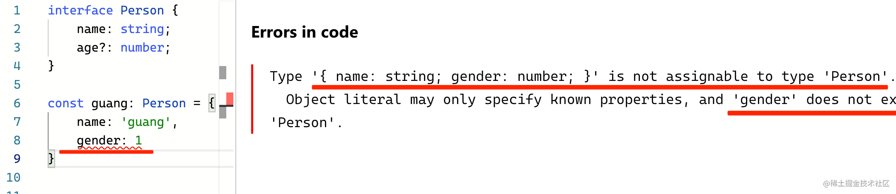

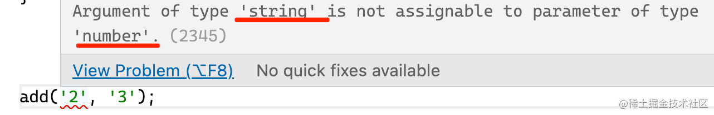

TypeScript 这样设计类型语法没啥问题，但是只是这样还不够。

我们自己写的代码可以这样声明类型，但不是我们写的呢？

比如 JS 引擎提供的 Number、String、Date、RegExp，浏览器环境的 HTMLElement、Event 等 api。

这些 api 是执行引擎内置的实现，但我们代码里会用到它们，也同样需要检查使用的对不对，也就是类型检查。怎么给这些 api 加上类型呢？

## TypeScript 类型声明的三种来源

TypeScript 设计了 declare 的语法，可以单独声明变量的类型：

比如对象：
```typescript
interface Person {
    name: string;
    age?: number;
}

declare const guang: Person;
```
比如函数：
```typescript
declare function add(num1: number, num2: number): number;
```

这样单独声明了类型，使用这些 api 的时候也就能做类型检查。

像 JS 引擎那些 api，还有浏览器提供的 api，这些基本是必用的，而且都有标准的。所以 TypeScript 给内置了它们的类型声明。

TypeScript 包下有个 lib 目录，里面有一堆 lib.xx.d.ts 的类型声明文件，这就是 TS 内置的一些类型声明。

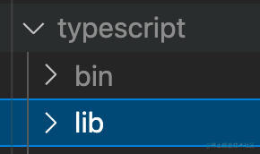

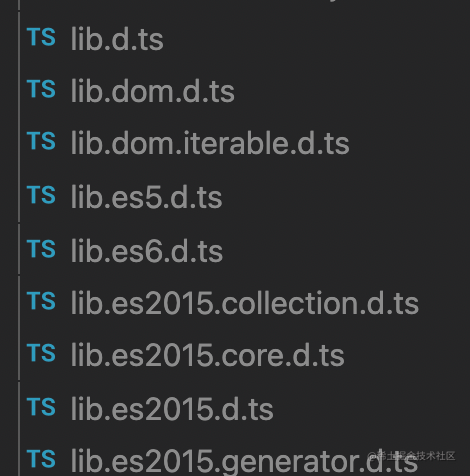

因为这些只是声明类型，而没有具体的 JS 实现，TS 就给单独设计了一种文件类型，也就是 d.ts， d 是 declare 的意思。

比如 lib.dom.d.ts 里的类型声明：

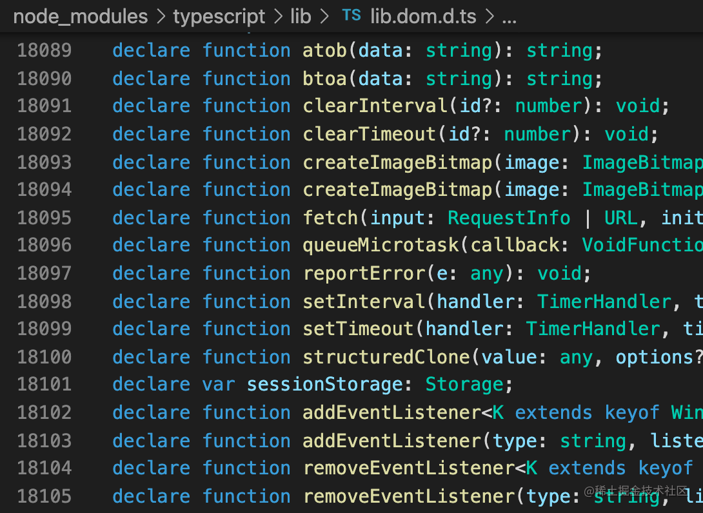

因为是 ts 内置的，所以配置一下就可以用了：

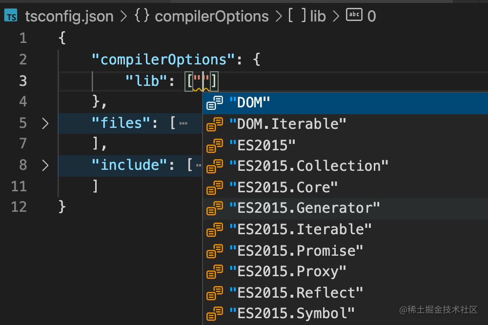

tsconfig.json 里配置下 compilerOptions.lib，就可以引入对应的 d.ts 的类型声明文件。

有的同学可能会说，可是内置的类型声明也不多呀，只有 dom 和 es 的。

确实，因为 JS 的 api 还有浏览器的 api 都是有标准的，那自然可以按照标准来定义类型。其余的环境的 api 可能没有标准，经常变，那自然就没法内置了，比如 node。所以 lib 里只有 dom 和 es 的类型声明。

那 node 环境，还有其他环境里的内置 api 怎么配置类型声明呢？

node 等环境的 api 因为没有标准而没有被 TS 内置，但 TS 同样也支持了这些环境的类型声明的配置。

方式是通过 @types/xxx 的包：

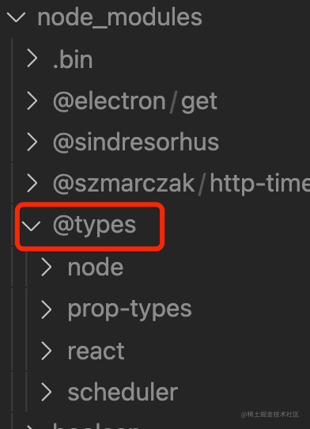

TS 会先加载内置的 lib 的类型声明，然后再去查找 @types 包下的类型声明。

这样，其他环境的类型声明就可以通过这种方式来扩展。

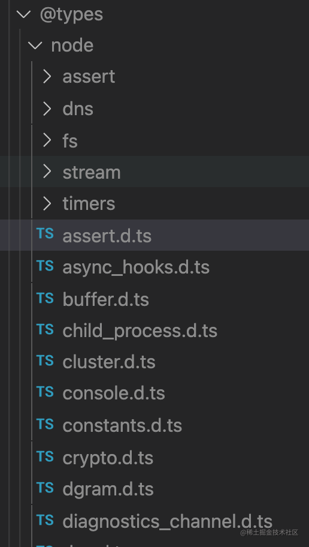

@types 包是在 [DefinitelyTyped](https://github.com/DefinitelyTyped/DefinitelyTyped/blob/master/README.zh.md) 这个项目下统一管理的，想创建一个 @types 包的话要去看一下他们的文档。


一般来说，很快就可以发到 npm 的：


我们知道，TS 内置的那些 lib 是可以配置的，扩展的这些 @types/xx 的包自然也可以配置：

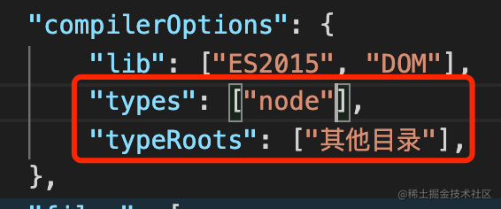

可以指定加载 @types 目录下的哪些包，还可以修改查找 @types 包的目录（默认是 node_modules/@types)：

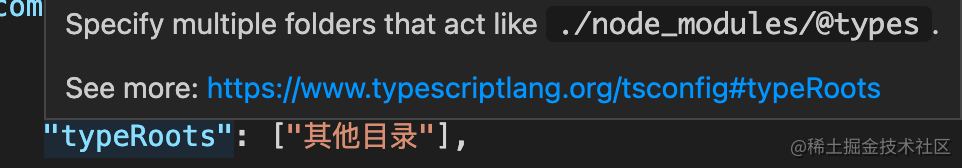

除了给 node 等环境的 api 加上类型声明外，@types 包还有一种用途，就是给一些 JS 的包加上类型声明：

如果代码本身是用 ts 写的，那编译的时候就可以开启 compilerOptions.declaration，来生成 d.ts 文件：

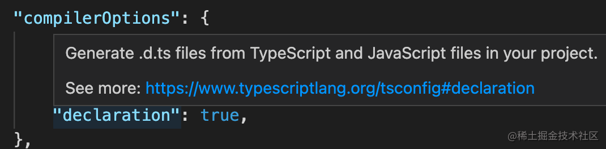

然后在 package.json 里配置 types 来指定 dts 的位置：

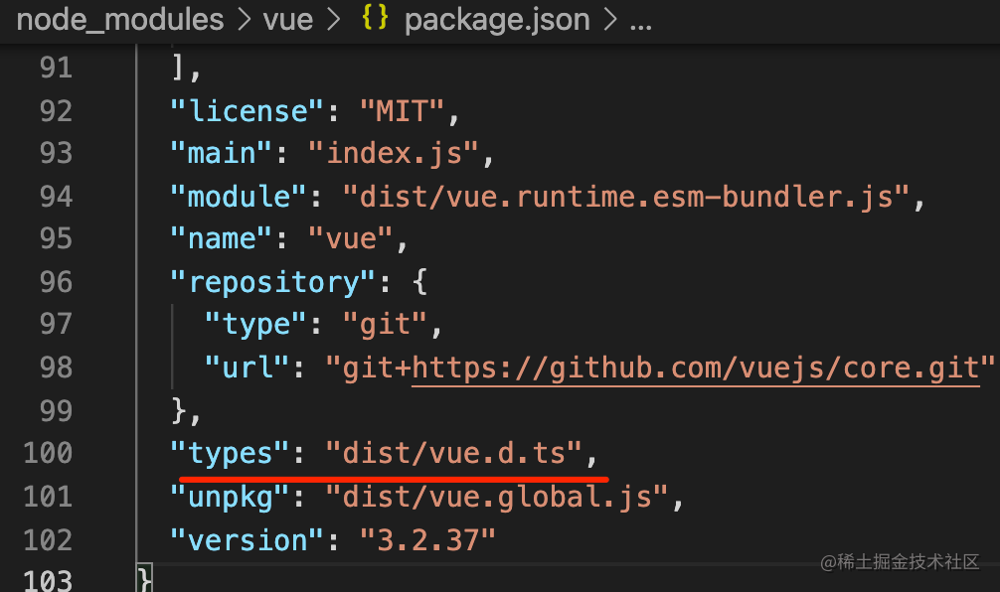

这样就不需要单独的 @types 包了。

但如果代码不是用 ts 写的，那可能既需要单独写一个 @types/xxx 的包来声明 ts 类型，然后在 tsconfig.json 里配置下，加载进来。

比如常用的 vue3 就不需要 @types/vue 包，因为本身是用 ts 写的，npm 包里也包含了 dts 文件。

但是 react 不是 ts 写的，是用的 facebook 自己的 flow，自然就需要 @types/react 的包来加上 ts 类型声明。

至此，ts 内置的 dom 和 es 的类型声明，其他环境还有一些包的类型声明我们都知道怎么加载了。

那自己写的 ts 代码呢？

这些其实我们经常配置，就是配置下编译的入口文件，通过 includes 指定一堆，然后通过 excludes 去掉一部分。还可以通过 files 再单独包含一些：

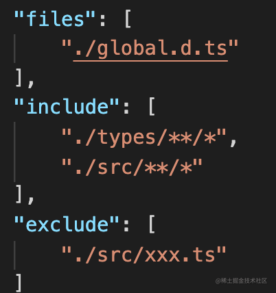

tsc 在编译的时候，会分别加载 lib 的，@types 下的，还有 include 和 files 的文件，进行类型检查。

这就是 ts 类型声明的三种来源。

现在还有一个问题，有的 api 是全局的，有的 api 是某个模块的，ts 是怎么声明全局 api 的类型，怎么声明模块内的 api 的类型呢？

## 全局类型声明 vs 模块类型声明

我们写的 JS 代码就是有的 api 是全局的，有的 api 是模块内的，所以 TS 需要支持这个也很正常。

但 JS 的模块规范不是一开始就有的，最开始是通过在全局挂一个对象，然后这个对象上再挂一些 api 的方式，也就是命名空间 namespace。

所以 TS 最早支持的模块化方案自然也就是 namespace：

```typescript
namespace Guang {
    export interface Person {
        name: string;
        age?: number;
    }

    const name = 'guang';
    const age = 20;

    export const guang: Person = {
        name,
        age
    }
    export function add(a: number, b: number):number {
        return a + b;
    }
}
```

理解 namespace 的话可以看一下编译后的代码：

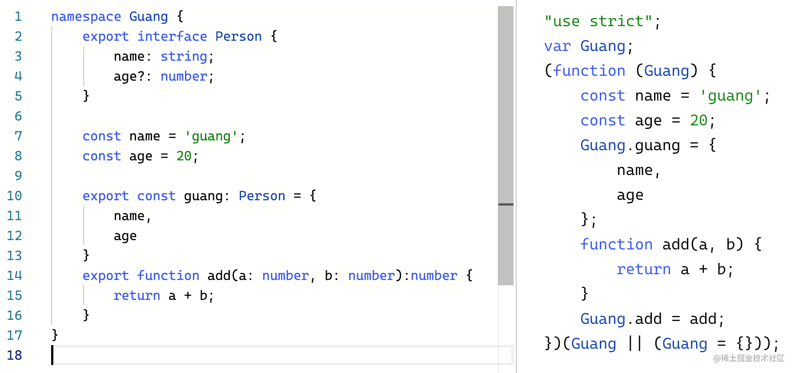

就是全局上放一个对象，然后对象上再挂几个暴露出去的属性。

看了编译后的代码，是不是 namespace 瞬间就学会了～

后来，出现了 CommonJS 的规范，那种不能叫 namespace 了，所以 TS 支持了 module，

很容易想到，@types/node 的 api 定义就是一堆的 module：

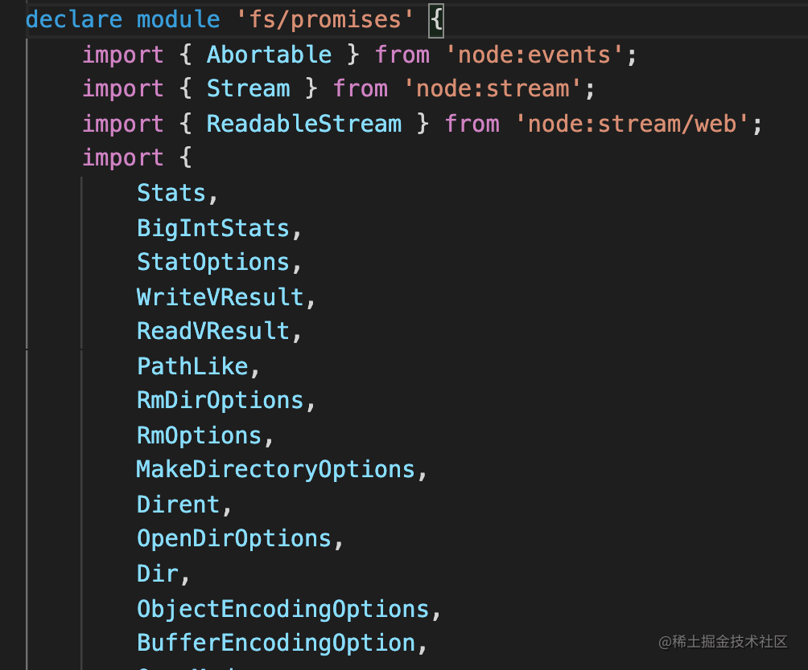

这个 module 和 namespace 有什么区别呢？

其实真没什么区别，只不过 module 后一般接一个路径，而 namespace 后一般是一个命名空间名字。其他的语法都一样的。

而且这个结论是有依据的：

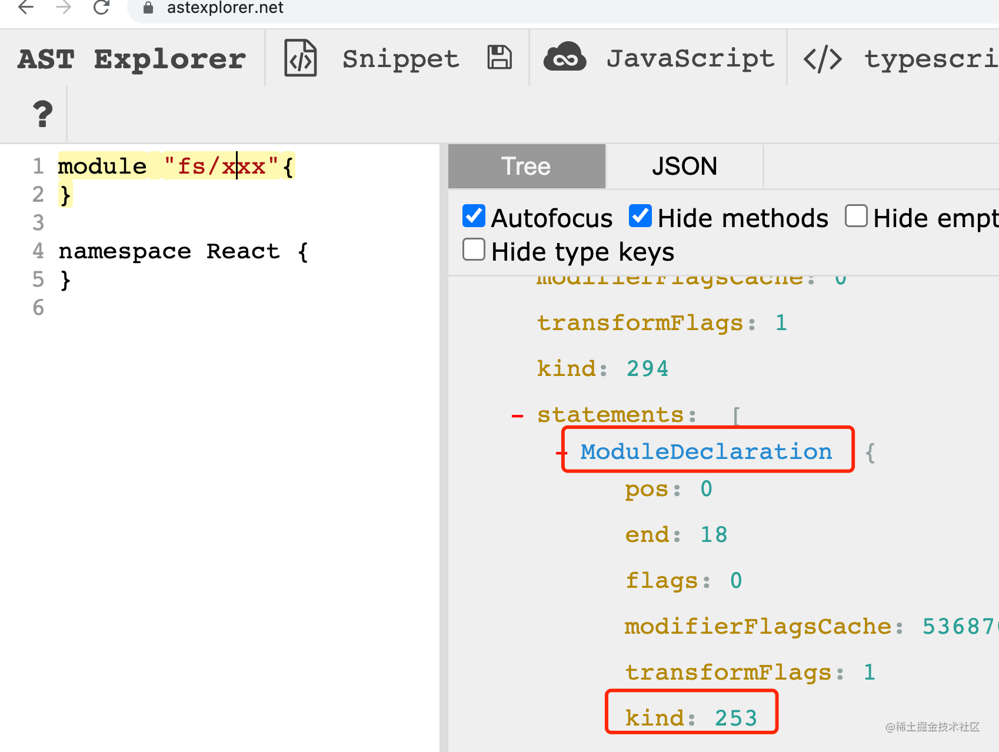


用 [astexplorer.net](https://astexplorer.net) 看一下 parse 后的 AST，两者的 AST类型都是一样的。也就是说编译器后续的处理都一样，那不是一种东西是什么。

再后来的故事大家都知道了，JS 有了 es module 规范，所以现在推荐直接用 import export 的方式来声明模块和导入导出了。

额外多了的，只不过有一个 import type 的语法，可以单独引入类型：

```typescript
import type {xxx} from 'yyy';
```

所以现在声明模块不咋推荐用 namespace 和 module，还是尽量用 es module 吧。

那全局的类型声明呢？

有了 es module 之后，TS 有了一个单独的设计：

**dts 中，如果没有 import、export 语法，那所有的类型声明都是全局的，否则是模块内的。**

我们试验一下：

include 配置 src 下的 ts 文件，然后再用 files 引入 global.d.ts 文件：

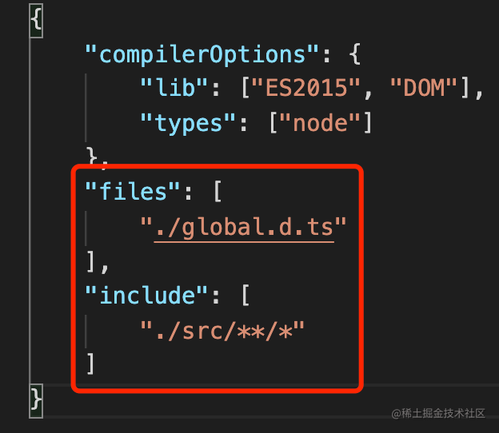

在 global.d.ts 里声明一个 func 函数：

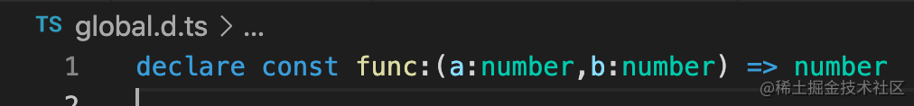

在 src/index.ts 里是有提示的：

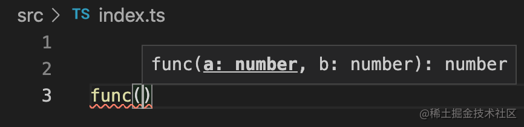

编译也不报错：

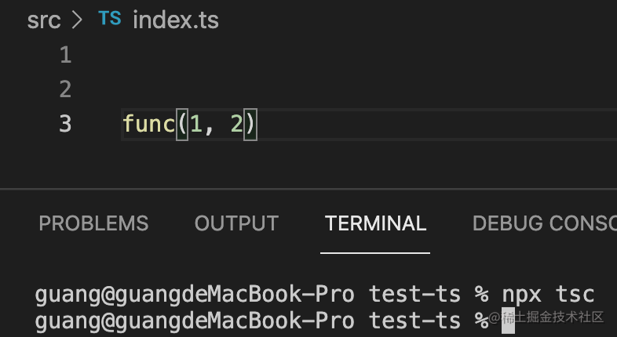

加上一个 import 语句：

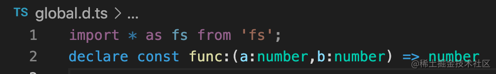

编译就报错了，说是找不到 func：
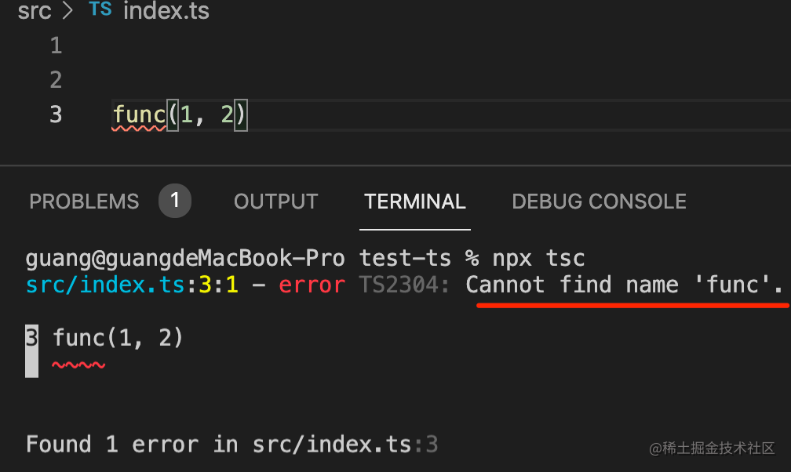

这说明 func 就不再是全局的类型了。

这时候可以手动 declare global：

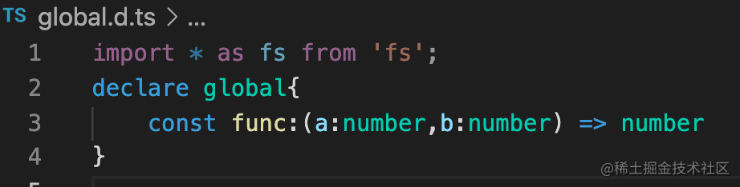

再试一下，编译就通过了：

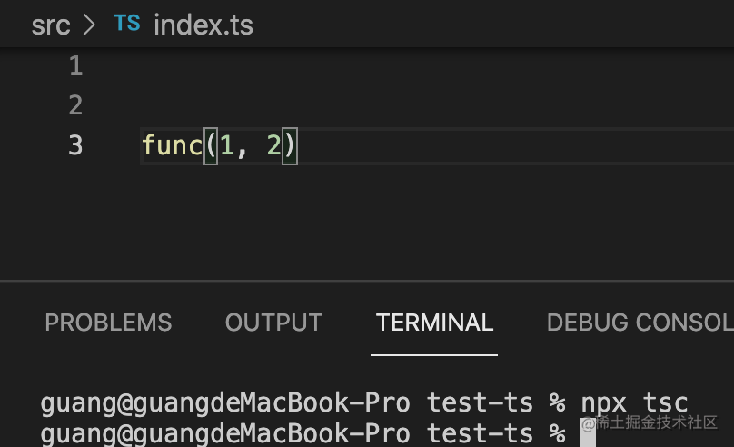

而且不止是 es module 的模块里可以用 global 声明全局类型，module 的方式声明的 CommonJS 模块也是可以的：

比如 @types/node 里就有不少这种全局类型声明：

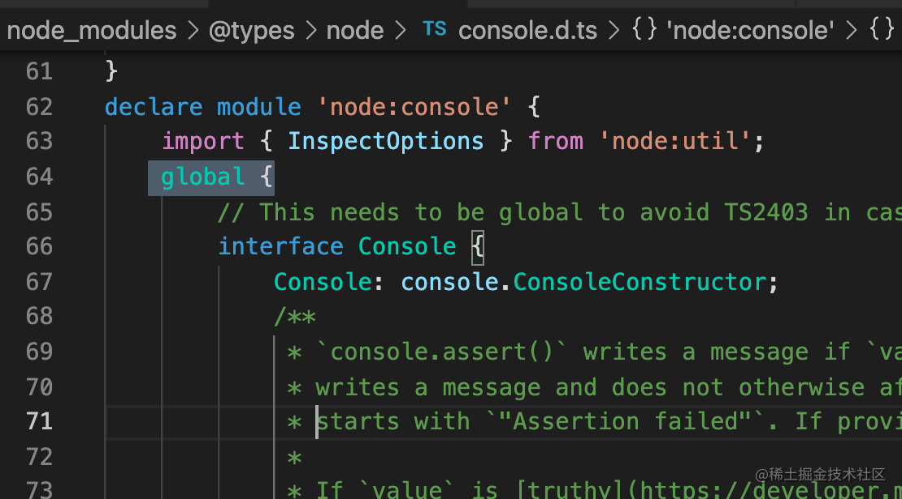

这就是 3 种 typescript 声明模块的语法，以及声明全局类型的方式。

那么如果就是需要引入模块，但是也需要全局声明类型，有什么更好的方式呢？

有，通过编译器指令 reference。这样既可以引入类型声明，又不会导致所有类型声明都变为模块内的：

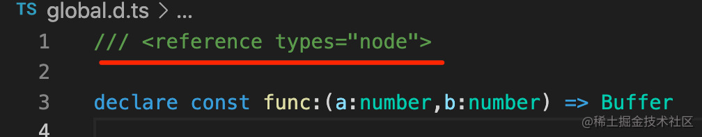

可以看到很多 dts 都这样引入别的 dts 的，就是为了保证引入的类型声明依然是全局的：

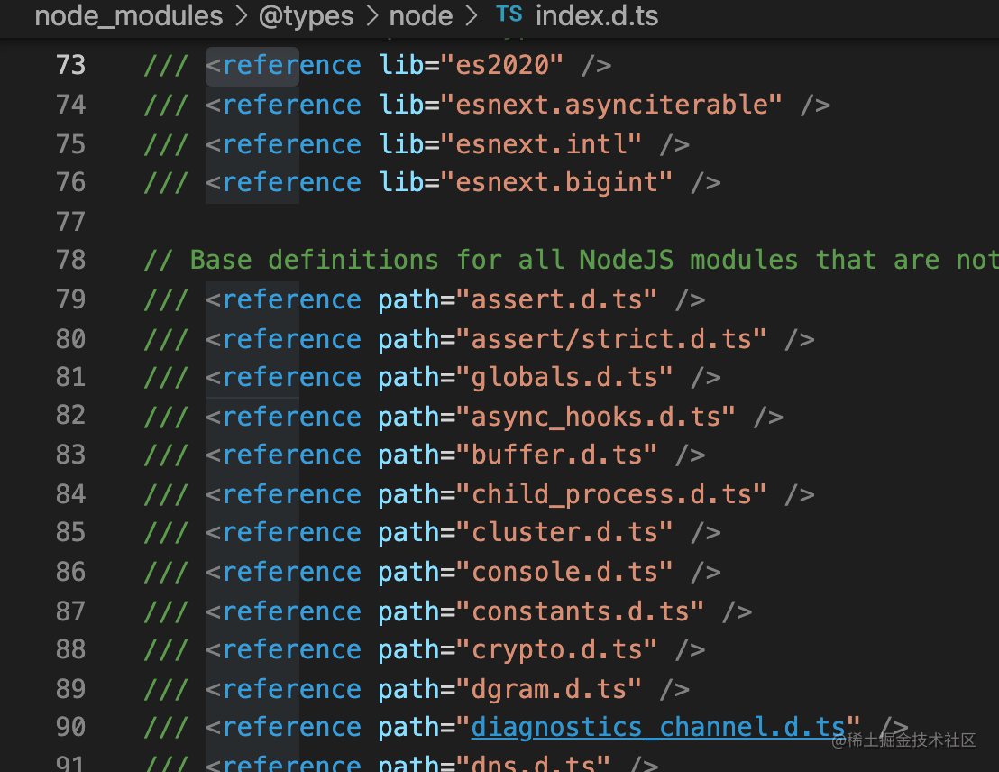

## 总结

TypeScript 给 JavaScript 添加了类型信息，在编译时做类型检查。

除了在变量声明时定义类型外，TS 也支持通过 declare 单独声明类型。只存放类型声明的文件后缀是 d.ts。

TypeScript 有三种存放类型声明的地方：

- lib： 内置的类型声明，包含 dom 和 es 的，因为这俩都是有标准的。
- @types/xx： 其他环境的 api 类型声明，比如 node，还有 npm 包的类型声明
- 开发者写的代码：通过 include + exclude 还有 files 指定

其中，npm 包也可以同时存放 ts 类型，通过 packages.json 的 types 字段指定路径即可。

常见的是 vue 的类型是存放在 npm 包下的，而 react 的类型是在 @types/react 里的。因为源码一个是 ts 写的，一个不是。

巧合的是，TS 声明模块的方式也是三种：

- namespace：最早的实现模块的方式，编译为声明对象和设置对象的属性的 JS 代码，很容易理解
- module：和 namespace 的 AST 没有任何区别，只不过一般用来声明 CommonJS 的模块，在 @types/node 下有很多
- es module：es 标准的模块语法，ts 额外扩展了 import type

dts 的类型声明默认是全局的，除非有 es module 的 import、export 的声明，这时候就要手动 declare global 了。为了避免这种情况，可以用 reference 的编译器指令。

**学习类型定义是怎么给 JS 加上类型，学习类型编程是怎么动态生成类型和对类型做修改，这些类型可能会通过模块或全局的方式来组织，所以还需要学习模块语法，而且可能会放在 lib、@types/xxx、用户目录等位置，还要学习不同来源的类型的查找机制。**

深入掌握 TypeScript 的话，除了学习类型定义以及类型编程，这三种类型声明的来源（lib、@types、用户目录），以及三种模块声明的方式（namespace、module、es module），还有全局类型的声明（global、reference），也都是要掌握的。


