# 26.加餐：项目中 2 个真实的类型编程案例

最近有两个同学问了我项目中遇到的 ts 问题，这俩问题都是典型的可以用类型编程来解决的。

这俩都是项目中真实遇到的 TS 类型问题，我们一起看一下吧：

第一个问题是这样的，项目中定义了接口返回的数据的类型，比如这样：

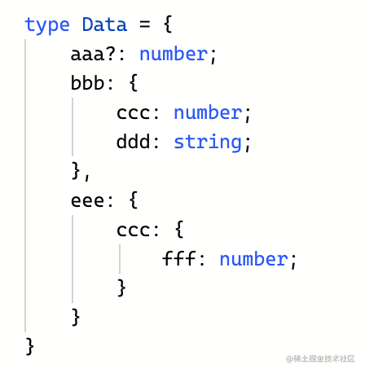

那么填充数据的时候就要根据类型的定义来写：

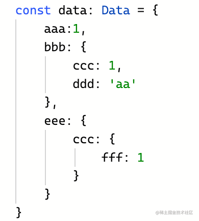

但是呢，如果你想扩展一些属性就报错了：

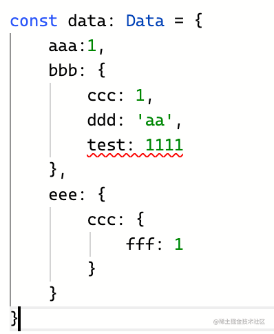

但现在想每层都能灵活扩展一些属性，怎么做呢？

简化一下就是这样的：


如何能让这个索引类型可以灵活添加一些额外的索引呢？

可以这样，添加一个可索引签名

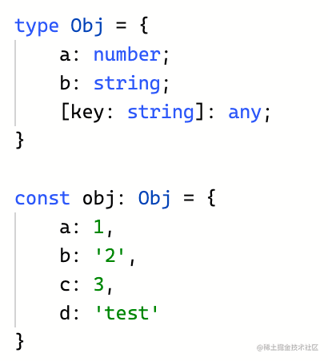

能满足这个索引签名的额外索引都可以添加。

也可以这样写：

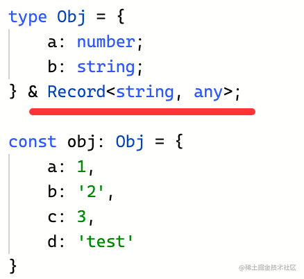

和 Record<string, any> 取交叉类型。

这个 Record 是一个内置的高级类型，作用是根据传入的 key 和 value 的类型生成索引类型：


这种生成索引类型的语法叫做映射类型。

所以，Record<string, any> 就是这样的，也是一个有可索引签名的索引类型：

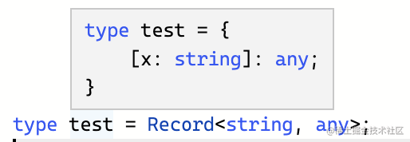

普通的对象我们知道怎么处理了，那多层的呢？

这样任意层数的索引类型，怎么给每一层都加上 Record<string, any> 呢？

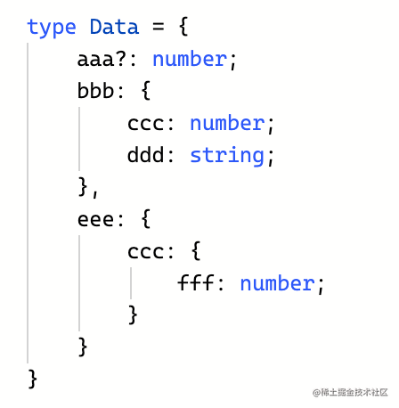

这时候就要用到递归了，可以这样写：

```typescript
type DeepRecord<Obj extends Record<string, any>> = {
    [Key in keyof Obj]: 
        Obj[Key] extends Record<string, any>
            ? DeepRecord<Obj[Key]> & Record<string, any>
            : Obj[Key]
} & Record<string, any>;
```

定义一个 DeepRecord 的高级类型，传入的类型参数 Obj 为一个索引类型，通过 Record<string, any> 约束。

然后通过映射类型的语法构造一个新的索引类型。

Key 来自之前的索引类型的 Key，也就是 Key in keyof Obj。

Value 要判断是不是索引类型，如果依然是 Record<string, any>，那就递归处理它的值 Obj[Key]，否则直接返回 Obj[Key]。

每一层都要和 Record<string, any> 取交叉类型。

这样就完成了递归让 Obj 的每一层都变得可扩展的目的。

我们测试一下：

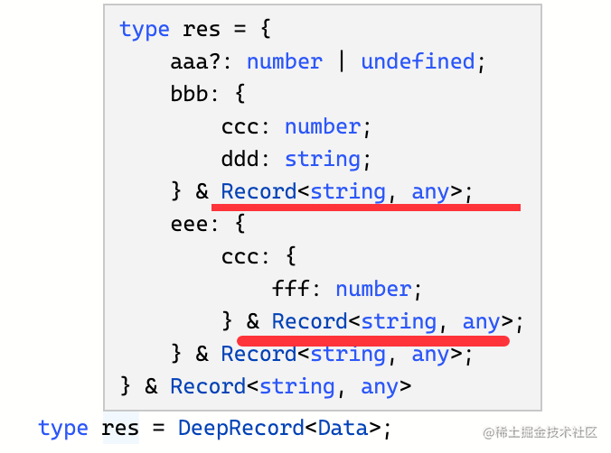

可以看到，处理过后的类型确实是每一层都加上了 Record<string, any>。

也确实每一层都可以扩展了：

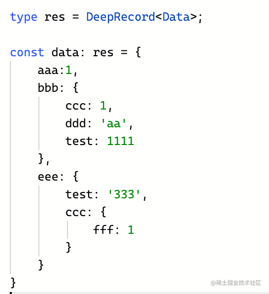

并且有类型定义的索引也会做类型检查：

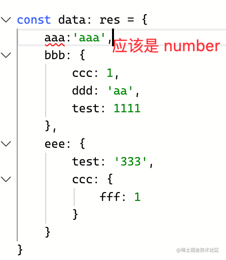

小结一下：**可索引签名可以让索引类型扩展任意数量的符合签名的索引，如果想给任意层级的索引每层都加上可索引签名就要递归处理了。**

那如果不用类型编程呢？

那你就要原封不动的写一个新的索引类型，然后手动给每一层都加上可索引签名，那就麻烦太多了，而且也不通用。

这就是类型编程的意义之一，可以根据需要修改类型。

[案例一的 ts playground 地址](https://www.typescriptlang.org/play?#code/C4TwDgpgBAIghsOUC8UDeAoK2pzwLigDsBXAWwCMIAnAbixwqcMxzagGMvDTKb72OACYjCAZ2DUAlkQDmAnAF8ANA2wQNLNewBme8ZJnztbEUJ7kqdbYoy3QkWBrAAlCBwD21IQB4A8hQAVlAQAB7AEERCYlBunt4+EtJyyrhEIAB8GSjo2gDaANIQIFAyUADWxR46UAGBALqEJjh1hcX1IeGR0bHuXr5JRqlw6RnNggD8ThCufQmtRSD12QBkvfEDhilpmePshAvtdlBrcf2JW7LDo-QYDtDUEDGoMM5nCfCIGbeeRBJQQgQcEInyQqFYODwwKgAEZVGwmBQtIJsFwOIQ4XszIQAORQnE2eE4DQQZEovQ6XGInFEwTYqAAJhsdiAA)

再来看第二个问题：

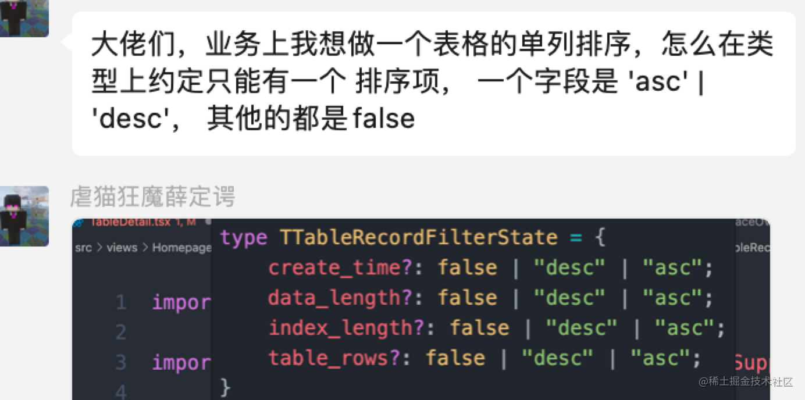

也就是当一个索引为 'desc' | 'asc' 的时候，其他索引都是 false。

这种类型怎么写呢？

有的同学说，这个就是枚举所有的情况呀，比如这样：

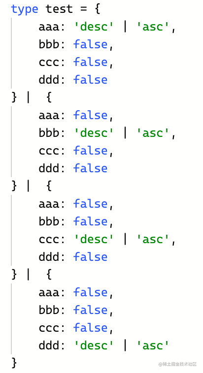

这确实能解决问题：

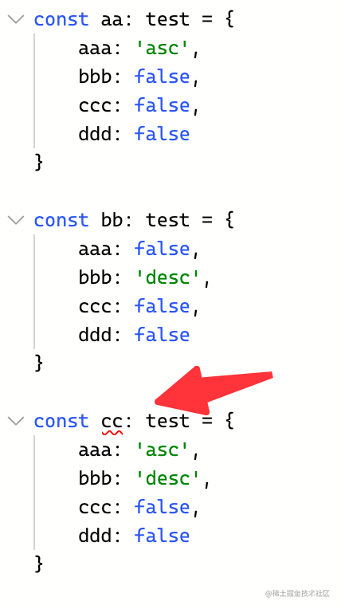

可以看到类型检查是符合我们的需求的。

但如果我再加几个属性呢？

是不是可能的类型又多了几种？

手动维护也太麻烦了！

这时候就可以用类型编程动态生成了。

比如我定义这样一个高级类型：

```typescript
type GenerateType<Keys extends string> = {
    [Key in Keys]: {
        [Key2 in Key]: 'desc' | 'asc'
    }
}
```
它生成的类型是这样的：

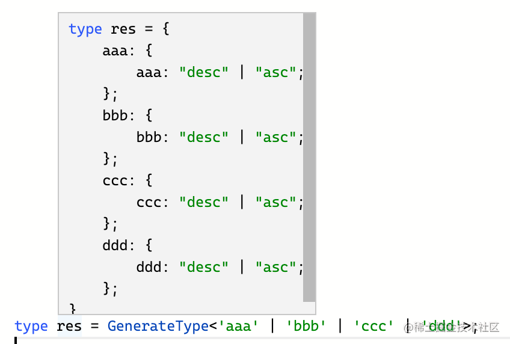

这个还是很容易理解的，映射类型就是用来生成索引类型的。

我们可以取它的值：

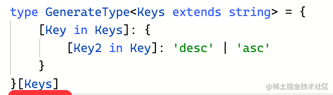

结果就是这样的：

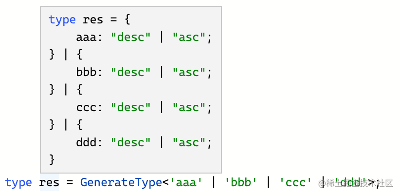

现在就只差那些为 false 的索引了。

Keys 是一个联合类型，从中去掉 Key 的类型，可以用 Exclude，也就是 Exclude<Keys, Key>。

那么这个类型就可以这么写：
```typescript
type GenerateType<Keys extends string> = {
    [Key in Keys]: {
        [Key2 in Key]: 'desc' | 'asc'
    } & {
        [Key3 in Exclude<Keys, Key>]: false
    }
}[Keys]
```
结果就是我们要的类型：

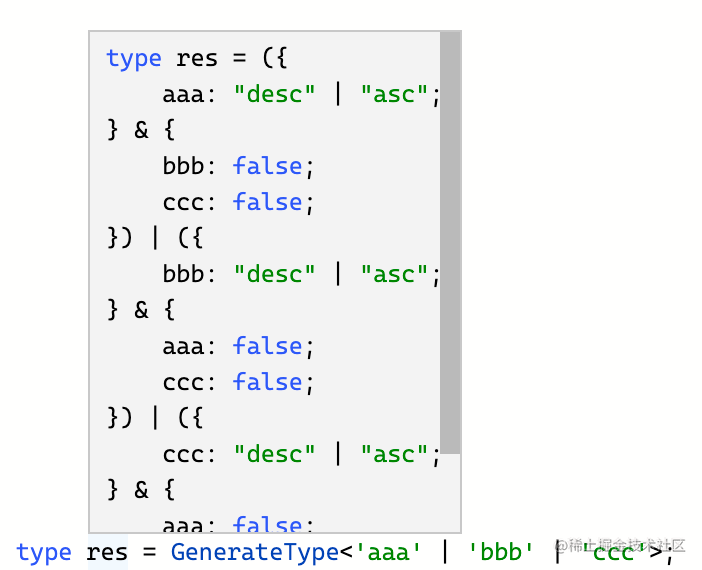

任意多个索引都可以动态生成复合需求的联合类型。

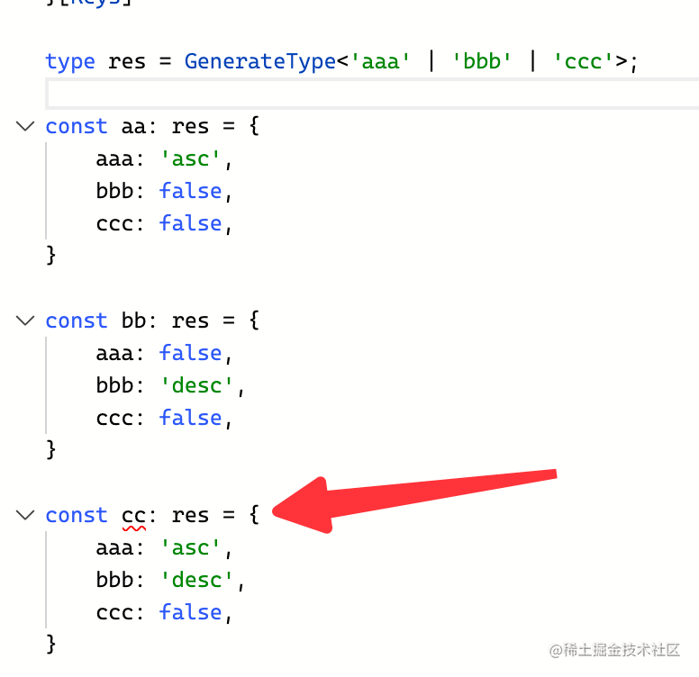

上面这个高级类型还可以做一些优化，把 key 的约束换成 keyof any：

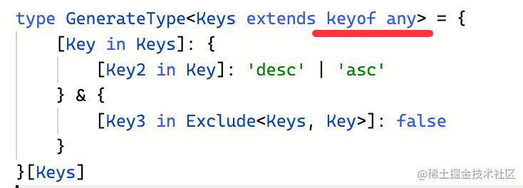

keyof any 的结果就是索引的类型：

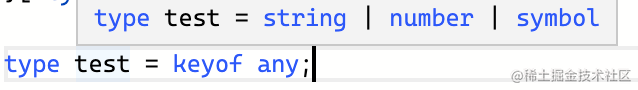

但有个配置项叫做 keyofStringsOnly

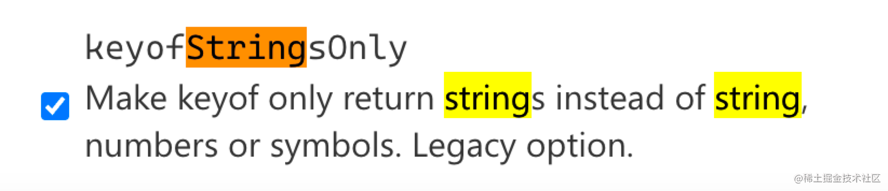

开启之后就只能是 string 作为 key 了：

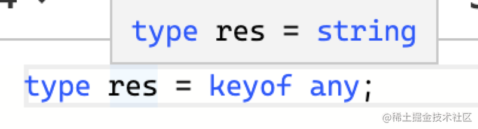

keyof any 就可以动态获取 key 的可能类型，比写死更好。

这个高级类型最终就是这样的：

```typescript
type GenerateType<Keys extends keyof any> = {
    [Key in Keys]: {
        [Key2 in Key]: 'desc' | 'asc'
    } & {
        [Key3 in Exclude<Keys, Key>]: false
    }
}[Keys]
```

小结一下：**当需要枚举很多种类型的可能性的时候，可以用类型编程动态生成。**

那如果不用类型编程呢？

那你就得手动维护所有的可能类型了。

这就是类型编程的第二个意义，可以动态生成类型。

[案例二的 ts playground 地址](https://www.typescriptlang.org/play?#code/C4TwDgpgBA4hB2EBOBDYEAq4IB4DSEIAzlBAB7rwAmJA1oQPYBmUK8IAfFALxQDeAKCjCoAbQIgoAS3hQJRALoAufkJHrxhAEzTZE5VADkVCEQDGhqAB8jKc4bXCAvlABkq9RokBmXVACiZGYANgCuJviERAA0coQcBkwowUQQjlBOAk6axAoA3AICoJBQSKY8sAjIaJjYOIYojZY2hgBG7c1GZt2GHAUCZgzwRMCsSmUkvILqjSgqDfbR6e2tKkkpEEvq3WZryalZhYPDo6ul5VPps3sbWyIr8yaL6Ts3B5kDQyNQu+eTHiJrrZnuoHkYnhY7sJXlB1u8BEA)

通过这两个真实的案例，不知道你是否体会到类型编程解决了什么问题呢？

**当你需要修改已有的类型，或者动态生成类型，都可以用类型编程。**

第一个案例，我们递归给每一层加上了可索引签名，不需要手动一层层改。

第二个案例，我们动态生成了所有的可能类型，不需要手动枚举。

类型编程的意义，你感受到了么？
