# 27.加餐：TypeScript 新语法 satisfies：用声明 or 用推导？

用了 TypeScript 之后，我们就可以声明类型，然后给 js 变量加上这个类型。

比如这样：

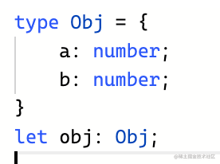

就有类型提示了：

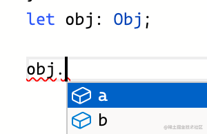

也会做类型检查：

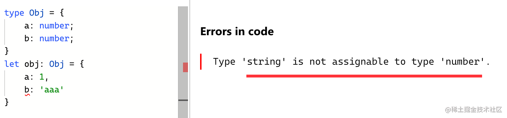

但也不是所有的变量都要手动声明类型，因为 ts 会做自动类型推导：

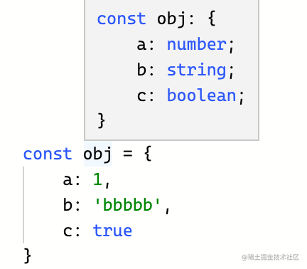

同样是有类型提示和检查的：

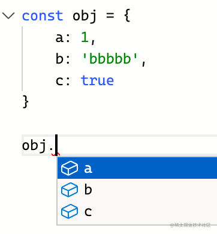

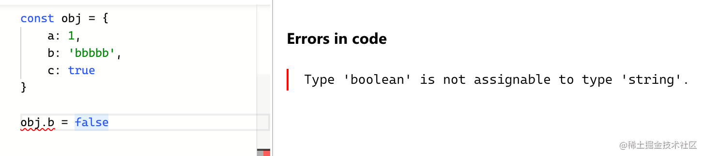

而且推导的时候还可以加上 as const，这样推导出的是字面量类型（不过会有 readonly 的修饰）：

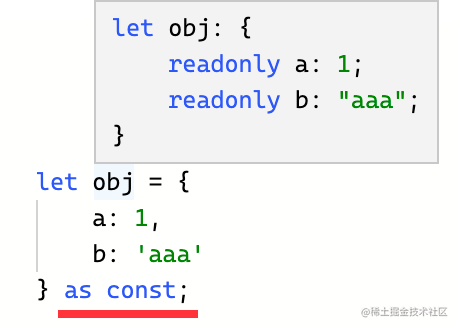

那问题来了，什么时候手动声明类型，什么时候用自动推导呢？

比如上面这个 obj，b 属性推导出的是 string，但其实也可能是一个 number。

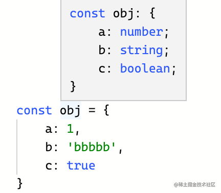

但给它赋值 number 会报错：

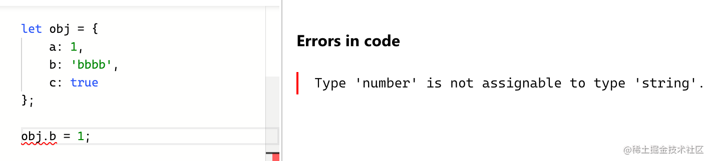

这种就得手动声明类型了：

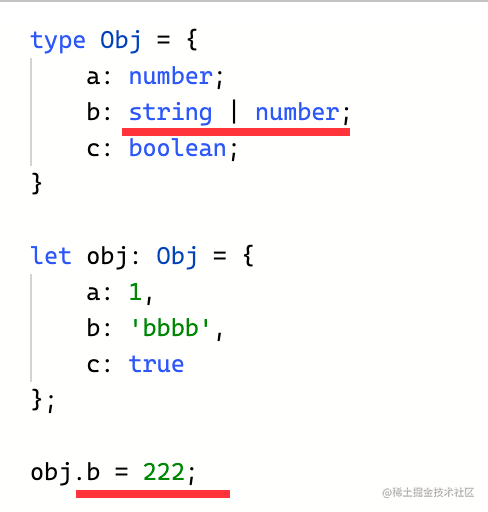

还有，函数的参数，只有调用的时候才能知道参数具体的类型，这时候怎么自动推导？

没办法推导。

所以也得手动声明类型：

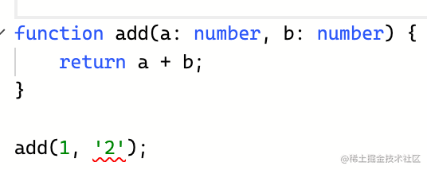

总之，**ts 代码包括自动推导出的类型、手动声明的类型两种。**

自动类型推导省去了很多写类型的麻烦，但很多情况下还是要手动声明类型的。

但手动声明的类型是有局限性的，比如这样的类型：

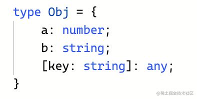

key:string 那部分是索引签名，也就是任意的 key 为 string，value 为任意类型的索引都可以加。

它是可以检查出类型错误，也支持扩展任意索引。

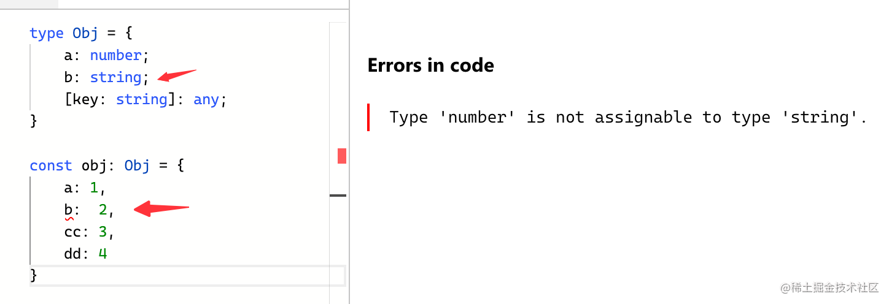

但它只会提示声明的索引，动态添加的那些是不会提示的：

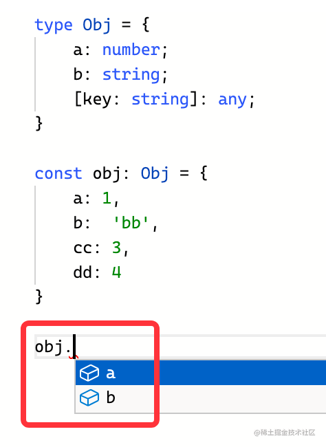

这样其实有的时候并不方便。

而如果自动推导呢？

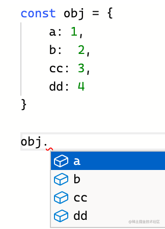

这样就可以提示所有的索引了。

但是呢其中 b 的类型又不对，还是需要声明类型来约束。

是不是就很头疼？

用声明的方式少了具体赋值的变量类型的信息，用自动推导的方式又不能保证类型是对的。

有没有两全其美的办法呢？

4.9 之前还真没有。

不过 4.9 加入了一个 satisfies 的新语法。

这样用：


不需要给变量声明这个类型了，用自动推导出来的类型，这样提示就是根据具体的值来的。

而且，还有了声明的方式的类型检查。

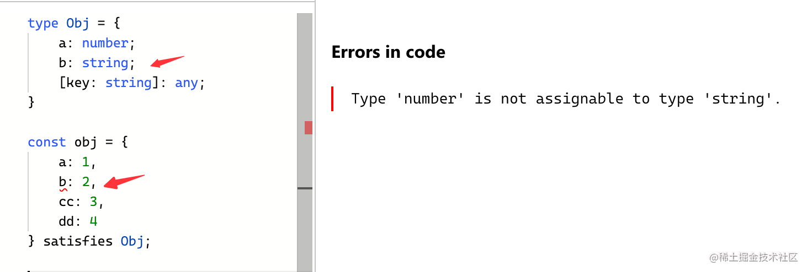

是不是两全其美！

这就是为什么 ts 要增加 satisfies 这个语法。

它的作用就是**让你用自动推导出的类型，而不是声明的类型，增加灵活性，同时还可以对这个推导出的类型做类型检查，保证安全。**

但是，satisfies 的方式也有它的问题，比如这里用了推导出的类型：

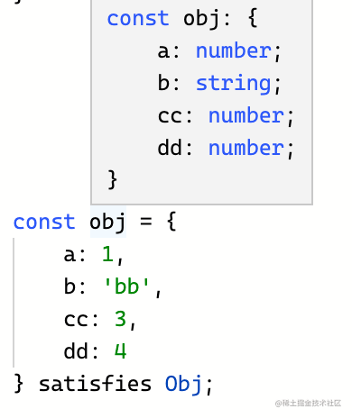

那就不能动态扩展索引了：

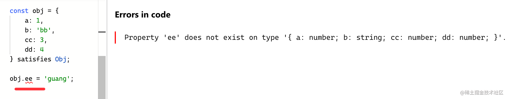

而如果是声明的那种索引签名，是支持扩展的：

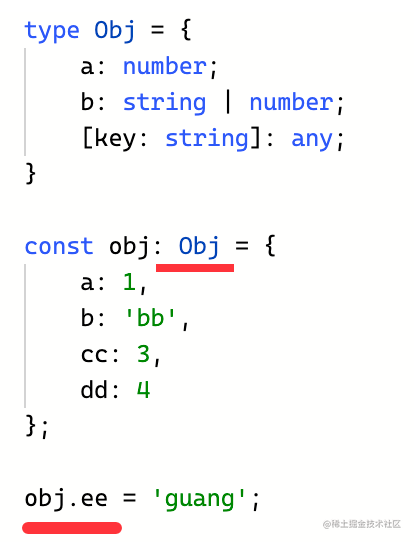

所以，具体什么时候用声明的类型，什么时候用推导出的类型 + satisfies，还是要看情况的。

这个新语法还是很有用的，估计以后在代码里会经常看到。

不过现在还没咋见，因为他还是在 beta 的版本。

需要下载 ts 指定 beta 才行：

```
npm install typescript@beta
```

这里的 @beta 是指定标签的意思。

我猜大家都用过 xxx@latest 的方式下载过 npm 包。

这个 latest 也同样是标签。

你可以通过 npm dist-tag ls 的方式看到 npm 包的所有 tag：

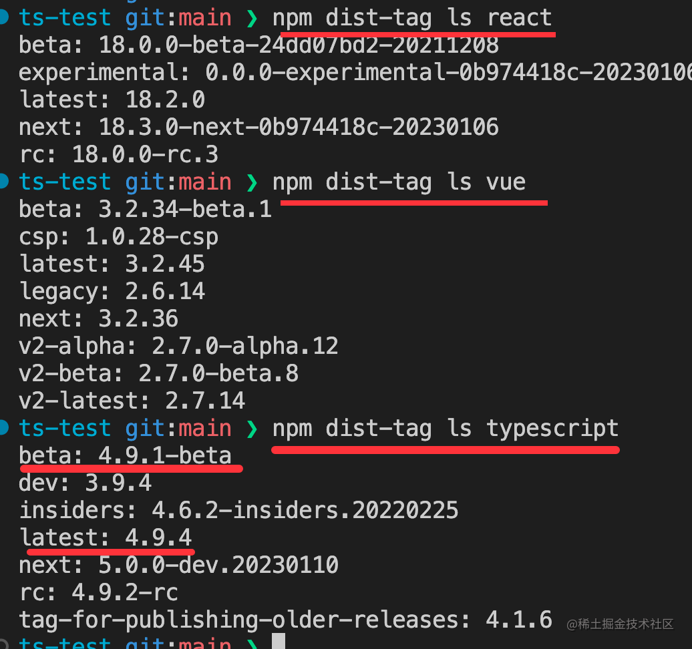

所以说 npm install typescript 是下载不了 beta 版本的包的，它下载的是 latest 的 tag 对应的版本。只有手动指定 typescript@beta 才可以。

说点题外话，这个 tag 是怎么打上的呢？

发包的时候会用 npm publish，这种会自动打上 latest 的 tag。

也可以手动 npm publish --tags beta，这样打的就是 beta 的 tag了。

除了发包的时候可以指定 tag，平时也可以通过 npm dist-tag 命令来给某个版本的包打上 tag：

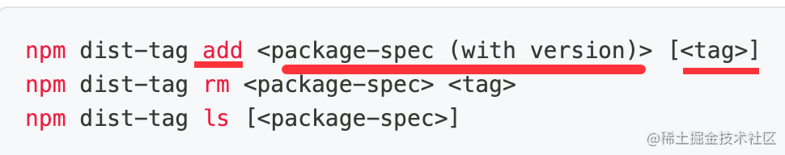

## 总结

TypeScript 中变量的类型有两种，一种是手动声明的，一种是自动推导的。

大多数情况下，不用手动声明类型，用自动推导的就行，比较方便。

但像函数参数、需要约束的变量类型等情况下就得手动声明了。

有的时候还是自动推导出的类型更合适一些，但是还需要通过声明的方式对其中的类型做约束。

不能两全其美。

所以 ts 加入了 satisfies 的语法，这样就可以用自动推导出的类型了，它也可以加上类型的约束。

算是融合了自动推导的类型和手动声明的类型的优点。

现在这个语法还在 4.9-beta 的包里，需要 npm install 的时候手动指定 dist-tag。

估计等它到正式版之后，你再写 ts 代码会有新的纠结了：

我是用手动声明的类型，还是自动推导的类型 + satiesfies 呢？这是个问题。
