# 28.加餐：JSDoc 真能取代 TypeScript？

这几个月，想必大家都听到过一个新闻：

Svelte 弃用 TypeScript，改用 JSDoc 了。

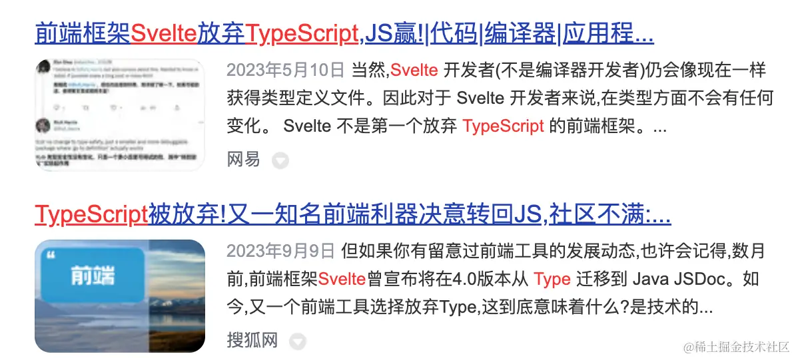

TypeScript 我们知道，是用来给 JS 加上类型的，可以实现类型提示和编译时的类型检查。

那 JSDoc 能够完成一样的功能么？Svelte 是出于什么原因弃用 TS 的呢？

先不着急回答这个问题。

我们总得先了解下 JSDoc：

可能大家认为的 JSDoc 是这个东西：

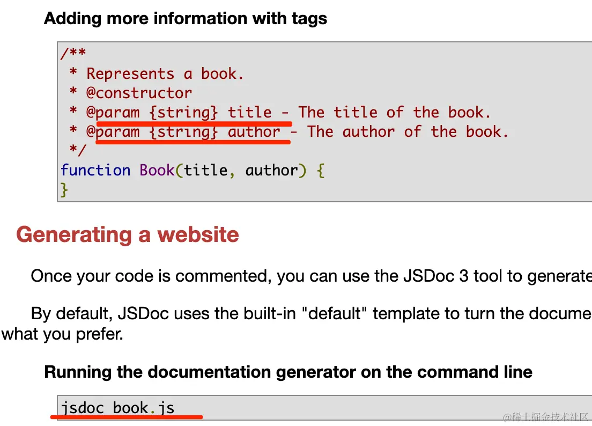

在代码的注释上加上类型的标识，然后通过 jsdoc 命令行工具，就可以直接生成文档。

比如这样的文档：

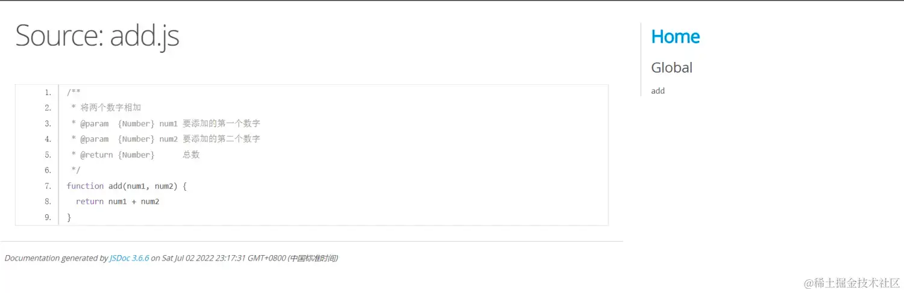

确实，这个是 JSDoc 最初的含义。

但我们说的 JSDoc 并不是这个，而是 TS 基于 JSDoc 语法实现的，在注释里给代码添加类型的语法。

文档在[这里](https://www.typescriptlang.org/docs/handbook/jsdoc-supported-types.html#type)：

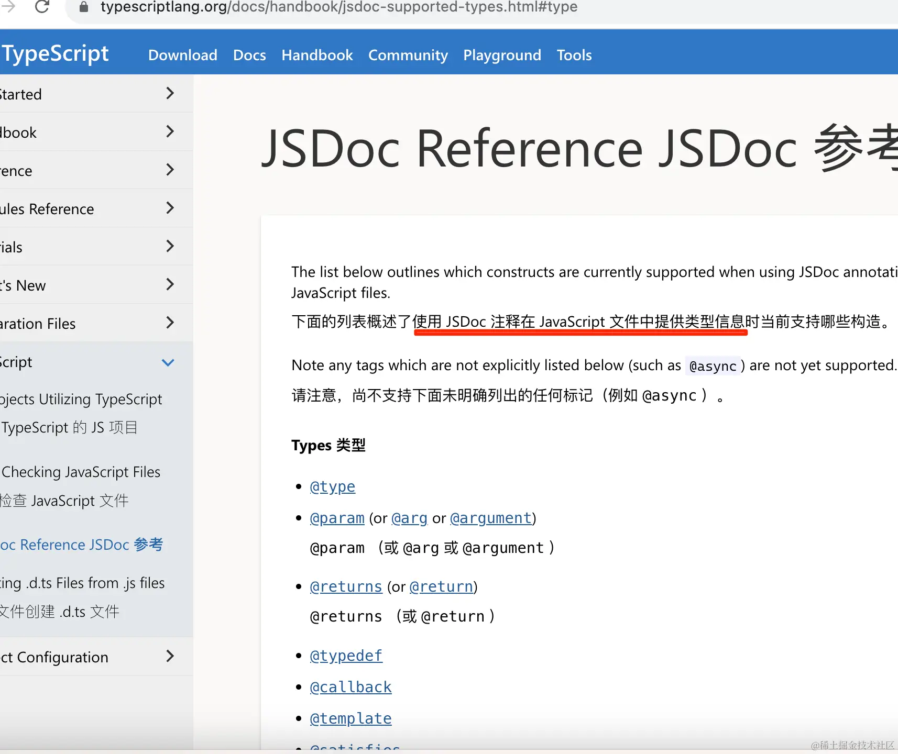

ts 支持在 js 文件的注释里，通过 JSDoc 的语法给它加上类型。

至于有什么意义，那可就太多了。

比如一个 JS 的配置文件，你想在写配置的时候能有提示，就可以用 JSDoc：

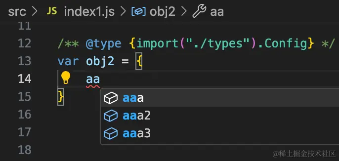

这里注释里的 @type 就是 JSDoc 声明类型的语法。

在 vite 文档里，你可以看到对 JSDoc 的支持：

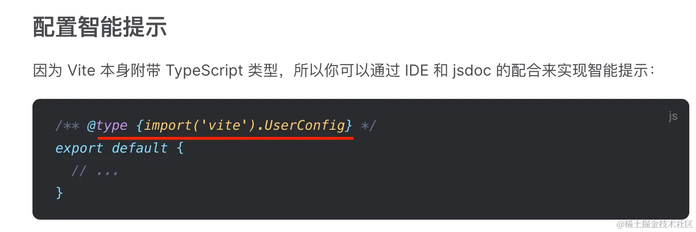

我们自己试一下：

```
mkdir jsdoc-test
cd jsdoc-test
npm init -y
```

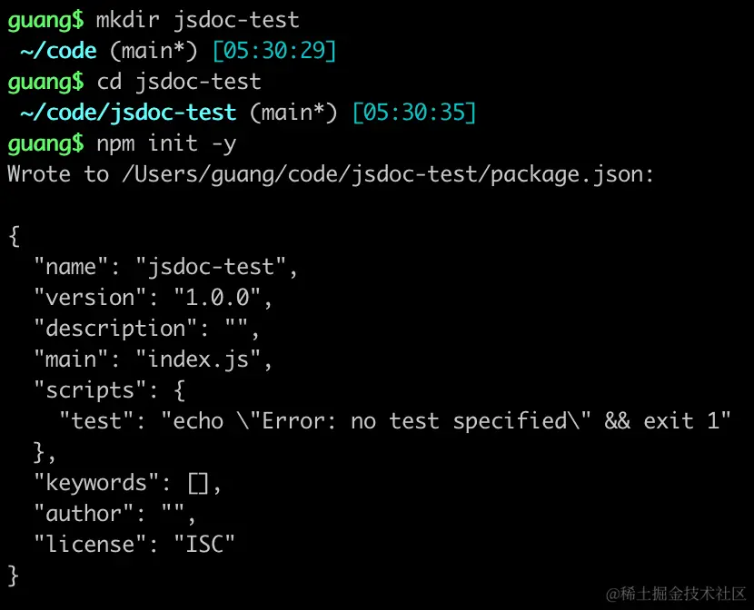

创建项目和 package.json。

然后安装 typescript：

```
npm install --save-dev typescript
```
创建 tsconfig.json 文件：

```
npx tsc --init
```

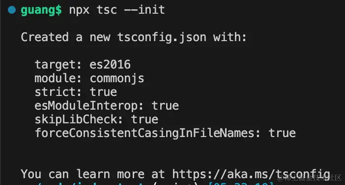

生成的 tscconfig.json 太多注释了，我们删一下：

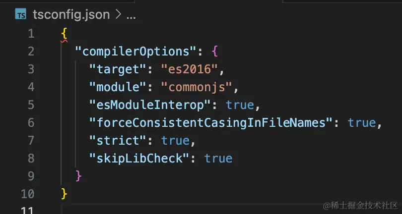

然后创建 src/index.ts

```javascript
function add(a: number, b: number) {
    return a + b;
}
```

这样在用到这个 add 的时候，就会做类型检查：

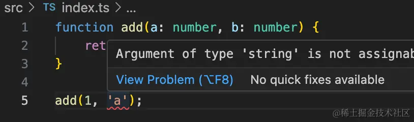

在 tsconfig.json 里 include 一下：

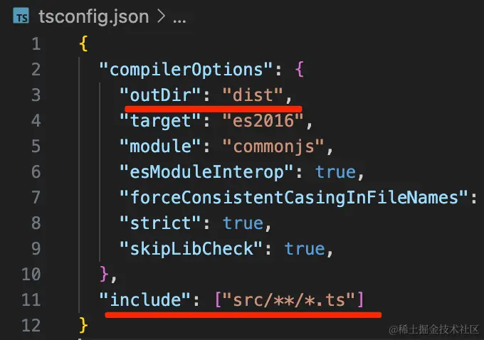

之后执行编译：

```
npx tsc
```
生成的代码是这样的：

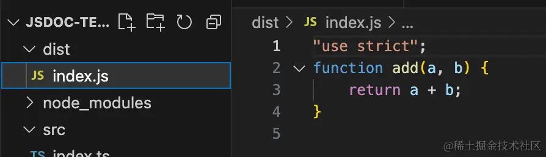

这个是 ts 的编译流程，大家都很熟悉。

现在问题来了，我有一个 src/index2.js，怎么实现一样的类型检查呢？

这样写：
```javascript
/**
 * @param {number} a  参数aaa
 * @param {number} b  参数bbb
 */
function add2(a, b) {
    return a + b;
}
```
注释里的就是 JSDoc 的语法。

但现在并没有报类型错误：

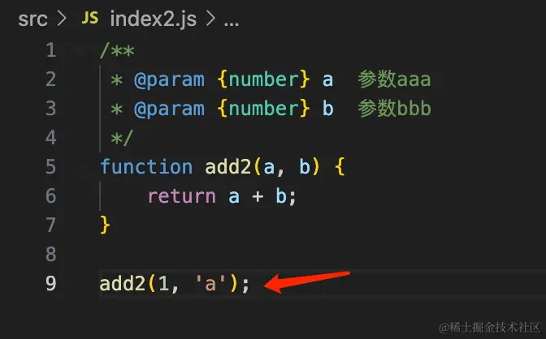

需要在 tsconfig 里开启：

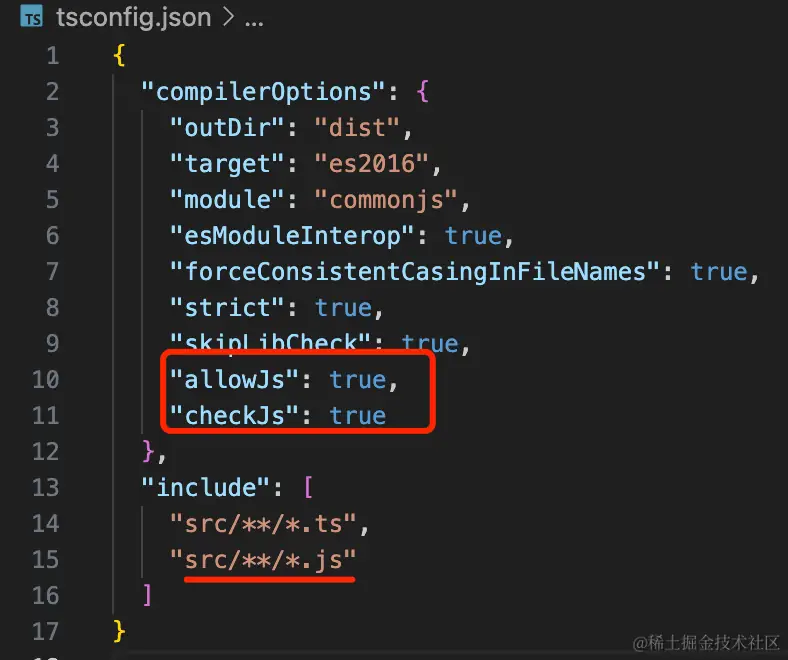

allowJS 是允许编译 JS，checkJS 是在编译 JS 的时候也做类型检查。

开启后你就会发现，js 文件里也会做类型检查了：

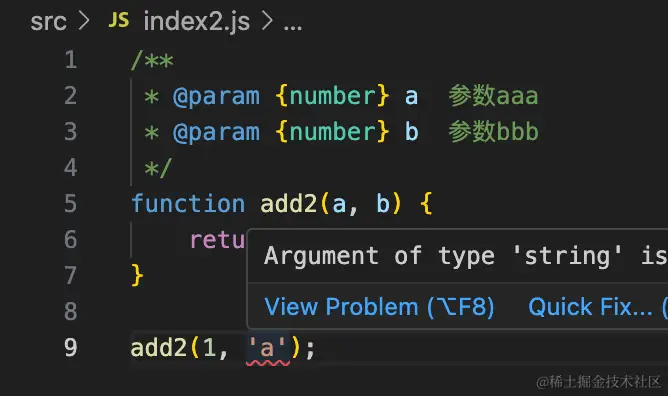

hover 上去的时候，会提示类型信息：

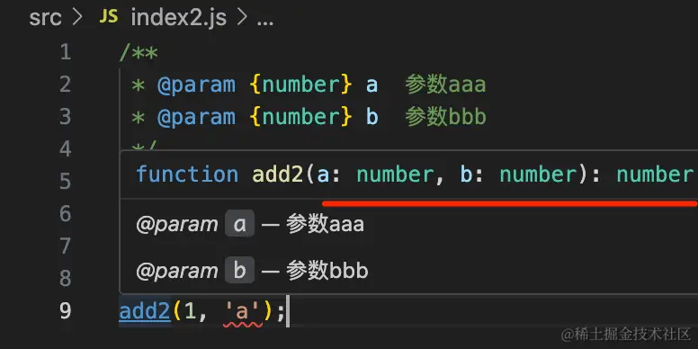

注意，这可不是用 ts 语法声明的类型，而是用 JSDoc 写的。

然后我们开启 dts：

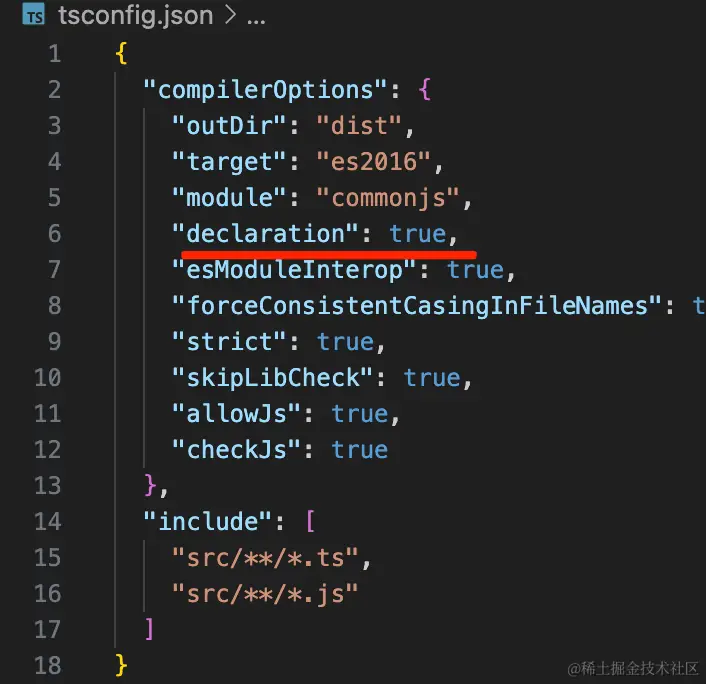

再编译：

```
npx tsc
```
可以看到同样能产出 d.ts 类型声明文件：

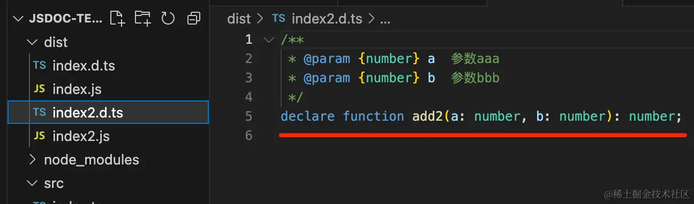

而这时候产物的 JS 代码和源码差别不大：

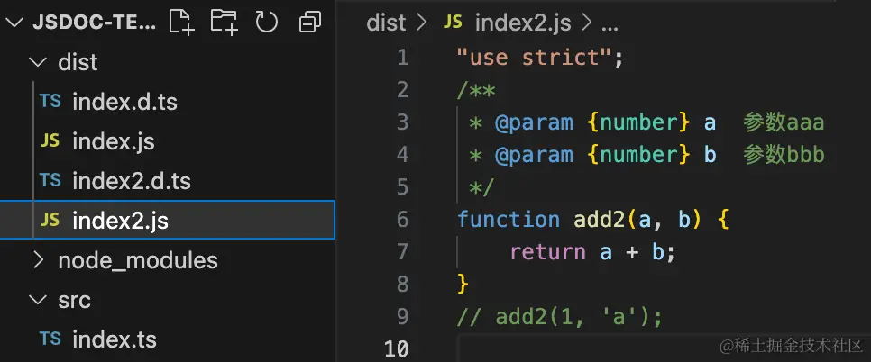

因为本来 JSDoc 就是在注释里的，类型检查也好、生成 dts 也好，都不用改动源码。

这就是 JSDoc 最大的好处：**无侵入的给 JS 加上类型，拥有和 ts 一样的类型检查、类型提示、生成 dts 等功能，但却不需要编译，因为 JS 代码可以直接跑。**

有同学可能会说，就声明个函数类型就和 ts 一样了？

那肯定不止这么点语法，我们再看几个：

比如可以用 @type 给变量声明类型：

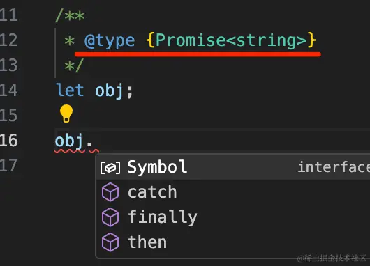

这里可以是各种类型，比如函数类型：

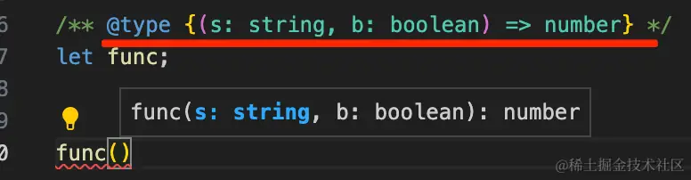

如果类型被多处用到，可以用 @typedef 抽出来，单独命名：

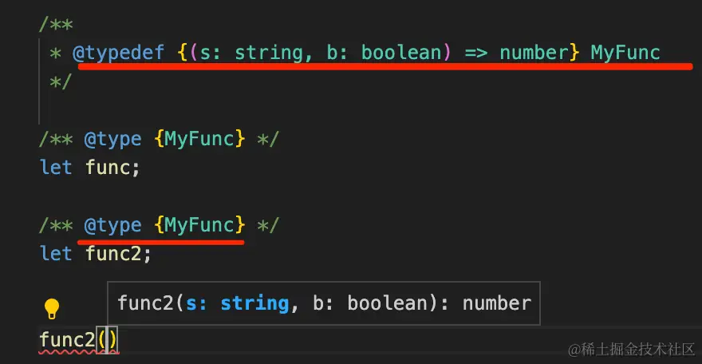

你还可以把这个类型放到 dts 文件里，在这里 import 进来用：

比如我把它放到 guang.d.ts 里：

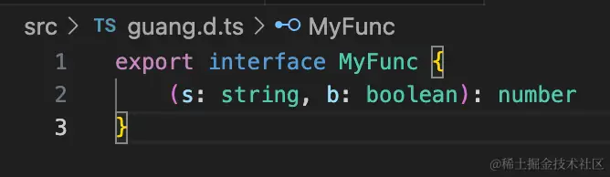

然后这样引入用：

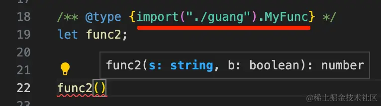

这样就避免了在 @typedef 里写大段类型定义了，不然代码写多了就不好维护了。

这样就可以在 dts 里定义类型，然后在 js 里通过 JSDoc 引入来用。

**dts + JSDoc 是绝佳搭配。**

然后我们继续看 JSDoc 的函数类型定义：

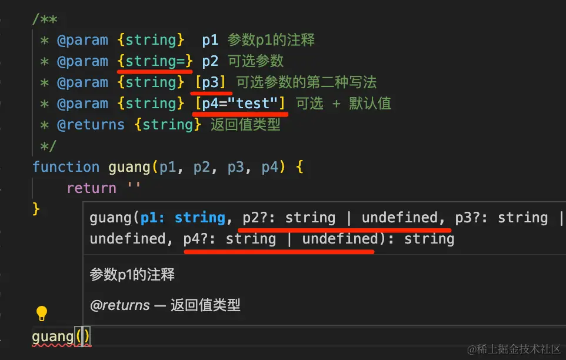

这分别是可选参数、参数默认值、返回值类型的语法。

还有同学说，那 ts 的泛型呢？这个 JSDoc 不支持的吧？

当然也是支持的，这样写：

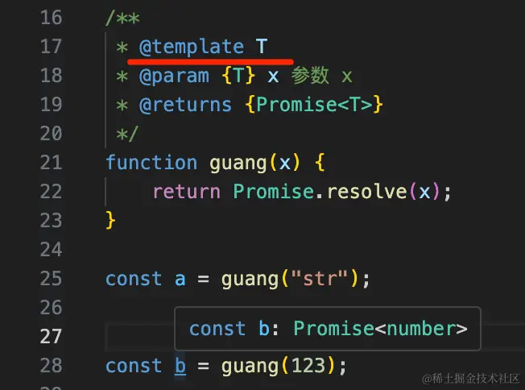

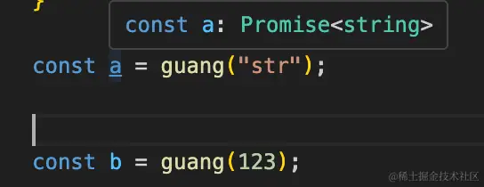

通过 @template 声明类型参数，然后下面就可以用了。

泛型都可以用，那基于泛型的类型编程，也就是类型体操当然也可以玩：

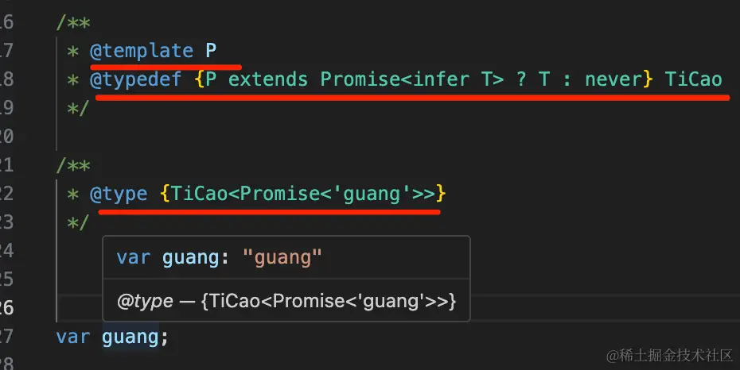

一般这种复杂类型还是抽离到 dts 里，然后 @type {import('xxx').xxx} 引入比较好。

再就是 class 了，这个自然也是支持的。

比如声明一个泛型类：

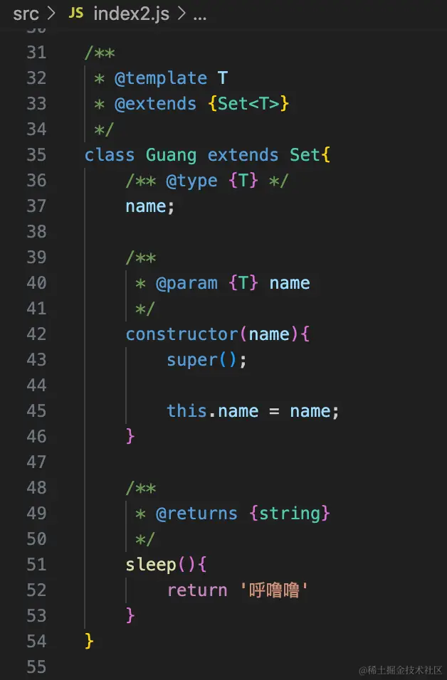

这段类型大家能看懂么？

就是声明了一个泛型类，有一个类型参数 T。它通过 @extends 继承了 Set\<T\> 类型。

它有个 name 属性的类型为 T，并且还声明了构造器和 sleep 方法的类型。

用一下试试：

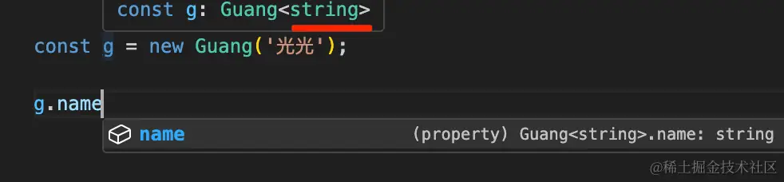
      
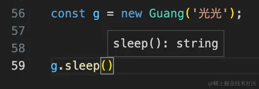
    
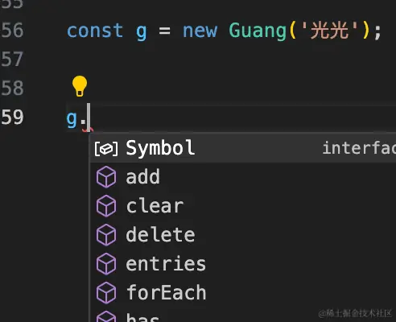
    
name 和 sleep 的类型，继承的 Set 的类型，都没问题。
    
这就是 JSDoc 定义 class 类型的方式。

综上，用 JSDoc 可以定义变量、函数、class、泛型等，可以从别的 dts 文件引入类型。
    
基本上 ts 能做的，JSDoc 也都可以。
    
但是，JSDoc 语法毕竟是在注释里的，多了一大坨东西，而且写起来也不如 ts 语法直观。
    
所以，一般没必要这样写，除非你是给 JS 加类型。
    
那 svelte 是出于什么原因选择了 JSDoc 的方式呢？
    
看下那个 pr 就知道了：
  
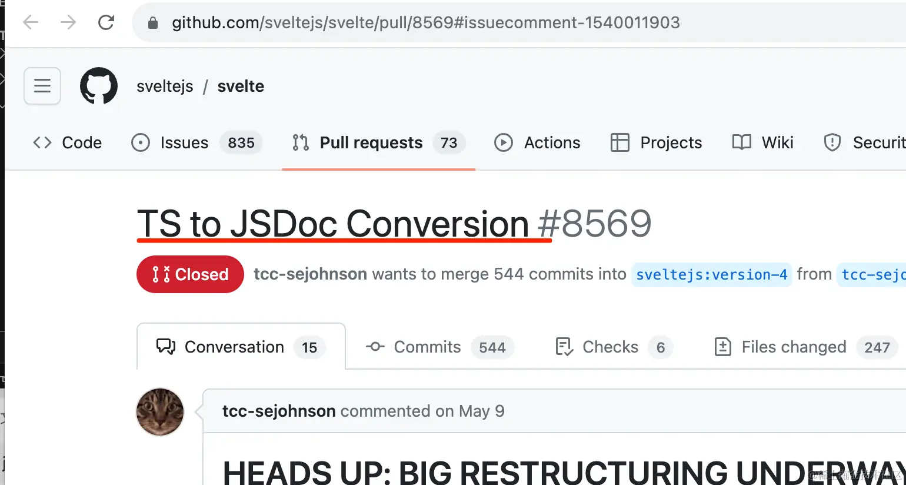

直接看官方回复：


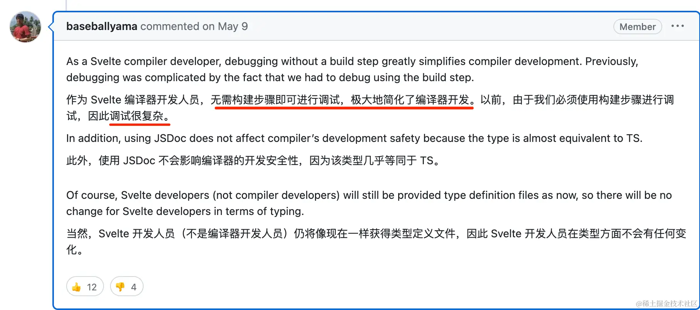

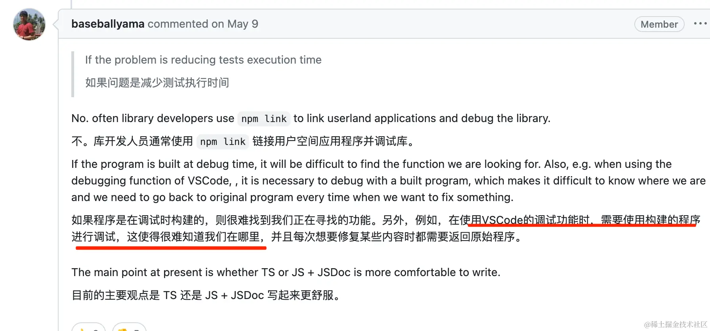

也就是说，用 ts 的语法，需要编译后才能调试，这样需要再 sourcemap 一次才能对应到源码。

但是用 JSDoc 的方式，不用编译就可以直接调试。

估计是遇到了啥 VSCode 调试上的问题。

然后下面还有个 VSCode 调试器的维护者评论说，有任何调试相关的问题可以找我：

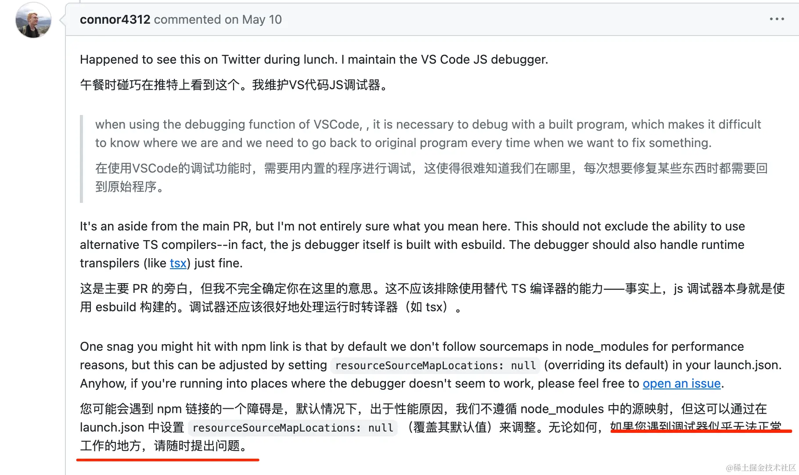

总之，svelte 选择从 ts 转成 JSDoc + dts 并不是因为 ts 有啥问题，主要是为了调试方便。

那我们再看下它怎么用的吧：

可以看到，是 js 文件里用 JSDoc 来声明类型：

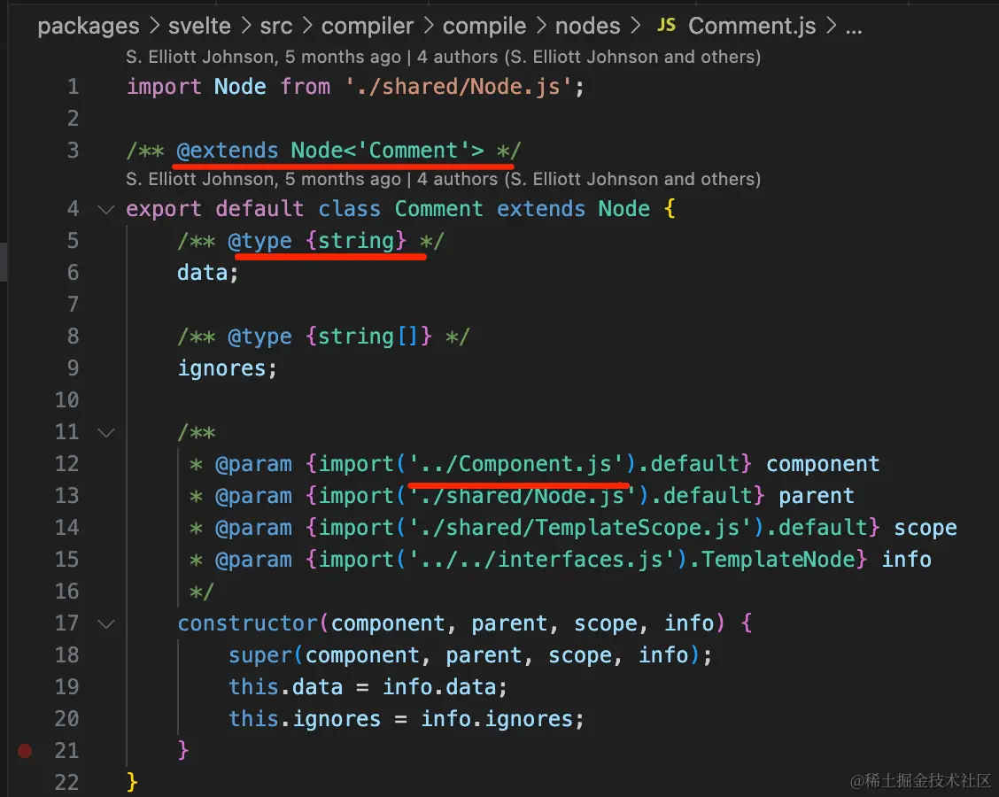


然后复杂类型在 dts 里定义，然后这里引入：

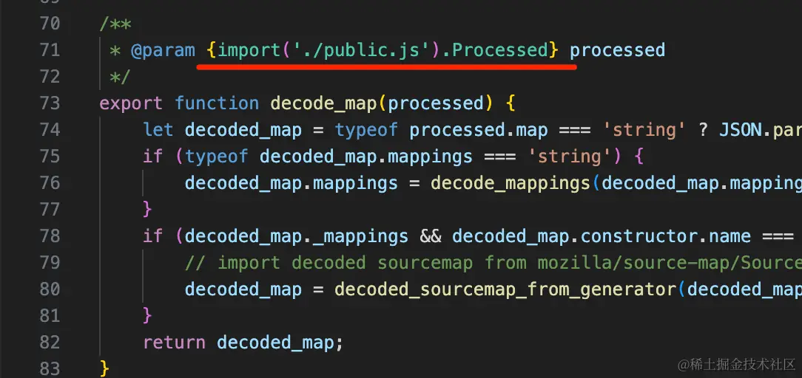

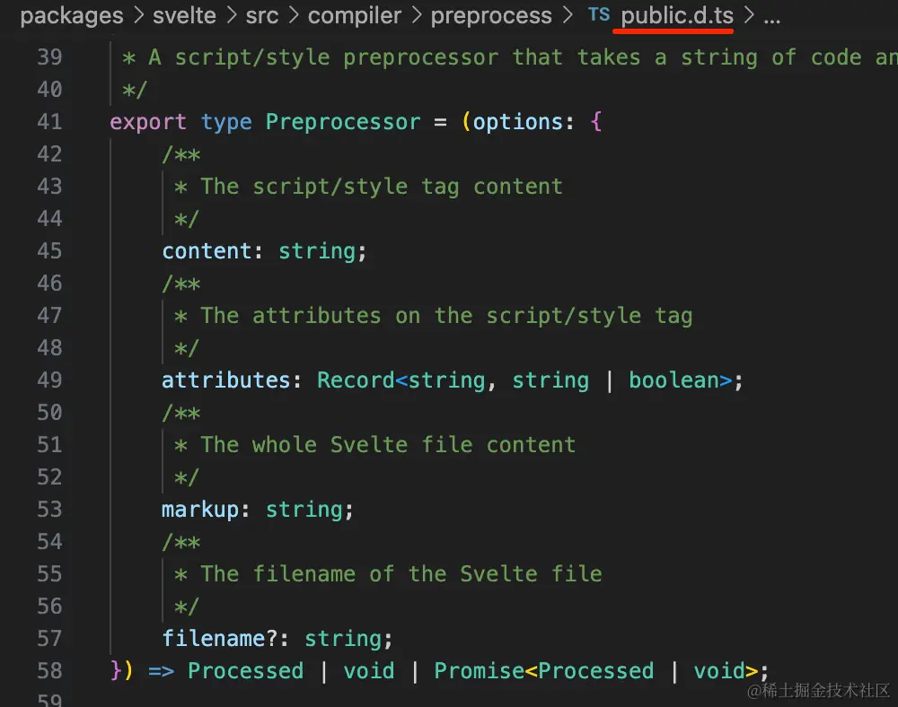

就和我们刚才测试的一样。

## 总结

这几个月经常听到知名开源项目抛弃 ts 拥抱 JSDoc 的新闻，我们一起探究了一下。

JSDoc 是在 js 的注释里通过 @type、@typedef、@template、@param 等来定义类型，然后开启 checkJS 和 allowJS 的配置之后，tsc 就可以对 js 做类型检查。

ts 里可以定义的类型，在 JSDoc 里都可以定义，比如变量、函数、class、泛型，甚至类型编程等。复杂的类型还可以抽离到 dts 里，在 @type 里引入。

也就是说 JSDoc 确实可以替代 ts。

然后我们看了 svelte 选择 JSDoc 的原因，只是为了调试方便。这样不用编译就可以直接跑 js 代码，可以直接定位到源码。而且这样也能利用 ts 的类型提示和检查的能力。

所以很多人就说 svelte 抛弃了 ts。

这叫抛弃么？

并不是，JSDoc 只是另一种使用 ts 的方式而已。
