# 29.加餐：一道字节面试真题

前天，小册群友问了我一个 TS 体操问题，说是面字节时遇到的。


今天又催了一下：


面试题是这样的：

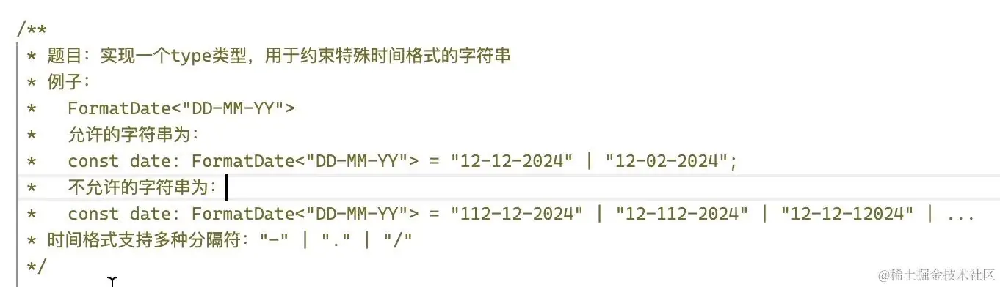

让实现这个 FormatDate 的类型，用来限制字符串只能是指定的日期格式。

看起来好像没多大难度，就是提取出 YY、MM、DD 和分隔符，然后构造对应的字符串类型就好了。

但上手试了一下，还真没那么简单。

首先，我们用模式匹配的方式，也就是 extends + infer 来提取出 YY、MM、DD 这三部分：

```javascript
type Seperator = '-' | '.' | '/';

type FormatDate<Pattern extends string> = 
  Pattern extends `${infer Aaa}${Seperator}${infer Bbb}${Seperator}${infer Ccc}`
    ? [Aaa,Bbb,Ccc]
    : never;
```

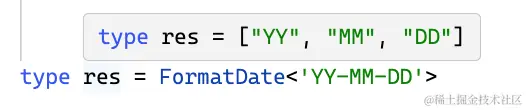

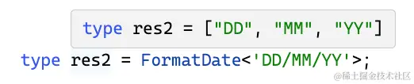

同样，也可以提取出分隔符部分：

```javascript
type FormatDate<Pattern extends string> = 
  Pattern extends `${infer Aaa}${Seperator}${infer Bbb}${Seperator}${infer Ccc}`
    ? Pattern extends `${Aaa}${infer Sep}${Bbb}${infer _}${Ccc}`
      ? [Aaa, Bbb, Ccc, Sep]
      : never
    : never;
```

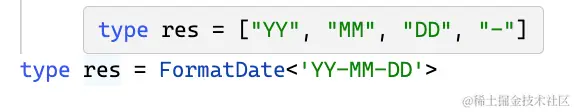

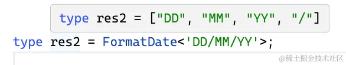

然后根据 YY、MM、DD 分别构造 4 位和 2 位的字符串，最后组合起来不就行了？

但问题就在这里。

组合字符串字面量类型是这样写：

```javascript
type Num = 0 | 1 | 2 | 3 | 4 | 5 | 6 | 7 | 8 | 9;

type YY = `${Num}${Num}${Num}${Num}`;

type MM = `${Num}${Num}`;

type DD = `${Num}${Num}`;

type GenStr<Type extends string> = 
  Type extends 'YY'
    ? YY
    : Type extends 'MM'
      ? MM
      : DD;

type res3 = `${GenStr<'YY'>}-${GenStr<'MM'>}-${GenStr<'DD'>}`;
```

就是根据 YY、MM 还是 DD 生成不同的字符串字面量，然后组合到一块。

这时候会提示你 union 数量太多：

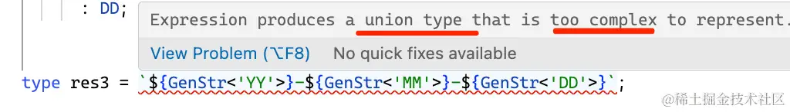

因为组合起来的情况太多了。

这时候需要减少 union 数量才行。

所以我们可以改成这样：

```javascript
type Num = 1 | 2 | 3 | 4 | 5 | 6 | 7 | 8 | 9;

type Num2 = Num | 0

type YY = `19${Num2}${Num2}` | `20${Num2}${Num2}`;

type MM = `0${Num}` | `1${0 | 1 | 2}`;

type DD = `${0}${Num}` | `${1 | 2}${Num2}` | `3${0 | 1}`;

type GenStr<Type extends string> = 
  Type extends 'YY'
    ? YY
    : Type extends 'MM'
      ? MM
      : DD;

type res3 = `${GenStr<'YY'>}-${GenStr<'MM'>}-${GenStr<'DD'>}`;
```
也就是年份只能是 19 和 20 开头，月份只能是 1-12 的数字，日期是 01-31 的数字。

这样，组合就少了很多。

再试下：

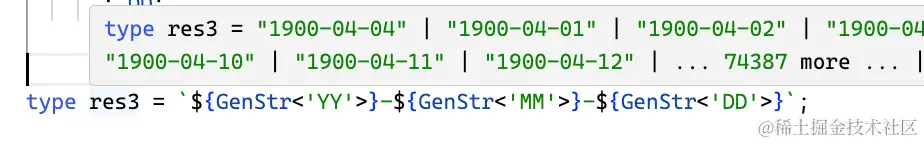

现在就能正常计算出类型了。

然后用之前提取出的 Aaa、Bbb、Ccc 和 Sep 来生成字符串字面量类型：

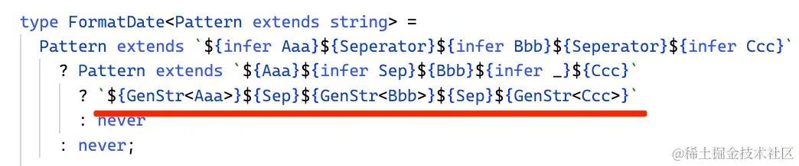

这样，就完成了需求：

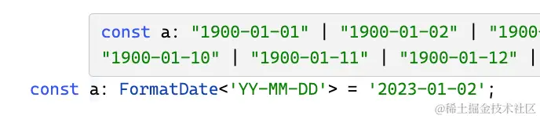

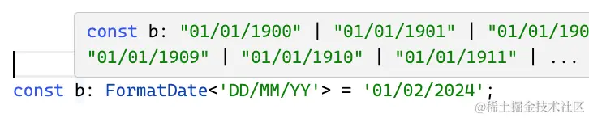

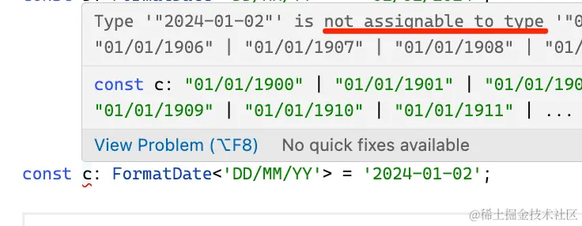

回过头来看一下，这个类型难么？

思路并不难，就是通过模式匹配（extends + infer）提取出各部分，然后构造对应的字符串字面量类型，组合起来就好了。

它难在如果直接组合，union 数量会过多，从而报错。

所以需要根据年月日的特点，对生成的字符串字面量类型做更精准的控制。

这样，就能生成满足需求的日期字符串类型。

全部代码如下，大家可以试试：

```javascript
type Seperator = '-' | '.' | '/';

type Num = 1 | 2 | 3 | 4 | 5 | 6 | 7 | 8 | 9;

type Num2 = Num | 0

type YY = `19${Num2}${Num2}` | `20${Num2}${Num2}`;

type MM = `0${Num}` | `1${0 | 1 | 2}`;

type DD = `${0}${Num}` | `${1 | 2}${Num2}` | `3${0 | 1}`;

type GenStr<Type extends string> = 
  Type extends 'YY'
    ? YY
    : Type extends 'MM'
      ? MM
      : DD;

type FormatDate<Pattern extends string> = 
  Pattern extends `${infer Aaa}${Seperator}${infer Bbb}${Seperator}${infer Ccc}`
    ? Pattern extends `${Aaa}${infer Sep}${Bbb}${infer _}${Ccc}`
      ? `${GenStr<Aaa>}${Sep}${GenStr<Bbb>}${Sep}${GenStr<Ccc>}`
      : never
    : never;

const a: FormatDate<'YY-MM-DD'> = '2023-01-02';

const b: FormatDate<'DD/MM/YY'> = '01/02/2024';

const c: FormatDate<'DD/MM/YY'> = '2024-01-02';
```

[playground 地址](https://www.typescriptlang.org/play?ssl=44&ssc=1&pln=13&pc=1#code/FAegVGwARlgZGYO7dBY-4PO1ANzoADlBUcgFwJ4AOApoN4+g0eqAw-4BSugcXKBlfoPrmgnk6BR1oG+mgL6mA8FoPD6gIW6B1bUBk3oCY5aLEDR8oAVtJOKjyAYgHsATgFsAhjgAiWogB4ARNu0BaALLnTATWuGAfHPmBBRUAd0YNGAuOVkx5UAMZKAHYAzjhQACZ6AFxQyupaujgGxmaWNnb2UAC8UIYAjABMpkWmhQAMhQAshlAAPnmllWWVNQDcTlCAsHJuHiLenYGh4VHJsfGaOnpGJhZWtg45jaWlFdW1DQXF+autG43bh3v1UAB053KcvID0poCAxoBYmoCznoBgSoApaUJIhqb7hqc-IIZxCBgMB8MQoABlIjEFRaVRLADkpgRJwRpxRDQRIARHVBhCIUAAcgBXNRLfInQonADMJyqJwArCcAGwnADsJwAHCcAJy4sEEklqKm5IUncoggVQWxLAAG+R5ABIAN5CwoAXxVavVspOsoqWtJGsNwp1-PxUEscvKJp1evyKvKJwpDQ1svN4JMcsdmtVpLtDVlKpdUGNftNusD1MdzrNkotAHEiEEITgVPoACoWogAD2SQQiISgYRUAEsggBzLK5aBQLPg3P5wtQBG2BG1+QAfml1g7UFi9YJjeTzYRlnbfj83csffksRMHoJE0S0wAClpkioglBhwWiyXy1WlrX1zhN9vd82g8rywAzIgqKAAQQ0Gl9UJhcJUvrvD6gACEACNAPfaEHy-H8gnvR8AGF-H8HU+27U9zx3PMRyLa8XzfFVf0fD9fSAkDcKgv8AH1fTghDZVnKBu2vJMUzTfRsPsUCCF9RjU3TIi2JVAiVS45iqLYmjJznKAgiIAA3B8+1iKTZJUXEhjCKANHGVRJiSAxW2sOZTBMBFqxbNZqVMcp8gswocRBVTwkAzSEimZJ9AREwQEsEA2xMhFLJASoQDWKpbOAeyAic7Tpnc7RPPMbzrGMxFgosqzKlCoA)

## 总结

今天我们做了一道字节的 ts 体操真题。

核心思路就是模式匹配（extends + infer）提取出各部分内容，然后构造日期字符串。

答出这个，应该就有大部分的分了。

但是如果直接构造，会因为 union 数量太多导致失败。

这时候要根据日期的特点想办法减少 union 的数量，直到可以顺利生成。

再答出这个，这道面试题就稳了。

这道题整体来说还是比较难的，既考察了模式匹配+ 构造的 ts 类型编程基础，又考察了对 union 太多的情况的处理，算是一道比较高阶的面试题。
