# 10 基础9：小程序，app调试环境配置

> 任何你写的代码，超过6个月不去看它，当你再看时，都像是别人写的。—— Eagleson’s law

在解决了大部分开发的时候，我们的开发可以往调试处理兼容方向走了，虽然浏览器（内置浏览器）提供了很大的便利性，可以在控制台查看交互信息，样式的渲染。但实际的代码呈现还是有不一样的，并且模拟器存在一定的误差，因此需要真机模拟处理。

在操作之前先说一下关于兼容。

## 浏览器兼容

web 网页是以浏览器为载体的，因此兼容问题都是浏览器方面的问题，当前市场上浏览器种类很多，不同浏览器的内核也不尽相同，所以各个浏览器对网页的解析存在一定的差异。浏览器内核主要分为两种，一是渲染引擎，另一个是 js 引擎，内核更加倾向于说渲染引擎。

开发 h5 页面要处理兼容，需要了解不同浏览器的解析方式和对html，css，js三者不同版本的支持，比如桌面端浏览器对 ES2015 的支持情况：

1. Chrome：51 版起便可以支持 97% 的 ES6 新特性。
2. Firefox：53 版起便可以支持 97% 的 ES6 新特性。
3. Safari：10 版起便可以支持 99% 的 ES6 新特性。

那么如果你的 js 使用了 ES6 的语法，而且没有转编译成这些版本浏览器支持的语言去预览查看的话，浏览器就会认不出你写的代码而报错。

html，css的兼容问题大致如此，导致渲染出现异常，未能达到预期效果。

网页在各种浏览器上的显示效果可能不一致而产生浏览器和网页间的兼容问题，网站必须做好浏览器兼容，才能够让网站在不同的浏览器下都正常显示。因此只要多个浏览器查看有没有问题出现。很幸运的是，使用 HBilderX 编译器的 ES6 编译插件就可以在 Uniapp 酸爽使用 ES 了。你的代码就会编译成其他浏览器可识别的 ES2015 版本代码了。

## 小程序兼容

本质其实就是 hybrid app，介于 web app 与 native 之间，具备丰富的调用手机各种功能的接口，同时又具备灵活性，可跨平台。

> 微信小程序运行在三端：iOS（iPhone/iPad）、Android 和 用于调试的开发者工具。
> 三端的脚本执行环境以及用于渲染非原生组件的环境是各不相同的：
> 在 ios 上，小程序逻辑层的 javascript 代码运行在 JavaScriptCore 中，视图层是由 WKWebView 来渲染的，环境有 ios8、ios9、ios10；
> 在 Android 上，旧版本，小程序逻辑层的 javascript 代码运行中 X5 JSCore 中，视图层是由 X5 基于 Mobile Chrome 57 内核来渲染的；
> 新版本，小程序逻辑层的 javascript 代码运行在 V8 中，视图层是由自研 XWeb 引擎基于 Mobile Chrome 67 内核来渲染的；
> 在开发工具上，小程序逻辑层的 javascript 代码是运行在 NW.js 中，视图层是由 Chromium 60 Webview 来渲染的。

小程序是运行在微信，以微信作为载体的，大部分兼容性问题都已经由微信内部处理。更多的兼容问题体现在不同微信版本中。我们要处理的是一些小程序特性的问题，举例几个兼容问题：

1. scroll-view 在手机上可能会出现滚动条
2. 直接在标签添加 style 行内样式
3. css 不支持本地路径图片
4. 控件层级表现有出入，z-index 在 native 组件下失效

应该说这些问题只是因为语言特性渲染机制不同产生的，这些情况微信也在文档做了说明，要想处理兼容问题，熟知语言框架的特性，才能避免问题，最快定位问题，处理问题。开发时尽量避免使用太新的css，js，html，可能在老款手机上产生浏览器兼容问题。

## 小程序调试

进行小程序调试，打开第一章说过的 [微信开发者工具](https://developers.weixin.qq.com/miniprogram/dev/devtools/download.html)，而且还需要申请一个微信小程序的 AppID ，登录 [https://mp.weixin.qq.com](https://mp.weixin.qq.com) 申请。

接着：

1. 在 HbuilderX 编译器中打开这个工程，找到 manifest.json 文件并选中；

2. 找到微信小程序配置，在配置面板微信小程序 AppID 中输入刚才申请注册的 AppID；

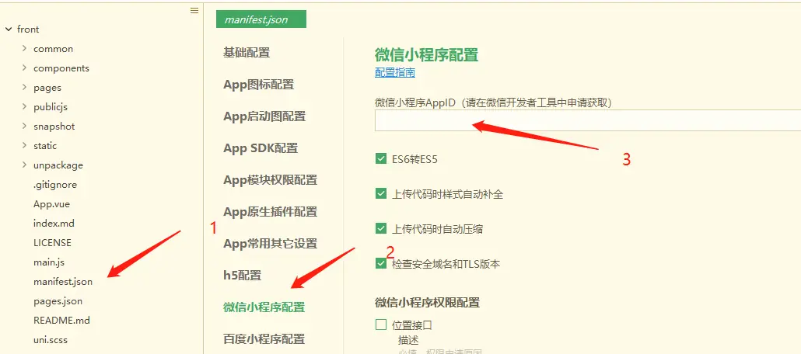

3. 点击【运行】>> 【运行到小程序模拟器】>> 【运行到小程序模拟器】>> 【微信开发者工具】 （选定第二个，可指定启动页面）：

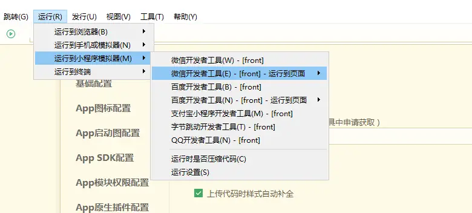

4. 项目开始编译，并启动微信开发者工具，可能需要在微信开发者工具中开启服务端口（第一章说过），然后 HbuilderX 才能访问，这个在控制台一般有提示，打开微信开发者工具【设置】>>【安全设置】>> 【开启服务端口】就行了（当然还需要手机扫码登录微信开发者）。

5. 这时候的代码保持着热更新中，在 HbuilderX 编译器保存文件（Ctrl + S）可及时查看修改效果，这也是一大便利。

6. 在微信小程序的工具栏找到预览并点击，小程序会打包你的代码，等待打包完就会出现一个二维码，用手机微信扫描即可。

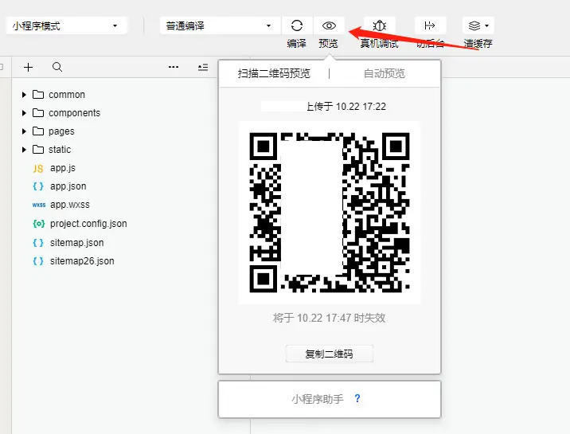

7. 在真机上，点击屏幕右上角的按钮打开的菜单里选择「打开调试」，会要求重新打开小程序，再次打开发现右下角会出现 vConsole 按钮，点击打开看到关于请求，报错，生命周期，系统等日志。

#### 微信开发者工具迎来2.0 Beta内测
此次从1.0升级为2.0版本，主要在于：
1. 更真：更接近真机表现，解决以往真机调试与真机表现存在差异
2. 更全：覆盖Canvas、Udp 等接口

具体查看这里《[真机调试2.0 更真更全更给力](https://mp.weixin.qq.com/s/2uOXv1CzmZwBMWBa9Bb4rQ)》。

## ios真机调试

HbuilderX 的调试对比 Xcode 等其他工具是非常简单了，跟着步骤提示来，你也可以成功

### Mac上真机调试

在 HbuilderX 编译器里面 点击 【运行】>> 【运行到手机或模拟器】>> 【运行设备**】在这里可以检测到在 itunes 关联的苹果手机：

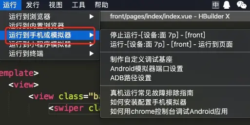

建立手机连接需要安装 HbuilderX 调试基座（iPhone_base.ipa）关联，根据提示点击安装在苹果手机：

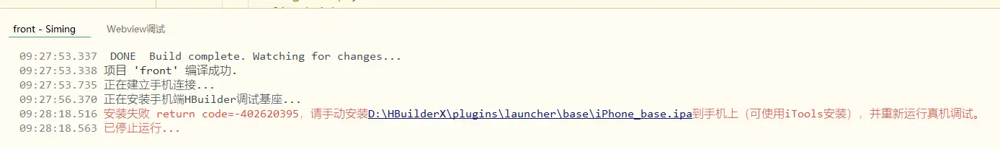

安装成功之后会，手机上可以看见 HbuilderX 图标，点开

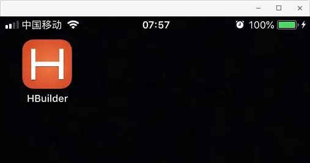

稍等片刻，HbuilderX 会开始打包代码同步到手机并运行

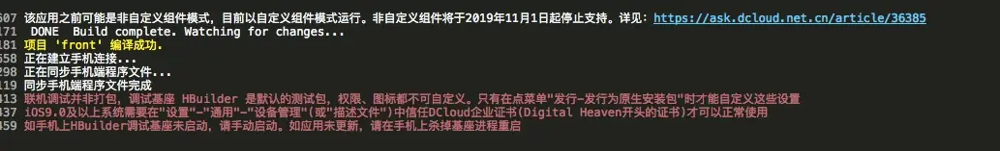

> Uniapp 提示 ios9.0 及以上系统需要在"设置"-"通用"-"设备管理"(或"描述文件")中信任 DCloud 企业证书( Digital Heaven 开头的证书)才可以正常使用，
> 我们需要在手机上打开该软件可能会显示此软件未受信任的情况，需要 【设置】>> 【通用】>>【设备管理】>> 进入设备管理页面，我们找到想要授信的企业级应用，直接点击打开，系统将会在 iPhone 上弹出一个提醒窗口，我们直接点击【信任】按钮即可

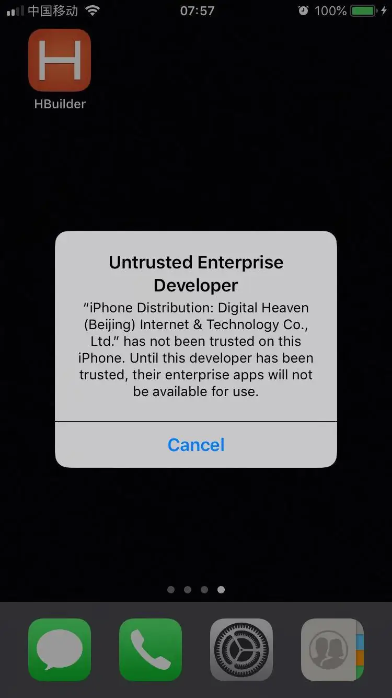

如无意外，编译成功：

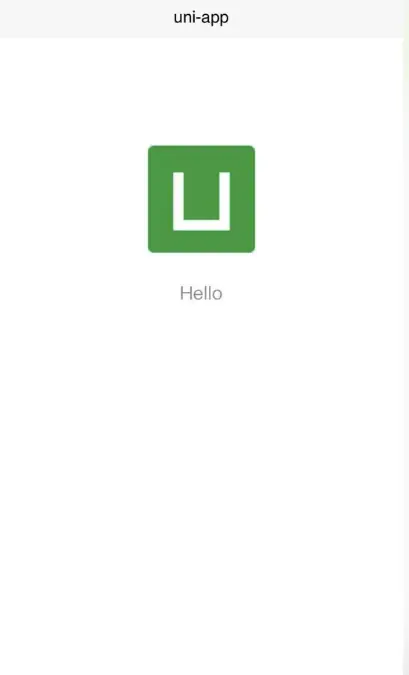

找到 HbuilderX 的调试小甲虫

点击会弹出窗口

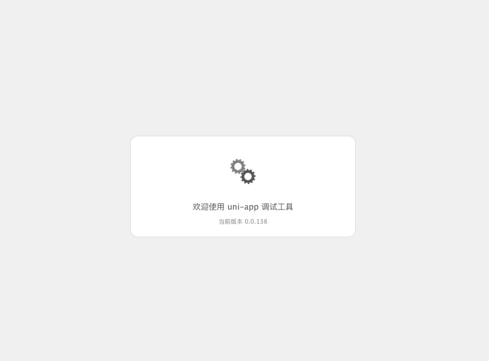

待打开就可以调试应用了

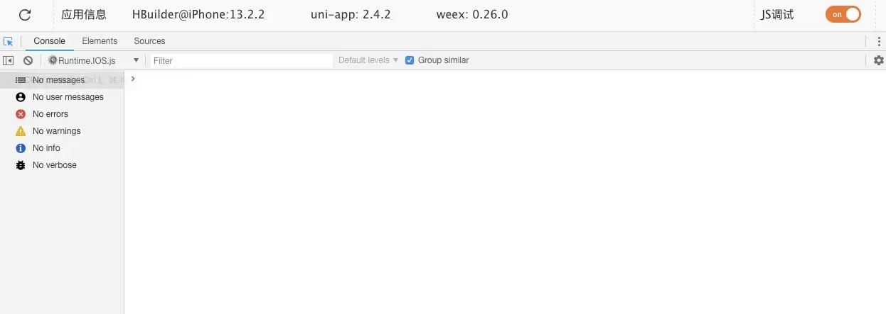

### Windows真机调试

和上文 Mac 调试基本相同，由于出生的不同，你可能需要安装 itunes 和 itools 

1. 下载安装 itunes

官网下载 [itunes](https://www.apple.com/itunes/)，选择自己电脑系统 window:

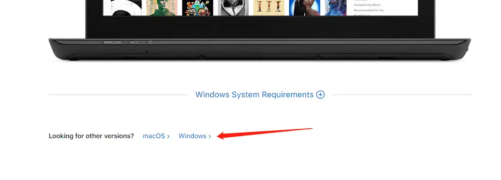

根据自己电脑系统32位或者64位进行下载：

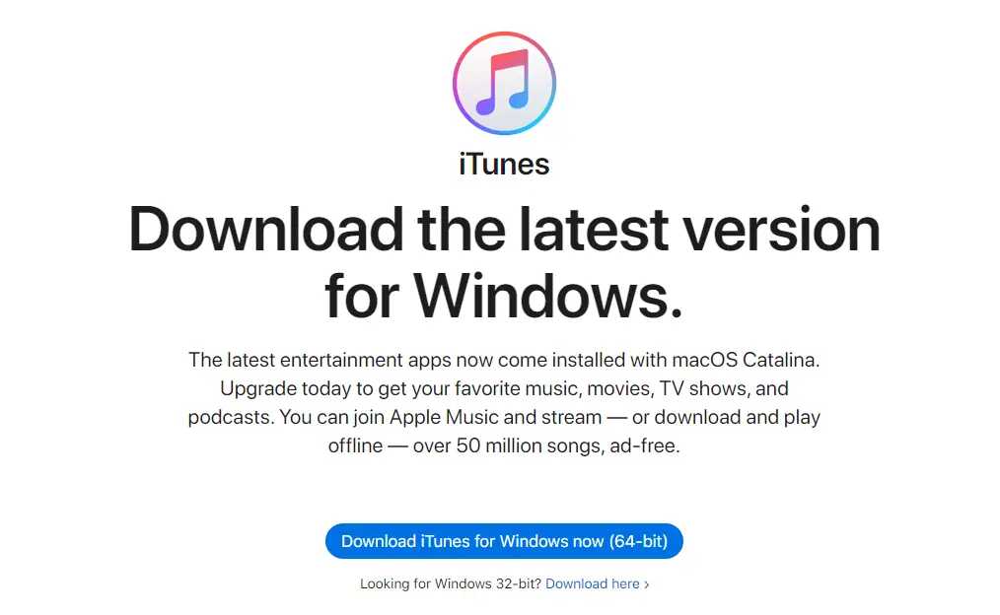

一路同意安装完成即可；

2. 下载安装 itools

[itools](http://www.itools.cn/) 进行安装本地应用然后再次重复上面运行步骤：

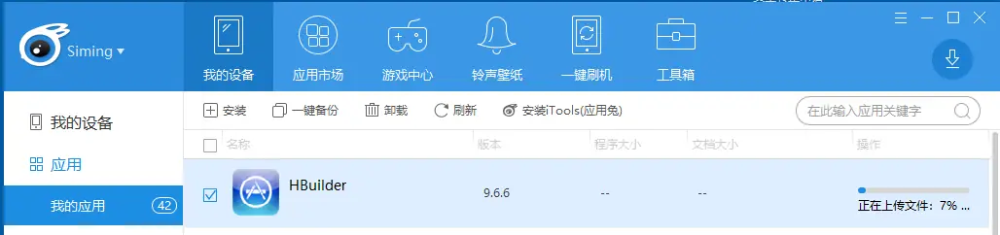

 
## 小结

本章主要介绍了小程序和 app 端调试配置，到这里基础章节就学完了，下一章我们将进入进阶实战，我会从项目分析，基础搭建和代码实战几方面完成一个真实的音乐项目，是不是有些按捺不住了，那就赶紧开始吧。